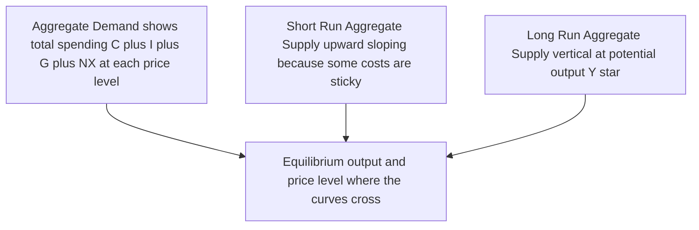
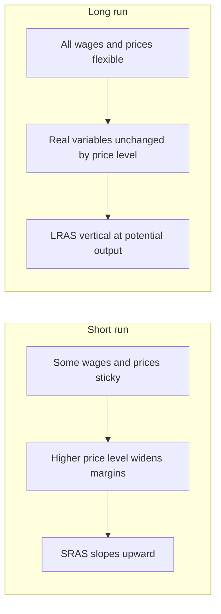
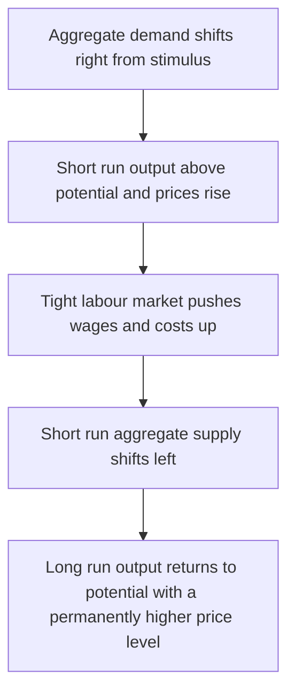

# Chapter 16 — Aggregate Demand and Aggregate Supply

## 1. The Problem / Need — A Supply-and-Demand Model for the Whole Economy

Chapter 2 gave you the single most powerful tool in microeconomics: a demand curve and a supply curve crossing to fix the price and quantity in *one* market — the market for onions, or oil, or apartments. But a fund manager, a central banker, or a bond strategist rarely worries about one market. They ask questions about the *whole* system at once:

- "If the RBI cuts rates by 50 basis points, what happens to output *and* inflation?"
- "Oil just jumped 40%. Does that raise prices, kill growth, or both?"
- "The government announced a huge fiscal stimulus. Will it boost GDP or just fuel inflation and push bond yields up?"
- "We're in a recession with rising prices at the same time — how is that even possible, and what should the central bank do?"

**The core problem is this: we need a single diagram that determines the economy's two most important numbers simultaneously — the total quantity of output (real GDP) and the overall price level (the source of inflation) — and that shows how shocks and policy move both at once.**

The micro supply-and-demand diagram cannot be lifted straight into macro. In one market, if the price of onions rises, buyers switch to tomatoes — the substitution logic that gives micro demand curves their slope. But at the level of the *whole economy* there is nothing to substitute *into*; "everything" has no substitute. So the macro version — the **Aggregate Demand–Aggregate Supply (AD-AS) model** — looks superficially like the micro picture (a downward demand curve, an upward supply curve, crossing at an equilibrium) but is built on completely different reasoning. Getting that reasoning right is what separates someone who can genuinely think about markets from someone parroting headlines.

Why a finance professional must own this model cold:

- **It is the master framework for every macro forecast.** Growth forecasts, inflation forecasts, and the interest-rate path all fall out of where AD and AS sit and how they are expected to move.
- **It tells you the direction of asset prices.** Whether a shock is good or bad for bonds, equities, and the currency depends entirely on *which curve* moved and *which way*. A demand shock and a supply shock of the same size can send bond yields in opposite directions.
- **It is the language of central banking.** Every RBI or Fed statement is, underneath, a story about aggregate demand, aggregate supply, and the gap between actual and potential output.
- **It resolves paradoxes** like stagflation — recession plus inflation — that break simpler mental models.

This chapter builds the model piece by piece, then uses it as a reasoning engine for the economy and for markets.

## 2. The Core Idea

**The AD-AS model plots the overall price level (P) on the vertical axis against real output / real GDP (Y) on the horizontal axis, and finds the economy's equilibrium where the aggregate demand curve crosses the aggregate supply curve.**

Three ideas make the model work, and each is a genuine departure from micro:

1. **Aggregate demand (AD)** slopes downward — a *lower* price level is associated with a *higher* total quantity of goods and services demanded — but for reasons that have nothing to do with substitution. The slope comes from wealth effects, interest-rate effects, and exchange-rate effects (Section 3).

2. **Aggregate supply has two faces.** In the **short run** the AS curve slopes upward: firms produce more when prices rise faster than their costs. In the **long run** the AS curve is *vertical*: output is fixed by the economy's productive capacity (labour, capital, technology) and does not depend on the price level at all. This split — the same economy has an upward-sloping supply curve over months and a vertical one over years — is the single most important insight in the chapter.

3. **The vertical long-run AS sits at "potential output"** (also called full-employment output or the natural level of output, denoted Y\*). This is the level the economy produces when all resources are used at their normal, sustainable rates. The gap between where the economy *actually* is and Y\* — the **output gap** — drives inflation and is the thing policymakers try to close.

Put those together and you get the model's central logic: **in the short run, demand shocks and policy move output *and* prices along an upward-sloping supply curve; in the long run, the economy always returns to potential output, and demand only determines the price level.** Money and demand can push output around temporarily, but cannot change how much an economy can produce permanently. That single sentence contains most of modern macroeconomics — and most of the debate between "stimulus works" and "stimulus just causes inflation."

*Figure 16.1 — The three building blocks of the AD-AS model and the equilibrium they jointly determine.*

## 3. How It Works — Why Each Curve Has the Shape It Does

### 3.1 Why aggregate demand slopes downward

Aggregate demand is total planned spending in the economy at each price level. It is built from the same four components as GDP by the expenditure method (Chapter 12): **AD = C + I + G + NX** — consumption, investment, government spending, and net exports. The question is: why does a *lower* price level raise the total quantity of these demanded? Three distinct channels, none of them "substitution":

- **The wealth effect (Pigou effect).** A lower price level raises the *real* value of money and fixed-value financial assets that households hold. If prices halve, the cash and bonds in your wallet buy twice as much — you feel richer, so you consume more. Higher C.

- **The interest-rate effect (Keynes effect).** A lower price level means households and firms need less money to conduct the same transactions. With less demand for money, the interest rate falls. Lower rates make borrowing cheaper and saving less attractive, so investment (I) and interest-sensitive consumption (cars, houses) rise. This is the most important channel for finance, because it is the bridge from the price level to interest rates.

- **The exchange-rate / net-exports effect (Mundell-Fleming effect).** The lower interest rate from the previous channel makes domestic assets less attractive to foreign capital; the currency depreciates. A weaker currency makes exports cheaper and imports dearer, so net exports (NX) rise.

All three push in the same direction: **lower P → higher quantity of real output demanded.** Hence AD slopes down. Crucially, these are *movements along* a fixed AD curve caused by a change in the price level. Anything *else* that changes spending — a tax cut, a confidence surge, a rate cut engineered by the central bank, a jump in export demand — **shifts the entire AD curve** (Section 4).

### 3.2 Why short-run aggregate supply slopes upward

In the short run, some prices and costs are **sticky** — they do not adjust immediately. The classic example is **wages fixed by contract**, but it also covers menu costs, long-term supplier contracts, and slow-moving expectations. Now suppose the overall price level rises unexpectedly. Firms receive higher prices for their output, but their biggest cost — wages — is still locked at the old level. Profit margins widen, so firms expand production and hire more. **Higher P → higher output, in the short run.** That is the upward slope of short-run aggregate supply (SRAS).

There are three standard "sticky" stories, all giving the same upward slope:

| Theory | The friction | Why higher P raises output |
|---|---|---|
| **Sticky-wage** | Nominal wages fixed by contract | Output price up, wage cost flat, margins widen, firms produce more |
| **Sticky-price** | Firms adjust prices slowly (menu costs) | Firms whose prices lag sell more when general prices rise |
| **Misperceptions** | Producers confuse a general price rise for a rise in *their* product's relative price | They mistakenly ramp up output |

The key phrase is *unexpectedly*. SRAS slopes up because prices moved relative to costs and expectations that had not yet caught up. Once wages and expectations adjust, the advantage disappears — which is exactly why the long-run curve is different.

### 3.3 Why long-run aggregate supply is vertical

Give the economy enough time and *all* prices and wages become flexible. Contracts expire and are renegotiated; workers demand wages that keep pace with prices; expectations catch up to reality. When *every* price and cost has adjusted proportionally, a doubling of the price level leaves every *real* variable unchanged — real wages, real margins, and therefore the real quantity firms want to produce. Output is then pinned down not by prices but by the economy's **real productive capacity**: the size and skill of the labour force, the stock of capital, and the level of technology.

That capacity level is **potential output, Y\***. Because output at full adjustment does not depend on P at all, the **long-run aggregate supply (LRAS) curve is a vertical line at Y\***. This is the macro embodiment of *money neutrality*: in the long run, changes in demand and the money supply affect only the price level, not real output. LRAS shifts only when the *real* determinants change — more workers, more capital, better technology, structural reforms — i.e., the things that constitute **long-run economic growth**.

*Figure 16.2 — The two time horizons of aggregate supply. Stickiness gives an upward short-run curve; full flexibility gives a vertical long-run curve.*

## 4. Full Content — Equilibrium, Shocks, Adjustment, and Gaps

### 4.1 Short-run equilibrium

The economy's short-run equilibrium is where AD crosses SRAS. That intersection simultaneously fixes:

- the **equilibrium price level** (P\*), and
- **equilibrium real output** (Y).

This is a genuine equilibrium in the sense that, at that price level, the total quantity of goods demanded equals the total quantity firms are willing to supply given their current sticky costs. But it is only a *short-run* rest point. Whether it can persist depends on how it sits relative to LRAS.

### 4.2 The three positions of the economy and the output gap

Overlay all three curves. Long-run equilibrium is the special case where AD, SRAS, and LRAS all cross at the *same* point — output equals potential (Y = Y\*) and there is no pressure for anything to change. But the short-run equilibrium can sit to the left or right of LRAS, producing an **output gap**:

- **Recessionary (negative) output gap:** short-run Y < Y\*. The economy is producing below capacity, unemployment is above its natural rate, factories run below normal, and there is downward pressure on prices and wages. This is a recession or a weak recovery.
- **Inflationary (positive) output gap:** short-run Y > Y\*. The economy is over-heating — running above its sustainable capacity, unemployment below its natural rate, overtime and bottlenecks everywhere — and there is *upward* pressure on prices and wages.
- **No gap:** Y = Y\*. Full-employment output, stable inflation.

The output gap is usually expressed as a percentage: (actual GDP − potential GDP) / potential GDP. It is the single most important number in practical macro-policy, because it drives inflation (via the Phillips-curve relationship of the next chapter) and tells the central bank whether to step on the accelerator or the brake. Note that potential output itself is *unobservable* and must be estimated — a source of real-world policy error, as we will see.

### 4.3 Demand shocks and the self-correction mechanism

Suppose aggregate demand *rises* — say a burst of consumer confidence, a fiscal stimulus, or a rate cut shifts AD to the right. Trace it through:

1. **Short run:** AD shifts right along the upward-sloping SRAS. Both output and the price level rise. The economy moves *above* potential — a positive output gap opens. Growth is strong and inflation ticks up. (Markets love this phase: rising earnings, rising prices — a "boom.")
2. **Adjustment:** with output above potential, labour and materials are scarce; workers negotiate higher wages and suppliers raise prices. Costs rise, so SRAS begins to shift *left*.
3. **Long run:** SRAS keeps shifting left until the economy returns to potential output Y\*. Output is back where it started; the *only* lasting effect of the demand boost is a **higher price level.** 

This is the model's most profound message and its **self-correction mechanism**: demand shocks move output only *temporarily*; in the long run they are fully absorbed into prices. A symmetric story runs for a *fall* in demand: output drops below potential, unemployment rises, and eventually wages and prices fall (or rise more slowly) until output recovers to Y\*. The catch is the *speed* of that self-correction: because wages are famously sticky *downward* (people resist pay cuts), the return from a recession can be painfully slow — which is the central Keynesian argument for using policy to close a negative gap rather than waiting.

*Figure 16.3 — How a positive demand shock plays out. Output rises then reverts to potential while the price level is permanently higher.*

### 4.4 Supply shocks and stagflation

Now shift the *supply* curve instead. An **adverse supply shock** — an oil-price spike, a crop failure, a war disrupting shipping, a jump in import prices from a currency collapse — raises firms' costs at every level of output, shifting SRAS *left*. Trace it through:

- The price level **rises** *and* output **falls** at the same time. This is **stagflation**: stagnation plus inflation, the toxic combination that simpler demand-only models say should be impossible.

Stagflation is the killer case that proves *why the AD-AS model needs a separate supply curve.* In a naive world where inflation only ever comes from "too much demand," you can never get rising prices alongside falling output — yet the 1970s oil shocks produced exactly that across the developed world. AD-AS explains it in one move: a leftward shift of supply.

Supply shocks create a genuine **policy dilemma** that demand shocks do not:

- If the central bank fights the *inflation* (tightens policy, shifts AD left), it deepens the *output* loss and worsens the recession.
- If it fights the *recession* (eases policy, shifts AD right), it entrenches the *inflation*.

There is no costless move — the central bank must choose which pain to accept. This is precisely why supply-driven inflation (like the 2021-23 episode, part energy shock, part supply-chain disruption) is so much harder for policymakers than demand-driven inflation.

A **favourable supply shock** runs the opposite way: a fall in oil prices, a good harvest, or a productivity leap shifts SRAS *right*, giving the happy combination of *higher* output and *lower* inflation — the "Goldilocks" economy that markets celebrate (as in the late-1990s US tech-productivity boom).

### 4.5 The full taxonomy of curve shifts

Being able to name what shifts each curve, and in which direction, is the practical core of the model. Consolidate it:

| Curve | Shifts RIGHT (expansionary / more) when… | Shifts LEFT (contractionary / less) when… |
|---|---|---|
| **AD** | Tax cuts; higher govt spending; rate cuts; money-supply growth; rising confidence; wealth gains; weaker currency; stronger foreign demand | Tax hikes; austerity; rate hikes; falling confidence; asset-price crashes; stronger currency; weak foreign demand |
| **SRAS** | Lower input/oil/wage costs; weaker-than-expected inflation; favourable supply shock | Higher oil/input/wage costs; rising inflation expectations; adverse supply shock; new taxes on production |
| **LRAS** | More labour, more capital, better technology, productivity gains, pro-growth reforms | Ageing/shrinking workforce, capital destruction (war/disaster), falling productivity |

Two subtleties worth internalising. First, a change in **inflation expectations** shifts SRAS: if workers expect 8% inflation, they demand 8% raises, raising costs and shifting SRAS left *before* any actual demand change — this is how inflation becomes self-fulfilling and why central-bank credibility (anchoring expectations) matters so much. Second, LRAS shifts are the *only* way to raise living standards permanently; everything on the AD side is ultimately about *when* you produce, not *how much you can* produce.

## 5. Real Examples — The Model at Work in Markets

### Example 1 — India's 2020 COVID collapse and recovery (a demand-and-supply shock combined)

The pandemic was a rare *simultaneous* shock to both curves. Lockdowns shut factories and broke supply chains (SRAS left) while collapsing incomes and confidence crushed spending (AD left). Indian real GDP fell roughly 24% year-on-year in the April-June 2020 quarter — a massive negative output gap. The policy response was textbook: the RBI cut the repo rate to 4% and flooded the system with liquidity (pushing AD right), while the government layered on fiscal support. As the economy reopened, AD recovered faster than fully-healed supply chains, and by 2021-22 the *demand* recovery collided with *global supply* constraints, feeding the inflation that pushed the RBI to start hiking in 2022. **Market read:** bond yields fell during the 2020 demand collapse (recession → rate cuts → lower yields) and rose through 2022 as the positive output gap and supply-side inflation forced tightening — a clean illustration of how the *cause* of the move (which curve, which way) drives the direction of yields.

### Example 2 — The 1970s oil shocks and the birth of stagflation

In 1973 OPEC quadrupled oil prices; in 1979 prices spiked again. Both were textbook adverse SRAS shocks: input costs soared, SRAS lurched left, and the developed world got *rising* inflation with *rising* unemployment — stagflation. This shattered the prevailing belief (the simple Phillips-curve idea) that inflation and unemployment always move in opposite directions. **Market read:** equities did terribly (both falling growth *and* rising discount rates), nominal bonds were destroyed by unexpected inflation, and *real* assets — gold, commodities — were the winners. The episode is why the AD-AS model insists on a separate supply curve, and why supply-shock inflation still terrifies central bankers: fighting it with rate hikes (the Volcker Fed, 1979-82) required deliberately engineering a deep recession to shift AD left and break inflation expectations.

### Example 3 — The 2020-23 global inflation and the "demand vs supply" debate

The post-COVID inflation surge triggered the defining macro argument of the decade, framed *entirely* in AD-AS terms. One camp said it was a **demand** story — enormous fiscal transfers and easy money shifted AD right into a positive output gap. The other said it was a **supply** story — snarled shipping, chip shortages, and (after February 2022) the Russia-Ukraine energy shock shifting SRAS left. The distinction was not academic: a pure demand overheating calls for aggressive rate hikes; a pure supply shock arguably calls for patience (since the central bank cannot manufacture semiconductors). The Fed and RBI ultimately judged it *mostly demand-plus-expectations-risk* and hiked hard — the fastest tightening cycle in decades. **Market read:** the "which curve" question literally determined trillions in bond-market repricing; strategists who correctly diagnosed a demand-driven, expectations-threatening episode positioned for higher yields and won.

### Example 4 — A fiscal stimulus and the bond market (the everyday application)

When a government announces a large deficit-financed spending package, AD shifts right. In the short run: more growth, more inflation, and — because higher demand plus government borrowing raises interest rates — **bond yields rise** (prices fall). This is the routine logic behind the market's allergic reaction to unfunded fiscal expansions (the UK "mini-budget" of September 2022 being the extreme case, where a large unfunded tax cut triggered a gilt-market rout within days). **Market read:** "fiscal stimulus → AD right → higher output, higher inflation, higher yields" is one of the most reliable one-line forecasts in macro trading, precisely because it falls straight out of the model.

## 6. Connections — Where This Sits in the Macro-Finance Web

- **To GDP (Chapter 12):** The horizontal axis of AD-AS *is* real GDP, and AD is literally the C + I + G + NX of the expenditure method turned into a curve. AD-AS is the engine that *determines* the GDP that national-income accounting merely *measures*.
- **To inflation and the Phillips curve (next chapter):** The output gap in AD-AS is the driver of inflation. A positive gap (Y > Y\*) generates rising inflation; this is the AD-AS foundation on which the Phillips curve (unemployment vs inflation) is built.
- **To monetary policy (interest-rate chapters):** Central banks operate almost entirely on the **AD** curve. Rate cuts, QE, and forward guidance shift AD right; hikes and QT shift it left. The whole art of a central bank is nudging AD so that the short-run equilibrium sits at Y\* — closing the output gap without over- or under-shooting.
- **To fiscal policy:** Government spending (G) and taxes (which affect C and I) are the fiscal levers on AD. The "fiscal multiplier" debate is a debate about *how far* AD shifts per rupee of spending.
- **To long-run growth (Solow / growth chapters):** LRAS *is* the production capacity that growth theory explains. Everything AD does is short-run cyclical; LRAS is the long-run trend line the cycle oscillates around.
- **To bonds, equities, and currencies:** The model is the master map for asset allocation. Demand-up shocks → equities up, yields up, currency mixed. Adverse supply shocks → equities down, yields up, real assets up. Positive supply shocks → the Goldilocks combination equities love. Every macro trade is, at heart, a bet on which curve moves next.

## 7. Key Terms

- **Aggregate demand (AD):** Total planned real spending in the economy (C + I + G + NX) at each price level; slopes downward.
- **Aggregate supply (AS):** Total real output firms are willing to produce at each price level.
- **Short-run aggregate supply (SRAS):** Upward-sloping AS curve, arising because some wages/prices are sticky.
- **Long-run aggregate supply (LRAS):** Vertical AS curve at potential output; reflects that real output is independent of the price level once everything adjusts.
- **Potential output (Y\*):** The sustainable full-employment level of real GDP; where LRAS sits.
- **Output gap:** Actual GDP minus potential GDP, as a % of potential. Positive = overheating; negative = recessionary.
- **Recessionary gap:** Y below potential; excess unemployment; downward price pressure.
- **Inflationary gap:** Y above potential; over-heating; upward price pressure.
- **Demand shock:** Anything that shifts AD (fiscal, monetary, confidence, wealth, external).
- **Supply shock:** Anything that shifts SRAS (oil, wages, input costs, expectations, disruptions).
- **Stagflation:** Simultaneous stagnation (falling output/rising unemployment) and inflation; caused by an adverse supply shock.
- **Self-correction mechanism:** The process by which sticky prices/wages eventually adjust, returning the economy to Y\* after a demand shock.
- **Money neutrality:** The long-run principle that changes in the money supply / demand affect only the price level, not real output.
- **Inflation expectations:** Beliefs about future inflation; when they rise they shift SRAS left and can become self-fulfilling.

## 8. Common Confusions

- **"Macro AD slopes down for the same reason micro demand does."** No. Micro demand slopes down because buyers *substitute* to other goods when a price rises. There is no economy-wide substitute, so macro AD slopes down for three entirely different reasons: the wealth, interest-rate, and exchange-rate effects.

- **"A movement along AD is the same as a shift of AD."** A change in the *price level* moves you *along* a fixed AD curve. A change in anything *else* (taxes, rates, confidence, exports) *shifts* the whole curve. Confusing the two is the single most common exam and analysis error.

- **"AS is one curve."** The whole point is that AS has two shapes over two horizons: upward-sloping in the short run (sticky costs), vertical in the long run (full flexibility). Which one is relevant depends on the time frame of the question.

- **"Demand can boost output permanently."** In the short run, yes; in the long run, no. Once wages and expectations catch up, a demand boost is fully absorbed into higher prices and output returns to Y\*. Only LRAS shifts (real capacity) raise output permanently.

- **"Inflation always means the economy is overheating."** Demand-pull inflation does mean a positive output gap. But **cost-push / supply-shock inflation** comes with *falling* output (stagflation). Same symptom (rising prices), opposite diagnosis and opposite cure — which is why identifying *which curve moved* is everything.

- **"Potential output is a known, fixed number."** It is unobservable and must be *estimated*, and estimates get revised heavily. Policymakers who mis-estimate Y\* (thinking the economy has more or less slack than it does) make systematic policy errors — a real-world source of both inflation and unnecessary recessions.

- **"Supply shocks are always oil."** Oil is the classic example, but any economy-wide cost change qualifies: wage explosions, currency collapses that raise import prices, natural disasters, pandemics, new production taxes, or — favourably — productivity booms and good harvests.

## 9. Recap

The AD-AS model is the master framework of short-run macroeconomics, determining real output and the price level together. **Aggregate demand** slopes downward — not from substitution but from wealth, interest-rate, and exchange-rate effects — and is shifted by fiscal policy, monetary policy, confidence, and external demand. **Aggregate supply has two horizons:** an upward-sloping short-run curve, because sticky wages and prices let higher output prices widen margins, and a *vertical* long-run curve at **potential output**, because once everything adjusts, real output depends only on real capacity, not on prices. Where AD meets SRAS sets the short-run equilibrium; its position relative to vertical LRAS defines the **output gap** — recessionary if below potential, inflationary if above. **Demand shocks** move output and prices together in the short run but are fully absorbed into prices in the long run via the self-correction mechanism, leaving output back at potential. **Supply shocks** move output and prices in *opposite* directions — an adverse one gives **stagflation** and forces a painful policy dilemma with no costless option. The model's payoff for finance is that the *direction* of asset prices depends on *which curve moved and which way*: correctly diagnosing demand-versus-supply is the difference between forecasting rising yields and falling ones.

## 10. Quick-Reference / Interview Points

- **The model in one line:** Price level on the vertical axis, real GDP on the horizontal; equilibrium where AD meets AS.
- **Why AD slopes down (three effects):** Wealth (Pigou), interest-rate (Keynes), exchange-rate (Mundell-Fleming). *Not* substitution.
- **AD components:** C + I + G + NX. Same as GDP by expenditure.
- **SRAS slopes up because** some wages/prices are sticky, so a higher price level widens margins and firms produce more.
- **LRAS is vertical at Y\*** because in the long run all prices are flexible and real output depends only on labour, capital, and technology — money neutrality.
- **Output gap = (actual − potential) / potential.** Positive = overheating → inflation; negative = recession → unemployment.
- **Demand shock:** output and prices move the *same* way. Long-run effect on output = zero; only the price level changes.
- **Supply shock:** output and prices move *opposite* ways. Adverse = stagflation (the case that requires a separate supply curve).
- **Self-correction:** after a demand shock, sticky wages/prices eventually adjust and Y returns to Y\* — but *slowly*, especially downward (the case for active policy).
- **Policy mapping:** Monetary and fiscal policy work on **AD**; only structural reforms and growth shift **LRAS**.
- **The stagflation dilemma:** fighting supply-shock inflation deepens the recession; fighting the recession entrenches inflation. No free move.
- **Market cheat-sheet:** Demand up → growth, inflation, yields up, equities up. Adverse supply → stagflation, yields up, equities down, real assets/gold up. Positive supply → Goldilocks, equities up, inflation and yields down.
- **The one question that decides the trade:** *Which curve moved, and which way?* Everything about the market reaction follows from the answer.
- **Killer interview soundbite:** "Demand shocks move output and prices in the same direction and vanish in the long run; supply shocks move them in opposite directions and force a genuine policy trade-off — that's why identifying the shock, not just the inflation number, is what matters."
