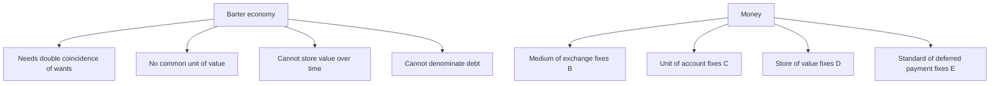
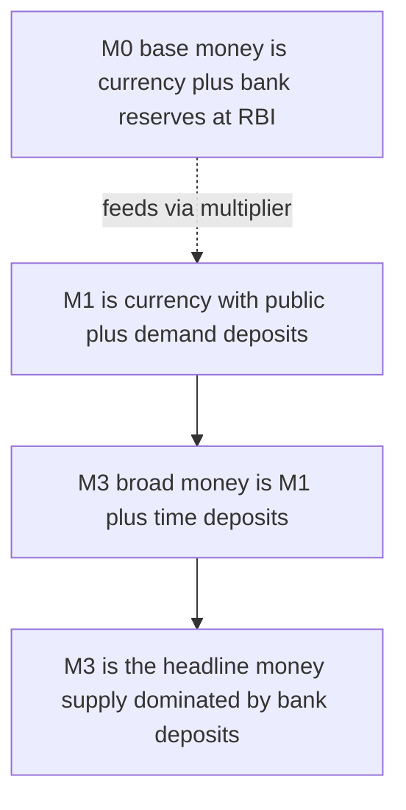
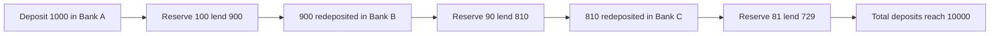
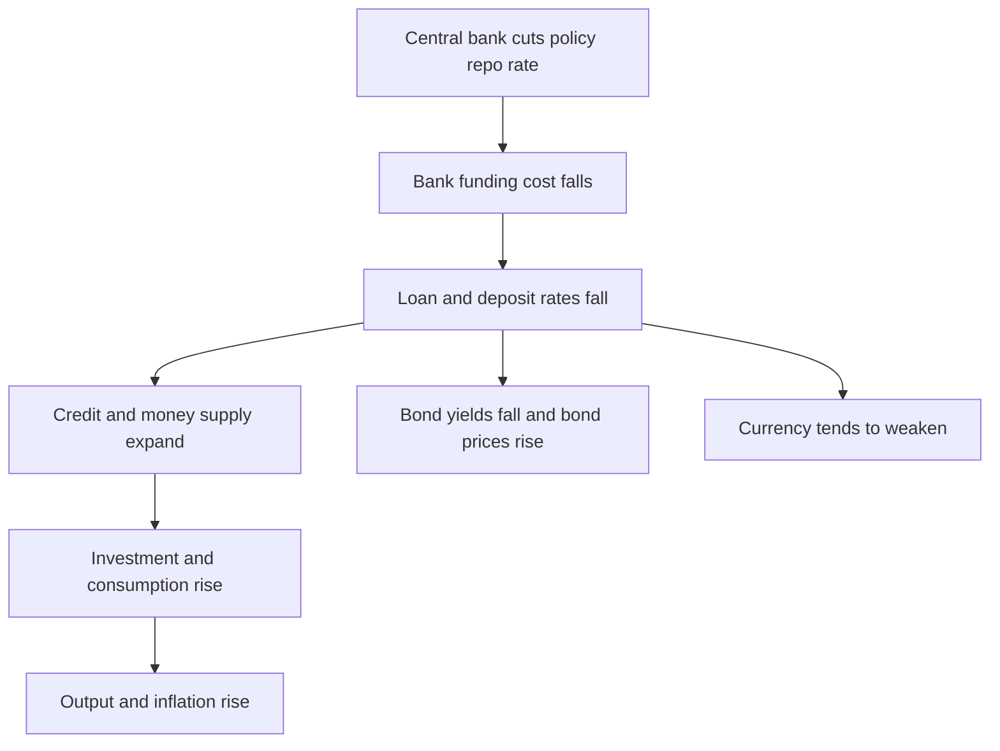

# Chapter 17 — Money, Banking and Central Banks

## 1. The Problem / The Need

Imagine an economy without money. A wheat farmer wants shoes. The cobbler wants rice, not wheat. So the farmer must first find a rice grower who wants wheat, swap wheat for rice, then find the cobbler, and hope the cobbler still has shoes left. Every transaction requires a **double coincidence of wants** — both parties must want exactly what the other offers, in the right quantity, at the right time. This is *barter*, and it collapses under its own friction as an economy grows. Trade grinds to walking pace.

Barter has four deep failures:

- **No double coincidence of wants** — matching buyers and sellers is combinatorially hard.
- **No common measure of value** — is one goat worth 40 kg of wheat or 60? Every pair of goods needs its own exchange rate. For *n* goods you need *n(n-1)/2* prices; money collapses this to just *n* prices.
- **No store of value** — you cannot save a truckload of tomatoes for retirement; they rot.
- **No standard of deferred payment** — lending and borrowing across time is impossible without a stable unit to denominate debt.

Money is the technology that solves all four at once. And once money exists, a second question immediately follows: *who controls how much of it there is?* Too little money and trade chokes (deflation, depression); too much and money loses value (inflation). That control problem is what gives rise to **banks** — which create most of the money in a modern economy — and **central banks**, which sit at the apex managing the quantity and price of money for the whole system.

For a finance professional, this chapter is bedrock. The **repo rate** the RBI sets, the **fed funds rate** traders obsess over, the **liquidity** that makes bond markets function, the **credit growth** that drives bank stock valuations — all of it is downstream of money, banking, and central banking. You cannot read a bond yield, forecast a currency, or value a bank without this machinery.

*Figure 17.1 — Barter's frictions versus what money solves.*

---

## 2. The Core Idea

**Money is anything widely accepted as final settlement of a debt or payment.** It is defined not by what it is made of — gold, paper, or a database entry — but by what it *does*. Economists define money by its four **functions**:

1. **Medium of exchange** — it sits between the two halves of a trade, so you never need a double coincidence of wants. This is money's defining function; the other three follow from it.
2. **Unit of account** — it is the yardstick in which all prices, debts, and profits are measured. India's unit of account is the rupee even when a transaction is settled in gold or a bank transfer.
3. **Store of value** — it carries purchasing power into the future. It is an imperfect store (inflation erodes it) but a *liquid* one — instantly spendable.
4. **Standard of deferred payment** — loans, bonds, salaries, and contracts are written in money terms, enabling credit and the entire financial system.

The second core idea, which surprises most beginners, is that **most money in a modern economy is not printed by the government — it is created by commercial banks when they make loans.** Physical cash (notes and coins) is a small fraction of the money supply. The rest is *bank deposits* — numbers in databases — conjured into existence through lending. Understanding *how* banks create money, and how the central bank *controls* that creation, is the intellectual core of this chapter.

A useful distinction: money's *value* today rests on **fiat** — Latin for "let it be done." Modern money has no gold backing. A ₹500 note is worth ₹500 because the government declares it **legal tender** and, crucially, because everyone else accepts it. Money is a **social convention backed by law and trust**. When trust collapses (Zimbabwe 2008, Weimar Germany 1923), the paper becomes worthless regardless of what the law says.

---

## 3. How It Works — Money in Layers

Because money ranges from cash-in-hand (perfectly spendable) to a five-year fixed deposit (spendable only with a penalty and delay), economists sort it into **monetary aggregates** ordered by liquidity. Narrow aggregates count only the most liquid instruments; broad aggregates add progressively less-liquid ones.

### India's monetary aggregates (RBI definitions)

| Aggregate | Also called | Contents | Liquidity |
|---|---|---|---|
| **M0** | Reserve money / High-powered money / Monetary base | Currency in circulation + bankers' deposits with RBI + other deposits with RBI | Highest — this is central-bank money |
| **M1** | Narrow money | Currency with public + demand deposits with banks + other deposits with RBI | Very high — instantly spendable |
| **M2** | — | M1 + savings deposits with post office savings banks | High |
| **M3** | Broad money | M1 + time (fixed) deposits with banks | Broad — the headline "money supply" |
| **M4** | — | M3 + all post office deposits (excl. NSCs) | Broadest |

The two you must know cold are **M0** and **M3**.

- **M0 (reserve money / monetary base)** is money the *central bank* creates directly. It is currency in circulation plus the reserves commercial banks hold at the RBI. It is called **high-powered money** because each unit can support several units of broad money through the multiplier (Section 4).
- **M3 (broad money)** is the headline measure economists mean by "the money supply." In India, M3 is dominated by bank deposits — currency is only a slice. This tells you immediately that *banks*, not the printing press, drive the bulk of money.

**M1 vs M3 matters for markets.** M1 (transaction money) rising fast signals spending momentum; M3 captures the total credit-and-deposit engine. The **money multiplier = M3 / M0** tells you how many rupees of broad money the banking system builds on each rupee of base money.

### The Fed's equivalents

The US uses different labels but the same logic:

| US measure | Rough contents | India analogue |
|---|---|---|
| **Monetary base** | Currency + bank reserves at the Fed | M0 |
| **M1** | Currency + demand/checkable deposits + savings deposits (since 2020) | M1 |
| **M2** | M1 + small time deposits + retail money-market funds | ≈ M3 |

The Fed stopped emphasising M3 in 2006 and now watches M2. Definitions differ by country, but the *ordering principle* — most liquid to least liquid — is universal.

*Figure 17.2 — Aggregates nested from narrow to broad. Each larger circle contains the smaller plus less-liquid instruments.*

---

## 4. Full Content

### 4.1 Money creation and the fractional-reserve system

Here is the engine room. Banks operate on **fractional-reserve banking**: they keep only a *fraction* of deposits as reserves and lend out the rest. This single fact is why banks can *create* money.

Walk through it. Suppose the required reserve ratio is 10%.

1. You deposit ₹1,000 cash in Bank A. Bank A now has a ₹1,000 deposit (its liability) and ₹1,000 cash (its asset).
2. Bank A must keep 10% (₹100) as reserves but can lend ₹900. It lends ₹900 to a borrower.
3. The borrower spends the ₹900; the recipient deposits it in Bank B. Bank B keeps ₹90, lends ₹810.
4. That ₹810 gets deposited in Bank C, which keeps ₹81 and lends ₹729. And so on.

Total deposits created across the whole banking system:

₹1,000 + ₹900 + ₹810 + ₹729 + … = ₹1,000 × (1 / 0.10) = **₹10,000.**

The original ₹1,000 of *base money* supported ₹10,000 of *deposits*. The banking system created ₹9,000 of new money — not by printing, but by lending. Each loan creates a matching deposit. **Loans create deposits**, reversing the intuitive story that banks lend out money savers deposit. In aggregate, the act of lending *is* the act of money creation.

*Figure 17.3 — The deposit-multiplier cascade with a 10 percent reserve ratio.*

### 4.2 The money multiplier

The **money multiplier** links base money (M0) to broad money (M3):

**Money supply = Money multiplier × Monetary base**, so **multiplier = M3 / M0.**

The simple textbook multiplier is **1 / reserve ratio**. With a 10% reserve ratio, the multiplier is 10. But the real-world multiplier is smaller because of two **leakages**:

- **Cash drain (currency preference):** the public holds some money as cash instead of redepositing it, so not every loaned rupee re-enters a bank.
- **Excess reserves:** banks may hold reserves *above* the legal minimum (for safety or because loan demand is weak), lending less than the maximum.

A more complete formula incorporating the currency-to-deposit ratio (c) and the reserve ratio (r) is:

**Money multiplier = (1 + c) / (r + c)**

The larger the public's cash preference (c) or the reserve ratio (r), the *smaller* the multiplier. This is why, after the 2008 crisis and again in 2020, central banks flooded banks with reserves (huge M0 growth) but broad money grew far less — banks sat on excess reserves and the multiplier collapsed. **The central bank controls the base; the multiplier depends on bank and public behaviour, which the central bank cannot fully command.** This is the single most important nuance in monetary policy: pushing on the base is like pushing on a string if banks won't lend.

**India's reserve requirements** come in two forms:

- **CRR (Cash Reserve Ratio):** the fraction of deposits banks must park as cash reserves with the RBI, earning no interest. Raising CRR drains lendable funds and shrinks the multiplier.
- **SLR (Statutory Liquidity Ratio):** the fraction of deposits banks must hold in safe liquid assets — mainly government securities, gold, cash. SLR both prunes lending capacity and creates captive demand for government bonds (a key link to the bond market).

### 4.3 The role of commercial banks

Commercial banks perform functions no other institution combines:

- **Financial intermediation:** channelling savings from surplus units (depositors) to deficit units (borrowers), pricing and bearing credit risk.
- **Money creation:** as shown, lending expands the deposit money supply.
- **Maturity transformation:** funding long-term loans (a 20-year mortgage) with short-term liabilities (deposits withdrawable on demand). This is profitable but fragile — the seed of **bank runs**.
- **Payment system:** operating the rails — cheques, NEFT, RTGS, UPI, cards — on which the economy settles.
- **Liquidity provision:** offering credit lines and overdrafts that let firms manage cash flow.

A bank's balance sheet is the key to understanding its risks. **Assets** are loans and securities (what the bank owns / is owed). **Liabilities** are deposits and borrowings (what the bank owes). The gap — **equity capital** — absorbs losses. Because banks are highly leveraged (equity may be under 10% of assets), a small percentage loss on assets can wipe out capital. This is why **capital adequacy** (the Basel III framework, minimum capital ratios) and **liquidity buffers** are so heavily regulated.

Two failure modes haunt banking:

- **Liquidity crisis:** the bank is solvent (assets > liabilities) but cannot meet withdrawals *right now* because its assets are locked in illiquid loans. A **bank run** — depositors rushing to withdraw — can turn a healthy bank insolvent. Silicon Valley Bank (March 2023) failed this way: a deposit run forced fire-sales of bonds.
- **Solvency crisis:** the bank's assets are genuinely worth less than its liabilities (bad loans, NPAs). India's public-sector banks carried a heavy **non-performing asset (NPA)** burden through 2015–2019, requiring government recapitalisation.

### 4.4 The central bank and its functions

The **central bank** is the bankers' bank and the state's monetary authority. India's is the **Reserve Bank of India (RBI)**, established 1935; the US has the **Federal Reserve System** ("the Fed"), created 1913. Their core functions:

1. **Issuer of currency / monopoly of note issue.** The central bank has the sole legal right to print banknotes (in India the RBI issues all notes except the ₹1 note and coins, which the Government issues). This makes central-bank money the ultimate settlement asset.
2. **Banker to the government.** It manages the government's accounts, its borrowing (issuing G-secs), and public debt.
3. **Banker to banks and lender of last resort.** Banks hold reserve accounts at the central bank and settle among themselves there. In a crisis, the central bank lends to solvent-but-illiquid banks to stop panic — the classic **lender of last resort** role (Bagehot's rule: lend freely, against good collateral, at a penalty rate).
4. **Custodian of foreign-exchange reserves** and manager of the exchange rate. The RBI holds India's FX reserves (over USD 600 billion) and intervenes in currency markets to smooth rupee volatility.
5. **Monetary policy and price stability.** The headline function: setting the policy interest rate to control inflation and support growth. India adopted a formal **inflation-targeting** framework in 2016 — target **4% CPI inflation, band ±2%** — decided by a **Monetary Policy Committee (MPC)**. The Fed has a **dual mandate**: maximum employment *and* price stability (targeting ~2% PCE inflation).
6. **Regulator and supervisor** of banks and much of the financial system, safeguarding stability.

### 4.5 The instruments of monetary policy

How does a central bank actually move the money supply and interest rates?

- **Policy rate (repo rate):** the rate at which the RBI lends short-term to banks against government securities. It is the anchor of all interest rates. Cutting the repo rate lowers banks' funding cost, pulling down loan and deposit rates across the economy. The **reverse repo** / **SDF (Standing Deposit Facility)** is the rate the RBI *pays* banks to park surplus funds — the floor of the corridor. The **MSF (Marginal Standing Facility)** is the ceiling. Together they form the **Liquidity Adjustment Facility (LAF) corridor**, within which the overnight market rate is steered.
- **Open Market Operations (OMOs):** buying or selling government bonds to inject or drain reserves. Buying bonds *injects* liquidity (money supply up, yields down); selling *drains* it.
- **Reserve ratios (CRR / SLR):** blunt tools that directly change how much banks can lend.
- **Quantitative easing (QE):** large-scale asset purchases used when policy rates hit zero (the Fed post-2008 and post-2020), expanding the monetary base massively to force down long-term yields.

*Figure 17.4 — Transmission from a policy-rate cut to the real economy.*

### 4.6 The money market linkage

The **money market** is the market for very short-term debt (maturities under one year). It is where the central bank's policy rate meets the real economy — the *first* link in the transmission chain. Key Indian instruments:

- **Call money / notice money:** unsecured interbank borrowing, often overnight. The **weighted average call rate (WACR)** is the RBI's *operating target* — it steers WACR to sit near the repo rate.
- **Treasury Bills (T-bills):** short-term government paper (91, 182, 364 days), risk-free, the benchmark for short rates.
- **Commercial Paper (CP):** unsecured short-term corporate borrowing — a cheaper alternative to bank loans for top-rated firms.
- **Certificates of Deposit (CDs):** short-term deposits issued by banks.
- **Repo market:** collateralised (against G-secs) short-term lending, the plumbing of institutional liquidity.

The linkage works like this: the central bank changes the **policy rate** → this moves the **overnight call/repo rate** → which resets short-term money-market rates (T-bills, CP, CDs) → which feeds into banks' **cost of funds** → which sets **lending and deposit rates** → which finally influences **investment, consumption, bond yields and the currency**. The money market is the *transmission belt*. If the money market is illiquid or segmented, the belt slips and policy fails to reach the economy — which is why central banks manage **systemic liquidity** so carefully (through OMOs, VRR/VRRR auctions, and the LAF).

---

## 5. Real Examples (Finance / Market Relevance)

**1. RBI's COVID liquidity flood and the multiplier that wouldn't fire (2020).** In March–May 2020 the RBI cut the repo rate to 4%, slashed CRR from 4% to 3%, and launched targeted long-term repos (TLTROs) — pumping reserve money (M0) up sharply. Yet broad-money (M3) growth and, especially, *credit* growth stayed muted for months: risk-averse banks parked record surpluses back at the RBI under the reverse repo rather than lending. This is the **money multiplier collapsing** in real time — base money surged but the multiplier fell, so M3 rose far less than M0. For a bond trader it meant G-sec yields fell (excess liquidity chasing safe assets); for a bank-equity analyst it meant net interest margins compressed and loan growth disappointed. It is the textbook "pushing on a string" problem.

**2. The Fed's rate-hike cycle and global markets (2022–2023).** When US inflation hit 9%, the Fed raised the fed funds rate from ~0% to over 5% in 15 months and shrank its balance sheet (quantitative tightening — draining the monetary base). Consequences rippled worldwide: US Treasury yields spiked (bond prices crashed — 2022 was the worst year for bonds in decades), the dollar surged (DXY to 20-year highs, pressuring the rupee toward ₹83/USD), and emerging-market central banks including the RBI hiked to defend their currencies. This shows the money-market → bond → currency chain operating globally, and why finance professionals watch every Fed meeting.

**3. Silicon Valley Bank and the bank-run mechanics (March 2023).** SVB had taken deposits and bought long-dated US Treasuries and mortgage bonds. When the Fed hiked, those bonds' market value fell (bond prices move inversely to yields), creating large *unrealised losses*. Depositors — concentrated tech startups — panicked and pulled USD 42 billion in a single day. The bank, solvent on paper but unable to liquidate assets without crystallising losses, collapsed in 48 hours. It is a live demonstration of **maturity transformation risk**, **mark-to-market losses on bank bond books**, and how a **liquidity crisis** becomes a solvency event. It also forced the Fed into lender-of-last-resort mode (the BTFP facility) to stop contagion.

**4. UPI and the changing composition of money in India.** India's Unified Payments Interface has shifted transactions from cash toward digital bank-deposit money at extraordinary scale (over 10 billion transactions a month by 2024). This raises the velocity and traceability of deposit money and gradually lowers the public's currency-to-deposit ratio (c) — which, per the multiplier formula, tends to *raise* the money multiplier over time. It also underpins the RBI's exploration of a **Central Bank Digital Currency (the digital rupee / e₹)**, a direct central-bank liability that could reshape the very definition of M0.

---

## 6. Connections

- **To bonds and interest rates (Chapters on fixed income):** the policy rate anchors the entire yield curve's short end; OMOs and QE directly move bond prices. SLR creates captive bank demand for G-secs.
- **To inflation (macro chapters):** money supply growth well above real output growth is, over the long run, inflationary — the **quantity theory of money** (MV = PY). Central banking is ultimately about managing this.
- **To exchange rates:** relative money-supply and interest-rate policies drive currency values; the RBI's FX intervention links monetary policy to the rupee.
- **To equities:** bank stocks are pure plays on credit growth, net interest margins, and NPAs — all downstream of this chapter. Liquidity conditions ("easy money") also inflate broad asset valuations.
- **To fiscal policy:** the central bank is banker to the government; deficit financing, bond issuance, and monetary policy interact (and can conflict — "fiscal dominance").
- **To financial stability and regulation:** Basel III capital rules, deposit insurance (DICGC in India), and the lender-of-last-resort function all exist to manage the fragility of fractional-reserve banking.

---

## 7. Key Terms

- **Fiat money:** money with value by government decree and social trust, not commodity backing.
- **Legal tender:** money that must legally be accepted in settlement of debt.
- **M0 / reserve money / high-powered money / monetary base:** currency in circulation plus bank reserves at the central bank.
- **M1 (narrow money):** currency with public + demand deposits — instantly spendable money.
- **M3 (broad money):** M1 + time deposits; the headline money supply.
- **Fractional-reserve banking:** system where banks hold only a fraction of deposits as reserves and lend the rest.
- **Money multiplier:** ratio of broad money to base money (M3/M0); simple version 1/reserve ratio.
- **CRR (Cash Reserve Ratio):** fraction of deposits banks must hold as cash reserves at the RBI.
- **SLR (Statutory Liquidity Ratio):** fraction of deposits banks must hold in liquid safe assets (mainly G-secs).
- **Repo rate:** the central bank's key policy lending rate against government collateral.
- **Reverse repo / SDF / MSF:** the floor and ceiling of the LAF corridor around the repo rate.
- **Open Market Operations (OMO):** central-bank buying/selling of bonds to inject/drain liquidity.
- **Lender of last resort:** central bank lending to solvent-but-illiquid banks in a crisis.
- **Maturity transformation:** funding long-term assets with short-term liabilities.
- **Money market:** market for short-term (under one year) debt instruments — call money, T-bills, CP, CDs, repo.
- **WACR (Weighted Average Call Rate):** the RBI's operating target, steered near the repo rate.
- **Quantitative easing (QE):** large-scale asset purchases expanding the monetary base at the zero lower bound.

---

## 8. Common Confusions

- **"The government prints all the money."** No. The central bank issues *currency* (a small slice of M3); commercial banks create the *bulk* of money as deposits through lending. Most money is bank credit, not printed notes.
- **"Banks lend out the money savers deposit."** In aggregate, causation runs the other way: **loans create deposits.** A bank credits a new deposit when it makes a loan; it needs reserves to *settle*, not to *fund*, the loan.
- **"M0 is bigger than M3."** Reversed. M0 is the *base*; M3 is a multiple of it. In India M3 is many times M0 (multiplier ≈ 5–6).
- **"More base money always means more inflation."** Only if the multiplier and velocity hold up. In 2008–09 and 2020, huge base-money expansion produced little broad-money growth or inflation because banks hoarded reserves — until supply shocks in 2021–22 changed the picture.
- **"Repo rate and reverse repo are the same thing."** Repo = central bank *lends* to banks (ceiling-ish); reverse repo/SDF = central bank *borrows from* / pays banks (floor). They bracket the corridor.
- **"CRR and SLR are the same."** CRR is cash held *at the RBI* (earns nothing); SLR is liquid assets (mostly G-secs) held *by the bank itself* (earns interest). Both cap lending but differently.
- **"A liquidity crisis means the bank is bankrupt."** Not necessarily. A solvent bank can fail purely because it cannot convert assets to cash fast enough — that is a *liquidity* crisis (SVB), distinct from *insolvency* (assets truly worth less than liabilities).
- **"Money is a good store of value."** It is a *liquid* store but an *imperfect* one — inflation steadily erodes its purchasing power, which is exactly why savers move into bonds, equities, and real assets.

---

## 9. Recap

- **Money** solves barter's frictions by serving four functions: medium of exchange, unit of account, store of value, and standard of deferred payment. Modern money is **fiat** — valuable by law and trust.
- Money is measured in **aggregates ordered by liquidity**: **M0** (base/reserve money — central-bank money), **M1** (narrow — cash + demand deposits), and **M3** (broad — M1 + time deposits, the headline supply).
- **Fractional-reserve banking** lets banks lend most of each deposit, so **loans create deposits** and the banking system *multiplies* base money into broad money.
- The **money multiplier** (M3/M0, simply 1/reserve ratio) is reduced by **cash drain** and **excess reserves**; the central bank controls the base but not the multiplier — hence "pushing on a string."
- **Commercial banks** intermediate savings, create money, transform maturity, and run the payment system — earning them fragility risks (**bank runs**, liquidity vs solvency crises).
- The **central bank** (RBI, Fed) issues currency, banks the government and banks, is lender of last resort, manages FX reserves, and runs **monetary policy** for price stability — via the **repo rate, OMOs, CRR/SLR, and QE**.
- The **money market** is the transmission belt: policy rate → call/repo rate → short-term instruments → banks' cost of funds → lending rates, bond yields, and the currency.

---

## 10. Quick-Reference / Interview Points

- **Four functions of money:** medium of exchange, unit of account, store of value, standard of deferred payment. (Medium of exchange is the defining one.)
- **M0 = currency in circulation + bankers' deposits with RBI + other deposits with RBI.** Also called reserve money / high-powered money / monetary base.
- **M1 = currency with public + demand deposits + other deposits with RBI** (narrow money).
- **M3 = M1 + time deposits** (broad money — the headline supply). **M3 > M1 > M0.**
- **Money multiplier = M3 / M0**; simple form **1 / reserve ratio**; fuller form **(1+c)/(r+c)**. Larger cash drain (c) or reserve ratio (r) → smaller multiplier.
- **Loans create deposits** — banks create most of the money supply; the government/central bank prints only currency.
- **CRR** = cash reserves at RBI (no interest); **SLR** = liquid assets mainly G-secs (earns interest). Both cap lending.
- **RBI's inflation target:** 4% CPI, band ±2%, set by the MPC (since 2016). **Fed:** dual mandate (max employment + ~2% inflation).
- **LAF corridor:** SDF/reverse repo (floor) — **repo rate** (policy anchor) — MSF (ceiling). Operating target = **WACR**, steered near repo.
- **OMO:** buy bonds → inject liquidity, yields fall; sell bonds → drain liquidity, yields rise.
- **Lender of last resort:** lend freely, good collateral, penalty rate (Bagehot) to solvent-but-illiquid banks.
- **Transmission chain:** policy rate → money market (call/repo/T-bills/CP) → cost of funds → lending & deposit rates → investment, bond yields, currency.
- **Liquidity crisis ≠ insolvency:** SVB was solvent-on-paper but died of a deposit run; contrast with NPA-driven insolvency.
- **Quantity theory (long run):** MV = PY — persistent money growth above real output growth is inflationary.
- **Key India money-market instruments:** call money, T-bills (91/182/364d), commercial paper, certificates of deposit, repo.
- **Watch-for signals:** rising M3/credit growth = expansion; collapsing multiplier despite QE = weak transmission; repo cuts → lower bond yields, softer rupee.
