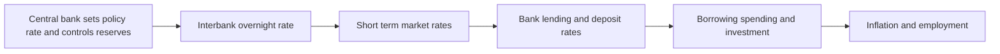
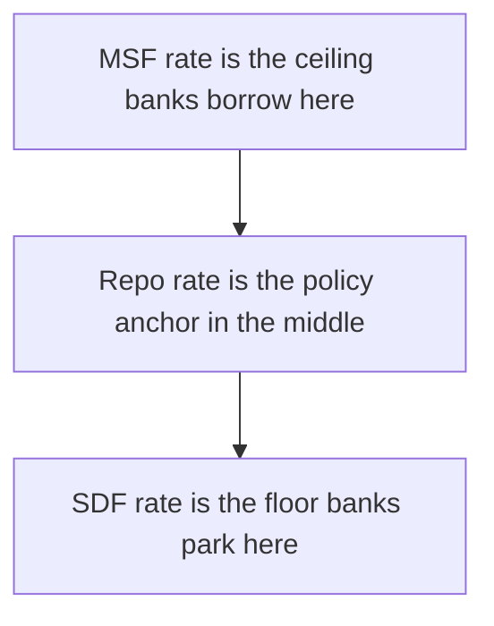
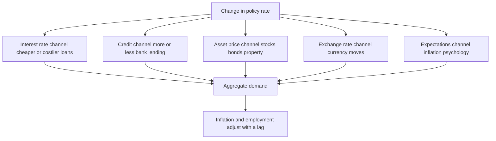

# Chapter 18 — Monetary Policy

## 1. The Problem / Need — Who Steers the Economy Between Booms and Busts?

A market economy left entirely to itself does not glide along a smooth path. It lurches. Credit booms turn into busts; confidence surges and then collapses; prices sometimes race away in inflation and sometimes spiral downward in deflation. Every one of these swings hurts someone — savers watch inflation eat their wealth, borrowers drown when rates spike, workers lose jobs when demand evaporates. The nineteenth and early twentieth centuries were a graveyard of banking panics and depressions precisely because no one had a hand on the tiller.

**The core problem monetary policy solves is this: how does a society deliberately manage the total amount of money and credit in the economy so that spending grows fast enough to keep people employed, but not so fast that prices spiral out of control?**

The institution charged with this task is the **central bank** — the Reserve Bank of India (RBI), the US Federal Reserve, the European Central Bank (ECB), the Bank of England. It is not an ordinary bank. It is the *bank of banks* and the *bank of the government*, and it holds a unique power no commercial firm has: it can create money. By adjusting the price of money (interest rates) and its quantity (the supply of reserves), the central bank tries to keep the economy near two goals — **stable prices** and **full employment** — while safeguarding the financial system.

Why must a finance professional understand this cold, rather than leave it to economists?

- **Monetary policy is the single largest driver of asset prices.** The risk-free interest rate set by the central bank is the anchor of every valuation model on earth. Change it, and the value of every bond, every stock, every currency and every property re-prices.
- **Central-bank meetings are the most-watched events in markets.** When the Fed's FOMC or the RBI's Monetary Policy Committee (MPC) announces a decision — or even when a governor changes a single word — trillions of dollars move within seconds.
- **The entire fixed-income world lives and breathes policy expectations.** A bond trader is, at bottom, betting on what the central bank will do next. The yield curve is a forecast of the future path of policy rates.
- **Careers turn on reading the cycle.** Knowing when policy is *easing* (supporting risk assets) versus *tightening* (draining them) is the macro backbone of asset allocation, currency trading, and credit analysis.

This chapter builds the complete machine: what tools a central bank has, how a change in an obscure overnight rate ripples out to reach your mortgage and the stock market, why "inflation targeting" became the global standard, and — the payoff for finance — exactly how policy moves yields, currencies, and equities.

## 2. The Core Idea

**Monetary policy is the central bank's management of the cost and availability of money and credit — primarily by setting a short-term interest rate — in order to influence total spending in the economy and thereby control inflation and support employment.**

Unpack that, because each part matters:

- **Cost of money** is the interest rate. Lower rates make borrowing cheaper and saving less rewarding, so households and firms spend and invest more. Higher rates do the reverse.
- **Availability of credit** is the quantity of money and reserves in the banking system. Even at a given rate, the central bank can flood the system with liquidity or starve it of funds.
- **A short-term interest rate** — the *policy rate* — is the modern central bank's main lever. In India it is the **repo rate**; in the US, the **federal funds rate target**. Everything else is transmission from this one anchor.
- **Total spending** — what economists call *aggregate demand* — is the target variable. Monetary policy cannot directly make factories or teach skills; it works entirely by speeding up or slowing down the *demand* side of the economy.
- **Control inflation and support employment** — the twin mandate. In practice most central banks, including the RBI since 2016, give *price stability* primacy, with growth and employment as secondary but real considerations.

The single deepest idea in the whole subject is this: **a central bank has one small, direct lever — a short-term interest rate it controls almost perfectly — and it uses that lever to reach a distant, sluggish, imperfectly controllable goal: the inflation rate a year or two into the future.** The gap between the precise lever and the fuzzy goal is bridged by a long chain called the **transmission mechanism**, and almost every difficulty, debate, and market opportunity in macro-finance lives somewhere along that chain.

The two directions the lever can be pushed give us the two faces of policy:

- **Expansionary (easy, dovish, accommodative) policy** — cutting rates and adding liquidity to *stimulate* a weak economy.
- **Contractionary (tight, hawkish, restrictive) policy** — raising rates and draining liquidity to *cool* an overheating economy and fight inflation.

## 3. How It Works — The Central Bank Sets the Price of Reserves

To see how one overnight rate can steer a whole economy, start with the plumbing. Every commercial bank must hold an account at the central bank, containing **reserves** (central-bank money). Banks use these reserves to settle payments with each other every day. Some banks end the day short of reserves; others end with a surplus. They lend to each other overnight in the **interbank money market**, and the interest rate on that lending is the crucial one — because *the central bank controls the supply of reserves, it can peg this rate wherever it wants.*

Think of it as the central bank being a monopoly supplier of a good (reserves) that every bank needs. Whoever controls the supply of a good sets its price. That price — the overnight interbank rate — is the *policy rate*, and it is the first domino.

*Figure 18.1 — The core chain. The central bank controls one overnight rate; it propagates outward until it reaches spending, then prices and jobs.*

The central bank keeps the market rate glued to its chosen policy rate using a **corridor system**. It offers two standing facilities:

- A **lending facility** at which any bank can *borrow* reserves overnight against collateral — this caps how high the market rate can go (no bank would pay a peer more than it can pay the central bank). In India this ceiling is the **Marginal Standing Facility (MSF)** rate.
- A **deposit facility** at which any bank can *park* surplus reserves overnight — this floors how low the rate can fall (no bank lends to a peer for less than it can earn risk-free at the central bank). In India this floor is the **Standing Deposit Facility (SDF)** rate.

The policy **repo rate** sits in the middle of this corridor, and daily open-market operations keep the actual market rate hugging it.

*Figure 18.2 — India's liquidity corridor. The overnight rate is trapped between the MSF ceiling and the SDF floor, anchored on the repo rate.*

The genius of the design is leverage: by controlling a tiny quantity (overnight reserves) the central bank sets a single price, and because all other interest rates are priced *relative* to the risk-free overnight rate, moving that one anchor tugs the entire structure of rates in the economy.

## 4. Full Content — Tools, Transmission, Targets, and Stance

### 4.1 The Toolkit — How a Central Bank Actually Acts

A central bank has a set of instruments, some working on the *price* of money and some on its *quantity*. Understanding each — and the Indian names — is essential.

**A) The policy rate (repo rate).** The headline lever. *Repo* means *repurchase agreement*: banks borrow reserves from the RBI by selling government securities and agreeing to buy them back the next day at a slightly higher price — the difference being the repo rate. It is a *secured overnight loan*. When the RBI *raises the repo rate*, borrowing reserves becomes costlier, banks pass the cost on, and every rate in the economy tends to rise. Cutting the repo rate does the reverse. This is the instrument the MPC actually votes on eight times a year (roughly bi-monthly).

**B) The reverse repo / SDF — the floor.** The mirror image: the rate at which banks *park* excess reserves with the central bank. It sets the floor of the corridor and matters most when the banking system is flush with surplus liquidity, because then the *floor*, not the repo rate, is the effective operating rate.

**C) Open Market Operations (OMO).** The central bank buys or sells **government bonds** in the open market. When it *buys* bonds, it pays with newly created reserves — injecting liquidity (expansionary). When it *sells* bonds, it absorbs reserves — draining liquidity (contractionary). OMOs manage the *durable* (long-lasting) liquidity in the system, whereas the repo/LAF handles *day-to-day* fluctuations. Quantitative Easing (Section 4.6) is OMO on a massive scale.

**D) The Liquidity Adjustment Facility (LAF).** This is the RBI's daily operating framework — the set of repo and reverse-repo auctions through which it fine-tunes overnight liquidity so the market rate stays inside the corridor. Think of the LAF as the steering wheel the RBI turns every single day, while the repo *rate* decision is the destination set every two months.

**E) Reserve requirements — CRR and SLR.** These are quantity tools that constrain banks directly:

- **Cash Reserve Ratio (CRR)** — the fraction of a bank's deposits it must hold as cash reserves with the RBI, earning no interest. Raising CRR *locks up* a chunk of every bank's funds, shrinking how much it can lend (contractionary) and draining system liquidity. Cutting CRR releases funds (expansionary). Because it is blunt and hits bank profitability directly, the RBI uses CRR changes sparingly.
- **Statutory Liquidity Ratio (SLR)** — the fraction of deposits banks must hold in *safe liquid assets*, chiefly government securities. Its primary purpose is prudential (bank safety and a captive market for government debt), but it also affects how much banks can lend.

**F) Forward guidance.** Not a mechanical tool but a communications one: the central bank shapes expectations by *telling markets* what it is likely to do. Because long-term rates depend on the *expected future path* of short rates, credible guidance ("rates will stay low for an extended period") can move long-term borrowing costs today without any actual rate change. Words have become one of the most powerful instruments.

| Tool | Type | Direction to *tighten* | Indian term | Frequency |
|---|---|---|---|---|
| Policy rate | Price | Raise | Repo rate | Bi-monthly (MPC) |
| Standing facilities | Price | Raise corridor | MSF / SDF | Continuous |
| Open market operations | Quantity | Sell bonds | OMO | As needed |
| Daily liquidity | Quantity | Drain via auctions | LAF | Daily |
| Reserve requirement | Quantity | Raise | CRR | Rarely |
| Liquidity buffer | Quantity | Raise | SLR | Rarely |
| Expectations | Signalling | Signal hikes | Forward guidance | Every communication |

### 4.2 The Transmission Mechanism — From Repo Rate to Real Life

The policy rate does nothing on its own; it matters only through the chain by which it reaches spending and prices. This **monetary transmission mechanism** runs through several parallel channels, and understanding them is the heart of macro-finance.

**1) The interest-rate channel.** The classic route. A lower policy rate pulls down bank lending rates and bond yields. Cheaper borrowing makes firms undertake more investment projects (a project that was unprofitable at 9% becomes profitable at 6%) and encourages households to buy homes, cars, and durables on credit. Lower deposit rates also make saving less attractive, nudging money toward spending. Aggregate demand rises.

**2) The credit / bank-lending channel.** Beyond the *price* of credit, policy affects its *availability*. Easy policy boosts bank reserves and deposits, and improves borrowers' balance sheets, so banks are more willing to extend loans. Tight policy squeezes lending capacity, especially hurting small firms who cannot tap bond markets directly.

**3) The asset-price / wealth channel.** Lower rates raise the present value of future cash flows, lifting stock and bond prices. Richer households (feeling wealthier via their portfolios and home values) spend more — the *wealth effect*. Higher asset prices also lower the cost of raising equity capital for firms.

**4) The exchange-rate channel.** Lower domestic rates make the currency less attractive to hold (foreign capital seeks higher yields elsewhere), so the currency depreciates. A weaker currency makes exports cheaper and imports dearer, boosting net exports and domestic demand — but also raising imported inflation. This channel is powerful in open economies.

**5) The expectations channel.** If a central bank credibly signals it will keep inflation near target, households and firms *expect* stable prices and behave accordingly — moderating wage demands and price-setting. Anchored expectations are, in a sense, the ultimate product of good policy.

*Figure 18.3 — The five channels of monetary transmission. One policy change fans out through parallel routes before converging on demand, then prices.*

Two features of transmission are critical for finance:

- **Long and variable lags.** Milton Friedman's famous phrase. A rate change today affects inflation only 12 to 24 months later. The central bank must therefore act on a *forecast*, steering toward where the economy will be, not where it is — like turning a supertanker.
- **Imperfect, leaky transmission.** In India, transmission has historically been *incomplete* — banks were slow to pass repo cuts to borrowers because much of their funding is fixed-rate deposits. The RBI addressed this by mandating **External Benchmark Lending Rates (EBLR)** in 2019, forcing banks to link retail and small-business loan rates directly to the repo rate, so cuts and hikes now flow through much faster.

### 4.3 Inflation Targeting — The Modern Framework

For most of the twentieth century central banks juggled multiple, sometimes conflicting goals with no clear anchor, and the result — especially the *Great Inflation* of the 1970s — was disastrous. The intellectual revolution that followed produced **inflation targeting**: the central bank publicly commits to keeping a specified inflation rate as its overriding objective and is held accountable for it. New Zealand pioneered it in 1990; it is now the global standard.

India formally adopted **flexible inflation targeting (FIT)** in 2016 through an amendment to the RBI Act. Its architecture:

- The government, in consultation with the RBI, sets a **CPI inflation target of 4%, with a tolerance band of ±2%** (i.e., 2% to 6%). The measure is *headline Consumer Price Index* inflation.
- A six-member **Monetary Policy Committee (MPC)** — three from the RBI including the Governor, three external experts appointed by the government — votes on the repo rate. Decisions are by majority; the Governor has a casting vote in a tie.
- The word **flexible** is doing real work: the RBI targets inflation *over the medium term* and is allowed to look through temporary supply shocks and give weight to growth. It does not slam the brakes because onion prices spiked one month.
- **Accountability:** if average inflation breaches the 2–6% band for three consecutive quarters, the RBI must write a public letter to the government explaining why and what it will do — as it did in 2022.

Why target inflation rather than, say, money supply or the exchange rate? Because the relationship between money supply and inflation (the old *monetarist* target) proved unstable once financial innovation made "money" hard to define, whereas an inflation target is simple, transparent, and directly anchors the one variable — *inflation expectations* — that most influences actual inflation. If everyone believes the RBI will deliver 4%, they set wages and prices around 4%, and the belief becomes self-fulfilling.

### 4.4 Expansionary vs. Contractionary Policy

The two stances are the practical output of the whole machine. Which one the central bank chooses depends on where the economy sits relative to its potential and where inflation is heading.

| Feature | Expansionary (easy / dovish) | Contractionary (tight / hawkish) |
|---|---|---|
| **When used** | Recession, high unemployment, below-target inflation | Overheating, above-target inflation, asset bubbles |
| **Policy rate** | Cut repo rate | Raise repo rate |
| **Liquidity** | Inject (buy bonds, cut CRR, OMO purchases) | Drain (sell bonds, raise CRR, OMO sales) |
| **Goal** | Boost aggregate demand, jobs, growth | Cool demand, curb inflation |
| **Effect on bond yields** | Fall | Rise |
| **Effect on currency** | Tends to weaken | Tends to strengthen |
| **Effect on equities** | Usually supportive (lower discount rate, more liquidity) | Usually a headwind |
| **Classic example** | RBI cutting repo to 4% in 2020 (COVID) | RBI hiking 250 bps in 2022–23; Fed hiking to 5.5% |

The choice is guided by the **output gap** (how far actual output is below or above potential) and the **inflation forecast**. When inflation is above target *and* the economy is running hot, the case for tightening is clear-cut. The genuinely hard decisions come with **stagflation** — high inflation *and* weak growth simultaneously (as in the 1970s oil shocks) — because easing fights the recession but stokes inflation, while tightening fights inflation but deepens the recession. There is no free lunch; the central bank must pick its poison.

A widely taught rule of thumb for how central banks *should* set rates is the **Taylor Rule**: the policy rate should rise when inflation is above target and when output is above potential, by specified amounts. It is not a mechanical formula any bank follows, but it captures the logic — *lean against both inflation and the cycle* — and is a useful benchmark for judging whether policy is "behind the curve" or "ahead of it."

### 4.5 The Limits and Dangers of Monetary Policy

Monetary policy is powerful but not omnipotent, and a serious analyst must know its boundaries:

- **The zero lower bound (ZLB).** Nominal rates cannot easily fall much below zero — people would hoard cash rather than accept negative returns. When a recession is deep enough that even a 0% rate is too high, conventional policy is *out of ammunition*. This is what forced the unconventional tools of Section 4.6.
- **"Pushing on a string."** In a slump, the central bank can make credit cheap and abundant, but it cannot *force* pessimistic firms to invest or frightened banks to lend. Easing is far more effective at *cooling* an economy than at *heating* a demoralised one.
- **Long lags and forecast error.** Because effects arrive 1–2 years later, a bank steering by imperfect forecasts can easily overtighten into a recession or ease too long into a bubble.
- **Supply shocks are its blind spot.** Monetary policy works on *demand*. It is nearly powerless against inflation caused by an oil embargo, a war, or a crop failure — except by crushing demand hard enough to offset the supply-side price rise, which is painful.
- **Financial-stability trade-offs.** Years of ultra-low rates can inflate asset bubbles and encourage excessive risk-taking and leverage — the seeds of the next crisis. The 2008 crisis taught central banks that price stability alone does not guarantee financial stability.

### 4.6 Unconventional Monetary Policy

When 2008 and 2020 drove rates to the ZLB, central banks reached for new tools:

- **Quantitative Easing (QE).** Large-scale purchases of long-term government bonds (and sometimes other assets) financed by newly created reserves. QE works by (a) flooding the system with liquidity, (b) pushing down *long-term* yields directly (buying bonds raises their price and lowers their yield), and (c) pushing investors out along the risk curve into equities and corporate credit — the *portfolio-balance* effect. The reverse — selling those assets or letting them mature — is **Quantitative Tightening (QT)**.
- **Forward guidance** (already noted) becomes a primary tool at the ZLB, shaping long rates through expected-path management when the current rate cannot fall further.
- **Negative interest rate policy (NIRP)**, used by the ECB and Bank of Japan, charges banks for parking reserves, to force them to lend.

India has not needed QE at scale, but the RBI used variants — long-term repo operations (LTROs), Operation Twist (simultaneously buying long and selling short bonds to flatten the curve), and large OMO purchases — during COVID to keep yields low and credit flowing.

## 5. Real Examples — Policy in Action, Markets in Motion

**Example 1 — The Volcker shock and the birth of credible tightening (US, 1979–82).** By 1979 US inflation had reached nearly 14%, expectations were unanchored, and the dollar was under pressure. Fed Chair Paul Volcker raised the federal funds rate to an extraordinary ~19–20%. The cost was brutal — a deep recession and unemployment above 10% — but it *broke the back of inflation*, which fell to ~3% by 1983. **Market lessons for finance:** it demonstrated that a central bank's credibility is its most valuable asset; that beating entrenched inflation requires accepting real economic pain; and that the bond market rewards credibility — long yields eventually collapsed and launched the great 1982–2020 bond bull market as inflation expectations fell.

**Example 2 — India's COVID easing and the 2022–23 reversal.** In response to the COVID collapse, the RBI slashed the repo rate from 5.15% to **4.00%** by May 2020, cut CRR, and injected massive liquidity through LTROs and OMOs. Bond yields fell, the equity market — after its March 2020 crash — staged a historic rally powered by cheap money, and credit stayed flowing. Then in 2022, as post-pandemic demand and the Ukraine-war commodity spike pushed CPI above the 6% ceiling, the MPC pivoted hard, raising the repo rate by **250 basis points to 6.50%** between May 2022 and February 2023. **Market response:** the 10-year G-Sec yield climbed, banking stocks (which earn more as rates rise) outperformed, rate-sensitive sectors like real estate and autos wobbled, and the whole episode is a textbook illustration of a full easing-then-tightening cycle and its asset-class rotation.

**Example 3 — The Fed's 2022–23 hiking cycle and the global dollar squeeze.** Facing 40-year-high inflation (~9% CPI in mid-2022), the Fed raised the funds rate from ~0% to ~5.25–5.50% in about 18 months — the fastest tightening in decades. **Global market consequences that every finance professional watched:** US bond yields surged and bond prices suffered their worst year in history; the US dollar (DXY) rocketed as capital chased higher US yields, dragging the rupee toward ₹83/$ and pressuring every emerging market; growth and technology equities — whose valuations depend most on low discount rates — sold off hardest; and the strong dollar exported tighter financial conditions worldwide. This single cycle showcases all three market linkages — yields up, currency up, equities (especially long-duration ones) down — in one clean sweep.

**Example 4 — Forward guidance and "Whatever it takes" (ECB, 2012).** At the height of the euro-zone crisis, with no rate cut left to give, ECB President Mario Draghi simply said the ECB would do "whatever it takes to preserve the euro." He spent no money that day, yet Italian and Spanish bond yields — which had spiked to crisis levels — fell dramatically. **Lesson:** *words backed by credibility* are a monetary tool. Expectations management alone re-priced an entire continent's sovereign debt.

## 6. Connections — Where This Sits in the Web of Finance

- **To GDP and the business cycle (Ch. 12).** Monetary policy is the primary counter-cyclical lever: it eases in downturns and tightens in booms, trying to close the output gap. The whole point is to smooth the GDP path.
- **To inflation (its own chapter).** Inflation is the target variable. The relationship between unemployment and inflation (the *Phillips curve*) is the trade-off the central bank navigates; anchored *expectations* are what keep that curve stable.
- **To fiscal policy.** Monetary policy (central bank, interest rates) and fiscal policy (government, taxes and spending) are the two arms of macro stabilisation. They can reinforce each other or clash — loose fiscal + tight monetary (as in the early-1980s US) produces high rates and a strong currency. *Fiscal dominance*, where huge government deficits force the central bank to keep rates low, is the nightmare that undermines independence.
- **To bond valuation (fixed income).** The policy rate *is* the short end of the yield curve; the whole curve is built on expectations of its future path plus term premium. Duration risk, curve trades, and carry are all bets on monetary policy.
- **To equity valuation.** The discount rate in every DCF traces back to the risk-free rate the central bank anchors. "Don't fight the Fed" encapsulates how policy dominates equity regimes.
- **To foreign exchange.** *Interest-rate differentials* between countries are the core driver of currencies and of the *carry trade*. Relative monetary policy — who is hiking, who is cutting — moves exchange rates more than almost anything else.
- **To banking (Ch. on money and banking).** Monetary policy operates *through* the banking system via reserves, the money multiplier, and credit creation. Bank net interest margins expand and contract with the rate cycle.

## 7. Key Terms

- **Central bank** — the monopoly issuer of base money and manager of monetary policy (RBI, Fed, ECB); bank to banks and to the government.
- **Policy rate / repo rate** — the central bank's main lever; the rate at which banks borrow overnight reserves against government collateral.
- **Reverse repo / SDF** — the rate at which banks park surplus reserves with the central bank; the floor of the corridor.
- **MSF (Marginal Standing Facility)** — the penal ceiling rate at which banks can borrow reserves; top of the corridor.
- **Liquidity corridor** — the band (SDF floor to MSF ceiling) within which the overnight market rate is kept, anchored on the repo rate.
- **Open Market Operations (OMO)** — central-bank buying (inject) or selling (drain) of government bonds to manage durable liquidity.
- **LAF (Liquidity Adjustment Facility)** — the RBI's daily repo/reverse-repo operations that fine-tune overnight liquidity.
- **CRR (Cash Reserve Ratio)** — fraction of deposits banks must hold as non-interest cash reserves with the RBI.
- **SLR (Statutory Liquidity Ratio)** — fraction of deposits banks must hold in safe liquid assets, chiefly government securities.
- **Transmission mechanism** — the chain of channels by which a policy-rate change reaches spending, then inflation and employment.
- **Inflation targeting** — a framework where the central bank commits to a numerical inflation goal (India: 4% ±2% CPI).
- **MPC (Monetary Policy Committee)** — the six-member body that votes on India's repo rate.
- **Output gap** — the difference between actual and potential GDP; a key input to the policy decision.
- **Zero lower bound (ZLB)** — the point below which nominal rates cannot easily fall, forcing unconventional tools.
- **Quantitative Easing (QE) / Tightening (QT)** — large-scale asset purchases (or sales) to alter long-term yields and liquidity.
- **Forward guidance** — communicating the likely future path of policy to shape long-term rates today.
- **Basis point (bp)** — one-hundredth of a percentage point; the unit rate moves are quoted in (a 0.25% cut = 25 bps).
- **Dovish vs. hawkish** — leaning toward easier (pro-growth) vs. tighter (anti-inflation) policy.

## 8. Common Confusions

- **"The central bank prints money to spend it."** No. Modern monetary policy works by setting an *interest rate* and swapping assets (buying bonds with reserves), not by handing cash to the government. Direct money-financing of deficits is a different, dangerous thing (*monetisation*).
- **"Repo rate and reverse repo are just two names for the policy rate."** They are opposite sides. Repo = the rate banks *pay to borrow* from the RBI; reverse repo/SDF = the rate banks *earn to park* funds. Which one is operative depends on whether the system is short of or flush with liquidity.
- **"Lower rates always lift the stock market."** Usually, but not if rates are being cut *because* a severe recession is crushing earnings. The *reason* for the cut matters as much as the cut itself. "Bad news is good news" (cuts coming) can flip to "bad news is bad news" (recession here).
- **"CRR and SLR are the same reserve requirement."** CRR is *cash* held at the RBI earning nothing; SLR is *government securities and safe assets* held by the bank itself, earning interest. Different assets, different purposes.
- **"Inflation targeting means the RBI ignores growth."** *Flexible* inflation targeting explicitly gives weight to growth and looks through temporary shocks; it targets inflation over the medium term, not month to month.
- **"A rate cut passes to my loan immediately."** Not historically in India — transmission was slow and incomplete until the 2019 external-benchmark (EBLR) reform forced faster pass-through. Deposit-funded fixed-rate lending still slows transmission.
- **"Monetary policy can fix any inflation."** It fights *demand-driven* inflation well but is nearly helpless against a pure *supply shock* (oil, war, harvest failure) except by crushing demand.
- **"QE is the same as printing money for the government."** QE creates reserves to buy bonds *in the secondary market* from investors, aiming to lower yields and add liquidity — it is reversible (QT) and distinct from directly financing government spending.

## 9. Recap

- **Monetary policy** is the central bank's management of the cost (interest rates) and availability (liquidity) of money to steer aggregate demand toward stable prices and full employment.
- The mechanism starts tiny: the central bank monopolises **reserves** and thereby pegs one **overnight policy rate** inside a corridor (India: SDF floor, repo anchor, MSF ceiling).
- The **toolkit** spans price tools (repo rate, standing facilities), quantity tools (OMO, LAF, CRR, SLR), and signalling (forward guidance).
- A change in the policy rate reaches the real economy through the **transmission mechanism** — the interest-rate, credit, asset-price, exchange-rate, and expectations channels — but with **long and variable lags** and often leaky pass-through.
- Modern central banks operate under **flexible inflation targeting**; India targets **4% CPI ±2%** via a six-member **MPC**.
- **Expansionary** policy (cut rates, add liquidity) fights recession; **contractionary** policy (raise rates, drain liquidity) fights inflation; the output gap and inflation forecast guide the choice, and **stagflation** makes it agonising.
- Policy is limited by the **zero lower bound**, "pushing on a string," forecast error, and supply shocks — spurring unconventional tools like **QE** and forward guidance.
- For finance, the payoff is the three linkages: policy moves **yields** (directly, along the whole curve), **currencies** (via rate differentials), and **equities** (via the discount rate and liquidity).

## 10. Quick-Reference / Interview Points

- **One-line definition:** monetary policy is a central bank's use of interest rates and liquidity to control inflation and support employment by steering aggregate demand.
- **The core mechanism:** the central bank controls reserves → pegs the overnight rate → all other rates price off it → spending and then inflation respond, with a 12–24 month lag.
- **India's corridor:** SDF (floor) < Repo rate (anchor, MPC-set) < MSF (ceiling); the LAF fine-tunes daily; OMO manages durable liquidity; CRR/SLR are quantity constraints.
- **India's framework:** flexible inflation targeting — **4% CPI, band 2–6%** — decided by a **6-member MPC** meeting bi-monthly; a 3-quarter breach triggers a letter to the government.
- **The five transmission channels:** interest-rate, credit, asset-price/wealth, exchange-rate, expectations.
- **Effect on YIELDS:** hikes push yields up across the curve (short end most directly); cuts push them down. The yield curve is a forecast of the future policy path. QE lowers *long* yields specifically.
- **Effect on CURRENCY:** higher relative rates attract capital and *strengthen* the currency (rate differentials drive FX and the carry trade); cuts tend to *weaken* it. Fed hikes in 2022 sent the dollar soaring and the rupee toward ₹83.
- **Effect on EQUITIES:** easing lowers the discount rate and adds liquidity — generally bullish, especially for *long-duration* growth/tech stocks; tightening is a headwind and rotates leadership toward banks and value. "Don't fight the Fed."
- **Expansionary vs. contractionary:** cut/inject to fight recession; hike/drain to fight inflation. Watch the *output gap* and the *inflation forecast*.
- **Know the names:** Volcker (credibility through pain, 1980s), Draghi ("whatever it takes," 2012 — words as a tool), the RBI's 4.00% COVID low then +250 bps in 2022–23, the Fed's 0→5.5% in 2022–23.
- **Key limits to cite:** zero lower bound, "pushing on a string," long/variable lags, and powerlessness against supply shocks — the reasons QE and forward guidance exist.
- **The number sense:** rates move in *basis points*; 25 bps = 0.25%. A "dovish hold" or a single changed word in the statement can move markets more than the rate itself.
