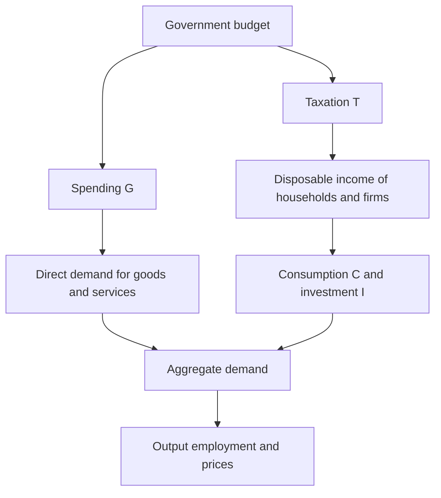
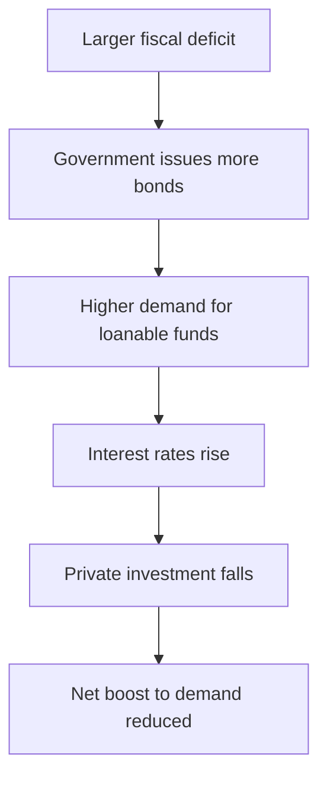
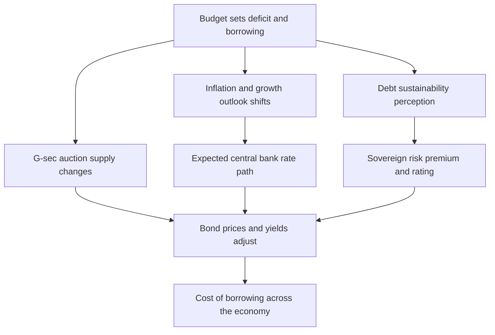

# Chapter 19 — Fiscal Policy

## 1. The Problem / The Need

An economy left entirely to itself does not glide along a smooth path. It lurches — booming for a few years, then contracting sharply, throwing millions out of work, then recovering. During the Great Depression of the 1930s, output in the United States fell by roughly a quarter and unemployment touched 25 percent, and the private sector showed no sign of self-correcting for the better part of a decade. Households cut spending because they feared unemployment; firms cut investment because they saw no customers; and each cut confirmed the other's fears. The economy was stuck in a bad equilibrium that the market, on its own, would not escape quickly.

This is the core problem fiscal policy exists to address. Monetary policy (Chapter 18) works through interest rates and the banking system, but it has limits — most visibly when rates hit zero and cannot fall further, or when banks refuse to lend no matter how cheap money becomes. In those moments the government is the only actor large enough, and with a long enough horizon, to step in and spend when everyone else is retrenching.

But fiscal policy is not only a recession-fighting tool. Governments must decide every single year, whether or not there is a crisis, how much to spend, how much to tax, and how much to borrow. Those decisions shape the level of demand in the economy, the distribution of income, the rate of long-run growth, the level of interest rates, and — of enormous importance to anyone working in finance — the supply of government bonds and the creditworthiness of the sovereign. A finance professional who cannot read a budget, judge whether a deficit is sustainable, or anticipate how a fiscal announcement will move the yield curve is missing half the macro picture.

The need, then, is twofold: to **stabilise** the economy over the business cycle, and to **finance and shape** the state's permanent role in the economy. Fiscal policy is how a government does both — and the bond market is where its choices are priced every day.

## 2. The Core Idea

Fiscal policy is the use of **government spending** and **taxation** to influence the level of aggregate demand, output, employment, and prices in the economy. The tool is the government budget; the operator is the treasury or finance ministry (in India, the Ministry of Finance); the political author is the legislature that passes the budget.

The intuition rests on a single accounting identity from Chapter 16:

> Aggregate Demand = Consumption + Investment + Government Spending + Net Exports
> AD = C + I + G + (X − M)

Government spending, **G**, sits directly inside aggregate demand. If the government builds a highway, it hires workers and buys steel and cement — that is demand, created immediately. Taxation, **T**, works one step removed: it changes households' disposable income and firms' after-tax profits, which changes **C** and **I**. Cut income tax and households have more to spend; raise it and they have less.

So the government has two levers:

- **Expansionary fiscal policy** — raise G, cut T, or both. This widens the budget deficit and pushes AD up. Used in recessions to fight unemployment.
- **Contractionary fiscal policy** — cut G, raise T, or both. This narrows the deficit (or builds a surplus) and pulls AD down. Used to cool an overheating economy and fight inflation.

The elegance of the idea is that the government's budget is not merely a bookkeeping exercise — it is a macroeconomic instrument. The *stance* of fiscal policy (whether the deficit is widening or narrowing after adjusting for the cycle) tells you which direction the state is pushing the economy.

*Figure 19.1 — The two levers of fiscal policy and their transmission to aggregate demand.*

## 3. How It Works

### The budget as the operating table

Every fiscal action shows up in the government budget. Strip it to essentials:

- **Revenue** — mainly taxes (income tax, corporate tax, GST or VAT, customs, excise), plus non-tax receipts (dividends from state enterprises, spectrum auctions, fees).
- **Expenditure** — split into **revenue expenditure** (salaries, pensions, interest payments, subsidies — spending that does not create an asset) and **capital expenditure** (roads, railways, ports — spending that builds durable assets).
- **The balance** — Revenue minus Expenditure. If negative, it is a **deficit**, financed by borrowing. If positive, a **surplus**.

In India the headline number watched by every bond trader is the **fiscal deficit**: total expenditure minus total revenue *excluding borrowing*, i.e. how much the government must borrow in a year. It is expressed as a percentage of GDP. For 2024-25 the central government targeted a fiscal deficit of about 4.9 percent of GDP, on a path toward 4.5 percent.

### Financing the gap

A deficit must be paid for. The government sells **bonds** (in India, dated Government Securities or "G-secs", and Treasury Bills for short tenors) to banks, insurers, pension funds, mutual funds, and foreign investors. This is the direct pipe connecting fiscal policy to the bond market: **a bigger deficit means a bigger bond supply.** More supply, other things equal, pushes bond prices down and yields up. This is why the "borrowing programme" announced alongside the budget can move the entire government yield curve in minutes.

### From spending to output — the sequence

1. The government announces expansionary policy, say an infrastructure push.
2. It borrows by issuing bonds and spends the proceeds hiring workers and buying materials.
3. Those workers and suppliers receive income (round one of new demand).
4. They spend a fraction of that income, generating income for others (round two), and so on — this is the **multiplier** (Section 4).
5. Aggregate demand rises, firms produce more, employment rises.
6. If the economy has spare capacity, this raises real output. If it is near full capacity, it spills into higher prices.

The timing matters. Fiscal policy suffers from **lags** — a recognition lag (data arrive late), a decision lag (budgets take months and require political agreement), and an implementation lag (a road takes years to build). This is why fiscal policy is a blunt instrument for fine-tuning, and why economists distinguish the automatic part from the discretionary part.

## 4. Full Content

### 4.1 Automatic stabilisers versus discretionary policy

Not all fiscal stabilisation requires a decision. Some of it happens on its own.

**Automatic stabilisers** are features of the tax-and-transfer system that dampen the cycle without any new legislation:

- In a boom, incomes and profits rise, so tax collections rise automatically — and because income tax is progressive, they rise *faster* than income. This pulls spending power out of an overheating economy without anyone lifting a finger.
- In a recession, incomes fall, so tax take falls automatically, cushioning disposable income. Simultaneously, spending on unemployment benefits and welfare rises automatically as more people qualify.

The deficit therefore *widens automatically in a downturn and shrinks automatically in a boom* — a built-in counter-cyclical force. India's automatic stabilisers are weaker than those of advanced economies because the tax base is narrower (a small share of the population pays income tax) and the social safety net is thinner, though schemes like MGNREGA (a rural employment guarantee) act as a partial stabiliser.

**Discretionary fiscal policy** is deliberate change — a new stimulus package, a tax cut, a public-investment programme. It is powerful but slow, and it is exposed to political incentives (spending is easy to start, hard to stop).

The two interact through the concept of the **cyclically-adjusted** or **structural balance**: the deficit the government would run if the economy were at its potential output. Analysts strip out the automatic, cycle-driven part of the deficit to see the *discretionary stance* underneath. A deficit that widens purely because of recession is automatic stabilisation working as designed; a structural deficit that widens in good times is a warning sign about the underlying fiscal position.

*Table 19.1 — Automatic stabilisers versus discretionary policy*

| Dimension | Automatic stabilisers | Discretionary policy |
|---|---|---|
| Trigger | Built into tax and transfer rules | Requires new legislation or executive decision |
| Speed | Immediate, no lag | Slow — recognition, decision, implementation lags |
| Examples | Progressive income tax, unemployment benefits | Stimulus package, tax rate change, capex push |
| Political risk | Low, no ongoing decisions | High, prone to timing and reversal problems |
| Size in India | Modest, narrow tax base | The main active tool used in budgets |

### 4.2 The fiscal multiplier

If the government spends one rupee, does aggregate demand rise by exactly one rupee? Usually more. The extra is the **multiplier effect**.

The mechanism: the government pays a construction worker ₹100. The worker spends part of it — say ₹80 — on groceries. The grocer now has ₹80 of new income and spends ₹64 of it. Each round is smaller because people save (and, in an open economy, import) some of every rupee. The sum of the infinite series is the multiplier.

The simplest formula uses the **marginal propensity to consume (MPC)** — the fraction of an extra rupee of income that is spent:

> Multiplier = 1 / (1 − MPC)

If MPC is 0.8, the multiplier is 1 / (1 − 0.8) = 5. In practice the multiplier is far smaller because of "leakages" — savings, taxes, and imports all divert money out of the domestic spending chain. A more realistic multiplier for a large economy is often between 0.5 and 2.

*Figure 19.2 — The multiplier as successive rounds of spending from an initial injection.*

**What makes the multiplier large or small?**

- **Higher MPC → larger multiplier.** Money given to poorer households (who spend nearly all of it) has a bigger multiplier than money given to the rich (who save more). This is why direct cash transfers to low-income groups are potent stimulus.
- **Spare capacity → larger multiplier.** In a deep recession with idle factories and unemployed workers, extra demand raises real output. Near full employment it just raises prices, so the *real* multiplier collapses.
- **Type of spending matters.** Capital spending (building assets that raise future productivity) tends to have a higher multiplier than a general tax cut, part of which is saved. Studies for India suggest capital-expenditure multipliers well above 2, while revenue-spending and subsidy multipliers are closer to or below 1 — a key reason recent Indian budgets have shifted toward capex.
- **Tax multiplier is smaller than the spending multiplier.** A tax cut of ₹100 does not all get spent; households save a slice immediately. So the first round is MPC × 100, not the full 100. The tax multiplier is −MPC / (1 − MPC), smaller in magnitude than the spending multiplier.
- **Monetary offset shrinks it.** If a fiscal expansion prompts the central bank to raise interest rates (to head off inflation), the rate rise dampens private demand and offsets part of the fiscal push.

### 4.3 Crowding out

Here is the classic objection to deficit spending. When the government borrows heavily, it competes with private borrowers for a limited pool of savings. That competition pushes up interest rates, and higher rates discourage private investment and interest-sensitive consumption. The rise in G is partly offset by a fall in private I. This is **crowding out**.

*Figure 19.3 — How government borrowing can crowd out private investment.*

The strength of crowding out is one of the great dividing lines in macroeconomics:

- **Classical view** — near full employment, savings are fully employed, so extra government borrowing simply displaces private borrowing one-for-one. Crowding out is near-complete and fiscal stimulus is largely futile.
- **Keynesian view** — in a slump, savings sit idle and there is spare capacity. The government borrows and spends money that would otherwise have done nothing; interest rates barely move; crowding out is minimal. Indeed, by reviving demand, public investment can **crowd in** private investment (firms invest when they see customers returning).

The truth is state-dependent: crowding out is weak in a depressed economy and strong in a booming one. There is also **crowding out through a stronger currency** in open economies (a fiscal-driven rise in rates attracts capital, lifts the exchange rate, and hurts exports) — the Mundell-Fleming result covered when we discuss open-economy macro.

### 4.4 Public debt and sustainability

Deficits accumulate into **debt**. This year's fiscal deficit is (roughly) the addition to the outstanding stock of government debt. The key metric is the **debt-to-GDP ratio** — the stock of debt relative to the annual income of the economy. India's general government debt (centre plus states) runs around 80–85 percent of GDP; the central government's own debt is roughly 55–58 percent.

**Why the ratio, not the rupee amount?** Because a country's capacity to service debt scales with its income, just as a household's borrowing capacity scales with salary. A debt is sustainable if the ratio is stable or falling; it is on an explosive path if the ratio rises without limit.

**The arithmetic of debt dynamics.** Whether the ratio rises or falls turns on a race between the interest rate on debt (r) and the growth rate of the economy (g):

> If g > r, the economy grows faster than interest compounds — the debt ratio tends to fall (or a country can run modest primary deficits and still stabilise debt).
> If r > g, interest compounds faster than the economy grows — the ratio tends to rise unless the government runs a **primary surplus** (a surplus *before* interest payments) to offset it.

The **primary balance** (the budget balance excluding interest payments) is what the government actually controls; interest is the legacy of past borrowing. Debt sustainability analysis asks: what primary balance is needed, given r and g, to keep the debt ratio from exploding?

India has historically benefited from **g > r** — nominal GDP growth (real growth plus inflation) has often exceeded the average interest rate on government debt, which is why India can sustain deficits that would destabilise a slow-growing economy. Japan, by contrast, carries a debt ratio above 250 percent of GDP yet remains stable because its interest rate is near zero and most debt is held domestically.

**When does debt become dangerous?** Not at a fixed number. It depends on:

- The **currency of the debt.** Debt in your own currency (India's rupee G-secs, US Treasuries) can, in extremis, be serviced by the central bank; debt in foreign currency cannot be printed and is far more dangerous — the trigger for most emerging-market crises.
- **Who holds it.** Domestically-held debt (Japan, India) is more stable than debt owed to fickle foreign investors who can flee.
- **The maturity structure.** Long-dated debt insulates you from rollover risk; short-dated debt must be refinanced constantly and is exposed to sudden rate spikes.
- **Market confidence.** Sustainability is partly self-fulfilling. If investors believe debt is safe, they demand low yields, keeping r low and debt sustainable. If they lose faith, they demand higher yields, raising r, worsening the arithmetic — a doom loop, as seen in the euro-area periphery in 2010-12.

India legislated a rules-based framework — the **Fiscal Responsibility and Budget Management (FRBM) Act, 2003** — to cap deficits and anchor debt, though targets have been relaxed repeatedly, especially during COVID-19 when the deficit blew out to about 9 percent of GDP.

### 4.5 How fiscal policy affects growth, interest rates and the bond market

**Growth.** Fiscal policy shapes growth on two horizons. In the *short run*, through demand: expansionary policy lifts output when there is slack. In the *long run*, through the *supply side*: public investment in infrastructure, education, and health raises the economy's productive potential, while high debt and distortionary taxes can drag on growth. The composition of spending is decisive — a rupee of capital expenditure that builds a port does far more for long-run growth than a rupee of subsidy.

**Interest rates.** Fiscal policy pushes rates through several channels: bond supply (bigger deficits, more issuance, higher yields), the expected policy-rate path (if stimulus stokes inflation, markets expect the central bank to hike), and the risk premium (if debt looks unsustainable, investors demand extra yield to compensate for default or inflation risk).

**The bond market — the finance professional's front line.** This is where every fiscal decision is priced continuously:

- **Supply.** The **borrowing calendar** (the schedule of G-sec auctions) is one of the most closely watched fiscal releases. A larger-than-expected calendar sends yields up and prices down; a fiscally-consolidating budget that cuts borrowing rallies bonds.
- **Term premium and the yield curve.** Persistent large deficits raise the extra yield investors demand to hold long-dated bonds, **steepening** the curve. Credible consolidation flattens it.
- **Credit rating and sovereign spread.** Rating agencies (Moody's, S&P, Fitch) judge fiscal sustainability. India has long sat at the lowest investment-grade rung (BBB-/Baa3), and its fiscal path is central to any upgrade or downgrade debate. A downgrade raises borrowing costs across the whole economy, because government yields are the risk-free benchmark off which corporate bonds, loans, and even equity valuations are priced.
- **Index inclusion.** In 2024 Indian government bonds were added to JPMorgan's emerging-market bond index, channelling tens of billions of dollars of foreign demand into G-secs — a structural buyer that lowers yields, illustrating that *who holds the debt* is itself a fiscal-market variable.

*Figure 19.4 — Transmission from a fiscal decision to bond yields and the broader economy.*

## 5. Real Examples

**1. India's post-COVID pivot to capital expenditure.** After the pandemic, Indian budgets sharply raised central capital expenditure — from roughly ₹4.4 lakh crore in 2021-22 toward ₹11 lakh crore by 2024-25 — betting that infrastructure spending carries a high multiplier and crowds *in* private investment, while simultaneously narrowing the fiscal deficit from its 9 percent COVID peak back toward 4.5 percent. For a bond investor this was a two-sided story: heavy borrowing kept G-sec supply elevated (bearish for prices), but a credible consolidation path and eventual index inclusion supported demand. Watching the annual borrowing calendar became essential to trading the 10-year benchmark yield.

**2. The US CARES Act and the 2020 fiscal bazooka.** Facing a sudden-stop recession, the US enacted roughly USD 2.2 trillion of stimulus — direct cheques to households, expanded unemployment benefits, and business support — followed by further packages in 2021. With the economy in deep slack and the Federal Reserve holding rates at zero and buying bonds, crowding out was minimal; the money was spent, not saved, and demand recovered fast. The later inflation surge of 2021-22, however, became the leading real-world case study in fiscal stimulus *overshooting* into an economy that recovered faster than expected — a reminder that the multiplier and the inflation risk both depend on how much slack remains.

**3. The euro-area sovereign debt crisis, 2010-2012.** Greece, Portugal, Ireland, and others revealed that debt sustainability is about confidence and currency, not just a number. These countries owed debt in euros — a currency they could not print — held heavily by foreign banks. As doubts grew, yields on Greek 10-year bonds spiked above 30 percent, which *raised* r above g and made the debt genuinely unsustainable — a self-fulfilling doom loop broken only when the ECB pledged to "do whatever it takes." The lesson for finance professionals: the same debt ratio can be safe in a country that borrows in its own currency from domestic savers (Japan) and catastrophic in one that does not (Greece).

**4. The UK "mini-budget", September 2022.** Chancellor Kwasi Kwarteng announced large unfunded tax cuts with no accompanying plan to finance the resulting borrowing. The bond market's reaction was violent and near-instant — gilt yields spiked, the pound fell, and pension funds using leveraged bond strategies faced collapse, forcing emergency Bank of England intervention. Within weeks the policy was reversed and the government fell. It is the cleanest modern demonstration that fiscal credibility is priced by the bond market in real time, and that markets can discipline a government faster than any election.

## 6. Connections

- **Monetary policy (Ch. 18).** Fiscal and monetary policy are the two arms of macro stabilisation. They can reinforce each other (both easing in a slump) or fight (fiscal expansion met by monetary tightening, producing offset and crowding out). The **policy mix** — for example, loose fiscal plus tight monetary — determines the split between growth and interest rates.
- **Aggregate demand and the multiplier (Ch. 16).** Fiscal policy is the most direct way to move the AD curve; the multiplier governs how far.
- **The bond market and the yield curve (bonds chapters).** Deficits are financed by bonds, so fiscal policy is the primary driver of government-bond supply, term premia, and the risk-free curve that anchors all other asset prices.
- **Inflation (Ch. 17).** Fiscal expansion near full capacity feeds inflation; a fiscal-dominance situation (where debt is so large the central bank cannot tighten without bankrupting the state) is the extreme case where fiscal policy overrides monetary control.
- **Exchange rates and open-economy macro.** Fiscal expansion that lifts domestic rates can attract capital and strengthen the currency, crowding out net exports — the Mundell-Fleming channel.
- **Equities.** Fiscal policy sets the discount rate (through bond yields), corporate profits (through demand and tax rates), and sector rotation (a capex budget lifts infrastructure and construction stocks; a welfare budget lifts consumer names).

## 7. Key Terms

- **Fiscal policy** — use of government spending and taxation to influence the economy.
- **Fiscal deficit** — the amount the government must borrow in a year; total expenditure minus revenue excluding borrowing, expressed as a percentage of GDP.
- **Primary balance** — the budget balance excluding interest payments; what the current government actually controls.
- **Automatic stabilisers** — tax-and-transfer features that dampen the cycle without new legislation.
- **Discretionary policy** — deliberate changes in spending or taxes requiring a decision.
- **Structural (cyclically-adjusted) balance** — the deficit that would exist at potential output, isolating the discretionary stance.
- **Fiscal multiplier** — the ratio of the total change in output to the initial fiscal injection.
- **Marginal propensity to consume (MPC)** — fraction of an extra rupee of income that is spent.
- **Crowding out** — reduction in private investment caused by government borrowing raising interest rates.
- **Crowding in** — private investment rising because public investment revives demand.
- **Debt-to-GDP ratio** — stock of public debt relative to annual output; the headline sustainability metric.
- **Debt dynamics (r versus g)** — the race between the interest rate on debt and the growth rate that determines whether the debt ratio rises or falls.
- **FRBM Act** — India's Fiscal Responsibility and Budget Management framework capping deficits.
- **Borrowing calendar** — the schedule of government-bond auctions financing the deficit.
- **Revenue vs capital expenditure** — spending that creates no asset (salaries, interest, subsidies) versus spending that builds durable assets (infrastructure).

## 8. Common Confusions

- **Deficit versus debt.** The deficit is a *flow* (this year's borrowing); debt is a *stock* (all past borrowing accumulated). A country can cut its deficit and still have rising debt, as long as it keeps borrowing anything at all.
- **Fiscal deficit versus revenue deficit versus primary deficit.** The fiscal deficit is total borrowing; the *revenue* deficit is the shortfall on the day-to-day (revenue) account, a sign the government is borrowing just to pay salaries and interest; the *primary* deficit strips out interest. High revenue deficit is a red flag; a primary surplus is a sign of underlying discipline.
- **"Government spending always crowds out private investment."** Only near full employment. In a slump with idle resources and rates pinned near zero, crowding out is minimal and public investment can crowd private investment *in*.
- **"A budget surplus is always good, a deficit always bad."** A deficit in a recession is exactly what automatic stabilisers should produce — fighting it with austerity can deepen the downturn. A surplus in a boom is prudent; a surplus wrung out of a slump is self-defeating.
- **"High debt means imminent default."** Sustainability depends on r versus g, the currency of the debt, and who holds it — not on the raw ratio. Japan at 250 percent is stable; Greece at 130 percent was not.
- **The multiplier is a fixed number.** It varies with slack, the type of spending, the MPC of recipients, and whether monetary policy offsets it. Quoting "the multiplier" as a constant is a common analyst error.
- **Fiscal deficit versus current account deficit.** Both are called "deficits" but are different — the fiscal deficit is the government's borrowing; the current account deficit is the nation's external shortfall. They are linked (the "twin deficits") but not the same.

## 9. Recap

Fiscal policy is the government's use of spending and taxation to steer aggregate demand, output, employment, and prices. Spending enters demand directly; taxes work through disposable income. Expansionary policy (bigger deficit) fights recessions; contractionary policy (smaller deficit or surplus) cools inflation. Part of this stabilisation is **automatic** — progressive taxes and welfare that move counter-cyclically without any decision — and part is **discretionary**, powerful but slowed by recognition, decision, and implementation lags.

The **multiplier** determines how far an injection moves output, and it is large when there is spare capacity, when recipients spend most of what they get, and when spending builds productive assets — small when the economy is at capacity or when monetary policy offsets it. Against the multiplier stands **crowding out**: government borrowing can raise interest rates and displace private investment, though only weakly in a depressed economy.

Deficits accumulate into **debt**, whose sustainability is governed by the race between the interest rate and the growth rate (r versus g), the currency the debt is issued in, and who holds it — not by the raw ratio. Finally, fiscal policy reaches the finance professional most directly through the **bond market**: deficits set bond supply, shape the yield curve and the risk premium, drive credit ratings, and anchor the risk-free rate off which every other asset is valued. Read the budget, and you are reading the future of the yield curve.

## 10. Quick-Reference / Interview Points

- **Definition in one line:** Fiscal policy is the use of government spending and taxation to manage aggregate demand and the level of economic activity.
- **The identity to quote:** AD = C + I + G + (X − M); G is direct, T works through C and I.
- **Simple spending multiplier:** 1 / (1 − MPC). With MPC = 0.8, multiplier = 5 in the textbook case, far lower in reality due to tax, saving, and import leakages.
- **Tax multiplier is smaller than the spending multiplier** and negative: −MPC / (1 − MPC), because part of a tax cut is saved.
- **Automatic vs discretionary:** stabilisers act instantly and counter-cyclically with no decision; discretionary policy is powerful but lag-ridden. Judge the true stance using the **structural (cyclically-adjusted) balance**.
- **Crowding out is state-dependent:** strong near full employment, weak in a slump — where public investment can crowd *in* private investment.
- **Debt sustainability rule:** if g > r, the debt ratio tends to fall; if r > g, you need a primary surplus to stabilise it. India has historically enjoyed g > r.
- **What actually makes debt dangerous:** foreign-currency denomination, foreign holders, short maturities, and lost market confidence — not the raw ratio (Japan 250 percent stable, Greece 130 percent not).
- **Deficit vs debt vs primary deficit:** flow vs stock vs deficit-excluding-interest. Revenue deficit (borrowing to fund day-to-day spending) is the red flag.
- **India specifics:** fiscal deficit targeted around 4.9 percent of GDP heading to 4.5 percent; general govt debt roughly 80–85 percent; FRBM Act as the rules framework; sharp post-COVID shift toward capital expenditure; JPMorgan bond-index inclusion in 2024 as a structural G-sec demand source.
- **The market link to stress in interviews:** bigger deficit → more bond supply → higher yields; credibility and sustainability are priced in the sovereign risk premium and the credit rating; the government yield curve is the risk-free benchmark for all other assets.
- **Three go-to case studies:** US CARES Act 2020 (stimulus with slack, later inflation overshoot), euro-area crisis 2010-12 (currency and confidence matter more than the ratio), UK mini-budget 2022 (the bond market disciplines unfunded fiscal policy in real time).
- **Policy-mix nuance:** the split between growth and interest rates depends on how fiscal and monetary policy combine; loose fiscal plus tight monetary raises rates and crowds out; both easing together maximises the demand boost.
