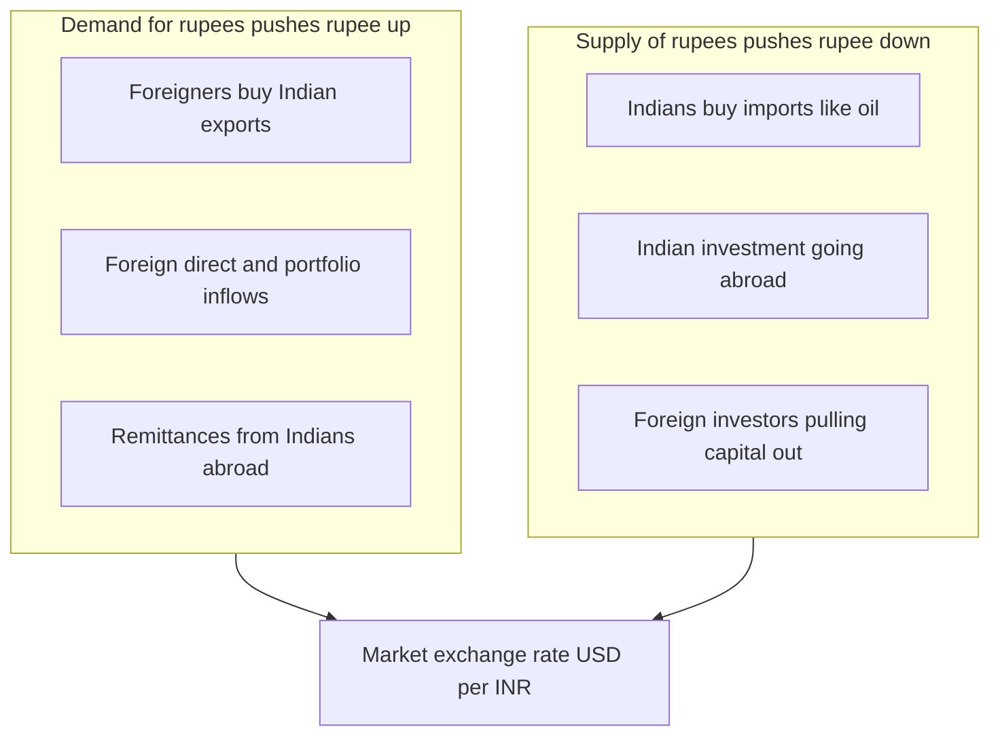
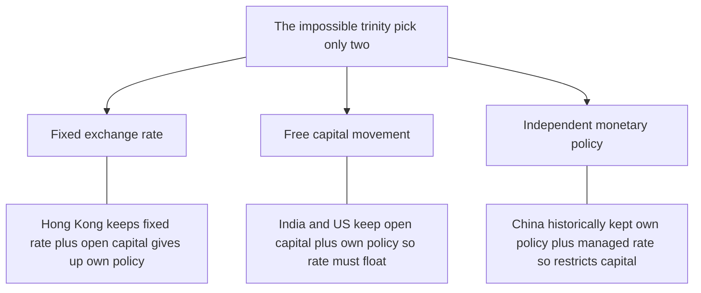
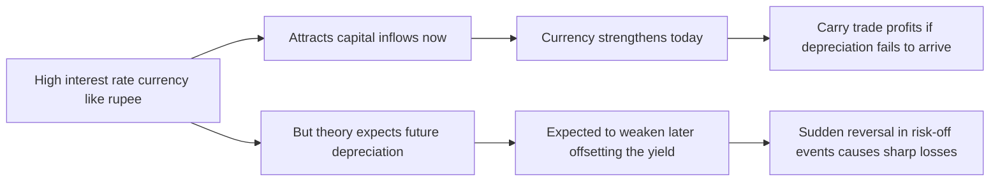
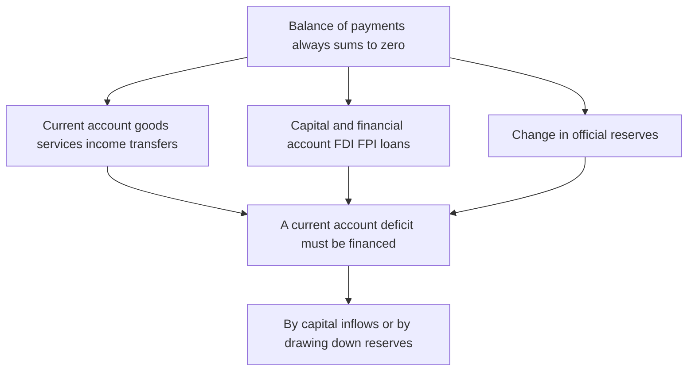

# Chapter 20 — Exchange Rates and the Balance of Payments

## 1. The Problem / Need — How Do Two Countries With Two Different Monies Trade and Invest?

Every nation prints its own money. India settles debts in rupees, the United States in dollars, the eurozone in euros, Japan in yen. Inside a country this causes no friction — a Delhi baker and a Chennai miller both quote in rupees and the price system does its work. But the moment economic life crosses a border, a deep problem appears. An Indian software firm sells services to an American bank; the American pays in dollars, but the Indian firm must pay its Bengaluru engineers in rupees. A Gujarati refiner buys crude oil from Saudi Arabia priced in dollars, but earns its revenue selling diesel in rupees at home. A Japanese pension fund wants to buy Indian government bonds that pay rupee coupons, but its liabilities to retirees are in yen.

In every one of these transactions, one money must be converted into another. **The core problem is this: when two countries use different currencies, any cross-border trade, borrowing, or investment requires a rate at which one money is swapped for the other — and that rate is itself a price that moves, creating both opportunity and risk.** That price is the **exchange rate**, and the running ledger of every such cross-border transaction a country makes is the **balance of payments (BoP)**.

Why must a finance professional understand this cold, rather than treat it as an economist's abstraction?

- **The currency is the master price of an open economy.** It sits on top of every other price. A move in USD/INR simultaneously changes the profit of every exporter, the cost of every import, the rupee value of every dollar bond, and the domestic-currency return on every foreign investment.
- **Currency risk is inescapable in modern portfolios.** A rupee investor who buys US equities earns two returns stacked together — the stock's return and the dollar's move against the rupee. Ignore the second and you do not understand your own P&L.
- **The BoP is the early-warning system for crises.** Nearly every emerging-market financial crisis — Mexico 1994, Asia 1997, India's own 1991 crisis — announced itself first in the balance of payments, as reserves drained and the currency buckled. Reading the BoP is reading the macro vital signs.
- **Rates, bonds, and currencies are one interconnected system.** You cannot fully understand a central bank's interest-rate decision (Chapter 18) without seeing its effect on the currency, and you cannot understand the currency without the BoP. This chapter closes the loop of open-economy macro.

This chapter builds the whole machine: what an exchange rate actually *is* and how it is quoted, how it is determined in the market, the great choice between fixed and floating regimes, the two iron parity conditions (purchasing power parity and interest rate parity) that tie currencies to prices and interest rates, the full architecture of the balance of payments, and — the payoff for finance — exactly how currency movements ripple into trade, inflation, and cross-border investment.

## 2. The Core Idea

**An exchange rate is the price of one currency in terms of another. Like any price, it is set by the supply of and demand for the currency, which in turn is driven by the flows recorded in the balance of payments — the complete accounting of every transaction between a country's residents and the rest of the world.**

Unpack that, because each part is load-bearing.

- **A currency is a good that has a price.** Rupees are demanded by anyone who needs to pay for Indian goods, services, or assets; they are supplied by anyone holding rupees who wants foreign goods or assets instead. Where demand meets supply, the price — the exchange rate — settles.
- **Two things drive that supply and demand: trade and capital.** People buy rupees to purchase Indian exports (the *current account*) and to invest in Indian bonds, stocks, and factories (the *capital account*). The balance between money flowing in and money flowing out determines pressure on the currency.
- **The exchange rate is a relative price, so it always has two interpretations.** A rise in USD/INR from 80 to 85 means the *dollar* got stronger (each dollar buys more rupees) and equivalently the *rupee* got weaker (each rupee buys fewer dollars). Depreciation of one currency *is* appreciation of the other — the same event seen from two sides.
- **Two anchors tie currencies to the rest of the economy.** In the long run, exchange rates are pulled toward **purchasing power parity** — the level that equalises the price of goods across countries. In the short run, they are pulled by **interest rate parity** — the level at which investors are indifferent between holding two currencies given their interest rates. Prices anchor the long run; interest rates anchor the short.

The single deepest idea: **a floating exchange rate is a self-balancing price that clears the balance of payments.** If a country buys more from the world than it sells and borrows to cover the gap, downward pressure builds on its currency until it becomes cheap enough to revive exports and choke imports — restoring balance. The currency is not a sideshow; it is the *equilibrating variable* of the entire open economy.

The two directions a currency can move give us the essential vocabulary:

- **Depreciation / weakening** (under floating) or **devaluation** (a deliberate downward reset under a fixed regime) — the home currency buys less foreign currency. Exports cheaper, imports dearer.
- **Appreciation / strengthening** (floating) or **revaluation** (fixed) — the home currency buys more. Imports cheaper, exports dearer.

## 3. How It Works — Supply, Demand, and the Foreign Exchange Market

Start with the marketplace itself. The **foreign exchange (forex or FX) market** is the largest financial market on earth, trading well over seven trillion US dollars a day — dwarfing all the world's stock markets combined. It has no single physical location; it is a global, round-the-clock network of banks, dealers, corporations, central banks, and funds trading currencies electronically.

An exchange rate is a ratio between two currencies, always quoted as a **pair**. USD/INR = 83 means one US dollar costs 83 rupees. The first currency (USD) is the *base*; the second (INR) is the *quote* or *terms* currency. The number tells you how many units of the quote currency buy one unit of the base. When the number rises, the base currency has strengthened.

Now the mechanics of price formation. Consider the market for rupees against dollars.

- **Demand for rupees comes from anyone who needs to acquire them.** Americans importing Indian textiles, foreign tourists visiting Kerala, global funds buying Indian government bonds or Infosys shares, multinationals building a plant in Pune. All must first sell dollars and buy rupees. More demand for rupees pushes the rupee *up* (USD/INR down).
- **Supply of rupees comes from anyone offloading them.** Indian importers of crude oil and electronics, Indian tourists abroad, Indian firms investing overseas, foreign investors *pulling money out* of India. All sell rupees to buy dollars. More supply pushes the rupee *down* (USD/INR up).

Where the demand curve for rupees crosses the supply curve, the market-clearing exchange rate settles — exactly like any other price.

*Figure 20.1 — The exchange rate is the price that clears the market for a currency, set where demand for rupees meets supply of rupees.*

Two features make this price special. First, it is **relative** — every FX quote is a comparison of two economies, so a currency can move because of events at home *or* abroad. The rupee can fall not because India weakened but because the dollar strengthened globally (as in 2022, when US rate hikes lifted the dollar against nearly everything). Second, it is **forward-looking** — traders price not today's flows but *expected* flows, so news about future interest rates, growth, or politics moves the rate instantly, before any goods actually cross the border.

## 4. Full Content — Determination, Regimes, Parities, and the Balance of Payments

### 4.1 What Determines Exchange Rates — The Layered View

There is no single formula; instead, different forces dominate over different horizons. Think of three layers.

**A) The long run — relative prices and purchasing power.** Over years and decades, a currency's value is anchored by what its money can *buy*. If Indian inflation persistently runs above US inflation, the rupee must fall over time to keep Indian goods competitive. This is **purchasing power parity**, developed in Section 4.3.

**B) The medium run — the balance of payments and competitiveness.** Over months to years, a country running a large **current account deficit** (importing more than it exports) must attract offsetting capital inflows or see its currency weaken. Persistent trade competitiveness, terms of trade (the price of a country's exports relative to its imports), and productivity growth all feed in.

**C) The short run — interest rates, expectations, and capital flows.** Day to day, currencies are dominated by financial flows chasing yield and safety. Higher domestic interest rates attract capital and lift the currency; risk-off panic sends money fleeing to safe havens (the dollar, yen, Swiss franc). This is governed by **interest rate parity**, developed in Section 4.4. On any given day, an exchange rate is overwhelmingly a *financial* asset price, not a goods price.

The key finance insight: **most day-to-day currency movement is about capital, not trade.** Trade flows are large but slow and predictable; capital flows are enormous, fast, and sentiment-driven. That is why a central-bank statement or a US jobs report moves a currency more in a minute than a month of trade data.

### 4.2 Exchange Rate Regimes — Fixed vs Floating

A government faces a fundamental choice: let the market set the currency's value, or fix it. This is the **exchange rate regime**, and it sits on a spectrum.

**Floating (flexible) exchange rate.** The rate is set by supply and demand with no official target. The US dollar, euro, yen, pound, and Indian rupee are floating. The currency absorbs shocks automatically — a bad trade shock weakens it, which cushions the economy by boosting exports. The cost is *volatility*: businesses and investors face constant currency risk.

**Fixed (pegged) exchange rate.** The government commits to hold the currency at a set value against an anchor (usually the dollar) or a basket, and defends it by buying and selling foreign reserves. The Hong Kong dollar (pegged near 7.8 to the USD), the Gulf states' currencies (the Saudi riyal, the UAE dirham), and the old Bretton Woods system are examples. The benefit is *stability and credibility* — invaluable for small trade-dependent economies and inflation-prone ones. The cost is the surrender of independent monetary policy and the risk of a speculative attack.

**Managed float (dirty float).** The real world's most common arrangement, and India's. The rupee floats, but the RBI intervenes — buying or selling dollars from its reserves — to smooth excessive volatility without defending any particular level. It gets much of floating's flexibility while damping the swings.

The deep constraint governing this choice is the **impossible trinity (trilemma)**: a country can have at most *two* of three things — (1) a fixed exchange rate, (2) free movement of capital, and (3) independent monetary policy. It cannot have all three.

*Figure 20.2 — The policy trilemma. Choosing any two corners forces you to abandon the third, which explains why nations pick the regimes they do.*

To see why: if India fixes the rupee to the dollar *and* allows free capital flows, then Indian interest rates *must* equal US rates — because any gap would trigger unlimited arbitrage capital flows that the RBI could not offset, breaking either the peg or capital freedom. Fixing the rate hands your monetary policy to the anchor country's central bank. This is not theory; it is exactly why Hong Kong's rates move in lockstep with the Fed, and why China maintains capital controls to keep both a managed rate and its own policy.

| Dimension | Floating regime | Fixed (pegged) regime |
|---|---|---|
| Who sets the rate | Market supply and demand | Government defends a target |
| Adjusts to shocks | Automatically via the rate | Via domestic wages and prices (painful) |
| Monetary policy | Independent | Surrendered to the anchor country |
| Currency risk for business | High | Low (until the peg breaks) |
| Reserves needed | Low | Large war chest to defend the peg |
| Crisis mode | Overshooting and volatility | Speculative attack and sudden collapse |
| Examples | USD, EUR, JPY, INR (managed) | HKD, Saudi riyal, UAE dirham |

### 4.3 Purchasing Power Parity — The Long-Run Price Anchor

**Purchasing power parity (PPP)** says that in the long run, exchange rates should move to equalise the price of the same basket of goods across countries. It rests on the **law of one price**: absent trade barriers and transport costs, an identical good must cost the same everywhere once converted to a common currency, because otherwise arbitrageurs would buy where it is cheap and sell where it is dear.

**Absolute PPP** states the exchange rate equals the ratio of the two countries' price levels. If a basket costs 8,300 rupees in India and 100 dollars in the US, then USD/INR should be 83. *The Economist's* famous **Big Mac Index** is a playful test: it compares the price of a Big Mac across countries to gauge whether a currency is over- or under-valued relative to PPP. Persistent gaps (a Big Mac being far cheaper in India than the US even after conversion) suggest the rupee is "undervalued" on this crude measure — reflecting that non-traded local costs like labour and rent are cheaper in poorer countries (the **Balassa–Samuelson effect**).

**Relative PPP** is the more useful, weaker form, and it is what practitioners actually use. It says the *change* in the exchange rate over time equals the *difference in inflation* between the two countries:

> Rate of currency depreciation ≈ Domestic inflation − Foreign inflation

If India runs 6% inflation and the US 2%, the rupee should depreciate against the dollar by roughly 4% a year. This is a powerful and durable regularity: over decades, high-inflation currencies steadily lose value against low-inflation ones. The long, grinding slide of the rupee from around 18 per dollar in 1991 to over 80 by the 2020s is overwhelmingly a PPP story — a persistent inflation differential playing out over thirty years.

The limits of PPP matter for a finance professional. It holds well over long horizons and for tradable goods, but *fails badly* in the short run — currencies can deviate from PPP for years because capital flows, not goods arbitrage, dominate the short term. PPP tells you where a currency is heading over a decade; it tells you almost nothing about where it will be next month.

### 4.4 Interest Rate Parity — The Short-Run Financial Anchor

If PPP governs the long run through goods, **interest rate parity (IRP)** governs the short run through capital. It is the single most important relationship for anyone trading currencies, bonds, or hedging cross-border exposure.

The core logic is **no-arbitrage**: an investor choosing between depositing money at home or abroad should earn the same return either way once currency risk is accounted for — otherwise riskless profit would exist and be arbitraged away instantly.

**Covered interest rate parity (CIP)** is the exact, arbitrage-enforced version. It uses the **forward exchange rate** — a rate agreed today for exchanging currencies at a future date, which lets an investor lock in (cover) the currency risk. CIP says:

> The forward premium or discount on a currency exactly equals the interest rate differential between the two countries.

Concretely, if Indian rates are higher than US rates, the rupee must trade at a **forward discount** — the forward USD/INR is higher than the spot, meaning the rupee is expected to be cheaper in the future by exactly the interest gap. Why must this hold? Suppose it did not. An investor could borrow cheap dollars, convert to rupees, earn the higher Indian rate, and lock in the reconversion via a forward contract — pocketing a riskless profit. Traders pile into that trade until forward prices adjust and the free lunch vanishes. CIP is one of the most reliably enforced relationships in all of finance (it wobbled only during the 2008 crisis when balance-sheet constraints impaired arbitrage).

**Uncovered interest rate parity (UIP)** is the theoretical version without a forward hedge. It says the *expected* change in the spot rate equals the interest differential — a currency with higher interest rates is *expected* to depreciate by that amount, so that expected returns are equalised. UIP embodies a profound idea: **higher interest rates should not, in theory, give you a higher return, because the extra yield is expected to be eaten by currency depreciation.**

In practice UIP fails empirically — and its failure is the basis of the **carry trade**, one of the most famous strategies in finance. Traders borrow in a low-yielding currency (historically the Japanese yen, with near-zero rates) and invest in a high-yielding one (the Indian rupee, Brazilian real, Australian dollar). If UIP held, the high-yield currency would depreciate and wipe out the gain. Empirically it often does *not* fall as much as UIP predicts, so carry traders earn the interest differential — for years at a time. The catch: the strategy is "picking up nickels in front of a steamroller." In a risk-off shock, high-yield currencies crash all at once, and the carry trade suffers violent losses. The 2008 crisis and the August 2024 yen-carry unwind both delivered exactly this.

*Figure 20.3 — Interest rate parity and the carry trade. High yields attract capital now but theory expects a later offsetting fall so the strategy earns steadily then loses violently.*

Putting the two parities together clarifies the whole subject: **PPP links currencies to inflation over the long run; IRP links currencies to interest rates over the short run.** And since central banks set interest rates partly to control inflation, the two are ultimately connected through monetary policy — which is why Chapters 13, 18, and 20 are one continuous story.

### 4.5 The Balance of Payments — The Nation's Financial Statement

The **balance of payments (BoP)** is the complete, systematic record of *all* economic transactions between the residents of a country and the rest of the world over a period (usually a year or a quarter). It is, in effect, a nation's cash-flow statement with the world. It is compiled using **double-entry bookkeeping**, which means — by construction — that the balance of payments *always balances*. Every transaction is recorded twice, once as a credit and once as a debit, so the grand total is necessarily zero. When people say a country has a "BoP deficit," they are loosely referring to an imbalance in a *sub-account*, not the whole.

The BoP has two main accounts (plus a reserves component and a small errors term).

**A) The current account** records flows of goods, services, income, and transfers — essentially the *real economy's* dealings with the world. It has four parts:

- **Trade balance (goods)** — merchandise exports minus imports. India runs a large goods deficit, dominated by crude oil, gold, and electronics imports.
- **Services** — exports minus imports of services. India runs a huge services *surplus*, powered by IT and software exports (the great offset to its goods deficit).
- **Primary income** — cross-border interest, dividends, and wages. A country that has borrowed heavily abroad pays out net income here.
- **Secondary income (transfers)** — one-way flows like remittances and foreign aid. India is the world's largest recipient of **remittances** (over 100 billion dollars a year from Indians working abroad), a massive positive item.

A **current account deficit (CAD)** means a country is, on net, buying more real goods, services, and income from the world than it sells — it is spending more than it earns and must finance the gap by borrowing or selling assets abroad. A surplus means the reverse.

**B) The capital and financial account** records flows of *assets* — who is buying and selling ownership claims across borders. (In the modern IMF framework the large flows sit in the "financial account," with a small "capital account" for things like debt forgiveness; in common usage and in Indian practice the whole thing is often called the "capital account.") Its major components:

- **Foreign direct investment (FDI)** — long-term, controlling stakes: a foreign firm building a factory or buying a company. Considered *stable, patient* capital.
- **Foreign portfolio investment (FPI)** — foreigners buying stocks and bonds without control. Large, liquid, and *fickle* — it can reverse in days, earning the nickname "hot money."
- **Loans and banking flows** — external commercial borrowings, NRI deposits, trade credit.
- **Reserve assets** — the change in the central bank's holdings of foreign exchange reserves, the balancing valve.

The fundamental identity ties it all together:

> Current account + Capital and financial account + Change in reserves = 0

The intuition is unavoidable: **if a country runs a current account deficit, it must, by definition, be a net importer of capital.** The money to pay for those excess imports has to come from somewhere — either foreigners are lending to it and buying its assets (a capital account surplus), or the central bank is running down its reserves. A current account deficit is *financed* by a capital account surplus. This identity is the master key to reading a country's external position.

*Figure 20.4 — The balance of payments identity. A current account deficit is necessarily matched by a capital account surplus or a fall in reserves.*

### 4.6 How Currency Movements Transmit — Trade, Inflation, and Investment

This is where the machinery pays off for finance. A currency move is not an isolated event; it propagates through three great channels.

**Channel 1 — Trade competitiveness.** A **depreciation** makes a country's exports cheaper to foreigners and imports dearer at home. In theory this improves the trade balance — exports rise, imports fall. But the effect is *delayed and can initially perversely worsen the deficit*, a pattern called the **J-curve**: right after a depreciation, the volume of trade has not yet adjusted, so the same imports simply cost more in home currency, widening the deficit before the volume response eventually turns it around. The improvement also requires that demand be sufficiently price-sensitive (the **Marshall–Lerner condition**: the sum of export and import demand elasticities must exceed one).

**Channel 2 — Inflation (the pass-through channel).** A weaker currency raises the home-currency price of every import — most dangerously oil, which India imports overwhelmingly and which is priced in dollars. A falling rupee mechanically raises fuel, fertiliser, and electronics prices, feeding directly into domestic inflation. This is **exchange rate pass-through**, and it is why the RBI cannot ignore the currency even under a floating regime: a sliding rupee is an inflationary force that can force the central bank to raise rates to defend both prices and the currency. Here the currency and interest-rate stories fuse.

**Channel 3 — Cross-border investment returns.** For a portfolio investor, the currency is a return in its own right. A foreign investor's total return on an Indian asset equals the asset's rupee return *plus* the rupee's move against the investor's home currency. A US fund can pick winning Indian stocks yet *lose* money if the rupee falls enough — the currency loss swamps the equity gain. This is why global investors watch the rupee as closely as they watch Indian earnings, and why **currency hedging** (using forwards to lock in the conversion rate) is a core part of international investing. It also drives capital flows in reverse: expected rupee depreciation *reduces* foreign appetite for Indian bonds, raising the yields India must pay — the currency and the bond market moving as one.

The grand synthesis: a currency depreciation *helps* exporters and import-substituting firms, *hurts* import-dependent firms and foreign holders of local assets, *raises* domestic inflation, and *pressures* the central bank toward tighter policy. Every one of these is a tradable, investable consequence.

## 5. Real Examples

**Example 1 — India's 1991 balance-of-payments crisis.** The archetypal BoP crisis and the founding trauma of modern Indian economics. Through the late 1980s India ran persistent, widening current account deficits financed by external borrowing. The 1990–91 Gulf War spiked oil prices (India's biggest import) and cut remittances from Gulf workers, while political instability spooked lenders. Foreign exchange reserves collapsed to under two weeks of imports — India was days from defaulting on its external obligations. The government airlifted 47 tonnes of gold to the Bank of England and IMF as collateral for emergency loans, sharply **devalued** the rupee (which had been effectively pegged), and launched the sweeping 1991 liberalisation. The lesson stamped on every Indian policymaker: a country that runs current account deficits financed by fickle debt, while holding thin reserves, is one shock away from catastrophe. It is why the RBI today hoards over 600 billion dollars of reserves.

**Example 2 — The 2013 "Taper Tantrum" and the fragile rupee.** In May 2013 the US Federal Reserve merely *hinted* it might slow ("taper") its bond-buying. That signalled higher future US interest rates, and capital that had flowed into emerging markets chasing yield suddenly reversed toward the strengthening dollar. India — running a wide current account deficit funded heavily by fickle portfolio (FPI) flows — was branded one of the "Fragile Five." The rupee plunged roughly 20% against the dollar in months, from about 55 to nearly 68. This is interest rate parity and capital-flow dynamics in raw form: a change in *expected US rates* moved the rupee violently, with no change in India's trade at all. The RBI responded with special swap windows to attract NRI dollar deposits and defend the currency.

**Example 3 — The August 2024 yen carry-trade unwind.** For years, near-zero Japanese interest rates made the yen the world's favourite funding currency: investors borrowed yen cheaply and bought higher-yielding assets globally — a textbook carry trade exploiting the failure of uncovered interest rate parity. When the Bank of Japan unexpectedly raised rates in late July 2024 while weak US data raised expectations of Fed *cuts*, the interest differential narrowed sharply. The yen surged, forcing a stampede to unwind the trade; the resulting cascade slammed global equity markets (Japan's Nikkei fell over 12% in a single day on 5 August 2024). A pure demonstration that carry trades earn steadily and then lose violently, and that currency, rate, and equity markets are one interconnected system.

**Example 4 — Hong Kong's dollar peg and the trilemma in action.** Hong Kong fixes its dollar near 7.8 to the US dollar under a rigid currency-board arrangement and keeps its capital account fully open. By the impossible trinity, this forces it to *import US monetary policy* — when the Fed hikes, Hong Kong's rates must follow, regardless of local conditions. During 2022–23, as the Fed raised rates aggressively, Hong Kong endured tighter monetary conditions and a property slump it could not fight, precisely because it had chosen the peg-plus-open-capital corners of the triangle and surrendered the third.

## 6. Connections

- **To monetary policy (Chapter 18).** Interest rate parity is the bridge: a central bank's rate decision immediately moves its currency via capital flows. Rate hikes tend to strengthen a currency (attracting capital); cuts weaken it. Under the trilemma, a fixed regime *surrenders* monetary policy entirely.
- **To inflation (Chapter 13).** PPP ties long-run currency values to inflation differentials, and exchange-rate pass-through makes a weak currency a *source* of imported inflation — a two-way street between prices and the exchange rate.
- **To bonds and interest rates.** Expected currency depreciation raises the yield foreign investors demand on a country's bonds; covered interest parity ties every currency forward directly to the two countries' interest rates. The bond market and the FX market are joined at the hip.
- **To equities and cross-border investing.** Every international equity return is a stacked bet on the asset *and* the currency, making FX risk and hedging central to global portfolio management.
- **To business cycles and aggregate demand (Chapters 15–16).** Net exports are a component of aggregate demand; a depreciation can stimulate an economy by boosting exports, making the exchange rate a shock absorber under floating regimes.
- **To fiscal policy and sovereign risk.** Large twin deficits (fiscal plus current account) heighten currency vulnerability, linking government budgets to the exchange rate.

## 7. Key Terms

- **Exchange rate** — the price of one currency in terms of another, quoted as a pair (e.g. USD/INR).
- **Appreciation / depreciation** — a rise / fall in a currency's market value under floating rates.
- **Revaluation / devaluation** — a deliberate upward / downward reset of a *fixed* rate by the authorities.
- **Floating regime** — exchange rate set freely by market supply and demand.
- **Fixed / pegged regime** — rate held at an official target, defended with reserves.
- **Managed float (dirty float)** — market-set rate with discretionary central-bank intervention (India's system).
- **Impossible trinity (trilemma)** — a country can have at most two of: fixed rate, free capital flows, independent monetary policy.
- **Purchasing power parity (PPP)** — the long-run tendency for exchange rates to equalise the price of goods across countries; relative PPP links currency moves to inflation differentials.
- **Law of one price** — identical tradable goods should cost the same everywhere in a common currency.
- **Interest rate parity (IRP)** — currencies adjust so that returns are equalised given interest differentials; *covered* uses forwards (arbitrage-enforced), *uncovered* uses expectations.
- **Forward exchange rate** — a rate agreed today for a future currency exchange; a forward premium/discount reflects the interest differential.
- **Carry trade** — borrowing in a low-yield currency to invest in a high-yield one, profiting from UIP's empirical failure.
- **Balance of payments (BoP)** — the complete double-entry record of a country's transactions with the world; always sums to zero.
- **Current account** — flows of goods, services, income, and transfers (the trade balance plus services, income, and remittances).
- **Capital / financial account** — flows of assets: FDI, portfolio investment (FPI), loans, and reserves.
- **Current account deficit (CAD)** — importing more real goods and services than exporting; must be financed by capital inflows or reserve drawdown.
- **FDI vs FPI** — direct (controlling, stable) versus portfolio ("hot," fickle) foreign investment.
- **Exchange-rate pass-through** — the degree to which currency moves feed into domestic prices.
- **J-curve / Marshall–Lerner condition** — the delayed, initially perverse trade response to depreciation, and the elasticity condition for it eventually to improve the balance.
- **Foreign exchange reserves** — a central bank's stock of foreign assets, used to defend or manage the currency.

## 8. Common Confusions

- **"A weak currency is bad; a strong currency is good."** Neither is inherently good or bad. A weak currency helps exporters and tourism but hurts importers and raises inflation; a strong currency does the reverse. What matters is *why* it moved and *for whom*. Export-led economies (China historically, Japan) often *want* a weaker currency.
- **Depreciation vs devaluation.** *Depreciation* is a market-driven fall under floating; *devaluation* is a deliberate policy cut under a fixed regime. Using them interchangeably signals confusion about the exchange-rate regime.
- **"The balance of payments doesn't balance."** It *always* balances by construction (double entry). "BoP deficit/surplus" colloquially means an imbalance in a *sub-account* (usually the current account), offset elsewhere.
- **Current account deficit = the economy is failing.** Not necessarily. A CAD means a country is a net importer of capital — which can reflect *attractive investment opportunities* drawing in foreign capital (healthy) or *unsustainable overspending* funded by hot money (dangerous). The financing quality — stable FDI versus fickle FPI — matters more than the deficit's size.
- **Higher interest rates always strengthen a currency.** True in the short run via capital inflows, but uncovered interest parity says higher rates should be *expected* to be offset by future depreciation. And if high rates reflect high inflation, PPP predicts long-run weakness. The sign can flip with the horizon.
- **PPP tells you where the currency will be next quarter.** No. PPP is a *long-run* anchor that fails badly short-term; short-run moves are dominated by capital flows and interest parity.
- **Confusing which way the quote moves.** USD/INR *rising* from 80 to 85 means the *rupee weakened* (dollar strengthened). Because it is a ratio, a rising USD/INR number is a *falling* rupee — a constant source of error.
- **The forward rate is a forecast.** A forward exchange rate is set purely by interest differentials (covered parity), not by anyone's prediction of where the currency will go. It is an arbitrage price, not a forecast.

## 9. Recap

An exchange rate is the price of one currency in terms of another, set in the vast foreign exchange market by the supply of and demand for each currency. Those flows are catalogued in the **balance of payments** — a double-entry ledger of a nation's every transaction with the world, split into a **current account** (goods, services, income, transfers) and a **capital/financial account** (FDI, portfolio flows, loans, reserves). Because it is double-entry, the BoP always sums to zero: a current account deficit is necessarily financed by a capital account surplus or falling reserves.

Governments choose an **exchange-rate regime** along a spectrum from free-floating to hard-pegged, constrained by the **impossible trinity** — you cannot simultaneously fix the rate, allow free capital flows, and run an independent monetary policy. India runs a managed float; Hong Kong runs a hard peg and thereby imports US policy.

Two parity conditions anchor currencies to the rest of the economy. **Purchasing power parity** ties long-run values to inflation differentials — high-inflation currencies steadily depreciate. **Interest rate parity** ties short-run values to interest differentials — covered parity is arbitrage-enforced through forwards, while uncovered parity's empirical failure powers the carry trade. Prices anchor the long run; interest rates the short.

Currency movements transmit through three channels: **trade** (depreciation aids exports with a J-curve delay), **inflation** (pass-through, dangerous for oil-importing India), and **investment** (currency moves are a return in themselves, making hedging essential). The whole system — rates, bonds, currencies, inflation, and capital flows — is one interconnected machine, and the exchange rate is the equilibrating price that clears the open economy.

## 10. Quick-Reference / Interview Points

- **One-line definition:** An exchange rate is the price of one currency in another; the balance of payments is the complete double-entry record of a country's transactions with the world, and it always sums to zero.
- **Fixed vs floating:** Floating adjusts automatically but is volatile and keeps monetary independence; fixed offers stability but surrenders monetary policy and risks speculative attack. India runs a managed float.
- **The trilemma (say this in any macro interview):** Fixed rate, free capital, independent monetary policy — pick two. This single idea explains every regime choice on earth.
- **PPP in one sentence:** In the long run a currency depreciates by roughly its inflation differential with the other country (relative PPP) — the reason the rupee fell from ~18 to ~83 per dollar over three decades.
- **IRP in one sentence:** Covered parity forces the forward premium to equal the interest differential (pure arbitrage); uncovered parity says high-rate currencies are *expected* to depreciate — and its failure is why the carry trade exists.
- **Carry trade:** Borrow low-yield (yen), invest high-yield (rupee, real); earns the differential for years, then blows up in risk-off shocks (2008, August 2024 yen unwind). "Picking up nickels in front of a steamroller."
- **BoP identity:** Current account + capital/financial account + change in reserves = 0. A current account deficit *must* be financed by capital inflows or reserve drawdown.
- **Current vs capital account:** Current = real economy (trade, services, remittances, income). Capital = asset flows (FDI stable, FPI fickle "hot money").
- **Three transmission channels of a currency move:** trade competitiveness (J-curve, Marshall–Lerner), inflation (pass-through, oil for India), and cross-border investment returns (currency is a return; hedge it).
- **India specifics to name-drop:** goods deficit (oil, gold) offset by a services surplus (IT) and record remittances; the 1991 crisis and 47-tonne gold airlift; the 2013 taper tantrum and "Fragile Five"; RBI's 600-billion-dollar reserve war chest.
- **The quote-direction trap:** USD/INR up = rupee *down*. Get this right instinctively.
- **The synthesis to close on:** Prices anchor currencies in the long run (PPP), interest rates in the short run (IRP), and the balance of payments is the flow that connects them — making the exchange rate the master equilibrating price of an open economy.
