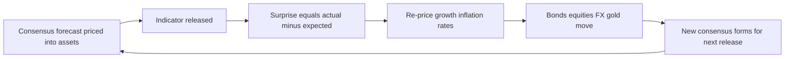
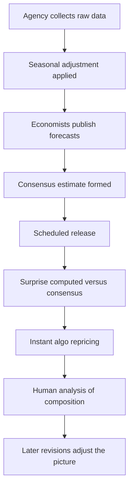
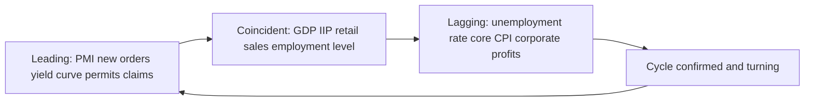
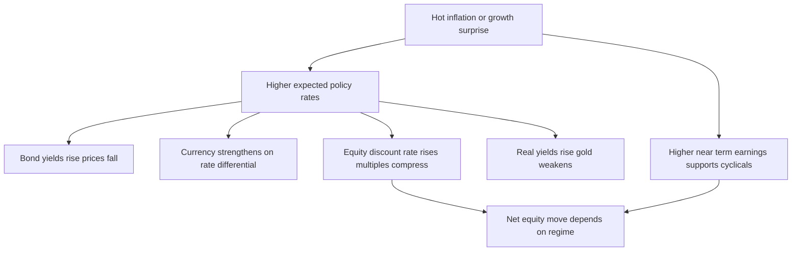
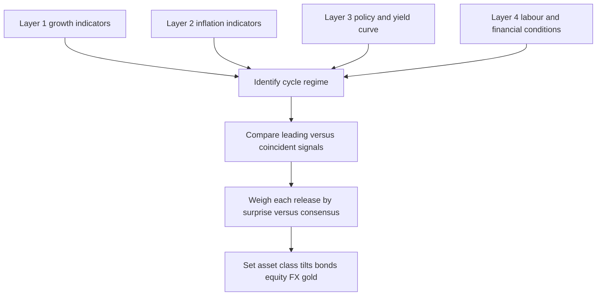

# Chapter 21 — Economic Indicators for Finance

## 1. The Problem / The Need

Imagine you manage a bond portfolio on a Monday morning. Overnight, the US Bureau of Labor Statistics reported that the economy added 350,000 jobs against an expected 180,000. Within seconds, 10-year Treasury yields jump 12 basis points, the dollar strengthens, gold falls, and equity futures wobble. You did not change your view — the *data* changed the world's view, and prices moved to reflect it. If you did not understand what a payrolls number *means*, why it moved yields, and whether the move is justified, you are a passenger, not a driver.

This is the central problem of markets: **prices are forecasts of the future, but the future arrives one data point at a time.** Every asset price — a bond yield, a stock's P/E, a currency's exchange rate — embeds an implicit forecast of growth, inflation, and policy. Economic indicators are the scoreboard that tells us whether reality is tracking ahead of, behind, or in line with that forecast. When reality diverges from the consensus forecast, prices *must* move. That gap between expectation and reality — the **surprise** — is what actually moves markets, not the level of the number itself.

A finance professional therefore needs three things. First, **fluency**: knowing what GDP, CPI, PMI, IIP, payrolls, and the yield curve each measure, and what they don't. Second, **timing**: knowing which indicators lead the cycle (and so warn you early) versus which lag (and merely confirm what prices already knew). Third, **a reaction function**: knowing how a given asset class *should* respond to a given surprise, so you can judge whether a market move is an opportunity or a warning. Without these, you cannot form a macro view, size a trade, or explain to a client why the portfolio moved. This chapter builds that toolkit and shows you how to assemble the indicators into a working dashboard that produces investable views.

## 2. The Core Idea

The core idea is deceptively simple and enormously powerful:

> **Markets price expectations. Indicators reveal reality. The difference — the surprise — drives price changes.**

Three consequences flow from this.

**(a) Only the surprise matters at the moment of release.** If everyone expects Indian CPI at 5.0% and it prints 5.0%, the number is already "in the price" — nothing happens. If it prints 5.8%, bond yields rise because the market must re-price the odds of RBI holding rates higher for longer. The level (5.8%) is less important than the miss (0.8 percentage points above consensus). This is why professionals watch the **consensus estimate** as closely as the number itself.

**(b) Indicators differ in how early they speak.** Some data — new orders, building permits, the yield curve, credit spreads — turn *before* the economy does. These are **leading indicators**; they are noisy but forward-looking. Others — GDP, unemployment, corporate profits — turn *after* the economy has already moved. These are **lagging indicators**; they are reliable but backward-looking. A great macro analyst weights the leading set for positioning and uses the lagging set for confirmation.

**(c) The same number means different things to different assets.** A hot jobs report is good for corporate earnings (equities like growth) but bad for bonds (growth stokes inflation and rate hikes). Strong growth lifts a currency (higher rates attract capital) but can hurt gold (which pays no yield). There is no universally "good" or "bad" number — there is only a number, an asset, and a *reaction function* that connects them through the channels of growth, inflation, and interest rates.

Hold these three ideas and the rest of the chapter is elaboration: what each indicator measures, where it sits on the lead-lag spectrum, and how each asset class reacts.

*Figure 21.1 — The expectation-surprise loop that drives every data-day price move.*

## 3. How It Works

An economic indicator travels a well-defined path from a statistical agency to a trading screen, and understanding that pipeline is what separates a reactive trader from an anticipatory one.

**Step 1 — Collection.** A government agency or private body measures some slice of the economy. India's National Statistical Office (NSO) compiles GDP and the Index of Industrial Production (IIP). The Ministry of Statistics releases CPI; the Office of the Economic Adviser releases WPI. Globally, the US BLS produces payrolls and CPI, the BEA produces GDP, and private firms like S&P Global produce Purchasing Managers' Indices (PMIs).

**Step 2 — Consensus formation.** Before release, economists at banks and research houses publish forecasts. Data providers (Bloomberg, Reuters, Trading Economics) aggregate these into a **consensus** or median estimate, plus a range. This consensus is what the market has *already priced*.

**Step 3 — Release and surprise.** At a scheduled time the number drops. Algorithms parse it in milliseconds and compute the surprise versus consensus. Prices adjust almost instantly.

**Step 4 — Interpretation.** Humans then dig into the composition — was strong GDP driven by durable consumption or one-off government spending? Was CPI hot because of volatile food or sticky **core** services? The *quality* of the number often matters more over the following days than the headline.

**Step 5 — Revision.** Most indicators are estimates and get revised. GDP is released in advance/provisional/final vintages; payrolls are routinely revised by tens of thousands. A number that looked strong can quietly weaken two months later, which is why smart analysts track revision trends, not just first prints.

Two technical concepts thread through this pipeline:

- **Seasonal adjustment**: raw data is distorted by predictable calendar effects (Diwali retail spikes, US holiday hiring). Agencies "seasonally adjust" to reveal the underlying trend. Always know whether you are looking at SA or raw (NSA) data.
- **Year-on-year vs month-on-month**: YoY (e.g., CPI up 5% versus a year ago) smooths noise but can be distorted by **base effects** — an unusual value in the year-ago period. MoM (annualized) is timelier but noisier. Professionals read both.

*Figure 21.2 — The indicator pipeline from measurement to market reaction.*

## 4. Full Content — The Indicators That Matter

### 4.1 GDP — The Master Scorecard (lagging)

Gross Domestic Product is the total value of goods and services produced in an economy over a period. It is the broadest measure of growth and the denominator for ratios like debt-to-GDP and market-cap-to-GDP. But it is **lagging and slow**: India reports quarterly GDP roughly two months after the quarter ends, and it is heavily revised. By the time GDP confirms a slowdown, bond and equity markets — watching leading indicators — have usually moved months earlier.

What professionals actually extract from GDP:
- **Real vs nominal.** Real GDP strips out inflation and measures true volume growth; nominal GDP (real plus inflation) is what drives tax revenue, corporate sales, and debt sustainability. For equity earnings, nominal GDP is often the better guide.
- **Composition.** GDP = Consumption + Investment + Government + Net Exports. Growth driven by private investment and consumption is higher-quality and more durable than growth propped up by government spending or inventory swings.
- **GVA vs GDP** (India-specific): Gross Value Added measures output from the supply side (by sector); GDP adds net taxes. India reports both, and divergences flag tax or subsidy distortions.

### 4.2 Inflation — CPI and WPI (CPI lagging, but policy-critical)

Inflation is the single most important indicator for bond and rate markets because it drives central bank policy.

- **CPI (Consumer Price Index)** measures the price of a basket of goods and services bought by households. In India, CPI is the RBI's official inflation target (**4% +/- 2%** under the flexible inflation-targeting framework). Indian CPI is roughly **46% food and beverages**, making it volatile — a bad monsoon or vegetable price spike can swing the headline sharply.
- **Core CPI** strips out volatile food and fuel to reveal underlying, "sticky" inflation. Central banks care most about core because it reflects demand-driven, persistent pressure they can actually influence with rates.
- **WPI (Wholesale Price Index)** measures prices at the wholesale/producer level — no services, heavy weight on manufacturing and fuel. WPI leads CPI at the margin (input costs feed into consumer prices) and is a better read on producer margins and industrial pricing power. Globally the analogue is the PPI (Producer Price Index).

For markets: an upside CPI surprise raises expected policy rates, pushes bond yields up and bond prices down, and typically strengthens the currency (higher rates) while pressuring rate-sensitive equities.

### 4.3 PMI — The Timeliest Read (leading)

The **Purchasing Managers' Index** surveys purchasing managers on new orders, output, employment, supplier delivery times, and inventories. It is a **diffusion index**: a reading **above 50 signals expansion, below 50 contraction.** Its power comes from three properties: it is **early** (released the first business day of the following month, weeks before hard data), **forward-looking** (new orders foreshadow future output), and **directional** (it captures momentum better than levels). Separate manufacturing and services PMIs exist; in service-dominated economies like India, the composite and services PMI matter enormously.

### 4.4 IIP — Industrial Pulse (coincident, volatile)

India's **Index of Industrial Production** tracks output in mining, manufacturing, and electricity, and is also grouped by use (capital goods, consumer durables/non-durables, infrastructure). Capital-goods output is a useful proxy for private investment appetite. IIP is volatile and revised, so analysts smooth it with 3-month moving averages and watch the **core sector** (eight key industries like coal, steel, cement, electricity) which is released earlier as a leading tell on IIP.

### 4.5 Employment (mixed — claims lead, unemployment lags)

Labour data is the heartbeat of the US market. **Non-farm payrolls** (first Friday monthly) and the **unemployment rate** are marquee releases. Unemployment is a *lagging* indicator — firms fire only after demand has already fallen. **Initial jobless claims** (weekly) are *leading* — a rising trend flags a turning labour market early. **Average hourly earnings** feed directly into inflation fears (wage-price dynamics). India lacks a high-frequency payrolls equivalent; analysts use the periodic **PLFS** (Periodic Labour Force Survey), EPFO payroll additions, and private data like CMIE unemployment estimates.

### 4.6 Policy Rates (the anchor)

The central bank's policy rate — the **RBI repo rate** in India, the **Fed funds rate** in the US — is the anchor of the entire fixed-income curve and the discount rate underneath every asset valuation. Markets obsess less over the current rate than over the *expected path*: forward guidance, the "dot plot" (Fed), the tone of the monetary policy statement, and the vote split. A "hawkish hold" (no change but signalling future hikes) can move markets more than an actual cut.

### 4.7 The Yield Curve (the premier leading indicator)

The yield curve plots government bond yields across maturities. Its **slope** — typically 10-year minus 2-year, or 10-year minus 3-month — is arguably the most respected recession predictor in finance. Normally the curve slopes **upward** (longer bonds yield more, compensating for time and inflation risk). When short rates exceed long rates the curve **inverts**, signalling that markets expect the central bank to cut rates in future because growth is slowing. Every US recession since the 1960s was preceded by a 10y-2y inversion, usually 12-18 months ahead. The curve is powerful precisely because it aggregates the market's *collective* forecast rather than any single data point.

### 4.8 The Broader Set

Rounding out the dashboard: **retail sales** and **auto sales** (consumption pulse, leading-ish), **housing starts / building permits** (leading, rate-sensitive), **credit growth** and **credit spreads** (financial conditions; widening spreads lead stress), **GST collections** (a timely India-specific proxy for nominal activity), **trade balance and exports** (external demand, currency-relevant), and **consumer/business confidence surveys** (soft, leading).

### 4.9 Leading vs Coincident vs Lagging — The Organizing Framework

This is the mental spine of indicator analysis. Classify every release into one of three buckets:

| Type | What it does | Timing vs cycle | Examples | Use in finance |
|---|---|---|---|---|
| **Leading** | Predicts where the economy is heading | Turns *before* the cycle | PMI new orders, yield curve, building permits, jobless claims, stock market, credit spreads, money supply | Positioning, early cycle calls, risk-on/off tilts |
| **Coincident** | Confirms current state | Turns *with* the cycle | IIP, GDP (near-real-time), retail sales, employment level, personal income | Nowcasting, confirming the regime |
| **Lagging** | Confirms a trend already underway | Turns *after* the cycle | Unemployment rate, CPI/core inflation, corporate profits, unit labour cost, outstanding loans | Confirmation, avoiding false signals |

The practical rule: **lead for entry, lag for confirmation.** A leading signal (inverting curve, PMI dropping below 50) gets you positioned early but can give false alarms; you wait for coincident/lagging data to confirm before committing fully. Trading purely off lagging data means you are always late.

*Figure 21.3 — Where indicators sit around the business cycle.*

## 5. Real Examples

### Example 1 — US payrolls shock and the bond market (surprise mechanics)

In early 2023, several US non-farm payrolls prints massively beat expectations (e.g., 517,000 versus ~185,000 expected). The reaction was textbook: 2-year Treasury yields spiked 15-20 bps intraday, the dollar rallied, and rate-cut bets for later in the year were pushed out. **Why?** A hot labour market implies persistent wage pressure and sticky inflation, forcing the Fed to keep rates "higher for longer." Bond prices fell (yields rose), and rate-sensitive growth stocks sold off. The *level* of employment was healthy either way — it was the **surprise versus consensus** that moved the market. A trader who understood the reaction function could have anticipated that a beat would hurt duration and helped the dollar.

### Example 2 — India CPI, food inflation, and RBI (composition matters)

Through 2023-24, Indian headline CPI repeatedly spiked above the RBI's 6% upper tolerance, driven largely by **food** — tomatoes, onions, cereals — after erratic monsoons. Markets and the RBI had to judge: was this transitory food noise or broadening inflation? Because **core CPI** (ex food and fuel) stayed relatively contained and easing, the RBI held the repo rate steady rather than hiking aggressively, treating the food spike as supply-driven and temporary. This shows why professionals dissect **headline vs core**: bond markets did not aggressively sell off on every food-driven headline spike because the *quality* of the inflation signalled it was unlikely to force policy tightening. Reading only the headline would have led to wrong rate and bond calls.

### Example 3 — The 2022-23 US yield-curve inversion (leading indicator in action)

The US 10y-2y spread inverted in mid-2022 and stayed deeply inverted through 2023 — the most inverted in four decades. Historically this had signalled recession within roughly 12-18 months. Investors used it to justify defensive tilts: overweight quality bonds, underweight cyclicals, raise cash. Notably, this cycle the inversion did *not* immediately produce a recession, illustrating the key caveat: **leading indicators warn of risk, they do not guarantee outcomes or timing.** The lesson for finance is to treat leading signals as probability shifts that adjust positioning, confirmed (or refuted) by later coincident data — not as deterministic triggers.

### Example 4 — PMI as an early growth tell (timeliness)

When global manufacturing PMIs slid below 50 across 2022-23, it flagged a manufacturing slowdown *weeks before* hard IIP and GDP data confirmed it. Currency and commodity traders positioned for weaker industrial demand (soft copper, cautious on export-heavy Asian currencies) off the PMI signal alone. Because PMI arrives first and captures new orders, it gave a real timing edge over anyone waiting for GDP.

## 6. Connections to the Rest of Finance

Economic indicators are the input layer beneath every asset class. Here is the transmission map.

**Bonds / fixed income.** Inflation (CPI/WPI/core) and policy-rate expectations are the master drivers. Upside inflation or growth surprises push yields up and prices down; downside surprises rally bonds. The yield curve encodes the market's aggregate growth and rate forecast — its slope, steepening, and inversion are the primary macro trades in rates (see the chapter on the yield curve).

**Equities.** Growth indicators (GDP, IIP, PMI, retail sales) drive earnings expectations; inflation and rates drive the *discount rate* and hence valuation multiples (P/E). This creates the classic tension: strong data lifts earnings but, by raising expected rates, can compress multiples. Which effect dominates depends on the regime — in a "good news is bad news" environment (high inflation, hawkish central bank), strong data can *hurt* stocks.

**Currencies (FX).** Relative growth and, above all, **relative interest-rate expectations** drive exchange rates. A hawkish surprise that raises a country's expected rates attracts capital and strengthens its currency (the carry and rate-differential channels). CPI and payroll surprises are prime FX movers.

**Commodities and gold.** Growth data drives industrial commodity demand (copper, oil as "Dr. Copper" growth gauges). **Gold** is inversely tied to real yields — strong data that lifts real rates typically weighs on gold, since gold pays no yield.

**Financial conditions.** Credit spreads, money supply, and the policy rate together define how "easy" or "tight" the environment is — the backdrop against which every other indicator is interpreted.

*Figure 21.4 — How one indicator surprise ripples across asset classes.*

## 7. Building an Economic-Indicator Dashboard

A dashboard turns scattered releases into a coherent, investable view. The goal is not to collect every number but to organize a curated set so that a glance tells you *where we are in the cycle, where we are heading, and what is surprising.* Structure it in four layers.

**Layer 1 — Growth.** PMI (manufacturing + services, leading), IIP / core sector (coincident), GDP nowcast, retail and auto sales, GST collections (India), exports. Question answered: *Is the economy accelerating or decelerating?*

**Layer 2 — Inflation.** Headline CPI, **core CPI**, WPI/PPI, wage growth, inflation expectations (survey-based and market-implied breakevens). Question: *Is price pressure rising or falling, and is it demand-driven (sticky core) or supply-driven (food/fuel)?*

**Layer 3 — Policy and rates.** Policy rate, forward guidance/dot plot, the **yield curve slope** (10y-2y, 10y-3m), real yields, credit spreads. Question: *What will the central bank do, and what does the bond market expect?*

**Layer 4 — Labour and financial conditions.** Payrolls/jobless claims/unemployment (or PLFS/EPFO in India), credit growth, money supply, business/consumer confidence. Question: *Is the underlying economy tight or loose?*

For each indicator, track four fields, not just the number:

| Field | Why it matters |
|---|---|
| **Actual** | The released value |
| **Consensus** | What was priced — the surprise is actual minus this |
| **Trend / direction** | 3-month moving average and turning points matter more than one print |
| **Revision** | Is the prior print being revised up or down |

**Turning the dashboard into a view.** Synthesize the layers into a **cycle regime** call — early expansion, mid-cycle, late-cycle/overheating, slowdown, or recession/recovery — because each regime favours different assets. A classic mapping:

| Regime | Growth | Inflation | Favoured assets | Avoid |
|---|---|---|---|---|
| **Early expansion (recovery)** | Rising | Low | Cyclical equities, small caps, credit | Cash, defensives |
| **Mid-cycle** | Strong | Rising moderately | Equities broadly, commodities | Long-duration bonds |
| **Late-cycle / overheating** | Peaking | High | Commodities, value, short duration | Growth stocks, long bonds |
| **Slowdown / recession** | Falling | Falling | Government bonds, quality/defensives, gold | Cyclicals, credit |

The workflow: read leading indicators (PMI, curve, claims) to anticipate the *next* regime, confirm with coincident data (GDP, IIP, employment), and adjust asset tilts accordingly — while always watching the **surprise** on each release to fine-tune conviction and timing.

*Figure 21.5 — From raw releases to an investment tilt.*

## 8. Key Terms

- **Consensus / expectation**: the median forecast priced into markets before a release; the benchmark against which the surprise is measured.
- **Surprise (data surprise)**: actual minus expected; the true driver of data-day price moves. Aggregated into "economic surprise indices."
- **Leading indicator**: turns before the cycle (PMI new orders, yield curve, permits, jobless claims).
- **Coincident indicator**: turns with the cycle (GDP, IIP, employment level, retail sales).
- **Lagging indicator**: turns after the cycle (unemployment rate, core CPI, corporate profits).
- **Diffusion index**: an index measuring the breadth of change; PMI above 50 = expansion, below 50 = contraction.
- **Core inflation**: inflation excluding volatile food and energy; the "sticky," demand-driven component central banks target.
- **Base effect**: distortion in a year-on-year figure caused by an unusual value in the year-ago comparison period.
- **Seasonal adjustment**: statistical removal of predictable calendar patterns to reveal the underlying trend.
- **Nowcasting**: estimating current-quarter GDP in real time from high-frequency data before the official release.
- **Yield curve inversion**: short-term yields exceeding long-term yields; a classic recession warning.
- **Reaction function**: the mapping from a data surprise to an asset-class response via growth, inflation, and rate channels.

## 9. Common Confusions

**"A strong number is good for markets."** Not necessarily. Strong growth is good for equity *earnings* but can be bad for *bonds* (inflation/rate fears) and, in a hawkish regime, bad for equity *valuations* too ("good news is bad news"). There is no universal good or bad — only an asset and its reaction function.

**"The level of the number is what matters."** At the moment of release, the **surprise versus consensus** matters far more than the absolute level. A 5% CPI is bullish for bonds if consensus was 5.5%, and bearish if consensus was 4.5%.

**"CPI and WPI are interchangeable."** They measure different baskets at different points in the chain. WPI is wholesale/producer-level, manufacturing-heavy, no services; CPI is consumer-level with heavy food weight (India). They can diverge sharply — WPI can be negative while CPI runs hot.

**"GDP tells me where the economy is going."** GDP is *lagging* and heavily revised — it tells you where the economy *was*. For the future, watch leading indicators (PMI, yield curve, permits, claims).

**"Headline inflation is the number that drives policy."** Central banks focus on **core** inflation because it reflects persistent, demand-driven pressure they can influence. A food-driven headline spike may be ignored as transitory.

**"An inverted yield curve means recession now."** Inversion signals *elevated recession risk over the next 12-18 months*, not an immediate downturn — and it can occasionally give false signals. Treat leading indicators as probability shifts, not deterministic triggers.

**"Unemployment is a leading indicator."** The unemployment *rate* is lagging (firms cut jobs after demand falls). **Jobless claims** are the leading labour signal.

## 10. Recap and Quick-Reference

### Recap

Asset prices embed forecasts of growth, inflation, and rates; economic indicators reveal whether reality is beating or missing those forecasts, and the **surprise** — not the level — drives data-day moves. Indicators sit on a lead-lag spectrum: **leading** (PMI, yield curve, permits, jobless claims) warn early but noisily; **coincident** (GDP, IIP, employment) confirm the present; **lagging** (unemployment rate, core CPI, profits) confirm trends already underway. The professional rule is *lead for entry, lag for confirmation.* Each asset class has a **reaction function**: bonds live on inflation and rates, equities on growth and the discount rate, currencies on relative rate expectations, gold on real yields. Assemble the key indicators into a four-layer dashboard — growth, inflation, policy/rates, labour/financial conditions — track each against consensus with its trend and revisions, synthesize a **cycle regime**, and set asset tilts accordingly.

### Interview-Ready Quick Reference

- **What moves markets on data day?** The surprise (actual minus consensus), not the absolute level.
- **Most timely growth read?** PMI — first business day, forward-looking new orders, 50 = expansion/contraction line.
- **Best recession predictor?** The yield curve (10y-2y or 10y-3m inversion), leading by ~12-18 months.
- **Leading vs lagging examples?** Leading: PMI, yield curve, jobless claims, building permits. Lagging: unemployment rate, core CPI, corporate profits.
- **Headline vs core inflation?** Core (ex food and fuel) drives policy because it captures sticky, demand-driven pressure; India's CPI is ~46% food, so headline is volatile.
- **CPI vs WPI?** CPI = consumer basket, food-heavy, RBI's target (4% +/-2%); WPI = wholesale/producer, manufacturing-heavy, no services, leads at the margin.
- **How does a hawkish inflation surprise ripple?** Yields up, bond prices down, currency stronger, equity multiples compress, gold weaker (real yields up).
- **Why is GDP not enough?** It is lagging and heavily revised — use leading indicators to anticipate turns.
- **India-specific proxies?** GST collections and IIP core sector for activity; PLFS/EPFO/CMIE for labour; core CPI for RBI policy.
- **"Good news is bad news" — when?** In high-inflation, hawkish regimes, strong data raises rate expectations and hurts risk assets despite better earnings.
- **How to build a view?** Four-layer dashboard (growth, inflation, policy/rates, labour/financial conditions) → identify cycle regime → lead for positioning, lag for confirmation → weight releases by surprise.
