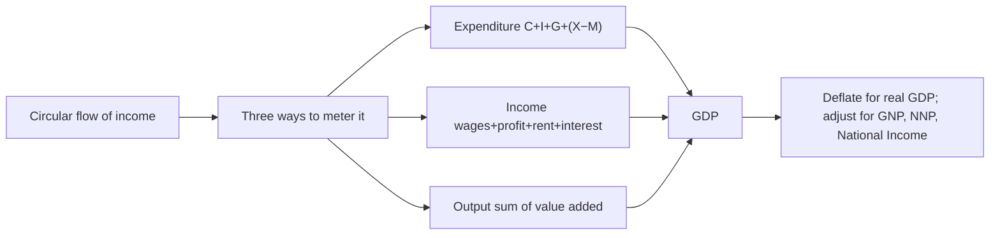

# Q&A — GDP and National Income

> Scope: Economics for Finance — Chapter 12 (GDP and National Income). Every question is followed by a full model answer. All amounts in Rupees (₹) unless stated. Work every numerical problem yourself before checking the solution. Sections: **A** concept-check · **B** applied/numerical · **C** interview-style · **D** MCQs with reasoning.

---

## The chapter in one picture

**One-line statement:** GDP is one circular flow you can meter three equal ways — spent, earned, or produced — valued at market prices, deflated to strip out inflation, and adjusted for ownership and depreciation to build the rest of the aggregate family.

---

## Section A — Concept Check

**A1. Define GDP and identify the four load-bearing words.**
GDP is the **market value** of all **final** goods and services **produced within a country's borders** in a given period. The keywords: *market value* (so we add haircuts and steel via prices), *final* (only end-user goods, excluding intermediate inputs to avoid double-counting), *produced* (output, not resale of second-hand goods or financial transactions), and *within borders* (geography, not ownership). It is also a **flow** — measured per quarter or year, not a stock.

**A2. Why must the expenditure, income, and output approaches give the same number?**
Because they all meter the *same* circular flow of income at different points. Every rupee spent on a final good becomes someone's factor income and corresponds to a rupee of value produced. Meter the money as it is spent → expenditure; as it is earned → income; the value of goods flowing the other way → output. One circulating stream, three meters, one identical total.

**A3. Distinguish final from intermediate goods with an example.**
A **final** good is bought by its end user (a loaf of bread on your table). An **intermediate** good is consumed in producing something else (the flour the baker bought). GDP counts only final goods; counting the flour *and* the bread would double-count the flour, which is already embedded in the bread's price.

**A4. State the expenditure identity and name the most volatile component.**
**GDP = C + I + G + (X − M).** Consumption (C) is the largest and most stable slice; government spending (G) is fairly steady; net exports (X − M) swing with trade. **Investment (I) is the most volatile** — firms cut capex first when confidence falls, which is why investment is the primary driver of the business cycle.

**A5. In the national accounts, what does "investment" mean — and what does it exclude?**
Investment (I), or gross capital formation, is **business spending on new physical capital**: factories, machinery, equipment, new housing, and the change in inventories. It explicitly **excludes financial investment** — buying shares or bonds is just a transfer of ownership of existing assets; nothing new is produced, so it is not in GDP.

**A6. Why are transfer payments excluded from government spending (G)?**
G counts only government purchases of *goods and services* — payments *for production*. **Transfer payments** (pensions, unemployment benefits, subsidies) give the government no good or service in return, so counting them would not correspond to any output. The recipient's later spending shows up in **C** instead; including transfers in G would double-count.

**A7. Why are imports subtracted in the expenditure approach?**
Because C, I, and G all *already include* spending on foreign-made goods, but GDP must measure only *domestic* production. Subtracting imports (M) strips out that foreign content. So the minus sign is a correction, not a claim that imports "destroy" output.

**A8. Explain the value-added method and how it avoids double-counting.**
Value added = a firm's output value minus the cost of intermediate goods it bought from other firms. Summing value added across all firms gives GDP directly, because the intermediate transactions cancel out. It equals the final sale value, so the output approach and the expenditure approach agree.

**A9. Distinguish nominal from real GDP.**
**Nominal GDP** values output at *current-year* prices — it mixes changes in quantity with changes in price. **Real GDP** values output at fixed *base-year* prices, so only *quantity* changes register. Real GDP is the honest growth measure; when news says "the economy grew 2.5%," it means real GDP.

**A10. Define the GDP deflator and give the identity linking nominal and real growth.**
**GDP Deflator = (Nominal GDP / Real GDP) × 100.** It is the broadest economy-wide price index. Rearranged: **Nominal growth ≈ Real growth + Inflation.** If nominal GDP rose 7% and the deflator shows 4% inflation, real growth was about 3%.

**A11. How does the GDP deflator differ from CPI?**
The **deflator** covers *all* domestically produced goods (including investment and government goods), uses *changing* current-period weights, and *excludes* imports. **CPI** tracks a *fixed basket* of consumer goods, holds weights fixed for years, and *includes* imports. So CPI can diverge meaningfully from the deflator — central banks target CPI but watch both.

**A12. What is NFIA and how does it convert GDP to GNP?**
**Net Factor Income from Abroad** = income earned by our residents abroad minus income earned by foreigners here. **GNP = GDP + NFIA.** GDP is geography (production inside borders); GNP/GNI is ownership (production by nationals wherever located).

**A13. Distinguish Gross from Net measures.**
The difference is **depreciation** (consumption of fixed capital) — the capital worn out producing this year's output. **NDP = GDP − Depreciation**; **NNP = GNP − Depreciation.** Net measures are conceptually superior (they show output after maintaining the capital stock), but depreciation is hard to measure, so GDP stays the headline figure.

**A14. How do you get from NNP at market prices to National Income?**
**National Income = NNP at market prices − Indirect taxes + Subsidies.** Market prices include taxes (GST/VAT) that are not income to any factor and are lowered by subsidies. Removing net indirect taxes converts market prices to **factor cost** — the income actually received by the factors of production.

**A15. State the leakages-injections equilibrium condition.**
Leakages (money leaving the flow) are **Saving + Taxes + Imports**; injections (money re-entering) are **Investment + Government + Exports**. Equilibrium requires **S + T + M = I + G + X.** When injections exceed leakages the economy expands; when leakages dominate it contracts.

**A16. Name four things GDP leaves out.**
Non-market production (household work, childcare, volunteering); the informal/black economy; externalities and resource depletion (pollution is not subtracted); and distribution (GDP is an average, silent on who gets the income). Hence GDP measures *output*, not *welfare*.

---

## Section B — Applied / Numerical Problems

**B1. Expenditure approach.**
An economy reports: Consumption ₹60,00,000; Investment ₹18,00,000; Government spending ₹22,00,000; Exports ₹12,00,000; Imports ₹15,00,000. Compute GDP.

*Solution.* GDP = C + I + G + (X − M) = 60,00,000 + 18,00,000 + 22,00,000 + (12,00,000 − 15,00,000) = 1,00,00,000 − 3,00,000 = **₹97,00,000.** Net exports are −₹3,00,000 (a trade deficit), which subtracts from GDP.

**B2. Value added and double-counting.**
Cotton grower sells ₹100 of cotton to a spinner; spinner sells yarn for ₹160 to a weaver; weaver sells cloth for ₹230 to a garment maker; garment maker sells shirts for ₹300. Compute the value added at each stage, total value added, and confirm it equals the final sale.

*Solution.*

| Stage | Sale value | Input cost | Value added |
|---|---|---|---|
| Cotton grower | 100 | 0 | 100 |
| Spinner (yarn) | 160 | 100 | 60 |
| Weaver (cloth) | 230 | 160 | 70 |
| Garment maker | 300 | 230 | 70 |
| **Total** | | | **300** |

Total value added = **₹300**, exactly the final sale price. The ₹490 of intermediate transactions (100 + 160 + 230) is correctly excluded — confirming that summing value added equals counting only the final good.

**B3. Nominal, real, and the deflator.**
Base-year prices are used for real GDP. In 2025, nominal GDP = ₹150 lakh crore and the GDP deflator = 125. (a) Compute real GDP. (b) If 2024 real GDP was ₹115 lakh crore, what was real growth?

*Solution.*
(a) Real GDP = (Nominal / Deflator) × 100 = (150 / 125) × 100 = **₹120 lakh crore.**
(b) Real growth = (120 − 115) / 115 = 5/115 = **≈ 4.35%.** The deflator of 125 tells us prices are 25% above the base year.

**B4. Separating price from quantity.**
A tiny economy makes only rice. Year 1 (base): 1,000 kg at ₹40/kg. Year 2: 1,100 kg at ₹50/kg. Compute nominal GDP, real GDP, and the deflator for both years, then real and nominal growth.

*Solution.*
- Year 1: Nominal = Real = 1,000 × 40 = **₹40,000**; deflator = 100.
- Year 2: Nominal = 1,100 × 50 = **₹55,000**; Real = 1,100 × 40 (base price) = **₹44,000**; deflator = (55,000/44,000) × 100 = **125**.
- Nominal growth = (55,000 − 40,000)/40,000 = **37.5%**. Real growth = (44,000 − 40,000)/40,000 = **10%**. Inflation ≈ 25%. Note real growth (10%) plus inflation (25%) roughly equals nominal growth (37.5%) — the identity, with a small cross-term.

**B5. Income approach to GDP.**
Given: Compensation of employees ₹52,00,000; Operating surplus / profits ₹28,00,000; Rent ₹6,00,000; Interest ₹4,00,000; Indirect taxes ₹9,00,000; Subsidies ₹2,00,000; Depreciation ₹7,00,000. Compute GDP at market prices.

*Solution.* Factor incomes = 52 + 28 + 6 + 4 = ₹90,00,000 (this is Net Domestic Product at factor cost). Add net indirect taxes (9 − 2 = 7,00,000) → NDP at market prices = ₹97,00,000. Add depreciation (7,00,000) to make it *Gross* → **GDP at market prices = ₹1,04,00,000.**

**B6. Building the aggregate family.**
GDP at market prices = ₹1,04,00,000. NFIA = −₹3,00,000 (net income flows abroad); Depreciation = ₹7,00,000; Net indirect taxes = ₹7,00,000. Compute GNP, NNP at market prices, and National Income.

*Solution.*
- GNP = GDP + NFIA = 1,04,00,000 + (−3,00,000) = **₹1,01,00,000.**
- NNP at market prices = GNP − Depreciation = 1,01,00,000 − 7,00,000 = **₹94,00,000.**
- National Income (NNP at factor cost) = 94,00,000 − 7,00,000 net indirect taxes = **₹87,00,000.**

Because NFIA is negative, this is a host of foreign capital (profits leaving) — GDP exceeds GNP, the Ireland pattern.

**B7. GDP vs. GNP for a remittance economy.**
A country's GDP is ₹80 lakh crore. Its residents earn ₹9 lakh crore abroad; foreigners earn ₹3 lakh crore inside it. Compute NFIA and GNP, and state which measure better reflects residents' income.

*Solution.* NFIA = 9 − 3 = **+₹6 lakh crore.** GNP = 80 + 6 = **₹86 lakh crore.** Since NFIA is positive (remittances arrive, the India/Philippines pattern), **GNP > GDP**, and GNP better reflects what nationals actually earn.

**B8. Leakages and injections.**
In an economy, Saving = ₹20,00,000, Taxes = ₹18,00,000, Imports = ₹15,00,000; Investment = ₹22,00,000, Government = ₹19,00,000, Exports = ₹14,00,000. Is the economy in equilibrium? Expanding or contracting?

*Solution.* Leakages = S + T + M = 20 + 18 + 15 = ₹53,00,000. Injections = I + G + X = 22 + 19 + 14 = ₹55,00,000. Injections exceed leakages by ₹2,00,000, so it is **not in equilibrium** and is **expanding** — the extra injection raises national income.

---

## Section C — Interview-Style Questions

**C1. "Explain GDP to me in one minute, and tell me why the three measurement approaches agree."**
GDP is the market value of all final goods and services produced inside a country in a period. The elegant part is that you can measure it three ways — add up all spending (C + I + G + net exports), all income (wages, profit, rent, interest), or all value added in production — and get the identical number. They agree because they meter one circular flow: every rupee spent on final output becomes someone's income and matches a rupee of value produced. So expenditure = income = output is an accounting identity, not a coincidence.

**C2. "Why is GDP the most market-moving economic release?"**
Because almost every macro decision keys off it. GDP defines the business cycle (a recession is loosely two consecutive quarters of falling real GDP), it is the denominator of nearly every risk ratio (debt-to-GDP, deficit-to-GDP), and central banks react to the gap between actual and potential GDP. What moves markets is the *surprise* versus consensus: a hot print pushes bond yields up (tighter policy, inflation risk) and often lifts the currency, while equities are ambiguous — better earnings but a higher discount rate. Algorithms parse it in milliseconds, so the move is near-instant.

**C3. "A country's nominal GDP grew 30% last year. Did it get richer?"**
Not necessarily — you have to strip out inflation. Nominal GDP mixes price and quantity; if the GDP deflator rose 28%, real growth was only about 2%. Turkey and Argentina have posted eye-watering nominal GDP growth that, once deflated by 50%+ inflation, revealed weak or negative *real* output. Real GDP — output at constant base-year prices — is the honest measure of whether the country actually produced more. Always deflate before you draw a conclusion about prosperity.

**C4. "When would you look at GNP instead of GDP, and why does it matter for valuation?"**
Whenever ownership and geography diverge — small open economies. Ireland's real GDP jumped 26% in 2015 ("Leprechaun economics") purely because multinationals shifted IP onto Irish balance sheets; its GNI, which nets out profits flowing to foreign owners, grew far less. Conversely, India and the Philippines have GNP above GDP because remittances flow in. For valuation and sovereign risk, this matters: GDP can flatter a country whose gains actually accrue to foreigners, overstating the income available to service debt or support living standards. So for those economies I size debt and household income against GNI, not GDP.

**C5. "Why are transfer payments and share purchases both excluded from GDP?"**
Both because nothing is newly produced. A transfer payment — a pension or benefit — gives the government no good or service in return; it just moves money, and the output appears later when the recipient spends it (in C). Buying a share is a transfer of ownership of an existing asset; the company gets no new machine, no new building. GDP measures *production*, so pure ownership transfers and redistributions of income are correctly left out. Only newly produced goods, services, and physical capital count.

**C6. "How does GDP connect austerity to a worsening debt ratio?"**
Through the denominator. Debt-to-GDP has debt on top and GDP on the bottom. In Greece, austerity cut government spending (G), and via the multiplier that dragged down consumption and investment too, shrinking *real GDP*. Because GDP is the denominator, a falling GDP can make the debt ratio *rise* even as the numerator (debt) is being cut. That is the self-defeating trap of pro-cyclical austerity — you have to understand GDP as both an output measure and a scaling factor to see it.

**C7. "What does GDP fail to capture, and why should an investor care?"**
GDP omits non-market work (household labour, childcare), the informal economy, externalities like pollution and resource depletion, and it says nothing about distribution — it is an average. A factory that fouls a river adds to GDP while the damage goes unrecorded; rising GDP per capita can hide a squeezed median household. For an investor the lesson is about the *quality and sustainability* of growth: headline GDP can look strong while the growth is environmentally borrowed, concentrated, or informal-sector-hollow. That shapes long-run risk and which alternative indicators (GNI, wellbeing, informal-sector estimates) you cross-check.

**C8. "Deflator versus CPI — which should a rates trader watch?"**
Both, because they answer different questions. CPI tracks a fixed basket of consumer goods including imports and is what central banks target — it drives policy rates directly. The GDP deflator covers all domestic output with changing weights and excludes imports, giving the broadest economy-wide price signal. The *gap* between them is itself informative: if import prices spike, CPI can run hot while the deflator stays calmer, hinting the inflation is externally driven rather than home-grown. A rates trader watches the deflator to judge underlying domestic price pressure and CPI to anticipate the central bank's actual move.

---

## Section D — MCQs with Reasoning

**D1.** Which is included in this year's GDP?
(a) Sale of a used car (b) Purchase of 100 shares of Infosys (c) A newly built house (d) A pension payment

**Answer: (c).** A newly built house is new physical capital (residential investment) produced this year. A used car was counted when first made; shares are an ownership transfer; a pension is a transfer payment. None of (a), (b), (d) is current production.

**D2.** GDP = C + I + G + (X − M). Imports are subtracted because:
(a) imports reduce national welfare (b) they were already included in C, I, and G (c) exports must be balanced (d) foreign goods are lower quality

**Answer: (b).** C, I, and G include spending on foreign-made goods; subtracting M isolates *domestic* production. It is a correction, not a welfare judgment.

**D3.** The most volatile component of GDP, driving the business cycle, is:
(a) Consumption (b) Government spending (c) Investment (d) Net exports

**Answer: (c).** Investment (capex, housing, inventories) swings sharply with business confidence; firms cut it first in downturns, so it leads the cycle.

**D4.** If nominal GDP is ₹150 and real GDP is ₹120, the GDP deflator is:
(a) 80 (b) 100 (c) 125 (d) 270

**Answer: (c).** Deflator = (Nominal/Real) × 100 = (150/120) × 100 = 125, meaning prices are 25% above the base year.

**D5.** GNP differs from GDP by:
(a) depreciation (b) net indirect taxes (c) net factor income from abroad (d) net exports

**Answer: (c).** GNP = GDP + NFIA. Depreciation separates gross from net; net indirect taxes separate market price from factor cost.

**D6.** Which is NOT counted in government spending (G)?
(a) Teacher salaries (b) Defence equipment (c) Unemployment benefits (d) Road construction

**Answer: (c).** Unemployment benefits are transfer payments — no good or service is produced in return. The other three are purchases of goods/services.

**D7.** Real GDP differs from nominal GDP in that real GDP:
(a) uses current-year prices (b) holds prices at a base year (c) includes imports (d) excludes government output

**Answer: (b).** Real GDP holds prices constant at a base year so only quantity changes register; nominal uses current prices and mixes price with quantity.

**D8.** National Income equals:
(a) GDP at market prices (b) NNP at factor cost (c) GNP minus net exports (d) GDP plus depreciation

**Answer: (b).** National Income is NNP at factor cost = NNP at market prices − net indirect taxes. It is the income actually received by factors of production.

**D9.** In equilibrium in the circular flow:
(a) S + T + M = I + G + X (b) C = I (c) exports equal imports (d) saving equals zero

**Answer: (a).** Total leakages (saving, taxes, imports) must equal total injections (investment, government, exports) for national income to be stable.

**D10.** Summing value added across all firms avoids:
(a) inflation (b) double-counting intermediate goods (c) counting government output (d) measuring services

**Answer: (b).** Value added = output − intermediate inputs, so intermediate transactions cancel; the total equals the value of final goods, avoiding double-counting.

**D11.** A country whose citizens send home large remittances typically has:
(a) GDP greater than GNP (b) GNP greater than GDP (c) GDP equal to GNP (d) negative GDP

**Answer: (b).** Positive NFIA (income earned abroad exceeds foreigners' income here) makes GNP > GDP — the India/Philippines pattern. Ireland, where foreign profits leave, is the opposite.

**D12.** Which does GDP fail to capture?
(a) Government-provided services (b) Unpaid household work (c) Business investment (d) Exports

**Answer: (b).** Non-market production like unpaid household work has no market transaction, so GDP omits it — the classic "marry your housekeeper and GDP falls" paradox.

---

*End of Q&A — GDP and National Income.*
