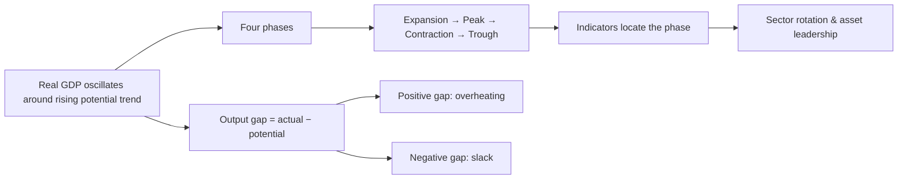

# Q&A — Business Cycles

> Scope: Economics for Finance — Chapter 15 (Business Cycles). Every question is followed by a full model answer. Work every numerical problem yourself before checking the solution. Sections: **A** concept-check · **B** applied/numerical · **C** interview-style · **D** MCQs with reasoning.

---

## The chapter in one picture

**One-line statement:** The economy grows but not smoothly — it oscillates around potential output in a recurring, irregular, asymmetric cycle whose phase (read via the output gap and leading indicators) drives earnings, defaults, policy rates, and therefore which assets to own.

---

## Section A — Concept Check

**A1. Define the business cycle and identify the three load-bearing words.**
A business cycle is the **recurring but irregular fluctuation of aggregate economic activity around its long-run trend**, moving through expansion, peak, contraction, and trough. The three load-bearing words: *recurring* (a permanent feature of market economies, not a one-off), *irregular* (not periodic like a sine wave — expansions have run from one year to over ten), and *around a trend* (the cycle is a deviation from the rising trend, not the trend itself; the trend keeps climbing underneath even in a recession).

**A2. What is the output gap, and why is it the cleanest way to locate the cycle?**
The output gap is the difference between **actual GDP and potential GDP** (the sustainable level at full employment of resources). A **positive** gap (actual above potential) means the economy is running hot — full capacity, low unemployment, building wage and price pressure. A **negative** gap (actual below potential) means slack — idle capacity, above-natural unemployment, weak inflation. It is the cleanest "where are we" measure because it directly frames the policy response: central banks try to close the gap without letting it flip into overheating.

**A3. Name the four phases and what happens to output, unemployment, inflation, and rates in each.**
- **Expansion:** output, employment, incomes and profits rise; unemployment falls; late in the phase capacity tightens and rates begin rising.
- **Peak:** the upper turning point — output gap most positive, unemployment at its cyclical low, inflation at its cyclical high, rates restrictive.
- **Contraction (recession):** output falls, unemployment rises, profits shrink, credit tightens and defaults climb.
- **Trough:** the lower turning point — output gap most negative, unemployment at its cyclical high, inflation low (sometimes deflation), rates slashed to stimulate recovery.
One full cycle is conventionally measured trough-to-trough (or peak-to-peak).

**A4. What does it mean that the cycle is "asymmetric," and why does it matter for markets?**
Asymmetry means expansions are long and gradual while contractions are short and sharp — "economies climb the stairs and fall down the elevator shaft." It matters because "risk-off" market moves are far more violent than "risk-on" grinds higher: drawdowns compress into weeks while recoveries take years. Position sizing and hedging must respect that the downside arrives faster than the upside.

**A5. Why is a recession not simply "two consecutive quarters of falling GDP"?**
That is a rough shorthand. The NBER — the official US arbiter — defines a recession as "a significant decline in economic activity spread across the economy, lasting more than a few months," visible across real GDP, real income, employment, industrial production, and wholesale-retail sales. It weighs **depth, diffusion, and duration** across many series. In 2022 US GDP fell for two quarters yet no recession was declared, because employment and income kept rising.

**A6. Distinguish a slowdown from a recession.**
A slowdown is decelerating growth — say from 4% to 1% — which is still *growth*, still expansion. A recession requires an actual, broad *decline* in activity. The distinction matters because markets can sell off hard on a mere growth *scare* that never becomes a recession ("the stock market has predicted nine of the last five recessions").

**A7. State the Keynesian explanation of the cycle in one tight paragraph.**
Keynes located the cycle in **volatile aggregate demand**, especially investment. Firms invest on expectations of profit — "animal spirits." High confidence lifts investment, and through the **multiplier** (one person's spending is another's income) the boom feeds itself; when confidence cracks the multiplier runs in reverse. Because wages and prices are **sticky**, output rather than prices adjusts, so recessions create real unemployment. The **accelerator** sharpens this — investment responds to the *change* in output, so even a growth slowdown can trigger a fall in investment. Implication: active counter-cyclical policy.

**A8. What is Minsky's Financial Instability Hypothesis, and what is a "Minsky moment"?**
Minsky's thesis is that **stability itself breeds instability**. In good times borrowers and lenders grow complacent; debt migrates from safe "hedge" finance to speculative and finally "Ponzi" finance (borrowing just to pay interest). Fragility builds endogenously until a small shock triggers the **Minsky moment** — a scramble to sell assets to cover debt, collapsing asset prices and credit at once. 2008 is the canonical example.

**A9. Distinguish the demand, credit, and supply channels of a downturn — and why the distinction is load-bearing.**
A **demand** recession (confidence/multiplier collapse) brings *disinflation* and responds well to stimulus. A **credit** recession (deleveraging after a leverage build-up) is *deep and slow* because balance-sheet repair takes years. A **supply-shock** recession (oil, war, pandemic disruption) can bring *stagflation* — falling output *with* rising prices — which monetary policy cannot easily fix. Diagnosing which one is unfolding is essential because the asset-market playbook and the inflation outcome differ for each.

**A10. Explain the financial accelerator.**
Balance sheets move with asset prices. In a boom, rising collateral values let firms and households borrow more, funding more spending and pushing asset prices higher still — a self-reinforcing loop. In a bust, falling collateral forces deleveraging, depressing spending and asset prices further. This is why finance does not merely *reflect* the cycle; it *drives and amplifies* it.

**A11. Classify indicators as leading, coincident, or lagging, with two examples each.**
- **Leading** (turn before the economy): yield-curve slope, stock prices, building permits, new orders/PMI, consumer confidence, initial jobless claims, credit spreads.
- **Coincident** (turn with the economy, and define the current state): real GDP, industrial production, non-farm payrolls, personal income, retail sales.
- **Lagging** (turn after): unemployment rate, core inflation, unit labour costs, prime lending rate, inventory-to-sales ratio.
The classic trap: the **unemployment rate is lagging** (it keeps rising after recovery begins), whereas **initial jobless claims are leading**.

**A12. Why is an inverted yield curve considered the single most reliable recession signal?**
When short rates exceed long rates, the market is pricing **future rate cuts** — its collective bet that the central bank will have to ease because a downturn is coming. The 10y-minus-3m and 10y-minus-2y spreads going negative has preceded every US recession since the 1960s, with a lead of roughly 6-18 months. It is powerful precisely because it embeds forward-looking market expectations rather than backward-looking data.

**A13. Why do corporate profits swing far more violently than GDP?**
**Operating leverage.** Many costs are fixed or sticky in the short run, so revenue changes fall disproportionately to the bottom line. A 2% fall in output can wipe out 20-30% of aggregate profits. Because equities price earnings, and the stock market is itself a *leading* indicator, equity markets amplify the cycle in both directions.

**A14. What is sector rotation, and what mechanism drives it?**
Sector rotation is shifting portfolio weights across sectors as the cycle progresses, because operating leverage, rate sensitivity, and demand elasticity differ by sector. Early cycle favours **rate-sensitive cyclicals** (financials, discretionary — they benefit from cheap money and rising demand); late cycle favours **real assets** (energy, materials — tight capacity and inflation); recession favours **defensives and duration** (staples, utilities, healthcare have inelastic demand; government bonds rally as rates fall). This is the logic behind Merrill Lynch's "Investment Clock."

**A15. Why is it wrong to say "this expansion is old, so a recession is due"?**
Because the cycle is **not periodic**. Expansions do not die of old age — they die from **shocks or policy errors**. The 2009-2020 US expansion ran almost eleven years. Length alone carries no predictive signal for a turn; you need actual deterioration in leading indicators, not merely the passage of time.

---

## Section B — Applied / Numerical Problems

**B1. Output gap and its policy implication.**
Actual real GDP is ₹142 lakh crore; potential output is ₹150 lakh crore. (a) Compute the output gap in level and as a percentage of potential. (b) Is the economy overheating or slack, and what should the central bank do?

*Solution.*
(a) Gap = 142 − 150 = **−₹8 lakh crore**, or (−8 / 150) × 100 = **−5.33% of potential**.
(b) A *negative* gap means the economy is running **below potential — slack**, with idle capacity and above-natural unemployment. The central bank should **ease** (cut rates / support demand) to close the gap and lift output back toward potential.

**B2. Identifying the phase from a data snapshot.**
An economy reports: unemployment at a multi-decade low of 3.5%, inflation at its highest in years, the central bank at the top of a hiking cycle, and the output gap strongly positive. Which phase is this, and what is the tactical warning?

*Solution.* This is the **peak / late expansion** — unemployment at its cyclical low, inflation at its cyclical high, rates restrictive, output gap most positive. The tactical warning: **peaks feel wonderful right up to the moment they turn**, so late-cycle euphoria is exactly when investors overpay for cyclical risk. The rotation call is toward late-cycle real assets (energy, materials) and, defensively, to reduce high-beta cyclical exposure.

**B3. The two-quarter rule vs. the NBER definition.**
Country X posts real GDP growth of −0.4% and −0.2% in two consecutive quarters. Over the same period, employment rises every month, real personal income grows, and retail sales are flat-to-up. Does the two-quarter rule call a recession? Would the NBER likely agree? Explain the divergence.

*Solution.* The **two-quarter rule says yes** — two consecutive quarters of falling real GDP. But the **NBER would likely say no**, because it requires a decline that is *significant, broad (diffuse), and sustained* across GDP, income, employment, production, and sales. Here employment and real income are *rising* — the decline is neither broad nor confirmed by the coincident labour and income series. This is precisely the 2022 US case: the mechanical rule triggered, the official arbiter did not.

**B4. Nominal fall vs. real recession.**
Nominal GDP grows +3% while the GDP deflator (inflation) runs +6% over the year. Is the economy in a real contraction? Compute approximate real growth.

*Solution.* Real growth ≈ nominal growth − inflation = 3% − 6% = **≈ −3%**. So yes — despite *nominal* output *rising* 3%, **real output is contracting** by roughly 3%. This is the classic trap of judging the cycle by nominal figures: high inflation can mask a genuine real recession. Always deflate before dating the cycle.

**B5. The multiplier in a downturn.**
Autonomous investment falls by ₹500 crore. The marginal propensity to consume (MPC) is 0.8. (a) Compute the simple spending multiplier. (b) Compute the total fall in equilibrium income. (c) Explain how this illustrates why investment "drives" the cycle.

*Solution.*
(a) Multiplier = 1 / (1 − MPC) = 1 / (1 − 0.8) = 1 / 0.2 = **5**.
(b) ΔIncome = multiplier × ΔInvestment = 5 × (−500) = **−₹2,500 crore**.
(c) A ₹500 crore investment shock produces a ₹2,500 crore income contraction — five times larger — because each round of lost spending becomes lost income that is partly re-spent, cascading downward. Investment is small in level but volatile and *multiplied*, which is why swings in it dominate the cycle.

**B6. The accelerator effect.**
A firm needs ₹4 of capital for every ₹1 of annual output (capital-output ratio = 4). Output was growing ₹100 → ₹120 (a ₹20 rise), but next year growth *slows* so output rises only ₹120 → ₹130 (a ₹10 rise). Assuming net investment tracks the *change* in output, compute net investment in each year and explain the accelerator lesson.

*Solution.* Net investment = capital-output ratio × change in output.
- Year 1: 4 × 20 = **₹80 of net investment**.
- Year 2: 4 × 10 = **₹40 of net investment**.
Output is still *growing* in year 2, yet net investment **halves** (80 → 40) simply because growth *decelerated*. The accelerator lesson: investment depends on the *rate of change* of output, so even a slowdown — not an outright fall — can trigger a sharp drop in investment, which then feeds back through the multiplier. Together the **multiplier-accelerator interaction** can generate self-sustaining oscillations from a single shock.

**B7. Sahm Rule trigger.**
The 3-month moving average of the unemployment rate is 4.3%. Its lowest 3-month average over the trailing 12 months was 3.7%. Does the Sahm Rule signal recession?

*Solution.* The Sahm Rule triggers when the 3-month average unemployment rate rises **0.5 percentage points** above its trailing 12-month low. Here the rise = 4.3% − 3.7% = **0.6pp ≥ 0.5pp**, so **yes — the Sahm Rule signals recession**. It is valued as a simple, robust *real-time* trigger, though note unemployment is a lagging series, so it confirms rather than anticipates.

**B8. Diagnosing the shock from bond-equity correlation.**
In year A, when the economy weakens, government bonds rally hard while equities fall — they move *inversely*. In year B, bonds and equities fall *together*. Classify the likely driver of each downturn.

*Solution.*
- **Year A (bonds up, equities down):** a **demand-driven** downturn. Growth fears → expected rate cuts → bond prices rise (yields fall) while weaker earnings sink equities. Government bonds act as the classic recession hedge; the 60/40 portfolio works.
- **Year B (bonds and equities fall together):** a **supply-shock / inflation-and-hiking** episode (like 2022). The driver is *rising discount rates*, not falling growth, so higher yields crush bond prices *and* compress equity valuations simultaneously. The usual hedge breaks. The correlation itself diagnoses the shock.

---

## Section C — Interview-Style Questions

**C1. "Walk me through the business cycle in one minute."**
The economy grows over time but not in a straight line — it oscillates around its long-run potential in a business cycle with four phases: expansion, peak, contraction, and trough. The cleanest way to locate it is the output gap, the difference between actual and potential GDP: positive means overheating, negative means slack. The cycle is recurring but irregular — you cannot set your watch by it — and asymmetric, with slow booms and fast busts. What makes it *the* thing a finance professional reads is that earnings, defaults, and policy rates all move with it, so the phase you're in dictates which assets to own. To locate it in real time I lean on leading indicators — above all the yield curve.

**C2. "What's the best single recession signal, and how would you use it?"**
An inverted yield curve — short rates above long rates. It has preceded every US recession since the 1960s with a lead of roughly 6-18 months, and it works because it embeds the market's own expectation of future rate cuts. But I wouldn't bet the book on one number: every indicator, even the curve, can give false signals. So I corroborate it with rising initial jobless claims, the Sahm Rule on unemployment, widening credit spreads, and PMIs falling below 50. Weight of evidence, not a single trigger — that's the discipline.

**C3. "Two economies are both in recession. Why might your investment playbook differ completely between them?"**
Because the *cause* of the downturn dictates everything. If it's a demand recession — a confidence and spending collapse — you get disinflation, the central bank cuts, and government bonds are the classic hedge that rallies as equities fall; stimulus works and recovery can be quick. If it's a credit recession like 2008, it's deep and slow because deleveraging takes years, defaults stay elevated, and you stay defensive far longer. If it's a supply-shock recession like the 1970s or the 2022 risk, you can get stagflation — output falling while prices rise — which means bonds and equities can fall *together* and the usual hedge breaks. So my first job isn't to forecast the recession; it's to diagnose what *kind* it is.

**C4. "Why do equity markets swing so much more than the economy itself?"**
Two amplifiers stacked on each other. First, operating leverage: because costs are sticky, a small fall in output can wipe out a large share of profits — a 2% GDP drop can erase 20-30% of aggregate earnings. Second, equities *price* those earnings and, crucially, the market is a *leading* indicator — it moves on the anticipated path, not the current print. So you get a volatile thing (earnings) being repriced by a forward-looking, sentiment-driven mechanism. That's also why the market can rally while the economy is still contracting — it's pricing the recovery — and why Samuelson quipped it "predicted nine of the last five recessions."

**C5. "Explain sector rotation across the cycle as if advising an allocator."**
Leadership rotates because sectors differ in rate sensitivity, operating leverage, and demand elasticity. In early expansion, favour rate-sensitive cyclicals — financials, consumer discretionary, industrials — plus small-cap value and high-yield credit; cheap money and reviving demand lift them most. Through mid-cycle, growth and technology broaden the lead. Late cycle, as capacity tightens and inflation builds, real assets take over — energy, materials, commodities. In recession, rotate to defensives with inelastic demand — staples, utilities, healthcare — and add duration through government bonds and gold as rates fall. The one-sentence version: cyclicals and small-cap value early, commodities and energy late, defensives and duration in recession. The catch is that the winning trade in one phase is often the losing trade in the next, so getting the phase right is the whole game.

**C6. "It's late 2007. What are you watching, and what's your call?"**
I'd be watching a decade-long housing and credit boom with exploding mortgage leverage and securitisation hiding risk — a textbook Minsky build-up where stability has bred fragility. The signals: US house prices already rolling over from 2006, subprime defaults rising, credit spreads starting to widen, and the yield curve having inverted earlier. My call is that this is a *credit* cycle turning, not a garden-variety slowdown — which means it will be deep and slow because leveraged balance sheets have to deleverage. Playbook: cut cyclical and financial exposure hard, move up in quality and into duration, expect government bonds to rally and spreads to blow out, and don't try to catch the bottom early because credit recessions take years to clear. The Minsky moment arrives when Lehman fails in September 2008.

**C7. "Why can't central banks just abolish the business cycle?"**
Partly because not every cycle is theirs to fix. Monetary policy is powerful against *demand* swings — it can lean against overheating and cushion demand collapses — but it's nearly helpless against *supply* shocks: cheaper money doesn't unblock a port or replace lost oil, and easing into a supply shock just adds inflation. There's also the Austrian critique that trying to prevent every recession with easy money builds bigger imbalances — malinvestment — that make the eventual bust worse. And there are long, variable lags plus the risk of policy *error*, which the monetarists blame for turning slowdowns into slumps. So the realistic goal is to dampen the cycle and engineer soft landings where possible, not to abolish it.

**C8. "You have one paragraph. Convince me the *nature of the shock and the speed of the policy response* matter more than the depth of the fall."**
Compare 2008 and 2020. In 2020 the *fall* was far deeper — US GDP dropped about 9% in a single quarter, the sharpest on record — yet the NBER recession lasted only two months and markets recovered to new highs within months. Why? The shock was exogenous (a pandemic, not a burst credit bubble), so there was no balance-sheet damage to repair, and the policy response was enormous and instant — near-zero rates plus trillions in fiscal support — giving a V-shaped recovery. In 2008 the fall was shallower quarter-to-quarter but the recovery took *years*, because it was a credit bust where deleveraging is inherently slow. Same lesson twice: a shallow credit recession outlasts a deep exogenous one. The shape of the recovery is written by the *type* of shock and how fast and large the response is — not by the depth of the initial drop.

---

## Section D — MCQs with Reasoning

**D1.** One complete business cycle is conventionally measured:
(a) peak to trough (b) trough to peak (c) trough to trough (d) expansion to contraction

**Answer: (c).** A full cycle runs trough-to-trough (equivalently peak-to-peak), capturing all four phases once. Peak-to-trough is only the contraction; trough-to-peak is only the expansion.

**D2.** A *positive* output gap indicates:
(a) idle capacity and slack (b) the economy running above potential — overheating (c) a recession (d) falling inflation

**Answer: (b).** Actual GDP above potential means full-tilt capacity, low unemployment, and building wage/price pressure — overheating. A negative gap is slack; recession and disinflation associate with the negative side.

**D3.** The cycle is described as "asymmetric" because:
(a) expansions and contractions are equal length (b) contractions are long and expansions short (c) expansions are long and gradual while contractions are short and sharp (d) it repeats on a fixed frequency

**Answer: (c).** "Climb the stairs, fall down the elevator shaft" — booms build slowly, busts arrive fast. It is not fixed-frequency (that would be periodicity, which the cycle lacks).

**D4.** Which theory holds that "stability itself breeds instability" through a build-up of debt?
(a) Real Business Cycle (b) Monetarist (c) Minsky's Financial Instability Hypothesis (d) Austrian

**Answer: (c).** Minsky argued good times breed complacency, pushing debt from hedge to speculative to Ponzi finance until a "Minsky moment." RBC blames supply shocks; monetarists blame money-supply swings; Austrians blame cheap-credit malinvestment.

**D5.** The single most reliable market-based recession signal is:
(a) rising core inflation (b) an inverted yield curve (c) a falling unemployment rate (d) rising retail sales

**Answer: (b).** An inverted yield curve has led every US recession since the 1960s by 6-18 months, embedding expected rate cuts. Core inflation and unemployment are *lagging*; retail sales are coincident.

**D6.** Which of these is a *leading* indicator?
(a) Unemployment rate (b) Real GDP (c) Initial jobless claims (d) Core inflation

**Answer: (c).** Initial jobless claims are the earliest labour-market crack — leading. The unemployment *rate* and core inflation are lagging; real GDP is coincident.

**D7.** The most volatile expenditure component, whose swings drive the cycle, is:
(a) consumption (b) investment (c) government spending (d) net exports

**Answer: (b).** Investment (capex, housing, inventories) collapses first when confidence falls and is amplified by the multiplier and accelerator, making it the cycle's primary driver.

**D8.** In a *supply-shock* recession (e.g., an oil crisis), you are most likely to see:
(a) disinflation (b) stagflation — output falling while prices rise (c) bonds rallying as equities fall (d) a quick V-shaped recovery

**Answer: (b).** A negative supply shock raises costs while cutting output — stagflation. This breaks the usual demand-recession pattern where bonds hedge equities and inflation falls.

**D9.** The Sahm Rule signals recession when the 3-month average unemployment rate rises above its trailing 12-month low by at least:
(a) 0.2pp (b) 0.5pp (c) 1.0pp (d) 2.0pp

**Answer: (b).** The Sahm Rule triggers at a 0.5 percentage-point rise — a simple, robust real-time recession indicator.

**D10.** If the MPC is 0.75, the simple spending multiplier is:
(a) 1.33 (b) 2.5 (c) 4 (d) 7.5

**Answer: (c).** Multiplier = 1 / (1 − MPC) = 1 / 0.25 = 4. A ₹1 autonomous change moves equilibrium income by ₹4.

**D11.** The financial accelerator refers to:
(a) faster GDP growth from technology (b) the feedback loop between asset prices, collateral, and credit (c) central banks accelerating rate cuts (d) investment responding to the change in output

**Answer: (b).** Rising collateral values enable more borrowing and spending, lifting asset prices further (and the reverse in a bust) — finance amplifying the cycle. Option (d) is the *accelerator* (investment ~ change in output), a different mechanism.

**D12.** In a typical *recession*, the best-performing assets are usually:
(a) small-cap value and high-yield credit (b) energy and materials (c) government bonds, defensives, and gold (d) financials and consumer discretionary

**Answer: (c).** Recession favours duration and inelastic-demand defensives — government bonds rally as rates fall, and staples/utilities/healthcare hold up. Small-cap value/financials lead *early* expansion; energy/materials lead *late* cycle.

**D13.** The 2020 COVID recession recovered in a V-shape mainly because:
(a) it was a credit bust requiring deleveraging (b) the shock was exogenous with no balance-sheet damage and the policy response was huge and instant (c) it was the deepest recession on record (d) inflation was already high

**Answer: (b).** An external shock (no burst credit bubble to repair) plus an enormous, immediate policy response produced a fast recovery — showing the *type* of shock and *speed* of response matter more than the depth of the fall.

**D14.** "This expansion is over a decade old, so a recession must be due." This reasoning is flawed because:
(a) expansions always last exactly ten years (b) the cycle is periodic (c) expansions die from shocks or policy errors, not old age (d) recessions never follow long expansions

**Answer: (c).** Cycles are irregular, not periodic; age alone carries no signal. Turns come from shocks or policy mistakes — you need deteriorating leading indicators, not a calendar.

---

*End of Q&A — Business Cycles.*
