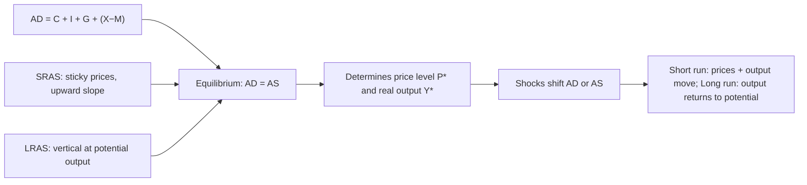

# Q&A — Aggregate Demand and Aggregate Supply

> Scope: Economics for Finance — Chapter 16 (Aggregate Demand and Aggregate Supply). Every question is followed by a full model answer. All amounts in Rupees (₹) unless stated. Work every numerical problem yourself before checking the solution. Sections: **A** concept-check · **B** applied/numerical · **C** interview-style · **D** MCQs with reasoning.

---

## The chapter in one picture

**One-line statement:** AD-AS is the whole economy drawn as one supply-and-demand diagram — where planned spending (AD) meets what firms will produce (AS) fixes the price level and real output, and every boom, slump, and inflation episode is just a shift of one curve chasing the other back toward potential output.

---

## Section A — Concept Check

**A1. What is the Aggregate Demand (AD) curve, and what does it plot?**
The AD curve shows the **total quantity of final goods and services** (real output, Y) that households, firms, government, and foreigners plan to buy at each **price level** (P). It plots real output on the horizontal axis against the general price level on the vertical axis, and it slopes **downward** — a higher price level is associated with lower total planned real expenditure.

**A2. Why does the AD curve slope downward? Give the three reasons.**
Not for the microeconomic reason (substitution to other goods) — at the macro level everything's price is rising. The three genuine reasons are:
(i) **Real balance (wealth) effect** — a higher price level shrinks the real value of money and fixed-value assets, so people feel poorer and cut spending.
(ii) **Interest rate effect** — higher prices raise money demand, pushing up interest rates, which chokes off investment and interest-sensitive consumption.
(iii) **Net export (foreign trade) effect** — a higher domestic price level makes home goods dearer than foreign goods, so exports fall and imports rise, lowering net exports.

**A3. Name the four components of AD and which is most volatile.**
**AD = C + I + G + (X − M)**: Consumption, Investment, Government spending, and Net exports. **Investment (I) is the most volatile** — it swings sharply with business confidence and interest rates, which is why shifts in investment are a leading driver of the business cycle.

**A4. Distinguish a movement along the AD curve from a shift of the AD curve.**
A **movement along** AD is caused only by a change in the **price level** — it changes the quantity of output demanded via the three effects above. A **shift** of the whole AD curve is caused by a change in any **non-price determinant** of spending: fiscal policy, monetary policy, consumer or business confidence, wealth, or foreign income. Rightward shift = more demand at every price level.

**A5. What is the Aggregate Supply (AS) curve?**
AS shows the **total quantity of output firms are willing to produce and sell** at each price level. It has two forms: a **short-run** curve (SRAS), which slopes upward, and a **long-run** curve (LRAS), which is vertical at the economy's potential (full-employment) output.

**A6. Why does the short-run AS curve slope upward?**
Because in the short run, **input prices — especially nominal wages — are sticky** while output prices can rise. When the price level rises but wages are contractually fixed, each unit sold is more profitable, so firms expand output and hire more. The classic explanations are **sticky wages**, **sticky prices** (menu costs), and **misperceptions** (workers/firms mistake a general price rise for a rise in their own real reward).

**A7. Why is the long-run AS curve vertical?**
In the long run, all input prices — wages, rents — fully adjust to the price level. Output is then determined purely by **real factors**: the labour force, the capital stock, and technology. A higher price level with proportionally higher wages leaves real incentives unchanged, so firms produce the same **potential output** regardless of P. Hence LRAS is vertical at full-employment output.

**A8. Define potential output (full-employment output).**
Potential output is the level of real GDP an economy produces when all resources are employed at their **normal, sustainable rates** — i.e., when unemployment is at its natural rate and there is no cyclical slack or overheating. It is set by supply-side factors and is the level to which output returns in the long run.

**A9. How is macroeconomic equilibrium determined?**
At the intersection of AD and AS. It fixes both the **equilibrium price level (P\*)** and the **equilibrium real output (Y\*)** simultaneously. Short-run equilibrium is AD = SRAS; long-run equilibrium is where AD, SRAS, and LRAS all cross — output equals potential.

**A10. What is a recessionary (deflationary) gap?**
A recessionary gap exists when short-run equilibrium output is **below potential output** — AD is too weak, unemployment exceeds its natural rate, and there is downward pressure on prices. Over time, high unemployment pulls wages and input prices down, shifting SRAS right until output returns to potential (the self-correcting mechanism).

**A11. What is an inflationary gap?**
An inflationary gap exists when short-run equilibrium output is **above potential output** — AD is so strong that the economy is overheating, unemployment is below its natural rate, and prices are being bid up. Rising wages and input costs shift SRAS left until output falls back to potential, at a higher price level.

**A12. Distinguish demand-pull from cost-push inflation.**
**Demand-pull inflation** comes from a **rightward shift of AD** ("too much money chasing too few goods") — output and prices both rise in the short run. **Cost-push inflation** comes from a **leftward shift of SRAS** (a rise in input costs, e.g. an oil shock) — the price level rises while output *falls*, producing the painful combination of inflation with recession.

**A13. What is stagflation, and which curve shift causes it?**
Stagflation is simultaneous **stagnation (rising unemployment / falling output) and inflation (rising prices)**. It is caused by an **adverse supply shock — a leftward shift of SRAS** (e.g. the 1973 oil crisis). Because output and prices move in opposite directions, standard demand-side policy cannot fix both at once, which is what makes stagflation so hard to treat.

**A14. What are the non-price determinants that shift AD?**
Changes in: consumer confidence and wealth; interest rates and money supply (monetary policy); government spending and taxes (fiscal policy); business expectations about future profits (investment); and foreign income and exchange rates (net exports). Any of these shifts the entire AD curve without a change in the price level.

**A15. What are the determinants that shift AS?**
**SRAS** shifts with input costs — nominal wages, raw material and energy prices, and supply shocks. **LRAS** (potential output) shifts only with the real productive capacity of the economy: the size and skill of the labour force, the capital stock, technology, and productivity. Growth policy targets LRAS.

**A16. State the self-correcting (classical adjustment) mechanism.**
If output is below potential (recessionary gap), unemployment drives wages and input prices **down**, shifting SRAS **right** until output returns to potential. If output is above potential (inflationary gap), tight labour markets drive wages **up**, shifting SRAS **left** until output falls back. In the long run the economy returns to potential output on its own — the debate is only over how *fast*.

---

## Section B — Applied / Numerical Problems

**B1. Computing aggregate demand.**
For an economy: Consumption ₹48,00,000; Investment ₹14,00,000; Government spending ₹20,00,000; Exports ₹9,00,000; Imports ₹11,00,000. Compute AD.

*Solution.* AD = C + I + G + (X − M) = 48,00,000 + 14,00,000 + 20,00,000 + (9,00,000 − 11,00,000) = 82,00,000 − 2,00,000 = **₹80,00,000.** Net exports are −₹2,00,000 (a trade deficit), which reduces AD below total domestic spending.

**B2. The consumption function and induced demand.**
The consumption function is C = 5,00,000 + 0.8Y, where Y is national income. Investment I = 6,00,000, Government G = 4,00,000, and net exports are zero. Find equilibrium income where Y = AD.

*Solution.* Equilibrium: Y = C + I + G = (5,00,000 + 0.8Y) + 6,00,000 + 4,00,000 = 15,00,000 + 0.8Y.
So Y − 0.8Y = 15,00,000 → 0.2Y = 15,00,000 → **Y = ₹75,00,000.** The autonomous spending of ₹15,00,000 is magnified by the multiplier 1/(1−0.8) = 5.

**B3. The multiplier and a demand shock.**
Using the marginal propensity to consume (MPC) = 0.8 from B2, government spending rises by ₹3,00,000. By how much does equilibrium income rise, and what does this do to AD?

*Solution.* Multiplier k = 1/(1 − MPC) = 1/(1 − 0.8) = **5.** ΔY = k × ΔG = 5 × 3,00,000 = **₹15,00,000.** Equilibrium income rises from ₹75,00,000 to ₹90,00,000. The AD curve shifts **right** by the full multiplied amount, ₹15,00,000, not just the ₹3,00,000 initial injection.

**B4. Multiplier with a higher savings rate.**
Two economies have MPC = 0.75 and MPC = 0.6. A ₹4,00,000 rise in investment hits both. Compare the impact on income.

*Solution.*
- Economy 1: k = 1/(1 − 0.75) = 4. ΔY = 4 × 4,00,000 = **₹16,00,000.**
- Economy 2: k = 1/(1 − 0.6) = 2.5. ΔY = 2.5 × 4,00,000 = **₹10,00,000.**
The economy that saves more (lower MPC) has the **smaller** multiplier — more of each round leaks into saving, so the same shock moves AD less.

**B5. Identifying the output gap.**
Potential output is ₹1,00,00,000. Short-run equilibrium output is ₹92,00,000. Identify the gap, its type, and the self-correction.

*Solution.* Actual (₹92,00,000) is **below** potential (₹1,00,00,000) by ₹8,00,000 — a **recessionary (deflationary) gap**. Unemployment exceeds its natural rate. Over time, slack labour markets push nominal wages down, lowering firms' costs; **SRAS shifts right**, prices fall, and output rises back to ₹1,00,00,000 at a lower price level.

**B6. Inflationary gap.**
Potential output is ₹1,00,00,000 but short-run equilibrium output is ₹1,06,00,000. Identify the gap and its resolution, and state the policy response.

*Solution.* Actual exceeds potential by ₹6,00,000 — an **inflationary gap**; the economy is overheating with unemployment below the natural rate. Left alone, tight labour markets raise wages, **SRAS shifts left**, and output falls back to potential at a **higher price level**. The active policy response is **contractionary** — raise interest rates or cut government spending to shift AD left before wages spiral.

**B7. Reading a supply shock.**
An oil-importing economy is at equilibrium at Y = ₹1,00,00,000, P index = 100. Crude prices triple. Trace the short-run effect on output, prices, and unemployment, and name the phenomenon.

*Solution.* Higher energy costs raise firms' input costs across the board, shifting **SRAS left**. The new short-run equilibrium has a **higher price level** (say P = 112) and **lower output** (say Y = ₹94,00,000), so **unemployment rises**. Inflation up *and* output down is **stagflation** — the 1973-style adverse supply shock. Demand policy faces a dilemma: stimulating AD worsens inflation, tightening AD worsens the recession.

**B8. Demand-pull vs cost-push, quantified.**
Case 1: AD shifts right, equilibrium moves from (Y=100, P=100) to (Y=106, P=104). Case 2: SRAS shifts left, equilibrium moves from (Y=100, P=100) to (Y=94, P=106). Classify each and explain the tell-tale sign.

*Solution.*
- **Case 1 = demand-pull inflation.** Output and prices rise **together** (both up) — the signature of an AD shift rightward.
- **Case 2 = cost-push inflation.** Prices rise while output **falls** — the signature of a leftward SRAS shift.
The direction of the output move relative to prices is the diagnostic: same direction ⇒ demand shock; opposite direction ⇒ supply shock.

---

## Section C — Interview-Style Questions

**C1. "Walk me through the AD-AS model in a minute — what does it actually determine?"**
AD-AS is the whole economy drawn as one supply-and-demand diagram, with the general price level on the vertical axis and real output on the horizontal. Aggregate demand — total planned spending, C + I + G + net exports — slopes downward. Aggregate supply — what firms will produce — slopes up in the short run because wages are sticky, and is vertical in the long run at potential output because wages eventually fully adjust. Where AD meets AS fixes two things at once: the equilibrium price level and equilibrium real GDP. Every macro story — a boom, a recession, an inflation episode — is just one of those curves shifting and the economy finding a new intersection.

**C2. "Why does AD slope downward if it isn't the usual substitution effect?"**
Right — at the macro level you can't substitute away because *all* prices are rising, so the micro logic fails. Three genuine macro effects do the work. The wealth effect: a higher price level erodes the real value of money and fixed-value savings, so people feel poorer and spend less. The interest-rate effect: a higher price level raises money demand, pushes up interest rates, and chokes off investment and big-ticket consumption. And the net-export effect: a higher home price level makes domestic goods dearer than foreign ones, cutting exports and raising imports. Together they make total real spending fall as the price level rises.

**C3. "Explain the difference between the short-run and long-run AS curves and why it matters for policy."**
In the short run wages and many input prices are locked in by contracts, so when the price level rises, firms' margins widen and they expand output — SRAS slopes up. In the long run every input price catches up, real incentives are unchanged, and output snaps back to potential — LRAS is vertical. Why it matters: a demand stimulus buys you *real* output gains only in the short run, along the upward SRAS. In the long run, all the same stimulus does is raise the price level — output is fixed by supply-side factors. So demand management fights recessions; only supply-side reform raises long-run output.

**C4. "The government wants to boost growth by increasing spending. What does AD-AS predict?"**
It depends on where the economy is. If there's a recessionary gap — output below potential, spare capacity — a rise in G shifts AD right, and because SRAS is fairly flat there, you get a big output gain with little inflation. That's the textbook case for fiscal stimulus. But if the economy is already at or above potential, AD shifts into the steep or vertical part of AS: you get mostly inflation and little real output, and long-run, none at all. So the same policy is powerful in a slump and purely inflationary at full employment — the position on the AS curve is everything.

**C5. "What is stagflation and why did it break the old policy consensus?"**
Stagflation is inflation and rising unemployment at the same time — output stagnating while prices climb. It's caused by an adverse supply shock, a leftward shift of SRAS, like the 1973 oil embargo quadrupling energy costs. It broke the post-war Keynesian consensus because that framework assumed a stable trade-off — the Phillips curve — where you could always trade some inflation for lower unemployment. A supply shock moves inflation and unemployment *up together*, off that curve entirely. And it leaves policymakers stuck: boosting AD to fight unemployment worsens inflation, and tightening AD to fight inflation deepens the recession. There's no demand-side cure — which is exactly why supply-side economics rose in the late 1970s.

**C6. "If the economy self-corrects back to potential, why intervene at all?"**
Because of the timing and the human cost. Classical theory says a recessionary gap cures itself: unemployment drags wages down, SRAS shifts right, output recovers. But — in Keynes's phrase — "in the long run we are all dead." That wage adjustment can take years, during which real people are jobless, capital sits idle, and hysteresis can permanently scar the workforce. Wages are also famously sticky *downward*, so the correction is especially slow in slumps. Active fiscal or monetary policy aims to shift AD back quickly rather than wait for a grinding supply-side adjustment. The counter-argument is that policy has lags too and can overshoot — which is the real live debate between activists and non-interventionists.

**C7. "How do monetary and fiscal policy each move the AD-AS picture?"**
Both work through AD. Fiscal policy moves AD directly: higher government spending or tax cuts shift AD right; austerity shifts it left — and the multiplier magnifies the initial move. Monetary policy works indirectly: cutting interest rates or expanding the money supply lowers borrowing costs, lifts investment and consumption, and shifts AD right. The crucial nuance is that both are *demand-side* tools — they reposition AD along a given AS curve. They can close output gaps and manage the cycle, but neither shifts LRAS. To raise potential output you need supply-side measures: investment in skills, infrastructure, technology, and competition.

**C8. "A central banker sees inflation rising. How does AD-AS help her diagnose the right response?"**
The first question is *which curve moved*. If output and inflation are rising together, it's demand-pull — AD has shifted right, the economy may be overheating, and the clean answer is to tighten: raise rates to pull AD back. But if inflation is rising while output is *falling*, it's cost-push from a leftward SRAS shift — a supply shock. Now tightening AD would crush already-shrinking output and deepen the downturn. So AD-AS tells her to look at the co-movement of output and prices before acting: same direction means treat it as a demand problem; opposite directions means a supply shock, where she may have to tolerate some inflation rather than force a recession, or focus on anchoring expectations.

---

## Section D — MCQs with Reasoning

**D1.** The aggregate demand curve slopes downward because of all EXCEPT:
(a) the wealth effect (b) the interest rate effect (c) the substitution effect (d) the net export effect

**Answer: (c).** The microeconomic substitution effect does not apply at the macro level — when the general price level rises, there is no cheaper substitute good because all prices rise together. AD slopes down due to the wealth, interest-rate, and net-export effects.

**D2.** The long-run aggregate supply curve is vertical because:
(a) prices are sticky (b) output is fixed at potential by real factors (c) wages never change (d) demand determines output

**Answer: (b).** In the long run all input prices fully adjust, so output is determined by real factors — labour, capital, technology — at potential output, independent of the price level.

**D3.** A rightward shift of AD with the economy already at full employment causes mainly:
(a) higher real output (b) higher inflation (c) lower unemployment (d) higher potential output

**Answer: (b).** At full employment the economy is on the steep/vertical part of AS, so extra demand raises the price level with little or no gain in real output — pure demand-pull inflation.

**D4.** Cost-push inflation is represented by:
(a) a rightward shift of AD (b) a leftward shift of AD (c) a leftward shift of SRAS (d) a rightward shift of SRAS

**Answer: (c).** A leftward SRAS shift (e.g. an oil shock) raises the price level while lowering output — the defining pattern of cost-push inflation and stagflation.

**D5.** Which combination defines stagflation?
(a) Falling prices, rising output (b) Rising prices, falling output (c) Rising prices, rising output (d) Falling prices, falling output

**Answer: (b).** Stagflation is rising prices *and* falling output (rising unemployment) simultaneously — caused by an adverse supply shock shifting SRAS left.

**D6.** A recessionary gap exists when short-run equilibrium output is:
(a) above potential output (b) equal to potential output (c) below potential output (d) equal to zero

**Answer: (c).** Output below potential means spare capacity and unemployment above the natural rate — a recessionary (deflationary) gap.

**D7.** If MPC = 0.8, the value of the spending multiplier is:
(a) 1.25 (b) 2 (c) 4 (d) 5

**Answer: (d).** Multiplier = 1/(1 − MPC) = 1/(1 − 0.8) = 1/0.2 = 5. A ₹1 rise in autonomous spending ultimately raises income by ₹5.

**D8.** Which shifts the AD curve rightward?
(a) A rise in interest rates (b) A cut in government spending (c) Rising consumer confidence (d) A rise in the price level

**Answer: (c).** Rising consumer confidence increases planned consumption at every price level, shifting AD right. Higher rates and spending cuts shift AD left; a price-level change moves *along* AD, not the curve.

**D9.** The upward slope of the short-run AS curve is best explained by:
(a) fully flexible wages (b) sticky nominal wages (c) constant technology (d) a fixed money supply

**Answer: (b).** Sticky nominal wages mean that when output prices rise, real costs lag, margins widen, and firms expand output — giving SRAS its upward slope.

**D10.** Demand-pull inflation is characterised by:
(a) prices and output moving in opposite directions (b) prices and output both rising (c) falling prices (d) constant output

**Answer: (b).** A rightward AD shift raises both output and the price level in the short run — output and prices move in the same direction, the signature of demand-pull inflation.

**D11.** The self-correcting mechanism closes a recessionary gap through:
(a) SRAS shifting left (b) falling wages shifting SRAS right (c) AD shifting left (d) rising potential output

**Answer: (b).** Persistent unemployment drives nominal wages down, lowering firms' costs; SRAS shifts right until output returns to potential at a lower price level.

**D12.** Which policy raises long-run aggregate supply (potential output)?
(a) A cut in interest rates (b) An increase in government transfer payments (c) Investment in education and technology (d) An income tax rebate to boost spending

**Answer: (c).** Only measures that expand real productive capacity — skills, technology, capital, productivity — shift LRAS right. The others are demand-side tools that move AD, not potential output.

---

*End of Q&A — Aggregate Demand and Aggregate Supply.*
