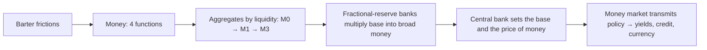

# Q&A — Money, Banking and Central Banks

> Scope: Economics for Finance — Chapter 17 (Money, Banking and Central Banks). Every question is followed by a full model answer. All amounts in Rupees (₹) unless stated. Work every numerical problem yourself before checking the solution. Sections: **A** concept-check · **B** applied/numerical · **C** interview-style · **D** MCQs with reasoning.

---

## The chapter in one picture

**One-line statement:** Money solves barter's four frictions; banks create most of it by lending (loans create deposits); the central bank controls the base and the policy rate, and the money market is the belt that carries that policy into the real economy.

---

## Section A — Concept Check

**A1. Name the four functions of money and identify the defining one.**
Medium of exchange, unit of account, store of value, and standard of deferred payment. The **medium of exchange** function is the defining one — it removes the need for a double coincidence of wants, and the other three functions follow once something is accepted in exchange.

**A2. What is the "double coincidence of wants" and why does it cripple barter?**
It is the requirement that, for any trade, each party must want exactly what the other offers, in the right quantity, at the right time. Matching such pairs is combinatorially hard, so as an economy grows the search cost of trade explodes. Money removes the requirement: you sell for money, then buy with money — two easy trades replace one near-impossible one.

**A3. Why does money collapse the number of prices in an economy?**
Under barter, every pair of goods needs its own exchange rate, so *n* goods require *n(n−1)/2* prices. With money, each good has just one price — its money price — so you need only *n* prices. Money is a common unit of account that turns a quadratic problem into a linear one.

**A4. What does "fiat money" mean, and what actually gives a ₹500 note its value?**
Fiat (Latin, "let it be done") money has value by government decree and social convention, not commodity backing. A ₹500 note is worth ₹500 because the government declares it **legal tender** *and*, crucially, because everyone else accepts it. When that trust collapses (Weimar 1923, Zimbabwe 2008) the paper becomes worthless regardless of the law.

**A5. Define M0 and M3 and state which is larger.**
**M0 (reserve money / high-powered money / monetary base)** = currency in circulation + bankers' deposits with the RBI + other deposits with the RBI — money the central bank creates directly. **M3 (broad money)** = M1 + time (fixed) deposits with banks — the headline "money supply." **M3 is far larger than M0** (in India roughly 5–6 times), because banks multiply base money into deposits.

**A6. Distinguish M1 from M3.**
**M1 (narrow money)** = currency with the public + demand deposits + other deposits with the RBI — instantly spendable transaction money. **M3 (broad money)** = M1 + time deposits, which are less liquid (locked for a term). M1 signals near-term spending momentum; M3 captures the whole deposit-and-credit engine.

**A7. What is fractional-reserve banking, and why does it let banks "create" money?**
Banks keep only a *fraction* of deposits as reserves and lend out the rest. The loaned money is spent, redeposited in another bank, and lent again — each loan creating a matching deposit. Because the same base money circulates and spawns new deposits at each round, the banking system multiplies a small amount of base money into a much larger stock of deposit money.

**A8. Explain the slogan "loans create deposits."**
The intuitive story is that banks lend out money savers deposit. In aggregate the causation runs the other way: when a bank makes a loan it simultaneously credits a new deposit into the borrower's account — creating money by a bookkeeping entry. The bank needs reserves to *settle* payments, not to *fund* the loan. So the act of lending *is* the act of money creation.

**A9. Why is the real-world money multiplier smaller than 1/reserve ratio?**
Because of two leakages. **Cash drain:** the public holds part of its money as cash rather than redepositing it, so not every loaned rupee re-enters the banking system. **Excess reserves:** banks may hold reserves above the legal minimum (for safety or weak loan demand), lending less than the maximum. Both interrupt the cascade, so the fuller formula is (1+c)/(r+c), which is below 1/r.

**A10. Distinguish CRR from SLR.**
**CRR (Cash Reserve Ratio)** is the fraction of deposits banks must park as *cash reserves with the RBI*, earning no interest. **SLR (Statutory Liquidity Ratio)** is the fraction they must hold in *safe liquid assets — mainly government securities, gold, cash — on their own books*, which earn a return. Both cap lending capacity, but CRR sterilises cash at the RBI while SLR creates captive demand for G-secs.

**A11. Distinguish a liquidity crisis from a solvency crisis at a bank.**
A **liquidity crisis** hits a bank that is *solvent* (assets > liabilities) but cannot convert assets to cash fast enough to meet withdrawals — a bank run can force fire-sales (Silicon Valley Bank, 2023). A **solvency crisis** is when assets are genuinely worth less than liabilities (bad loans / NPAs), so the bank is insolvent regardless of timing (India's PSU-bank NPA burden, 2015–2019).

**A12. What is "maturity transformation" and why is it both profitable and fragile?**
Banks fund long-term illiquid assets (a 20-year mortgage) with short-term liabilities (deposits withdrawable on demand). It is profitable because long rates usually exceed short rates. It is fragile because if depositors demand their money at once, the bank cannot instantly liquidate its long assets — the seed of every **bank run**.

**A13. List the core functions of a central bank.**
Issuer of currency (monopoly of note issue); banker to the government; banker to banks and **lender of last resort**; custodian of FX reserves and manager of the exchange rate; conductor of **monetary policy** for price stability; and regulator/supervisor of banks and the financial system.

**A14. What is the lender-of-last-resort role, and what is Bagehot's rule?**
In a crisis the central bank lends to solvent-but-illiquid banks to halt panic. **Bagehot's rule:** lend *freely*, against *good collateral*, at a *penalty rate* — so illiquid-but-sound banks survive while insolvent ones are not subsidised.

**A15. State India's inflation-targeting framework and contrast it with the Fed's mandate.**
Since 2016 the RBI targets **4% CPI inflation with a ±2% band**, set by the **Monetary Policy Committee (MPC)** — a single objective (flexible inflation targeting). The Fed has a **dual mandate**: maximum employment *and* price stability (about 2% PCE inflation).

**A16. What is the LAF corridor?**
The **Liquidity Adjustment Facility** corridor brackets the overnight rate: the **SDF / reverse repo** is the floor (the rate the RBI *pays* banks to park surplus funds), the **repo rate** is the policy anchor, and the **MSF** is the ceiling (the emergency rate at which banks borrow). The operating target, the **WACR**, is steered to sit near the repo rate.

**A17. What is the money market and why is it called the "transmission belt"?**
It is the market for very short-term debt (maturities under one year) — call money, T-bills, commercial paper, CDs, repo. It is where the policy rate first bites: policy rate → overnight call/repo rate → short-term instrument rates → banks' cost of funds → lending and deposit rates → investment, bond yields, currency. If the money market is illiquid or segmented, the belt slips and policy fails to reach the economy.

---

## Section B — Applied / Numerical (full solutions)

**B1. Simple deposit multiplier.** The reserve ratio is 8%. A depositor brings ₹5,000 of new cash into the banking system. Assuming no cash drain and no excess reserves, what is the maximum total deposits the system can create?

*Solution.* Maximum deposits = fresh base × (1 / reserve ratio) = ₹5,000 × (1 / 0.08) = ₹5,000 × 12.5 = **₹62,500**. New money *created* by lending = ₹62,500 − ₹5,000 = **₹57,500**. The multiplier here is 12.5.

**B2. Multiplier with a cash-drain leakage.** Now assume the public holds cash equal to 20% of deposits (c = 0.20) and the reserve ratio is r = 0.08. Compute the money multiplier and the broad money supported by ₹5,000 of base money.

*Solution.* Multiplier = (1 + c) / (r + c) = (1 + 0.20) / (0.08 + 0.20) = 1.20 / 0.28 = **4.29** (approx). Broad money = 4.29 × ₹5,000 ≈ **₹21,430**. Note how the cash drain crushes the multiplier from 12.5 to ~4.3 — the leakage matters far more than the reserve ratio alone.

**B3. Back out the multiplier from aggregates.** M0 = ₹40 lakh crore and M3 = ₹230 lakh crore. Find the money multiplier and interpret it.

*Solution.* Money multiplier = M3 / M0 = 230 / 40 = **5.75**. Interpretation: each ₹1 of base money supports ₹5.75 of broad money — the banking system builds 5.75 rupees of deposits-and-currency on every rupee of central-bank money.

**B4. Effect of a CRR hike on lendable funds.** A bank holds ₹1,00,000 of deposits. CRR is raised from 4% to 6%. How much additional cash must it park at the RBI, and what happens to its lending capacity?

*Solution.* Reserves at 4% = ₹4,000; at 6% = ₹6,000. Additional cash sterilised at the RBI = **₹2,000**. That ₹2,000 is withdrawn from lendable funds, so lending capacity falls by ₹2,000 *at this bank* — and by a *multiple* of that across the system, because each rupee of lost lending would have cascaded through the multiplier. A CRR hike is therefore a contractionary tool.

**B5. OMO direction.** The RBI wants to inject ₹50,000 crore of durable liquidity into the banking system. Should it *buy* or *sell* government bonds, and what happens to bond prices and yields?

*Solution.* To *inject* liquidity the RBI **buys** government bonds, paying banks with newly created reserves (money supply up). Buying pressure pushes **bond prices up**, and since price and yield move inversely, **yields fall**. (To drain liquidity it would sell bonds — prices down, yields up.)

**B6. Reading the transmission chain.** The RBI cuts the repo rate by 50 bps. Trace, step by step, the likely effect on (a) banks' cost of funds, (b) lending rates, (c) bond yields, (d) the rupee.

*Solution.* (a) Banks borrow short-term from the RBI more cheaply, so their marginal **cost of funds falls**. (b) Lower funding cost feeds into **lower loan and deposit rates**, expanding credit. (c) Lower short rates and easier liquidity pull **bond yields down** (prices up) across the short end and into the curve. (d) Lower domestic rates reduce the interest-rate differential versus abroad, so capital tends to flow out and the **rupee tends to weaken**. This is the standard policy-cut cascade.

**B7. Real vs nominal impact of QE.** After a crisis the central bank triples the monetary base through QE, but broad money grows only 15%. What has happened to the money multiplier, and what is the popular name for this situation?

*Solution.* Base (M0) roughly ×3 (i.e. +200%) while broad money (M3) rose only 15%, so the multiplier = M3/M0 has **collapsed sharply** (M3 grew far slower than M0). Banks are hoarding excess reserves rather than lending. This is the **"pushing on a string"** problem — the central bank controls the base but not the multiplier, which depends on bank and public behaviour.

**B8. Currency-to-deposit ratio and UPI.** Before UPI, the public held cash worth 30% of deposits (c = 0.30); after mass digital adoption c falls to 15%. With reserve ratio r = 5% throughout, show what happens to the multiplier.

*Solution.* Before: (1 + 0.30)/(0.05 + 0.30) = 1.30/0.35 = **3.71**. After: (1 + 0.15)/(0.05 + 0.15) = 1.15/0.20 = **5.75**. Falling cash preference **raises the multiplier** (3.71 → 5.75) — digital payments keep money inside the banking system, so more of each rupee is re-lent.

---

## Section C — Interview-Style (model answers)

**C1. "Most of the money in the economy isn't printed by the government. Explain."**
Physical currency — notes and coins — is only a small slice of the money supply (a fraction of M3). The bulk of money is **bank deposits**, which commercial banks create when they lend: every loan simultaneously creates a matching deposit, a database entry, not printed paper. So the government/central bank issues the *base* (currency and reserves, M0), and the banking system *multiplies* that base into broad money (M3) through fractional-reserve lending. In India the multiplier is around 5–6, meaning banks create roughly ₹4–5 of deposit money for every ₹1 of central-bank money. The practical upshot: to understand the money supply you watch *bank credit growth*, not the printing press.

**C2. "The RBI cut rates and flooded the system with liquidity in 2020, yet credit growth stayed weak. Why?"**
This is the money multiplier collapsing — "pushing on a string." The RBI controls the *monetary base* (it cut the repo to 4%, cut CRR, ran TLTROs, pumping M0 up), but the *multiplier* depends on whether banks actually lend and whether borrowers actually borrow. In 2020, risk-averse banks parked record surpluses back at the RBI under the reverse repo rather than lending into a uncertain economy, and loan demand was weak. So base money surged while broad money and credit barely moved. For markets it meant G-sec yields fell (excess liquidity chased safe assets) and bank net interest margins compressed. The lesson: monetary policy can *enable* credit but cannot *force* it — transmission depends on bank and borrower behaviour.

**C3. "Walk me through how a solvent bank can still fail. Use SVB."**
Through a **liquidity crisis** driven by maturity transformation. Silicon Valley Bank took short-term deposits and bought long-dated Treasuries and mortgage bonds. When the Fed hiked rates in 2022–23, those bonds' *market value* fell (prices move inversely to yields), creating large *unrealised* losses — but the bank was still solvent on a hold-to-maturity basis. The problem was funding: its depositors were concentrated tech startups who, sensing trouble, pulled about $42 billion in a single day. To meet withdrawals SVB had to *sell* the bonds and crystallise the losses, which confirmed the fear and accelerated the run. It collapsed in ~48 hours. So the failure was liquidity (can't raise cash fast enough), triggered by mark-to-market losses and deposit concentration — not classical insolvency from bad loans. It forced the Fed into lender-of-last-resort mode (the BTFP facility) to stop contagion.

**C4. "Why should a finance professional care about the difference between CRR and SLR?"**
Because they hit the market through different channels. **CRR** is dead cash at the RBI earning nothing — raising it directly drains lendable funds and squeezes bank margins and credit, so it's a pure liquidity/monetary lever. **SLR** forces banks to hold government securities, so it's simultaneously a prudential buffer *and* a source of **captive demand for G-secs** — changes in SLR ripple straight into the government bond market and the yield curve. If you trade bonds or value banks, an SLR change tells you about structural demand for sovereign paper, while a CRR change tells you about system liquidity and bank profitability.

**C5. "How does a repo-rate change actually reach the real economy?"**
Through the **money-market transmission belt**. The repo rate resets the overnight cost of money, which moves the **weighted average call rate** (the RBI's operating target) and the repo market. That reprices short-term instruments — T-bills, commercial paper, CDs — which sets banks' marginal **cost of funds**, which feeds into **lending and deposit rates**. Cheaper credit lifts investment and consumption, lowers bond yields (prices up), and tends to soften the currency. The belt only works if the money market is liquid and unsegmented; if it's not, the RBI's rate change never reaches borrowers — which is why the RBI manages systemic liquidity so carefully through OMOs and VRR/VRRR auctions.

**C6. "Is money a good store of value?"**
It's a *liquid* store of value but an *imperfect* one. Its strength is instant spendability — you can deploy it with zero conversion cost. Its weakness is that **inflation steadily erodes purchasing power**: at 5% inflation, money loses about a quarter of its value in five years. That's precisely why savers don't hold wealth as cash — they move into bonds, equities, and real assets that offer a real return. So money wins on liquidity and loses on preservation; the trade-off is the whole reason for the asset-allocation problem.

---

## Section D — MCQs with reasoning

**D1. Which of the following is the *defining* function of money?**
(a) Store of value (b) Unit of account (c) Medium of exchange (d) Standard of deferred payment
**Answer: (c).** The medium-of-exchange function removes the double coincidence of wants and is what makes something "money"; the other three functions flow from it.

**D2. Which aggregate is "high-powered money"?**
(a) M1 (b) M0 (c) M3 (d) M4
**Answer: (b).** M0 (reserve money / monetary base) is high-powered because each unit can support several units of broad money via the multiplier. M1 and M3 are broader; M4 is the broadest.

**D3. If the reserve ratio is 20%, the simple deposit multiplier is:**
(a) 2 (b) 4 (c) 5 (d) 20
**Answer: (c).** 1 / 0.20 = 5. Higher reserve ratios mean smaller multipliers.

**D4. "Loans create deposits" implies that a bank, when it makes a loan:**
(a) First collects reserves from savers, then lends them out
(b) Simultaneously credits a new deposit to the borrower
(c) Reduces the total money supply
(d) Must sell a bond to fund the loan
**Answer: (b).** The loan and the matching deposit are created together by a bookkeeping entry; the bank needs reserves to *settle*, not to *fund*.

**D5. Raising the CRR will:**
(a) Increase banks' lendable funds (b) Have no effect on money supply
(c) Drain lendable funds and shrink the multiplier (d) Raise the interest banks earn on reserves
**Answer: (c).** A higher CRR sterilises more cash at the RBI (which earns no interest), reducing lending capacity and the multiplier — a contractionary move.

**D6. To *inject* liquidity via open market operations, the central bank should:**
(a) Sell government bonds (b) Buy government bonds
(c) Raise the SLR (d) Raise the repo rate
**Answer: (b).** Buying bonds pays banks with new reserves (liquidity up); bond prices rise and yields fall. Selling bonds drains liquidity.

**D7. In the LAF corridor, the ceiling rate is the:**
(a) SDF (b) Reverse repo (c) Repo rate (d) MSF
**Answer: (d).** The MSF (Marginal Standing Facility) is the ceiling; SDF/reverse repo is the floor; the repo rate is the policy anchor in between.

**D8. A bank that is solvent but cannot meet immediate withdrawals is suffering a:**
(a) Solvency crisis (b) Liquidity crisis (c) Capital-adequacy breach (d) NPA crisis
**Answer: (b).** Solvent-but-can't-raise-cash-fast-enough is a liquidity crisis (e.g., SVB), distinct from insolvency where assets are genuinely worth less than liabilities.

**D9. India's flexible inflation-targeting framework aims for CPI inflation of:**
(a) 2% ± 1% (b) 4% ± 2% (c) 6% ± 2% (d) 5% ± 1%
**Answer: (b).** Since 2016 the RBI targets 4% CPI with a ±2% band, decided by the MPC.

**D10. The money multiplier (1+c)/(r+c) falls when:**
(a) The public's cash preference c falls (b) The reserve ratio r falls
(c) Either c or r rises (d) Bank lending rises
**Answer: (c).** A larger cash drain (c) or a higher reserve ratio (r) increases leakage and shrinks the multiplier.

**D11. The RBI's *operating target* for monetary policy is the:**
(a) Repo rate (b) 10-year G-sec yield (c) Weighted average call rate (WACR) (d) M3 growth
**Answer: (c).** The RBI steers the WACR to sit near the repo rate; the repo rate is the *instrument*, the WACR is the operating *target*.

**D12. Quantitative easing is primarily used when:**
(a) Inflation is very high (b) Policy rates are near the zero lower bound
(c) The currency is appreciating (d) The SLR needs raising
**Answer: (b).** QE — large-scale asset purchases to expand the base and push down long-term yields — is deployed when conventional rate cuts are exhausted at the zero lower bound.

---

*End of Q&A — Chapter 17. Aim to answer Section A from memory, solve every Section B problem with pen and paper before reading the solution, and rehearse Section C aloud as if in an interview.*
