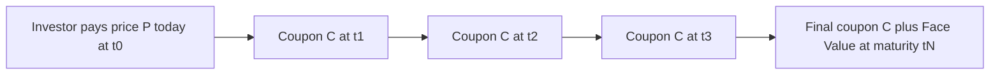
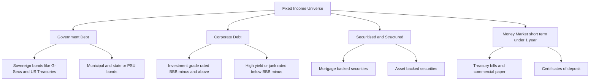
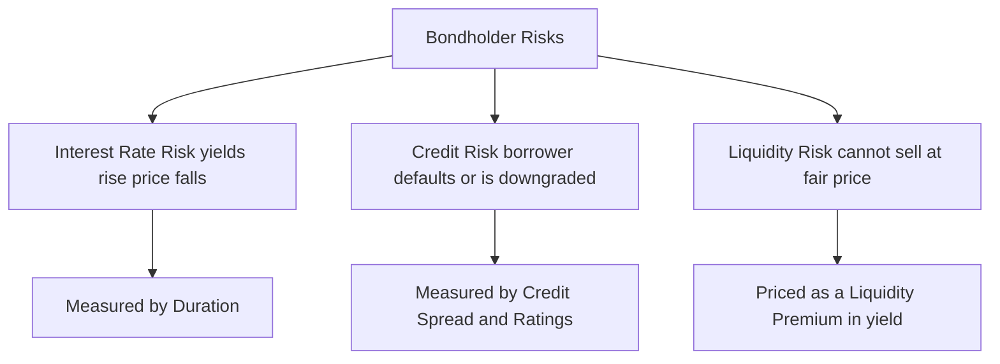

# Chapter 01 — Introduction to Fixed Income

## 1. The Problem / The Need

Every functioning economy runs on a single, unavoidable fact: **the people and institutions who have money today are rarely the same ones who have the best use for it today.** A pension fund sitting on ₹50,000 crore of retirement savings has cash but no factory to build. A power company that needs ₹5,000 crore to build a plant has the project but not the cash. A government that must fund roads, defence, and salaries collects taxes months after it must spend. Households want to buy houses decades before they have saved the full price.

The economy needs a *mechanism* to move purchasing power from those who have surplus (savers) to those who have a deficit (borrowers), across **time**, and to do so in a way that:

1. **Compensates the saver** for giving up the use of money now (the time value of money).
2. **Compensates the saver for risk** — the borrower might not pay back.
3. **Is standardised and tradable**, so the saver is not locked in for the full term and a large need can be split among thousands of lenders.

Equity (shares) solves part of this problem but at a cost the borrower often does not want: giving away ownership, control, and an unlimited share of future profits. A company that simply needs to *borrow* ₹500 crore for five years does not want to hand permanent ownership to strangers. It wants to **borrow, pay a defined cost, and be done.**

Fixed income is the answer to this need. It is the formalised, standardised, tradable **IOU** — a contractual promise to repay borrowed money on a schedule, at a defined cost. The word "fixed" refers to the fact that the cash flows (the interest payments and the repayment of principal) are, in the classic case, **fixed and known in advance.** You lend ₹100 today; you are contractually owed, say, ₹7 every year and your ₹100 back at the end. The certainty of that schedule is precisely what makes the instrument valuable, priceable, and enormous in scale.

## 2. The Core Idea

A fixed-income security is a **loan sliced into tradable units, with a legally defined repayment schedule.** The core relationship is always the same:

> A **borrower (issuer)** receives cash today from a **lender (investor)** and in exchange issues a security that promises (a) periodic interest payments, called **coupons**, and (b) the return of the borrowed amount, called the **principal, par, or face value**, at a stated future date called **maturity.**

The single most important idea in the entire subject — the one from which duration, convexity, yield curves, and credit spreads all descend — is this:

> **A bond is a bundle of fixed future cash flows, and its price today is simply the present value of those cash flows discounted at a rate that reflects time and risk.**

$$
P = \sum_{t=1}^{N} \frac{C_t}{(1+r)^t}
$$

where $P$ is the price, $C_t$ is the cash flow at time $t$, $r$ is the discount rate (the yield), and $N$ is the number of periods. Everything else in fixed income is an elaboration of, or a reaction to, this one equation.

The second core idea, which trips up every beginner and every interviewer loves to test, follows immediately from the first:

> **When the discount rate $r$ rises, the price $P$ falls — and vice versa.** Bond prices and yields move in opposite directions. Always.

This inverse relationship is not a convention or a market quirk; it is arithmetic. If a fixed stream of ₹7-per-year is worth more when discounted at 5% than at 8%, then a security paying that fixed stream must be worth *less* the moment the market demands 8%.

## 3. Why / How It Works

Let us build the intuition for *why* the present-value machine works, because interviewers probe understanding, not memorised formulas.

**Why discount at all?** Money has a time value. ₹100 today is worth more than ₹100 in a year, because ₹100 today can be invested to become ₹105 or ₹107 in a year. Therefore a promise of ₹100 in a year is worth *less* than ₹100 today. To find how much less, we **discount** it: divide by $(1+r)$. If the going rate is 7%, then ₹100 due in one year is worth $100 / 1.07 = ₹93.46$ today. That is what someone should rationally pay now to receive ₹100 in a year.

**Why does a bond's price equal the sum of discounted cash flows?** Because a rational buyer will not pay more than what the cash flows are worth to them, and a rational seller will not accept less. If a bond's cash flows are worth ₹98 in present-value terms and it is priced at ₹95, buyers rush in (arbitrage) and bid the price up to ₹98. If it is priced at ₹101, holders sell and the price falls to ₹98. The market price *is* the present value at the market's required yield. This is the **no-arbitrage** foundation.

**Why does the yield reflect time AND risk?** The discount rate $r$ is not one number pulled from air. It is built up in layers:

$$
r = r_{\text{real}} + \text{expected inflation} + \text{risk premia}
$$

The layers, conceptually:

- **Real risk-free rate** — the pure cost of deferring consumption, with no inflation and no default risk.
- **Inflation compensation** — lenders want to be repaid in money of the same purchasing power.
- **Credit (default) risk premium** — extra yield demanded because this particular borrower might not pay.
- **Liquidity premium** — extra yield because this bond may be hard to sell quickly at a fair price.
- **Term/maturity premium** — extra yield for tying money up longer and bearing more uncertainty.

A government bond in its own currency carries essentially only the first two plus a term premium; a small-company bond carries all five. The *difference* in yield between a risky bond and a government bond of the same maturity is called the **credit spread**, and it is the market's price of that borrower's risk.

The diagram below shows the anatomy of a plain bond as a timeline of cash flows.

*Figure 1 — A plain vanilla bond is an outflow today followed by a fixed stream of coupons and a principal repayment at maturity.*

## 4. Full Content — The Formulas and the Bond Math

### 4.1 The vocabulary of a bond

| Term | Symbol | Meaning |
|---|---|---|
| Face / Par value | $F$ | Amount repaid at maturity; the base for coupon calculation. Conventionally ₹100 or ₹1,000. |
| Coupon rate | $c$ | Annual interest rate stated on the bond, as a % of face value. |
| Coupon payment | $C$ | Cash interest per period $= c \times F /$ (payments per year). |
| Maturity | $N$ | Number of periods until principal is repaid. |
| Price | $P$ | What the bond trades at today (present value of cash flows). |
| Yield to maturity | $y$ | The single discount rate that makes PV of cash flows equal price. |
| Current yield | — | Annual coupon divided by current price. |

### 4.2 The pricing formula

For a bond paying coupon $C$ each period for $N$ periods and face $F$ at maturity, discounted at periodic yield $y$:

$$
P = \underbrace{\sum_{t=1}^{N} \frac{C}{(1+y)^t}}_{\text{PV of coupons (an annuity)}} + \underbrace{\frac{F}{(1+y)^N}}_{\text{PV of principal}}
$$

The coupon stream is an annuity, so it has a closed form:

$$
P = C \times \left[ \frac{1 - (1+y)^{-N}}{y} \right] + F \times (1+y)^{-N}
$$

### 4.3 The three price regimes (memorise the logic, not the cases)

| Relationship | Bond trades at | Why |
|---|---|---|
| Coupon rate $c$ = Yield $y$ | **Par** ($P = F$) | The coupon exactly compensates the required return. |
| Coupon rate $c$ > Yield $y$ | **Premium** ($P > F$) | Bond pays more than the market demands, so it is worth more than face. |
| Coupon rate $c$ < Yield $y$ | **Discount** ($P < F$) | Bond pays less than the market demands, so it must be cheap to compensate. |

### 4.4 Yield measures

**Current yield** (a crude income measure, ignores capital gain/loss and time value):

$$
\text{Current Yield} = \frac{\text{Annual coupon}}{\text{Price}}
$$

**Yield to maturity (YTM)** — the internal rate of return if held to maturity, reinvesting coupons at $y$. It is the $y$ that solves the pricing equation. There is no algebraic solution for $N > 1$; it is found by iteration (trial and error) or a financial calculator.

### 4.5 Interest-rate sensitivity — duration (a first look)

Because price is a function of yield, we care *how much* price moves when yield moves. The first-order measure is **duration**. **Macaulay duration** is the weighted-average time to receive the bond's cash flows, weights being each cash flow's share of total present value:

$$
D_{\text{Mac}} = \frac{\sum_{t=1}^{N} t \cdot \dfrac{C_t}{(1+y)^t}}{P}
$$

**Modified duration** converts this into a % price-change sensitivity:

$$
D_{\text{Mod}} = \frac{D_{\text{Mac}}}{1+y} \qquad\Longrightarrow\qquad \frac{\Delta P}{P} \approx -D_{\text{Mod}} \times \Delta y
$$

The negative sign encodes the inverse price–yield relationship. Duration is introduced fully in a later chapter; it appears here so you see *why* it exists — it is the natural next question after "price is a PV of fixed cash flows."

### 4.6 The fixed-income landscape

Fixed income is not one market but a family. The map below organises it by issuer and, within that, by risk.

*Figure 2 — The fixed-income landscape by issuer type and risk tier. Government debt anchors the low-risk end; high-yield corporates and structured products carry more risk and yield.*

### 4.7 Why fixed income is the largest asset class

Globally, the bond market is roughly **US$130+ trillion** in outstanding debt, materially larger than global equity market capitalisation. Three structural reasons explain this:

1. **Everyone borrows, few issue equity.** Governments cannot issue shares; they can only tax or borrow. So the entire stock of government financing is fixed income. Government debt alone rivals all global equity.
2. **Companies use far more debt than equity for financing on the margin.** Debt is cheaper (interest is tax-deductible; lenders demand less return than shareholders because they bear less risk) and does not dilute ownership.
3. **Debt is issued repeatedly and in tranches.** A single borrower has one equity but issues dozens of bonds over time, each a separate security with its own maturity and coupon, multiplying the number of instruments.

### 4.8 Overview of the three headline risks

The certainty of a bond's *cash flows* does not make the *investment* certain. Three risks dominate, and every fixed-income decision trades them off.

**Interest-rate risk.** This is the risk that market yields rise after you buy, pushing the price of your bond *down*. It flows directly from the pricing equation: raise $y$ and $P$ falls. It affects even a default-free government bond. Its magnitude scales with **duration** — the longer the maturity and the lower the coupon, the more violently the price swings for a given yield move. A 30-year zero-coupon government bond can lose a third of its value on a 1.5% yield spike with zero chance of default. This is *the* risk that catches investors who assume "government bond = safe."

**Credit (default) risk.** This is the risk that the *borrower fails to pay* — misses a coupon, defaults on principal, or is downgraded (raising its spread and cutting the price even before any default). It is measured by the **credit spread** over the government curve and summarised by **credit ratings** (AAA down to D). A government borrowing in its own currency has minimal credit risk (it can print money); a highly leveraged company has substantial credit risk, which is exactly why it must offer a fat spread to attract lenders.

**Liquidity risk.** This is the risk that when you want to sell, there is no ready buyer at a fair price, forcing you to accept a discount. A benchmark 10-year government bond trades in seconds at a razor-thin bid-ask spread; a small, obscure corporate bond may take days to sell and cost you 2–3% in transaction friction. Investors demand a **liquidity premium** (extra yield) to hold illiquid bonds.

*Figure 3 — The three headline risks of holding a bond, and the metric that measures or prices each one.*

These are not the only risks — **reinvestment risk** (coupons reinvested at lower rates), **inflation risk** (fixed cash flows lose purchasing power), and **currency risk** (for foreign bonds) also matter — but interest-rate, credit, and liquidity are the three that frame the entire discipline.

## 5. Worked Examples

### Example 1 — Pricing a plain bond and confirming the three regimes

**Setup.** A bond has face value $F = ₹1,000$, an annual coupon rate $c = 8\%$ (so $C = ₹80$ per year), and $N = 3$ years to maturity. Price it at three different market yields: 8%, 10%, and 6%.

**Case A: yield $y = 8\%$ (equals coupon → expect par).**

$$
P = \frac{80}{1.08} + \frac{80}{1.08^2} + \frac{1080}{1.08^3}
$$

- $80 / 1.08 = 74.074$
- $80 / 1.1664 = 68.587$
- $1080 / 1.259712 = 857.339$
- **Sum = 74.074 + 68.587 + 857.339 = ₹1,000.00** ✓

Trades at **par**, exactly as predicted when $c = y$. The math self-verifies.

**Case B: yield $y = 10\%$ (yield > coupon → expect discount).**

$$
P = \frac{80}{1.10} + \frac{80}{1.21} + \frac{1080}{1.331}
$$

- $80 / 1.10 = 72.727$
- $80 / 1.21 = 66.116$
- $1080 / 1.331 = 811.420$
- **Sum = ₹950.26**

Trades at a **discount** ($P < F$), as predicted. A 5% rise in required yield knocked ₹49.74 off the price.

**Case C: yield $y = 6\%$ (yield < coupon → expect premium).**

$$
P = \frac{80}{1.06} + \frac{80}{1.1236} + \frac{1080}{1.191016}
$$

- $80 / 1.06 = 75.472$
- $80 / 1.1236 = 71.199$
- $1080 / 1.191016 = 906.956$
- **Sum = ₹1,053.63**

Trades at a **premium** ($P > F$), as predicted.

**Reconciliation.** The three prices — ₹950.26, ₹1,000.00, ₹1,053.63 — sit in the correct order (higher yield → lower price) and land exactly on par when $c = y$. The inverse price–yield relationship and the three regimes are all confirmed from one worked bond.

### Example 2 — Current yield vs. YTM, and finding YTM by iteration

**Setup.** The discount bond from Case B trades at $P = ₹950.26$, pays $C = ₹80$, $F = ₹1,000$, $N = 3$. Compute current yield, then recover the YTM.

**Current yield:**

$$
\text{Current Yield} = \frac{80}{950.26} = 8.42\%
$$

**YTM.** We know from Case B that $y = 10\%$ produces exactly ₹950.26, so YTM = 10%. But let us *demonstrate the iteration* an interviewer would want to see, pretending we did not know.

- Guess $y = 8\%$: price = ₹1,000.00 (too high — need lower price, so raise yield).
- Guess $y = 12\%$: 
  - $80/1.12 = 71.43$; $80/1.2544 = 63.78$; $1080/1.404928 = 768.72$; sum = **₹903.93** (too low — overshot, lower yield).
- We want ₹950.26, between the 8% price (₹1,000) and 12% price (₹903.93). Linear interpolation:

$$
y \approx 8\% + \frac{1000 - 950.26}{1000 - 903.93} \times (12\% - 8\%) = 8\% + \frac{49.74}{96.07} \times 4\% = 8\% + 2.07\% = 10.07\%
$$

Interpolation lands at **10.07%**, very close to the true **10%** (the small error is because price is convex, not linear, in yield — the seed of the *convexity* concept in a later chapter).

**Reconciliation and insight.** Current yield (8.42%) sits *below* YTM (10%). That is exactly right for a **discount** bond: the buyer earns not only the coupon income but also a capital gain as the price pulls to par (₹1,000) at maturity, and YTM captures that gain while current yield ignores it. For a premium bond the ordering reverses (current yield > YTM). This ordering is a classic interview check.

### Example 3 — The price impact of a rate move (duration preview)

**Setup.** Take the par bond from Case A ($P = ₹1,000$, $y = 8\%$, $C = ₹80$, $N = 3$). Estimate the price if yields rise 100 basis points (1%) to 9%, first by exact pricing, then reconcile with modified duration.

**Exact reprice at 9%:**

$$
P = \frac{80}{1.09} + \frac{80}{1.1881} + \frac{1080}{1.295029} = 73.394 + 67.335 + 833.958 = ₹974.69
$$

Price fell by ₹25.31, a **−2.531%** move for a +1% yield change.

**Now via duration.** Compute Macaulay duration at $y = 8\%$ (PVs from Case A):

| $t$ | $C_t$ | $PV = C_t/1.08^t$ | $t \times PV$ |
|---|---|---|---|
| 1 | 80 | 74.074 | 74.074 |
| 2 | 80 | 68.587 | 137.174 |
| 3 | 1,080 | 857.339 | 2,572.017 |
| | | **1,000.00** | **2,783.265** |

$$
D_{\text{Mac}} = \frac{2{,}783.265}{1{,}000} = 2.783 \text{ years}, \qquad D_{\text{Mod}} = \frac{2.783}{1.08} = 2.577
$$

Predicted price change:

$$
\frac{\Delta P}{P} \approx -2.577 \times 1\% = -2.577\%
$$

**Reconciliation.** Duration predicts **−2.577%**; exact repricing gave **−2.531%**. They agree to within 0.05%. The tiny gap (duration slightly *overstates* the fall) is convexity — the true price–yield curve bends, so the straight-line duration estimate errs on the downside for a rate rise. This is why duration is a *first-order* approximation and convexity a *second-order* correction. Both concepts fall straight out of the single pricing equation from Section 2.

## 6. Connections

- **To equities (corporate finance).** Debt and equity are the two claims on a firm's assets. Bondholders are paid *first* (senior); shareholders get the *residual*. This seniority is why bonds are lower-risk, lower-return, and why the cost of debt is below the cost of equity — feeding directly into the Weighted Average Cost of Capital (WACC).
- **To macroeconomics and monetary policy.** Central banks (RBI, the Fed) set short-term rates and, via those, influence the entire yield curve. Bond prices are the transmission mechanism of monetary policy into the real economy: cut rates → bond prices rise, borrowing costs fall → investment and consumption rise.
- **To the yield curve (next chapters).** The relationship between yield and maturity — the term structure — is the master diagram of fixed income and is built from exactly the discounting logic introduced here.
- **To duration and convexity (later chapters).** These are the calculus of the pricing equation: the first and second derivatives of price with respect to yield.
- **To credit analysis.** The credit spread introduced here is the entire subject of credit risk, ratings, and default modelling.
- **To portfolio management.** Bonds provide income, capital preservation, and — crucially — *diversification*: they often (not always) rise when equities fall, cushioning portfolios.

## 7. Key Terms

| Term | One-line definition |
|---|---|
| **Fixed income / bond** | A tradable loan with a contractually defined repayment schedule. |
| **Issuer / borrower** | The entity that sells the bond and owes the money (government, corporate, bank). |
| **Investor / lender / bondholder** | The buyer who provides cash and holds the claim to repayment. |
| **Face / par value ($F$)** | The principal repaid at maturity and the base for coupon calculation. |
| **Coupon** | The periodic interest payment; coupon rate is it as a % of face value. |
| **Maturity** | The date the principal is repaid and the bond ends. |
| **Price** | Present value of all future cash flows at the market yield. |
| **Yield to maturity (YTM)** | The single discount rate equating PV of cash flows to price; the bond's IRR if held to maturity. |
| **Current yield** | Annual coupon ÷ current price; ignores capital gain/loss and time value. |
| **Discount / premium / par** | Price below / above / equal to face value. |
| **Credit spread** | Extra yield of a risky bond over a government bond of equal maturity. |
| **Duration** | Sensitivity of price to yield; also weighted-average time to cash flows. |
| **Coupon vs. zero-coupon** | Pays periodic interest vs. pays nothing until maturity (sold at a deep discount). |

## 8. Common Confusions

1. **"Fixed income means fixed return."** No. Cash *flows* are fixed (for a plain bond), but your *return* depends on the price you paid and whether you hold to maturity. Sell early after yields rise and you take a capital loss.
2. **"Coupon rate is the same as yield."** The coupon rate is fixed forever at issuance and set on *face* value. The yield floats with the market and is measured on *price*. They coincide only when the bond trades at par.
3. **"Higher coupon = better bond."** A high-coupon bond simply trades at a premium; you pay for the extra coupons up front. What matters for return is yield, not coupon.
4. **"Bonds are safe, full stop."** Bonds carry real risks — interest-rate risk, credit/default risk, liquidity risk, reinvestment risk, inflation risk. A long-dated government bond can lose 20%+ of its value when rates spike, with zero default.
5. **"Price and yield are the same signal."** They move *inversely*. Rising yields are bad news for existing bondholders (prices fall), even though the bond is now "paying more."
6. **"Current yield is the return."** Current yield ignores the pull-to-par capital gain/loss and time value. YTM is the proper total-return measure for hold-to-maturity.
7. **"YTM is guaranteed."** YTM assumes you hold to maturity *and* reinvest every coupon at the YTM. If reinvestment rates differ, your realised return differs — this is reinvestment risk.

## 9. Recap

Fixed income exists to move purchasing power from savers to borrowers across time, through standardised, tradable IOUs whose defining feature is a **known schedule of cash flows.** A bond is fully described by its face value, coupon, and maturity, and its price is nothing more than the **present value of its cash flows discounted at the market yield** — the master equation from which the entire subject unfolds. From that equation follow the inescapable facts that **price and yield move inversely** and that bonds trade at par, premium, or discount depending on whether the coupon matches, exceeds, or falls short of the yield. The discount rate itself is a stack of compensations — for time, inflation, credit, liquidity, and term — and the credit portion, measured as a spread over government bonds, prices each borrower's risk.

Fixed income is the **largest asset class on earth** because governments can only borrow (not issue equity), companies finance heavily with cheap, non-dilutive debt, and each borrower issues many bonds over time. It matters to portfolios (income, preservation, diversification), to rates (it is the transmission channel of monetary policy), and to the economy (it funds governments, infrastructure, and firms). The three headline risks — **interest-rate, credit, and liquidity** — set up the rest of the study guide, and the natural next questions ("*how much* does price move when yield moves?") lead straight into duration and convexity.

## 10. Quick-Reference / Interview Points

**The one equation:** $P = \sum_{t=1}^{N} \dfrac{C_t}{(1+y)^t}$ — price is the present value of fixed cash flows.

**The one relationship:** Bond price and yield move **inversely**. Always. (It is arithmetic, not convention.)

**The three regimes:**

| If | Then |
|---|---|
| Coupon = Yield | Par |
| Coupon > Yield | Premium |
| Coupon < Yield | Discount |

**Yield ordering checks (interview favourite):**
- Discount bond: Current Yield **<** YTM (you also earn a capital gain to par).
- Premium bond: Current Yield **>** YTM.
- Par bond: Coupon = Current Yield = YTM.

**The yield build-up:** $y$ = real rate + inflation + credit spread + liquidity premium + term premium.

**Why fixed income is the biggest asset class:** governments can only borrow; debt is cheaper and non-dilutive than equity; each issuer floats many bonds. Global bond market ≈ US$130T+, larger than global equities.

**The three headline risks:**
- **Interest-rate risk** — yields rise, prices fall (measured by duration). Hits even risk-free bonds.
- **Credit risk** — the borrower may default; priced by the credit spread and ratings.
- **Liquidity risk** — you may not be able to sell quickly at a fair price; priced by the liquidity premium.

**Duration soundbite:** $\dfrac{\Delta P}{P} \approx -D_{\text{Mod}} \times \Delta y$. A modified duration of 2.6 means a +1% yield move costs ≈ 2.6% of price. It is a first-order estimate; convexity corrects the curvature.

**Seniority soundbite:** bondholders are paid before shareholders — lower risk, lower return, cost of debt below cost of equity, interest is tax-deductible.

**Two-sentence definition to open any interview answer:** "Fixed income is a tradable loan with a contractually fixed cash-flow schedule — periodic coupons plus principal at maturity. Its price is the present value of those cash flows at the market yield, which is why price and yield move inversely."
