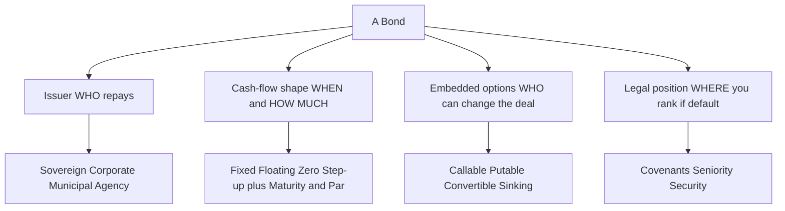
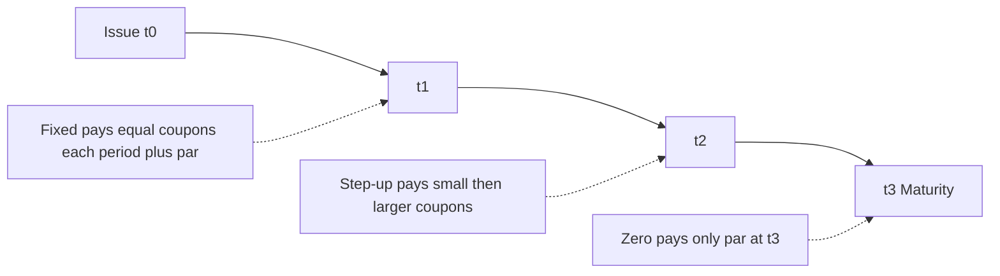
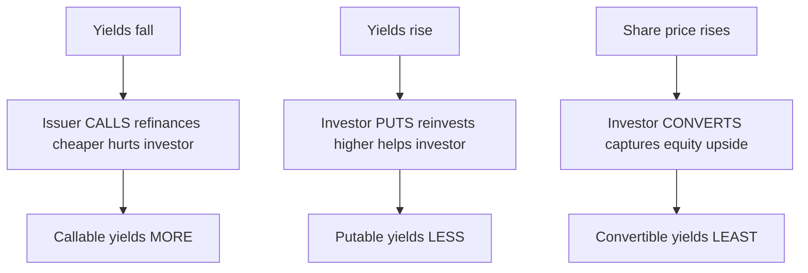

# Chapter 02 — Bond Features and Types

## 1. The Problem / The Need

A bond is a legal contract. When you lend money to a government or a company, dozens of questions must be answered before a single rupee or dollar changes hands: *Who* is borrowing? *How much* interest, and does it move with the market or stay fixed? *When* do I get my principal back? *What happens if the borrower cannot pay?* *Can the borrower repay me early and rip up the deal?* *Can I force early repayment?* *Where do I stand in line if the company goes bankrupt?*

If these questions are left vague, the loan is unpriceable. Two bonds that both pay "5%" can be worth wildly different amounts once you know that one is a 30-year unsecured note from a struggling airline, callable at the issuer's whim, while the other is a 3-year senior secured note from a sovereign-backed utility. **The features are the product.** A fixed-income analyst does not really analyze "bonds" — they analyze a specific bundle of contractual promises and options, each of which shifts value between borrower and lender.

The need, therefore, is a precise vocabulary and a valuation lens for **every structural feature a bond can carry**. This chapter builds that map: who issues, how the coupon is shaped, when principal returns, what options are embedded, what legal protections (covenants) exist, and where the lender ranks in the capital structure. Every later chapter — duration, spread analysis, credit modelling — assumes you can read a bond's DNA fluently.

## 2. The Core Idea

A bond can be decomposed into **four independent design axes**, and any real-world security is one point in this four-dimensional space:

1. **Issuer** — the source of repayment (and thus the credit risk): sovereign, corporate, municipal, agency, supranational.
2. **Cash-flow shape** — the coupon structure and maturity: fixed, floating, zero, step-up; par value; term.
3. **Embedded options** — rights that let one party alter the contract: call, put, conversion, sinking funds.
4. **Legal position** — covenants, seniority, and security that govern behaviour and recovery.

The central insight is that **each feature moves value between the two parties, and the price/yield adjusts to compensate the party who gives something up.** A call option benefits the issuer, so callable bonds must offer a *higher* yield. A put option benefits the investor, so putable bonds accept a *lower* yield. Security benefits the lender, so secured bonds yield *less* than unsecured. Nothing is free; every feature has a price you can, in principle, quantify.

*Figure 2.1 — The four design axes of any bond; a real security is one point in this space.*

## 3. Why / How It Works

Why does this decomposition hold up? Because a bond's price is nothing more than the **present value of a promised set of cash flows, adjusted for the probability those promises are kept and for any options that reshape them.** Formally, ignoring options for a moment:

$$P = \sum_{t=1}^{N} \frac{CF_t}{(1+y)^t}$$

Every feature enters this equation through one of three doors:

- **It changes the numerator (the cash flows $CF_t$).** Coupon structure, par value, and maturity literally define the $CF_t$ stream. A step-up bond has rising $CF_t$; a zero has a single terminal $CF_N$.
- **It changes the discount rate $y$.** The issuer's creditworthiness, the seniority, and the security determine the *risk premium* baked into $y$. A junior unsecured airline bond is discounted at a much higher $y$ than a senior secured sovereign-guaranteed one, even for identical cash flows.
- **It adds or subtracts an option value.** Embedded options mean the cash-flow stream is no longer fixed — it becomes *contingent*. We value these by splitting the bond into a straight bond **plus or minus** an option:

$$P_{callable} = P_{straight} - V_{call}, \qquad P_{putable} = P_{straight} + V_{put}$$

This "bond = straight bond ± option" identity is the engine behind the whole chapter. It tells you *direction* (does the feature help the issuer or the investor?) and, with a lattice model, *magnitude*. The covenants and legal structure, meanwhile, do not appear as a separate term — they work **through** the discount rate and through the recovery assumption embedded in credit risk. Tight covenants and strong security lower expected loss, which lowers the spread, which lowers $y$, which raises $P$.

That is the whole logic. The rest is filling in each axis with precision.

## 4. Full Content

### 4.1 Issuer Types — Who Repays

The issuer is the single biggest driver of a bond's risk. Repayment comes from the issuer's *capacity and willingness* to pay, and these differ radically across issuer classes.

| Issuer type | Example | Source of repayment | Key risk | Typical yield vs sovereign |
|---|---|---|---|---|
| **Sovereign (G-sec)** | US Treasury, Indian G-Sec, UK Gilt | Taxation power, money printing (own currency) | Inflation, currency (if foreign-currency debt) | Benchmark (lowest in own currency) |
| **Supranational** | World Bank (IBRD), Asian Development Bank | Callable capital from member states | Very low; AAA typically | Small spread over sovereign |
| **Agency / GSE** | Fannie Mae, US agency, NABARD | Implicit or explicit government support | Prepayment (if MBS), agency-specific | Small spread over sovereign |
| **Municipal** | US state/city bonds, Indian muni bonds | Tax revenue (GO) or project revenue (revenue bond) | Local fiscal stress; often tax-exempt | Varies; tax-adjusted |
| **Corporate** | Reliance, Apple, an airline | Business cash flows, asset sales | Default / credit risk; wide range | Meaningful spread; wider for HY |

Key sub-distinctions:

- **Domestic-currency vs foreign-currency sovereign debt.** A government borrowing in *its own* currency can always print to repay nominally (default risk is low but inflation/currency risk is real). The same government borrowing in USD (external debt) *can* default — this is why emerging-market USD bonds carry credit spreads and ratings below the local-currency rating.
- **Municipal bonds split into General Obligation (GO)** — backed by the full taxing power of the issuer — **and Revenue bonds** — backed only by cash flows from a specific project (a toll road, an airport). GO is generally safer. In the US, municipal interest is often **federally tax-exempt**, which is why munis trade at *lower* pre-tax yields; you compare them via the **taxable-equivalent yield**:

$$\text{TEY} = \frac{y_{muni}}{1 - \text{tax rate}}$$

  A 3.5% muni for an investor in the 37% bracket is equivalent to $0.035 / (1-0.37) = 5.56\%$ taxable — so it beats a 5% corporate on an after-tax basis.
- **Agency bonds** blur the line between government and market credit; the critical question is whether support is *explicit* (guaranteed) or merely *implicit* (assumed, as with US GSEs pre-2008 — an assumption that proved fragile).

### 4.2 Coupon Structures — How Much, and How It Moves

The coupon is the periodic interest. Its *shape* over time defines the cash-flow numerator.

**Fixed-rate (plain vanilla).** A constant coupon rate $c$ on par, paid (usually) semi-annually. Coupon per period $= \frac{c \times \text{Par}}{f}$ where $f$ is periods per year. This is the reference structure for all pricing and duration math. Its full price sensitivity to rates is highest of the coupon-bearing types because cash flows are locked.

**Floating-rate note (FRN / "floater").** The coupon resets each period to a **reference rate plus a quoted margin (spread)**:

$$\text{Coupon rate}_t = \text{Reference}_t + \text{Quoted margin}$$

Historically the reference was LIBOR; post-2021 it is **SOFR** (USD), **SONIA** (GBP), **EURIBOR/€STR**, or **MIBOR** (INR). Because the coupon re-prices toward the market, an FRN's price stays *near par* and its **interest-rate duration is very short** (roughly the time to the next reset). Its price *does* still move with changes in the issuer's credit spread — that is captured by the **discount margin (DM)**, the spread that equates the FRN's PV to its price. If credit deteriorates, the required DM rises above the fixed quoted margin and the price falls below par.

**Zero-coupon bond.** Pays *no* periodic coupon; the entire return comes from buying at a deep discount and receiving par at maturity. Price:

$$P = \frac{\text{Par}}{(1+y)^{N}}$$

Zeros have the **longest possible duration for a given maturity** — Macaulay duration equals the maturity exactly — because 100% of the cash flow is at the end. They carry no reinvestment risk (no coupons to reinvest) but maximum price volatility. Treasury STRIPS are the classic example.

**Step-up / step-down coupon.** The coupon changes on a preset schedule (step-up: rises over time; step-down: falls). Common in callable structures where the rising coupon pressures the issuer to call. A variant is the **credit-linked step-up**, where the coupon rises if the issuer is downgraded — compensating investors for higher risk.

**Deferred / PIK (payment-in-kind).** No cash coupon early on (deferred), or the coupon is paid in *more bonds* rather than cash (PIK). Used by highly leveraged issuers who want to conserve cash; risky for investors.

*Figure 2.2 — Cash-flow timelines: a zero back-loads everything, a fixed bond pays level coupons, a step-up back-loads coupon size.*

### 4.3 Maturity and Par Value

- **Par value (face / principal / redemption value).** The amount repaid at maturity and the base on which the coupon rate is applied. Prices are quoted as a *percentage of par*: a bond "at 98" costs 980 per 1,000 face. Par is usually 100/1,000 for corporates, but conventions vary.
- **Maturity (tenor).** Time until principal is repaid. Conventions: **money-market (≤1 yr), short (1–5 yr), intermediate/medium (5–12 yr), long (>12 yr)**. Some bonds are **perpetual** (no maturity — consols, certain bank AT1 instruments); their price is $P = \text{Coupon}/y$.
- **Bullet vs amortizing.** A **bullet** repays all principal at maturity (the default assumption). An **amortizing** bond repays principal gradually over its life (mortgages, many asset-backed securities), so its *average life* is much shorter than its final maturity.

Maturity matters because it drives duration and thus interest-rate risk: longer maturity → later cash flows → more discounting sensitivity → larger price swings per unit of yield change.

### 4.4 Embedded Options — Who Can Change the Deal

An embedded option is a right, granted to the issuer or the investor, to alter the bond's cash flows. It is *embedded* — you cannot strip it out and trade it separately. Its value is captured by the identity from Section 3.

**Callable bond — issuer's option to redeem early.** The issuer can buy the bond back at a set **call price** (often at a premium to par, declining toward par over time — the *call schedule*) after a **call-protection / lockout period**. The issuer calls when rates have *fallen* (it can refinance cheaper) — exactly when the investor least wants their bond taken away. So:

$$P_{callable} = P_{straight} - V_{call}$$

The investor is *short* the call, hence demands a **higher yield**. The call caps the bond's upside (price compression) — as yields fall, the callable bond's price rises less than a straight bond's and flattens toward the call price. This produces **negative convexity** over the relevant yield range.

**Putable bond — investor's option to sell back early.** The investor can force the issuer to redeem at the **put price** (usually par) on set dates. The investor puts when rates have *risen* (they can reinvest at higher yields) or when credit deteriorates. So:

$$P_{putable} = P_{straight} + V_{put}$$

The investor is *long* the put, so accepts a **lower yield**. The put sets a price floor, giving the bond positive convexity and downside protection.

**Convertible bond — investor's option to convert into equity.** The holder can exchange the bond for a fixed number of shares (the **conversion ratio**). It is a hybrid: a straight bond **plus a call option on the issuer's stock**.

- **Conversion ratio** = shares received per bond.
- **Conversion price** = Par / Conversion ratio.
- **Conversion value (parity)** = Conversion ratio × current share price.
- **Straight/investment value** = value as a plain bond ignoring conversion — the *floor*.
- **Market conversion price** = Bond price / Conversion ratio; the **conversion premium** is how much over parity you pay for the bond.

Because the equity upside is valuable, convertibles carry the **lowest coupons** — investors accept less income in exchange for the equity call.

**Warrants, sinking funds, and make-whole calls.** A **sinking fund** obligates the issuer to retire portions of the issue on a schedule (reduces credit risk but adds reinvestment/timing uncertainty for holders). A **make-whole call** lets the issuer call the bond but at a price equal to the PV of remaining cash flows discounted at a *small spread over Treasuries* — deliberately expensive, so it is rarely exercised and mainly exists for corporate flexibility (M&A, restructuring) without penalising holders.

*Figure 2.3 — Who exercises when, and the resulting yield ordering across embedded options.*

### 4.5 Covenants and the Bond Indenture

The **indenture** (or *deed of trust*) is the master legal contract between issuer and bondholders, administered by a **trustee** who acts on behalf of holders. It spells out every term above *plus* the **covenants** — promises that constrain the issuer's behaviour to protect lenders.

- **Affirmative (positive) covenants** — things the issuer *must* do: pay principal and interest on time, maintain insurance, keep assets in good repair, supply audited financials, maintain its legal existence, comply with laws.
- **Negative (restrictive) covenants** — things the issuer *must not* do, and these are where the real protection lives:
  - **Limitation on additional debt** (leverage/coverage tests — e.g. keep interest coverage above 2.0×).
  - **Restrictions on dividends and share buybacks** (stops cash leaking to shareholders ahead of creditors).
  - **Negative pledge** — cannot pledge assets to *other* lenders without equally securing existing bondholders.
  - **Limitations on asset sales, mergers, sale-leasebacks.**
  - **Change-of-control put** — holders can put the bond if the company is taken over.

Covenants are valuable precisely because they *reduce expected loss*: they lower the probability of default (leverage limits) and raise recovery given default (negative pledge, asset-sale limits). Stronger covenants → lower spread → lower yield. "Covenant-lite" leveraged loans, by contrast, strip these protections and compensate lenders with higher spreads. A **covenant breach** is typically an **event of default**, allowing the trustee to *accelerate* — demand immediate repayment of the entire principal.

### 4.6 Seniority and Security — Where You Rank

If the issuer defaults, not all bondholders are equal. Two dimensions determine recovery:

**Security (is there collateral?).**
- **Secured** — backed by specific pledged assets (mortgage bonds on property, equipment trust certificates on aircraft/rolling stock, collateral trust bonds on securities). On default, holders have first claim on those assets → *higher recovery*.
- **Unsecured (debentures)** — backed only by the issuer's general creditworthiness and its unpledged assets → *lower recovery*.

**Seniority (priority of claim in bankruptcy).** The **absolute priority rule (APR)** ranks claims:

| Priority | Claim | Typical recovery |
|---|---|---|
| 1 (highest) | Secured / senior secured debt | Highest |
| 2 | Senior unsecured debt | High–moderate |
| 3 | Senior subordinated debt | Moderate |
| 4 | Subordinated / junior debt | Low |
| 5 | Preferred equity | Very low |
| 6 (lowest) | Common equity | Residual / often zero |

The rule: **you cannot be paid until everyone senior to you is paid in full.** In practice APR is sometimes violated in negotiated restructurings, but it is the anchor for pricing recovery.

Recovery feeds directly into expected loss and therefore spread:

$$\text{Expected loss} \approx \text{PD} \times (1 - \text{Recovery rate}), \qquad \text{Recovery rate} = 1 - \text{LGD}$$

Same issuer, same maturity: a **senior secured** bond and a **subordinated** bond share the same *default probability* (same company) but have very different *loss given default*. The subordinated bond must yield more to compensate for lower recovery. This is why a single company can have a whole "capital stack" of bonds trading at different spreads.

## 5. Worked Examples

### Example 1 — Callable vs Straight vs Putable: pricing the option

Consider a 3-year, annual-pay bond, par 1,000, 6% coupon. Suppose the appropriate straight-bond yield is 6%, so the **straight bond prices at par = 1,000** (coupon = yield). Now compare three versions using the identity $P = P_{straight} \pm V_{option}$.

First, verify the straight price:
$$P = \frac{60}{1.06} + \frac{60}{1.06^2} + \frac{1060}{1.06^3}$$
$$= 56.60 + 53.40 + 890.00 = 1{,}000.00 ✓$$
(Discount factors: $1/1.06 = 0.9434$, $1/1.06^2 = 0.8900$, $1/1.06^3 = 0.8396$; $60(0.9434)=56.60$, $60(0.8900)=53.40$, $1060(0.8396)=890.00$.)

Now suppose a lattice model values the embedded options at $V_{call} = 18$ and $V_{put} = 12$.

| Version | Formula | Price | Yield implication |
|---|---|---|---|
| Straight | $P_{straight}$ | 1,000.00 | 6.00% (par) |
| Callable | $1000 - 18$ | **982.00** | Higher yield (investor short the call) |
| Putable | $1000 + 12$ | **1,012.00** | Lower yield (investor long the put) |

**Reconciliation / sanity check.** The callable trades *below* the straight bond — correct, because the investor gave the issuer a valuable right, so must be compensated with a lower price (higher yield). The putable trades *above* — correct, because the investor holds a valuable right and pays for it. The ordering $P_{callable} < P_{straight} < P_{putable}$ (982 < 1,000 < 1,012) matches theory exactly. If we solved for yields, we would find $y_{callable} > 6\% > y_{putable}$, confirming "callable yields more, putable yields less."

### Example 2 — Zero-coupon pricing and its extreme duration

Price a 5-year zero-coupon bond, par 1,000, priced to yield 5% annually. Then confirm its Macaulay duration equals its maturity.

$$P = \frac{1000}{1.05^{5}} = \frac{1000}{1.27628} = 783.53$$

**Duration check.** Macaulay duration is the weighted-average time to cash flows, weights = PV share. A zero has one cash flow at $t=5$, so the entire weight (100%) sits at year 5:

$$D_{Mac} = \sum_t t \cdot w_t = 5 \times 1.0 = 5.0 \text{ years}$$

Compare to a 5-year 5% *coupon* bond: some cash arrives at years 1–4, pulling the weighted average below 5 (it would be roughly 4.5 years). **Reconciliation:** the zero's duration (5.0) exceeds the coupon bond's (~4.5) for the *same* maturity — confirming that back-loading all cash flow to maturity maximises duration and thus interest-rate sensitivity. A 1% rise in yield would drop the zero's price by roughly $D_{Mod} \times \Delta y$ where $D_{Mod} = 5/1.05 = 4.76$, i.e. about −4.76%, versus a smaller drop for the coupon bond.

### Example 3 — Taxable-equivalent yield and the muni-vs-corporate choice

An investor in the **35% federal tax bracket** compares:
- Municipal GO bond yielding **3.8%** (federally tax-exempt).
- Corporate bond of similar maturity yielding **5.6%** (fully taxable).

Convert the muni to its taxable-equivalent yield:
$$\text{TEY} = \frac{0.038}{1 - 0.35} = \frac{0.038}{0.65} = 5.846\% \approx 5.85\%$$

**Reconciliation.** The muni's TEY (5.85%) *exceeds* the corporate's 5.6%, so on an **after-tax** basis the muni wins for this investor. Cross-check by taxing the corporate: after-tax corporate yield $= 5.6\% \times (1 - 0.35) = 3.64\%$, which is *below* the muni's tax-free 3.8% — same conclusion from the opposite direction. Both methods agree: the tax-exempt muni delivers more after-tax income. Note the answer flips for a low-bracket investor: at a 12% rate, muni TEY $= 0.038/0.88 = 4.32\%$, now *below* 5.6% — the corporate wins. The feature (tax status) only has value relative to the holder's circumstances.

### Example 4 — Seniority and recovery in default

A company defaults with **1,000 of assets** available to distribute. Its debt stack:
- Senior secured: 400 (collateralized)
- Senior unsecured: 500
- Subordinated: 400

Apply the absolute priority rule (pay top-down):

| Claim | Owed | Paid | Recovery rate |
|---|---|---|---|
| Senior secured | 400 | 400 (full) | 100% |
| Senior unsecured | 500 | 500 (full) | 100% |
| Subordinated | 400 | 100 (residual) | 25% |
| **Total** | 1,300 | 1,000 | — |

Available assets after paying secured (400) and senior unsecured (500) = $1000 - 900 = 100$, which goes to the subordinated class, recovering $100/400 = 25\%$.

**Reconciliation.** Total paid = $400 + 500 + 100 = 1{,}000$ = assets available ✓. The senior tranches are made whole; the junior tranche absorbs the entire shortfall (loss of 300 on 1,300 total, all borne below the senior unsecured line). This is exactly why, for the *same* issuer and default event, the subordinated bond must have priced at a much wider spread: its LGD here is 75% versus 0% for the senior classes. Expected-loss compensation is the whole reason a capital stack exists.

## 6. Connections

- **To pricing (Chapter on valuation).** Every feature ultimately enters $P = \sum CF_t/(1+y)^t$ — through cash flows (coupon/maturity), the discount rate (issuer/seniority/covenants), or an option adjustment. This chapter is the vocabulary; pricing is the arithmetic.
- **To duration and convexity.** Zeros → maximum duration; FRNs → near-zero rate duration; callables → negative convexity (price compression); putables → positive convexity (price floor). The features *are* the risk profile.
- **To credit analysis and spreads.** Seniority, security, and covenants map directly onto recovery rate and default probability, hence onto credit spread. The **OAS (option-adjusted spread)** framework exists precisely to strip embedded-option value out so credit can be compared cleanly.
- **To yield measures.** Callable bonds are quoted on **yield-to-worst** (the lowest of yield-to-call and yield-to-maturity). FRNs use **discount margin**, not YTM.
- **To derivatives.** A convertible = bond + equity call; a callable = bond − rate call; a putable = bond + rate put. Fixed income and options are the same subject viewed from two angles.

## 7. Key Terms

| Term | Meaning |
|---|---|
| **Indenture** | Master legal contract governing the bond; enforced by a trustee. |
| **Covenant** | Promise constraining issuer behaviour; affirmative (must do) or negative (must not do). |
| **Debenture** | Unsecured bond backed only by general creditworthiness. |
| **Par value** | Face/principal amount repaid at maturity; base for coupon and price quotes. |
| **Bullet / amortizing** | Principal repaid all at maturity vs gradually over life. |
| **FRN / floater** | Bond whose coupon resets to reference rate + quoted margin. |
| **Discount margin** | Spread that equates an FRN's PV to its price (its credit yield measure). |
| **Zero-coupon** | No coupons; bought at discount, repaid at par; duration = maturity. |
| **Step-up** | Coupon rises on a preset schedule; often paired with a call. |
| **Callable / putable** | Issuer's right to redeem early / investor's right to sell back early. |
| **Convertible** | Bondholder's right to exchange the bond for a set number of shares. |
| **Conversion ratio / price** | Shares per bond / Par ÷ conversion ratio. |
| **Make-whole call** | Call at PV of remaining cash flows plus small spread — deliberately expensive. |
| **Sinking fund** | Obligation to retire portions of the issue on a schedule. |
| **Seniority** | Priority rank of a claim in bankruptcy (absolute priority rule). |
| **Secured / collateral** | Bond backed by specific pledged assets → higher recovery. |
| **LGD / recovery rate** | Loss / fraction recovered given default; Recovery = 1 − LGD. |
| **Negative pledge** | Covenant barring the issuer from securing other debt ahead of you. |
| **Yield-to-worst** | Lowest of YTM and all yield-to-call figures; how callables are quoted. |
| **Taxable-equivalent yield** | Muni yield ÷ (1 − tax rate); compares tax-exempt to taxable. |

## 8. Common Confusions

- **"Callable bonds yield less because they're safer."** Wrong direction. Callable bonds yield *more* — the investor is *short* an option (the issuer can snatch the bond when rates fall). Safety of the issuer is a separate axis from the call feature.
- **"Putable and callable are just mirror images that cancel out."** They are mirror images in *who* holds the right, but both add value to *whoever holds them*. A putable helps the investor (lower yield); a callable helps the issuer (higher yield). A bond can even be both callable *and* putable.
- **"Floating-rate notes have no risk because the coupon resets."** They have almost no *interest-rate* duration, but they retain full *credit* risk. If the issuer's spread widens, the FRN's price falls below par even though the reference rate resets.
- **"A zero-coupon bond is low risk because there's nothing to lose along the way."** The opposite for rate risk: a zero has the *longest* duration for its maturity and the *largest* price swing per yield change. It removes reinvestment risk but maximises price volatility.
- **"Senior and secured mean the same thing."** No. *Security* is about collateral (specific pledged assets); *seniority* is about ranking in the payment waterfall. A bond can be senior *unsecured* (high rank, no collateral) or, conceptually, secured but structurally subordinated. Both dimensions matter for recovery.
- **"Convertibles are just bonds with a bonus."** They pay the *lowest* coupons precisely because the equity option is worth a lot — you pay for the upside with foregone income. A convertible is a genuine hybrid, not a free extra.
- **"Municipal bonds are always the better yield."** Only after adjusting for tax and only for high-bracket investors. Compute the taxable-equivalent yield first; for low-bracket investors, taxable bonds often win.
- **"More covenants always mean a safer bond."** Covenants reduce expected loss, but they are often present *because* the issuer is riskier and lenders demanded protection. Covenant strength is priced into spread; don't read it as a pure quality signal in isolation.

## 9. Recap

A bond is a bundle of contractual features living in four dimensions: **issuer, cash-flow shape, embedded options, and legal position.** The **issuer** determines the source and reliability of repayment — sovereigns (safest in own currency), supranationals and agencies (near-sovereign), municipals (tax-advantaged, GO vs revenue), and corporates (widest credit range). The **coupon structure** shapes the cash-flow numerator — fixed (level, full duration), floating (resets to reference + margin, near-zero rate duration but live credit risk), zero (single terminal payment, maximum duration), and step-up/PIK (back-loaded or deferred). **Maturity and par** set the timing and size of principal, and drive duration.

**Embedded options** reshape the deal: callables favour the issuer (yield *up*, negative convexity), putables favour the investor (yield *down*, price floor), convertibles hand the investor equity upside (yield *lowest*). Each is captured by $P = P_{straight} \pm V_{option}$. The **indenture and covenants** legally constrain the issuer — negative covenants (leverage limits, negative pledge, dividend restrictions) reduce expected loss and thus spread. Finally, **seniority and security** decide recovery in default: secured and senior claims recover first under the absolute priority rule, junior claims absorb the shortfall, and this loss-given-default difference is exactly what a capital stack's spread differences pay for.

The unifying principle throughout: **every feature moves value between borrower and lender, and price/yield adjusts to compensate the party that gives something up. Nothing is free.**

## 10. Quick-Reference / Interview Points

**The one-liner identities (memorise):**
- $P_{callable} = P_{straight} - V_{call}$ → callable yields **more**.
- $P_{putable} = P_{straight} + V_{put}$ → putable yields **less**.
- Convertible = straight bond + equity call → **lowest** coupon.
- Zero: $P = \text{Par}/(1+y)^N$; Macaulay duration = maturity (its extreme).
- FRN coupon = reference + quoted margin; priced via **discount margin**; near-zero rate duration, full credit risk.
- TEY $= y_{muni}/(1 - \text{tax rate})$.
- Expected loss $\approx \text{PD} \times \text{LGD}$; Recovery $= 1 - \text{LGD}$.

**Yield ordering, all else equal:** putable < straight < callable (in yield terms). Convertible sits lowest of all coupon-wise.

**Rapid-fire answers:**
- *Why does a callable yield more?* Investor is short the call; issuer refinances when rates fall, exactly when it hurts the investor. Compensation = higher yield + negative convexity.
- *Callable vs putable convexity?* Callable → negative convexity (price compresses toward call price as yields fall). Putable → positive convexity (put price floors the downside).
- *Senior secured vs subordinated, same issuer?* Same PD, different LGD. Sub bond has higher LGD, so wider spread and higher yield.
- *FRN price below par — why?* Issuer credit spread widened above the fixed quoted margin; discount margin now exceeds quoted margin.
- *GO vs revenue muni?* GO = full taxing power (safer); revenue = specific project cash flows only.
- *Make-whole call — why rarely exercised?* Call price = PV of remaining cash flows at a tiny spread over Treasuries; too expensive to be economic, so it exists mainly for flexibility.
- *Most important covenant for a bondholder?* Negative pledge (protects your claim rank) and leverage/coverage limits (cap default probability).
- *How are callables quoted?* Yield-to-worst — the minimum of YTM and every yield-to-call.

**Capital-stack recovery waterfall (top-down):** senior secured → senior unsecured → senior subordinated → subordinated → preferred equity → common equity. You are paid only when everyone above you is paid in full (absolute priority rule).
