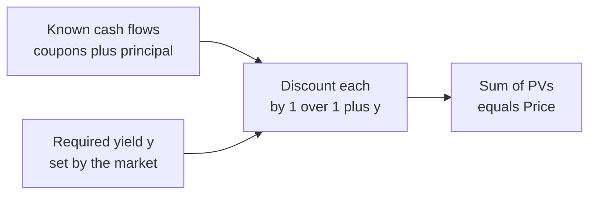
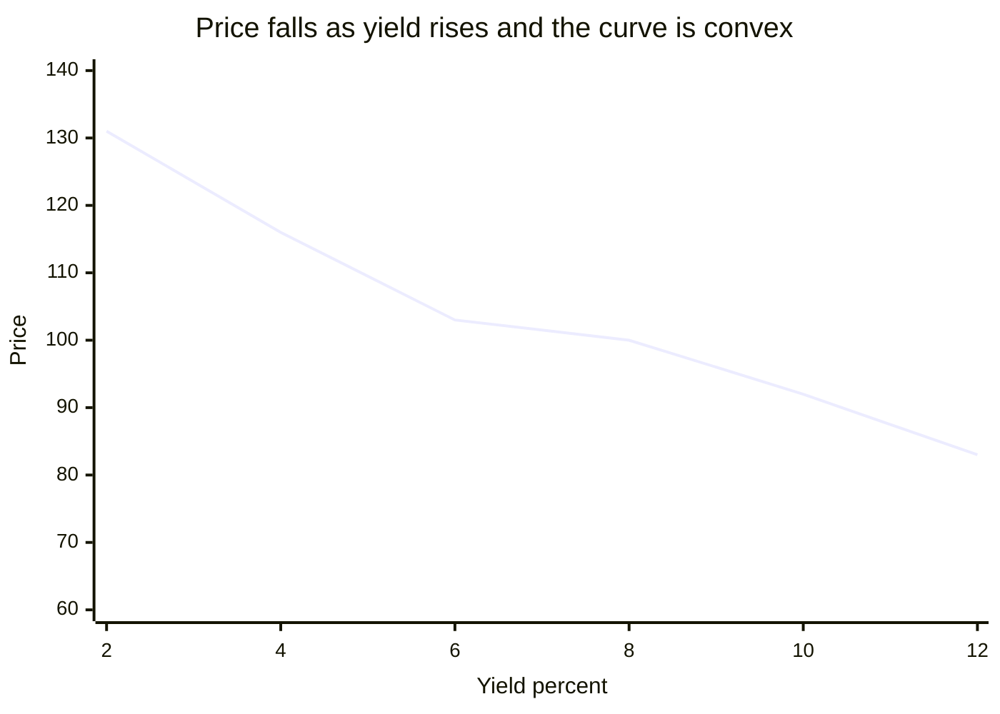
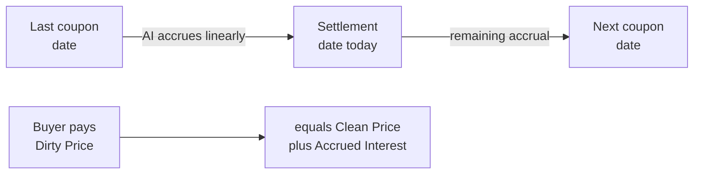

# Chapter 03 — Bond Pricing

## 1. The Problem / Need

A bond is a promise: "I will pay you fixed amounts on fixed dates in the future." A 10-year Government of India bond might promise ₹6.50 every six months for ten years, plus ₹100 back at the end. That stream of promises is objective and known. What is *not* known — and what the entire market spends its energy discovering — is **what that promise is worth today.**

This is the central problem of fixed income. If someone offers to sell you a bond promising ₹106.50 at maturity plus twenty coupons along the way, how many rupees should leave your pocket today? Pay too much and you lock in a poor return; pay too little and you have found a bargain the market will quickly erase. Every trader, portfolio manager, treasurer, and risk officer needs a defensible, repeatable answer to *"what is this cash-flow stream worth right now?"*

The need is sharpened by three facts:

- **Money has a time value.** A rupee received in five years is worth less than a rupee today, because today's rupee can be invested and grown. Any honest valuation must translate future rupees into today's rupees.
- **Bonds trade continuously.** A ten-year bond issued today will be bought and sold on thousands of days over its life, at prices that change every second as interest rates move. There must be a single, internally consistent engine that spits out a price given current market conditions.
- **Comparability.** An investor choosing between a 3-year corporate bond, a 7-year sovereign, and a 15-year infrastructure bond needs prices expressed on a common footing so that "cheap" and "expensive" mean something.

Bond pricing is the discipline that answers all three at once. It is nothing more — and nothing less — than the **present value of a known cash-flow stream**, discounted at a rate that reflects the return the market currently demands.

## 2. The Core Idea

> **A bond's price is the present value (PV) of every cash flow it will pay, discounted back to today at the yield the market requires for bonds of that risk and maturity.**

Two objects meet in that sentence:

1. **The cash flows** — fixed, contractual, known in advance for a plain vanilla bond: a stream of coupons plus a final principal (face/par) repayment.
2. **The discount rate (the yield)** — a market-determined number that compresses future rupees into present rupees. It embodies the risk-free time value of money *plus* compensation for credit, liquidity, and other risks.

Price and yield are two sides of one coin. **Given the yield, you compute the price. Given the price, you can back out the yield (the YTM).** They move together in a rigid, inverse embrace: when the required yield rises, the same fixed cash flows are discounted harder, so the price falls; when the required yield falls, the price rises. This inverse price–yield relationship is the single most important reflex in all of fixed income.

Everything else in this chapter — premium versus discount bonds, clean versus dirty price, accrued interest — is a consequence of applying this one idea carefully.


*Figure 3.1 — The pricing engine: cash flows and a required yield go in, a price comes out.*

## 3. Why / How It Works

### The engine is discounting

The mechanism underneath bond pricing is the **discount factor**. If the market requires a return of `y` per period, then one rupee promised one period from now is worth only `1 / (1 + y)` today, because that smaller amount, grown at `y`, would become exactly ₹1 in one period. Two periods out, you divide by `(1 + y)` twice: `1 / (1 + y)²`. In general, a rupee `t` periods away is worth `1 / (1 + y)ᵗ` today.

A bond is just a bundle of such rupees, arriving at different dates. Discount each to today and add them up. Because discounting is a linear operation, the value of the bundle equals the sum of the values of the pieces — this is why we can price each coupon separately and then total them.

### Why the inverse relationship is mechanical, not psychological

People sometimes narrate the price–yield inverse relationship as sentiment ("rates up, bonds sad"). It is not sentiment; it is arithmetic. The coupons and principal in the numerator are **fixed**. The yield sits in the **denominator**. Raise the denominator and every term shrinks; the sum — the price — must fall. Lower the denominator and every term grows; the price must rise. There is no way around it as long as the cash flows are fixed. This is the deep reason a bondholder is hurt by rising rates even though they will still receive every promised rupee: the *present value* of those unchanged rupees has dropped.

### Why the discount rate is the *yield*, not something else

For a single bond quoted in the market, we use one internally consistent rate — the **yield to maturity (YTM)** — to discount *all* its cash flows. This is a simplification (in reality each cash-flow date has its own spot rate along the yield curve, covered in a later chapter), but it is the market convention and it makes price and yield a clean one-to-one pair. The YTM is precisely the single rate that makes the PV of the cash flows equal the observed market price. It is the bond's internal rate of return if held to maturity and all coupons are reinvested at that same rate.

### Why coupon rate and yield are different animals

A frequent source of confusion: the **coupon rate** is fixed at issue and printed on the bond — it determines the rupees paid. The **yield** floats with the market and determines how those rupees are valued. A bond paying an 8% coupon does not "yield 8%" unless it happens to trade at par. When the market's required yield differs from the coupon rate, the price adjusts away from par to reconcile the two — producing premium and discount bonds, which we derive in Section 4.

## 4. Full Content — Formulas and Bond Math

### 4.1 The general pricing formula

Let:

| Symbol | Meaning |
|---|---|
| `P` | Price of the bond today (present value) |
| `C` | Coupon payment per period (in currency) |
| `F` | Face / par value (redeemed at maturity) |
| `y` | Required yield **per period** (decimal) |
| `n` | Total number of periods to maturity |

The price is the PV of the coupon stream plus the PV of the principal:

```
P = C/(1+y)^1 + C/(1+y)^2 + ... + C/(1+y)^n + F/(1+y)^n
```

The coupons form a geometric series (an annuity). Summed in closed form:

```
P = C × [ 1 − (1 + y)^(−n) ] / y   +   F / (1 + y)^n
     └──────── PV of coupons ───────┘   └ PV of principal ┘
```

The bracketed term `[1 − (1+y)^(−n)] / y` is the **annuity factor** — the present value of ₹1 received each period for `n` periods. The term `(1+y)^(−n)` is the **discount factor** for the lump-sum principal.

### 4.2 Semi-annual compounding (the real-world convention)

Most bonds (US Treasuries, Indian G-Secs, most corporates) pay coupons **twice a year**. The formula is unchanged in shape, but every input is put on a per-period (half-year) basis:

| Annual quantity | Per-period version |
|---|---|
| Annual coupon rate `c` | Coupon per period `C = c × F / 2` |
| Annual yield `Y` (nominal, semi-annual comp.) | Per-period yield `y = Y / 2` |
| Years to maturity `T` | Number of periods `n = 2 × T` |

So a 6% annual-coupon-rate bond on ₹100 face pays `C = ₹3` every six months, and an 8% quoted yield means `y = 4%` per half-year. **Getting this halving right is where most beginner errors occur.**

### 4.3 The inverse price–yield relationship, made precise

Hold the cash flows fixed and vary `y`. Because every term `C/(1+y)ᵗ` and `F/(1+y)ⁿ` is a decreasing function of `y`, the price `P(y)` is a strictly decreasing function of `y`. Moreover it is **convex** — it curves. As `y → 0`, the price approaches the undiscounted sum of all cash flows (`n·C + F`). As `y → ∞`, the price approaches zero. The curve is downward-sloping and bowed toward the origin.


*Figure 3.2 — The price–yield curve slopes downward and is convex (bowed). Par (100) is reached exactly where yield equals the coupon rate.*

### 4.4 Premium, par, and discount — the three regimes

Compare the **coupon rate** (what the bond pays, as a % of face) with the **required yield** (what the market demands). Three cases fall directly out of the pricing formula:

| Regime | Condition | Price vs Face | Intuition |
|---|---|---|---|
| **Premium** | Coupon rate > Yield | `P > F` (above par) | Bond overpays vs market; buyers bid it up above 100 |
| **Par** | Coupon rate = Yield | `P = F` (equals par) | Coupons exactly compensate; no adjustment needed |
| **Discount** | Coupon rate < Yield | `P < F` (below par) | Bond underpays vs market; price sinks below 100 to compensate |

**Why this must be true:** if a bond pays an 8% coupon but the market only demands 6%, the coupon stream is "too generous." Buyers compete for that generosity, bidding the price above 100 until the *effective* return on the higher purchase price falls to the market's 6%. The premium paid above par is exactly the PV of the excess coupons. Symmetrically, a bond paying 5% when the market demands 8% is stingy; nobody pays 100 for it. Its price falls below par until the combination of below-market coupons *plus a capital gain* (buying at, say, 88 and redeeming at 100) delivers the required 8%.

A useful identity: at par, the bond's YTM, coupon rate, and current yield all coincide. Away from par they diverge, and the direction of divergence tells you the regime.

### 4.5 Clean price, dirty price, and accrued interest

So far we priced bonds **on a coupon date**, when the next coupon is exactly one full period away. But bonds trade every business day, often *between* coupon dates. On such a day the buyer is stepping into a coupon that has been "building up" since the last payment. Two conventions manage this.

- **Dirty price** (a.k.a. *invoice price* or *full price*): the actual PV of remaining cash flows as of the settlement date — the true economic value, and the amount that actually changes hands.
- **Accrued interest (AI):** the portion of the current coupon period's interest that has economically accrued to the seller since the last coupon date. The buyer will receive the *whole* next coupon, so they must reimburse the seller for the slice the seller earned by holding the bond up to settlement.
- **Clean price** (a.k.a. *quoted price* or *flat price*): dirty price minus accrued interest. This is the number quoted on screens, precisely *because* it strips out the mechanical sawtooth of accrual and moves smoothly with yields.

The relationship:

```
Dirty Price = Clean Price + Accrued Interest
```

Accrued interest is computed by a **day-count convention** — the fraction of the coupon period that has elapsed:

```
Accrued Interest = Coupon per period × (days since last coupon / days in coupon period)
```

Common day-count conventions:

| Convention | Used for | Fraction |
|---|---|---|
| Actual/Actual (ICMA) | Government bonds (US Treasuries, Indian G-Secs) | actual days / actual days in period |
| 30/360 | US corporates, many bonds | assume 30-day months, 360-day year |
| Actual/360 | Money markets | actual days / 360 |

Between coupon dates the **dirty price** rises smoothly as the next coupon approaches, then drops by the coupon amount on the ex-coupon date (the sawtooth). The **clean price** removes exactly that sawtooth, leaving a series that reflects only yield movements.


*Figure 3.3 — Accrued interest accumulates from the last coupon to settlement; the buyer pays the dirty price and later collects the full next coupon.*

## 5. Worked Examples

### Example 1 — Pricing a par-adjacent bond three ways (annual coupons)

**Setup.** A bond with face value ₹1,000 pays an **annual** coupon of 8% (so `C = ₹80`), matures in **5 years** (`n = 5`). Price it at three required yields: 8%, 6%, and 10%. Face redeemed at maturity.

**Formula.** `P = C × [1 − (1+y)^(−n)] / y + F × (1+y)^(−n)`

**Case A — yield = 8% (equals coupon → expect par).**

- `(1.08)^(−5) = 1 / 1.469328 = 0.680583`
- Annuity factor `= (1 − 0.680583) / 0.08 = 0.319417 / 0.08 = 3.992710`
- PV of coupons `= 80 × 3.992710 = 319.417`
- PV of principal `= 1000 × 0.680583 = 680.583`
- **Price `= 319.417 + 680.583 = ₹1,000.00`** ✓ Exactly par, as predicted (coupon rate = yield).

**Case B — yield = 6% (coupon > yield → expect premium).**

- `(1.06)^(−5) = 1 / 1.338226 = 0.747258`
- Annuity factor `= (1 − 0.747258) / 0.06 = 0.252742 / 0.06 = 4.212364`
- PV of coupons `= 80 × 4.212364 = 336.989`
- PV of principal `= 1000 × 0.747258 = 747.258`
- **Price `= 336.989 + 747.258 = ₹1,084.25`** → above par. ✓ Premium, as predicted.

*Reconciliation:* the premium of ₹84.25 should equal the PV of the "excess" coupon (₹80 paid vs ₹60 the market demands on face = ₹20/year extra) over 5 years: `20 × 4.212364 = ₹84.25`. Matches exactly. ✓

**Case C — yield = 10% (coupon < yield → expect discount).**

- `(1.10)^(−5) = 1 / 1.610510 = 0.620921`
- Annuity factor `= (1 − 0.620921) / 0.10 = 0.379079 / 0.10 = 3.790787`
- PV of coupons `= 80 × 3.790787 = 303.263`
- PV of principal `= 1000 × 0.620921 = 620.921`
- **Price `= 303.263 + 620.921 = ₹924.18`** → below par. ✓ Discount, as predicted.

*Reconciliation:* the discount of ₹75.82 should equal the PV of the coupon shortfall (₹80 vs ₹100 demanded = ₹20/year short): `20 × 3.790787 = ₹75.82`. Matches. ✓

**Summary table** — same bond, three yields:

| Required yield | Price | Regime | Price − Face |
|---|---|---|---|
| 6% | ₹1,084.25 | Premium | +84.25 |
| 8% | ₹1,000.00 | Par | 0 |
| 10% | ₹924.18 | Discount | −75.82 |

Notice the inverse relationship in action (yield up → price down) and its **convexity**: dropping the yield 2 points (8→6) *added* ₹84.25, but raising it 2 points (8→10) only *subtracted* ₹75.82. The price gain from a rate fall exceeds the price loss from an equal rate rise — the curve is bowed, exactly as Figure 3.2 shows.

### Example 2 — Semi-annual bond, getting the halving right

**Setup.** Face ₹1,000, **annual coupon rate 6%** paid **semi-annually**, **4 years** to maturity, quoted **annual yield 5%** (semi-annual compounding).

**Convert to per-period inputs.**

- Coupon per period `C = 6% × 1000 / 2 = ₹30`
- Per-period yield `y = 5% / 2 = 0.025`
- Number of periods `n = 4 × 2 = 8`

**Compute.**

- `(1.025)^(−8)`: `1.025^8 = 1.218403`, so `(1.025)^(−8) = 0.820747`
- Annuity factor `= (1 − 0.820747) / 0.025 = 0.179253 / 0.025 = 7.170137`
- PV of coupons `= 30 × 7.170137 = 215.104`
- PV of principal `= 1000 × 0.820747 = 820.747`
- **Price `= 215.104 + 820.747 = ₹1,035.85`**

**Reconcile with the regime test.** Coupon rate (6%) > yield (5%), so we expect a **premium** — and indeed ₹1,035.85 > ₹1,000. ✓ Consistent.

*Common-error check:* had we (wrongly) discounted 8 periods at the full 5% instead of 2.5%, or used ₹60 coupons instead of ₹30, the price would be nonsense. The discipline is: **coupon halved, yield halved, periods doubled.**

### Example 3 — Clean price, accrued interest, and dirty price

**Setup.** A ₹1,000 face bond, **8% annual coupon paid semi-annually** (so `₹40` every six months). Coupon dates are 1 January and 1 July. Today is **settlement on 1 March**. The market quotes a **clean price of ₹980.00**. Day-count is 30/360. Find the accrued interest and the dirty price (what the buyer actually pays).

**Step 1 — Days elapsed in the current coupon period (30/360).**
From 1 Jan to 1 March under 30/360: January = 30 days, February = 30 days → **60 days elapsed**. Full coupon period (1 Jan to 1 Jul) = 180 days.

**Step 2 — Accrued interest.**

```
AI = Coupon per period × (days elapsed / days in period)
   = 40 × (60 / 180)
   = 40 × 0.33333
   = ₹13.33
```

**Step 3 — Dirty price.**

```
Dirty = Clean + Accrued = 980.00 + 13.33 = ₹993.33
```

**Interpretation.** The buyer pays **₹993.33** on 1 March. On 1 July they will collect the **entire ₹40 coupon**, even though they held the bond for only four of the six months. The ₹13.33 they paid up front reimburses the seller for the two months (Jan–Feb) the seller held it. Net, the buyer's own coupon earnings equal ₹40 − ₹13.33 = ₹26.67, matching the four months (Mar–Jun) they actually own the bond: `40 × 120/180 = ₹26.67`. ✓ The accrual mechanism splits the coupon fairly between seller and buyer.

*Why quote the clean price?* If instead the screen quoted the dirty ₹993.33, the number would jump down by ₹40 every 1 July and 1 January purely from the coupon dropping off — a mechanical sawtooth that has nothing to do with the bond becoming cheaper or richer. Quoting the clean ₹980.00 strips that out, so the quoted price moves only when *yields* move. That is exactly what a trader wants to watch.

### Example 4 — Backing out the yield (YTM) from a price

**Setup.** The ₹1,000 face, 8% annual-coupon, 5-year bond of Example 1 is trading at **₹924.18**. What is its YTM? (We will confirm it is 10%.)

YTM is the `y` solving `924.18 = 80 × [1 − (1+y)^(−5)]/y + 1000 × (1+y)^(−5)`. There is no closed-form solution; we iterate.

- **Try y = 10%:** from Example 1 Case C, price = ₹924.18. Match. **YTM = 10%.** ✓

To show the search logic had we not known:

| Trial yield | Resulting price | vs target 924.18 |
|---|---|---|
| 8% | 1,000.00 | too high → raise yield |
| 12% | 855.81 | too low → lower yield |
| 10% | 924.18 | exact ✓ |

The price sits between the 8% and 12% prices, so the yield sits between 8% and 12% — and lands at 10%. This is the **inverse relationship used as a solver**: because price falls monotonically in yield, we can bracket the true yield and converge on it. YTM and price are one-to-one.

## 6. Connections

- **Time value of money (Chapter on TVM):** bond pricing is simply PV-of-an-annuity plus PV-of-a-lump-sum, the two workhorses of TVM applied to a contractual cash-flow stream. If you understand annuity factors, you already understand 80% of bond pricing.
- **Yield to maturity (next chapter):** YTM is defined *by* the pricing equation — it is the discount rate that makes PV equal the market price. Pricing (price from yield) and YTM (yield from price) are inverse operations on the same formula.
- **Duration and convexity (later chapters):** the *slope* of the price–yield curve is (modified) duration; its *curvature* is convexity. Both are derivatives of the pricing function `P(y)` derived here. The convexity we saw numerically in Example 1 (gains > losses for symmetric yield moves) is formalised there.
- **The yield curve / term structure:** using a single YTM to discount all cash flows is a convention; the rigorous approach discounts each cash flow at its own **spot rate** off the zero-coupon curve. Bond pricing is the bridge to that richer model.
- **Credit spreads:** the required yield `y` decomposes into a risk-free base rate plus a spread for credit and liquidity. Pricing is where the spread mechanically bites into value.
- **Accounting (amortised cost, EIR):** the "effective interest rate" method used to amortise bond premium/discount over a bond's life is the accounting mirror of the YTM derived here — the same discount rate spread across reporting periods.

## 7. Key Terms

| Term | Definition |
|---|---|
| **Face / Par value (F)** | The principal repaid at maturity; the reference for coupon and price quotes (often 100 or 1,000). |
| **Coupon rate (c)** | The fixed annual interest rate printed on the bond; sets the rupee coupon `C`. Does not change with the market. |
| **Coupon (C)** | The periodic cash interest payment = coupon rate × face ÷ payments per year. |
| **Yield / Required yield (y)** | The market's demanded rate of return per period; the discount rate in the pricing formula. |
| **Yield to maturity (YTM)** | The single discount rate that equates PV of all cash flows to the market price; the bond's IRR if held to maturity. |
| **Present value (PV)** | Today's worth of a future cash flow, obtained by discounting. |
| **Discount factor** | `1/(1+y)ᵗ`, the PV today of ₹1 received `t` periods hence. |
| **Annuity factor** | `[1 − (1+y)⁻ⁿ]/y`, the PV of ₹1 per period for `n` periods. |
| **Premium bond** | Trades above par because coupon rate > yield. |
| **Discount bond** | Trades below par because coupon rate < yield. |
| **Par bond** | Trades at face value because coupon rate = yield. |
| **Clean (quoted/flat) price** | Price excluding accrued interest; the quoted number. |
| **Dirty (invoice/full) price** | Price including accrued interest; the amount actually paid. |
| **Accrued interest (AI)** | The share of the current coupon earned by the seller from last coupon to settlement. |
| **Day-count convention** | The rule (Actual/Actual, 30/360, Actual/360) for the fraction of a coupon period elapsed. |
| **Current yield** | Annual coupon ÷ current price; a crude income measure that ignores capital gain/loss to maturity. |

## 8. Common Confusions

**"Coupon rate is the return I earn."** No. The coupon rate sets the *rupees paid*; your *return* is the YTM, which depends on the *price you pay*. Buy an 8% bond at 92 and your return exceeds 8% (the discount adds a capital gain); buy it at 108 and your return is below 8%. They coincide only at par.

**"Rates rose but I still get every coupon, so why did I lose money?"** You still receive every promised rupee, but the *present value* of those unchanged rupees fell when the discount rate rose. If you must sell today, you crystallise that mark-to-market loss. Hold to maturity and you get par back, but you've suffered opportunity cost versus newly-issued higher-coupon bonds.

**"Premium bonds are better than discount bonds."** Neither is inherently better. A premium bond pays fat coupons but you'll book a capital *loss* pulling from the premium price back to par at maturity; a discount bond pays skinny coupons but delivers a capital *gain* pulling up to par. Priced correctly, both yield exactly the market YTM. The premium/discount is just *where* the return is packaged (coupon vs capital).

**"Dirty price is a bad or manipulated price."** No — "dirty" is not pejorative. The dirty (full) price is the true economic value and the actual settlement amount. "Clean" just means accrued interest has been stripped out for quoting convenience so the number isn't polluted by the coupon sawtooth.

**Forgetting to halve for semi-annual bonds.** The number-one arithmetic error: you must halve the coupon, halve the annual yield, and double the number of periods. Discounting eight semi-annual periods at a full annual rate is wrong.

**Confusing current yield with YTM.** Current yield = coupon/price ignores the pull-to-par capital gain or loss and the time value of intermediate coupons. It always sits *between* the coupon rate and the YTM and should never be used as the bond's true return.

**"Higher yield always means a better investment."** A higher yield often signals higher risk (credit, liquidity) — the market discounts harder precisely because the cash flows are less certain. Yield is compensation for risk, not a free lunch.

## 9. Recap

- A bond's price is the **present value of its cash flows** — coupons (an annuity) plus principal (a lump sum) — discounted at the market's **required yield**.
- Closed form: `P = C·[1 − (1+y)⁻ⁿ]/y + F·(1+y)⁻ⁿ`. For semi-annual bonds, **halve the coupon and yield, double the periods**.
- **Price and yield move inversely**, and the relationship is **convex**: symmetric yield moves produce asymmetric price changes (gains from a fall exceed losses from an equal rise). This is arithmetic — the yield sits in the denominator over fixed cash flows.
- Compare coupon rate to yield to get the regime: **coupon > yield → premium (P>F); coupon = yield → par (P=F); coupon < yield → discount (P<F).** The premium or discount equals the PV of the coupon surplus or shortfall.
- Between coupon dates, **Dirty = Clean + Accrued Interest.** The buyer pays the dirty price and collects the full next coupon; accrued interest fairly splits that coupon between seller and buyer via a day-count convention.
- **YTM** is the inverse operation: the single discount rate that makes PV equal the observed price — found by iteration because the pricing equation has no closed-form inverse.

## 10. Quick-Reference / Interview Points

**The one-line answer:** *"A bond is priced as the present value of its coupons and principal, discounted at the yield the market requires; price and yield are inversely related because the fixed cash flows are discounted harder when the yield rises."*

**Core formula (memorise):**
```
P = C × [1 − (1+y)^(−n)] / y   +   F × (1+y)^(−n)
```

**The regime test (say it instantly):**

| If... | Then price is... |
|---|---|
| Coupon rate > Yield | Premium (above par) |
| Coupon rate = Yield | Par |
| Coupon rate < Yield | Discount (below par) |

**Clean vs dirty:** `Dirty = Clean + Accrued Interest`. Clean is quoted; dirty is paid. Accrued = coupon × (days elapsed / days in period).

**Rapid-fire facts interviewers probe:**
- Why does a bond lose value when rates rise even though coupons are unchanged? *PV of fixed cash flows falls when the discount rate rises.*
- Is the price–yield line straight? *No — convex; gains from a rate drop exceed losses from an equal rate rise.*
- For a semi-annual bond, what do you do to the inputs? *Halve coupon, halve yield, double periods.*
- Where does a discount bond's return come from? *Below-market coupons plus a capital gain (pull to par).*
- Does current yield equal YTM? *Only at par; otherwise current yield lies between coupon rate and YTM.*
- What is YTM, formally? *The single discount rate equating PV of cash flows to market price — the bond's IRR to maturity, assuming coupons reinvest at that rate.*

**Sanity checks to state aloud when pricing:**
1. Does the premium/discount agree with the coupon-vs-yield comparison?
2. Did I put coupon, yield, and periods on the same (per-period) footing?
3. Does the premium/discount magnitude equal the PV of the coupon surplus/shortfall?
4. As `y → 0`, does my price approach the undiscounted sum of cash flows? As `y → ∞`, toward zero?

**Numbers worth remembering** (₹1,000 face, 8% coupon, 5-yr, annual): at 6% → ₹1,084.25 (premium), at 8% → ₹1,000 (par), at 10% → ₹924.18 (discount). These illustrate inverse-and-convex in a single line.
