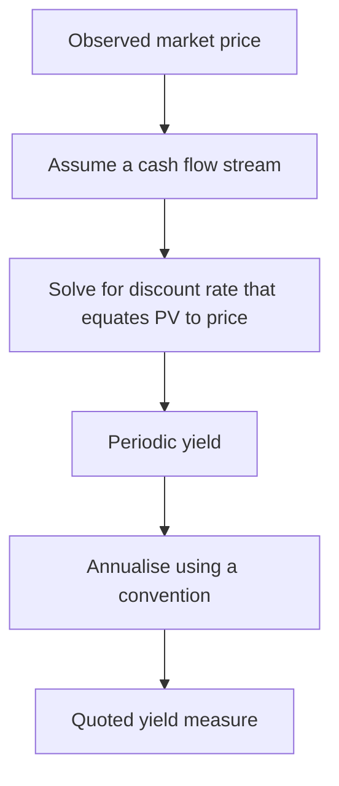
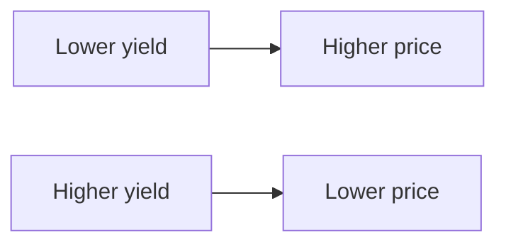
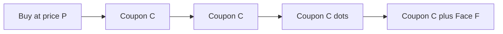
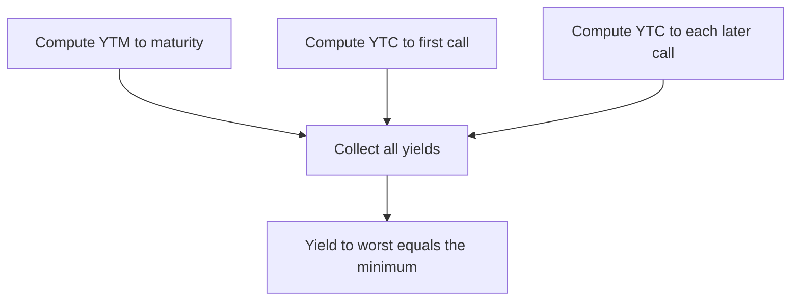

# Chapter 04 — Yield Measures

## 1. The Problem / Need

You are handed two bonds. Bond A costs \$960 and pays an 8% coupon. Bond B costs \$1,050 and pays a 7% coupon, but it can be called away in three years. Which one earns you more? The coupon rate alone cannot answer this — it is fixed to face value and ignores what you actually *paid*. The price you observe in the market already bakes in interest-rate levels, credit risk, and time to maturity. What an investor truly needs is a single number that compresses **price, coupons, timing, and redemption value** into one comparable rate of return.

That number is a **yield**. But "yield" is not one thing — it is a family of measures, each answering a slightly different question and each resting on different assumptions. Quoting the wrong one, or forgetting the assumptions baked into it, is one of the most common and most punishing errors in fixed income. A trader who compares a discount bond's yield-to-maturity against a callable premium bond's yield-to-maturity — instead of its yield-to-call — is systematically overstating return on the callable name.

This chapter builds the yield toolkit from the ground up: what each measure means, how to compute it, when it lies to you, and how the promised yield differs from the yield you actually realise once reinvestment enters the picture.

## 2. Core Idea

A bond's price is the present value of its cash flows discounted at some rate. **A yield is the discount rate implied by the market price.** Flip the pricing equation around: instead of choosing a discount rate to find price, take the observed price as given and *solve for* the discount rate. That solved rate is the internal rate of return (IRR) of the bond's cash-flow stream.

Every yield measure is a variation on this theme, differing in three choices:

1. **Which cash flows** do we count? (Just this period's coupon? All coupons to maturity? All coupons to the call date?)
2. **What redemption value** at the end? (Par at maturity? Call price? Sale price at a horizon?)
3. **What compounding / annualisation convention** turns a periodic rate into a quoted annual rate?

Get those three choices straight and every yield measure — current yield, YTM, yield-to-call, yield-to-worst, bond-equivalent yield, realised yield — falls out of the same master equation.

*Figure 1 — Every yield measure is the same inversion of the pricing equation, differing only in the cash-flow stream assumed and the annualisation convention applied.*

## 3. Why / How It Works

### Price and yield move inversely

The bond price is a decreasing function of its discount rate. Raise the yield, and every future cash flow is discounted harder, so the present value (price) falls. Lower the yield, price rises. This inverse relationship is the spine of fixed income.

*Figure 2 — The fundamental inverse relationship between a bond's yield and its price.*

The curve is not a straight line — it is **convex** (bowed toward the origin). Price falls at a decreasing rate as yield rises. That convexity matters later for duration and for why linear interpolation of YTM slightly overstates the true yield.

### Why yield is an IRR, not a simple ratio

A coupon received in six months is worth more than the same coupon in five years. Any honest return measure must discount those cash flows for timing. Solving for the single rate that makes discounted inflows equal the price is exactly an IRR computation — and like all IRRs, it carries an embedded **reinvestment assumption**: it presumes every intermediate coupon is reinvested at that same solved rate until maturity. This is not a footnote. It is the reason the yield you are *quoted* is rarely the yield you *realise*.

### The par / premium / discount logic

Compare the coupon rate (a fixed cash amount relative to face) against the yield the market demands:

- If the market yield **equals** the coupon rate, the bond prices at **par** — no adjustment needed.
- If the market demands **more** than the coupon pays, buyers will only take the bond at a **discount** (below par), so that the price appreciation to par at maturity tops up the shortfall.
- If the market demands **less** than the coupon pays, the bond commands a **premium** (above par), and the price erosion toward par offsets the generous coupon.

This produces a strict ordering of the three yield measures that is worth memorising cold, because it is a favourite interview check.

## 4. Full Content — the Yield Measures

### 4.1 Current yield

The crudest measure. Annual coupon income divided by current price:

$$\text{Current Yield} = \frac{\text{Annual coupon in currency}}{\text{Current price}}$$

It captures income return only. It **ignores** the capital gain or loss from buying at a discount/premium and pulling to par, ignores the timing/compounding of coupons, and ignores any reinvestment. Useful as a quick income proxy for a buy-and-hold income investor; useless as a total-return comparator.

### 4.2 Yield to maturity (YTM)

The IRR of the full cash-flow stream, assuming the bond is held to maturity and redeemed at par. For a bond paying coupons $C$ per period over $n$ periods, redeeming face $F$, at price $P$, YTM is the periodic rate $y$ solving:

$$P = \sum_{t=1}^{n} \frac{C}{(1+y)^t} + \frac{F}{(1+y)^n}$$

Using the annuity closed form:

$$P = C \cdot \frac{1 - (1+y)^{-n}}{y} + F \cdot (1+y)^{-n}$$

There is no algebraic solution for $y$ when $n > 1$ — it must be found by trial-and-error, interpolation, or a solver. Once you have the periodic $y$, you annualise it (see BEY below).

The cash-flow stream that YTM discounts looks like this for a five-year semiannual bond — ten equal coupons plus a face repayment bunched onto the final date:

*Figure 3 — The cash-flow timeline YTM discounts. The final node carries both the last coupon and the face redemption, which is why long-dated principal dominates the present value.*

**Three assumptions baked into YTM:**

1. The bond is **held to maturity**.
2. There is **no default** — all coupons and principal are paid in full and on time.
3. All coupons are **reinvested at the YTM** itself until maturity.

Break any of these and your realised return diverges from the quoted YTM.

### 4.3 Yield to call (YTC)

Identical math, but the cash-flow stream is truncated at the **call date** and the terminal value is the **call price** $C_{call}$ (often par or a small premium), not maturity par. For a bond callable after $m$ periods:

$$P = C \cdot \frac{1 - (1+y_c)^{-m}}{y_c} + C_{call} \cdot (1+y_c)^{-m}$$

You compute a separate YTC for each call date in the call schedule.

### 4.4 Yield to worst (YTW)

The **minimum** across YTM and every YTC (and yield-to-put where relevant). It answers: "assuming the issuer exercises its options in the way least favourable to me, what is the lowest yield I could end up with?" It is the conservative number quoted on callable bonds.

*Figure 4 — Yield to worst is simply the lowest of the maturity and all call scenario yields.*

### 4.5 Bond-equivalent yield (BEY) and compounding conventions

A US bond paying semiannual coupons has a *semiannual* periodic yield. The market convention is to quote it as **twice** the semiannual rate — this doubled figure is the **bond-equivalent yield**:

$$\text{BEY} = 2 \times y_{\text{semiannual}}$$

Note this is a *simple* doubling, not a compounding — so the BEY understates the true **effective annual yield (EAY)**:

$$\text{EAY} = (1 + y_{\text{semiannual}})^2 - 1$$

To compare a semiannual-pay bond against an annual-pay bond you must put them on the same footing. Convert an annual-pay (effective) yield into a bond-equivalent basis:

$$\text{BEY} = 2 \left[ (1 + \text{EAY})^{1/2} - 1 \right]$$

BEY also names a **money-market** convention: for discount instruments (T-bills, commercial paper) it restates a short-horizon holding return on a 365-day, add-on basis so it can be compared to coupon bonds:

$$\text{BEY}_{\text{money market}} = \frac{F - P}{P} \times \frac{365}{t}$$

where $t$ is days to maturity.

### 4.6 Realised (horizon) yield

The yield you *actually* earn depends on (a) the price at which you sell or redeem and (b) the rate at which coupons were reinvested. The **realised (horizon) yield** is the periodic rate that grows your purchase price into the **total terminal value** — reinvested coupons plus the ending bond value — over the holding period $h$:

$$\text{Terminal value} = \underbrace{\sum_{t=1}^{h} C \,(1+r)^{h-t}}_{\text{reinvested coupons}} + \text{Ending value}$$

$$\text{Realised yield (periodic)} = \left( \frac{\text{Terminal value}}{P} \right)^{1/h} - 1$$

where $r$ is the assumed reinvestment rate. When $h$ = full maturity, the ending value is par; for a shorter horizon it is the bond's market price at that horizon (which depends on the yield curve then).

**Reinvestment risk vs price risk.** These pull in opposite directions:

- If rates **fall** after purchase, coupons reinvest at lower rates (realised yield drops) but the bond's sale price rises.
- If rates **rise**, coupons reinvest at higher rates (realised yield climbs) but the bond's sale price falls.

At one special horizon — roughly the bond's **duration** — these two effects offset, and the realised yield is immunised against small rate changes.

## 5. Worked Examples

### Example 1 — Current yield, YTM, and the discount-bond ordering

**Bond A:** face \$1,000, 8% coupon paid semiannually (\$40 every six months), 5 years to maturity (10 periods), market price **\$960.44**.

**Current yield:**

$$\text{CY} = \frac{80}{960.44} = 8.33\%$$

**YTM.** Since the bond trades at a discount, we expect YTM > coupon rate (8%). Solve for the semiannual $y$ in:

$$960.44 = 40 \cdot \frac{1 - (1+y)^{-10}}{y} + 1000 \,(1+y)^{-10}$$

Try $y = 4.5\%$:

- $(1.045)^{10} = 1.553069$, so $(1.045)^{-10} = 0.643928$
- Annuity factor $= \dfrac{1 - 0.643928}{0.045} = \dfrac{0.356072}{0.045} = 7.912711$
- PV of coupons $= 40 \times 7.912711 = 316.51$
- PV of principal $= 1000 \times 0.643928 = 643.93$
- **Total $= 960.44$** ✓

The semiannual yield is exactly 4.5%, so the **BEY (quoted YTM) = 2 × 4.5% = 9.00%**.

**The discount-bond ordering** now falls out and reconciles:

| Measure | Value |
|---|---|
| Coupon rate | 8.00% |
| Current yield | 8.33% |
| Yield to maturity (BEY) | 9.00% |

For a **discount** bond: coupon rate < current yield < YTM. The current yield sits above the coupon rate because we paid less than par; the YTM sits above the current yield because it *also* captures the \$39.56 pull-to-par capital gain, which the current yield ignores entirely.

(For a **premium** bond the inequalities flip: coupon > current yield > YTM. For a **par** bond all three equal.)

### Example 2 — Solving YTM by interpolation and verifying

Suppose we did not know the answer to Example 1 and had to bracket it. Price the bond at two trial semiannual rates:

At $y = 4\%$ (coupon rate matches yield → price = par):

$$P = 40 \cdot \frac{1 - (1.04)^{-10}}{0.04} + 1000(1.04)^{-10} = 1000.00$$

At $y = 5\%$:

- $(1.05)^{10} = 1.628895$, inverse $= 0.613913$
- Annuity factor $= \dfrac{1 - 0.613913}{0.05} = 7.721735$
- $P = 40(7.721735) + 1000(0.613913) = 308.87 + 613.91 = 922.78$

Linear interpolation for the target price \$960.44:

$$y \approx 4\% + \frac{1000 - 960.44}{1000 - 922.78} \times 1\% = 4\% + \frac{39.56}{77.22} \times 1\% = 4\% + 0.512\% = 4.512\%$$

That gives a BEY of about **9.02%**, versus the true **9.00%**. The interpolation slightly *overstates* the yield because the price–yield curve is convex, not linear: the straight line between two points lies below the true curve, so the interpolated rate for a given price comes out a touch high. Re-checking at the exact 4.5% (as in Example 1) returns \$960.44, confirming the true yield. The lesson: interpolation is a fast approximation; verify by re-pricing.

### Example 3 — Bond-equivalent yield and cross-convention comparison

Using Example 1's semiannual yield of 4.5%:

- **BEY (simple doubling):** $2 \times 4.5\% = 9.00\%$
- **Effective annual yield:** $(1.045)^2 - 1 = 1.092025 - 1 = 9.2025\%$

So the 9.00% quote *understates* the true annually-compounded return by about 20 bps — a pure artefact of the doubling convention.

Now suppose a competing **annual-pay** bond quotes a yield of 9.20% (an effective annual figure). To compare it fairly against our semiannual bond's 9.00% BEY, convert it to a bond-equivalent basis:

$$\text{BEY} = 2\left[(1.092)^{1/2} - 1\right] = 2\left[1.044988 - 1\right] = 2(0.044988) = 8.998\% \approx 9.00\%$$

On a like-for-like BEY basis the two bonds are essentially **identical** (9.00% vs 9.00%) — even though the naive comparison of "9.00% vs 9.20%" made the annual-pay bond look better. This is exactly the trap the convention exists to prevent.

**Money-market BEY.** A 90-day T-bill is priced at \$98.50 per \$100 face:

$$\text{Holding return} = \frac{100 - 98.50}{98.50} = 1.5228\%$$

$$\text{BEY} = 1.5228\% \times \frac{365}{90} = 6.18\%$$

This add-on 365-day figure can now be compared against a coupon bond's yield.

### Example 4 — Realised (horizon) yield and the reinvestment assumption

Take Bond A again (bought at \$960.44, ten \$40 semiannual coupons, redeemed at \$1,000). We hold to maturity, so the only open question is the **reinvestment rate** on coupons.

**Case 1 — reinvest at the YTM (4.5% semiannual).** Future value of the reinvested coupon stream:

$$\text{FV}_{\text{coupons}} = 40 \times \frac{(1.045)^{10} - 1}{0.045} = 40 \times \frac{0.553069}{0.045} = 40 \times 12.29042 = 491.62$$

Total terminal value $= 491.62 + 1000 = 1491.62$. Realised semiannual yield:

$$\left(\frac{1491.62}{960.44}\right)^{1/10} - 1 = (1.55307)^{0.1} - 1 = 1.045 - 1 = 4.5\%$$

Realised BEY = **9.00% = the YTM exactly.** This is the proof that YTM's reinvestment assumption is "reinvest at the YTM." When it holds, promised and realised yields coincide.

**Case 2 — reinvest at only 3% semiannual (6% annual, a falling-rate world).**

$$\text{FV}_{\text{coupons}} = 40 \times \frac{(1.03)^{10} - 1}{0.03} = 40 \times \frac{0.343916}{0.03} = 40 \times 11.46387 = 458.55$$

Total terminal value $= 458.55 + 1000 = 1458.55$. Realised semiannual yield:

$$\left(\frac{1458.55}{960.44}\right)^{1/10} - 1 = (1.518635)^{0.1} - 1 = 1.042650 - 1 = 4.265\%$$

Realised BEY = **8.53%** — a full 47 bps *below* the promised 9.00%. Because coupons were reinvested below the YTM, the investor fell short. This is **reinvestment risk** in hard numbers, and it reconciles cleanly with Case 1: the only thing that changed was the reinvestment rate, and the realised yield moved in the same direction.

| Reinvestment rate (annual) | Terminal value | Realised BEY |
|---|---|---|
| 9.0% (= YTM) | \$1,491.62 | 9.00% |
| 6.0% | \$1,458.55 | 8.53% |

**Case 3 — sell before maturity into a higher-rate market.** Now hold Bond A for only **2 years (4 periods)**, then sell. Suppose market yields have *risen* to 10% BEY (5% semiannual) by the sale date. Two things happen at once — coupons reinvested at the higher 5% help us, but the sale price is depressed by the higher discount rate.

*Sale price* (6 periods remain, discount at 5% semiannual):

- $(1.05)^6 = 1.340096$, inverse $= 0.746215$
- Annuity factor $= \dfrac{1 - 0.746215}{0.05} = 5.07570$
- Price $= 40(5.07570) + 1000(0.746215) = 203.03 + 746.22 = 949.24$

*Reinvested coupons* (4 coupons compounded at 5%):

$$\text{FV}_{\text{coupons}} = 40 \times \frac{(1.05)^4 - 1}{0.05} = 40 \times 4.31013 = 172.41$$

*Terminal value* $= 949.24 + 172.41 = 1121.65$. Realised semiannual yield over 4 periods:

$$\left(\frac{1121.65}{960.44}\right)^{1/4} - 1 = (1.16785)^{0.25} - 1 = 1.03955 - 1 = 3.955\%$$

Realised BEY = **7.91%** — well *below* the 9.00% we bought at, even though coupons earned a *higher* reinvestment rate. Over this short two-year horizon the **price risk** (the capital loss from selling at a higher yield) swamped the reinvestment benefit. Flip the horizon out toward the bond's duration and the two effects would roughly cancel; push it all the way to maturity and only reinvestment matters (Cases 1 and 2). This is the reinvestment-risk-versus-price-risk trade-off made numerical.

### Example 5 — Yield to call, yield to worst

**Bond B:** face \$1,000, 8% coupon semiannual (\$40), 5 years (10 periods) to maturity, **callable in 3 years (6 periods) at \$1,020**, trading at a premium of **\$1,050**.

**YTM (to maturity, par \$1,000).** Premium bond → YTM < coupon. Solving (trial at 3.4% semiannual):

- $(1.034)^{10} = 1.397028$, inverse $= 0.715806$
- Annuity factor $= \dfrac{1 - 0.715806}{0.034} = 8.35865$
- $P = 40(8.35865) + 1000(0.715806) = 334.35 + 715.81 = 1050.15 \approx 1050$ ✓

So YTM $\approx 3.40\%$ semiannual $= $ **6.80% BEY**.

**YTC (to first call, 6 periods, call price \$1,020).** Solve for $y_c$ in:

$$1050 = 40 \cdot \frac{1 - (1+y_c)^{-6}}{y_c} + 1020\,(1+y_c)^{-6}$$

Bracket it. At $y_c = 3.4\%$: $(1.034)^6 = 1.222134$, inverse $0.818238$; annuity factor $= (1-0.818238)/0.034 = 5.34594$; price $= 40(5.34594) + 1020(0.818238) = 213.84 + 834.60 = 1048.44$. At $y_c = 3.3\%$: $(1.033)^6 = 1.215039$, inverse $0.823019$; annuity $= 5.36306$; price $= 214.52 + 839.48 = 1054.00$.

Interpolate for \$1,050:

$$y_c \approx 3.3\% + \frac{1054.00 - 1050}{1054.00 - 1048.44} \times 0.1\% = 3.3\% + \frac{4.00}{5.56}(0.1\%) = 3.372\%$$

YTC $\approx 3.37\%$ semiannual $=$ **6.74% BEY**.

**Yield to worst:**

| Scenario | Yield (BEY) |
|---|---|
| Yield to maturity | 6.80% |
| Yield to call (3 yr) | 6.74% |
| **Yield to worst** | **6.74%** |

The YTW is the yield-to-call. This is the classic result for a **premium callable bond trading above its call price**: the issuer has every incentive to call and refinance, and the investor should assume the worse (call) scenario. Quoting the 6.80% YTM here would overstate the realistic return.

## 6. Connections

- **To pricing (Ch. 03):** Yield is the pricing equation solved for its discount rate. You cannot compute a yield without the pricing machinery, and you cannot price a bond without a discount rate. They are two views of one identity.
- **To duration and convexity (Ch. 05):** Duration is the first derivative of price with respect to yield (scaled); convexity is the second. The convex price–yield curve seen in Figure 2 is *why* interpolation overstates YTM and why the "duration horizon" immunises realised yield.
- **To the term structure (Ch. 06):** A single YTM is a blended average of the spot rates applying to each cash flow. Spot (zero-coupon) yields and forward rates decompose what YTM aggregates. The reinvestment assumption embedded in YTM is exactly what forward rates make explicit.
- **To credit and spreads (Ch. 07):** Yield spreads (nominal spread, Z-spread, OAS) are all differences of yields; the OAS in particular strips out the call optionality that yield-to-worst only crudely proxies.
- **To portfolio return:** Realised/horizon yield is the bridge from single-bond math to actual portfolio performance attribution.

## 7. Key Terms

| Term | Meaning |
|---|---|
| **Current yield** | Annual coupon ÷ price; income return only. |
| **Yield to maturity (YTM)** | IRR of all cash flows to maturity, redeemed at par; assumes hold-to-maturity, no default, reinvestment at YTM. |
| **Yield to call (YTC)** | IRR to a call date, redeemed at the call price. |
| **Yield to worst (YTW)** | The minimum of YTM and all YTC / YTP scenarios. |
| **Bond-equivalent yield (BEY)** | A semiannual periodic yield doubled; also a 365-day add-on money-market convention. |
| **Effective annual yield (EAY)** | The true compounded annual yield: $(1+y_{\text{semi}})^2 - 1$. |
| **Realised / horizon yield** | The actual return over a holding period given a specific reinvestment rate and ending value. |
| **Reinvestment risk** | Risk that coupons are reinvested below the YTM, lowering realised return. |
| **Price risk** | Risk that a rate rise lowers the bond's sale price before the horizon. |
| **Pull to par** | The convergence of a discount/premium bond's price toward face value as maturity approaches. |

## 8. Common Confusions

- **"Coupon rate is the return."** No — the coupon rate is fixed to *face*, not to the *price you paid*. Only for a par bond do coupon rate, current yield, and YTM coincide.
- **"Current yield is a total return."** It omits capital gain/loss and the time value of coupons. For a deep-discount bond it can be badly misleading.
- **"YTM is the return I will earn."** Only if you hold to maturity *and* reinvest every coupon at the YTM. Example 4 showed a 47 bp shortfall when reinvestment fell to 6%. YTM is a *promised*, not a *guaranteed*, yield.
- **"BEY equals the effective annual yield."** BEY simply doubles the semiannual rate; EAY compounds it. BEY < EAY whenever the periodic rate is positive (9.00% vs 9.2025% in Example 3).
- **"Higher YTM always means the better bond."** Not on a callable name — compare yield-to-worst. And not across compounding conventions without first putting both on the same basis.
- **"Interpolated YTM is exact."** Convexity makes linear interpolation overstate the yield slightly (9.02% vs 9.00% in Example 2). Always re-price to verify.
- **"For a premium bond the yield-to-worst is the YTM."** Usually the opposite — a premium callable bond's worst case is the *call*, because the issuer will refinance cheap debt (Example 5).

## 9. Recap

A yield inverts the pricing equation: take the market price as given and solve for the discount rate that reproduces it. The measures differ only in the cash flows counted and the annualisation used. **Current yield** captures income only. **YTM** is the IRR to maturity, resting on three assumptions — hold to maturity, no default, reinvest coupons at the YTM. **Yield-to-call** truncates the stream at a call date and redeems at the call price; **yield-to-worst** takes the least favourable of all such scenarios and is the honest quote for callable bonds. The **bond-equivalent yield** doubles a semiannual rate (understating the effective annual yield) and also standardises money-market instruments onto a 365-day add-on basis for comparison. Price and yield move **inversely** along a **convex** curve, which drives the discount/premium yield orderings and the small upward bias of interpolation. Finally, the **realised (horizon) yield** — the return you actually earn — depends on the reinvestment rate and the ending value, exposing you to reinvestment risk and price risk that only offset near the bond's duration.

## 10. Quick-Reference / Interview Points

**Formulas at a glance:**

| Measure | Formula |
|---|---|
| Current yield | Annual coupon ÷ Price |
| YTM (periodic $y$) | $P = C\frac{1-(1+y)^{-n}}{y} + F(1+y)^{-n}$ |
| BEY | $2 \times y_{\text{semiannual}}$ |
| EAY | $(1+y_{\text{semi}})^2 - 1$ |
| Annual-pay yield → BEY | $2[(1+\text{EAY})^{1/2}-1]$ |
| Money-market BEY | $\frac{F-P}{P}\times\frac{365}{t}$ |
| Realised yield | $\left(\frac{\text{Terminal value}}{P}\right)^{1/h}-1$ |

**Yield orderings (memorise):**

- Discount bond: coupon rate < current yield < YTM
- Par bond: coupon rate = current yield = YTM
- Premium bond: coupon rate > current yield > YTM

**Rapid-fire answers:**

- *What three assumptions does YTM make?* Hold to maturity, no default, reinvest coupons at the YTM.
- *Why quote yield-to-worst on a callable?* It is the conservative floor — the lowest yield across maturity and all call scenarios; a premium callable bond's YTW is usually its yield-to-call.
- *Is BEY the same as effective annual yield?* No — BEY doubles (simple), EAY compounds; BEY < EAY.
- *You bought a bond at YTM 6% but rates fell to 4% — did you earn 6%?* No: coupons reinvested at 4% pull realised yield below 6% (reinvestment risk), partly offset by a higher sale price if you sell before maturity.
- *Where do reinvestment risk and price risk offset?* At a horizon near the bond's duration — the basis of immunisation.
- *Why does interpolated YTM slightly overstate the true yield?* Because the price–yield curve is convex, so the linear approximation between two points lies below the true curve.
- *Two bonds, one semiannual-pay one annual-pay — how do you compare?* Put both on the same convention (BEY or EAY) before comparing; never compare raw quotes across conventions.
