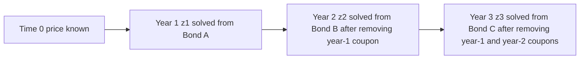
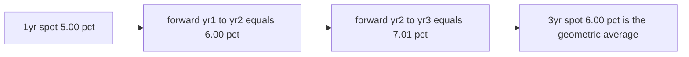
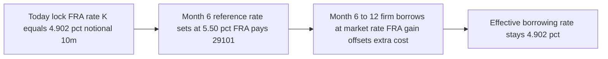
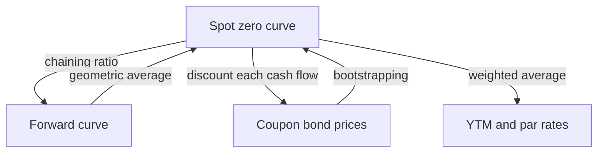

# Chapter 05 — Spot and Forward Rates

## 1. The Problem / The Need

Chapter 4 priced a bond with a single yield to maturity (YTM) — one number that, applied to every cash flow, reproduces the market price. That is enormously convenient, but it hides a lie. A YTM discounts the coupon you receive in six months at the *same* rate as the principal you receive in ten years. In reality, money for six months and money for ten years command different prices. Lending for a decade ties your capital up longer, exposes you to more inflation and default uncertainty, and usually earns a different rate than lending overnight. The market does not have "an interest rate"; it has a *term structure* — an entire schedule of rates, one for each horizon.

If each maturity has its own true rate of return, then two questions become unavoidable:

1. **What is the correct rate to discount a single cash flow arriving at time *t*?** That is the **spot rate** (also called the zero-coupon rate) — the yield on a pure discount bond that pays once, at *t*, with no coupons in between. A coupon bond is just a *portfolio* of such single payments, so its true value is the sum of each cash flow discounted at its own spot rate. YTM is a weighted average of these spot rates; it is an output, not the fundamental input.

2. **What does the market think a future interest rate will be?** If I can lock in a rate today for lending *between* year 1 and year 2 — starting in the future — that is a **forward rate**. Forward rates are not forecasts pulled from thin air; they are *implied* by today's spot curve through a no-arbitrage argument. Every spot curve secretly contains a full set of forward rates.

This chapter builds the machinery to move between three representations of the same information — spot rates, forward rates, and coupon-bond prices — and shows they are locked together by arbitrage. Mastering this is the price of admission to swaps, FRAs, curve trading, and any serious relative-value work.

## 2. The Core Idea

There is one master identity, and everything in this chapter is a rearrangement of it. Money invested from today (time 0) to time *n* must grow by the same total factor whether you:

- **(A)** lock in the *n*-year spot rate today and hold to maturity, or
- **(B)** invest for a shorter period and *roll over* at rates you lock in today for the future sub-periods.

If those two produced different terminal wealth with zero risk, you could borrow via the cheap path and lend via the rich path and pocket a riskless profit. Arbitrageurs would pounce until the paths matched. So, with annual compounding:

$$(1+z_n)^n = (1+z_1)(1+f_{1,2})(1+f_{2,3})\cdots(1+f_{n-1,n})$$

where $z_n$ is the *n*-year **spot rate** and $f_{k,k+1}$ is the one-year **forward rate** covering the period from year *k* to year *k+1*. The spot curve and the forward curve are two encodings of the same object. Given one, the other is determined — no forecasting required.

The second core idea is **bootstrapping**: real markets quote *coupon* bonds, not a clean strip of zeros. But a coupon bond is a bundle of cash flows, each of which should be discounted at a spot rate. By working from the shortest maturity outward — using the already-solved short spot rates to strip out the near coupons — we can peel each successive spot rate out of each successive coupon bond price. That is how a usable zero curve gets built from tradeable instruments.

## 3. Why / How It Works

**Why spot rates, not YTM, are the "atoms" of pricing.** Consider a 3-year 7% annual-coupon bond. It pays 7, 7, and 107. Suppose someone could buy the individual claims separately: a 1-year zero paying 7, a 2-year zero paying 7, and a 3-year zero paying 107. The *law of one price* says the coupon bond must cost exactly what those three zeros cost combined — otherwise you strip the bond and sell the pieces (or buy the pieces and reconstitute the bond) for free money. This is literally what the U.S. Treasury STRIPS program allows. Therefore:

$$P = \frac{C_1}{(1+z_1)^1} + \frac{C_2}{(1+z_2)^2} + \cdots + \frac{C_n}{(1+z_n)^n}$$

Each cash flow is discounted at *its own* horizon's spot rate. Contrast with YTM, which forces a single *y*:

$$P = \frac{C_1}{(1+y)^1} + \frac{C_2}{(1+y)^2} + \cdots + \frac{C_n}{(1+y)^n}$$

Both equations give the *same* price *P* — but only the spot-rate equation reflects the true term structure. The YTM *y* is an internal rate of return: a single complex-average of the spot rates, weighted by the timing and size of the cash flows. Two bonds with identical maturities but different coupons will have *different* YTMs even in the same market, precisely because their cash flows sample the spot curve with different weights. Spot rates, by contrast, are coupon-independent — they belong to the market, not to any one bond.

**Why forward rates are implied, not forecast.** Return to path A versus path B. Suppose $z_1 = 5\%$ and $z_2 = 5.5\%$. Path A: invest \$1 for two years at the 2-year spot: grows to $(1.055)^2 = 1.113025$. Path B: invest for one year at 5% (grows to 1.05), then reinvest for the second year at whatever one-year rate you can lock in *today* for that future year — call it $f_{1,2}$. For no arbitrage:

$$1.05 \times (1 + f_{1,2}) = 1.113025 \;\Rightarrow\; f_{1,2} = \frac{1.113025}{1.05} - 1 = 6.00\%$$

The forward rate 6.00% is not a prediction that rates *will* be 6% next year. It is the rate that makes an investor *indifferent* between the two paths today. If your own forecast for next year's 1-year rate differs from 6%, that is precisely where a trade lives — but the *implied* forward is pinned by arithmetic.

**How the arbitrage is actually enforced.** You do not need exotic instruments. To lock in $f_{1,2}$ using only cash bonds: today, buy the 2-year zero and short-sell the appropriate amount of the 1-year zero (or borrow for one year). The combined position has *no* net cash flow today, a cash *outflow* at year 1 (repaying the short), and a cash *inflow* at year 2 — synthetically, you have contracted today to invest money between year 1 and year 2 at a locked rate. If dealers quote a forward-rate agreement at anything other than the implied forward, this cash-and-carry replication forces it back.

The general formula for the one-period forward from year *k* to *k+1*:

$$1 + f_{k,k+1} = \frac{(1+z_{k+1})^{k+1}}{(1+z_k)^{k}}$$

and the multi-period forward covering *m* years starting at year *k*:

$$(1+f_{k,k+m})^{m} = \frac{(1+z_{k+m})^{k+m}}{(1+z_k)^{k}}$$

## 4. Full Content — Formulas and Bond Math

### 4.1 Definitions

| Term | Symbol | Meaning |
|---|---|---|
| Spot / zero rate | $z_t$ | Yield on a zero-coupon bond maturing at *t*; the rate to discount a single cash flow at *t* |
| Discount factor | $DF_t$ | Present value today of \$1 paid at *t*: $DF_t = 1/(1+z_t)^t$ |
| Forward rate | $f_{k,m}$ | Rate locked in today for a loan running from *k* to *m* |
| Par rate | $c_t$ | Coupon rate that makes a *t*-year bond price to par (100) |
| YTM | $y$ | Single IRR that reproduces a coupon bond's price |

### 4.2 The discount function

Everything can be expressed through discount factors, which sidestep compounding conventions:

$$DF_t = \frac{1}{(1+z_t)^t}, \qquad P = \sum_{t} C_t \cdot DF_t$$

The forward discount factor between *k* and *m* is simply the ratio:

$$DF_{k \to m} = \frac{DF_m}{DF_k}, \qquad (1+f_{k,m})^{m-k} = \frac{DF_k}{DF_m}$$

This ratio form is the cleanest way to remember forwards: **the forward growth factor is the ratio of the near discount factor to the far discount factor.**

### 4.3 The chaining (no-arbitrage) identity

$$(1+z_n)^n = \prod_{k=0}^{n-1}\left(1+f_{k,k+1}\right), \quad \text{with } f_{0,1} \equiv z_1$$

Taking the geometric interpretation: **the *n*-year spot rate is the geometric average of the sequence of one-year forward rates.**

$$1+z_n = \left[(1+z_1)(1+f_{1,2})\cdots(1+f_{n-1,n})\right]^{1/n}$$

### 4.4 Bootstrapping the spot curve

Given a set of coupon bonds (ideally par bonds, or a swap curve) at maturities 1, 2, 3, …, solve *sequentially*:

**Step 1 (1-year):** From the 1-year bond price $P_1$ with final cash flow $C_1$:
$$P_1 = \frac{C_1}{1+z_1} \;\Rightarrow\; z_1 = \frac{C_1}{P_1} - 1$$

**Step *n* (recursively):** Knowing $z_1,\dots,z_{n-1}$, take the *n*-year bond with coupons *C* and price $P_n$:
$$P_n = \sum_{t=1}^{n-1}\frac{C}{(1+z_t)^t} + \frac{C + \text{Face}}{(1+z_n)^n}$$

All terms except the last are known. Isolate the final term and solve for $z_n$:

$$(1+z_n)^n = \frac{C + \text{Face}}{\displaystyle P_n - \sum_{t=1}^{n-1}\frac{C}{(1+z_t)^t}}$$

Each new bond contributes exactly one new unknown spot rate, so the system solves cleanly one maturity at a time.

### 4.5 Forward Rate Agreements (FRAs)

An **FRA** is an over-the-counter contract that locks in an interest rate for a future borrowing/lending period on a *notional* principal. No principal changes hands — only the *interest differential* is settled in cash. FRAs are quoted as "$a \times b$": e.g. a **6×12 FRA** covers the 6-month period *starting* in 6 months and *ending* in 12 months.

- **The fixed (FRA) rate** *K* is the implied forward rate derived from the spot curve (Section 3). A dealer who quotes off-market gets arbitraged via cash-and-carry.
- **Convention:** the *long* (buyer, a would-be borrower) profits when the reference rate sets *above* K; the *short* (a would-be lender) profits when it sets *below*.
- **Settlement** happens at the *start* of the reference period, so the interest-differential (which is naturally an end-of-period amount) is **discounted back** at the realized reference rate.

Using money-market (simple, Act/360) conventions, with day-count fraction $\tau = \text{days}/360$, realized reference rate *L*, notional *N*:

$$\text{Payoff to long} = N \cdot \frac{(L - K)\,\tau}{1 + L\,\tau}$$

The numerator $(L-K)\tau \cdot N$ is the interest saved/lost over the period; dividing by $(1+L\tau)$ discounts it from period-end back to settlement date.

The FRA fixed rate itself is the simple forward implied by two money-market spot rates $z_{short}$ (to the near date, fraction $\tau_1$) and $z_{long}$ (to the far date, fraction $\tau_2$):

$$(1 + z_{short}\,\tau_1)(1 + K\,\tau_{fwd}) = (1 + z_{long}\,\tau_2), \qquad \tau_{fwd} = \tau_2 - \tau_1$$

### 4.6 Compounding conventions (a warning)

Forward rates depend on the compounding convention. The cleanest is *continuous* compounding, where the chaining identity becomes purely additive:

$$z_n \cdot n = z_1 \cdot 1 + f_{1,2}\cdot 1 + \cdots \;\Rightarrow\; f_{k,m} = \frac{z_m\, m - z_k\, k}{m-k}$$

Under continuous compounding the forward rate is a simple *weighted difference* of spot rates — elegant and popular in derivatives math. This chapter uses annual compounding for the bond examples and simple money-market rates for the FRA, because that is what shows up in exams and on trading desks respectively. Always state your convention.

## 5. Worked Examples

### Example 1 — Bootstrapping a 3-year spot curve from coupon bonds

We are given three annual-coupon bonds, face value 100, priced in the market:

| Bond | Maturity | Annual coupon | Market price |
|---|---|---|---|
| A | 1 year | 4.00 | 99.0476 |
| B | 2 years | 6.00 | 100.9502 |
| C | 3 years | 7.00 | 102.7942 |

**Step 1 — extract $z_1$ from Bond A.** Bond A pays 104 at t=1:
$$99.0476 = \frac{104}{1+z_1} \;\Rightarrow\; 1+z_1 = \frac{104}{99.0476} = 1.05000 \;\Rightarrow\; \boxed{z_1 = 5.00\%}$$

**Step 2 — extract $z_2$ from Bond B.** Bond B pays 6 at t=1 and 106 at t=2. Discount the year-1 coupon at the *known* $z_1$:
$$\frac{6}{1.05} = 5.71429$$
$$100.9502 = 5.71429 + \frac{106}{(1+z_2)^2}$$
$$\frac{106}{(1+z_2)^2} = 95.23591 \;\Rightarrow\; (1+z_2)^2 = \frac{106}{95.23591} = 1.113025$$
$$1+z_2 = \sqrt{1.113025} = 1.05500 \;\Rightarrow\; \boxed{z_2 = 5.50\%}$$

**Step 3 — extract $z_3$ from Bond C.** Bond C pays 7, 7, 107. Discount the first two coupons at the known spots:
$$\frac{7}{1.05} = 6.66667, \qquad \frac{7}{(1.055)^2} = \frac{7}{1.113025} = 6.28829$$
$$102.7942 = 6.66667 + 6.28829 + \frac{107}{(1+z_3)^3}$$
$$\frac{107}{(1+z_3)^3} = 89.83924 \;\Rightarrow\; (1+z_3)^3 = \frac{107}{89.83924} = 1.191016$$
$$1+z_3 = 1.191016^{1/3} = 1.06000 \;\Rightarrow\; \boxed{z_3 = 6.00\%}$$

**The bootstrapped spot curve:** $z_1=5.00\%,\; z_2=5.50\%,\; z_3=6.00\%$ — an upward-sloping curve.

**Self-check (reconstitute Bond C).** Re-price Bond C using the three spot rates and confirm we recover 102.7942:
$$\frac{7}{1.05} + \frac{7}{1.113025} + \frac{107}{1.191016} = 6.66667 + 6.28829 + 89.83924 = 102.79420 \;\checkmark$$

The following timeline shows how each bond's cash flows are peeled apart, with known spots (solid) used to strip out near coupons so the far spot (dashed) can be solved.

*Bootstrapping marches outward: each new bond adds exactly one unknown spot rate.*

### Example 2 — Deriving the forward curve and verifying the chaining identity

Using the spot curve from Example 1, compute the implied one-year forward rates.

**$f_{1,2}$ (1-year rate, 1 year forward):**
$$1+f_{1,2} = \frac{(1+z_2)^2}{1+z_1} = \frac{1.113025}{1.05} = 1.060024 \;\Rightarrow\; f_{1,2} = 6.00\%$$

**$f_{2,3}$ (1-year rate, 2 years forward):**
$$1+f_{2,3} = \frac{(1+z_3)^3}{(1+z_2)^2} = \frac{1.191016}{1.113025} = 1.070073 \;\Rightarrow\; f_{2,3} = 7.01\%$$

**$f_{1,3}$ (2-year rate, 1 year forward):**
$$(1+f_{1,3})^2 = \frac{(1+z_3)^3}{1+z_1} = \frac{1.191016}{1.05} = 1.134301$$
$$1+f_{1,3} = \sqrt{1.134301} = 1.065036 \;\Rightarrow\; f_{1,3} = 6.50\%$$

**Self-check (chaining identity).** The three consecutive one-year rates must compound up to the 3-year spot factor:
$$(1+z_1)(1+f_{1,2})(1+f_{2,3}) = 1.05 \times 1.060024 \times 1.070073$$
$$= 1.113025 \times 1.070073 = 1.191016 = (1+z_3)^3 \;\checkmark$$

Also note $z_3 = 6.00\%$ is the *geometric average* of $5.00\%,\,6.00\%,\,7.01\%$: $\left(1.05 \cdot 1.060024 \cdot 1.070073\right)^{1/3} = 1.06000$. The spot rate sits *below* the far forward because the curve is rising — the average of a rising sequence lags its latest value. This is the single most important intuition in the whole chapter:

*When the spot curve rises, forward rates lie above spot rates and pull the average upward.*

### Example 3 — Pricing a Forward Rate Agreement (6×12 FRA)

A treasurer knows the firm will borrow **\$10,000,000 for 6 months, starting in 6 months**, and wants to hedge the rate. Current money-market spot rates: **6-month = 4.00%**, **12-month = 4.50%** (both simple, annualized; assume each 6-month period is exactly $\tau = 0.5$).

**Step 1 — the fair FRA rate (implied forward).** No-arbitrage requires that lending for 12 months equals lending 6 months then rolling at the forward:
$$(1 + 0.04 \times 0.5)(1 + K \times 0.5) = (1 + 0.045 \times 1)$$
$$1.02 \times (1 + 0.5K) = 1.045 \;\Rightarrow\; 1 + 0.5K = \frac{1.045}{1.02} = 1.024510$$
$$0.5K = 0.024510 \;\Rightarrow\; \boxed{K = 4.902\%}$$

The treasurer buys (goes long) the 6×12 FRA at **4.902%**, locking in that borrowing rate.

**Step 2 — settlement when rates rise.** Suppose at the settlement date (6 months from now) the realized 6-month reference rate sets at **L = 5.50%**. The firm must now borrow at 5.50% in the cash market — more expensive — but the FRA compensates. Payoff to the long:
$$\text{Payoff} = N \cdot \frac{(L-K)\,\tau}{1+L\,\tau} = 10{,}000{,}000 \cdot \frac{(0.055 - 0.04902)\times 0.5}{1 + 0.055\times 0.5}$$
$$= 10{,}000{,}000 \cdot \frac{0.00598 \times 0.5}{1.0275} = \frac{29{,}900}{1.0275} = \boxed{\$29{,}101}$$

The firm receives \$29,101 at the settlement date.

**Self-check (did the hedge work?).** The extra interest cost of borrowing at 5.50% instead of the locked 4.902%, measured at period-*end* (12 months), is:
$$10{,}000{,}000 \times (0.055 - 0.04902) \times 0.5 = \$29{,}900 \text{ payable in 6 months' time}$$
The FRA paid \$29,101 *now* (at the 6-month settlement). Growing it forward at the realized 5.50% over the next 6 months: $29{,}101 \times 1.0275 = \$29{,}901 \approx \$29{,}900$. The FRA gain, carried to period-end, exactly offsets the extra borrowing cost. The hedge is complete — the firm's *effective* all-in rate is the locked 4.902% regardless of where L set. ✓

*An FRA converts an uncertain future borrowing rate into a locked rate via a discounted cash settlement.*

## 6. Connections

- **To YTM (Chapter 4):** YTM is a cash-flow-weighted geometric average of spot rates. A par bond's YTM equals its par rate; a par rate is itself a coupon-weighted average of spot rates. Spot rates are the primitive; YTM and par rates are derived summaries.
- **To duration and convexity (Chapter 6):** True risk is exposure to *each* spot rate (key-rate / partial durations), not just to a single yield. The spot curve is the object that actually shifts and twists.
- **To swaps:** A plain-vanilla interest-rate swap is priced by discounting its floating and fixed legs on the bootstrapped zero curve; the swap fixed rate is a par rate, and each floating payment equals the implied forward. The swap curve is, in practice, *the* curve bootstrapped in modern markets.
- **To the expectations hypothesis:** The pure expectations theory claims forward rates equal the market's expected future spot rates. Liquidity-preference and term-premium theories argue forwards exceed expected spots by a risk premium. Either way, forwards are the market's *risk-neutral* anchor.
- **To STRIPS:** Treasury coupon stripping and reconstitution are the physical mechanism that enforces the law of one price between coupon bonds and zeros — making the bootstrapped spot curve a real, tradeable object.

The relationships among the curve shapes:

*Spot, forward, coupon-price, and YTM are four views of one term structure, linked by exact transformations.*

## 7. Key Terms

- **Spot rate / zero rate ($z_t$):** yield on a single cash flow at time *t*; the correct discount rate for that maturity.
- **Discount factor ($DF_t$):** present value of \$1 at *t*; $1/(1+z_t)^t$.
- **Forward rate ($f_{k,m}$):** rate locked in today for a future loan from *k* to *m*, implied by spot rates.
- **Bootstrapping:** sequential extraction of spot rates from coupon-bond (or swap) prices, shortest maturity first.
- **Par rate:** coupon that prices a bond to 100; equals the swap fixed rate at that tenor.
- **FRA (Forward Rate Agreement):** OTC contract fixing a future interest rate on a notional, cash-settled on the interest differential.
- **Chaining / no-arbitrage identity:** $(1+z_n)^n = \prod (1+f_{k,k+1})$.
- **Term structure of interest rates:** the full schedule of rates across maturities; the yield curve.

## 8. Common Confusions

1. **"YTM is the return I'll earn."** Only if you can reinvest every coupon at the YTM *and* hold to maturity. The true per-period cost of money is the spot rate. YTM blends spots into one figure that belongs to a specific bond, not to the market.

2. **"The forward rate is a forecast."** It is an *arbitrage-implied* break-even, not a prediction. It equals the *expected* future spot only under the pure expectations hypothesis with no term premium. Trades are born from the gap between your forecast and the implied forward.

3. **"Upward-sloping spot curve means the market expects rising rates."** Partly, but term/liquidity premia inflate forwards above expected spots. A rising spot curve is consistent with flat expected future rates *plus* a positive term premium.

4. **Forward vs. spot magnitude direction.** When the spot curve *rises*, forwards lie *above* spots (the marginal one-year rate exceeds the running average). When the curve is *inverted*, forwards lie *below* spots. Getting this backwards is a classic exam error — remember Example 2: 5% → 6% → 7% forwards, average 6% spot.

5. **Forgetting to discount the FRA settlement.** FRAs settle at the *start* of the reference period, but the interest differential is naturally an *end*-of-period amount. You must divide by $(1+L\tau)$. Omitting this over-states the payoff.

6. **Mixing compounding conventions.** A forward computed under annual compounding differs numerically from one under continuous or semi-annual compounding. State the convention before quoting a number.

7. **Bootstrapping with non-par bonds carelessly.** The recursion works with any coupon bonds, but coupons must be discounted at *previously solved* spot rates — not at the bond's own YTM. Using YTM to strip near coupons defeats the entire purpose.

## 9. Recap

- A bond is a portfolio of single cash flows; each should be discounted at its own **spot (zero) rate**, not at a single YTM. YTM is a cash-flow-weighted average of spots.
- **Forward rates** are locked-in future rates *implied* by the spot curve through the no-arbitrage chaining identity $(1+z_n)^n = \prod(1+f_{k,k+1})$. The *n*-year spot is the geometric average of the one-year forwards.
- **Bootstrapping** extracts the spot curve from coupon-bond (or swap) prices, solving one maturity at a time from the short end out. We built $z_1=5\%,\,z_2=5.5\%,\,z_3=6\%$ from three coupon bonds and reconstituted the prices exactly.
- Those spots imply forwards $f_{1,2}=6.00\%,\,f_{2,3}=7.01\%$, which chain back to $(1.06)^3$ — verifying the identity. Rising spot curve ⟹ forwards above spots.
- A **FRA** is the tradeable embodiment of a forward rate: its fixed rate is the implied forward, and it cash-settles the discounted interest differential. Our 6×12 FRA locked 4.902% and neutralized a rate rise to 5.50% down to the penny.

## 10. Quick Reference — Interview Points

| Concept | Formula |
|---|---|
| Spot pricing | $P = \sum_t C_t/(1+z_t)^t$ |
| Discount factor | $DF_t = 1/(1+z_t)^t$ |
| One-period forward | $1+f_{k,k+1} = (1+z_{k+1})^{k+1}/(1+z_k)^k$ |
| Multi-period forward | $(1+f_{k,m})^{m-k} = (1+z_m)^m/(1+z_k)^k$ |
| Chaining identity | $(1+z_n)^n = \prod_{k=0}^{n-1}(1+f_{k,k+1})$ |
| Continuous forward | $f_{k,m} = (z_m m - z_k k)/(m-k)$ |
| Bootstrap step *n* | $(1+z_n)^n = (C+\text{Face})/(P_n - \sum_{t<n} C\,DF_t)$ |
| FRA fair rate (simple) | $(1+z_s\tau_1)(1+K\tau_{fwd}) = (1+z_l\tau_2)$ |
| FRA payoff to long | $N\,(L-K)\tau/(1+L\tau)$ |

**Rapid-fire talking points:**

- *"Why not just use YTM?"* Because YTM discounts all cash flows at one rate, ignoring that the term structure prices each maturity differently. Spot rates are coupon-independent; YTM is bond-specific.
- *"Is a forward rate a forecast?"* No — it's a no-arbitrage break-even implied by today's spot curve. It equals the expected future spot only under pure expectations with zero term premium.
- *"Rising curve — where are forwards?"* Above the spots, because the spot is the geometric average of a rising forward sequence.
- *"How do you build a zero curve?"* Bootstrap: solve the 1-year spot from the 1-year instrument, then strip each successive coupon bond using already-known spots to isolate the next spot.
- *"How is an FRA priced?"* Its fixed rate is the implied forward from the spot curve; settlement is the interest differential discounted from period-end to the settlement date.
- *"Spot vs. forward vs. par rate?"* Spot discounts a single zero cash flow; forward is the future rate implied by two spots; par is the coupon that prices a bond to 100 (equals the swap rate). All three are transforms of one curve.
- **The one identity to never forget:** the total growth from 0 to *n* is path-independent under no arbitrage — hold the long spot, or roll the forwards; the terminal wealth is identical.
