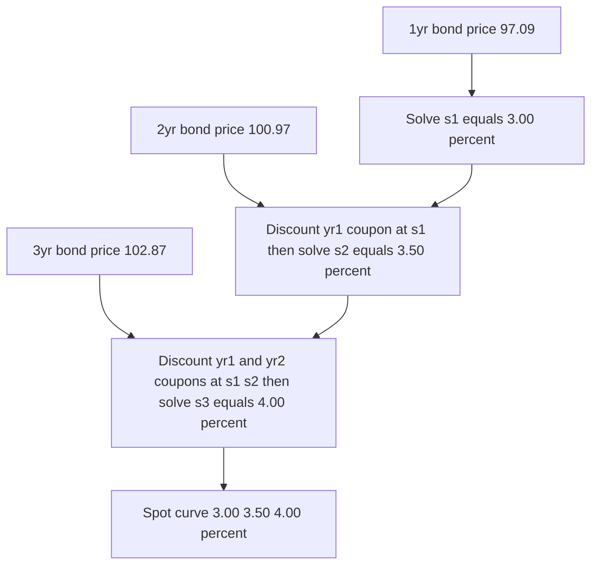
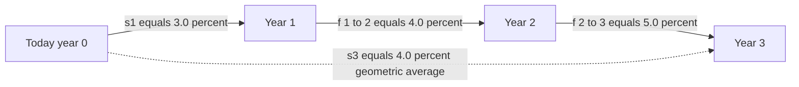
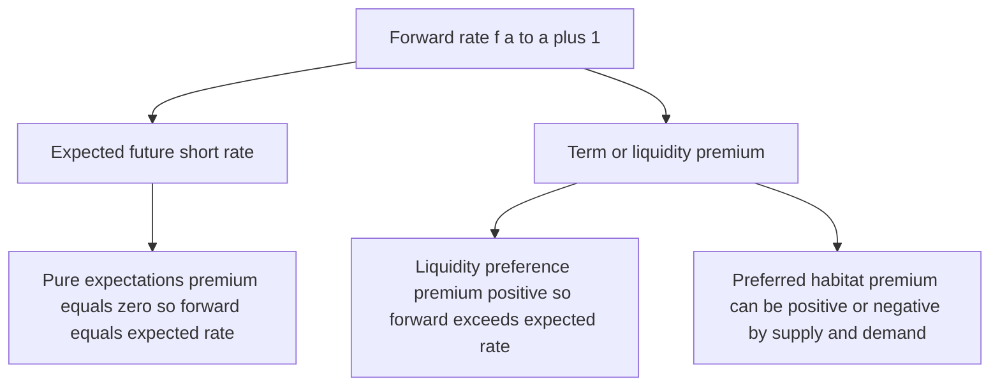
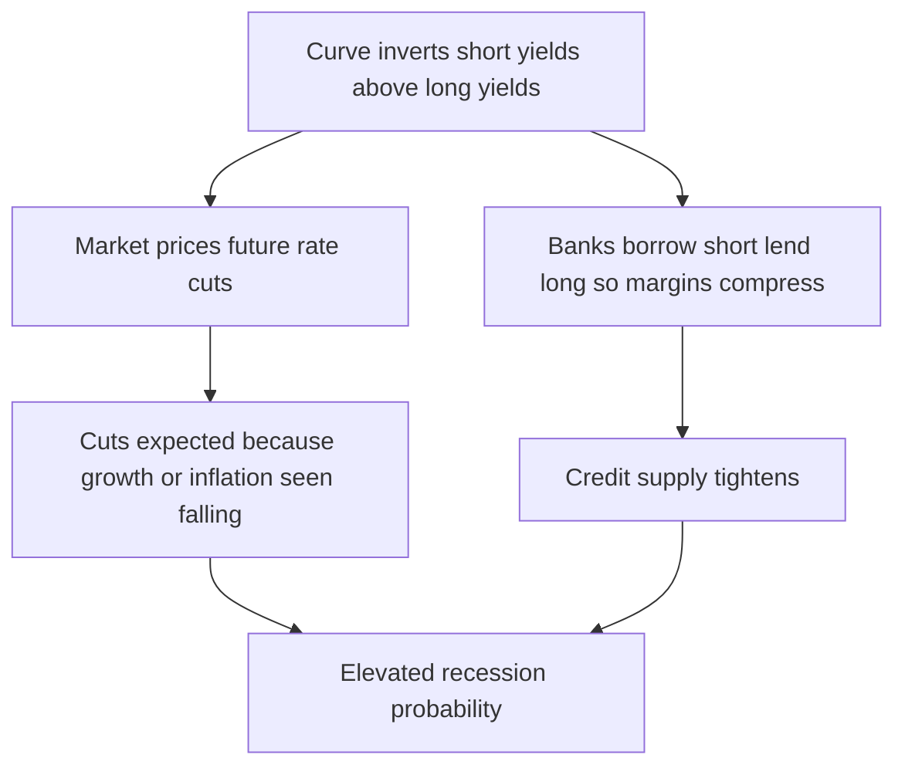

# Chapter 06 — The Term Structure of Interest Rates

## 1. The Problem / Need

Suppose someone asks you a deceptively simple question: "What is *the* interest rate?" The honest answer is that there is no single interest rate. The rate you can lock in to lend money for three months is almost never the same as the rate for ten years. A one-year Treasury bill might yield 3.0% while a ten-year Treasury note yields 4.5% and a thirty-year bond yields 4.8% — all issued by the same borrower (the government), all carrying the same negligible default risk, all quoted at the same instant. The only thing that differs is **time to maturity**.

This creates a genuine problem for anyone who works with money. If you are valuing a bond that pays coupons in years 1, 2, 3, 4, and a large redemption in year 5, which rate do you discount each cash flow at? Discounting all of them at a single yield-to-maturity is a convenient shortcut, but it is technically wrong: the year-1 coupon should be discounted at the one-year rate, the year-5 payment at the five-year rate. If you use one blended rate you can misprice the bond, misjudge relative value between two bonds, and completely miss the signal that the market is sending about the future.

Because that is the second, deeper reason the term structure matters: **the shape of the relationship between maturity and yield is one of the most-watched forecasting tools in all of finance.** An inverted curve — short rates above long rates — has preceded almost every US recession of the last sixty years. Central banks, credit committees, and pension funds all read the curve. So we need a rigorous framework: what the curve *is*, how to extract clean rates from it, what theories explain its shape, and what it is telling us.

## 2. The Core Idea

The **term structure of interest rates** is the relationship between the yield on a debt instrument and its time to maturity, holding credit quality, liquidity, and all other features constant. Plotted with maturity on the horizontal axis and yield on the vertical axis, it produces the **yield curve**.

To do it properly we must be precise about *which* yield. Three related curves describe the same underlying market:

- **Spot rate curve (zero curve):** the yield on a zero-coupon bond of each maturity — i.e., the pure rate for a single cash flow received at time *t*, with no reinvestment along the way. This is the theoretically correct set of discount rates.
- **Par yield curve:** the coupon rate at which a newly issued coupon bond of each maturity would trade exactly at par (price = face value). This is what "the 10-year yield" usually refers to in market commentary.
- **Forward rate curve:** the set of rates for borrowing/lending that *begin in the future* and are locked in *today*, implied arithmetically by the spot curve.

The master insight of this chapter is that these three are not three independent facts — they are three views of the **same** no-arbitrage information. Given any one, you can derive the other two. The spot curve is the natural foundation, so everything is built on it.

## 3. Why / How It Works

### Why one rate cannot do the job

Money has a time value that compounds, and the market's expectation of that value is not constant across horizons. If investors expect short-term rates to rise over the next few years — because growth is strong or inflation is building — then to persuade someone to lend for a long term, the long rate must roughly average the sequence of expected short rates. That alone would make the curve slope upward in a tightening world and downward in an easing world. Layer on compensation for risk (you tie your money up longer, you demand a premium) and for supply-and-demand imbalances at particular maturities, and you get a curve whose shape carries real information.

### Why spot rates are the honest discount rates

A five-year 5% coupon bond is really a *portfolio* of six zero-coupon bonds: a small zero maturing each year for the coupons, plus a large zero for the redemption. No-arbitrage says the bond must be worth the sum of those zeros valued at their own maturity's spot rate. If it were not, an arbitrageur would strip the bond into its cash flows (or reconstitute it) and pocket the difference. This is exactly what the US Treasury STRIPS market does. So spot rates are not an academic construct — they are enforced by traders.

### How we recover spot rates: bootstrapping

We rarely observe a full set of zero-coupon bonds directly. Instead we observe coupon bond prices and **bootstrap** the spot curve out of them, one maturity at a time:

1. The 1-year rate comes straight from a 1-year instrument (a bill or a bond with one remaining payment).
2. For the 2-year bond, we already know how to discount its year-1 coupon (using the year-1 spot). Everything left over must be explained by the year-2 spot — so we solve for it.
3. Repeat maturity by maturity, each step using all the previously solved spot rates.

### How forward rates fall out

Once we have spot rates, forward rates are pure arithmetic from a no-arbitrage argument. Investing for two years at the two-year spot must give the same terminal wealth as investing one year at the one-year spot and then reinvesting for the second year at the rate you can *lock in today* for that future year. That lock-in rate is the forward rate. If the two paths gave different terminal wealth, you could borrow on the cheap path and lend on the dear path for a riskless profit.

## 4. Full Content — Formulas and Bond Math

### 4.1 Notation

- $s_t$ = the annually-compounded spot (zero) rate for maturity *t* years.
- $P_t$ = price today of a zero-coupon bond paying 1 (or 100) at time *t*.
- $f(a,b)$ = the forward rate agreed today for the period from year *a* to year *b*.
- $y$ = yield to maturity (a single internal rate of return for a coupon bond).

### 4.2 Discount factors and spot rates

The price today of receiving 100 at time *t* is:

$$P_t = \frac{100}{(1+s_t)^{t}}$$

The **discount factor** is $DF_t = \dfrac{1}{(1+s_t)^t}$. A coupon bond paying coupon *C* each year and redeeming 100 at year *n* is priced as:

$$\text{Price} = \sum_{t=1}^{n} \frac{C}{(1+s_t)^{t}} + \frac{100}{(1+s_n)^{n}}$$

Note the *different* spot rate at each maturity — this is what makes it correct.

### 4.3 The bootstrapping recursion

Given the price of an *n*-year coupon bond and all spot rates up to *n−1*, solve for $s_n$:

$$s_n = \left( \frac{C + 100}{\text{Price} - \sum_{t=1}^{n-1} \dfrac{C}{(1+s_t)^{t}}} \right)^{1/n} - 1$$

### 4.4 Forward rates

The one-year forward rate starting in year *a* (i.e., covering year *a* to *a+1*), denoted $f(a, a+1)$:

$$1 + f(a, a+1) = \frac{(1+s_{a+1})^{a+1}}{(1+s_a)^{a}}$$

The general multi-period forward from year *a* to year *b* (with *b > a*):

$$\big(1 + f(a,b)\big)^{\,b-a} = \frac{(1+s_b)^{b}}{(1+s_a)^{a}}$$

Equivalently, the long spot rate is the geometric average of one-year forwards:

$$(1+s_n)^n = (1+s_1)\,(1+f(1,2))\,(1+f(2,3))\cdots(1+f(n-1,n))$$

### 4.5 Par yields

The *n*-year par yield $c_n$ is the coupon that makes price equal 100:

$$c_n = \frac{100\,\big(1 - DF_n\big)}{\sum_{t=1}^{n} DF_t} = \frac{100\left(1 - \dfrac{1}{(1+s_n)^n}\right)}{\displaystyle\sum_{t=1}^{n}\dfrac{1}{(1+s_t)^t}}$$

### 4.6 The ordering rule (upward-sloping curve)

When the spot curve slopes upward, a clean ranking emerges at each maturity:

$$\text{par yield} \;<\; \text{spot rate} \;<\; \text{forward rate}$$

Intuition: the spot rate is an average of forwards, so it lags the rising forwards; the par yield is a coupon-weighted blend that puts weight on cheaper near-dated rates, so it sits below the spot. (For a downward-sloping curve the inequalities reverse.)

### 4.7 The four canonical shapes

| Shape | Description | Typical meaning |
|---|---|---|
| **Normal (upward)** | Long yields > short yields, gently rising | Healthy expansion; market expects modest rate rises and/or term premium |
| **Flat** | Yields roughly equal across maturities | Transition point; uncertainty about direction; often precedes inversion |
| **Inverted (downward)** | Short yields > long yields | Market expects rate *cuts* ahead — usually because it expects a slowdown or recession |
| **Humped** | Rises then falls (peak in the belly, e.g. 2–5y) | Mixed signals; near-term tightening expected to reverse later |

### 4.8 The theories of the term structure

Four classic theories explain *why* the curve takes the shape it does. They are best understood as increasingly realistic refinements.

**(a) Pure (Unbiased) Expectations Theory.** The long rate is purely the geometric average of expected future short rates. Forward rates are *unbiased* forecasts of future spot rates: $f(a,a+1) = E[s_{1} \text{ in year } a]$. Implication: an upward curve means the market expects rates to rise; an inverted curve means it expects them to fall. Investors are treated as risk-neutral and indifferent between holding one long bond or rolling short bonds.

**(b) Liquidity Preference (Liquidity Premium) Theory.** Investors are *not* indifferent: longer bonds carry more price risk (higher duration, more sensitive to rate moves), so lenders demand a **term/liquidity premium** to hold them. Forwards therefore *overstate* expected future spots by that premium:

$$f(a,a+1) = E[s_1 \text{ in year } a] + \text{term premium}_a$$

with the premium generally rising with maturity. Implication: the curve can slope upward *even when* rates are expected to stay flat, simply because of the premium. This is why a mildly upward curve is the "normal" resting state.

**(c) Market Segmentation Theory.** Bonds of different maturities are traded in *separate* markets by different clientele — banks at the short end, pension funds and insurers at the long end — and these players do not move across maturities. Yields at each maturity are set by local supply and demand, essentially independently. Implication: the curve's shape reflects who is buying and selling at each point, not a single unifying expectation. It explains kinks and local distortions that expectations theory cannot.

**(d) Preferred Habitat Theory.** A hybrid and the most realistic. Investors *have* preferred maturity ranges (habitats) as in segmentation, but they *will* leave their habitat if paid a large enough yield premium. So expectations and premiums both matter, and premiums need not rise smoothly with maturity — they depend on supply/demand imbalances in each habitat. Implication: forwards embed both expected rates *and* a habitat-specific premium that can be positive or negative.

### 4.9 What drives shifts and reshapes

- **Monetary policy (the short end):** the central bank sets the very short rate; hikes push the front of the curve up, cuts push it down.
- **Inflation expectations (the long end):** long yields embed expected inflation plus a real rate plus an inflation-risk premium.
- **Growth expectations:** strong growth lifts long real rates; expected slowdowns pull them down.
- **Term premium:** compensation for duration risk, which itself moves with volatility and uncertainty.
- **Supply and demand:** heavy government issuance at a maturity raises its yield; flight-to-safety demand for long bonds lowers it; regulatory demand (insurers/pensions) anchors the long end.

Analysts summarize curve moves in three factors: **level** (parallel shift, all yields move together), **slope** (steepening/flattening, short vs long diverge), and **curvature** (the belly moves relative to the wings — a humped/butterfly move).

## 5. Worked Examples

### Example 1 — Bootstrapping the spot curve

We observe three annual-coupon government bonds (face 100, annual coupons):

| Bond | Maturity | Coupon | Market price |
|---|---|---|---|
| A | 1 year | 0% (zero) | 97.09 |
| B | 2 years | 4% | 100.97 |
| C | 3 years | 5% | 102.87 |

**Step 1 — one-year spot.** Bond A pays 100 in one year:

$$97.09 = \frac{100}{1+s_1} \;\Rightarrow\; 1+s_1 = \frac{100}{97.09} = 1.0300 \;\Rightarrow\; \boxed{s_1 = 3.00\%}$$

**Step 2 — two-year spot.** Bond B pays 4 at t=1 and 104 at t=2:

$$100.97 = \frac{4}{1.03} + \frac{104}{(1+s_2)^2}$$

$$\frac{4}{1.03} = 3.8835 \;\Rightarrow\; \frac{104}{(1+s_2)^2} = 100.97 - 3.8835 = 97.0865$$

$$(1+s_2)^2 = \frac{104}{97.0865} = 1.07123 \;\Rightarrow\; 1+s_2 = 1.03500 \;\Rightarrow\; \boxed{s_2 = 3.50\%}$$

**Step 3 — three-year spot.** Bond C pays 5, 5, 105:

$$102.87 = \frac{5}{1.03} + \frac{5}{1.035^2} + \frac{105}{(1+s_3)^3}$$

$$\frac{5}{1.03} = 4.8544,\quad \frac{5}{1.07123} = 4.6675$$

$$\frac{105}{(1+s_3)^3} = 102.87 - 4.8544 - 4.6675 = 93.3481$$

$$(1+s_3)^3 = \frac{105}{93.3481} = 1.12484 \;\Rightarrow\; 1+s_3 = 1.12484^{1/3} = 1.04000 \;\Rightarrow\; \boxed{s_3 = 4.00\%}$$

**Result:** an upward-sloping spot curve of **3.00%, 3.50%, 4.00%.**

*Self-check — reprice Bond C from the spot curve:* $4.8544 + 4.6675 + \dfrac{105}{1.12484} = 4.8544 + 4.6675 + 93.348 = 102.87.$ ✓ Reconciles exactly.

*Figure 1 — Bootstrapping recursion: each maturity's spot rate is solved using all previously recovered rates.*

### Example 2 — Implied forward rates

Using the spot curve above, compute the one-year forwards.

**Forward for year 1 to year 2, $f(1,2)$:**

$$1+f(1,2) = \frac{(1+s_2)^2}{(1+s_1)^1} = \frac{1.07123}{1.03000} = 1.04003 \;\Rightarrow\; \boxed{f(1,2) = 4.00\%}$$

**Forward for year 2 to year 3, $f(2,3)$:**

$$1+f(2,3) = \frac{(1+s_3)^3}{(1+s_2)^2} = \frac{1.12484}{1.07123} = 1.05005 \;\Rightarrow\; \boxed{f(2,3) = 5.00\%}$$

*Self-check — rebuild $s_3$ from the forwards:*

$$(1+s_1)(1+f(1,2))(1+f(2,3)) = 1.03 \times 1.04003 \times 1.05005 = 1.12484 = (1+s_3)^3$$

Cube root gives $1.04000 \Rightarrow s_3 = 4.00\%$. ✓ Reconciles.

Notice the pattern: spots **3.0, 3.5, 4.0**; forwards **3.0 (=s₁), 4.0, 5.0**. The forwards rise faster and sit above the spots — exactly what section 4.6 predicts for an upward curve. Under pure expectations, this curve is telling us the market expects the one-year rate to be **4.0%** next year and **5.0%** the year after.

*Figure 2 — The 3-year spot rate is the geometric average of the sequence of one-year forwards.*

### Example 3 — Par yields and the ordering rule

Compute the 3-year par yield from the spot curve. First the discount factors:

| t | $s_t$ | $DF_t = 1/(1+s_t)^t$ |
|---|---|---|
| 1 | 3.00% | 0.97087 |
| 2 | 3.50% | 0.93352 |
| 3 | 4.00% | 0.88900 |
| | **Sum** | **2.79339** |

$$c_3 = \frac{100\,(1 - DF_3)}{\sum DF_t} = \frac{100\,(1 - 0.88900)}{2.79339} = \frac{11.100}{2.79339} = \boxed{3.973\%}$$

*Self-check — price a 3-year 3.973% bond and confirm it equals par:*

$$3.973 \times 2.79339 + 100 \times 0.88900 = 11.099 + 88.900 = 99.999 \approx 100.$$ ✓

Now line up all three curves at the 3-year point:

| Measure | 3-year value |
|---|---|
| Par yield | 3.97% |
| Spot rate | 4.00% |
| Forward $f(2,3)$ | 5.00% |

This confirms **par < spot < forward** for an upward-sloping curve. If you had naively used the 3-year par yield (3.97%) to discount every cash flow of a 3-year bond, you would slightly misprice it versus the correct spot-by-spot valuation — small here, but material for longer maturities and steeper curves.

### Example 4 — Expectations vs liquidity premium

An investor has a 2-year horizon and two strategies, using the curve above:

- **Strategy A (buy-and-hold):** buy the 2-year zero; terminal wealth factor $= (1+s_2)^2 = 1.07123$.
- **Strategy B (roll short):** buy 1-year at 3.0%, then reinvest for year 2 at whatever the 1-year rate turns out to be, call it $s^{*}$; terminal factor $= 1.03 \times (1+s^{*})$.

Indifference requires $1.03 \times (1+s^{*}) = 1.07123 \Rightarrow s^{*} = 4.00\%$ — precisely the forward $f(1,2)$.

- Under **pure expectations**, the market's *expected* 1-year rate next year is exactly **4.0%**; the forward is an unbiased forecast.
- Under **liquidity preference**, suppose the true term premium built into the 2-year is **0.5%**. Then the *expected* future 1-year rate is only $4.0\% - 0.5\% = \mathbf{3.5\%}$; the forward **overstates** the expected spot by the premium. The upward slope is then only *half* about expected rate rises and *half* about the premium investors demand for locking money up.

This is the single most important practical caveat about reading the curve: **forwards are not clean forecasts** once you accept that a term premium exists.

*Figure 3 — Decomposing a forward rate into an expectations component and a premium component, and how each theory treats the premium.*

### Example 5 — An inverted curve and what it signals

Suppose the curve flips. We now observe spot rates of $s_1 = 5.0\%$, $s_2 = 4.5\%$, $s_3 = 4.2\%$ — short rates *above* long rates. Extract the forwards:

$$1+f(1,2) = \frac{1.045^2}{1.05} = \frac{1.092025}{1.05} = 1.04002 \;\Rightarrow\; f(1,2) = 4.00\%$$

$$1+f(2,3) = \frac{1.042^3}{1.045^2} = \frac{1.131366}{1.092025} = 1.03603 \;\Rightarrow\; f(2,3) = 3.60\%$$

The forwards **decline** (5.0% → 4.0% → 3.6%). Under pure expectations, the market is pricing the one-year rate *falling* from 5.0% today to ~4.0% next year to ~3.6% the year after. Rates fall when the central bank *cuts*, and the central bank cuts when it expects the economy to weaken. That is exactly why an inverted curve is the market's aggregated bet on a coming slowdown — and why the **10y–2y** and **10y–3m** spreads going negative are the two headline recession gauges. The signal is amplified in the real economy because banks borrow short and lend long: when short rates sit above long rates, lending margins compress, credit tightens, and the slowdown can become self-fulfilling.

*Figure 4 — Why an inverted curve is read as a recession warning: it embeds expected cuts and simultaneously squeezes bank lending.*

Note the caveat from Example 4 applies with equal force here: with a positive term premium, an *inverted* curve is an even *stronger* signal, because the market must expect rate cuts large enough to overcome the premium before long yields can fall below short yields.

## 6. Connections

- **To bond pricing (Chapters 2–3):** the spot curve *is* the correct set of discount rates; YTM is a single-number approximation of averaging over the curve. A bond's YTM equals its coupon only when it trades at par, and it is a complicated average of the spot rates weighted by cash-flow timing.
- **To duration and convexity (Chapter 5):** the "level, slope, curvature" decomposition of curve moves is why practitioners hedge not just duration (level risk) but also **key-rate durations** (exposure to specific points on the curve). A steepener/flattener is a slope bet that pure duration cannot capture.
- **To forwards, FRAs, and swaps (later chapters):** implied forward rates are the fair fixed rates for forward-rate agreements and the building blocks for pricing interest-rate swaps — a swap's fixed rate is essentially a par yield off the curve.
- **To macro and monetary policy:** the front end is anchored by the central bank's policy rate; the long end by inflation and growth expectations plus term premium. The curve is the market's aggregated forecast.
- **To equity and credit:** an inverted curve tightens bank lending margins (banks borrow short, lend long) and historically foreshadows recessions and widening credit spreads.

## 7. Key Terms

| Term | Meaning |
|---|---|
| **Term structure** | Relationship between yield and maturity, credit held constant |
| **Yield curve** | Graphical plot of that relationship |
| **Spot / zero rate** | Yield on a single cash flow at maturity *t*; the true discount rate |
| **Discount factor** | Present value today of 1 unit received at time *t* |
| **Bootstrapping** | Recursively extracting spot rates from coupon-bond prices |
| **Forward rate** | Rate for a future period, locked in today, implied by spots |
| **Par yield** | Coupon rate that makes a new bond price at par |
| **Term / liquidity premium** | Extra yield demanded for holding longer-duration bonds |
| **Normal / inverted / flat / humped** | The four canonical curve shapes |
| **Steepening / flattening** | Slope of the curve increasing / decreasing |
| **STRIPS** | Separately traded principal/interest zero-coupon components of a Treasury |

## 8. Common Confusions

1. **YTM vs spot rate.** YTM applies one rate to *all* of a bond's cash flows; the spot curve applies a *different* rate to each. Only for a zero-coupon bond do YTM and spot coincide. Using YTM to compare two bonds with different coupon patterns is apples-to-oranges (the "coupon effect").

2. **Forward rate ≠ forecast.** A forward rate is what the *math of the current curve* implies, and it equals the expected future spot **only under pure expectations**. With any term premium, the forward is a *biased* (usually upward) estimate. Never tell an interviewer the curve "predicts" a 4% rate without adding "under the pure expectations hypothesis."

3. **Upward slope does not require expected rate rises.** Because of the liquidity/term premium, the curve's *normal* resting state is mildly upward even if the market expects rates to be flat. Only an unusually steep curve signals strongly expected hikes.

4. **Inversion is a signal, not a cause.** An inverted curve reflects the market pricing in future rate *cuts* (because it expects a slowdown). It doesn't *cause* the recession, though it can amplify one by squeezing bank lending margins.

5. **Par yield vs coupon vs spot.** These three are equal only in a flat curve at par. On an upward curve, par yield < spot < forward at each maturity; confusing them leads to mispricing.

6. **Compounding conventions.** Annual vs semi-annual vs continuous compounding change the numbers. A curve quoted semi-annually (as US Treasuries are) will not match an annually-compounded bootstrap unless you convert. Always state the convention.

## 9. Recap

The term structure is the map from maturity to yield, and it exists because the market's expectation of the time value of money is not constant across horizons. The **spot (zero) curve** is the foundation — the honest set of discount rates enforced by no-arbitrage (the STRIPS market makes this literal). From observed coupon-bond prices we **bootstrap** the spot curve maturity by maturity; from spots we derive **forward rates** by a pure no-arbitrage argument and **par yields** by finding the coupon that prices at par. For an upward-sloping curve these line up as *par < spot < forward*.

Four theories explain the curve's shape: **pure expectations** (long = average of expected shorts, forwards are unbiased forecasts), **liquidity preference** (add a rising term premium, forwards overstate expected rates), **market segmentation** (separate maturity clienteles set local yields), and **preferred habitat** (the realistic hybrid — habitats exist but premiums can lure investors across them). The curve is driven at the front by monetary policy and at the back by inflation, growth, and term premium, and its moves decompose into **level, slope, and curvature**. Its shape — normal, flat, inverted, humped — is a closely watched macro signal, with **inversion the classic recession warning**.

## 10. Quick-Reference / Interview Points

**Formulas to have cold:**

| Quantity | Formula |
|---|---|
| Zero price | $P_t = 100 / (1+s_t)^t$ |
| Bond price (spot curve) | $\sum C/(1+s_t)^t + 100/(1+s_n)^n$ |
| One-year forward | $1+f(a,a{+}1) = (1+s_{a+1})^{a+1} / (1+s_a)^a$ |
| Spot as geo-avg | $(1+s_n)^n = \prod (1+f_{k-1,k})$ |
| Par yield | $c_n = 100(1-DF_n)/\sum DF_t$ |
| Forward decomposition | forward = expected future spot + term premium |

**Talking points:**

- "There is no single interest rate — the term structure is the whole map, and the spot curve is the theoretically correct set of discount rates."
- Be able to **bootstrap a 2- or 3-year spot curve live** — it is a classic desk interview question. Know the recursion cold.
- Given spots, **compute the implied forward in one line**, and immediately caveat: "unbiased forecast only under pure expectations."
- **Ordering rule:** upward curve → par < spot < forward (and reversed for inverted). Explains why coupon bonds and zeros of the same maturity have different yields.
- **Four theories in one breath:** expectations (forwards = expected shorts), liquidity preference (+ rising premium), segmentation (separate clienteles), preferred habitat (hybrid, realistic). Preferred habitat is the modern consensus.
- **The inversion story:** short > long means the market expects cuts, which means it expects a slowdown; the 10y–2y and 10y–3m spreads are the headline recession gauges. It also compresses bank net interest margins.
- **Curve moves = level + slope + curvature.** Duration hedges level; key-rate durations hedge slope and curvature; a "butterfly" is a curvature trade.
- **Drivers:** front end = central bank policy; long end = inflation + real growth + term premium; kinks = supply/demand at specific maturities.
- Remember the **STRIPS arbitrage**: it's the real-world enforcement mechanism that makes the spot curve more than theory — bonds must equal the sum of their zeros or traders strip/reconstitute for profit.
