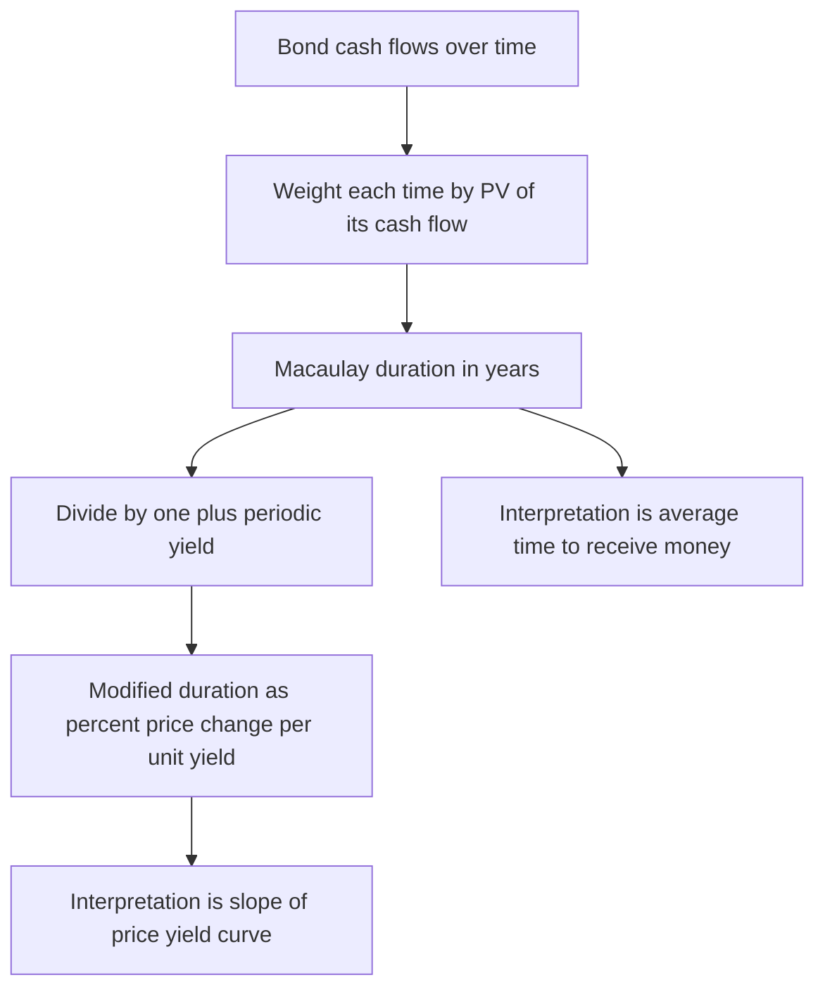
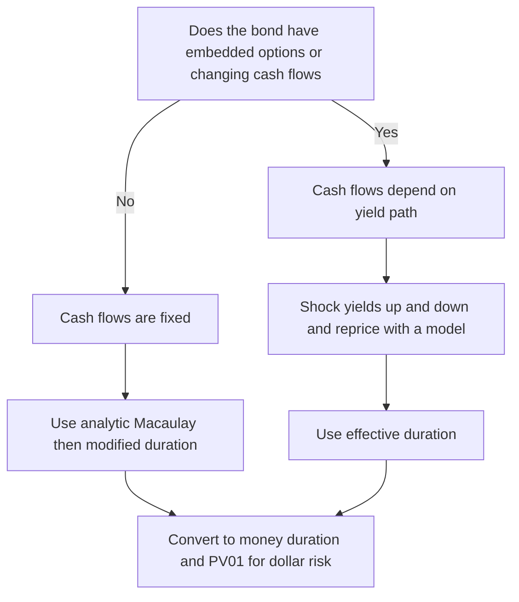
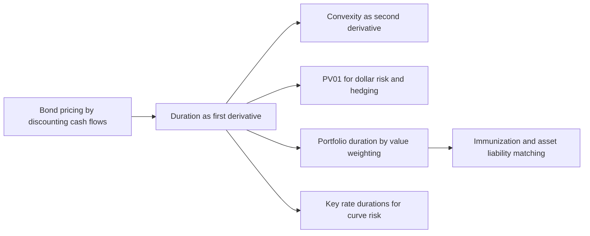

# Chapter 07 — Duration

## 1. The Problem / Need

A bond is a promise of future cash flows. The moment you know those cash flows and a discount rate (the yield), you can price the bond — that was the work of earlier chapters. But a price is a *photograph*: it tells you what the bond is worth at one instant, at one yield. It says nothing about what happens **next**.

Interest rates move every day. When yields rise, bond prices fall; when yields fall, prices rise. For anyone who holds bonds — a trader with a $500 million book, a bank matching assets to deposits, a pension fund funding liabilities 20 years out — the burning question is not "what is my bond worth today?" but:

> **"If yields move by X, how much money do I make or lose?"**

You could answer that question by brute force: reprice the bond at the new yield and take the difference. That works for one bond, but it collapses at scale. A trader running a portfolio of 400 instruments cannot reprice everything intraday every time the 10-year Treasury ticks. A risk manager needs a *single number* per position that says "this is how sensitive it is." Two bonds might both be worth par, but one loses 2% on a 100 bp sell-off and the other loses 12% — they are completely different risks wearing the same price tag.

We need a **measure of interest-rate sensitivity**: a portable, additive number that compresses the entire price–yield relationship into "how much does price move per unit of yield." That number is **duration**. It is the single most important risk statistic in fixed income, and mastering it — Macaulay, modified, effective, dollar duration, PV01, and portfolio duration — is the spine of this chapter.

## 2. The Core Idea

Duration has two faces that eventually turn out to be the same coin.

**Face 1 — Duration as a *time*.** Frederick Macaulay's original 1938 idea: a bond's effective "life" is not its maturity but the **weighted-average time until you receive its cash flows**, where each time is weighted by the present value of the cash flow arriving then. A 10-year zero-coupon bond pays everything at year 10, so its effective life is 10 years. A 10-year coupon bond pays you cash all along the way, so its *money-weighted* average life is shorter — maybe 7 or 8 years. This is **Macaulay duration**, measured in years. Picture a seesaw: the cash-flow present values are weights placed along a time axis, and Macaulay duration is the **fulcrum** — the balance point.

**Face 2 — Duration as a *sensitivity*.** The same weighted-average-time number, divided by one plus the periodic yield, tells you the **percentage change in price for a small change in yield**. This is **modified duration**. A modified duration of 7 means: *for every 1% (100 bp) rise in yield, the bond's price falls by roughly 7%*. It is the slope of the price–yield curve, expressed as a percentage.

The beautiful accident of bond math is that these two ideas — "average time to get your money back" and "price sensitivity to yield" — are almost the same quantity, differing only by a scaling factor of (1 + yield). That is why the word "duration" simultaneously means a *number of years* and a *risk exposure*.

*Figure 1 — Two faces of duration that turn out to be one number.*

## 3. Why / How It Works

Start from the pricing identity. A bond's price is the sum of discounted cash flows:

$$P = \sum_{t=1}^{N} \frac{CF_t}{(1+y)^t}$$

Price sensitivity means: how does $P$ change when $y$ changes? Take the first derivative with respect to $y$:

$$\frac{dP}{dy} = \sum_{t=1}^{N} \frac{-t \cdot CF_t}{(1+y)^{t+1}} = \frac{-1}{(1+y)} \sum_{t=1}^{N} \frac{t \cdot CF_t}{(1+y)^{t}}$$

Now divide both sides by $P$ to get the **percentage** change in price:

$$\frac{1}{P}\frac{dP}{dy} = \frac{-1}{(1+y)} \cdot \underbrace{\frac{\sum_{t=1}^{N} \dfrac{t \cdot CF_t}{(1+y)^{t}}}{P}}_{\text{Macaulay duration}}$$

Look at what fell out. The messy sum in the brace is exactly the **PV-weighted average of the times $t$** — that *is* Macaulay duration ($D_{Mac}$). So:

$$\frac{1}{P}\frac{dP}{dy} = \frac{-D_{Mac}}{(1+y)} \equiv -D_{Mod}$$

This is the whole story in one line. The derivative of price (a sensitivity) *automatically contains* the weighted-average time (Macaulay duration). Calculus links them. The factor $1/(1+y)$ appears because each cash flow's exponent drops by one when differentiated, pulling out one discount factor.

Two consequences follow immediately, and they are the reason duration *works* as a risk tool:

1. **Linearity / additivity.** Because price is a sum of PV terms and duration is a PV-weighted average, the duration of a portfolio is just the value-weighted average of its bonds' durations. Risk adds up cleanly.
2. **Local accuracy.** Duration is the *tangent line* to the price–yield curve at the current yield. For small yield moves the tangent hugs the true curve, so the estimate is excellent. For large moves the true curve bends away from the tangent (it is convex), so duration alone under- or over-estimates — that residual is **convexity**, corrected in the next chapter.

## 4. Full Content — Formulas and Bond Math

### 4.1 Macaulay Duration

$$D_{Mac} = \frac{\displaystyle\sum_{t=1}^{N} t \cdot \frac{CF_t}{(1+y)^t}}{P} = \sum_{t=1}^{N} t \cdot w_t, \qquad w_t = \frac{CF_t/(1+y)^t}{P}$$

The weights $w_t$ are the fraction of the bond's total present value delivered at time $t$; they sum to 1. $D_{Mac}$ is therefore a genuine weighted average of the payment times, expressed in the same period units as $t$ (years if annual, half-years if semiannual — then divide by the periodicity to state in years).

**Closed form for a standard coupon bond** (per-period coupon rate $c$, per-period yield $y$, $N$ periods):

$$D_{Mac} = \frac{1+y}{y} - \frac{(1+y) + N(c - y)}{c\left[(1+y)^N - 1\right] + y}$$

This is handy for a fast desk calculation without laying out every cash flow.

### 4.2 Modified Duration

$$D_{Mod} = \frac{D_{Mac}}{1 + \frac{y}{m}}$$

where $y$ is the annual yield and $m$ is the number of coupon periods per year (use the *periodic* yield in the denominator). Modified duration is a pure sensitivity: **percentage price change per 1.00 (100%) change in yield**, or equivalently, the % price move for a 1-unit change in yield. Its defining relationship:

$$\frac{\Delta P}{P} \approx -D_{Mod} \cdot \Delta y$$

### 4.3 Effective Duration

For bonds whose cash flows **change when yields change** — callables, putables, mortgage-backed securities, any bond with embedded options — the analytic derivative above is invalid, because $CF_t$ is no longer fixed. We instead measure sensitivity numerically by *shocking* the yield curve up and down and repricing with a model:

$$D_{Eff} = \frac{P_{-} - P_{+}}{2 \cdot P_0 \cdot \Delta y}$$

where $P_-$ is the price after lowering yields by $\Delta y$, $P_+$ after raising them, and $P_0$ the base price. For an **option-free** bond, effective duration ≈ modified duration (they converge as $\Delta y \to 0$). For a callable bond, effective duration is *lower* than the modified duration of an otherwise identical straight bond — and can even turn **negative** for deep-in-the-money MBS (negative convexity), where falling rates trigger prepayments that shorten the bond.

### 4.4 Dollar Duration, Money Duration, and PV01

Percentage duration is unitless; a risk manager wants **currency**. Multiply by price:

$$\text{Money Duration (Dollar Duration)} = D_{Mod} \times P$$
$$\Delta P \approx -\,(\text{Money Duration}) \times \Delta y$$

Scale to the smallest quoted yield move, one basis point ($\Delta y = 0.0001$), and you get **PV01** (equivalently PVBP or DV01 — the "present value of a basis point" / "dollar value of an 01"):

$$\text{PV01} = D_{Mod} \times P \times 0.0001$$

PV01 answers "how many dollars do I gain or lose if yields move 1 bp?" It is the traders' universal risk unit because it is additive across long and short positions and lets you *hedge*: to neutralize a position's rate risk, offset it with another instrument of equal and opposite PV01.

### 4.5 Portfolio Duration

Because duration is PV-additive, a portfolio's modified duration is the **market-value-weighted average** of its holdings' durations:

$$D_{Mod,\,P} = \sum_{i=1}^{n} w_i \, D_{Mod,\,i}, \qquad w_i = \frac{MV_i}{\sum_j MV_j}$$

Equivalently — and more robustly for aggregating risk — portfolio PV01 is simply the **sum** of the constituent PV01s:

$$\text{PV01}_P = \sum_{i=1}^{n} \text{PV01}_i$$

The weighted-average-duration formula assumes a parallel shift of a single yield and all bonds priced off the same yield; summing PV01s is the cleaner, assumption-light way to roll up a book.

### 4.6 Key Qualitative Relationships (memorize these)

| Factor | Effect on duration | Intuition |
|---|---|---|
| Longer maturity | Higher (generally) | Cash flows sit further out |
| Higher coupon | **Lower** | More PV arrives early, pulling the balance point in |
| Higher yield | **Lower** | Distant cash flows discounted harder, weighted less |
| Zero-coupon bond | $D_{Mac} = $ maturity | Only one cash flow, at the end |
| Perpetuity | $D_{Mac} = (1+y)/y$ | Never matures, but not infinite duration |
| Add call option | Lowers effective duration | Upside price capped when rates fall |
| Floating-rate note | Near zero to next reset | Coupon re-fixes to the market |

## 5. Worked Examples

### Example 1 — Full duration build-out for a 3-year coupon bond

**Bond:** 3-year, 8% annual coupon, face value 100, priced to yield **10%**.
Cash flows: Year 1 = 8, Year 2 = 8, Year 3 = 108.

**Step 1 — Price and the PV of each cash flow.**

| $t$ | $CF_t$ | Discount $(1.10)^t$ | $PV_t = CF_t/(1.10)^t$ | Weight $w_t$ | $t \cdot PV_t$ | $t(t+1)\,PV_t$ |
|---:|---:|---:|---:|---:|---:|---:|
| 1 | 8 | 1.1000 | 7.272727 | 0.07654 | 7.272727 | 14.545454 |
| 2 | 8 | 1.2100 | 6.611570 | 0.06957 | 13.223140 | 39.669420 |
| 3 | 108 | 1.3310 | 81.142000 | 0.85389 | 243.426000 | 973.704000 |
| **Sum** | | | **95.026296** | **1.00000** | **263.921868** | **1027.918874** |

Price $P = 95.026296$.

**Step 2 — Macaulay duration.**

$$D_{Mac} = \frac{263.921868}{95.026296} = 2.77736 \text{ years}$$

Cross-check with the closed form ($c=0.08,\ y=0.10,\ N=3$):

$$D_{Mac} = \frac{1.10}{0.10} - \frac{1.10 + 3(0.08 - 0.10)}{0.08(1.331 - 1) + 0.10} = 11 - \frac{1.04}{0.12648} = 11 - 8.22265 = 2.77735 \ \checkmark$$

Both methods agree to five figures. Note $D_{Mac} = 2.78 < 3.00$: the coupons pull the balance point in from the 3-year maturity.

**Step 3 — Modified duration.**

$$D_{Mod} = \frac{2.77736}{1.10} = 2.52487$$

Interpretation: a 100 bp rise in yield should cut the price by about **2.52%**.

**Step 4 — Test the sensitivity by actual repricing.**

Reprice at 11% (a +100 bp move):

$$P_{11\%} = \frac{8}{1.11} + \frac{8}{1.11^2} + \frac{108}{1.11^3} = 7.207207 + 6.492976 + 78.968673 = 92.668856$$

Actual change $= \dfrac{92.668856 - 95.026296}{95.026296} = -2.4808\%$.

Duration estimate $= -D_{Mod} \times \Delta y = -2.52487 \times 0.01 = -2.5249\%$.

The estimate (−2.5249%) overstates the loss slightly versus the truth (−2.4808%). The **gap of 0.044%** is convexity — the price–yield curve bends upward, so the true price is a touch higher than the straight-line tangent predicts.

**Step 5 — Reconcile with convexity.** Annual convexity:

$$C = \frac{1027.918874 / (1.10)^2}{95.026296} = \frac{849.5197}{95.026296} = 8.9398$$

Second-order estimate:

$$\frac{\Delta P}{P} \approx -D_{Mod}\,\Delta y + \tfrac{1}{2} C\,(\Delta y)^2 = -0.0252487 + \tfrac{1}{2}(8.9398)(0.0001) = -0.0252487 + 0.0004470 = -0.0248017$$

That is **−2.4802%**, essentially the exact −2.4808%. The duration + convexity pair nails the true price move — full reconciliation.

**Small-move check (10 bp).** Reprice at 10.1%: $P = 94.786791$, actual change $= -0.2520\%$. Duration estimate $= -2.52487 \times 0.001 = -0.2525\%$. For a small move the tangent and curve nearly coincide — the estimate is accurate to the fourth decimal, confirming duration is a *local* measure.

### Example 2 — Semiannual bond and the periodicity convention

Real bonds usually pay **semiannually**, so you must work in half-year periods and then convert. **Bond:** 2-year, 6% annual coupon paid semiannually, face 100, priced to yield **5% annual** (⇒ 2.5% per period). There are $N=4$ periods; each coupon is 3.

| Period $t$ | $CF_t$ | $PV_t = CF_t/(1.025)^t$ | $t \cdot PV_t$ |
|---:|---:|---:|---:|
| 1 | 3 | 2.92683 | 2.92683 |
| 2 | 3 | 2.85544 | 5.71088 |
| 3 | 3 | 2.78580 | 8.35740 |
| 4 | 103 | 93.31292 | 373.25168 |
| **Sum** | | **101.88099** | **390.24679** |

**Macaulay (in periods):** $390.24679 / 101.88099 = 3.83042$ half-years. Convert to years by dividing by the periodicity $m = 2$: $D_{Mac} = 3.83042 / 2 = 1.9152$ years.

**Modified duration.** Divide by one plus the *periodic* yield, then restate per annual yield change. In periods: $3.83042 / 1.025 = 3.73699$ half-years; divide by $m=2$: $D_{Mod} = 1.8685$ (percent price change per 100 bp change in the annual yield).

**Reconcile.** Reprice at a 6% annual yield (3% per period): the bond becomes a par bond, $P = 100.0000$. Actual change $= (100.0000 - 101.88099)/101.88099 = -1.8463\%$. Duration estimate $= -1.8685 \times 0.01 = -1.8685\%$. The small overstatement is again convexity. The lesson: **always compute Macaulay/modified in the bond's native period, then divide by $m$ to state duration in years and per annual-yield move.**

### Example 3 — Dollar duration and PV01 on a real position

Take the same bond, but now you hold **$10,000,000 face value**. Market value $= 10{,}000{,}000 \times (95.026296/100) = \$9{,}502{,}630$.

**Money (dollar) duration** per 100 of price:
$$D_{Mod} \times P = 2.52487 \times 95.026296 = 239.929$$

**PV01 per 100 face:**
$$239.929 \times 0.0001 = 0.0239929$$

Scale to $10mm face (multiply by $10{,}000{,}000/100 = 100{,}000$):

$$\text{PV01}_{position} = 0.0239929 \times 100{,}000 = \$2{,}399.29$$

So every **1 bp** move in yield changes this position by about **$2,399**. Sanity check via money duration directly: $\Delta MV \approx -D_{Mod} \times MV \times \Delta y = -2.52487 \times 9{,}502{,}630 \times 0.0001 = -\$2{,}399.3$ per +1 bp. ✓ For a +25 bp sell-off, expected loss $\approx 25 \times \$2{,}399 = \$59{,}975$.

### Example 4 — Portfolio duration and hedging

A book holds two positions:

| Bond | Market Value | Modified Duration | PV01 (= $D_{Mod}\times MV\times 0.0001$) |
|---|---:|---:|---:|
| A (our 3-yr, 8% bond) | $6,000,000 | 2.5249 | $1,514.94 |
| B (a 10-yr bond) | $4,000,000 | 7.0000 | $2,800.00 |
| **Portfolio** | **$10,000,000** | **?** | **$4,314.94** |

**Weighted-average duration:**
$$D_{Mod,P} = 0.60 \times 2.5249 + 0.40 \times 7.0000 = 1.5149 + 2.8000 = 4.3149$$

**Portfolio PV01** (sum of parts): $1{,}514.94 + 2{,}800.00 = \$4{,}314.94$.
Cross-check: $4.3149 \times 10{,}000{,}000 \times 0.0001 = \$4{,}314.9$. ✓ The two roll-up methods agree.

**Estimated P&L on a +50 bp parallel sell-off:**
$$\Delta MV \approx -D_{Mod,P} \times MV \times \Delta y = -4.3149 \times 10{,}000{,}000 \times 0.005 = -\$215{,}747$$

**Hedging application.** Suppose the manager wants to cut portfolio duration to a **target of 3.0** by shorting 10-year Treasury futures whose DV01 is $80 per contract. Required reduction in PV01 $= (4.3149 - 3.0) \times 10{,}000{,}000 \times 0.0001 = \$1{,}314.9$. Contracts to short $= 1{,}314.9 / 80 \approx 16$ contracts. This is exactly how duration converts a portfolio view into an executable trade.

### Example 5 — Effective duration on a callable bond

A callable bond is priced today at $P_0 = 100.00$. A pricing model (which accounts for the issuer's call option) reprices it after shifting the whole curve by $\Delta y = 25$ bp:

- Yields **down** 25 bp: $P_- = 101.10$ (upside limited — the call caps price appreciation)
- Yields **up** 25 bp: $P_+ = 98.95$

$$D_{Eff} = \frac{P_- - P_+}{2 \, P_0 \, \Delta y} = \frac{101.10 - 98.95}{2 \times 100.00 \times 0.0025} = \frac{2.15}{0.50} = 4.30$$

An identical **option-free** bond might show a modified duration of 6.0. The embedded call *shortens* effective duration to 4.30 because the bond can't rally as freely when rates fall — the asymmetry (larger drop when rates rise than gain when they fall) is the fingerprint of negative convexity that effective duration captures and modified duration cannot.

*Figure 2 — Choosing the right duration measure.*

## 6. Connections

**To convexity (next chapter).** Duration is the first derivative (slope); convexity is the second derivative (curvature). Example 1 above showed duration alone leaves a residual on large moves that convexity mops up. The two are always used together for anything beyond ~25 bp.

**To bond pricing (earlier chapters).** Duration is literally the derivative of the pricing equation. Everything you learned about discounting cash flows is the raw material; duration is what you get when you ask how that price *moves*.

**To immunization and ALM.** Insurers and pension funds match the duration of their assets to the duration of their liabilities so that a rate shock moves both sides equally, protecting surplus. The **duration gap** = asset duration − liability duration (equity-weighted) is the core metric of bank asset-liability management. A positive gap means the institution loses net worth when rates rise.

**To the yield curve and key-rate duration.** Plain duration assumes a *parallel* shift. Real curves twist and steepen. **Key-rate (partial) durations** decompose sensitivity across specific maturities (2y, 5y, 10y, 30y), letting a manager hedge curve reshaping — a direct extension of the single-number duration here.

**To swaps and futures.** Interest-rate swaps and Treasury futures are priced and risk-managed in DV01 terms; the hedging math in Example 3 is exactly how a desk sizes them.

**To equities (DDM).** The dividend discount model gives long-duration growth stocks their notorious rate sensitivity — the same discounting mathematics, applied to equity cash flows.

*Figure 3 — Where duration sits in the fixed-income toolkit.*

## 7. Key Terms

- **Macaulay Duration** — PV-weighted average time (in years) to receive a bond's cash flows; the balance point of the cash-flow timeline.
- **Modified Duration** — Macaulay duration divided by (1 + periodic yield); the approximate percentage price change for a 1-unit (100%) change in yield. The workhorse sensitivity.
- **Effective Duration** — sensitivity measured by repricing after up/down yield shocks; the correct measure for bonds with embedded options or path-dependent cash flows.
- **Dollar / Money Duration** — modified duration × price; the currency price change per unit yield move.
- **PV01 / PVBP / DV01** — dollar change in value for a 1 bp yield move; the traders' additive risk unit.
- **Portfolio Duration** — market-value-weighted average of constituent durations; equivalently, sum of constituent PV01s.
- **Duration Gap** — asset duration minus liability duration; the immunization / ALM risk metric.
- **Key-Rate Duration** — sensitivity to a shift in one specific point on the yield curve, holding others fixed.
- **Convexity** — the second-order (curvature) correction to duration's linear estimate.

## 8. Common Confusions

**"Duration is the time until maturity."** No. Duration equals maturity *only* for a zero-coupon bond. For any coupon bond, duration is strictly less than maturity because coupons return money early. A 10-year 8% bond might have a duration near 7 years.

**"Macaulay and modified duration are interchangeable."** They differ by the factor (1 + y/m). Macaulay is in *years*; modified is a *percentage sensitivity*. Quoting one when you mean the other misstates risk by the yield factor — small at low yields, material at high ones.

**"A modified duration of 5 means a 5% loss for any yield move."** Only for a *small* move, and only *approximately*. It means ~5% per 100 bp, linearly. For a 300 bp move the linear estimate is meaningfully off — convexity matters, and the estimate overstates losses on sell-offs and understates gains on rallies.

**"Higher-coupon bonds are riskier because they pay more."** Backwards. Higher coupons mean *more* PV arrives early, which *lowers* duration and *reduces* rate sensitivity. Low-coupon and zero-coupon bonds are the most rate-sensitive at a given maturity.

**"Modified duration works for callable bonds."** No. Once cash flows depend on the yield path, the analytic derivative is invalid. You must use *effective* duration (shock-and-reprice). Using modified duration on an MBS can badly misstate — or wrongly-sign — the risk.

**"Duration is always positive."** Almost always, but deep-in-the-money callables and certain MBS can exhibit *negative* effective duration (negative convexity): prices fall as rates fall because prepayments accelerate.

**"To get portfolio risk, average the yields or maturities."** Weight by *market value*, not face value or count, and average the *durations* (or better, sum the PV01s). Face-weighting is wrong when bonds trade away from par.

## 9. Recap

Duration compresses the entire price–yield relationship into a single, portable number. It wears two hats that are mathematically one: a **weighted-average time** to receive cash flows (Macaulay, in years) and a **price sensitivity** to yield (modified, in % per unit yield). The bridge between them is division by (1 + periodic yield), which falls straight out of differentiating the pricing equation.

From modified duration flow the tools a desk actually uses: **money duration** (dollars per unit yield) and **PV01** (dollars per basis point), the additive currency in which real risk is measured and hedged. Because duration is a PV-weighted average, portfolio risk is a **value-weighted blend** of the parts, or equivalently the **sum of PV01s** — so a 400-line book collapses to one number and one hedge ratio.

For plain bonds, the analytic formulas suffice and duration is a razor-sharp *local* estimate — Example 1 reproduced the true price move to the fourth decimal for a 10 bp shift, and duration + convexity reconciled the 100 bp move almost exactly. For bonds with embedded options, cash flows move with yields, so we switch to **effective duration** — shock the curve up and down and reprice. Master the hierarchy — Macaulay → modified → effective, then money duration → PV01 → portfolio — and you can answer the only question that matters when rates move: *how much do I make or lose?*

## 10. Quick-Reference / Interview Points

**Core formulas**

| Quantity | Formula |
|---|---|
| Macaulay | $D_{Mac} = \frac{1}{P}\sum t\,\frac{CF_t}{(1+y)^t}$ |
| Modified | $D_{Mod} = \frac{D_{Mac}}{1 + y/m}$ |
| Price change | $\frac{\Delta P}{P} \approx -D_{Mod}\,\Delta y$ |
| Effective | $D_{Eff} = \frac{P_- - P_+}{2P_0\,\Delta y}$ |
| Money duration | $D_{Mod} \times P$ |
| PV01 | $D_{Mod} \times P \times 0.0001$ |
| Portfolio | $D_P = \sum w_i D_i$ (value-weighted) |
| With convexity | $\frac{\Delta P}{P} \approx -D_{Mod}\Delta y + \tfrac12 C(\Delta y)^2$ |

**Rapid-fire interview answers**

- *"What is duration in one sentence?"* — The approximate percentage change in a bond's price for a 1% change in yield; equivalently, the PV-weighted average time to receive its cash flows.
- *"Macaulay vs modified?"* — Macaulay is in years; modified = Macaulay / (1 + periodic yield) and is the % sensitivity. Modified is what you use for P&L.
- *"When do you use effective duration?"* — For bonds with embedded options or path-dependent cash flows (callables, putables, MBS) — anything where cash flows change with rates.
- *"What is DV01/PV01?"* — Dollar change in value per 1 bp yield move; the additive risk unit desks hedge in.
- *"How does coupon affect duration?"* — Higher coupon → lower duration (more PV arrives early). Zeros have the highest duration for a given maturity (duration = maturity).
- *"How does yield affect duration?"* — Higher yield → lower duration (distant cash flows discounted more, weighted less).
- *"Duration of a perpetuity?"* — $(1+y)/y$. At 8%, that's 13.5 years — long, but finite.
- *"Limitation of duration?"* — It is linear/local; it assumes a small, parallel yield shift. Large moves need convexity; curve reshaping needs key-rate durations.
- *"Portfolio duration of $6mm @ 2.52 and $4mm @ 7.0?"* — $0.6(2.52) + 0.4(7.0) = 4.31$.
- *"Can duration be negative?"* — Effective duration can, for negatively convex instruments like some MBS, where falling rates trigger prepayments and shorten the bond.
