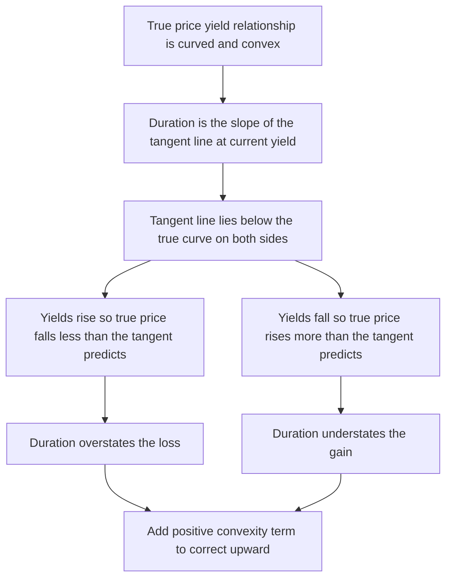
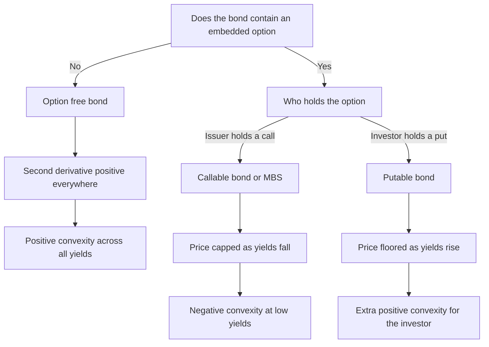
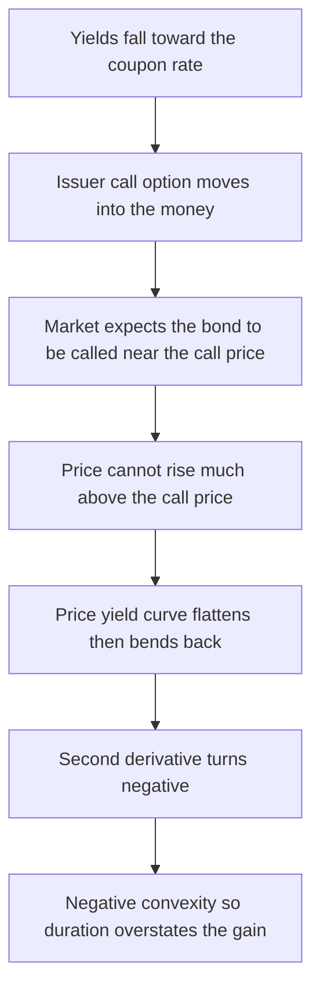

# Chapter 08 — Convexity

## 1. The Problem / The Need

Chapter 7 gave us duration — a single number that translates a change in yield into an approximate change in price. Modified duration says: *for a small move in yield, the bond's price moves by roughly minus-duration-times-the-yield-change.* It is the workhorse of every rates desk, the first-order sensitivity that lets a portfolio manager hedge a book, size a trade, or state a P&L exposure in one figure.

But "roughly" and "for a small move" are load-bearing words, and they conceal a systematic error. Duration is a *straight-line* approximation to a *curved* relationship. The true price-yield relationship of a bond is not a line — it bends. And it bends in a very particular, consistent direction: the actual price is almost always *higher* than the straight-line duration estimate predicts, whether yields rise or fall. Duration, used alone, **overstates the loss** when yields rise and **understates the gain** when yields fall. It is wrong in the bondholder's favour — but wrong nonetheless, and increasingly wrong the larger the yield move.

For a 10-basis-point wiggle this error is a rounding footnote. For a 100- or 200-basis-point move — the kind that happens in a rate-hike cycle, a credit event, or a stress test — the error becomes material, tens of cents on a par of 100, real money on a billion-dollar book. Worse, some bonds curve the *wrong* way over part of their range: callable bonds and mortgage-backed securities can have their price gains *choked off* as yields fall, so that duration *overstates* the gain. A risk manager who models these with duration alone will be blindsided precisely when it matters.

We need a second-order correction — a number that captures the *curvature* of the price-yield relationship, tells us how fast duration itself changes as yields move, and lets us build a materially better price-change estimate. That number is **convexity**. This chapter defines it, derives it, computes it, shows how to combine it with duration, and dissects the crucial distinction between *positive* convexity (plain bonds, your friend) and *negative* convexity (callables and MBS, your enemy).

## 2. The Core Idea

The price of a bond is a function of its yield: $P(y)$. Discounting each cash flow by $(1+y)^{-t}$ makes this function *convex* — it curves upward, like the inside of a bowl. As yield falls, price rises at an *accelerating* rate; as yield rises, price falls at a *decelerating* rate. The slope of this curve is (proportional to) duration, and the crucial fact is that the slope is not constant: it steepens as yields fall and flattens as yields rise.

Mathematically, expand price as a Taylor series in yield around the current yield $y_0$:

$$\Delta P = \frac{dP}{dy}\,\Delta y + \frac{1}{2}\frac{d^2P}{dy^2}\,(\Delta y)^2 + \text{higher-order terms}$$

- The **first derivative** $\frac{dP}{dy}$ is the source of **duration** — the linear, first-order term.
- The **second derivative** $\frac{d^2P}{dy^2}$ is the source of **convexity** — the curvature, second-order term.

Duration alone keeps only the first term: a straight tangent line. Convexity adds the second term: a parabola that hugs the true curve far more closely. Because for an option-free bond the second derivative is *positive*, the convexity term is *always positive* (it carries $(\Delta y)^2$, which is positive whether $\Delta y$ is up or down). That is exactly why the curvature correction *adds* to the duration estimate in both directions — pushing the estimate up toward the true price, which lies above the tangent line.

*Figure 1 — Why the straight-line duration estimate always sits below the true convex price curve.*

## 3. Why / How It Works

**Why the price-yield curve is convex.** Take the price of an option-free bond as the sum of discounted cash flows:

$$P(y) = \sum_{t=1}^{n} \frac{C_t}{(1+y)^{t}}$$

Differentiate once:

$$\frac{dP}{dy} = -\sum_{t=1}^{n} \frac{t\,C_t}{(1+y)^{t+1}} \; < 0$$

The first derivative is negative — price falls as yield rises, the familiar inverse relationship, and its magnitude is what duration measures. Differentiate again:

$$\frac{d^2P}{dy^2} = \sum_{t=1}^{n} \frac{t(t+1)\,C_t}{(1+y)^{t+2}} \; > 0$$

Every term in this sum is positive (all cash flows $C_t$, times, and discount factors are positive). So the second derivative is strictly positive for any bond with positive cash flows. A positive second derivative *is* the definition of a convex function. This is not a special property of some bonds — it is a structural fact of discounting: pushing a fixed cash flow further into a compounding denominator makes the price fall by less and less for each additional unit of yield.

**Why duration alone is biased.** The tangent line at $y_0$ has the right *slope* but the wrong *shape*. A convex curve always lies *above* its tangent line everywhere except at the point of tangency. So the true price is above the duration line for any $\Delta y \neq 0$. When yields rise, the true price falls but stays above the tangent, meaning the actual loss is *smaller* than duration predicts. When yields fall, the true price rises above the tangent, meaning the actual gain is *larger* than duration predicts. The error is one-signed (always in the holder's favour for option-free bonds) and grows with $(\Delta y)^2$ — quadratically — which is why it explodes for large moves.

**Why convexity is a desirable property.** Because the correction is positive in *both* directions, a more convex bond gains more when yields fall and loses less when yields rise than a less convex bond of the *same* duration. Convexity is a free "heads I win more, tails I lose less" feature. In an efficient market you pay for it: high-convexity bonds trade at slightly richer prices (lower yields) than low-convexity bonds of identical duration. Convexity is worth most when yields are *volatile*, because its payoff scales with $(\Delta y)^2$ — it is, in effect, a long-volatility position embedded in the bond's math.

**What drives convexity higher or lower.** Three levers move a bond's convexity, holding duration fixed. First, **maturity**: longer bonds have more convexity because the $t(t+1)$ weighting in the numerator grows quadratically with the timing of cash flows — distant payments contribute disproportionately to curvature. Second, **coupon**: lower-coupon bonds (and especially zeros) have *more* convexity for a given duration, because their cash flows are more concentrated at the far end where curvature is greatest. Third, **cash-flow dispersion**: a portfolio whose payments are spread out (a barbell) is more convex than one whose payments are bunched (a bullet) of the same duration — dispersion around the duration point is, quite literally, what convexity measures. This last fact is why "barbells out-convex bullets" is a desk cliché: the barbell's early and late cash flows both sit far from the duration midpoint, maximising the second moment of the timing distribution.

*Figure 2 — Deciding whether a bond has positive or negative convexity.*

## 4. Full Content — Formulas and Bond Math

### 4.1 The convexity measure

Convexity is defined as the *second derivative of price with respect to yield, scaled by price*:

$$\text{Convexity} = \frac{1}{P}\cdot\frac{d^2P}{dy^2}$$

For a bond priced with periodic yield, the closed-form (annual compounding, cash flows at times $t = 1, 2, \dots, n$) is:

$$\text{Convexity} = \frac{1}{P\,(1+y)^{2}}\sum_{t=1}^{n} \frac{t(t+1)\,C_t}{(1+y)^{t}}$$

Equivalently, writing the $(1+y)^{t+2}$ directly in the denominator:

$$\text{Convexity} = \frac{1}{P}\sum_{t=1}^{n} \frac{t(t+1)\,C_t}{(1+y)^{t+2}}$$

**Compounding frequency.** If the bond pays $m$ times per year, define everything in periods (periodic yield $y/m$, period count $t = 1 \dots n\cdot m$), then divide the periodic convexity by $m^2$ to annualise:

$$\text{Convexity}_{\text{annual}} = \frac{\text{Convexity}_{\text{periodic}}}{m^{2}}$$

The $m^2$ (not $m$) appears because convexity is a *second*-order term — it scales with the square of the period length, mirroring how modified duration divides by $m$ once.

### 4.2 The effective (finite-difference) convexity

When a bond has embedded options (so cash flows themselves depend on yield), you cannot differentiate a fixed cash-flow formula. Instead, reprice the bond under a valuation model at three yields — down by $\Delta y$, unchanged, up by $\Delta y$ — and use a numerical second difference:

$$\text{Effective Convexity} = \frac{V_{-} + V_{+} - 2V_0}{V_0\,(\Delta y)^{2}}$$

where $V_0$ is the base price, $V_+$ the price after yields rise by $\Delta y$, and $V_-$ the price after yields fall by $\Delta y$. The companion effective duration is:

$$\text{Effective Duration} = \frac{V_{-} - V_{+}}{2\,V_0\,\Delta y}$$

For an option-free bond the effective and closed-form measures agree (up to a tiny discretisation error). For callables and MBS, $V_+$ and $V_-$ come from an option-adjusted-spread (OAS) model that lets the cash flows change, and the effective convexity can come out *negative*.

### 4.3 Combining duration and convexity — the price-change formula

The second-order Taylor expansion, divided through by price, gives the estimated *percentage* price change:

$$\boxed{\;\frac{\Delta P}{P} \approx -D_{\text{mod}}\cdot \Delta y \;+\; \tfrac{1}{2}\cdot \text{Convexity}\cdot (\Delta y)^{2}\;}$$

- The first term is the **duration effect** — linear, signed (down for a rise, up for a fall).
- The second term is the **convexity adjustment** — always positive for positive-convexity bonds, always negative for negative-convexity bonds, and quadratic in the yield move.

Some texts and systems quote a "convexity" that already folds in the factor of $\tfrac12$, or that is scaled by 100 or 10,000. Always check the convention: does your reported number, multiplied by $(\Delta y)^2$, need a further $\tfrac12$ or not? The math is unambiguous; only the bookkeeping differs.

### 4.4 Dollar duration and dollar convexity

For P&L and hedging in currency terms rather than percentages:

$$\Delta P \approx -\big(D_{\text{mod}}\cdot P\big)\,\Delta y \;+\; \tfrac{1}{2}\big(\text{Convexity}\cdot P\big)(\Delta y)^2$$

The bracketed quantities are *dollar duration* (also called DV01 when scaled to a 1-bp move) and *dollar convexity* — the sensitivities in monetary units, which is what actually hits the book.

### 4.5 Positive vs negative convexity

| Property | Positive convexity (option-free, putable) | Negative convexity (callable, MBS) |
|---|---|---|
| Sign of second derivative | Positive throughout | Negative over part of the yield range |
| Price-yield shape | Bows toward the origin, always above tangent | Flattens or bends back as yields fall |
| When yields fall a lot | Price rises at an accelerating rate | Price gain is capped near the call price |
| Convexity adjustment term | Adds to the duration estimate | Subtracts from the duration estimate |
| Value to investor | Desirable, worth paying for | Undesirable, investor demands higher yield |
| Duration behaviour | Duration rises as yields fall | Duration *shortens* as yields fall (call more likely) |

**Why callables and MBS go negatively convex.** A callable bond is a straight bond *minus* a call option the investor has sold to the issuer. As yields fall, the issuer's option to refinance moves into the money; the bond's upside is truncated near the call price because the market knows it will likely be called. The price-yield curve, instead of continuing to bow upward, flattens and rolls over — "price compression." Mortgage-backed securities inherit the same shape because homeowners hold a prepayment option: when rates fall they refinance, handing the MBS holder cash exactly when reinvestment is worst. Over the low-yield region these instruments exhibit a *negative* second derivative, so the convexity adjustment *subtracts*, and duration *overstates* the price gain.

*Figure 3 — Price compression turns a callable bond negatively convex at low yields.*

## 5. Worked Examples

### 5.1 Setup — a clean option-free bond

Take a **5-year bond, 5% annual coupon, face 100, priced to yield 5%**. Because coupon equals yield, it prices at par: $P_0 = 100$. Cash flows are 5 at years 1–4 and 105 at year 5.

**Step 1 — Modified duration (analytical).** Compute Macaulay duration first, $D_{\text{mac}} = \frac{1}{P}\sum t\cdot \text{PV}(C_t)$.

| $t$ | $C_t$ | $(1.05)^{-t}$ | $\text{PV}(C_t)$ | $t\cdot\text{PV}$ |
|---|---|---|---|---|
| 1 | 5 | 0.952381 | 4.761905 | 4.761905 |
| 2 | 5 | 0.907029 | 4.535147 | 9.070295 |
| 3 | 5 | 0.863838 | 4.319188 | 12.957565 |
| 4 | 5 | 0.822702 | 4.113513 | 16.454051 |
| 5 | 105 | 0.783526 | 82.270247 | 411.351237 |
| **Sum** | | | **100.000000** | **454.595054** |

$$D_{\text{mac}} = \frac{454.595054}{100} = 4.545951 \text{ years}, \qquad D_{\text{mod}} = \frac{4.545951}{1.05} = 4.329478$$

**Step 2 — Convexity (analytical).** Use $\text{Convexity} = \dfrac{1}{P(1+y)^2}\sum t(t+1)C_t(1+y)^{-t}$.

| $t$ | $t(t+1)$ | $C_t$ | $t(t+1)C_t(1.05)^{-t}$ |
|---|---|---|---|
| 1 | 2 | 5 | 9.523810 |
| 2 | 6 | 5 | 27.210884 |
| 3 | 12 | 5 | 51.830256 |
| 4 | 20 | 5 | 82.270247 |
| 5 | 30 | 105 | 2468.107423 |
| **Sum** | | | **2638.942620** |

$$\text{Convexity} = \frac{2638.942620}{100\times(1.05)^2} = \frac{2638.942620}{110.25} = 23.9360$$

So $D_{\text{mod}} = 4.3295$ and Convexity $= 23.936$.

### 5.2 A 100-bp rise in yield — duration alone vs duration-plus-convexity

Reprice exactly at $y = 6\%$: 
$$P_+ = 5\cdot\frac{1-(1.06)^{-5}}{0.06} + 100\,(1.06)^{-5} = 21.061819 + 74.725817 = 95.787636$$

**Actual change:** $95.787636 - 100 = -4.212364$, i.e. $-4.2124\%$.

**Duration-only estimate:** $-D_{\text{mod}}\,\Delta y = -4.329478 \times 0.01 = -4.329478\%$.

**Convexity adjustment:** $\tfrac12\times 23.936\times(0.01)^2 = 0.5\times23.936\times0.0001 = +0.119680\%$.

**Combined estimate:** $-4.329478 + 0.119680 = -4.209798\%$.

| Method | Estimated $\Delta P/P$ | Error vs actual $-4.21236\%$ |
|---|---|---|
| Duration only | $-4.32948\%$ | $-0.11711\%$ (overstates loss) |
| Duration + convexity | $-4.20980\%$ | $+0.00256\%$ (near-exact) |

Duration alone overstates the loss by about 12 cents per 100 face; adding convexity cuts the residual error to about a quarter of a *basis point* of price. **Reconciles.**

### 5.3 A 100-bp fall in yield — the correction flips to the upside

Reprice at $y = 4\%$: 
$$P_- = 5\cdot\frac{1-(1.04)^{-5}}{0.04} + 100\,(1.04)^{-5} = 22.259109 + 82.192713 = 104.451822$$

**Actual change:** $+4.451822\%$.

**Duration-only:** $-4.329478\times(-0.01) = +4.329478\%$.

**Convexity adjustment:** $\tfrac12\times23.936\times(0.01)^2 = +0.119680\%$ (still positive — $(\Delta y)^2$ is positive either way).

**Combined:** $+4.329478 + 0.119680 = +4.449158\%$.

| Method | Estimated $\Delta P/P$ | Error vs actual $+4.45182\%$ |
|---|---|---|
| Duration only | $+4.32948\%$ | $-0.12234\%$ (understates gain) |
| Duration + convexity | $+4.44916\%$ | $-0.00266\%$ (near-exact) |

Note the symmetry: on the way up duration *understated* the gain, on the way down it *overstated* the loss — the same convexity term $+0.1197\%$ fixes both, because it is always additive for a positive-convexity bond. **Reconciles.**

### 5.4 A large 200-bp move — where convexity earns its keep

Now push the yield to $y = 7\%$ (a 200-bp rise):
$$P = 5\cdot\frac{1-(1.07)^{-5}}{0.07} + 100\,(1.07)^{-5} = 20.500987 + 71.298618 = 91.799605$$

**Actual change:** $-8.200395\%$.

**Duration-only:** $-4.329478\times0.02 = -8.658955\%$.

**Convexity adjustment:** $\tfrac12\times23.936\times(0.02)^2 = 0.5\times23.936\times0.0004 = +0.478726\%$.

**Combined:** $-8.658955 + 0.478726 = -8.180229\%$.

| Method | Estimated $\Delta P/P$ | Error vs actual $-8.20040\%$ |
|---|---|---|
| Duration only | $-8.65895\%$ | $-0.45856\%$ (overstates loss badly) |
| Duration + convexity | $-8.18023\%$ | $+0.02016\%$ (small residual) |

At 200 bp the duration-only error has ballooned to nearly *half a percent of price* — four times the 100-bp error, exactly as the quadratic scaling predicts. Convexity slashes it to two basis points. The residual is the third-order term, which duration-plus-convexity still omits. **Reconciles, and demonstrates the quadratic growth of the pure-duration error.**

### 5.5 A negatively convex callable — effective measures go the other way

Now take a **callable** version of a bond, valued under a model, callable at 101. Suppose an OAS model returns these prices for a base yield of 5% and a $\Delta y = 100$ bp: $V_0 = 100.20$, and — critically — as yields fall the price is *capped* near the call price while as yields rise it behaves normally.

| Scenario | Yield | Modelled price $V$ |
|---|---|---|
| Yields fall 100 bp | 4% | $V_- = 100.85$ |
| Base | 5% | $V_0 = 100.20$ |
| Yields rise 100 bp | 6% | $V_+ = 96.30$ |

Notice the asymmetry: on the downside the price rose only 0.65 (call compression bites), while on the upside it fell a full 3.90. Compute the effective measures:

$$\text{Effective Duration} = \frac{V_- - V_+}{2V_0\,\Delta y} = \frac{100.85 - 96.30}{2\times100.20\times0.01} = \frac{4.55}{2.004} = 2.271$$

$$\text{Effective Convexity} = \frac{V_- + V_+ - 2V_0}{V_0(\Delta y)^2} = \frac{100.85 + 96.30 - 200.40}{100.20\times(0.01)^2} = \frac{-3.25}{0.01002} = -324.4$$

The convexity is **strongly negative**. Apply the combined formula to a 100-bp rally ($\Delta y = -0.01$):

- Duration effect: $-2.271\times(-0.01) = +2.271\%$
- Convexity adjustment: $\tfrac12\times(-324.4)\times(0.01)^2 = -1.622\%$
- Combined estimate: $+2.271 - 1.622 = +0.649\%$, i.e. a price of about $100.20\times1.00649 = 100.85$ — matching $V_-$.

Here the negative convexity term *subtracts* 1.62%, choking the rally gain from the 2.27% that duration alone would promise down to the true 0.65%. A trader who hedged this bond on duration alone would have thought a rate rally was worth 2.3% and been stunned to collect only 0.6% — the missing 1.6% is the short-gamma cost of the embedded call. **Reconciles, and shows negative convexity subtracting.**

### 5.6 Cross-check — effective (finite-difference) measures on the plain bond

Using the repriced values $V_- = 104.451822$ (at 4%), $V_0 = 100$, $V_+ = 95.787636$ (at 6%), $\Delta y = 0.01$:

$$\text{Effective Duration} = \frac{104.451822 - 95.787636}{2\times100\times0.01} = \frac{8.664186}{2} = 4.33209$$

$$\text{Effective Convexity} = \frac{104.451822 + 95.787636 - 200}{100\times(0.01)^2} = \frac{0.239458}{0.01} = 23.9458$$

The finite-difference figures (4.3321 and 23.9458) match the analytical ones (4.3295 and 23.9360) to within a fraction of a percent — the tiny gap is discretisation error, itself a convexity effect on the duration estimate. **Both methods reconcile.**

## 6. Connections

- **Duration (Ch. 7)** is the first-order term; convexity is the second-order term of the *same* Taylor expansion. They are not rivals — they are consecutive coefficients of one series. You cannot understand convexity without duration, and you should never quote a large-move price change from duration without the convexity companion.
- **Spot and forward rates (Ch. 5) / term structure (Ch. 6):** modified duration and convexity assume a *parallel* shift in a single yield. Real curves twist and butterfly. Key-rate durations and key-rate convexities generalise these measures to non-parallel moves, but the local curvature intuition here is the foundation.
- **Embedded options (callables, putables, MBS):** convexity is where the option's gamma leaks into the bond's price behaviour. Negative convexity is literally short option gamma; the OAS framework exists to price exactly this. A mortgage trader's whole day is managing negative convexity.
- **Options and the Greeks:** duration is the bond analogue of an option's *delta*; convexity is the analogue of *gamma*. "Long convexity" and "long gamma" describe the same long-volatility payoff — you profit from large moves in either direction.
- **Immunisation and ALM:** matching duration alone immunises a portfolio against small parallel shifts; matching convexity as well makes the hedge robust to larger moves, which is why insurers and pension funds track both.
- **Barbell vs bullet:** two portfolios with identical duration can have very different convexity. A barbell (short + long bonds) has *more* convexity than a duration-matched bullet (single intermediate maturity) — the classic demonstration that convexity is a free lunch you pay for in yield give-up.

## 7. Key Terms

- **Convexity:** the second derivative of price with respect to yield, scaled by price; measures the curvature of the price-yield relationship.
- **Convexity adjustment:** the $\tfrac12\cdot\text{Convexity}\cdot(\Delta y)^2$ term added to the duration estimate to correct for curvature.
- **Positive convexity:** price-yield curve bows upward everywhere; the correction is always additive; characteristic of option-free and putable bonds.
- **Negative convexity:** price-yield curve flattens or bends back over part of its range; the correction subtracts; characteristic of callable bonds and MBS.
- **Effective convexity:** convexity computed by repricing under a model at yields up, down, and unchanged — required when cash flows depend on yield.
- **Price compression:** the flattening of a callable bond's price near the call price as yields fall, the mechanism producing negative convexity.
- **Dollar convexity:** convexity times price — the curvature sensitivity in currency units, used in P&L attribution.
- **Gamma (analogy):** the options-world name for the same second-order sensitivity; long convexity equals long gamma.

## 8. Common Confusions

**"Higher convexity is always better, full stop."** Higher convexity is always *desirable to hold*, but it is not *free* — the market charges for it via a lower yield. The trade-off is real: in a low-volatility environment you may be overpaying for curvature you never get to use. Convexity's payoff scales with $(\Delta y)^2$, so it only pays off when yields actually move a lot.

**"Convexity is a correction to duration's number."** No — convexity does not fix a *wrong duration*; duration is correct as the exact slope. Convexity is a *separate, additional* term capturing what the linear approximation structurally cannot: curvature. Both can be exactly right and the estimate still needs both terms.

**"The convexity term can be negative because $\Delta y$ is negative."** The convexity term carries $(\Delta y)^2$, which is non-negative regardless of the direction of the yield move. The term's sign comes from the *convexity measure* itself, not from $\Delta y$. For option-free bonds it is always additive; only negative-convexity instruments make it subtract.

**"Callable bonds always have negative convexity."** Only in the *low-yield* region where the call is near the money. At high yields, far from the call, a callable behaves like a straight bond with ordinary positive convexity. Negativity is local, not global.

**"Duration and convexity give the exact price."** They give a *second-order* estimate. A residual remains from third- and higher-order terms, visible in the 200-bp example (two-bp leftover). For an exact answer you reprice from the cash-flow formula; duration-plus-convexity is a fast, portable *approximation*.

**"Convexity has intuitive units like years."** Duration has a clean "years" interpretation; convexity's raw units are "years-squared" and are not intuitively meaningful. Treat it as a pure scaling constant in the price-change formula, and always confirm whether the $\tfrac12$ and any $\times100$ scaling are already baked in.

## 9. Recap

The price-yield relationship of a bond is convex because discounting produces a positive second derivative — every cash flow's present value bends the curve upward. Duration, the first-order slope, approximates price changes with a straight tangent line, but a convex curve always sits above its tangent. So duration alone **overstates losses when yields rise and understates gains when yields fall**, with an error that grows with the *square* of the yield move — negligible for small wiggles, material for 100–200-bp shocks.

Convexity is the scaled second derivative that quantifies this curvature. Adding the term $\tfrac12\cdot\text{Convexity}\cdot(\Delta y)^2$ to the duration estimate produces a far tighter approximation: in our worked 5-year par bond, duration alone missed a 100-bp move by about 12 cents, while duration-plus-convexity missed by a quarter of a basis point, and at 200 bp it cut a 46-cent error to 2 cents. For option-free bonds the correction is always *additive* — convexity is a desirable, volatility-loving property investors pay for. For callable bonds and MBS, price compression from the issuer's or homeowner's option flips convexity *negative* in the low-yield region, the correction *subtracts*, and duration *overstates* the gain — the trap that makes these instruments dangerous to model with duration alone.

## 10. Quick-Reference / Interview Points

- **Convexity measure:** $\dfrac{1}{P}\dfrac{d^2P}{dy^2} = \dfrac{1}{P(1+y)^2}\sum_t \dfrac{t(t+1)C_t}{(1+y)^t}$.
- **Combined price change:** $\dfrac{\Delta P}{P} \approx -D_{\text{mod}}\,\Delta y + \tfrac12\,\text{Convexity}\,(\Delta y)^2$.
- **Effective convexity:** $\dfrac{V_- + V_+ - 2V_0}{V_0(\Delta y)^2}$ — use when cash flows depend on yield (options).
- **Sign intuition:** convexity term is *always positive* for option-free bonds (carries $(\Delta y)^2$); it *adds* on both a rise and a fall.
- **Duration's bias:** overstates loss on a rise, understates gain on a fall — always in the holder's favour for positive convexity.
- **Error scaling:** duration-only error grows with $(\Delta y)^2$; double the yield move, quadruple the error.
- **Positive convexity** = option-free and putable bonds; **negative convexity** = callables and MBS at low yields (price compression).
- **Convexity ≈ gamma; duration ≈ delta.** Long convexity = long volatility: gain more up, lose less down.
- **It's not free:** higher-convexity bonds yield less; a barbell out-convexes a duration-matched bullet but gives up yield.
- **Annualisation:** divide periodic convexity by $m^2$ (duration divides by $m$) for $m$ payments per year.
- **One-liner for the desk:** "Duration tells me where I am; convexity tells me how fast that's changing — and for callables it's changing the wrong way when rates rally."
