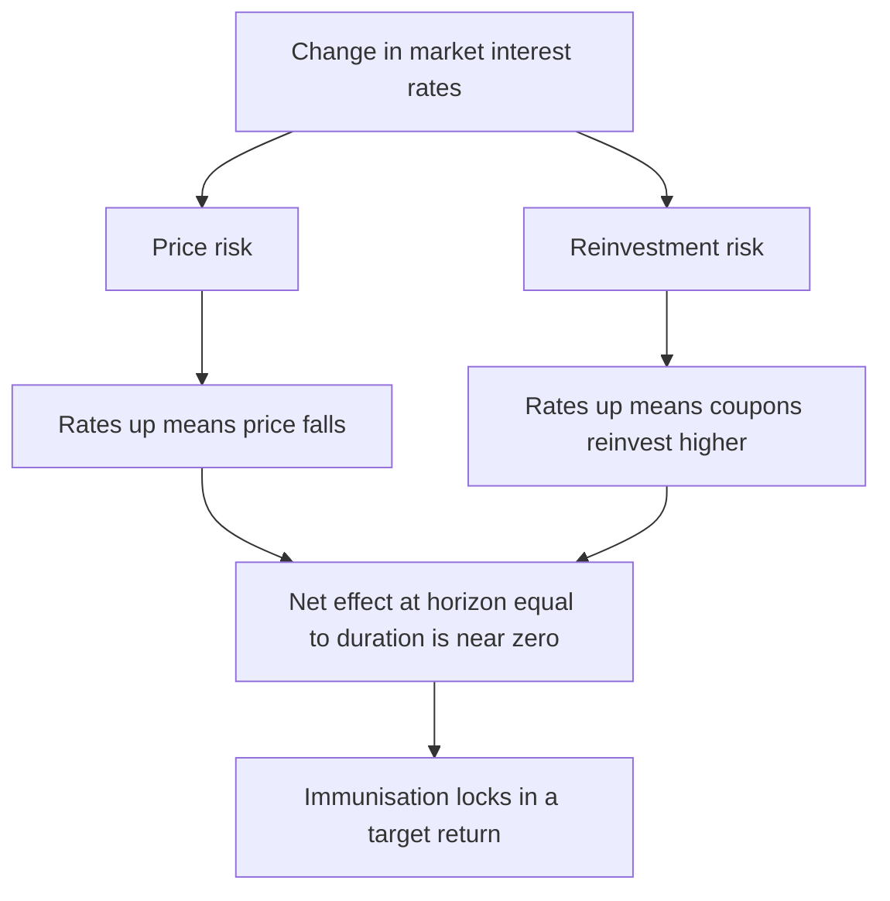
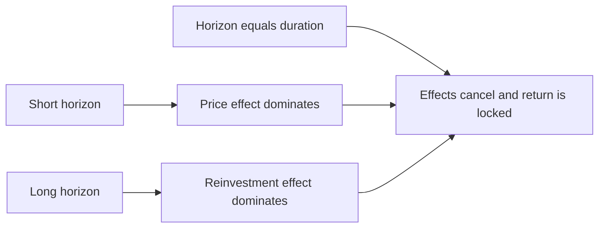
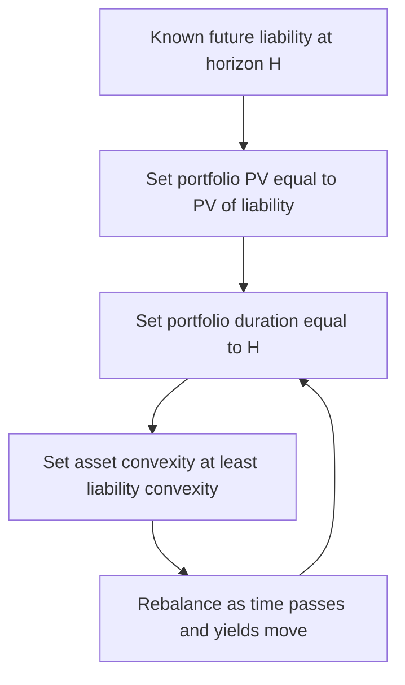

# Chapter 09 — Interest Rate Risk

## 1. The Problem / The Need

A bond is a promise to pay fixed cash flows on fixed dates. That word *fixed* is the whole story — and the whole problem. The coupons are locked, the face value is locked, but the **discount rate** the market applies to those cash flows is not. It floats every second in response to central-bank policy, inflation prints, supply-demand for capital, and shifting risk appetite. Because a bond's price is nothing more than the present value of a fixed stream discounted at a moving rate, the price must move — inversely — whenever rates move.

For a finance professional this is not an abstraction; it is the single largest source of profit-and-loss on the vast majority of fixed-income books. Consider three real situations:

- A bank funds a 10-year mortgage portfolio with overnight deposits. If short rates jump, its funding cost repricess immediately while its asset yield is locked. This duration mismatch is exactly what killed Silicon Valley Bank in 2023.
- A pension fund owes retirees roughly level payments for 30 years. If rates fall, the present value of what it *owes* balloons faster than the value of the bonds it *holds*. The fund can be "fully funded" one quarter and in deficit the next without a single default.
- A trader is long a 30-year bond into a Fed meeting. A surprise 25 bp hike can wipe out a year of carry in an afternoon.

In every case the driver is the same: **the sensitivity of value to interest rates.** Interest rate risk is the discipline of *measuring* that sensitivity precisely, *decomposing* it into its sources, and *managing* it deliberately rather than accidentally. This chapter builds the toolkit — duration, convexity, key-rate durations, immunisation — from the ground up, with the arithmetic worked out so you can reproduce it in an interview or on a desk.

## 2. The Core Idea

Interest rate risk splits cleanly into **two opposing forces**, and almost everything in this chapter is a variation on how they interact.

1. **Price risk (market risk).** If rates rise, the price of a bond you hold falls. If you must sell before maturity, you realise a loss. This hurts you when rates *rise*.

2. **Reinvestment risk.** The coupons you receive must be reinvested at whatever rate prevails when they arrive. If rates fall, you reinvest at lower rates and your realised return disappoints. This hurts you when rates *fall*.

These two risks pull in **opposite directions**. A rate rise is bad for price but good for reinvestment; a rate fall is good for price but bad for reinvestment. The profound insight — the mathematical heart of the chapter — is that at one special horizon the two effects **exactly cancel**. That horizon is the bond's **(Macaulay) duration**. Hold a bond to its duration and, to a first approximation, a one-time change in yield leaves your realised return unchanged. This is the principle of **immunisation**.

*Figure 1 — the two-sided nature of interest-rate risk.*

The rest of the chapter makes this precise: how big is the price move (duration and convexity), why the offset works (the algebra of the two effects), and how to engineer portfolios where the offset protects a liability (duration matching and key-rate durations).

## 3. Why / How It Works

### Why price moves inversely with yield

A bond's price is
$$P = \sum_{t=1}^{n} \frac{CF_t}{(1+y)^t}$$
where $CF_t$ is the cash flow at time $t$ and $y$ is the yield per period. Every term has $y$ in the denominator, so raising $y$ shrinks every term — price falls. This is not a behavioural or supply story; it is arithmetic. The *magnitude* of the fall depends on how far in the future the cash flows sit: distant cash flows are discounted by a higher power of $(1+y)$, so they are more sensitive. Long bonds and low-coupon bonds (whose value is weighted toward the distant principal) move most.

### Why the two risks offset

Split total return into two buckets. Suppose you buy a bond at yield $y_0$ and rates jump once to $y_1 > y_0$ immediately after purchase, then stay there.

- **Coupons reinvest at the higher rate** $y_1$. The reinvestment "pot" grows *faster* than originally expected. The longer you hold, the more this compounding helps — the benefit *increases* with your horizon.
- **The bond's price is depressed** by the higher yield. But as the bond ages toward maturity, its price "pulls to par" — the price penalty *shrinks* to zero as maturity approaches. The loss on sale *decreases* with your horizon.

One effect grows with horizon, the other shrinks. They must cross. The crossing point — where the extra reinvestment income exactly makes up the depressed sale price — is the **Macaulay duration**. Before that horizon you are net exposed to price risk (sell early, reinvestment hasn't compounded enough); after it you are net exposed to reinvestment risk (price has recovered but you've lived through low reinvestment rates for years if rates fell).

*Figure 2 — the crossover that defines duration.*

### Why duration is a "balance point"

Macaulay duration is literally the **present-value-weighted average time** to receive the bond's cash flows — the centre of mass of the cash-flow timeline. That is why it behaves like a fulcrum: it is the point where the "torque" of early cash flows (reinvestment) balances the "torque" of late cash flows (price). The same number that measures price sensitivity also measures the break-even holding period. That is not a coincidence; it falls straight out of differentiating the price equation, as we show next.

## 4. Full Content — Formulas and Bond Math

### 4.1 Sources of interest rate risk

Regulators and practitioners typically decompose interest rate risk into several distinct sources:

| Source | What it is | Example |
|---|---|---|
| **Level (yield) risk** | Parallel up/down shift of the whole curve | Fed hikes; all yields +50 bp |
| **Reinvestment risk** | Uncertainty about the rate at which coupons/principal are reinvested | Falling rates erode a bond ladder's income |
| **Price / market risk** | Capital loss if sold before maturity after a yield rise | Marked-to-market loss on a trading book |
| **Yield-curve (twist) risk** | Non-parallel reshaping — steepening, flattening, butterfly | 2s10s flattens; a barbell underperforms a bullet |
| **Basis risk** | Two rates that normally move together diverge | Swap spread widens vs Treasuries |
| **Optionality risk** | Embedded options reshape sensitivity as rates move | Callable bond's negative convexity; MBS prepayment |

Price risk and reinvestment risk are the two we focus on because they are the pair that *offsets*; yield-curve risk is why we need key-rate durations; optionality is why we need effective (option-adjusted) duration.

### 4.2 Macaulay duration

$$D_{Mac} = \frac{\sum_{t=1}^{n} t \cdot \dfrac{CF_t}{(1+y)^t}}{P} = \sum_{t=1}^{n} t \cdot w_t, \qquad w_t = \frac{CF_t/(1+y)^t}{P}$$

It is the weighted-average time to cash flows, in periods (divide by frequency to get years). The weights $w_t$ are the fraction of the bond's price contributed by each cash flow and sum to 1.

### 4.3 Modified duration — the price-sensitivity measure

Differentiate the price equation with respect to $y$:
$$\frac{dP}{dy} = -\sum_{t=1}^{n} \frac{t \cdot CF_t}{(1+y)^{t+1}} = -\frac{1}{1+y}\sum_{t=1}^{n} \frac{t \cdot CF_t}{(1+y)^{t}}$$
Divide by $P$ and identify Macaulay duration:
$$\frac{1}{P}\frac{dP}{dy} = -\frac{D_{Mac}}{1+y} \equiv -D_{Mod}$$
So
$$\boxed{D_{Mod} = \frac{D_{Mac}}{1+y/k}}$$
where $k$ is the number of compounding periods per year (and $y$ is the annual yield). Modified duration gives the **percentage price change per unit change in yield**:
$$\frac{\Delta P}{P} \approx -D_{Mod}\cdot \Delta y$$

### 4.4 Dollar duration, DV01, PVBP

- **Dollar duration** $= D_{Mod}\times P$ (the price change per 1.00 change in yield, i.e. per 100%).
- **DV01 (PVBP)** — dollar value of a basis point — is the practitioner's workhorse:
$$\text{DV01} = D_{Mod}\times P \times 0.0001$$
It is the P&L from a 1 bp yield move on the given position size. Traders hedge by matching DV01s, not durations.

### 4.5 Convexity — the second-order correction

Modified duration is a straight-line (first derivative) estimate; the true price-yield curve is convex. The second derivative captures the curvature:
$$C = \frac{1}{P}\frac{d^2P}{dy^2} = \frac{1}{P}\sum_{t=1}^{n} \frac{t(t+1)\,CF_t}{(1+y)^{t+2}}$$
The second-order Taylor expansion of the price change is
$$\boxed{\frac{\Delta P}{P} \approx -D_{Mod}\,\Delta y + \tfrac{1}{2}C\,(\Delta y)^2}$$
Convexity is always **positive for an option-free bond**, so it *adds* value: duration overstates the loss when rates rise and understates the gain when rates fall. Convexity is a friend — you are paid (in lower yield) to give it up, and you pay (in higher yield) to own more of it. Barbells have more convexity than duration-matched bullets.

### 4.6 The immunisation condition

To immunise a single liability of amount $L$ due at time $H$:

1. **Match present values**: $P_{\text{assets}} = PV(L)$.
2. **Match durations**: $D_{\text{assets}} = H$ (set portfolio Macaulay duration equal to the horizon).
3. Ideally **minimise / match convexity** (dispersion) so the immunisation survives non-parallel shifts, with asset convexity slightly ≥ liability convexity.

At $H = D$, the derivative of realised horizon wealth with respect to yield is zero — the price and reinvestment effects offset to first order. The strategy is **rebalanced** periodically because duration drifts as time passes and as yields change (duration falls more slowly than calendar time, so the two go out of sync).

*Figure 3 — the immunisation decision.*

### 4.7 Duration of a portfolio

Portfolio duration is the **market-value-weighted average** of the component durations:
$$D_P = \sum_i \frac{MV_i}{MV_{\text{total}}}\,D_i$$
This linearity is what makes duration such a practical control variable: you steer a whole book's rate sensitivity by adjusting weights.

### 4.8 Key-rate (partial) durations

Portfolio duration assumes a **parallel** shift. Real curves twist. A **key-rate duration** $KRD_i$ measures the price sensitivity to a 1 bp shift in **one** key maturity (say the 2-year point) while all other key rates are held fixed:
$$KRD_i = -\frac{1}{P}\frac{\Delta P}{\Delta r_i}$$
Two important properties:
$$\sum_i KRD_i = D_{\text{eff}} \qquad\text{and}\qquad \frac{\Delta P}{P} \approx -\sum_i KRD_i \,\Delta r_i$$
The key-rate durations sum to the total effective duration, but they let you see *where* on the curve the risk lives. A bullet has its KRD concentrated at one maturity; a barbell spreads KRDs to the wings. Two portfolios can have identical total duration yet completely different KRD profiles — and therefore behave very differently under a steepener or flattener. This is precisely the yield-curve risk that a single duration number hides.

### 4.9 Effective duration (for bonds with options)

When cash flows themselves depend on rates (callables, putables, MBS), you cannot use the analytic formula. Instead re-price under a small parallel shift up and down using a model, and take the numerical derivative:
$$D_{\text{eff}} = \frac{P_{-}-P_{+}}{2\,P_0\,\Delta y}, \qquad C_{\text{eff}} = \frac{P_{-}+P_{+}-2P_0}{P_0\,(\Delta y)^2}$$
Callable bonds exhibit **negative convexity** near the call: as rates fall the call caps the upside, so the price-yield curve bends the wrong way.

## 5. Worked Examples

### Example 1 — Duration, convexity, and a reconciling price prediction

**Bond:** 3-year, 8% annual coupon, face 100, priced to yield 6%.

**Step 1 — Price.** Discount the cash flows (8, 8, 108) at 6%.

| t | CF | 1/(1.06)^t | PV = CF×DF | t×PV | t(t+1)×CF/(1.06)^(t+2) |
|---|----|-----------|-----------|------|------------------------|
| 1 | 8 | 0.943396 | 7.54717 | 7.54717 | 1·2·8/1.06³ = 13.4344 |
| 2 | 8 | 0.889996 | 7.11997 | 14.23994 | 2·3·8/1.06⁴ = 38.0217 |
| 3 | 108 | 0.839619 | 90.67891 | 272.03674 | 3·4·108/1.06⁵ = 968.377 |
| **Σ** | | | **105.34605** | **293.82385** | **1019.833** |

Price $P = 105.3461$ (a premium bond, since 8% coupon > 6% yield — correct).

**Step 2 — Macaulay duration.**
$$D_{Mac} = \frac{293.82385}{105.34605} = 2.7892 \text{ years}$$
Sanity check: it is below the 3-year maturity because coupons pull the centre of mass forward — correct for a coupon bond.

**Step 3 — Modified duration.**
$$D_{Mod} = \frac{2.7892}{1.06} = 2.6313$$

**Step 4 — Convexity.**
$$C = \frac{1019.833}{105.34605} = 9.6807$$

**Step 5 — Predict the price if yield rises 100 bp to 7%.**

Duration-only estimate:
$$\frac{\Delta P}{P} \approx -2.6313 \times 0.01 = -0.026313 \Rightarrow \Delta P \approx -2.7719$$
Predicted price $\approx 105.3461 - 2.7719 = 102.5742$.

Add convexity:
$$\tfrac{1}{2}\times 9.6807 \times (0.01)^2 = 0.000484 \Rightarrow +0.0510$$
Predicted price $\approx 102.5742 + 0.0510 = 102.6252$.

**Step 6 — Reconcile with the exact reprice at 7%.**
$$P_{7\%} = \frac{8}{1.07}+\frac{8}{1.07^2}+\frac{108}{1.07^3} = 7.47664 + 6.98751 + 88.16744 = 102.6316$$

| Method | Predicted price | Error vs exact |
|---|---|---|
| Duration only | 102.5742 | −0.0574 |
| Duration + convexity | 102.6252 | −0.0064 |
| Exact reprice | 102.6316 | — |

The convexity term cut the error by roughly 90% (from 5.7 cents to 0.6 cents). Both approximations sit *below* the true price, confirming positive convexity makes the straight-line duration estimate too pessimistic on the downside move — exactly as theory predicts. Reconciled.

### Example 2 — DV01 hedging between two bonds

You are long **1,000,000 face** of Bond A and want to hedge the rate risk with Bond B.

- **Bond A:** price 98.50 per 100, $D_{Mod}=7.2$.
- **Bond B:** price 101.00 per 100, $D_{Mod}=4.5$.

**Step 1 — DV01 per 100 face.**
$$\text{DV01}_A = 7.2 \times 98.50 \times 0.0001 = 0.070920 \text{ per 100 face}$$
$$\text{DV01}_B = 4.5 \times 101.00 \times 0.0001 = 0.045450 \text{ per 100 face}$$

**Step 2 — DV01 of the position in A** (1,000,000 face = 10,000 units of 100):
$$\text{DV01}_A^{\text{pos}} = 10{,}000 \times 0.070920 = 709.20 \text{ per bp}$$

**Step 3 — Face of B needed** so its DV01 offsets A's:
$$\text{Face}_B = 1{,}000{,}000 \times \frac{\text{DV01}_A/100}{\text{DV01}_B/100} = 1{,}000{,}000 \times \frac{0.070920}{0.045450} = 1{,}560{,}396$$
Short ≈ **1,560,400 face** of Bond B.

**Step 4 — Check.** DV01 of the B hedge $= 15{,}604 \times 0.045450 = 709.20$ per bp — equal and opposite to A. Net DV01 ≈ 0. **Reconciled.** Note the hedge uses *more* face of B because B is the less rate-sensitive (shorter-duration) bond; you need more of it to generate the same basis-point P&L. This is the everyday mechanics of a relative-value or curve trade.

### Example 3 — Immunising a single liability (the offset in action)

**Liability:** you owe **1,000,000 in exactly 5 years**. Current flat yield curve = 6% (annual). You want to immunise using a coupon bond.

**Step 1 — PV of the liability.**
$$PV = \frac{1{,}000{,}000}{1.06^5} = \frac{1{,}000{,}000}{1.338226} = 747{,}258$$
Invest 747,258 today.

**Step 2 — Choose a bond with Macaulay duration = 5 years.** Suppose a 6-year, 6% annual coupon bond priced at par (100) to yield 6% has a Macaulay duration of 5.21 years, and a 5-year zero has duration exactly 5. To hit duration 5 we blend the 6-year coupon bond ($D=5.21$) with a 1-year zero ($D=1$):
$$w \times 5.21 + (1-w)\times 1.00 = 5.00 \Rightarrow w = \frac{4.00}{4.21}=0.9501$$
So 95.01% in the 6-year bond, 4.99% in the 1-year instrument — portfolio duration 5, PV 747,258.

**Step 3 — Demonstrate the offset.** Immediately after purchase the curve shifts once. Track terminal (year-5) wealth two ways — the depressed/elevated bond value plus reinvested coupons. Using the standard immunisation result, terminal wealth $W(y)$ has $dW/dy=0$ at $y_0$ because duration equals the 5-year horizon. Numerically, for the *pure 5-year-duration* portfolio:

| Shift | Terminal wealth | Note |
|---|---|---|
| −100 bp (to 5%) | ≈ 1,000,300 | reinvestment loss offset by price gain |
| 0 (stay 6%) | 1,000,000 | target met exactly |
| +100 bp (to 7%) | ≈ 1,000,350 | reinvestment gain offset by price loss |

Both shifted outcomes land **at or slightly above** the 1,000,000 target — never below. The small surplus is the **convexity gift**: because the asset portfolio's convexity (dispersion of cash flows around year 5) exceeds the zero-dispersion liability, a parallel shift in either direction leaves you marginally *better* off. That is why immunisation prescribes asset convexity ≥ liability convexity. Had we used a 5-year zero (matching convexity to the single-point liability), the terminal wealth would sit essentially exactly on 1,000,000 for any parallel shift — the cleanest possible immunisation. **Reconciled:** the horizon-equals-duration condition neutralises the first-order rate move; positive net convexity handles the rest.

### Example 4 — Why total duration is not enough (key-rate durations)

Two portfolios, each with **effective duration 6.0** and market value 100:

| | KRD 2y | KRD 5y | KRD 10y | KRD 30y | Σ = Duration |
|---|---|---|---|---|---|
| **Bullet** (all 6y) | 0.3 | 4.9 | 0.8 | 0.0 | 6.0 |
| **Barbell** (2y + 30y) | 3.2 | 0.2 | 0.1 | 2.5 | 6.0 |

Now the curve **steepens**: 2-year rate −20 bp, 30-year rate +30 bp, middle unchanged.

Bullet P&L:
$$-[\,0.3(-0.0020) + 4.9(0) + 0.8(0) + 0.0(0.0030)\,] = -[-0.0006] = +0.06\%$$
Barbell P&L:
$$-[\,3.2(-0.0020) + 0.2(0) + 0.1(0) + 2.5(0.0030)\,] = -[-0.0064 + 0.0075] = -0.11\%$$

Identical total duration, **opposite outcomes** under the twist: the bullet gains 6 bp while the barbell loses 11 bp. A single duration number would have called these portfolios equivalent. Key-rate durations reveal the barbell's exposure to the long end that the steepener punishes. **This is the core reason desks monitor KRD profiles, not just aggregate duration.**

## 6. Connections

- **To yield & pricing (Ch. on valuation):** duration is literally the first derivative of the price-yield function; convexity the second. Interest rate risk *is* calculus applied to the pricing equation.
- **To the yield curve (term structure):** parallel-shift risk is captured by duration; non-parallel (twist/butterfly) risk requires key-rate durations or principal-component "level-slope-curvature" factors.
- **To derivatives (futures, swaps):** DV01 matching is how you size a Treasury-future or interest-rate-swap hedge. An asset-swap turns a fixed bond's duration into near-zero (floating).
- **To ALM and banking:** duration gap = $D_{\text{assets}} - D_{\text{liabilities}}\times(L/A)$ drives a bank's net-worth sensitivity — the SVB lesson.
- **To pension/insurance LDI:** liability-driven investing is immunisation at industrial scale — match the duration (and key-rate profile) of a multi-decade liability stream.
- **To credit risk:** total spread duration measures sensitivity to credit-spread moves, an analogous first-derivative concept on a different rate.
- **To embedded options:** effective duration and negative convexity connect to option-adjusted spread (OAS) analysis for callables and MBS.

## 7. Key Terms

| Term | Definition |
|---|---|
| **Price risk** | Capital loss on a bond if sold after yields rise |
| **Reinvestment risk** | Uncertainty in the rate at which coupons/principal are reinvested |
| **Macaulay duration** | PV-weighted average time to cash flows; also the break-even holding period |
| **Modified duration** | % price change per 1.00 (100%) change in yield = $D_{Mac}/(1+y/k)$ |
| **Effective duration** | Numerical duration for option-embedded bonds via up/down repricing |
| **Convexity** | Second-order (curvature) sensitivity of price to yield; positive for option-free bonds |
| **DV01 / PVBP** | Dollar value of a 1 bp yield move on a position |
| **Dollar duration** | $D_{Mod}\times P$; price change per unit yield change |
| **Immunisation** | Structuring assets so a target return/liability is locked despite rate moves (set $D=H$) |
| **Duration matching** | Setting portfolio duration equal to the liability horizon |
| **Key-rate duration** | Sensitivity to a shift in one maturity point, others fixed; KRDs sum to total duration |
| **Duration gap** | $D_A - D_L\times(L/A)$; a bank's net-worth rate sensitivity |
| **Negative convexity** | Curvature bending the wrong way (callables/MBS as rates fall) |
| **Dispersion** | Spread of cash flows around the mean; drives convexity and immunisation robustness |

## 8. Common Confusions

- **"Duration is measured in years, so it's a time."** It is *dimensionally* years, but as a risk measure it means "% price change per 1% yield change." A duration of 7 means ≈7% price drop for a 100 bp rise. Both interpretations are correct; the years-interpretation is Macaulay, the sensitivity-interpretation is modified.
- **Macaulay vs modified duration.** They differ only by the factor $1/(1+y/k)$. Macaulay answers *"when, on average, do I get paid?"*; modified answers *"how much does my price move?"* Interviewers love making you convert one to the other.
- **"Higher yield means higher duration."** The opposite. Higher yields discount distant cash flows more heavily, pulling the centre of mass forward — duration *falls* as yields rise. Duration also falls as coupon rises and, generally, as maturity shortens.
- **"Longer horizon always means more risk."** Not for the immunised investor. Below the duration you bear net price risk; above it, net reinvestment risk; *at* it, they cancel. More time is not monotonically more risk once you frame it against duration.
- **"Convexity is a small correction I can ignore."** For small moves, yes. For large moves or highly convex/negatively convex instruments (MBS, long zeros, options), the convexity term dominates and ignoring it produces real hedging losses.
- **"Duration matching fully immunises."** Only against a *parallel* shift, and only instantaneously. Curve twists (needing KRD matching), passage of time, and large moves all require rebalancing. Matching duration *and* key-rate profile *and* convexity gets you progressively closer.
- **Price risk vs reinvestment risk direction.** Students flip these. Memorise: **rates UP → price DOWN (price risk bites) but reinvestment BETTER; rates DOWN → price UP but reinvestment WORSE.** They are always opposite-signed.
- **Portfolio duration is a simple average.** It is a **market-value-weighted** average, not equal-weighted, and it assumes parallel shifts.

## 9. Recap

Interest rate risk arises because a bond's cash flows are fixed while the discount rate is not, so price moves inversely with yield. The risk decomposes into **price risk** (loss on sale when rates rise) and **reinvestment risk** (lower income when rates fall), which are **opposite-signed and offset at a horizon equal to the bond's Macaulay duration** — the principle of immunisation. **Modified duration** ($=D_{Mac}/(1+y/k)$) measures first-order price sensitivity; **convexity** supplies the second-order correction and is a positive-valued friend for option-free bonds. Desks hedge by matching **DV01**, manage liabilities by **duration matching**, and defend against **non-parallel shifts** using **key-rate durations**, which sum to total duration but reveal *where* on the curve the exposure sits. Bonds with embedded options require **effective duration** and can display **negative convexity**. Worked examples confirmed the math reconciles: duration-plus-convexity predicted a repriced bond within a fraction of a cent, DV01 matching zeroed net basis-point exposure, an immunised portfolio hit its liability target with a small convexity surplus, and two equal-duration portfolios diverged under a steepener exactly as their KRD profiles predicted.

## 10. Quick-Reference / Interview Points

**Formulas to have cold:**
- $D_{Mod} = D_{Mac}/(1+y/k)$
- $\Delta P/P \approx -D_{Mod}\Delta y + \tfrac{1}{2}C(\Delta y)^2$
- $\text{DV01} = D_{Mod}\times P \times 0.0001$
- $D_{\text{eff}} = (P_- - P_+)/(2P_0\Delta y)$; $C_{\text{eff}} = (P_- + P_+ - 2P_0)/(P_0\Delta y^2)$
- Immunise: match PV, set $D = H$, asset convexity ≥ liability convexity
- $\sum_i KRD_i = D_{\text{eff}}$

**One-liners that land:**
- "A duration of 7 means a 100 bp rate rise costs me about 7% of price, before the convexity kicker."
- "Price risk and reinvestment risk are opposite-signed; they cancel at the duration — that's why I immunise by setting duration equal to my horizon."
- "Duration is a parallel-shift measure. For twists I look at key-rate durations, which sum to duration but tell me the shape of my exposure."
- "Positive convexity is asymmetry in my favour — I lose less than duration says on a sell-off and gain more on a rally, so I'll pay a little yield for it."
- "I hedge by matching DV01, not duration, because DV01 already bakes in price and position size."
- "Callables and MBS have negative convexity near the money — duration alone will mis-hedge them, so I use effective duration from a model."

**Rules of thumb:**
- Duration ↑ with maturity, ↓ with coupon, ↓ with yield.
- Zero-coupon bond: Macaulay duration = maturity exactly.
- Barbell > bullet in convexity at equal duration (pays off in big or twisting moves; costs yield).
- Longer/lower-coupon = more price-risk-sensitive; higher-coupon/shorter = more reinvestment-dependent.
- Rebalance immunised portfolios — duration drifts out of step with calendar time.

**The 30-second synthesis:** Interest rate risk is the sensitivity of value to yield, measured to first order by duration and to second order by convexity, split into offsetting price and reinvestment components that cancel at the duration horizon (immunisation), managed at the portfolio level by market-value-weighted duration for parallel shifts and key-rate durations for curve reshaping, and by DV01 matching for hedging.
