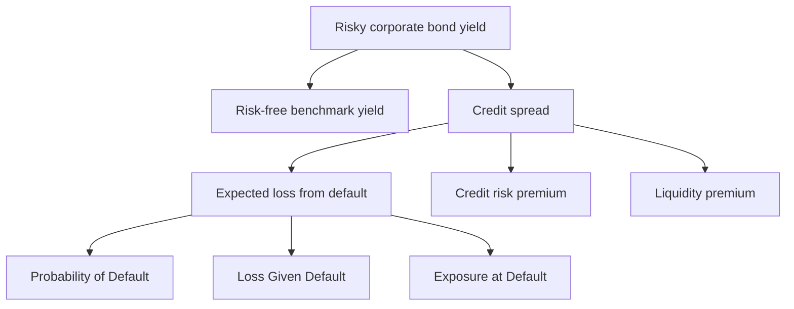
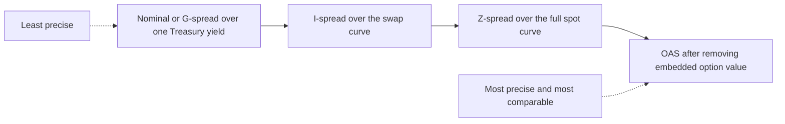
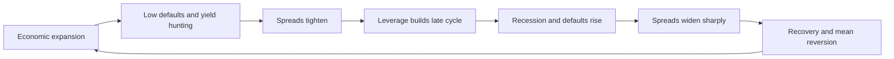

# Chapter 10 — Credit Risk and Spreads

## 1. The Problem / Need

Every bond we have priced so far has quietly assumed one thing: the promised cash flows actually arrive. For a Treasury bond that assumption is close to true — a government that prints its own currency can always pay in nominal terms. But the moment you lend to a company, a bank, a municipality, or a sovereign that borrows in a currency it cannot print, a new and very real risk enters: **the borrower may not pay you back in full, or on time.**

This changes the whole valuation problem. Consider two three-year bonds issued on the same day, each paying a 5% annual coupon on a face value of 100. One is a Treasury; the other is issued by a mid-sized industrial company. If both were certain to pay, no-arbitrage says they must trade at the same price. They do not. The corporate bond trades *cheaper* — its yield is *higher* — and the gap does not disappear no matter how efficient the market is. That gap is not a mispricing. It is the market's price for bearing the chance of non-payment, and for the fact that this chance itself fluctuates.

So the practitioner faces three linked questions that this chapter answers:

1. **How large is the credit risk?** We need to decompose "the borrower might not pay" into measurable pieces — how likely is default, and how much do we lose if it happens.
2. **How is that risk priced?** The extra yield a risky bond offers over a safe benchmark is the **credit spread**. But there are several ways to measure a spread (nominal, G-spread, Z-spread, OAS), and they answer subtly different questions.
3. **Why do spreads move?** A bond can lose value not only because the issuer defaults, but because its perceived risk worsens — a **credit migration** — or because the whole market repriced risk over the cycle. A bond trader loses far more money to spreads *widening* than to outright defaults.

Getting this right is the core of credit investing, bank loan pricing, and every "risk-free rate plus a spread" discounting exercise in finance.

## 2. The Core Idea

A risky bond's yield can be split into two parts:

$$\text{Risky yield} = \underbrace{\text{Risk-free rate}}_{\text{time value of money}} + \underbrace{\text{Credit spread}}_{\text{compensation for default risk}}$$

The **credit spread** is the extra return per year an investor demands for holding a bond that might not pay, instead of an otherwise-identical default-free bond. It is *not* pure profit — it is compensation, and it can be decomposed further:

$$\text{Credit spread} \approx \underbrace{\text{Expected loss}}_{\text{actuarial cost of default}} + \underbrace{\text{Credit risk premium}}_{\text{reward for bearing uncertainty}} + \underbrace{\text{Liquidity premium}}_{\text{cost of hard-to-sell}}$$

The **expected loss** piece is the actuarial heart of credit risk, and it is built from three primitives:

- **Probability of Default (PD):** the chance the issuer fails to meet its obligations over a horizon.
- **Loss Given Default (LGD):** the fraction of exposure you lose *if* default occurs; equivalently $1 - \text{Recovery Rate}$.
- **Exposure at Default (EAD):** how much is at risk when default hits (for a plain bond, roughly the face plus accrued).

Put together, over one period:

$$\text{Expected Loss} = PD \times LGD \times EAD$$

The rest of the chapter makes each of these precise, shows the different ways the market *quotes* the spread, and explains what pushes spreads around.

*Figure 1 — A risky yield decomposes into a risk-free base plus a spread, and the spread itself decomposes into expected loss plus premiums for risk and illiquidity.*

## 3. Why / How It Works

### Why a spread must exist

Imagine an investor who is risk-neutral and cares only about *expected* return. Suppose a one-year zero-coupon corporate bond has a 2% chance of defaulting, and in default it recovers 40% of face. To be *indifferent* between this bond and a risk-free bill yielding 3%, the promised (contractual) yield on the corporate must be high enough that its *expected* return equals 3%. Because 2% of the time you only get 40 cents on the dollar, the promised payoff must be raised to make the average come out right. Solving that indifference condition produces a promised yield above 3% — the difference is the **spread that just covers expected loss.**

Real investors are risk-*averse*, not risk-neutral. They dislike the *uncertainty* of the outcome, not just its average. So they demand more than the actuarially fair spread — an extra **risk premium**. And because corporate bonds are harder to sell quickly than Treasuries, they demand a **liquidity premium** on top. That is why observed spreads are consistently *wider* than realized default losses would justify — the gap is the reward investors have historically earned for bearing credit and liquidity risk.

### Why default is not the only danger

Here is the insight that separates novices from practitioners: **most credit losses on marked-to-market portfolios come from spread widening, not from default.** A bond downgraded from BBB to BB does not miss a single coupon, yet its price can fall several points overnight because the market now demands a wider spread to hold it. This is **credit migration risk** — the risk that the issuer's credit quality *deteriorates* (or improves) while you hold the bond. Over a one-year horizon, a diversified investment-grade portfolio experiences far more mark-to-market volatility from migration and general spread moves than from the handful of names that actually default.

### Why we need several spread measures

The naive spread — "corporate yield minus Treasury yield" — is intuitive but technically sloppy, because a single yield-to-maturity is a blended average that ignores the *shape* of the yield curve. When the term structure is steep, discounting every cash flow at one number misstates value. So the market built a **ladder of increasingly precise spread measures** — nominal/G-spread, I-spread, Z-spread, and option-adjusted spread — each stripping out one more source of contamination so that what remains is a cleaner read on pure credit compensation.

## 4. Full Content — Formulas and Bond Math

### 4.1 The building blocks of default risk

**Recovery rate and LGD.** If a defaulted bond ultimately returns $R$ cents per dollar of face:

$$\text{Recovery Rate} = R, \qquad LGD = 1 - R$$

Recovery depends heavily on **seniority** and **collateral**. Senior secured debt might recover 60–70 cents; senior unsecured 40 cents (a common rule-of-thumb assumption); subordinated debt 20 cents or less. Seniority is the single biggest driver of LGD.

**Probability of default over time — the hazard rate.** Let $\lambda$ be the **hazard rate** (also called the *conditional* or *marginal* default intensity): the probability of defaulting *during* a period, *given survival up to* the start of it. Then:

- Probability of surviving one period: $1 - \lambda$.
- Probability of surviving $t$ periods (constant hazard): $(1-\lambda)^t$.
- **Cumulative probability of default** by time $t$:

$$PD_{\text{cum}}(t) = 1 - (1-\lambda)^t$$

- **Marginal probability of default** in period $t$ (default *in* that period, survive to its start):

$$PD_{\text{marg}}(t) = (1-\lambda)^{t-1}\,\lambda$$

Note that cumulative PD is *not* just $\lambda \times t$; that linear approximation only holds for small $\lambda$ and short horizons because survival probability shrinks each period.

**Expected loss (single period).**

$$EL = PD \times LGD \times EAD = PD \times (1-R) \times EAD$$

As a first approximation, a bond's credit spread over one year is close to its annualized expected loss rate, $PD \times LGD$. Anything above that is the risk and liquidity premium.

### 4.2 Structural vs reduced-form views (why PD exists)

Two modelling traditions explain *where* PD comes from:

- **Structural models (Merton):** A firm defaults when the market value of its assets falls below the face value of its debt at maturity. Equity is viewed as a *call option* on the firm's assets struck at the debt level. This ties credit risk to leverage and asset volatility — more debt or more volatile assets raise PD. It is the intuition behind models like Moody's KMV.
- **Reduced-form models:** Rather than model the firm's balance sheet, treat default as a random event arriving with hazard rate $\lambda$, and *calibrate* $\lambda$ from market prices (bond spreads, CDS). These dominate day-to-day pricing because they fit observed spreads directly.

A useful bridge is the **credit triangle**, the reduced-form approximation linking spread, hazard, and recovery:

$$s \approx \lambda \times (1 - R) = \lambda \times LGD$$

i.e., **spread ≈ (default intensity) × (loss given default).** This one line is the workhorse for moving between quoted spreads and implied default probabilities.

### 4.3 The ladder of spread measures

Now the pricing side. We hold the risky bond's *market price* fixed and ask: what spread reconciles it with a risk-free benchmark?

**(a) Nominal spread / G-spread.** The simplest: the risky bond's YTM minus the YTM of a government benchmark of the *same maturity*.

$$\text{G-spread} = y_{\text{corp}} - y_{\text{govt}}$$

If the exact-maturity benchmark does not exist, interpolate between the two nearest Treasuries. Weakness: both are single blended yields, so a steep or curved term structure distorts the comparison.

**(b) I-spread.** Same idea but benchmarked to the **swap curve** rather than the government curve: $y_{\text{corp}}$ minus the interpolated interest-rate-swap rate of matching maturity. Common in Europe and for floating-rate reference.

**(c) Z-spread (zero-volatility spread).** The **constant spread $Z$** that, when *added to every spot (zero) rate* on the benchmark curve, makes the present value of the bond's cash flows equal its market price:

$$P_{\text{market}} = \sum_{t=1}^{n} \frac{CF_t}{\left(1 + s_t + Z\right)^{t}}$$

where $s_t$ is the benchmark spot rate for maturity $t$. Because it uses the *whole* spot curve rather than one YTM, the Z-spread is curve-consistent and is the standard measure for bonds without embedded options. You solve for $Z$ iteratively.

**(d) Option-adjusted spread (OAS).** For bonds with embedded options (callable, putable, mortgage-backed), the Z-spread is contaminated by the option's value. The **OAS** is the spread over the benchmark curve *after* the option has been valued and stripped out, typically using an interest-rate model that averages the bond's value across many simulated rate paths. The relationships are:

$$\text{For a callable bond: } \text{OAS} = \text{Z-spread} - \text{Option cost (in bp)}$$

$$\text{For a putable bond: } \text{OAS} = \text{Z-spread} + \text{Option value (in bp)}$$

For an **option-free** bond, OAS = Z-spread (there is no option to remove). OAS is the cleanest measure of pure credit-plus-liquidity compensation because it is comparable across bonds with different option features.

*Figure 2 — The spread ladder. Each rung strips out one more distortion — curve shape, then reference base, then embedded optionality — leaving a purer measure of credit compensation.*

### 4.4 Credit migration and transition matrices

Rating agencies publish **transition matrices**: the empirical probability that an issuer rated $X$ today is rated $Y$ one year later (including the "D" default state). A simplified matrix:

| From \ To | A | BBB | BB | Default |
|---|---|---|---|---|
| **A** | 91% | 8% | 0.9% | 0.1% |
| **BBB** | 5% | 88% | 5% | 2% |
| **BB** | 1% | 8% | 80% | 11% |

Rows sum to 100%. Reading the BBB row: a BBB issuer has an 88% chance of staying BBB, 5% of upgrading to A, 5% of slipping to BB, and 2% of defaulting within the year. Because a downgrade *widens the spread the market demands*, it lowers the bond's price even with no missed payment. Multiplying each destination's probability by the bond's value in that state gives the **expected value** next year — and the spread of that distribution is the input to **credit VaR**.

### 4.5 What drives spreads over the cycle

Spreads are not static; they breathe with the economy:

- **Expansion / low default environment:** Corporate earnings strong, defaults rare, investors reach for yield. Spreads *tighten* (compress), sometimes to levels that under-compensate for risk.
- **Late cycle / rising uncertainty:** Leverage has built up, investors grow cautious. Spreads begin to *widen* even before defaults rise.
- **Recession / stress:** Defaults spike, liquidity evaporates, forced selling. Spreads *blow out* — and crucially, they widen *more than expected losses alone justify*, because the risk premium and liquidity premium both surge.
- **Recovery:** As conditions stabilize, spreads mean-revert tighter, usually the best period for credit *returns* (you earn carry plus capital gains from tightening).

The key relationships:

- **Spread and credit quality:** lower rating → wider spread, and the widening is *convex* — the step from BBB to BB is far larger than A to BBB.
- **Spread and the business cycle:** counter-cyclical — widest in recessions, tightest in booms.
- **Spread and equity markets:** spreads and equity volatility move together; a spike in the VIX typically comes with wider credit spreads (both price the same underlying fear).

*Figure 3 — Credit spreads are counter-cyclical, compressing through expansions and blowing out in recessions before mean-reverting.*

## 5. Worked Examples

### Example 1 — Expected loss and the fair spread

A one-year corporate bond has face value 100, a hazard (default) probability of **2%**, and an expected **recovery of 40%** of face if it defaults.

**Step 1 — LGD.** $LGD = 1 - R = 1 - 0.40 = 0.60$.

**Step 2 — Expected loss rate.** $EL = PD \times LGD = 0.02 \times 0.60 = 0.012 = 1.20\%$ of face.

**Step 3 — Fair spread (actuarial).** To first order, the spread that just covers expected loss is **≈ 120 bp**. Check with the credit-triangle: $s \approx \lambda \times LGD = 0.02 \times 0.60 = 1.20\%$. ✓ Both routes agree.

**Interpretation.** If this bond actually trades at a 200 bp spread, then roughly 120 bp compensates for expected default loss and the remaining ~80 bp is risk premium plus liquidity premium.

### Example 2 — Cumulative vs marginal default probability

Using the same 2% annual hazard rate, what is the chance of default over **two years**?

**Naive (wrong) answer:** $2\% + 2\% = 4\%$.

**Correct.** Survival each year is $1 - 0.02 = 0.98$.

- Cumulative PD by year 2: $PD_{\text{cum}}(2) = 1 - 0.98^2 = 1 - 0.9604 = 0.0396 = \mathbf{3.96\%}$.
- Marginal PD in year 2: $PD_{\text{marg}}(2) = 0.98 \times 0.02 = 0.0196 = 1.96\%$.

**Reconcile:** cumulative = year-1 default + year-2 marginal default = $2.00\% + 1.96\% = 3.96\%$. ✓ The cumulative figure is below the naive 4% because you can only default in year 2 if you *survived* year 1.

### Example 3 — Solving for the Z-spread, then the G-spread

A three-year corporate bond pays a **5% annual coupon** on face 100 and trades at a market price of **98.739**. The benchmark **spot (zero) rates** are:

| Maturity | Spot rate $s_t$ |
|---|---|
| 1 yr | 3.00% |
| 2 yr | 3.50% |
| 3 yr | 4.00% |

**Step 1 — Set up the Z-spread equation.** Find constant $Z$ such that:

$$98.739 = \frac{5}{(1.03+Z)^1} + \frac{5}{(1.035+Z)^2} + \frac{105}{(1.04+Z)^3}$$

**Step 2 — Try $Z = 1.50\%$ (150 bp).** Discount rates become 4.50%, 5.00%, 5.50%:

| $t$ | $CF_t$ | Discount rate | $(1+r)^t$ | PV |
|---|---|---|---|---|
| 1 | 5 | 4.50% | 1.04500 | 4.7847 |
| 2 | 5 | 5.00% | 1.10250 | 4.5351 |
| 3 | 105 | 5.50% | 1.17424 | 89.4194 |
| | | | **Total** | **98.739** |

The present value is **98.739**, exactly the market price, so **Z-spread = 150 bp**. ✓

**Step 3 — Now the G-spread.** First find the bond's YTM by solving $98.739 = \frac{5}{(1+y)} + \frac{5}{(1+y)^2} + \frac{105}{(1+y)^3}$. Iterating gives $y_{\text{corp}} \approx 5.47\%$ (at 5.47% the PV is 98.73, matching).

Next, the benchmark yield. A default-free 3-year 5% bond priced on the *same spot curve* (i.e. $Z = 0$) is worth:

$$\frac{5}{1.03} + \frac{5}{1.035^2} + \frac{105}{1.04^3} = 4.8544 + 4.6676 + 93.3446 = 102.867$$

Its YTM solves to $y_{\text{govt}} \approx 3.97\%$.

**Step 4 — G-spread.** $\text{G-spread} = y_{\text{corp}} - y_{\text{govt}} = 5.47\% - 3.97\% = \mathbf{1.50\%} = 150\text{ bp}$.

**Reconcile.** Here the G-spread (150 bp) and Z-spread (150 bp) coincide. That is *not* a universal law — it happens because this spot curve is only gently sloped, so the single-yield approximation of the G-spread barely distorts. On a **steep** curve the two would diverge, and the Z-spread would be the number to trust because it respects the whole term structure. If the bond were **callable**, we would go one rung further and compute an OAS below 150 bp, subtracting the value of the call the investor is short.

### Example 4 — Credit migration and expected value

You hold a BBB bond currently worth **100**. Over the next year the transition probabilities and the bond's value in each resulting state are:

| Next-year state | Probability | Bond value | Prob × Value |
|---|---|---|---|
| Upgrade to A | 5% | 101.0 | 5.050 |
| Stay BBB | 88% | 100.0 | 88.000 |
| Downgrade to BB | 5% | 96.5 | 4.825 |
| Default | 2% | 40.0 (recovery) | 0.800 |
| | **100%** | | **98.675** |

**Expected value next year = 98.675**, an expected change of **−1.325**.

**Decompose the −1.325** into contributions (probability × value change from 100):

- Upgrade: $0.05 \times (101 - 100) = +0.050$
- Stay: $0.88 \times 0 = 0$
- Downgrade: $0.05 \times (96.5 - 100) = -0.175$
- Default: $0.02 \times (40 - 100) = -1.200$

Sum: $+0.050 + 0 - 0.175 - 1.200 = \mathbf{-1.325}$. ✓ Reconciles with the table.

**Interpretation.** Even though default (2% chance) is the single biggest drag (−1.20), note that the *migration* states (upgrade + downgrade) together move value by −0.125 with **no missed payment at all**. Over a large investment-grade portfolio, where default is rare, this migration channel dominates the year-to-year mark-to-market swings — the practitioner's point from Section 3.

## 6. Connections

- **Chapter 03 (Bond Pricing) & 05 (Spot/Forward Rates):** The Z-spread is literally the spot-rate discounting machinery of Chapter 5 with a constant add-on. You cannot compute a Z-spread without a bootstrapped spot curve.
- **Chapter 04 (Yield Measures):** The G-spread is a difference of two YTMs, so all the caveats about YTM being a blended, reinvestment-assuming average carry straight into the G-spread's imprecision.
- **Chapter 06 (Term Structure):** The *shape* of the curve is exactly what makes G-spread and Z-spread diverge; a flat curve collapses them together (as in Example 3).
- **Duration & Convexity (interest-rate risk chapters):** Credit adds **spread duration** — sensitivity of price to a change in the spread, holding the risk-free curve fixed. A bond has both interest-rate duration and spread duration; a widening of 100 bp in spread hurts by (spread duration × 1%).
- **Credit Default Swaps (CDS):** The credit-triangle $s \approx \lambda \times LGD$ is the bridge between cash-bond spreads and the CDS market; the gap between CDS and bond spreads is the **basis**.
- **Equity (Merton model):** Structural models make corporate debt and equity two claims on the same asset pool, linking credit spreads to equity volatility and leverage.

## 7. Key Terms

- **Credit / default risk:** risk the borrower fails to pay interest or principal in full and on time.
- **Probability of Default (PD):** likelihood of default over a horizon; *conditional* (hazard/marginal) vs *cumulative*.
- **Hazard rate ($\lambda$):** probability of default in a period given survival to its start.
- **Loss Given Default (LGD):** fraction of exposure lost in default; $= 1 - \text{Recovery Rate}$.
- **Recovery rate:** cents-on-the-dollar recovered after default; driven mainly by seniority and collateral.
- **Exposure at Default (EAD):** amount at risk when default occurs.
- **Expected Loss (EL):** $PD \times LGD \times EAD$; the actuarial cost of credit.
- **Credit spread:** extra yield of a risky bond over a default-free benchmark.
- **G-spread / nominal spread:** corporate YTM minus a matching-maturity government YTM.
- **I-spread:** spread over the interpolated swap curve.
- **Z-spread (zero-volatility spread):** constant add-on to every benchmark spot rate that reprices the bond.
- **Option-adjusted spread (OAS):** Z-spread net of embedded-option value; comparable across optioned and non-optioned bonds.
- **Credit migration:** change in an issuer's rating/quality over time.
- **Transition matrix:** probabilities of moving between ratings over a horizon.
- **Spread duration:** price sensitivity to a change in the credit spread.
- **Credit triangle:** $s \approx \lambda \times LGD$, linking spread, default intensity, and loss severity.

## 8. Common Confusions

- **"Spread = expected loss."** No. Expected loss ($PD \times LGD$) is only the *floor*. Observed spreads are wider because investors demand a risk premium and a liquidity premium. Historically, high-grade spreads have exceeded realized losses by a comfortable margin — that gap is the credit investor's edge.
- **"Recovery rate and LGD are two separate inputs."** They are the same information: $LGD = 1 - \text{Recovery}$. Quote one, and you have the other.
- **"Cumulative PD equals annual PD times number of years."** Only approximately, for small hazards. Correctly, $PD_{\text{cum}}(t) = 1 - (1-\lambda)^t$, which is *below* $\lambda t$ because you must survive each earlier year to default later.
- **"G-spread and Z-spread are basically the same."** They coincide only when the spot curve is flat/gently sloped (Example 3 was engineered that way). On a steep curve they diverge, and the Z-spread is the correct one.
- **"OAS is always smaller than Z-spread."** True for *callable* bonds (subtract call value), but for *putable* bonds the OAS is *larger* than the Z-spread, because the put is a benefit to the investor. For option-free bonds they are equal.
- **"You only lose money on a bond if it defaults."** The single most expensive misconception in credit. Downgrades and market-wide spread widening produce large mark-to-market losses with every coupon still paid — this is migration/spread risk, and for investment-grade portfolios it dwarfs default losses.
- **"A wider spread means the bond is a better buy."** Not necessarily — it may simply mean the market has correctly identified more risk. The question is whether the spread *over-compensates* for the true risk.

## 9. Recap

Credit risk is the possibility that a borrower does not pay in full and on time. We decompose it into **PD**, **LGD** ($= 1 -$ recovery), and **EAD**, whose product is the **expected loss**. A risky bond's yield is the risk-free rate plus a **credit spread**, and that spread pays for expected loss *plus* a risk premium *plus* a liquidity premium — which is why spreads sit above realized default losses.

Because a single YTM is a crude summary, the market quotes spreads on a ladder of increasing precision: **G-spread** (over one Treasury yield), **I-spread** (over swaps), **Z-spread** (a constant add-on to the whole spot curve), and **OAS** (Z-spread with embedded-option value removed). The **credit triangle** $s \approx \lambda \times LGD$ ties observed spreads back to implied default intensities.

Beyond outright default, holders face **credit migration** — rating changes that reprice the bond via the spread even when no payment is missed — quantified with **transition matrices**. And spreads are **counter-cyclical**: tight in booms, blowing out in recessions by more than expected losses alone, because risk and liquidity premiums surge in stress. The worked examples reconciled expected loss (120 bp), cumulative vs marginal PD (3.96% over two years), a Z-spread and G-spread that both landed at 150 bp on a mild curve, and a migration-driven expected value of 98.675 that decomposed cleanly back to −1.325.

## 10. Quick Reference / Interview Points

**Core formulas**
- Expected loss: $EL = PD \times LGD \times EAD$
- LGD: $LGD = 1 - \text{Recovery Rate}$
- Cumulative PD: $PD_{\text{cum}}(t) = 1 - (1-\lambda)^t$; marginal PD: $(1-\lambda)^{t-1}\lambda$
- Credit triangle: $\text{spread} \approx \lambda \times LGD$
- Z-spread: constant $Z$ with $P = \sum_t \frac{CF_t}{(1 + s_t + Z)^t}$
- Callable OAS $=$ Z-spread $-$ option cost; Putable OAS $=$ Z-spread $+$ option value; option-free OAS $=$ Z-spread

**Rapid-fire answers**
- *Difference between G-spread and Z-spread?* G-spread uses one blended benchmark YTM; Z-spread adds a constant to the entire spot curve, so it is curve-consistent. They match on a flat curve and diverge on a steep one.
- *When is OAS below the Z-spread?* For callable bonds — the investor is short the call, so its value is subtracted.
- *Biggest driver of recovery/LGD?* Seniority and collateral of the claim.
- *Do most credit losses come from default?* No — for investment-grade portfolios, spread widening and downgrades (migration) drive most mark-to-market losses.
- *Why do spreads exceed expected loss?* Risk premium plus liquidity premium.
- *How do spreads behave over the cycle?* Counter-cyclical: tight in expansions, wide in recessions, and they overshoot expected losses in stress.
- *How are bond spreads and CDS linked?* Through the credit triangle; their difference is the CDS-bond basis.
- *Structural vs reduced-form?* Structural (Merton) ties default to assets falling below debt and links to leverage/volatility; reduced-form calibrates a hazard rate directly from market prices.

**Numbers worth memorizing**
- Senior unsecured recovery rule-of-thumb ≈ 40% (LGD ≈ 60%).
- Investment-grade → high-yield boundary is BBB−/BB+; spread widening from IG to HY is convex, not linear.
- 1 bp of spread duration means a 100 bp spread move changes price by (spread duration) percent.
