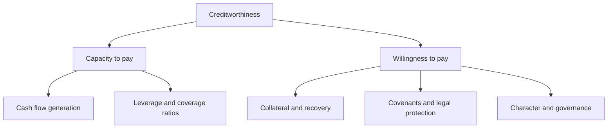
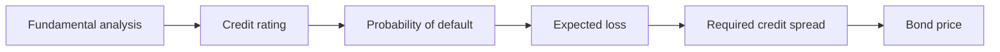
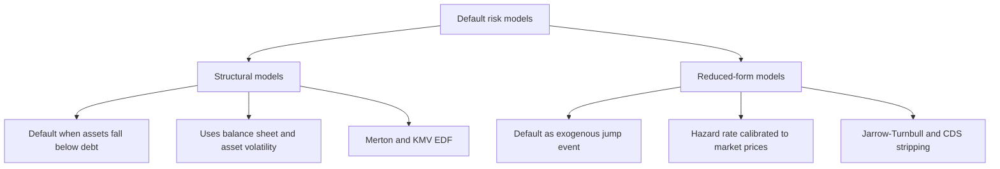

# Chapter 11 — Credit Analysis

## 1. The Problem / Need

Every bond except a genuinely risk-free government note carries one dominant fear: **the borrower may not pay you back.** A US Treasury promises \$1,000 in ten years and — in nominal terms — you can treat that promise as certain. But a BB-rated industrial company promising the same \$1,000 might file for bankruptcy in year six, hand you thirty cents on the dollar, and wipe out four years of coupons. The whole *point* of buying that corporate bond is the extra yield you earn for shouldering that risk. Credit analysis is the discipline of deciding whether that extra yield is *enough*.

Put concretely, when you buy a corporate bond you are effectively doing two trades at once:

1. **Lending at the risk-free rate** — the pure time-value-of-money leg, priced off the Treasury curve.
2. **Selling default insurance** — you collect a premium (the credit spread) in exchange for eating losses if the issuer defaults.

Chapter 10 taught you how spreads are quoted and how they move. This chapter answers the prior question: **how do you decide what spread a given borrower actually deserves?** That means dissecting the borrower's ability and willingness to service debt, translating financial statements into a handful of decision-grade ratios, understanding how the rating agencies compress all of this into a letter grade, and knowing how quantitative models (structural and reduced-form) price default risk from first principles. Get this wrong and you either overpay for junk (and lose principal) or turn down fair compensation (and underperform). Credit analysis is where the money is made and lost in corporate fixed income.

A useful mental frame: **equity analysis asks "how much upside?"; credit analysis asks "how much can go wrong before I stop getting paid?"** The credit analyst is professionally paranoid. Your best case is that you get your coupons and your principal back — exactly what you were promised, no more. All the asymmetry is to the downside. That asymmetry shapes everything that follows.

## 2. Core Idea

Creditworthiness rests on two independent pillars: **capacity** (can the borrower generate enough cash to service the debt?) and **willingness** (will they choose to, and are you legally protected if they waver?). A borrower can be rich and still stiff you; a borrower can be honest and still run out of money. You must underwrite both.

The industry has crystallised this into the **Four Cs of Credit**: **Capacity, Collateral, Covenants, and Character.** Everything a credit analyst does maps onto one of these four buckets. Capacity is measured with cash-flow and leverage ratios; collateral is the recovery you get if things break; covenants are the contractual guardrails; character is the reputational and governance question of whether management will honour the deal even when it hurts.

*Figure 1 — Creditworthiness decomposes into capacity and willingness, and the Four Cs distribute across both pillars.*

The quantitative heart of the analysis is a small set of ratios that answer the capacity question: **How much debt is stacked on the earnings? (leverage) How comfortably do the earnings cover the interest and principal owed? (coverage)** These ratios then drive — or corroborate — a **credit rating**, a letter grade (AAA down to D) assigned by an agency or built internally, which maps monotonically onto an expected default probability and therefore onto the spread the bond should trade at.

## 3. Why / How It Works

### Default is an option the borrower holds

The deepest insight in credit analysis, and the one that unifies the whole chapter, is this: **equity is a call option on the firm's assets, and a risky bond is a risk-free bond minus a put option that the shareholders own.** When you lend to a levered firm, the shareholders have limited liability — if the firm's asset value falls below the face value of debt at maturity, they simply hand you the (now-insufficient) assets and walk away. That "walk-away" right is a put option struck at the face value of debt. You, the bondholder, are *short* that put. This is the seed of the structural models we develop in Section 4, and it explains mechanically why credit spreads widen when asset volatility rises: a more volatile firm makes the shareholders' put more valuable, so your short-put position costs you more, so you demand more spread.

### Why cash flow, not earnings, services debt

Coupons are paid in cash, not in accounting net income. A company can report healthy profits while starving for cash — booking revenue on credit it never collects, or capitalising costs that will bleed cash later. This is why credit analysts anchor on **EBITDA** (a rough cash-earnings proxy) and, more rigorously, on **free cash flow** and the **cash flow statement**. The leverage and coverage ratios in Section 4 are almost all built on EBITDA or cash flow precisely because *debt is serviced out of cash, and the analyst's job is to find the cash.*

### Why ratings and spreads are monotonic

Rating agencies exist because most investors cannot afford to underwrite every issuer themselves. The agency does the fundamental work once and publishes a letter grade that summarises a **through-the-cycle** view of default probability. Empirically, default rates rise smoothly and steeply as you descend the rating ladder — an AAA firm defaults perhaps 0.1% over five years while a CCC firm may default 40%+ over the same window. Because the market prices bonds off expected loss (probability of default times loss given default), spreads compress or widen in lockstep with the rating. This monotonic ladder — rating → default probability → expected loss → spread — is the scaffolding that connects fundamental analysis to market pricing.

*Figure 2 — The transmission chain from fundamentals through rating to the spread the bond must offer.*

### Why covenants substitute for equity's control rights

Shareholders elect the board; bondholders do not. A lender's only levers are the price it charges and the **covenants** it negotiates into the indenture. Covenants convert the willingness question into contract law: a maintenance covenant that caps leverage at 4.0x Debt/EBITDA means that if the firm levers past that line, it is in technical default and you get a seat at the restructuring table *before* the firm has burned all its value. Covenants are how a passive creditor buys a measure of the active control that equity enjoys by default.

## 4. Full Content — The Four Cs, the Ratios, the Ratings, the Models

### 4.1 The Four Cs in depth

**Capacity** — the ability to repay. Assessed through the firm's business risk (industry cyclicality, competitive position, margins, scale, diversification) and financial risk (leverage, coverage, liquidity, and the maturity profile of the debt). Capacity is where the quantitative ratios live.

**Collateral** — the quality and value of assets pledged, and more broadly the **recovery** you can expect in default. A senior secured bond backed by hard assets might recover 70 cents on the dollar; a subordinated unsecured note might recover 20. Collateral drives **loss given default (LGD)**, the complement of the recovery rate.

**Covenants** — the terms in the bond indenture that protect the lender. Discussed fully in Section 4.5.

**Character** — management's integrity, track record, and the firm's governance and financial policy. Does management prioritise bondholders or serially lever up for shareholder buybacks? History of aggressive accounting? A shareholder-friendly financial policy is a *credit negative* even if today's ratios look fine.

### 4.2 Leverage ratios — how much debt is stacked on the cash flow

Leverage answers "how big is the debt relative to the earnings power that supports it?" The workhorse is:

$$\text{Debt/EBITDA} = \frac{\text{Total Debt}}{\text{EBITDA}}$$

where EBITDA = Earnings Before Interest, Taxes, Depreciation and Amortisation. This ratio has the intuitive reading of **"how many years of cash earnings it would take to repay all the debt"** if every dollar of EBITDA went to debt paydown. Rules of thumb (they vary by industry): under ~2x is conservative/investment-grade territory; 3–4x is typical leveraged-but-healthy; above ~5–6x is aggressive high-yield; above ~7x is deeply distressed.

Refinements the analyst must know:

- **Net Debt/EBITDA** = (Total Debt − Cash & equivalents) / EBITDA. Gives credit for cash on hand that could retire debt. Use with care — cash may be trapped offshore or needed for operations.
- **Gross vs net** — agencies often prefer gross (conservative); management always quotes net.
- **Adjusted debt** — add back operating-lease liabilities, pension deficits, and other debt-like obligations. Off-balance-sheet items flatter the raw ratio.

A second leverage lens uses the capital structure rather than earnings:

$$\text{Debt-to-Capital} = \frac{\text{Total Debt}}{\text{Total Debt} + \text{Equity}}$$

### 4.3 Coverage ratios — how comfortably earnings cover the obligations

Coverage answers "for each dollar of interest (or debt service) owed, how many dollars of earnings/cash are available to pay it?" Higher is safer.

**Interest coverage (times interest earned):**

$$\text{EBITDA Interest Coverage} = \frac{\text{EBITDA}}{\text{Interest Expense}}$$

An EBIT-based variant, more conservative because it subtracts depreciation:

$$\text{EBIT Interest Coverage} = \frac{\text{EBIT}}{\text{Interest Expense}}$$

Coverage above ~6–8x is strong investment grade; 3–4x is solid high-yield; below ~1.5–2x is a red flag — the cushion between cash earnings and the interest bill is thin, and a modest earnings decline pushes the firm to insolvency.

**Debt Service Coverage Ratio (DSCR)** — the coverage measure that includes *principal*, not just interest. Interest coverage can look fine while a wall of maturing principal quietly threatens the firm. DSCR captures total debt service:

$$\text{DSCR} = \frac{\text{Net Operating Income (or EBITDA)}}{\text{Total Debt Service}} = \frac{\text{NOI}}{\text{Interest} + \text{Principal repayments}}$$

DSCR is central in **project finance, real estate, and leveraged lending**, where amortising principal is a first-order cash drain. A DSCR of 1.0 means cash flow exactly covers debt service with zero cushion; lenders typically demand 1.20–1.50x minimum. DSCR below 1.0 means the borrower must dip into reserves or refinance to stay current — a structural warning.

**Free-cash-flow-based coverage** — the most conservative, because FCF is cash *after* the capital spending needed to keep the business running:

$$\text{FCF} = \text{Cash from Operations} - \text{Capital Expenditure}$$
$$\text{FCF/Debt} = \frac{\text{Free Cash Flow}}{\text{Total Debt}}$$

FCF/Debt is a favourite agency ratio; its inverse is a "years to repay from true free cash" measure that is stricter than Debt/EBITDA.

### 4.4 The ratio summary table

| Ratio | Formula | What it measures | Direction of safety | Typical IG vs HY |
|---|---|---|---|---|
| Debt/EBITDA | Total Debt ÷ EBITDA | Leverage — years of earnings to repay | Lower | IG < 3x; HY 4–6x |
| Net Debt/EBITDA | (Debt − Cash) ÷ EBITDA | Leverage net of cash | Lower | IG < 2.5x |
| Debt-to-Capital | Debt ÷ (Debt + Equity) | Balance-sheet leverage | Lower | IG < 40% |
| EBITDA Interest Coverage | EBITDA ÷ Interest | Cushion over interest bill | Higher | IG > 6x; HY 2–4x |
| EBIT Interest Coverage | EBIT ÷ Interest | Coverage after D&A | Higher | IG > 4x |
| DSCR | NOI ÷ (Interest + Principal) | Cushion over total debt service | Higher | Lenders want > 1.25x |
| FCF/Debt | (CFO − Capex) ÷ Debt | True cash generation vs debt | Higher | IG > 20% |

*A single ratio never decides a credit. The analyst reads them as a system — high leverage is tolerable if coverage is strong and cash flow is stable; low leverage can still be risky if earnings are violently cyclical.*

### 4.5 Covenants — the contractual guardrails

Covenants come in two families:

**Affirmative (positive) covenants** — things the borrower *must* do: pay taxes, maintain insurance, deliver audited financials, keep assets in good repair, maintain its legal existence. Low-drama but foundational.

**Negative (restrictive) covenants** — things the borrower *must not* do without consequence. These are where the protection lives:

- **Limitation on indebtedness** — caps additional debt, often via an incurrence test (e.g., may not issue new debt unless pro-forma Debt/EBITDA stays below 4.0x).
- **Limitation on liens** (negative pledge) — cannot pledge assets to other lenders ahead of you.
- **Restricted payments** — caps dividends, buybacks, and distributions to shareholders (protects cash from leaking out to equity).
- **Limitation on asset sales** — sale proceeds must repay debt or be reinvested, not dividended out.
- **Change-of-control put** — lets you sell the bond back at ~101 if the firm is taken over (protects against a leveraging buyout).

A further crucial distinction:

- **Maintenance covenants** — tested *every period* regardless of any action (e.g., "leverage must be below 4.5x at each quarter-end"). A breach is an immediate technical default. Common in bank loans.
- **Incurrence covenants** — tested only when the borrower *takes an action* (issues debt, pays a dividend). Common in high-yield bonds. Weaker for lenders because a firm can deteriorate passively without ever tripping them.

"**Covenant-lite**" (cov-lite) loans strip out maintenance covenants, leaving only incurrence tests. The proliferation of cov-lite structures since ~2010 is a standing concern for creditors because it removes the early-warning tripwire.

### 4.6 Credit ratings and the agencies

The three globally dominant **Nationally Recognized Statistical Rating Organizations (NRSROs)** are **S&P Global Ratings, Moody's, and Fitch.** Their scales run in parallel:

| Category | S&P / Fitch | Moody's | Meaning |
|---|---|---|---|
| Prime | AAA | Aaa | Highest quality, minimal risk |
| High grade | AA+ / AA / AA− | Aa1 / Aa2 / Aa3 | Very strong |
| Upper medium | A+ / A / A− | A1 / A2 / A3 | Strong, some susceptibility |
| Lower medium | BBB+ / BBB / BBB− | Baa1 / Baa2 / Baa3 | Adequate — lowest **investment grade** |
| — the line — | **BBB− / Baa3 is the IG floor** | | Below this is speculative |
| Speculative | BB+ / BB / BB− | Ba1 / Ba2 / Ba3 | "Junk" — elevated risk |
| Highly speculative | B+ / B / B− | B1 / B2 / B3 | High risk |
| Substantial risk | CCC / CC / C | Caaa / Ca / C | Vulnerable, near default |
| Default | D | — | In default |

**The single most important line in fixed income is the boundary between BBB−/Baa3 (investment grade) and BB+/Ba1 (high yield).** It is not a smooth gradient in practice — it is a cliff. Enormous pools of capital (insurance companies, pension funds, many bond index funds) are contractually or regulatorily barred from holding sub-investment-grade paper. When an issuer is downgraded across that line — a "**fallen angel**" — forced selling by these holders can blow the spread out far more than the fundamental change alone would justify. Conversely a "**rising star**" upgraded into IG enjoys a burst of forced buying.

Key rating concepts:

- **Issuer rating vs issue rating** — the issuer rating reflects overall default probability; individual *issues* are notched up or down from it based on seniority and collateral (a senior secured bond rated above, a subordinated note below, the issuer's baseline).
- **Outlook and watch** — "negative outlook" signals a likely downgrade over 1–2 years; "credit watch / rating watch" signals a near-term review, often tied to an event like a merger.
- **Through-the-cycle** — agencies deliberately rate across the business cycle, so ratings are stickier and less volatile than market spreads, which are point-in-time.
- **Split rating** — when agencies disagree; convention often uses the lower (or the middle of three).
- **The conflict of interest** — the **issuer-pays** model, where the borrower pays for its own rating, is the structural flaw exposed in 2008 when structured-finance ratings proved wildly optimistic. A credit analyst treats ratings as an input, never gospel.

### 4.7 Quantitative default models — structural vs reduced-form

Beyond ratios and letter grades, two families of mathematical models price default risk directly.

**Structural models (Merton, 1974)** derive default from the firm's balance sheet using option theory. Recall the core idea: equity is a call option on the firm's assets, struck at the face value of debt $D$, expiring at debt maturity $T$. The firm defaults if, at $T$, asset value $A_T < D$. Model the asset value as a lognormal (geometric Brownian motion) process with volatility $\sigma_A$, and the probability of default and the value of the debt fall straight out of the Black–Scholes machinery.

The **distance to default** is the number of standard deviations the asset value sits above the default point:

$$\text{Distance to Default} = \frac{\ln(A_0/D) + (\mu - \tfrac{1}{2}\sigma_A^2)\,T}{\sigma_A\sqrt{T}}$$

and, under the model, the (risk-neutral) probability of default is $N(-\text{DD})$ where $N(\cdot)$ is the standard normal CDF. Structural models are economically intuitive — they tie default to leverage and asset volatility, exactly the levers a fundamental analyst watches — and they explain *why* spreads widen with volatility. Their weaknesses: they assume default only at maturity (extended by later models), require the *unobservable* asset value and asset volatility (backed out from equity), and tend to under-predict short-term spreads because a firm rarely defaults "by surprise" the instant assets dip below debt. Moody's KMV commercialised this approach into the widely used **Expected Default Frequency (EDF)**.

**Reduced-form models (Jarrow–Turnbull, Duffie–Singleton)** take the opposite tack. They do *not* model the firm's assets at all. Instead they treat default as an unpredictable event — a jump — governed by an exogenous **hazard rate** (default intensity) $\lambda$, and calibrate that intensity directly to observed market prices (bond spreads, CDS quotes). The probability of surviving to time $t$ is:

$$P(\text{survival to } t) = e^{-\lambda t} \quad\Rightarrow\quad P(\text{default by } t) = 1 - e^{-\lambda t}$$

Their strength is tractability and a direct link to market data — they are what desks actually use to strip default probabilities out of CDS curves. Their weakness is that they are a-theoretical about *why* default happens: the hazard rate is a fitted parameter, not an economic quantity, so they offer less fundamental insight and can be blindsided if the market itself is mispricing risk.

*Figure 3 — Structural models explain default from firm fundamentals; reduced-form models fit default intensity to market prices.*

### 4.8 The credit-risk arithmetic: from default probability to spread

The bridge from analysis to price is **expected loss**:

$$\text{Expected Loss} = \text{PD} \times \text{LGD} = \text{PD} \times (1 - \text{Recovery Rate})$$

where PD is probability of default and LGD is loss given default. The **credit spread** an investor demands must at minimum compensate for this expected annual loss (plus a risk premium for the *uncertainty* of that loss). A first-order approximation over a short horizon:

$$\text{Credit Spread} \approx \text{PD} \times \text{LGD} = \lambda \times (1 - R)$$

This tiny equation is the Rosetta Stone linking the reduced-form hazard rate $\lambda$, the recovery rate $R$, and the observable spread. We exploit it in Worked Example 3 to strip a default probability out of a market spread.

## 5. Worked Examples

### Worked Example 1 — Building the ratio picture for a credit decision

**Setup.** Zephyr Industries reports the following for the year (all in \$ millions):

| Item | Value |
|---|---|
| Revenue | 2,000 |
| EBITDA | 400 |
| Depreciation & Amortisation | 120 |
| Interest expense | 90 |
| Cash from operations (CFO) | 300 |
| Capital expenditure | 130 |
| Total debt | 1,600 |
| Cash & equivalents | 200 |
| Scheduled principal repayments (this year) | 110 |
| Shareholders' equity | 900 |

**Compute the core ratios.**

*EBIT* = EBITDA − D&A = 400 − 120 = **280**.

*Debt/EBITDA* = 1,600 / 400 = **4.0x**.

*Net Debt/EBITDA* = (1,600 − 200) / 400 = 1,400 / 400 = **3.5x**.

*Debt-to-Capital* = 1,600 / (1,600 + 900) = 1,600 / 2,500 = **64%**.

*EBITDA interest coverage* = 400 / 90 = **4.44x**.

*EBIT interest coverage* = 280 / 90 = **3.11x**.

*DSCR* = EBITDA / (Interest + Principal) = 400 / (90 + 110) = 400 / 200 = **2.0x**.

*Free cash flow* = CFO − Capex = 300 − 130 = **170**.

*FCF/Debt* = 170 / 1,600 = **10.6%**.

**Interpretation and decision.** Leverage at 4.0x gross (3.5x net) sits squarely in **high-yield-but-healthy** territory — clearly below investment grade, but not distressed. EBITDA interest coverage of 4.4x is comfortable; the firm earns \$4.44 of cash earnings for every \$1 of interest. But note how the picture *tightens* as we get stricter: EBIT coverage falls to 3.1x once real depreciation is charged, and DSCR of 2.0x — while adequate — shows that including the \$110m principal wall halves the effective cushion versus interest alone. FCF/Debt of 10.6% is middling; it would take roughly 9–10 years to repay the debt from true free cash. 

**Verdict:** consistent with a **BB / Ba** rating. Lend, but demand a high-yield spread, and insist on a maintenance leverage covenant (say 4.5x) and a restricted-payments basket so management cannot lever up further to fund buybacks.

**Self-check (reconciliation).** DSCR must be lower than EBITDA interest coverage because its denominator is strictly larger (interest + principal > interest): 2.0x < 4.44x. ✓. Net Debt/EBITDA must be lower than gross because cash is subtracted from the numerator: 3.5x < 4.0x. ✓. EBIT coverage must be lower than EBITDA coverage because D&A is subtracted from the numerator: 3.11x < 4.44x. ✓. The internal ordering is coherent.

### Worked Example 2 — A covenant stress test and downgrade trigger

**Setup.** Zephyr's bond indenture contains a **maintenance covenant**: Debt/EBITDA must not exceed **4.5x** at any quarter-end, and an **incurrence covenant** barring new debt if pro-forma leverage would exceed **4.25x**. A recession now cuts EBITDA by 20%, from 400 to **320**, while debt is unchanged at 1,600. Separately, management wants to issue \$200m of new debt to fund an acquisition.

**Step 1 — recompute leverage after the earnings shock.**

New Debt/EBITDA = 1,600 / 320 = **5.0x**.

This **breaches the 4.5x maintenance covenant** (5.0x > 4.5x). The firm is in **technical default** even though it has missed no payment. This is the early-warning power of a maintenance covenant: the creditor gets a seat at the table *before* cash actually runs out. The lender can now demand repricing, additional collateral, or accelerate the loan.

**Step 2 — recompute interest coverage to gauge real distress.** Assume interest still 90.

EBITDA interest coverage = 320 / 90 = **3.56x** (down from 4.44x).

Still above the danger zone, so the firm can *service* its debt — this is a covenant breach driven by the leverage *ratio*, not an actual liquidity crisis yet. That distinction matters: it is a negotiating breach, not a missed coupon.

**Step 3 — test the acquisition financing against the incurrence covenant.** Pro-forma debt = 1,600 + 200 = 1,800; pro-forma EBITDA (pre-recession, say deal adds nothing initially) = 400.

Pro-forma Debt/EBITDA = 1,800 / 400 = **4.5x**.

Since 4.5x **exceeds the 4.25x incurrence limit**, the firm is **contractually blocked** from issuing the new debt. The covenant does its job — it prevents management from levering up to chase an acquisition that would erode the creditor's position.

**Self-check.** After the shock, leverage rose (5.0x > 4.0x) and coverage fell (3.56x < 4.44x) — both move in the direction that hurts creditors, as a 20% earnings drop should. The maintenance test (tested always) trips on the recession; the incurrence test (tested on action) trips on the debt issuance. Two different tripwires, two different triggers — exactly as designed. ✓

### Worked Example 3 — Stripping a default probability out of a market spread

**Setup.** A 5-year Zephyr bond trades at a **credit spread of 300 basis points (3.00%)** over the Treasury curve. Market convention assumes a **recovery rate of 40%** (so LGD = 60%). What annual probability of default (hazard rate) is the market pricing in? What cumulative 5-year default probability does that imply?

**Step 1 — apply the credit-triangle approximation.** Using Spread ≈ λ × LGD:

$$\lambda \approx \frac{\text{Spread}}{\text{LGD}} = \frac{0.0300}{0.60} = 0.050 = 5.0\%\ \text{per year}.$$

The market is pricing an implied **annual (risk-neutral) default probability of about 5%.**

**Step 2 — convert to a cumulative 5-year default probability** using the reduced-form survival formula:

$$P(\text{survive 5 yr}) = e^{-\lambda T} = e^{-0.05 \times 5} = e^{-0.25} = 0.7788.$$
$$P(\text{default within 5 yr}) = 1 - 0.7788 = 0.2212 \approx \mathbf{22.1\%}.$$

So a 300 bp spread with 40% recovery is consistent with roughly a **1-in-5 chance of default over the bond's life** — squarely a high-yield profile, and coherent with the BB assessment from Example 1.

**Step 3 — sanity-check the expected annual loss against the spread.** Expected annual loss ≈ λ × LGD = 0.05 × 0.60 = 0.030 = 3.00% = 300 bp. This exactly reproduces the spread, confirming the arithmetic is internally consistent — the spread is (to first order) pure expected-loss compensation with no residual risk premium in this simplified frame.

**Step 4 — test sensitivity to the recovery assumption.** Suppose instead recovery is only **20%** (LGD = 80%), as it might be for a *subordinated* Zephyr note:

$$\lambda \approx \frac{0.0300}{0.80} = 0.0375 = 3.75\%\ \text{per year}.$$

A *higher* recovery assumption forces a *higher* implied default probability to justify the same spread, and vice versa. This is the crucial modelling caveat: **PD and recovery are jointly unidentified from a single spread** — you can only strip one out if you assume the other. Get the recovery assumption wrong and your implied default probability is wrong in the opposite direction.

**Reconciliation across the three examples.** Example 1's fundamentals (4.0x leverage, 4.4x coverage) said "BB." Example 3's market spread (300 bp implying ~22% five-year PD) is exactly what a BB name should trade at. The fundamental view and the market-implied view agree — which is the reassuring outcome. When they *disagree* (your ratios say BB but the market prices CCC), that gap is either your trading opportunity or the market knowing something you don't. Reconciling the fundamental picture with the market-implied picture is the daily work of the credit analyst.

## 6. Connections

**To spreads and pricing (Ch. 10).** This chapter supplies the *fundamentals* behind the spread that Chapter 10 taught you to quote and hedge. Credit analysis decides *what* spread is fair; spread mechanics decide *how* that spread moves and is traded. The credit-triangle (Spread ≈ PD × LGD) is the hinge between the two chapters.

**To duration and convexity (Ch. 7–8).** A credit downgrade raises the discount rate on the bond, and duration tells you how much the price drops for that spread widening (**spread duration**). Credit risk and interest-rate risk both flow through the same price-sensitivity machinery; a bond has *both* a Treasury-rate duration and a spread duration.

**To the term structure (Ch. 5–6).** Default probability is not constant across the maturity — credit curves slope (usually upward for healthy names, and can *invert* for distressed names where near-term default risk dominates). The hazard rate λ in the reduced-form model can be made term-dependent, producing a credit-spread term structure that mirrors the spot-rate term structure.

**To equity analysis.** The structural (Merton) model literally treats equity as a call option on assets — so the credit analyst and the equity analyst are looking at the same balance sheet from opposite sides of the capital structure. Rising asset volatility helps equity (option value up) and hurts credit (short-put position more costly). This is why credit and equity desks watch each other.

**To derivatives (CDS).** A credit default swap is the traded, isolated form of the default insurance embedded in a corporate bond. Reduced-form models are calibrated primarily to CDS quotes, and the CDS-bond basis is a core relative-value trade. Everything in Section 4.7–4.8 is the theoretical engine under the CDS market.

## 7. Key Terms

- **Four Cs** — Capacity, Collateral, Covenants, Character; the framework for assessing creditworthiness.
- **Capacity** — the borrower's ability to generate cash to service debt.
- **EBITDA** — earnings before interest, taxes, depreciation and amortisation; a cash-earnings proxy.
- **Leverage ratio** — debt relative to earnings or capital (e.g., Debt/EBITDA); higher = riskier.
- **Coverage ratio** — earnings/cash relative to debt obligations (e.g., EBITDA/interest, DSCR); higher = safer.
- **DSCR (Debt Service Coverage Ratio)** — cash flow ÷ (interest + principal); coverage including principal.
- **Free cash flow (FCF)** — cash from operations minus capital expenditure; cash truly available to creditors.
- **Investment grade (IG)** — rated BBB−/Baa3 or higher; **high yield / speculative / junk** — rated BB+/Ba1 or lower.
- **Fallen angel / rising star** — a bond downgraded from IG to HY / upgraded from HY to IG.
- **Covenant** — a contractual term in the indenture; **affirmative** (must do), **negative/restrictive** (must not do).
- **Maintenance vs incurrence covenant** — tested every period vs tested only on a specific action; **cov-lite** = incurrence-only.
- **NRSRO** — Nationally Recognized Statistical Rating Organization (S&P, Moody's, Fitch).
- **Notching** — adjusting an individual issue's rating up/down from the issuer rating for seniority/collateral.
- **Probability of default (PD)** / **Loss given default (LGD)** / **Recovery rate** — LGD = 1 − Recovery.
- **Expected loss** — PD × LGD; the minimum the spread must compensate for.
- **Structural model** — default modelled from the balance sheet as an option (Merton, KMV EDF); **distance to default**.
- **Reduced-form model** — default as an exogenous jump governed by a **hazard rate / default intensity (λ)** calibrated to market prices.
- **Credit spread** — yield over the risk-free benchmark compensating for default risk; ≈ PD × LGD.

## 8. Common Confusions

**"High leverage automatically means bad credit."** No. Leverage must be read against cash-flow *stability* and coverage. A regulated utility with contracted, predictable cash flows can safely carry 5–6x leverage; a mining company with violently cyclical earnings is dangerous at 2.5x. The ratio is meaningless without the business-risk context.

**"EBITDA is cash flow."** EBITDA *ignores* changes in working capital, capital expenditure, taxes, and interest. A firm can have rising EBITDA and *negative* free cash flow if it is bleeding cash into inventory and capex. Charlie Munger's jibe — "think of it as bulls\*\*t earnings" — overstates, but the caution is real: always cross-check EBITDA against actual cash from operations.

**"Interest coverage is enough to judge debt service."** Interest coverage ignores principal. A firm with 8x interest coverage can still fail if a large principal maturity wall arrives and it cannot refinance. DSCR and the maturity schedule catch what interest coverage misses.

**"A credit rating is a buy/sell recommendation or a probability."** A rating is an *ordinal opinion* on relative default risk through the cycle — not a cardinal default probability, not a market-timing signal, and not a comment on price/value. A fairly-priced CCC can be a better investment than an over-priced AAA.

**"Investment grade vs high yield is a smooth gradient."** It is a cliff, not a slope, because of the regulatory/mandate wall at BBB−/BB+. The spread jump and forced-selling dynamics around that line are discontinuous.

**"Structural and reduced-form models are competitors where one is right."** They answer different questions. Structural models give economic *insight* (why default happens, tied to fundamentals); reduced-form models give *calibration* to market prices (what the market implies right now). Practitioners use both — structural for surveillance and early warning, reduced-form for pricing and stripping PDs from CDS.

**"Net debt is always the right leverage measure."** Netting cash assumes the cash is available and permanent. Cash may be trapped in foreign subsidiaries, pledged, or needed as an operating minimum. Conservative (agency) analysis often uses gross debt for precisely this reason.

## 9. Recap

Credit analysis decides whether a borrower's promise to repay is worth the spread on offer. It rests on two pillars — **capacity** (can they pay?) and **willingness** (will they, and are you protected?) — operationalised through the **Four Cs**: Capacity, Collateral, Covenants, Character. Because debt is serviced out of *cash*, the quantitative core is a compact set of ratios: **leverage** ratios (Debt/EBITDA, Net Debt/EBITDA, Debt-to-Capital) measuring how much debt sits on the earnings, and **coverage** ratios (EBITDA/interest, EBIT/interest, DSCR, FCF/Debt) measuring how comfortably the earnings cover what is owed. These ratios feed a **credit rating** — an ordinal, through-the-cycle opinion from S&P, Moody's, or Fitch — whose most consequential feature is the **investment-grade / high-yield cliff** at BBB−/Ba1. Ratings map monotonically onto default probability and therefore onto the spread the bond should trade at, via **expected loss = PD × LGD**. Two model families formalise the pricing: **structural models** (Merton, KMV) that derive default from the balance sheet as an option and explain *why* spreads widen with leverage and volatility, and **reduced-form models** that treat default as an exogenous hazard-rate jump calibrated to market prices. **Covenants** — maintenance vs incurrence, affirmative vs restrictive — convert the willingness question into enforceable contract law and give the passive creditor early-warning tripwires. The credit decision, finally, reconciles the *fundamental* picture (what the ratios and business risk say the credit is worth) against the *market-implied* picture (what the spread says the market believes), and lends only when the spread over-compensates for the analyst's honest assessment of expected loss.

## 10. Quick-Reference / Interview Points

- **The Four Cs:** Capacity, Collateral, Covenants, Character. Capacity = cash to pay; the other three = protection and willingness.
- **Leverage headline:** Debt/EBITDA = "years of earnings to repay all debt." Rough map: <2x conservative IG; 3–4x levered-healthy; >6x aggressive/distressed.
- **Coverage headline:** EBITDA/Interest ("times interest earned"). >6x strong IG; ~3x solid HY; <1.5x danger. **DSCR adds principal** to the denominator — always lower than interest coverage; lenders want >1.25x.
- **The credit triangle:** **Spread ≈ PD × LGD = λ × (1 − Recovery).** Memorise this — it lets you strip an implied default probability out of any spread given a recovery assumption. Watch out: PD and recovery are jointly unidentified from one spread.
- **Survival math (reduced-form):** P(default by T) = 1 − e^(−λT). A constant hazard rate λ compounds into a cumulative PD.
- **The IG/HY cliff:** BBB−/Baa3 is the lowest investment grade; BB+/Ba1 is the highest junk. Fallen angels get force-sold; the spread jump across the line is discontinuous, not smooth.
- **Agencies:** S&P, Moody's, Fitch (NRSROs). Issuer-pays conflict; ratings are through-the-cycle and stickier than market spreads. Issue ratings are *notched* off the issuer rating for seniority.
- **Structural vs reduced-form (classic interview question):** Structural (Merton) = default when assets < debt, equity is a call option, uses balance-sheet data, gives economic insight, under-predicts short-term spreads. Reduced-form (Jarrow–Turnbull) = default is an exogenous jump with hazard rate λ fitted to market prices, tractable for pricing/CDS, but a-theoretical about *why* default happens.
- **Equity = call option on assets; risky bond = risk-free bond − a put.** Higher asset volatility → shareholders' walk-away put worth more → bondholder's short-put costs more → spread widens. This is the one-sentence bridge between credit and options.
- **Covenants:** maintenance (tested always, immediate technical default on breach, common in loans) vs incurrence (tested only on an action, common in HY bonds, weaker). Cov-lite = incurrence-only, removes the early-warning tripwire.
- **Golden rule of the credit mindset:** the upside is capped at "you get paid what you were promised" — all the asymmetry is downside, so underwrite the downside first. EBITDA is *not* cash flow; always reconcile it to actual cash from operations.
