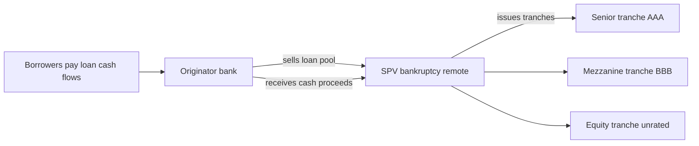
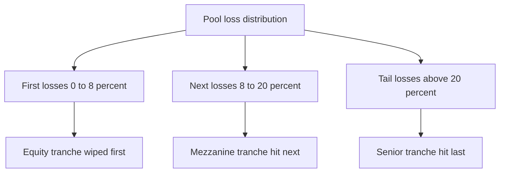
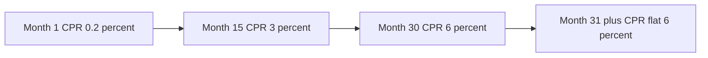
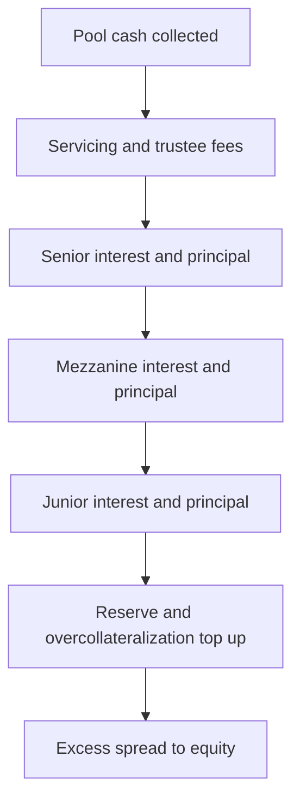
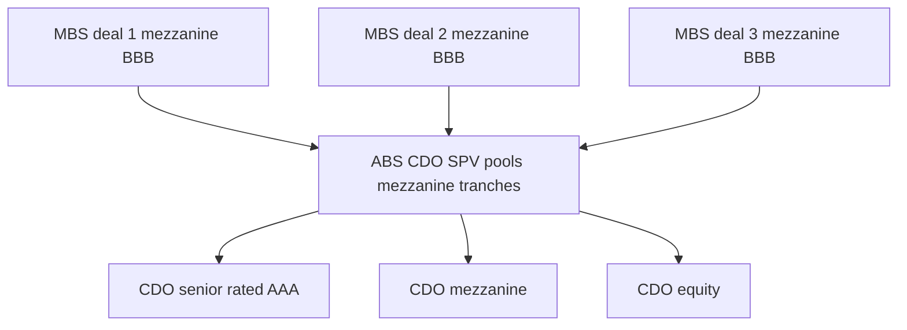

# Chapter 12 — Securitization, ABS and MBS

## 1. The Problem / The Need

A bank makes a 30-year mortgage. It now holds a single, illiquid, long-dated loan to one household in one town. That one loan ties up regulatory capital, concentrates the bank's risk in local house prices and one borrower's job, and cannot be sold easily because no investor wants to underwrite one anonymous mortgage. Multiply this by thousands of loans and the bank's balance sheet becomes a warehouse of frozen, capital-hungry, hard-to-value assets. It can only make new loans as fast as it takes in new deposits.

Meanwhile, a pension fund on the other side of the world has the opposite problem. It has billions to invest, needs long-dated income to match its liabilities, and would happily earn the spread on prime mortgages — but it cannot originate loans, service them, or diligence individual borrowers. It wants a tradable, rated, diversified bond, not a filing cabinet of loan documents.

Securitization is the bridge between these two problems. It takes illiquid, non-tradable loans and manufactures liquid, tradable, credit-rated securities out of them. It answers a cluster of needs at once:

- **Funding and capital relief** for originators — sell the loans, get cash, recycle it into new lending, and move the assets off-balance-sheet so they stop consuming capital.
- **Risk transfer** — the credit risk of the borrowers moves from the bank to capital-market investors who choose to hold it.
- **Investor access and customization** — investors who could never touch a whole-loan portfolio can now buy a slice engineered to a precise risk-return profile, from ultra-safe to highly leveraged.
- **Maturity and liquidity transformation** — turning 30-year contracts into instruments that trade daily.

The core financial-engineering trick is that the *whole* can be worth more than — and be safer in parts than — the *sum* of the raw loans, because pooling diversifies idiosyncratic risk and tranching redistributes the remaining risk to the investors most willing to bear each layer.

## 2. The Core Idea

Securitization has two moves, and almost everything else is detail:

1. **Pooling.** Gather a large number of small, similar cash-flow-producing assets — mortgages, auto loans, credit-card receivables, student loans — into one portfolio held by a bankruptcy-remote **Special Purpose Vehicle (SPV)**. Diversification means one borrower's default is a rounding error, so the pool's aggregate cash flow is far more predictable than any single loan's.

2. **Tranching.** Slice the pooled cash flows into layered claims — tranches — with a strict priority ordering. Senior tranches get paid first and absorb losses last; junior (equity) tranches get paid last and absorb losses first. The same underlying cash flow now backs securities ranging from AAA to unrated, each priced to its own risk.

The device that enforces the ordering is the **cash-flow waterfall**: a contractual set of rules specifying, period by period, who receives interest and principal in what sequence, and who eats losses in what sequence. Layered on top are **credit enhancements** — subordination, overcollateralization, excess spread, reserve accounts, and sometimes external guarantees — that protect senior investors.

The naming convention follows the collateral:

- **MBS (Mortgage-Backed Securities):** backed by mortgages. **RMBS** = residential; **CMBS** = commercial.
- **ABS (Asset-Backed Securities):** backed by non-mortgage receivables (autos, cards, student loans, equipment leases).
- **CDO (Collateralized Debt Obligation):** backed by a pool of *debt securities* — corporate bonds (CBO), loans (CLO), or, notoriously, tranches of *other* ABS/MBS (ABS CDO). A CDO is securitization applied to securitizations.

*Figure 1 — the basic securitization flow: whole loans move into an SPV that issues layered tranches to investors.*

## 3. Why / How It Works

Why can pooling and tranching create securities that are, in aggregate, more valuable and more useful than the raw loans? Three mechanisms.

**Diversification kills idiosyncratic risk.** A single mortgage either pays or defaults — a binary, high-variance outcome. Pool 5,000 mortgages and, by the law of large numbers, the *fraction* that default becomes highly predictable even though any individual outcome is not. The pool's loss distribution tightens around its expected value. This is the same logic as insurance. The critical caveat — which 2008 taught in blood — is that diversification only works if defaults are *weakly correlated*. If a common factor (national house prices) drives all borrowers together, pooling provides far less protection than the models assumed.

**Tranching sorts the remaining risk to its natural buyers.** Even a well-diversified pool has a loss distribution — usually small losses are likely, catastrophic losses are rare. Tranching maps that distribution onto securities:

- The **equity tranche** absorbs the first losses. It is short a put on the pool — high expected return, high risk, bought by hedge funds and sponsors who want leverage.
- The **mezzanine tranche** is hit only after equity is exhausted — moderate risk, moderate spread.
- The **senior tranche** is hit only in a catastrophe deep enough to blow through everything below it. Because that is rare, it earns a high rating and a low spread, and is bought by insurers, banks, and money funds who are constrained to hold high-grade paper.

The senior tranche can be rated far above the average loan in the pool precisely because the junior tranches stand in front of it. This is **credit enhancement through subordination**: the senior's protection is the dollar cushion of everything below it.

**Structural and legal isolation makes the ratings real.** The SPV is *bankruptcy-remote* — if the originating bank fails, the pool is not part of the bank's estate, so investors keep receiving loan cash flows. This "true sale" is what lets the tranches be rated on the *collateral's* risk rather than the *originator's* risk. Without legal isolation, the whole edifice collapses back into an unsecured claim on the bank.

*Figure 2 — the loss distribution of a diversified pool mapped onto tranches: first losses hit equity, tail losses reach senior.*

## 4. Full Content — Formulas and Bond Math

### 4.1 The mortgage: a level-payment amortizing loan

Most MBS collateral is the fully-amortizing fixed-rate mortgage. A loan of principal $P$ at monthly rate $i$ (annual rate / 12) over $n$ months has a constant monthly payment $M$ that solves the present-value equation $P = M \cdot \frac{1-(1+i)^{-n}}{i}$, giving:

$$M = P \cdot \frac{i(1+i)^n}{(1+i)^n - 1}$$

Each payment splits into **interest** ($= i \times$ outstanding balance) and **scheduled principal** (the remainder). Early on, payments are mostly interest; late in life, mostly principal. The outstanding balance after $k$ payments is:

$$B_k = P \cdot \frac{(1+i)^n - (1+i)^k}{(1+i)^n - 1}$$

### 4.2 Prepayment metrics: SMM, CPR, PSA

Borrowers can repay early — they move, refinance, or default (which, if insured, looks like a prepayment to investors). Prepayment is *the* defining risk of MBS. It is measured with three linked conventions.

**SMM (Single Monthly Mortality)** — the fraction of the *beginning-of-month balance net of scheduled principal* that prepays in a given month:

$$\text{SMM} = \frac{\text{prepayment}_t}{\text{beginning balance}_t - \text{scheduled principal}_t}$$

**CPR (Conditional Prepayment Rate)** — the annualized version of SMM. The two convert via compounding:

$$\text{SMM} = 1 - (1 - \text{CPR})^{1/12} \qquad \text{CPR} = 1 - (1 - \text{SMM})^{12}$$

**PSA benchmark** — the Public Securities Association ramp. **100 PSA** is defined as: CPR rises linearly by 0.2% per month, from 0.2% in month 1 to 6% in month 30, then holds flat at 6% thereafter:

$$\text{CPR}_t^{100\text{ PSA}} = \min(6\%,\ 0.2\% \times t)$$

A speed of "$X$ PSA" scales this: $\text{CPR}_t = \frac{X}{100} \times \text{CPR}_t^{100\text{ PSA}}$ (capped where the base is capped). So 150 PSA is 1.5× the ramp; 0 PSA means no prepayment.

**Total monthly principal** to investors = scheduled principal + prepayment, where $\text{prepayment}_t = \text{SMM}_t \times (\text{beginning balance}_t - \text{scheduled principal}_t)$.

*Figure 3 — the 100 PSA prepayment ramp: CPR climbs 0.2 percent per month to a 6 percent plateau at month 30.*

### 4.3 Weighted Average Life (WAL)

Because principal arrives gradually and unpredictably, MBS/ABS are quoted by **Weighted Average Life** rather than a single maturity. WAL is the average time to receive a dollar of principal, weighting each principal payment by its size:

$$\text{WAL} = \frac{\sum_t t \cdot \text{Principal}_t}{\sum_t \text{Principal}_t} \quad (t \text{ in years})$$

Faster prepayment ⇒ principal arrives sooner ⇒ shorter WAL. WAL is a maturity concept, not a discounted duration; it ignores interest and discounting.

### 4.4 Contraction and extension risk

Prepayment cuts both ways, and this asymmetry is why MBS trade cheap to Treasuries:

- **Contraction risk:** when rates *fall*, borrowers refinance, prepayments accelerate, WAL shortens. Investors get cash back exactly when reinvestment rates are low — the bond's upside is capped, giving MBS **negative convexity**.
- **Extension risk:** when rates *rise*, prepayments slow, WAL lengthens, and investors are stuck holding a below-market coupon longer.

An MBS is economically a bond *plus a short call option* the borrower holds (the right to prepay). Hence:

$$\text{Price}_{MBS} = \text{Price}_{option-free bond} - \text{Value}_{prepay option}$$

Its **option-adjusted spread (OAS)** strips out the option cost to give a clean spread; its **effective duration** can even go negative near the money as prices stop rising when rates fall.

### 4.5 The cash-flow waterfall

Every deal is governed by a waterfall — the payment priority. A stylized structure:

1. Fees (servicer, trustee).
2. Senior interest, then mezzanine interest, then junior interest.
3. Senior principal, then mezzanine principal, then junior principal (**sequential pay**), or pro-rata if triggers are met.
4. Top up reserve accounts and overcollateralization to target.
5. Residual **excess spread** to the equity holder.

Losses run in *reverse*: equity first, then mezzanine, then senior.

*Figure 4 — the interest-and-principal waterfall pays top-down while losses are absorbed bottom-up.*

### 4.6 Credit enhancement toolkit

- **Subordination (internal):** junior tranches absorb losses first. The senior's **credit enhancement %** = dollars of subordination below it ÷ total pool.
- **Overcollateralization (OC):** pool face value exceeds the face of the bonds issued (e.g. $105m of loans backing $100m of bonds). The $5m excess is a loss buffer.
- **Excess spread:** the pool earns more interest (say 7%) than the bonds pay plus fees (say 5%). The ~2% residual first absorbs losses before touching principal.
- **Reserve fund / cash collateral account:** a pot of cash to cover shortfalls.
- **External enhancement:** monoline insurance wraps, letters of credit, or a corporate guarantee (introduces counterparty risk — the guarantor can fail).

### 4.7 CMO tranche types — redistributing prepayment risk

A plain pass-through hands every investor the same pro-rata prepayment risk. A **CMO (Collateralized Mortgage Obligation)** re-carves the *same* pool cash flow to hand different investors different *timing* profiles:

- **Sequential-pay:** tranches retire in order (A, then B, then C). A gets the earliest, most certain principal (short, stable WAL); the last tranche absorbs the timing tail.
- **PAC / Support (planned amortization class):** the PAC tranche is promised a fixed principal schedule as long as prepayment stays inside a **PAC collar** (e.g. 100–300 PSA). The **support (companion)** tranche absorbs the *variance*: it soaks up excess principal when prepayments are fast and starves when they are slow. The PAC therefore has a near-guaranteed WAL (bond-like) while the support tranche carries amplified contraction *and* extension risk — and is priced at a wide spread to compensate.
- **Interest-only (IO) and Principal-only (PO) strips:** split the pool's interest and principal into two securities. The **PO** is bought at a deep discount and *loves* fast prepayment (principal arrives sooner, so yield jumps) — it has large positive duration. The **IO** *hates* fast prepayment (the balance it earns interest on vanishes) and famously has **negative duration**: its price *rises* when rates rise. IO/PO pairs are the purest expression of prepayment risk and are used to hedge MBS books.

The key idea: CMO structuring does not change total cash flow or total risk — it *reallocates* the prepayment uncertainty from investors who cannot bear it (PAC buyers) to those who are paid to (support and IO/PO buyers).

### 4.8 CDOs and the 2008 amplification mechanism

A **CDO** pools *debt securities* and re-tranches them. A **CLO** pools leveraged corporate loans (these largely worked, and still trade). An **ABS CDO** pools the *mezzanine tranches of other subprime MBS deals* — and this is where 2008 detonated. Re-securitizing already-thin mezzanine layers means the CDO's own senior tranche depends on the *joint* behaviour of many mezzanine pieces. If subprime defaults are independent, that senior looks safe; if they are highly correlated (all driven by a national housing downturn), the mezzanine layers default *together*, and the CDO's "AAA" senior is wiped almost as fast as its equity. Correlation, assumed low, was the hidden switch.

*Figure 5 — an ABS CDO re-tranches mezzanine slices of many MBS deals, stacking correlation risk into a second securitization.*

The full 2008 chain: lax **origination** (no-doc "liar" loans) fed an **originate-to-distribute** incentive where the originator kept no skin in the game; **rating agencies**, paid by issuers and using low-correlation models, stamped AAA on senior tranches; **ABS CDOs** re-levered the mezzanine; and the whole stack was funded **short-term** through repo and ABCP conduits. When house prices fell nationwide, correlated defaults blew through subordination, senior tranches took losses, mark-to-market collapsed, short-term funding ran, and forced selling spread the fire across the system. The lessons — retained-risk ("skin in the game") rules, better correlation modelling, transparency, and less rating reliance — are now embedded in post-crisis regulation.

## 5. Worked Examples

### Example 1 — Mortgage payment, split, and one prepayment month

**Loan:** $P = \$200{,}000$, 30-year (n = 360), annual rate 6% so $i = 0.5\% = 0.005$ monthly.

Compute $(1.005)^{360}$: $\ln 1.005 = 0.0049875$; $\times 360 = 1.79551$; $e^{1.79551} = 6.02258$.

$$M = 200{,}000 \times \frac{0.005 \times 6.02258}{6.02258 - 1} = 200{,}000 \times \frac{0.0301129}{5.02258} = \$1{,}199.10$$

**First-month split:** interest $= 0.005 \times 200{,}000 = \$1{,}000.00$; scheduled principal $= 1{,}199.10 - 1{,}000.00 = \$199.10$. Balance after month 1 $= \$199{,}800.90$. Sanity check: overwhelmingly interest early on, as expected for a fresh 30-year loan.

**Now add prepayment at month 1, assume 150 PSA.** At month 1, base 100 PSA CPR $= 0.2\% \times 1 = 0.2\%$; at 150 PSA, CPR $= 1.5 \times 0.2\% = 0.3\%$.

Convert to SMM: $\text{SMM} = 1 - (1 - 0.003)^{1/12} = 1 - (0.997)^{0.08333}$. $\ln 0.997 = -0.0030045$; $\times 0.08333 = -0.00025037$; $e^{-0.00025037} = 0.99974966$; SMM $= 0.00025034 = 0.02503\%$.

Prepayment $= \text{SMM} \times (\text{beginning balance} - \text{scheduled principal}) = 0.00025034 \times (200{,}000 - 199.10) = 0.00025034 \times 199{,}800.90 = \$50.02$.

**Total principal to investors in month 1** $= 199.10 + 50.02 = \$249.12$, and the ending balance $= 200{,}000 - 249.12 = \$199{,}750.88$. Interest to investors was $\$1{,}000$. This reconciles: cash out to investors = $1{,}000 + 249.12 = \$1{,}249.12$, which is the scheduled $\$1{,}199.10$ payment plus the $\$50.02$ prepayment. ✓

### Example 2 — CPR ⇄ SMM round-trip (self-verification)

Take month 20 at 150 PSA. Base 100 PSA CPR $= 0.2\% \times 20 = 4\%$; at 150 PSA, CPR $= 6\%$.

SMM $= 1 - (1 - 0.06)^{1/12} = 1 - (0.94)^{0.08333}$. $\ln 0.94 = -0.0618754$; $\times 0.08333 = -0.00515628$; $e^{-0.00515628} = 0.9948570$; **SMM $= 0.0051430 = 0.51430\%$.**

**Round-trip back to CPR** to verify: $\text{CPR} = 1 - (1 - 0.0051430)^{12} = 1 - (0.994857)^{12}$. $\ln 0.994857 = -0.00515628$; $\times 12 = -0.0618754$; $e^{-0.0618754} = 0.94000$; CPR $= 1 - 0.94 = 6.00\%$. ✓ The conversions are exact inverses.

### Example 3 — Loss allocation and credit enhancement in a tranched deal

**Structure:** $100m pool. Senior A = $80m, Mezzanine B = $12m, Equity C = $8m. Sequential loss absorption: C first, then B, then A.

Credit enhancement (subordination) at close:
- For A: cushion below = B + C = $20m ⇒ **20%** enhancement.
- For B: cushion below = C = $8m ⇒ **8%** enhancement.
- For C: **0%** — it is first-loss.

| Cumulative pool loss | Equity C ($8m) | Mezz B ($12m) | Senior A ($80m) | Who is impaired |
|---|---|---|---|---|
| $6m | −$6m → $2m left | intact | intact | C only |
| $8m | wiped ($0) | intact | intact | C exactly exhausted |
| $15m | wiped | −$7m → $5m left | intact | C, B partially |
| $20m | wiped | wiped | intact | A still whole (uses full 20% cushion) |
| $26m | wiped | wiped | −$6m → $74m left | A takes first loss |

**Reading it:** Senior A stays money-good until cumulative losses exceed **20%** of the pool — precisely its subordination. At $26m of losses (26%), A loses $26m − $20m = $6m, recovering $74m of its $80m, i.e. 92.5 cents. The tranching converted an average-quality pool into an $80m security that survives a one-in-many-years 20% loss event untouched — the mechanical basis of its AAA rating. ✓

### Example 4 — Sequential-pay WAL, and reconciliation to pool WAL

**Pool:** $100m, principal returned over four years: Y1 $25m, Y2 $30m, Y3 $25m, Y4 $20m. Two sequential tranches: A = $60m (paid first), B = $40m.

**Allocate principal top-down:**

| Year | Pool principal | To A | A remaining | To B | B remaining |
|---|---|---|---|---|---|
| 1 | 25 | 25 | 35 | 0 | 40 |
| 2 | 30 | 30 | 5 | 0 | 40 |
| 3 | 25 | 5 | 0 | 20 | 20 |
| 4 | 20 | 0 | 0 | 20 | 0 |

**WAL of A** $= \dfrac{1(25) + 2(30) + 3(5)}{60} = \dfrac{25 + 60 + 15}{60} = \dfrac{100}{60} = 1.67$ years.

**WAL of B** $= \dfrac{3(20) + 4(20)}{40} = \dfrac{60 + 80}{40} = \dfrac{140}{40} = 3.50$ years.

**WAL of the whole pool** $= \dfrac{1(25) + 2(30) + 3(25) + 4(20)}{100} = \dfrac{25 + 60 + 75 + 80}{100} = 2.40$ years.

**Reconciliation:** the size-weighted average of the tranche WALs must equal the pool WAL:
$$\frac{60(1.67) + 40(3.50)}{100} = \frac{100 + 140}{100} = 2.40 \text{ years} \; ✓$$

This is the whole point of the CMO: the pool has a single 2.40-year average life, but sequential paydown *carves* it into a short 1.67-year A note (for money funds wanting short paper) and a longer 3.50-year B note (for insurers wanting duration) — same collateral, two clienteles served. Note also the risk redistribution: A's WAL is far more *stable* against prepayment shocks because it is protected by B absorbing the timing tail — the essence of tranching applied to *timing* rather than *credit*.

## 6. Connections

- **Duration and convexity (Ch. on interest-rate risk):** MBS negative convexity is the flagship real-world example of embedded optionality. Effective duration and OAS are the only correct tools for these bonds — Macaulay/modified duration mislead because cash flows move with rates.
- **Credit spreads and default (credit chapters):** tranching *is* structural credit modelling. Attachment/detachment points map directly to a portfolio loss distribution and correlation — the same machinery as the Merton model applied to a pool.
- **Options (derivatives):** an MBS = bond − prepay call; a CDO tranche payoff is a call spread on cumulative pool losses. Copula models used to price CDO correlation are options-pricing cousins.
- **Callable bonds:** MBS extension/contraction is the callable-bond call risk, but driven by millions of borrowers acting imperfectly rather than one rational issuer — hence *prepayment models* (empirical, behavioural) instead of a clean optimal-exercise boundary.
- **Money markets and funding:** ABCP (asset-backed commercial paper) conduits and repo funded these structures short-term; the 2008 run was fundamentally a maturity-mismatch/funding crisis layered on the credit crisis.

## 7. Key Terms

- **SPV / SPE:** bankruptcy-remote entity that holds the pool and issues the securities.
- **Tranche:** a layered claim on pool cash flows with defined payment and loss priority.
- **Waterfall:** contractual priority of payments (top-down) and losses (bottom-up).
- **Subordination:** junior tranches shielding senior ones by taking losses first.
- **Overcollateralization (OC):** collateral face exceeds bonds issued; the excess is a buffer.
- **Excess spread:** pool interest minus bond coupons and fees; first-loss income cushion.
- **CPR / SMM / PSA:** annual / monthly / benchmark-ramp prepayment speed measures.
- **WAL:** average time to receive principal, size-weighted.
- **Contraction / extension risk:** WAL shortening (rates fall) / lengthening (rates rise).
- **Negative convexity:** price appreciation capped as rates fall, due to prepayment.
- **OAS:** spread over the curve after removing the value of the embedded prepay option.
- **CMO:** a multi-tranche MBS that redistributes prepayment/timing risk (e.g. sequential-pay, PAC/support).
- **CDO / CLO / ABS CDO:** securitization of debt securities / of loans / of ABS tranches.
- **Attachment / detachment point:** the loss % where a tranche starts / finishes absorbing losses.

## 8. Common Confusions

- **"AAA on the tranche means the loans are AAA."** No. The pool can be subprime; the senior tranche is AAA *only because* the junior tranches absorb losses first. The rating is a statement about *structure*, not about *average collateral quality*. 2008 exposed how fragile this is when loss correlation is underestimated.
- **"Prepayment is always good — I get my money back."** It is bad when you don't want it: rates fell, so you reinvest at lower yields, and if you paid a premium you lose it. That asymmetry (good news capped, bad news not) is negative convexity.
- **"WAL is the same as duration."** WAL is an undiscounted average *maturity* of principal; duration is a *price sensitivity*. For MBS, effective duration can even be negative — WAL never is.
- **"CPR is just 12 × SMM."** No — they compound: $\text{CPR} = 1 - (1-\text{SMM})^{12}$, always *less* than 12×SMM.
- **"Overcollateralization and subordination are the same thing."** Related but distinct. Subordination is *tranche ordering* (junior bonds absorb losses). OC is *more collateral than bonds* (excess pool assets). A deal can use both.
- **"A CDO is just a bigger MBS."** A CDO's collateral is *other bonds/tranches*, so it re-tranches already-tranched risk — stacking correlation and model risk. ABS CDOs of subprime mezzanine tranches were the epicentre of 2008 losses precisely because that re-tranching concentrated tail risk that everyone had assumed away.
- **"Excess spread is free profit to equity."** Only what survives the waterfall after losses. In a stress, excess spread is the *first* buffer consumed, so equity income vanishes before principal is even touched.

## 9. Recap

Securitization solves a two-sided problem: originators need funding, capital relief, and risk transfer; investors need tradable, rated, customizable exposure to loan cash flows. The mechanism is two moves — **pool** many small loans into a bankruptcy-remote SPV to diversify away idiosyncratic risk, then **tranche** the pooled cash flows into a priority-ordered stack. A **waterfall** enforces the order (interest and principal top-down, losses bottom-up), and **credit enhancements** — subordination, overcollateralization, excess spread, reserves, external wraps — protect the senior claims, letting them earn ratings far above the average loan.

The bond math is distinctive. Mortgages amortize on a level payment, but borrowers **prepay**, measured by SMM/CPR/PSA. Prepayment makes cash flows rate-sensitive: rates down ⇒ contraction ⇒ short WAL and reinvestment pain; rates up ⇒ extension ⇒ stuck with a low coupon. This embedded short call gives MBS **negative convexity**, so they must be analysed with **effective duration and OAS**, not textbook duration. **WAL** replaces maturity as the quoting convention, and CMO structuring carves one pool's timing profile into short and long tranches that reconcile back to the pool average.

The 2008 lesson sits on top of all of it: the machinery is only as sound as its assumptions about **default correlation** and **funding stability**. When house prices fell nationally, "diversified" pools defaulted together, "AAA" senior tranches took losses, ABS CDOs amplified the damage, and short-term funding ran. Poor origination (no-doc loans), misaligned incentives (originate-to-distribute), and over-reliance on ratings converted a clever risk-distribution tool into a risk-concentration and contagion engine.

## 10. Quick-Reference / Interview Points

**Formulas to have cold:**
- Mortgage payment: $M = P \cdot \dfrac{i(1+i)^n}{(1+i)^n - 1}$.
- Prepay conversions: $\text{SMM} = 1 - (1-\text{CPR})^{1/12}$; $\text{CPR} = 1 - (1-\text{SMM})^{12}$.
- 100 PSA: $\text{CPR}_t = \min(6\%,\ 0.2\%\times t)$; scale by $X/100$ for $X$ PSA.
- $\text{WAL} = \dfrac{\sum t \cdot \text{Principal}_t}{\sum \text{Principal}_t}$ (years).
- Senior credit enhancement % = subordination $ ÷ pool.

**One-liners interviewers reward:**
- "An MBS is a bond minus a call the borrower owns — that's why it's negatively convex and needs OAS."
- "Tranching doesn't reduce total risk; it *redistributes* it. Total pool losses are unchanged — the equity just eats them first so the senior can be AAA."
- "Contraction risk hurts when rates fall; extension risk hurts when they rise. The asymmetry is the whole story."
- "CPR compounds SMM, it's not 12× — always less."
- "The senior is AAA because of the subordinate stack, not because the loans are good. 2008 was correlation being higher than the models assumed."
- "A CDO securitizes securities; an ABS CDO re-tranches mezzanine ABS and concentrates the tail everyone priced as diversifiable."

**Fast sanity checks:**
- Faster PSA ⇒ shorter WAL. Rates down ⇒ faster prepay ⇒ contraction.
- Size-weighted tranche WALs must equal the pool WAL — use it to catch allocation errors.
- Loss waterfall order (equity→mezz→senior) is the *reverse* of the cash waterfall (senior→mezz→equity).

**Credit-enhancement stack, weakest-to-strongest for the senior investor:** excess spread (first) → overcollateralization/reserve → subordination → external guarantee. Excess spread is consumed first in stress; subordination is the durable structural cushion.
