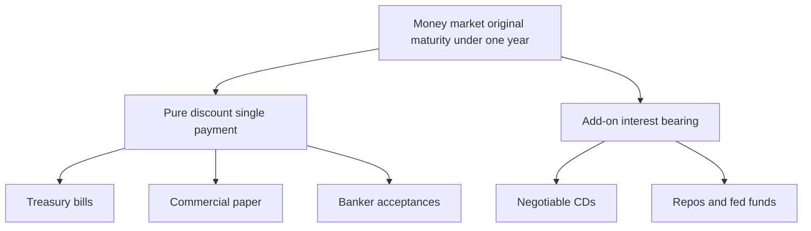
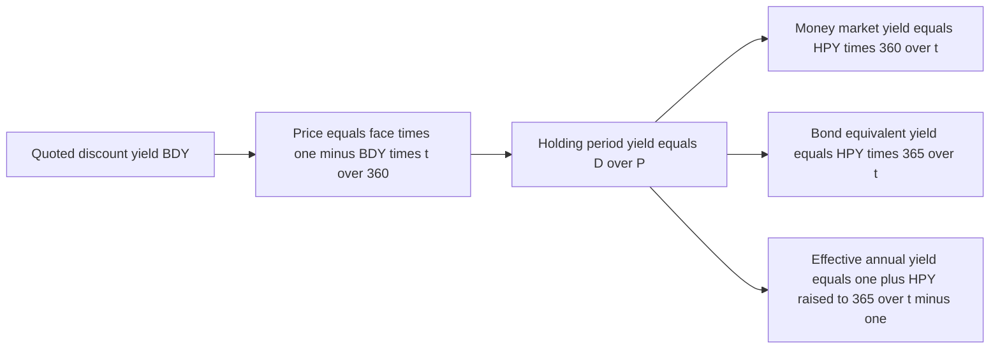
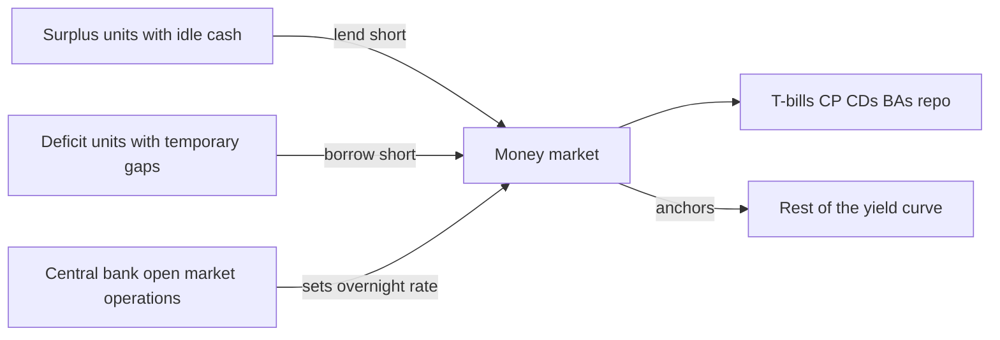
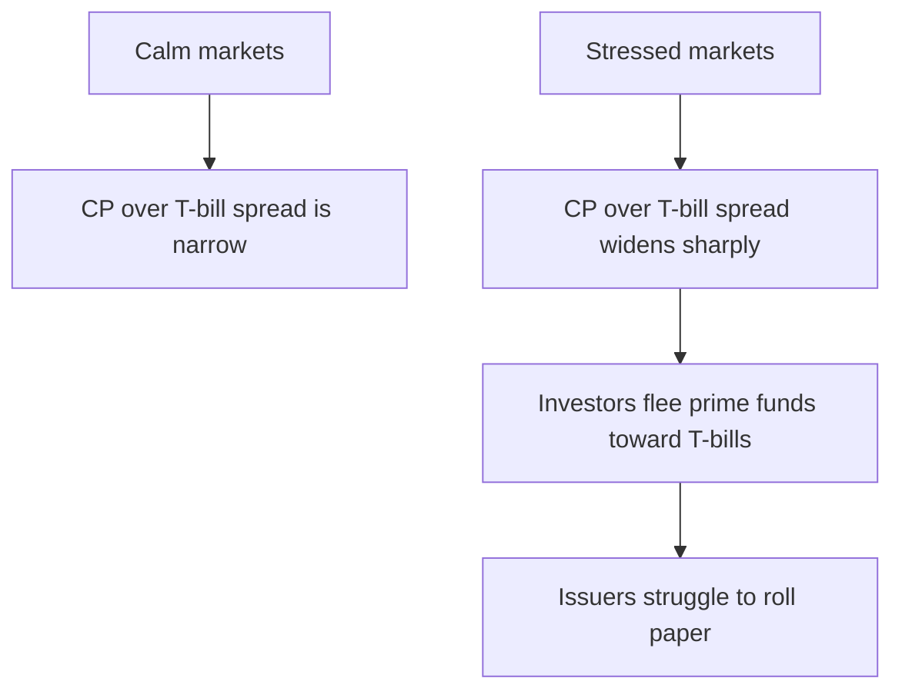

# Chapter 13 — Money Market Instruments and Yields

## 1. The Problem / The Need

Every serious participant in the financial system faces the same recurring headache: **the timing of cash inflows almost never matches the timing of cash outflows.** A corporation collects receivables on the 10th but must run payroll on the 1st. A bank takes in deposits that can be withdrawn tomorrow but has lent that money out for thirty years. A government collects most of its tax revenue in a few concentrated months but spends continuously. A money-market mutual fund promises investors they can redeem at any moment, yet it must earn a return on the cash it holds in the meantime.

Each of these players has two symmetric problems:

- **The cash-rich problem.** "I have money I don't need for a few days or weeks. Leaving it idle in a non-interest account is a pure loss. But I cannot lock it up for years, and I cannot afford to lose a cent of principal — I *will* need it back on a known date." This is the **surplus-unit** looking for a safe, short, liquid parking spot.
- **The cash-poor problem.** "I have a temporary gap. I am good for the money — I just need to bridge a few days or weeks until my own inflows arrive. Borrowing long-term is expensive and clumsy for a need this short." This is the **deficit-unit** looking for cheap, short-term funding.

The **money market** is the institutional answer to both. It is the wholesale market for **high-quality debt with an original maturity of one year or less** (in practice most activity is overnight to 90 days). It exists so that surplus units can lend idle cash safely and deficit units can borrow cheaply, both at maturities measured in days and weeks rather than years. The instruments are simple, standardized, and issued by borrowers of very high credit quality, precisely because the whole point is *safety and liquidity, not yield*.

The complication — and the reason this chapter needs real math — is that these instruments are quoted using several **incompatible yield conventions** that are historical accidents. A T-bill is quoted on a "discount" basis over a 360-day year; a CD is quoted on an "add-on" basis, also over 360 days; the "true" investor return that lets you compare a T-bill to a coupon bond uses 365 days. If you cannot convert fluently between **discount yield, money-market yield, bond-equivalent yield, and effective annual yield**, you will systematically misjudge which instrument is actually cheaper or richer — and in an interview, you will be exposed instantly.

## 2. The Core Idea

Two ideas run through this entire chapter.

**Idea 1 — Money-market instruments come in exactly two structural flavors.**

- **Pure discount (single-payment) instruments.** You pay less than face today and receive the full face value at maturity. There is no coupon. The interest *is* the difference between what you pay and what you get back. T-bills, commercial paper, and banker's acceptances work this way. The instrument is bought at a **discount** to par.
- **Interest-bearing / add-on instruments.** You deposit (or lend) face value today and receive face value **plus** interest at maturity. The interest is *added on* to the principal. Negotiable certificates of deposit are the classic example.

Everything else — the quotes, the yields, the risks — is a variation on these two skeletons.

**Idea 2 — A "yield" is meaningless until you know the convention.** The same physical trade (pay $98,000 today, get $100,000 in 90 days) can be truthfully described as an 8.00% yield, an 8.16% yield, an 8.28% yield, or an 8.54% yield, depending on which convention you use. They differ on two dimensions: **which base** you divide the interest by (face value vs. price paid), and **which day-count** you annualize with (360 vs. 365 vs. compounding). Learn the four conventions and the conversions between them and this chapter is essentially solved.

*Figure 13.1 — The money-market universe splits cleanly into discount instruments and add-on instruments.*

## 3. Why / How It Works

**Why so short?** Short maturity is the single most powerful risk-control device available. Interest-rate risk (duration) is tiny when the instrument matures in weeks; a 90-day bill barely moves in price when rates jump. Credit risk is contained because a borrower's ability to survive the next 30–90 days is far more predictable than its solvency in ten years. Liquidity is high because standardized, short paper is easy to value and easy to sell. This is why the money market is where cautious institutional cash lives.

**Why the odd quoting conventions?** History. The **bank discount** convention for T-bills dates to an era of hand computation: quoting interest as a percentage *of the round face value* over a *360-day* year (twelve 30-day months) made mental arithmetic and coupon tables easy. It stuck. It is admittedly a *worse* description of the investor's true return — it understates it — but it is the market standard and every U.S. T-bill, CP, and BA is quoted on it. The **add-on** convention for CDs mirrors how a bank actually credits interest to a deposit. And the **365-day** conventions exist so investors can compare these instruments to coupon-bearing notes and bonds, which use actual/365-type reasoning. The conventions are not "right" or "wrong"; they are dialects, and fluency means translating between them without thinking.

**Why credit quality is so high.** Because the buyers are cash managers whose mandate is capital preservation, the market only clears for very strong issuers: sovereigns (T-bills), highly rated corporations and financial firms (CP), and banks (CDs, BAs). Weak credits simply cannot sell short paper cheaply, which is itself a signal — a company that suddenly *cannot* roll its commercial paper is often in serious trouble (this is exactly what happened to several firms in 2008).

## 4. Full Content — Instruments and the Yield Mathematics

### 4.1 The instruments

**Treasury bills (T-bills).** Short-term obligations of the national government (in the U.S., the Treasury), issued at a discount, in maturities of 4, 8, 13, 17, 26, and 52 weeks. Considered the closest thing to a risk-free instrument in domestic currency terms. Quoted on a **bank discount** basis. Deep, liquid, the benchmark against which all other money-market paper is priced.

**Commercial paper (CP).** Unsecured, short-term promissory notes issued by large, creditworthy corporations and financial institutions to fund working capital and bridge financing. Typical maturity 1–270 days (270 keeps it exempt from full securities registration in the U.S.). Issued at a discount, like a T-bill, but carries **credit and liquidity risk**, so it yields more than a T-bill. "Rollover risk" is central: issuers continuously re-issue maturing paper, and a market that refuses to buy new paper creates an instant funding crisis. **Asset-backed commercial paper (ABCP)** is CP collateralized by a pool of receivables.

**Certificates of deposit (CDs).** Time deposits at a bank with a fixed maturity and rate. A **negotiable CD** (typically $1 million or more) can be sold in the secondary market before maturity, giving the holder liquidity while the bank keeps the funds for the full term. Structured as an **add-on** instrument: you deposit face, you receive face plus interest. Carries the bank's credit risk (mitigated by deposit insurance up to a limit, but large negotiable CDs exceed the insured cap).

**Banker's acceptances (BAs).** A time draft drawn on and *accepted* by a bank, historically used to finance international trade. When the bank stamps "accepted," it guarantees payment at maturity, converting the buyer's credit into the bank's credit. Sold at a discount, like a T-bill. Largely displaced by other instruments today but a classic exam topic because of the "two-name paper" credit-enhancement idea.

**Repurchase agreements (repos) and federal funds** are add-on, collateralized (repo) or uncollateralized (fed funds) overnight-ish lending between financial institutions. They are covered in their own right elsewhere but belong to the same family: overnight liquidity management.

### 4.2 The four yield conventions

Define, for a single-payment instrument:

- **F** = face (par) value received at maturity
- **P** = price paid today
- **D** = **F − P** = the dollar discount (the interest earned)
- **t** = days to maturity

**(a) Bank discount yield (BDY, also "discount yield" or "discount rate").** Interest as a fraction of **face**, annualized over **360** days:

$$
\text{BDY} = \frac{D}{F} \times \frac{360}{t}
$$

Note the two "flaws" from the investor's viewpoint: it divides by **F** (the amount you *don't* pay) rather than **P** (what you actually invest), and it uses a 360-day year. Both make BDY **understate** the true return. It is a quoting convention, not an investment return. To go from a quoted BDY back to price: $P = F \times \left(1 - \text{BDY} \times \frac{t}{360}\right)$.

**(b) Money-market yield (MMY, also "CD-equivalent yield").** Interest as a fraction of **price**, still annualized over **360** days:

$$
\text{MMY} = \frac{D}{P} \times \frac{360}{t} = \text{HPY} \times \frac{360}{t}
$$

where the **holding-period yield** $\text{HPY} = D/P$ is the actual return earned over the t days. MMY fixes the "divide by face" flaw but keeps the 360-day convention, so it puts a discount instrument on the same footing as an add-on CD. Directly from BDY:

$$
\text{MMY} = \frac{360 \times \text{BDY}}{360 - t \times \text{BDY}}
$$

**(c) Bond-equivalent yield (BEY).** Interest as a fraction of **price**, annualized over **365** days:

$$
\text{BEY} = \frac{D}{P} \times \frac{365}{t} = \text{HPY} \times \frac{365}{t}
$$

This is the yield that lets you compare a discount instrument to a coupon bond on an apples-to-apples calendar basis (for maturities ≤ 182 days; longer bills need a semiannual-compounding adjustment, ignored here). Directly from BDY: $\text{BEY} = \frac{365 \times \text{BDY}}{360 - t \times \text{BDY}}$.

**(d) Effective annual yield (EAY, also EAR).** The HPY **compounded** over a 365-day year:

$$
\text{EAY} = \left(1 + \text{HPY}\right)^{365/t} - 1 = \left(1 + \frac{D}{P}\right)^{365/t} - 1
$$

This is the economically "truest" measure: it accounts for the ability to reinvest and compound, and it uses the actual calendar. It is always the **highest** of the four for a given trade because it adds compounding on top of the 365-day base.

**The universal ordering** for any discount instrument is:

$$
\text{BDY} < \text{MMY} < \text{BEY} < \text{EAY}
$$

BDY is lowest (smallest base, short year). MMY beats it by fixing the base. BEY beats MMY by stretching to 365 days. EAY beats BEY by compounding.

### 4.3 Add-on yields (for CDs)

For an add-on instrument, interest is quoted as a rate applied to face over a 360-day year:

$$
\text{Interest} = F \times r_{\text{add-on}} \times \frac{t}{360}, \qquad \text{Maturity value} = F + \text{Interest}
$$

If you buy the CD at issue for its face value, your HPY is simply $\text{Interest}/F$, and you convert to BEY and EAY with the same 365-day formulas as above. The key contrast: a **discount** instrument's price is *below* face; an **add-on** instrument's initial investment *equals* face and you get more than face back.

## 5. Worked Examples

### Example 1 — A T-bill through all four conventions (the reconciliation)

**Setup.** A 90-day T-bill with face value **F = $100,000** trades at price **P = $98,000**. So **D = $2,000** and **t = 90**.

First, the actual holding-period yield:
$$\text{HPY} = \frac{2{,}000}{98{,}000} = 2.0408\%$$

Now the four conventions:

| Convention | Formula | Computation | Result |
|---|---|---|---|
| Bank discount (BDY) | $\frac{D}{F}\cdot\frac{360}{t}$ | $0.02 \times 4$ | **8.0000%** |
| Money-market (MMY) | $\text{HPY}\cdot\frac{360}{t}$ | $0.020408 \times 4$ | **8.1633%** |
| Bond-equivalent (BEY) | $\text{HPY}\cdot\frac{365}{t}$ | $0.020408 \times 4.05556$ | **8.2766%** |
| Effective annual (EAY) | $(1+\text{HPY})^{365/t}-1$ | $1.020408^{4.05556}-1$ | **8.5383%** |

**Cross-checks (proving the direct BDY conversions agree):**
- $\text{MMY} = \frac{360 \times 0.08}{360 - 90 \times 0.08} = \frac{28.8}{352.8} = 8.1633\%$ ✓
- $\text{BEY} = \frac{365 \times 0.08}{360 - 90 \times 0.08} = \frac{29.2}{352.8} = 8.2766\%$ ✓

Both routes land on the identical numbers, and the ordering **8.00 < 8.16 < 8.28 < 8.54** holds exactly as predicted. Notice the practical punchline: the *quoted* 8.00% understates the investor's true compounded return by **more than half a percentage point**. A cash manager comparing this bill to a CD quoted at, say, 8.20% add-on would be badly misled by the raw quotes and must convert both to a common basis first.

### Example 2 — From a commercial-paper quote to price and true yield

**Setup.** A dealer quotes 60-day commercial paper with face **F = $1,000,000** at a discount yield of **BDY = 5.25%**.

**Step 1 — Price.**
$$P = F\left(1 - \text{BDY}\cdot\frac{t}{360}\right) = 1{,}000{,}000\left(1 - 0.0525 \times \frac{60}{360}\right) = 1{,}000{,}000 \times (1 - 0.00875) = \$991{,}250$$

So the discount is **D = $8,750** and $\text{HPY} = 8{,}750/991{,}250 = 0.8827\%$.

**Step 2 — The comparable yields.**

| Convention | Computation | Result |
|---|---|---|
| BDY (quoted) | given | 5.2500% |
| MMY | $0.008827 \times \frac{360}{60}$ | 5.2963% |
| BEY | $0.008827 \times \frac{365}{60}$ | 5.3699% |
| EAY | $1.008827^{6.08333} - 1$ | 5.4918% |

**Reconciliation.** Because this CP yields **5.37% BEY** versus a comparable T-bill's BEY, the roughly one-percentage-point-plus pickup over a same-maturity bill is the compensation for the issuer's **credit and liquidity risk** — the money market pricing credit exactly as theory predicts. And again the four numbers respect the strict ordering, confirming the arithmetic is internally consistent.

### Example 3 — An add-on CD, contrasted with a discount instrument

**Setup.** A negotiable CD with face **F = $1,000,000**, term **t = 180 days**, quoted add-on rate **r = 4.80%** (360-day basis). You buy it at issue for face value.

**Step 1 — Interest and maturity value.**
$$\text{Interest} = 1{,}000{,}000 \times 0.048 \times \frac{180}{360} = \$24{,}000, \qquad \text{Maturity value} = \$1{,}024{,}000$$

You invest $1,000,000 (equal to face — the add-on signature) and receive $1,024,000.

**Step 2 — True yields.** Here HPY is on the face you invested: $\text{HPY} = 24{,}000/1{,}000{,}000 = 2.400\%$.
$$\text{BEY} = 0.024 \times \frac{365}{180} = 4.8667\%, \qquad \text{EAY} = 1.024^{365/180} - 1 = 1.024^{2.02778} - 1 = 4.9267\%$$

**Reconciliation and the teaching point.** The CD's *quoted* 4.80% is already close to its true return because the add-on convention divides interest by the amount actually invested (face = price here). Contrast with a discount instrument, where the quoted BDY sat well *below* the true return. This is the whole reason MMY is also called the **CD-equivalent yield**: converting a discount instrument to MMY restates it as if it were an add-on CD, so the two can be compared directly. If this CD's issuer offered instead a 180-day discount instrument, you would convert its BDY to MMY before deciding which is richer.

*Figure 13.2 — The conversion ladder starts from a quote, recovers price, then produces the three comparable yields.*

## 6. Money Market Funds and Liquidity Management

### 6.1 Money market funds (MMFs)

A **money market fund** is a mutual fund that holds a diversified pool of short, high-quality money-market instruments — T-bills, CP, CDs, repos, agency discount notes — and offers investors daily liquidity. It is the retail and corporate on-ramp to the wholesale money market: an individual cannot easily buy a $1 million negotiable CD, but she can buy shares of a fund that holds hundreds of them.

The historically defining feature was the **stable $1.00 net asset value (NAV)**. Because the underlying holdings are so short, funds were permitted to value them at **amortized cost** (accreting the discount toward par in a straight line) rather than marking to market, which kept the NAV pinned at exactly $1.00 per share. Investors treated MMF shares almost like cash. This works only as long as the true market value stays within a whisker of $1.00.

**Breaking the buck.** If losses push the true value below roughly $0.995, the fund "breaks the buck" and the NAV drops below $1.00 — a small percentage loss but a psychological earthquake, because investors were promised cash-like safety. This happened to the **Reserve Primary Fund in September 2008**, which held Lehman Brothers commercial paper that became nearly worthless when Lehman failed. The fund broke the buck, triggering a **run** on prime MMFs and a freeze in the CP market — a vivid demonstration that "safe" short paper is only as safe as its issuers and that liquidity can vanish in a panic.

**Post-crisis regulation** (in the U.S., the SEC's Rule 2a-7 framework, tightened after 2008 and again in 2014/2023) responded by:

- Tightening **credit quality** (only top-tier short-term paper), **maturity** (limits on weighted-average maturity, typically ≤ 60 days), and **diversification** limits.
- Requiring minimum **daily and weekly liquid assets** so the fund can meet redemptions without fire-selling.
- Splitting funds into categories: **government MMFs** (T-bills, agencies, government repo — allowed to keep a stable $1.00 NAV), **prime/institutional MMFs** (include CP and CDs — required to use a **floating NAV** so the price reflects true market value), and **tax-exempt MMFs** (municipal short paper).
- Permitting **liquidity fees** as a tool to slow runs.

Investors judge MMFs by the **7-day yield** (the annualized return over the past week) and its compounded cousin the **7-day effective yield** — a direct application of the annualization and compounding ideas from Section 4.

### 6.2 The money market and system-wide liquidity management

Zoom out and the money market is the **plumbing that keeps the financial system liquid**. Every major institution uses it to manage the gap between when cash arrives and when it is needed.

- **Banks** manage their reserve positions overnight: a bank short of reserves borrows in the **fed funds** or **repo** market; a bank with excess reserves lends. This is daily, and it is enormous.
- **Corporations** invest surplus operating cash in T-bills, CP, and MMFs for a few days or weeks, and issue their **own CP** to cover short gaps — cheaper and nimbler than drawing a bank line.
- **Governments** smooth the mismatch between lumpy tax receipts and continuous spending by issuing T-bills.
- **The central bank** conducts **monetary policy** here. Open-market operations, repos, and the policy rate all act on the money market first; the overnight rate is the anchor from which all other interest rates are built. When the central bank wants to ease, it injects reserves and pushes the short rate down; the effect ripples out along the curve.

*Figure 13.3 — The money market matches surplus and deficit units and is the point where central-bank policy enters the interest-rate system.*

The deep lesson: the money market is where **liquidity is priced**. In calm times the spread of CP over T-bills (a "credit spread" like the **TED spread**, CP or LIBOR over bills) is small and stable. When it blows out, it is one of the earliest and most reliable warnings of stress in the financial system — because it is precisely the market where the willingness to lend short-term is tested every single day.

*Figure 13.4 — The money-market credit spread is an early-warning gauge; a sudden widening signals a flight to quality and rollover stress.*

## 7. Connections

- **To duration and interest-rate risk (Ch. on duration).** Money-market instruments have near-zero duration by construction, which is why they are the "safe" bucket. The entire appeal is the *absence* of the price sensitivity that dominates long bonds.
- **To the yield curve (Ch. on term structure).** The overnight rate set in the money market is the short end — the anchor — of the yield curve. Expectations of future short rates, formed here, drive the shape of the whole curve.
- **To credit spreads (Ch. on credit).** CP-over-bills and BA spreads are short-maturity credit spreads; the same risk-compensation logic that prices corporate bonds prices money-market paper, just over days instead of years.
- **To coupon-bond pricing.** BEY exists precisely to bridge money-market instruments and coupon bonds onto one comparable calendar; it is the same actual/365 reasoning used in accrued-interest and bond-yield calculations.
- **To liquidity and funding risk (Ch. on repo/financing).** Rollover risk in CP is the same mechanism as margin/haircut spirals in repo — short-term funding that must be continuously renewed and can evaporate.

## 8. Key Terms

- **Discount instrument** — bought below face, no coupon; interest = face − price (T-bill, CP, BA).
- **Add-on instrument** — invest face, receive face + interest (negotiable CD, repo, fed funds).
- **Bank discount yield (BDY)** — interest ÷ **face**, × 360/t; the quoting convention, understates true return.
- **Money-market yield (MMY / CD-equivalent yield)** — interest ÷ **price**, × 360/t.
- **Bond-equivalent yield (BEY)** — interest ÷ **price**, × 365/t; comparable to coupon bonds.
- **Effective annual yield (EAY / EAR)** — HPY compounded over 365 days; the truest return.
- **Holding-period yield (HPY)** — the un-annualized return, D/P, over the t days actually held.
- **Rollover / refinancing risk** — the danger that maturing short paper cannot be re-issued.
- **Negotiable CD** — a large time deposit that can be sold in the secondary market.
- **Banker's acceptance** — a time draft guaranteed ("accepted") by a bank; "two-name paper."
- **Money market fund (MMF)** — mutual fund of short, high-quality paper offering daily liquidity.
- **Breaking the buck** — an MMF's NAV falling below $1.00.
- **Floating NAV** — a fund whose share price marks to market instead of holding at $1.00.
- **7-day yield** — the standard annualized return quote for an MMF.
- **TED / CP spread** — short-term credit spread; a stress gauge.

## 9. Common Confusions

**"Discount yield is the return I earn."** No. BDY is the *lowest* and least meaningful of the four measures. It divides by face (not what you invested) and uses a 360-day year. Your true annualized return is closer to the BEY, and your true compounded return is the EAY. In Example 1 the gap was 8.00% quoted vs. 8.54% true — over half a point.

**"360 vs. 365 is a rounding detail."** It shifts the yield by a factor of 365/360 ≈ 1.0139, i.e., ~1.4% *of the yield*. On an 8% instrument that is ~11 bps — enough to flip which of two instruments is cheaper. Never compare a 360-basis quote directly to a 365-basis quote.

**Confusing MMY and BEY.** Both divide by **price** (good). They differ *only* in the day-count: MMY uses 360, BEY uses 365. MMY compares a discount instrument to a CD (both 360); BEY compares it to a coupon bond (365).

**Thinking a CD is bought at a discount.** An add-on CD is bought at (or near) **face**; you get **more than face** back. Only discount instruments (T-bill, CP, BA) are bought below par. Mixing up the structure corrupts the yield base.

**"Money market funds are guaranteed / are cash."** They are *designed* to be cash-like but are not guaranteed. The Reserve Primary Fund broke the buck in 2008. Government MMFs are safest; prime funds carry credit and (now) floating-NAV risk.

**"Higher yield on CP than on a T-bill means CP is a better deal."** The extra yield is *compensation for credit and liquidity risk*, not free money. Convert both to BEY, then judge whether the spread adequately pays for the risk.

**Annualizing without compounding, then calling it the effective rate.** BEY annualizes linearly (× 365/t); EAY compounds (^365/t). EAY > BEY always. Only EAY is the true effective annual rate.

## 10. Recap

The money market is the wholesale market for high-quality debt maturing in a year or less. It exists to solve the universal mismatch between cash inflows and outflows: surplus units lend idle cash safely and short, deficit units borrow cheaply and short. Instruments come in two structures — **discount** (T-bills, commercial paper, banker's acceptances: buy below face, get face) and **add-on** (negotiable CDs: invest face, get face plus interest). Credit quality is uniformly high because the buyers' mandate is capital preservation.

The heart of the chapter is yield translation. A single trade can be quoted four ways: **bank discount yield** (interest ÷ face × 360/t — the quoting convention, and the lowest), **money-market yield** (interest ÷ price × 360/t — the CD-equivalent), **bond-equivalent yield** (interest ÷ price × 365/t — comparable to coupon bonds), and **effective annual yield** (HPY compounded over 365 — the truest, and always highest). The strict ordering BDY < MMY < BEY < EAY always holds, and every conversion in the worked examples reconciled exactly. Money market funds package this world for ordinary investors with daily liquidity and a (usually) stable $1.00 NAV — a promise that can break, as it did in 2008. And system-wide, the money market is where liquidity is priced every day and where central-bank policy enters the rate structure, making its credit spreads an early warning of financial stress.

## 11. Quick-Reference — Interview Points

- **Two structures.** Discount (buy < face, no coupon): T-bill, CP, BA. Add-on (invest face, get face + interest): CD.
- **Price from a discount quote:** $P = F(1 - \text{BDY} \times t/360)$.
- **Four yields, memorize the table:**

| Yield | Base | Day-count | Compounded? |
|---|---|---|---|
| BDY | Face | 360 | No |
| MMY | Price | 360 | No |
| BEY | Price | 365 | No |
| EAY | Price | 365 | Yes |

- **Ordering, always:** BDY < MMY < BEY < EAY.
- **Fast conversions from BDY:** $\text{MMY} = \frac{360\,\text{BDY}}{360 - t\,\text{BDY}}$; $\text{BEY} = \frac{365\,\text{BDY}}{360 - t\,\text{BDY}}$.
- **BDY understates the true return** — divides by face and uses 360 days. Never quote it as "the return."
- **BEY** is the money-market instrument restated to compare with **coupon bonds** (365-day calendar).
- **MMY = CD-equivalent yield** — restates a discount instrument as an add-on CD.
- **CP > T-bill yield** = credit + liquidity risk premium, priced daily. Rollover risk is the key CP danger.
- **Banker's acceptance** = "two-name paper" — bank's acceptance stamp adds its credit to the drawer's.
- **MMFs:** stable $1.00 NAV via amortized cost; government funds keep stable NAV, prime/institutional funds now float NAV; "breaking the buck" = Reserve Primary Fund, Sept 2008, Lehman CP. Judge by the **7-day yield**.
- **Systemic role:** overnight money-market rate anchors the yield curve; central-bank open-market operations act here first; the **CP-over-bills (TED) spread** is a real-time stress gauge.
- **Numeric anchor to remember:** 90-day bill at $98,000 face $100,000 → BDY 8.00%, MMY 8.16%, BEY 8.28%, EAY 8.54%.
