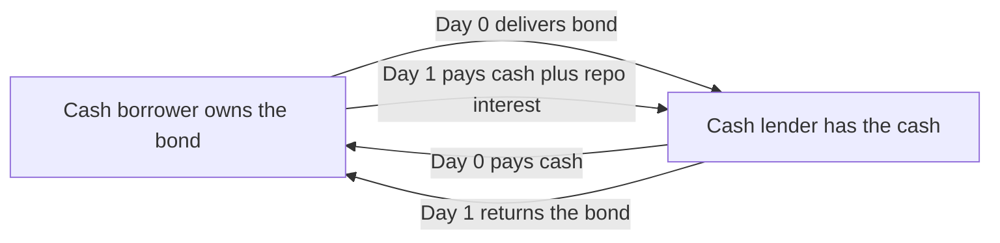
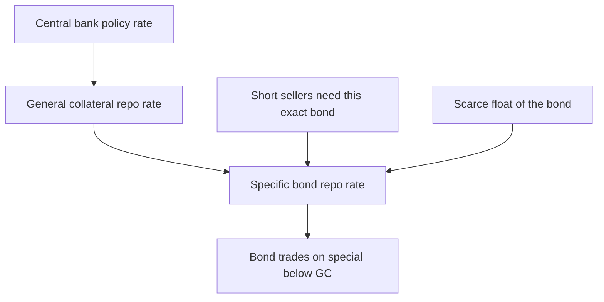
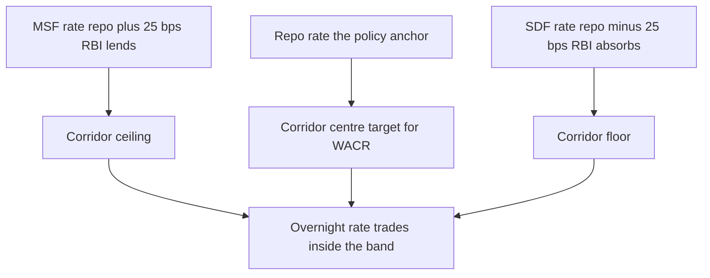

# Chapter 14 — Repo and Funding Markets

## 1. The Problem / The Need

A bond, once bought, is not the end of a story — it is a position that must be *financed*. Imagine you run a bond desk. You buy ₹100 crore of a 10-year government security because you believe yields will fall. Where did the ₹100 crore come from? You did not have it lying idle in a vault; almost no trading desk does. You borrowed it. And you borrowed it, most cheaply of all, by pledging the very bond you just bought as security for the loan.

That single move — *"lend me cash against this bond, and I'll buy it back tomorrow"* — is the repurchase agreement, or **repo**. It is simultaneously the most boring and the most important instrument in fixed income. Boring because a one-day secured loan sounds like nothing. Important because virtually the entire edifice of modern fixed-income markets — dealer inventories, leverage, short-selling, central-bank policy transmission, money-market funds — sits on top of the repo market. When the repo market seizes, everything above it wobbles. In 2008 and again in September 2019 (the US "repo spike") and March 2020, the world was reminded that repo *is* the plumbing.

The problems repo solves are concrete:

- **A cash-rich lender** (a money-market fund, a corporate treasury, a pension fund) wants to earn a return on idle cash overnight, but with almost no credit risk. An unsecured deposit at a bank exposes them to that bank failing. They want *collateral*.
- **A securities-rich borrower** (a bank, a bond dealer, a hedge fund) owns bonds but needs cash — to fund inventory, to meet a margin call, to settle trades. Selling the bonds outright is disruptive and may trigger tax or accounting consequences. They want *temporary* cash without giving up the economic exposure.
- **A central bank** wants a precise, low-risk lever to inject or drain overnight liquidity from the banking system and to steer short-term interest rates toward its policy target.

Repo answers all three at once. It is a **collateralised loan dressed as a pair of trades**. Understanding it turns the abstract phrase "the money market" into machinery you can see turning.

## 2. The Core Idea

A repurchase agreement is the sale of a security today combined with a binding agreement to buy it back at a fixed price on a future date. Economically it is a **secured loan**: the seller of the security is the *borrower of cash*, and the buyer of the security is the *lender of cash*. The security is the collateral. The difference between the sale price and the repurchase price is the *interest* on the loan, expressed as the **repo rate**.

The same transaction has two names depending on which side you stand:

- From the **cash borrower's** viewpoint (the one who owns the bond and needs cash), it is a **repo** — "I repo out my bonds."
- From the **cash lender's** viewpoint (the one who has cash and wants collateral), it is a **reverse repo** — "I reverse in the bonds."

One trade, two labels. This mirror is the single most common source of confusion, and we will nail it down in Section 8.

*Figure 14.1 — The two legs of a repo: cash and collateral change hands on Day 0 and swap back on Day 1, with interest added on the return leg.*

The elegance is that the cash lender holds the bond throughout the loan. If the borrower fails to repay, the lender simply keeps (and can sell) the bond. Credit risk is transformed into the far smaller risk that the *collateral loses value faster than you can liquidate it*. That residual risk is managed by the **haircut** (Section 4).

## 3. Why / How It Works

### Why a secured loan is cheaper than an unsecured one

Interest compensates a lender for two things: the time value of money and the risk of not being repaid. Strip out the repayment risk with good collateral and the lender demands less. That is why the **repo rate sits below comparable unsecured rates** (e.g., below the uncollateralised interbank rate). The gap between an unsecured benchmark and the secured repo rate is a real-time market price of bank credit risk — it blew out spectacularly in 2008.

### Why the "sale plus repurchase" structure rather than a plain pledged loan

Two reasons, one legal and one practical.

1. **Legal robustness on default.** In a plain pledged loan, if the borrower goes bankrupt, the lender may be caught in insolvency proceedings before it can seize and sell the collateral (an "automatic stay"). Because repo is legally a *sale* with an agreement to repurchase, in most major jurisdictions it enjoys **safe-harbour** treatment: the lender can immediately liquidate the collateral without waiting for the bankruptcy court. This legal certainty is *why* lenders accept such thin margins.
2. **Title transfer.** Ownership of the collateral actually passes to the cash lender for the life of the repo. The lender can, subject to the agreement, *re-use* (rehypothecate) that collateral — repo it out again to someone else. This re-use is what lets a single bond support a long chain of financing, multiplying the market's capacity to fund positions. It is powerful and, as 2008 showed, a channel through which stress propagates.

### How the repo rate is determined

The repo rate is set by supply and demand for cash against collateral, anchored by the central bank's policy rate. Two forces pull on it:

- **General-collateral (GC) demand:** when the collateral is "any government bond," the rate reflects the general cost of overnight secured cash. This tracks the policy rate closely.
- **Specialness:** when *one particular* bond is in heavy demand — because many traders have shorted it and must borrow it to deliver — lenders of *that* specific bond can charge a premium. They charge the premium by accepting a *lower* repo rate on the cash (they are effectively being paid to lend the scarce bond). A bond "on special" therefore trades at a repo rate well below GC, sometimes near zero. This is the market's mechanism for pricing scarcity of a specific security. (We meet specialness again in Section 6.)

*Figure 14.2 — The repo rate cascades from the policy rate to the general-collateral rate to the specific-bond rate, where scarcity can push a bond on special.*

## 4. Full Content — Mechanics, Haircuts, Collateral, and the Math

### 4.1 The two prices and the repo interest

Let:

- $P_0$ = the cash the borrower receives on the near leg (the "purchase price" or start proceeds)
- $P_1$ = the cash the borrower repays on the far leg (the "repurchase price")
- $r$ = the repo rate (annualised, quoted as a money-market rate)
- $n$ = the term of the repo in days
- $B$ = the day-count basis (360 in USD/EUR money markets; **365 in India and GBP**)

The repurchase price is:

$$P_1 = P_0 \times \left(1 + r \times \frac{n}{B}\right)$$

The **repo interest** — the lender's earning, the borrower's cost — is:

$$\text{Interest} = P_1 - P_0 = P_0 \times r \times \frac{n}{B}$$

Note that repo interest uses **simple interest** on an actual/360 (or actual/365) money-market convention, *not* the bond-equivalent semi-annual compounding of Chapter 3.

### 4.2 The haircut (or initial margin)

The cash lender does not lend the full market value of the collateral. It lends *less*, keeping a cushion so that if the borrower defaults and the bond's price has fallen, the lender is still made whole after selling. That cushion is the **haircut**.

If the collateral has market value $M$ (including accrued interest — its *dirty* price) and the haircut is $h$ (a fraction), then the cash advanced is:

$$P_0 = \frac{M}{1 + h} \qquad \text{(margin-ratio convention)}$$

or, under the simpler and very common **haircut-as-percentage-of-value** convention:

$$P_0 = M \times (1 - h)$$

The two conventions give slightly different numbers; documentation specifies which is used. Throughout this chapter, unless stated, we use $P_0 = M \times (1 - h)$.

Equivalently, market participants quote the **margin ratio** (also "initial margin"):

$$\text{Margin ratio} = \frac{\text{Collateral value}}{\text{Cash lent}} = \frac{M}{P_0}$$

A 2% haircut corresponds to a margin ratio of about 102%. The haircut protects the lender; a *larger* haircut means *less* cash for a given bond, i.e., worse funding for the borrower.

**What drives the size of the haircut?**

| Factor | Effect on haircut | Intuition |
|---|---|---|
| Collateral price volatility | Higher volatility → larger haircut | Bigger price moves before you can liquidate |
| Collateral liquidity | Illiquid → larger haircut | Harder to sell fast without moving the price |
| Term of the repo | Longer term → larger haircut | More time for value to erode |
| Counterparty credit quality | Weaker borrower → larger haircut | More likely to actually default |
| Correlation of collateral and borrower ("wrong-way risk") | Correlated → much larger haircut | The collateral tanks exactly when the borrower fails |

Typical haircuts: near **0.5–2%** for government bonds, **3–8%** for investment-grade corporates, and much larger — sometimes 15%+ — for equities or lower-rated structured collateral.

### 4.3 Margining and marking to market

For repos longer than a day, the collateral is **marked to market** daily. If the bond's price falls, the lender is now under-collateralised and issues a **margin call**: the borrower must post additional collateral or cash (variation margin) to restore the agreed margin ratio. If the price rises, the borrower can call excess collateral back. This daily re-margining, governed by the **Global Master Repurchase Agreement (GMRA)** internationally (or the domestic master agreement), is what keeps the lender's exposure near zero throughout the life of the trade.

### 4.4 Collateral: general vs specific

- **General Collateral (GC) repo:** the lender will accept any bond from an agreed *basket* (typically all on-the-run and off-the-run government securities). The lender cares about the *cash rate*, not which bond it gets. GC is a pure money-market instrument for financing.
- **Specific / Special repo:** the lender wants *one particular* security (usually because it needs to deliver that bond into a short sale or a settlement fail). Here the trade is about *sourcing the bond*, and the cash rate becomes secondary — it drops below GC by the "specialness spread."

### 4.5 The full cost-of-carry picture

When you finance a bond in repo, your net carry over the holding period is:

$$\text{Net carry} = \underbrace{\text{Coupon accrued on the bond}}_{\text{you earn}} - \underbrace{\text{Repo interest paid}}_{\text{you pay}}$$

If the bond's coupon accrual exceeds the repo cost, you have **positive carry** — you are paid to hold the position. This is normal in an upward-sloping yield curve where long-bond coupons exceed short repo rates. Positive carry is a major reason leveraged bond positions are attractive; it is also why carry trades unwind violently when repo rates spike above coupon income.

### 4.6 Types of repo by structure

| Structure | Who holds the collateral | Key feature |
|---|---|---|
| **Bilateral (deliverable) repo** | Cash lender receives the bond directly | Simplest; used for specials and directional funding |
| **Hold-in-custody (HIC) repo** | Borrower keeps the bond in a segregated account | Risky for lender (collateral not delivered); rare post-crisis |
| **Tri-party repo** | A third-party agent bank holds and manages collateral | Agent handles valuation, margining, substitution; dominant for GC financing |
| **Term repo** | As above | Fixed maturity beyond overnight (1 week to several months) |
| **Open repo** | As above | No fixed end date; rolls daily until either side terminates; rate can reset |

**Tri-party repo** deserves emphasis: an agent bank (in the US, the clearing banks; in India, the CCIL platform) sits in the middle, holding collateral, valuing it, applying haircuts, and swapping collateral in and out as needed. This industrialises GC financing and removes the operational burden of delivery from the two principals.

## 5. Worked Examples

### Example 1 — A plain overnight government repo (the base case)

A dealer owns ₹100,00,00,000 (₹100 crore) face value of a government bond. Its *dirty* market price is 101.50 (per 100 face), so the market value is:

$$M = 100{,}00{,}00{,}000 \times \frac{101.50}{100} = ₹101{,}50{,}00{,}000$$

The lender applies a **1% haircut** and the overnight repo rate is **6.50%** (India, actual/365, $n = 1$ day).

**Cash advanced (near leg):**

$$P_0 = M \times (1 - h) = 101{,}50{,}00{,}000 \times (1 - 0.01) = 101{,}50{,}00{,}000 \times 0.99 = ₹100{,}48{,}50{,}000$$

**Repo interest for 1 day:**

$$\text{Interest} = P_0 \times r \times \frac{n}{B} = 100{,}48{,}50{,}000 \times 0.065 \times \frac{1}{365}$$

$$= 100{,}48{,}50{,}000 \times 0.065 \times 0.00273973 = ₹17{,}894.52$$

**Repurchase price (far leg):**

$$P_1 = P_0 + \text{Interest} = 100{,}48{,}50{,}000 + 17{,}894.52 = ₹100{,}48{,}67{,}894.52$$

**Reconciliation / self-check.** Let's verify the interest independently via the multiplicative form:

$$P_1 = P_0 \times \left(1 + 0.065 \times \tfrac{1}{365}\right) = 100{,}48{,}50{,}000 \times 1.000178082 = 100{,}48{,}67{,}894.5 \checkmark$$

The two methods agree to the rupee. Note the lender earns ₹17,894.52 for one night, fully secured, with a ₹1.015 crore collateral cushion (the 1% haircut) protecting it. The *lender's* return on cash outlaid is exactly 6.50% annualised: $\frac{17{,}894.52}{100{,}48{,}50{,}000} \times 365 = 0.0650$. ✓

### Example 2 — A term repo with a margin call

Same dealer, but now a **14-day term repo** at **6.75%**, collateral dirty value ₹101,50,00,000, haircut **2%**, margin ratio maintained at 102% (i.e., collateral must always be ≥ 1.02 × cash lent).

**Near leg cash:**

$$P_0 = 101{,}50{,}00{,}000 \times (1 - 0.02) = 101{,}50{,}00{,}000 \times 0.98 = ₹99{,}47{,}00{,}000$$

**Repo interest over 14 days:**

$$\text{Interest} = 99{,}47{,}00{,}000 \times 0.0675 \times \frac{14}{365} = 99{,}47{,}00{,}000 \times 0.0675 \times 0.0383562$$

$$= 99{,}47{,}00{,}000 \times 0.00258904 = ₹2{,}57{,}533.6$$

**Repurchase price:**

$$P_1 = 99{,}47{,}00{,}000 + 2{,}57{,}533.6 = ₹99{,}72{,}57{,}533.6$$

**Now a margin call on Day 5.** The bond's dirty price falls from 101.50 to 100.20. New collateral value:

$$M_{\text{new}} = 100{,}00{,}00{,}000 \times \frac{100.20}{100} = ₹100{,}20{,}00{,}000$$

Required collateral to keep the 102% margin ratio against the cash lent ($P_0 = ₹99{,}47{,}00{,}000$):

$$\text{Required} = 1.02 \times 99{,}47{,}00{,}000 = ₹101{,}45{,}94{,}000$$

**Shortfall (variation margin owed by the borrower):**

$$101{,}45{,}94{,}000 - 100{,}20{,}00{,}000 = ₹1{,}25{,}94{,}000$$

So the dealer must post **₹1.2594 crore** of additional collateral (or cash) to the lender to cure the margin deficit. 

**Reconciliation.** Sanity-check the margin logic: before the price drop the collateral was ₹101.50 cr against ₹99.47 cr cash, a ratio of $101.50/99.47 = 1.0204$, comfortably above 102%. After the drop, ₹100.20 cr / ₹99.47 cr = 1.00734, which is *below* 102% — hence a call is warranted, and topping up by ₹1.2594 cr restores $(100.20 + 1.2594)/99.47 = 101.4594/99.47 = 1.0200$ exactly. ✓ The haircut plus daily margining together keep the lender's exposure near zero even as the collateral loses 1.28% of its value.

### Example 3 — Financing a levered position and computing net carry

A dealer buys ₹50 crore face of a bond carrying a **7.20% annual coupon** (paid semi-annually, but we accrue linearly for a 30-day hold), dirty price 100.00, and finances it overnight-rolled in GC repo at an average **6.40%** for **30 days**, haircut **1%**.

**Cash the dealer must fund itself (its own capital / equity in the trade):** only the haircut portion. Market value = ₹50,00,00,000. Repo advances $P_0 = 50{,}00{,}00{,}000 \times 0.99 = ₹49{,}50{,}00{,}000$; the dealer funds the remaining **₹50,00,000** from its own capital.

**Coupon earned over 30 days (accrued, actual/365):**

$$\text{Coupon} = 50{,}00{,}00{,}000 \times 0.072 \times \frac{30}{365} = 50{,}00{,}00{,}000 \times 0.072 \times 0.0821918 = ₹2{,}95{,}890.4$$

**Repo cost over 30 days on the borrowed ₹49.5 cr:**

$$\text{Repo cost} = 49{,}50{,}00{,}000 \times 0.064 \times \frac{30}{365} = 49{,}50{,}00{,}000 \times 0.064 \times 0.0821918 = ₹2{,}60{,}432.9$$

**Net carry over 30 days:**

$$\text{Net carry} = 2{,}95{,}890.4 - 2{,}60{,}432.9 = ₹35{,}457.5 \; (\text{positive})$$

**Return on the dealer's own capital (₹50 lakh) from carry alone, annualised:**

$$\frac{35{,}457.5}{50{,}00{,}000} \times \frac{365}{30} = 0.00709 \times 12.1667 = 0.0863 = 8.63\%$$

**Reconciliation and the leverage lesson.** The bond itself yields ~7.20% but the dealer earns **8.63%** on *its own capital* purely from carry — because it financed 99% of the position at 6.40% and pocketed the 0.80% coupon-minus-repo spread on a base 100× its equity. That is leverage: a 0.80% gross carry spread magnified into 8.63% on equity. Now flip the repo rate. If overnight repo spiked to **7.60%** (above the 7.20% coupon), the repo cost becomes $49{,}50{,}00{,}000 \times 0.076 \times 0.0821918 = ₹3{,}09{,}264$, net carry turns to $2{,}95{,}890 - 3{,}09{,}264 = -₹13{,}374$ — **negative carry**, bleeding the position daily. This is exactly the dynamic that forces leveraged holders to dump bonds when funding markets tighten, and it is why the repo rate is not a sideshow but a driver of bond prices themselves. ✓

## 6. Connections

**To duration and directional views (Chapters 3–5).** Repo is *how* a view on rates gets expressed at scale. Buying a bond you expect to rally, financed in repo, is the levered long; the short side (below) needs repo to source the bond.

**To short-selling.** You cannot sell a bond you do not own unless you can *deliver* it. You borrow the bond via a **reverse repo** (you lend cash, receive the specific bond), then sell it in the market. If everyone shorts the same bond, that bond goes **on special** — its repo rate collapses below GC, and the cost of maintaining the short (the specialness spread) rises. Specialness is thus the funding market's price signal for crowded short positions. It also drives the **cheapest-to-deliver** dynamics in bond futures (Chapter 15): the CTD bond often trades special precisely because shorts in the future need to deliver it.

**To the yield curve and money markets (Chapters 2, 13).** The overnight repo rate is the short-anchor of the money-market curve. Term repo rates (1-week, 1-month, 3-month) trace out a secured money-market curve that, alongside the OIS curve, defines the risk-free short end. Since the post-LIBOR transition, **SOFR** (Secured Overnight Financing Rate) in the US is literally a *volume-weighted median of overnight Treasury repo rates* — the repo market *is* the risk-free benchmark now.

**To central-bank policy (Section 7).** Repo is the instrument through which the policy rate is imposed on the system.

**To credit risk (Chapter 10).** Repo converts counterparty credit risk into collateral (market + liquidity) risk. Wrong-way risk — collateral correlated with the counterparty — is the dangerous residue and a lesson from 2008's mortgage repo.

**To bond futures and swaps (Chapters 15–16).** The repo rate is an input to the futures fair-value (cost-of-carry) and defines the financing leg implicit in basis trades.

## 7. Key Terms

- **Repo (repurchase agreement):** sale of a security with an agreement to repurchase it at a set price and date; economically a secured loan where the security seller *borrows cash*.
- **Reverse repo:** the same trade from the cash lender's side — you *lend cash and receive collateral*. One transaction, two names.
- **Repo rate:** the interest rate on the cash leg, i.e., the annualised return implied by $(P_1 - P_0)/P_0$.
- **Haircut / initial margin:** the percentage by which collateral value exceeds cash lent; the lender's protective cushion.
- **Margin ratio:** collateral value ÷ cash lent (e.g., 102%).
- **General Collateral (GC):** repo against any bond from an agreed basket; a pure financing rate.
- **Special / specialness:** state where a specific bond is scarce, so its repo rate falls below GC; the gap is the specialness spread.
- **Tri-party repo:** repo where an agent bank holds and administers collateral for both sides.
- **Rehypothecation / re-use:** the cash lender's right to re-pledge received collateral, enabling collateral chains.
- **GMRA:** Global Master Repurchase Agreement — the standard legal contract governing cross-border repo.
- **LAF (Liquidity Adjustment Facility):** the RBI's framework for daily repo/reverse-repo operations to manage system liquidity.
- **Repo rate (policy, India):** the RBI's benchmark rate at which it lends to banks against government securities — the anchor of the entire rate structure.
- **SDF (Standing Deposit Facility):** the RBI's uncollateralised overnight absorption facility, now the floor of the corridor.
- **MSF (Marginal Standing Facility):** the RBI's overnight lending facility above the repo rate — the ceiling of the corridor.
- **SOFR:** Secured Overnight Financing Rate — the US risk-free benchmark, built from overnight Treasury repo transactions.

## 8. Common Confusions

**"Repo vs reverse repo — which am I doing?"** Anchor on **cash**. If you *give* cash and *take* the bond, you are doing a **reverse repo** (you are the cash lender). If you *take* cash and *give* the bond, you are doing a **repo** (you are the cash borrower). A single trade is a repo to one party and a reverse repo to the other. The label depends entirely on the perspective.

**RBI terminology is the *opposite* of the market's perspective.** When the RBI conducts a **repo** operation under the LAF, *it lends cash to banks* against collateral — from the RBI's standpoint it is receiving securities and giving cash, which by the strict definition is a reverse repo, but the RBI names it "repo" because it is the banks (the counterparties) who are repo-ing out their securities. Conversely, the RBI's "reverse repo" absorbs liquidity — banks park cash with the RBI. **Rule of thumb for India:** *RBI repo = RBI injects cash (rate you hear about in policy). RBI reverse repo / SDF = RBI absorbs cash.* Do not try to force it into the market-side definition; learn the central-bank convention separately.

**Haircut direction.** A *bigger* haircut is *worse* for the borrower (less cash per bond) and *safer* for the lender. Students often invert this. Higher haircut = more protection = tighter funding.

**Repo rate is not the bond's yield.** The repo rate is a money-market financing rate (simple interest, actual/360 or 365). The bond's yield to maturity is a separate, compounded, longer-horizon measure. The interplay of the two produces carry, but they are different numbers on different conventions.

**"Special" means a *low* repo rate, not a high one.** Beginners assume a hotly-demanded bond commands a *high* rate. The opposite: to obtain the scarce bond you must *accept less interest on your cash*, so the repo rate goes *down*, sometimes to zero or negative. Demand for the *bond* depresses the *cash* rate.

**Repo interest accrues on the cash, not the collateral face.** $P_1 - P_0$ is computed on $P_0$ (the cash advanced), not on the bond's face value or market value. The collateral only determines *how much* cash ($P_0$) via the haircut.

**Ownership actually transfers.** Unlike a pledge, in repo the collateral's legal title passes to the lender for the term. This is why the lender can re-use it and why default liquidation is fast — but it is also why collateral chains can amplify systemic stress.

## 9. Recap

A repurchase agreement is a **collateralised loan structured as a sale-and-repurchase pair**. The party who owns the bond and needs cash *sells now, buys back later* — that is a **repo**; the party supplying the cash and receiving collateral is doing a **reverse repo**. The interest is the difference between the repurchase price $P_1$ and the sale price $P_0$, set by the **repo rate** on a simple money-market basis: $P_1 = P_0(1 + r \cdot n/B)$.

The lender protects itself two ways: a **haircut** (lending less than the collateral is worth, $P_0 = M(1-h)$) and **daily marking-to-market with margin calls**. These together drive the lender's credit exposure near zero, which is why repo rates sit *below* unsecured rates. Haircut size scales with collateral volatility, illiquidity, term, and counterparty weakness.

Collateral comes in two flavours: **General Collateral** (any bond in a basket — pure financing, rate tracks the policy rate) and **special** (one scarce bond — its repo rate falls below GC, pricing the scarcity created by short-sellers). Structurally, repo runs **bilaterally** or through **tri-party agents**, and can be **overnight, term, or open**.

Economically, repo lets dealers **finance inventory with high leverage**, capturing the **carry** between coupon income and repo cost — positive when the curve slopes up, negative (and dangerous) when funding spikes. Repo also enables **short-selling** (borrow the bond via reverse repo, sell it) and underpins **benchmark rates** like SOFR. Central banks — the **RBI via its LAF** with the repo rate, SDF, and MSF forming a corridor — use repo as the primary lever to inject or drain overnight liquidity and steer the entire rate structure. When repo works, no one notices; when it jams, the whole market feels it.

## 10. Quick-Reference / Interview Points

**One-line definition to have ready:** "A repo is a secured overnight (or term) loan structured as a sale and repurchase of a bond; the security seller borrows cash, the buyer lends cash, and the repo rate is the interest."

**Core formulas:**

$$P_1 = P_0\left(1 + r\,\tfrac{n}{B}\right) \qquad \text{Interest} = P_0\, r\,\tfrac{n}{B} \qquad P_0 = M(1-h) \qquad \text{Margin ratio} = \tfrac{M}{P_0}$$

Day-count $B$: **365 in India/GBP, 360 in USD/EUR** money markets.

**The perspective mirror (say this cleanly):** Give cash + take bond = reverse repo (cash lender). Take cash + give bond = repo (cash borrower). Same trade, opposite labels.

**RBI / LAF corridor (India, know cold):**

| Facility | Direction | Role in corridor |
|---|---|---|
| **MSF** (Marginal Standing Facility) | RBI lends overnight, above repo | Ceiling |
| **Repo rate** (LAF) | RBI lends against G-secs | Policy rate / centre |
| **SDF** (Standing Deposit Facility) | RBI absorbs, uncollateralised | Floor (since Apr 2022) |

The **weighted average call rate (WACR)** is the operating target the RBI keeps near the repo rate; the corridor is typically ±25 bps (MSF = repo + 25 bps, SDF = repo − 25 bps).

*Figure 14.3 — The RBI's LAF corridor: MSF caps the overnight rate, SDF floors it, and the repo rate anchors the middle where the RBI steers the call rate.*

**Punchy talking points interviewers love:**

- Repo *is* the plumbing: dealer inventories, leverage, shorting, and money funds all sit on it. The 2019 US repo spike and March 2020 dash-for-cash showed what happens when it clogs.
- **SOFR is literally built from Treasury repo transactions** — the risk-free curve is now a repo curve. Know that LIBOR (unsecured, survey-based) was replaced by SOFR (secured, transaction-based) after the LIBOR scandal.
- **Specialness** prices crowded shorts: a bond on special has a repo rate *below* GC, and that spread is the cost of the short. Ties directly to **cheapest-to-deliver** in futures.
- **Carry = coupon accrual − repo cost.** Positive in an upward-sloping curve; leveraged carry trades unwind when repo spikes above coupon income.
- **Haircuts are procyclical:** they widen in stress exactly when funding is scarcest, forcing deleveraging — a documented amplifier of the 2008 crisis (the "haircut spiral").
- The genius of repo is **legal**: safe-harbour / title-transfer treatment lets the lender liquidate collateral instantly on default, which is *why* it can charge so little.
- **Wrong-way risk** — collateral whose value is correlated with the borrower's default — is the one place the "risk-free" story breaks; that was subprime mortgage repo in 2008.

**Quick numerical instinct:** overnight GC repo on ₹100 cr at 6.5% earns roughly ₹100 cr × 0.065 / 365 ≈ ₹17,800 per night. Term and haircut scale from there.
