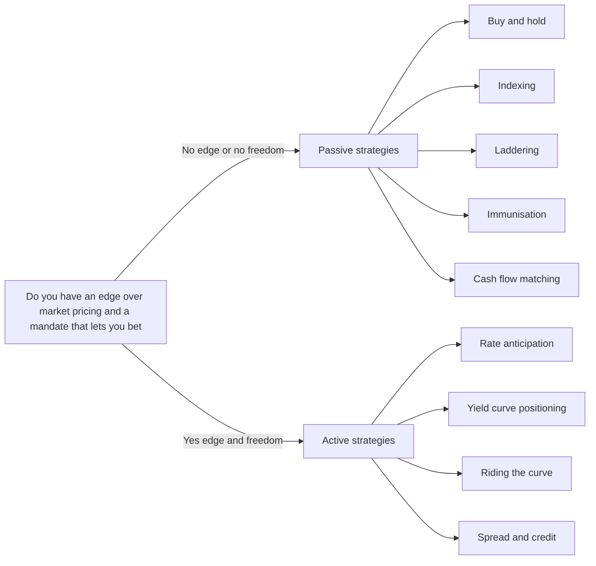
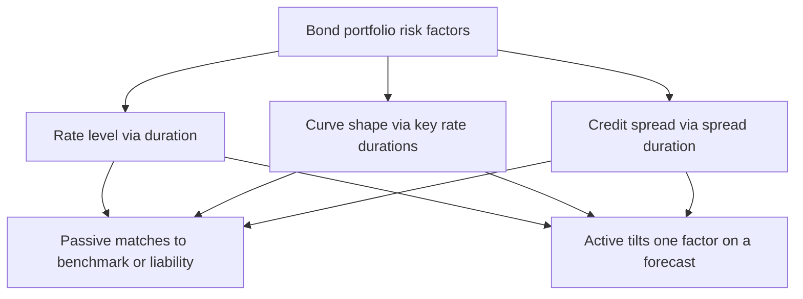
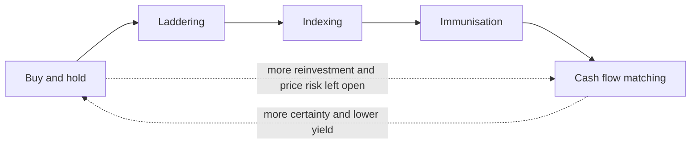
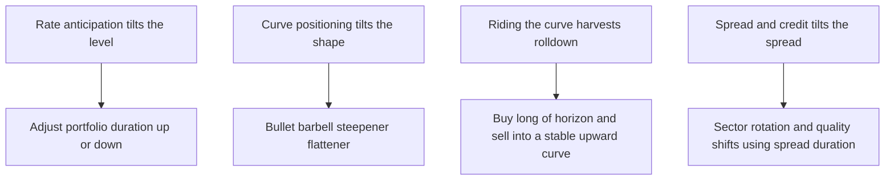

# Chapter 15 — Bond Portfolio Strategies

## 1. The Problem / The Need

Every chapter so far has been about a single bond, or a single risk sitting inside a single bond — its price, its yield, its duration, its spread. But nobody manages one bond in isolation. A pension fund holds ten thousand line items against a wall of future pension payments. An insurer holds a bond book calibrated to the payout profile of the policies it has written. A mutual fund holds a portfolio benchmarked to an index it must not drift too far from. A bank treasury holds a securities book that has to earn carry without blowing up when the Fed moves. In each case the question is no longer *"what is this bond worth?"* but *"how should I assemble and continually reshape a collection of bonds so that it does the job the money is there to do?"*

That is the portfolio problem, and it has a structure that a single-bond view completely hides. Three things collide:

- **A mandate.** What is the money *for*? Fund a stream of liabilities? Beat an index by 50 bp? Preserve capital? Generate income? The mandate fixes the objective function and the constraints. A liability-driven pension book and a total-return bond fund can hold the *same bonds* and still be run in opposite ways.
- **A view (or the deliberate absence of one).** Does the manager believe she can forecast rates, the shape of the curve, or credit spreads better than the market has already priced? If yes, she can try to *add* return by betting on that view. If no — or if the mandate forbids betting — she must build a portfolio that survives whatever happens.
- **Cost and governance.** Turnover costs money in bid-ask and taxes. Betting costs money when wrong and invites tracking error the trustees will question. Every strategy trades expected excess return against cost, risk, and the political reality of explaining a loss.

The strategic menu of fixed income is the set of disciplined answers to how those three collide. It divides, at the top, into **passive** strategies — which accept market pricing and aim to *match* something (an index, a liability, a horizon) — and **active** strategies — which reject the idea that the current curve and spreads are the last word and try to *beat* the market by positioning around a forecast. This chapter builds both halves from first principles, does the arithmetic that separates a laddered portfolio from an immunised one from a curve trade, and then closes the loop: how you actually *choose* a strategy by reading the mandate and the view together. This is the chapter that turns everything before it into a job.

## 2. The Core Idea

The whole landscape hangs off one axis: **how much do you trust the market's current pricing, and how much freedom does your mandate give you to bet against it?**

At one end sits the **passive** philosophy. It says: the bond market is deep, liquid and fiercely competitive, so today's yield curve and spreads are the best available forecast of the future. Do not try to out-guess it. Instead, decide what outcome you need — replicate an index, defease a set of liabilities, lock a horizon return — and build the cheapest, most robust portfolio that *delivers that outcome regardless of what rates do*. Passive management is not "doing nothing"; laddering, immunisation and cash-flow matching are precise engineering. It is *doing nothing predictive*.

At the other end sits the **active** philosophy. It says: pricing is *usually* right but not *always* right, and a manager with a genuine edge — a rate forecast, a curve-shape view, a credit insight — can systematically capture the gap between where a bond is priced and where it *should* be. Active management deliberately takes positions that *win if the view is right and lose if it is wrong*. Every active trade is a bet, sized against a benchmark, whose whole justification is a forecast that differs from the market's.

Between the poles lies a spectrum, not a binary — **enhanced indexing** that tilts a benchmark by a few bp of duration or spread; **contingent immunisation** that manages actively until a safety floor is threatened, then locks in. But the organising question never changes.

*Figure 1 — the strategy spectrum organised by view and freedom.*

The second core idea, which recurs everywhere below, is that fixed-income risk is *multi-dimensional*. A stock has essentially one market beta. A bond portfolio has, at minimum, exposure to the **level** of rates (duration), the **shape** of the curve (key-rate durations, curve slope and curvature), and **credit spreads** (spread duration). Passive strategies aim to *neutralise or match* these exposures; active strategies aim to *tilt* one of them on purpose while controlling the others. Knowing which dimension a strategy touches is the fastest way to understand it.

## 3. Why / How It Works

### Why passive can be a rational choice, not a surrender

The efficient-market case for passive fixed income is actually stronger than for equities in one respect and weaker in another. Stronger: the largest, most liquid sectors (Treasuries, on-the-run issues, agency MBS) are traded by armies of well-capitalised professionals, so predictable mispricings are arbitraged away fast; after costs the median active government-bond manager struggles to beat the index. Weaker: bond indices are genuinely hard to *replicate* — a broad aggregate index can contain thousands of illiquid issues that never trade, so pure "full replication" is impossible and even passive managers must *sample*. So passive bond management is rarely literal replication; it is **stratified sampling** — matching the index's exposures (duration, sector, quality, key-rate profile) with a tractable subset of bonds. The "why it works" is that *matching the risk factors matches the return* even if you don't hold every CUSIP.

### Why immunisation works — the duration offset

Immunisation is the deepest passive idea, and it rests on the price/reinvestment offset from the interest-rate-risk chapter. Recall the two-sided nature of rate risk: a rate rise *depresses* a bond's sale price but *raises* the rate at which coupons reinvest; a rate fall does the opposite. These forces cross at exactly one horizon — the **Macaulay duration**. If you set the duration of your asset portfolio equal to the horizon of your liability (or the duration of a liability stream), then to a first order a one-time parallel shift in rates leaves the *accumulated value at the horizon* unchanged. The loss on reinvested coupons is exactly offset by the gain on the bonds' terminal value, or vice versa. You have "immunised" the horizon outcome against the level of rates.

The mechanism is that immunisation *deliberately positions you at the crossover horizon* so that neither price risk nor reinvestment risk dominates. It converts an uncertain path into a locked terminal value — but only under assumptions (parallel shifts, one shift, periodic rebalancing) that we will stress-test in the confusions section.

### Why cash-flow matching needs no such assumptions

Cash-flow matching sidesteps duration entirely. Instead of *offsetting* interest-rate risk, it *eliminates* it by construction: you buy bonds whose coupons and principal *land on the same dates and in the same amounts* as the liabilities. If the cash is already sitting there when the liability comes due, it does not matter what rates did in between — you are not selling anything and not reinvesting anything material. This is why cash-flow matching (also called **dedication**) is the most conservative passive strategy and needs no rebalancing. Its cost is that a perfectly matching bond set is expensive and constraining; you pay for certainty in yield give-up.

### Why active can add value — where the edge lives

Active management only "works" where the market's current pricing embeds a *forecast* that a manager can beat. The yield curve today implies a path of future short rates (via forward rates — see the spot/forward chapter). If a manager believes the *realised* path will differ, she can position for it: extend duration if she expects rates to fall by more than forwards imply, flatten or steepen if she expects the curve to reshape differently than forwards imply, overweight credit if she expects spreads to tighten more than the carry already compensates for. The edge is always the same shape: **a probability-weighted forecast that diverges from the one baked into current prices.** No divergence, no trade.

*Figure 2 — how the two philosophies attack the same three risk dimensions.*

## 4. Full Content — Strategies, Formulas and Mechanics

### 4.1 The passive family

**Buy-and-hold.** Buy bonds, clip coupons, hold to maturity, reinvest coupons, repeat. Turnover near zero; costs minimal; no view. Realised return over the holding period is the reinvested internal cash flow, sensitive only to *reinvestment* rates, not to interim price. Suited to an investor who genuinely holds to maturity and does not mark to market economically (e.g. a small held-to-maturity book). The weakness: no rebalancing means the portfolio's risk profile drifts, and there is no protection if you *are* forced to sell.

**Indexing.** Replicate the return of a bond benchmark (e.g. a broad aggregate). Because full replication is usually infeasible, managers use **stratified sampling / cell-matching**: partition the index into cells by sector × quality × maturity/duration bucket, then hold bonds so the portfolio's weight and *contribution to duration* in each cell matches the index. The objective is minimal **tracking error** — the standard deviation of the return difference between portfolio and index. Enhanced indexing permits small, controlled tilts (a few bp of duration, minor sector over/underweights) to add modest excess return while keeping tracking error tight.

The dollar contribution to duration of a position is the key matching quantity:

$$D_{\$,i} = D_i \times MV_i$$

and the portfolio duration is the market-value-weighted average:

$$D_P = \sum_i w_i D_i, \qquad w_i = \frac{MV_i}{\sum_j MV_j}$$

Matching $\sum_i w_i D_i$ *and* the key-rate-duration profile cell by cell is what makes a sample track the index.

**Laddering.** Spread maturities evenly across a horizon — e.g. equal amounts maturing in years 1, 2, …, 10. Each year a bond matures and is reinvested at the long end of the ladder. A ladder is a *self-averaging* structure: it holds a roughly constant average maturity, continually reinvesting a slice at prevailing rates, so it dollar-cost-averages across the rate cycle. It blends price stability (short rungs) with yield (long rungs), needs almost no forecasting, and provides regular liquidity. Compared with a **barbell** (only short + long) or a **bullet** (all clustered at one maturity), a ladder is the diversified middle — lower curve-shape risk, no bet.

**Immunisation (single liability).** To fund one future payment of known amount at horizon $H$:

1. Set portfolio **Macaulay duration = $H$**.
2. Set portfolio **present value = present value of the liability**.
3. **Rebalance** periodically, because duration drifts as time passes and as yields change (duration does not fall one-for-one with calendar time), to keep $D_P = $ remaining horizon.

Under a one-time parallel shift, the terminal accumulated value is protected: reinvestment and price effects offset at $H$. Convexity refines this — for a given duration, a *more convex* (more dispersed) portfolio does *better* under large or non-parallel shifts, so immunising managers prefer, among duration-matched options, the one with dispersion close to the liability's (a **duration + convexity match**), not maximal convexity, to avoid non-parallel-shift risk.

**Multiple-liability immunisation** generalises this. To immunise a *stream* of liabilities the classical (Redington) conditions are:

1. $PV_{\text{assets}} = PV_{\text{liabilities}}$
2. $D_{\text{assets}} = D_{\text{liabilities}}$ (dollar durations equal)
3. Convexity (dispersion) of assets **≥** convexity of liabilities, with asset cash flows *bracketing* the liability cash flows in time.

Condition 3 is what makes the surplus a local minimum that is *protected* against small parallel shifts.

**Cash-flow matching (dedication).** Choose a set of (usually non-callable) bonds whose combined coupons + principal reproduce the liability schedule date-by-date, working *backward* from the last liability: buy a bond maturing at the final date for that amount, net its coupons against earlier liabilities, then fill the next-earliest gap, and so on. No duration matching, no rebalancing, no interest-rate assumption. Most conservative, typically lowest yield (most constrained), highest certainty. **Horizon matching** is a hybrid: cash-flow match the near-term liabilities (where reinvestment/liquidity risk bites) and duration-immunise the long tail (where matching is expensive and shifts are more parallel).

*Figure 3 — the passive strategies ranked by conservatism and reinvestment-risk exposure.*

### 4.2 The active family

**Interest-rate (level) anticipation.** The purest active bet: forecast the *level* of rates and adjust **duration** accordingly. Expect rates to fall → *extend* duration (longer, lower-coupon, or use futures to add) to maximise price gain. Expect rates to rise → *shorten* duration (shift to short maturities, floaters, cash). The P&L of a duration tilt for a parallel yield change $\Delta y$ is captured by:

$$\frac{\Delta P}{P} \approx -D_{mod}\,\Delta y + \tfrac{1}{2}C\,(\Delta y)^2$$

The active manager sets portfolio duration *above* the benchmark's when bullish on price (bearish on rates falling), *below* when bearish. This is the highest-conviction, highest-variance active move — a wrong duration call is the fastest way to lose to a benchmark.

**Yield-curve positioning.** The curve moves in three roughly independent ways: **level (shift)**, **slope (steepen/flatten)**, and **curvature (butterfly)**. A manager with a *shape* view — not a level view — positions structure while holding total duration roughly constant:

- **Bullet** (concentrate near one maturity, say 10y): outperforms when the curve *flattens with a hump* / becomes less curved — benefits from the belly.
- **Barbell** (short + long, no belly): outperforms when the curve *steepens* or the belly cheapens; more convex than a duration-matched bullet, so it wins on large parallel moves too but gives up yield (the convexity is *paid for*).
- **Steepener / flattener** trades: to bet the 2s10s spread widens (steepens), go long the 2y and short the 10y in *duration-neutral* size so the trade is (approximately) immune to a parallel shift and exposed only to slope.

Key-rate (partial) durations $D_{KR,k}$ decompose total duration by maturity point so the manager can target a *specific* section of the curve:

$$\frac{\Delta P}{P} \approx -\sum_k D_{KR,k}\,\Delta y_k$$

**Riding the curve (rolldown).** In a *normal, upward-sloping* curve that is expected to *stay put*, you can earn more than yield-to-maturity by buying a bond longer than your horizon and *selling it before maturity*. As time passes the bond "rolls down" the curve to a lower yield — and because yield falls, its price *rises* above pure pull-to-par. Total return = coupon/carry **+ rolldown** (the price gain from the yield falling as maturity shortens). The strategy *only* works if the curve is upward-sloping and does not shift up; a rate rise can wipe out the rolldown. Return over horizon $h$:

$$R \approx \frac{\text{Coupon income} + (P_{\text{sold at lower yield}} - P_{\text{bought}})}{P_{\text{bought}}}$$

**Spread and credit strategies.** Move *down* (or up) the quality/liquidity spectrum to capture spread, and trade *changes* in spread:

- **Sector rotation / spread pickup:** overweight sectors (corporates, MBS, EM) whose spreads you expect to tighten or whose carry more than compensates for risk; underweight the expensive ones.
- **Credit up/down-grading anticipation:** buy a name before an expected upgrade (spread tightens, price rises), sell before a downgrade.
- **Spread duration** measures sensitivity to a change in the credit spread $s$ (holding the risk-free curve fixed):

$$\frac{\Delta P}{P} \approx -D_{spread}\,\Delta s$$

A credit tilt is a bet on $\Delta s$; the carry you earn while waiting is the spread itself, so even if spreads are unchanged you out-yield Treasuries — the classic "carry" argument, valid only until a default or a spread blow-out.

*Figure 4 — active strategies mapped to the risk dimension each one tilts.*

### 4.3 The blended middle

**Contingent immunisation.** Manage actively as long as the portfolio value stays above a **floor** — the amount that, immunised today at current rates, would still fund the liability at the horizon. The gap between current value and that floor is the **cushion** (safety margin). Trade actively while a cushion exists; the instant active losses erode the cushion to zero, *stop* and immunise, locking the minimum acceptable return. It is a stop-loss wrapped around active management, giving upside optionality with a hard floor.

## 5. Worked Examples

### Example 1 — Single-liability immunisation, and proving the offset

**Setup.** A fund owes **1,000,000 in 5 years**. The flat yield curve is **8%** annual. It wants to immunise with a portfolio whose Macaulay duration = 5.

- PV of liability = $1{,}000{,}000 / 1.08^5 = 1{,}000{,}000 / 1.469328 = \mathbf{680{,}583}$. Invest 680,583 today.
- Choose an 8% instrument with Macaulay duration 5. (A 5-year zero has duration 5 exactly; a coupon bond needs ~6-year maturity to reach duration 5. Use the **5-year zero** for a clean, exact demonstration — a zero held to its horizon has *no* reinvestment risk and its duration equals maturity, so it is the textbook perfect immuniser.)

**Buy the 5-year zero:** face value needed = $680{,}583 \times 1.08^5 = 680{,}583 \times 1.469328 = \mathbf{1{,}000{,}000}$ at maturity. Trivially, at year 5 it pays exactly 1,000,000 — the liability is met.

**Now prove immunisation against a shift.** Suppose *immediately after purchase* the yield jumps to **10%** and stays there.

- The zero still matures at 1,000,000 in year 5 — its terminal value is unaffected by the intervening yield (no coupons to reinvest, held to maturity). Accumulated value at year 5 = **1,000,000**. Liability met. ✅

This is the limiting case: a zero-coupon bond matched to the horizon has duration = horizon *and* zero reinvestment risk, so it immunises exactly for *any* shift, not just small ones.

**Contrast with a coupon bond of the same duration.** Take a portfolio with duration 5 built from an 8% **6-year annual coupon bond** (its Macaulay duration at 8% is ≈ 4.99 ≈ 5). Invest 680,583 (price ≈ par-ish; assume we buy the right face so PV = 680,583). If yields jump to 10% right after purchase:

- *Coupons* (years 1–5) now reinvest at 10% instead of 8% → the reinvestment pot at year 5 is **larger** than planned.
- *The bond is sold at year 5* with 1 year remaining; its sale price is discounted at 10% instead of 8% → the sale price is **lower** than planned.

Because duration = horizon = 5, these two effects **offset** to first order, and the accumulated value at year 5 lands *very close* to the required 1,000,000 (within a rounding/convexity sliver, and slightly *above* thanks to positive convexity). If yields had instead *fallen* to 6%, the reinvestment pot shrinks but the sale price rises — again offsetting. That offset *is* immunisation. The zero is just the special case where each side is individually zero.

**Reconciliation check.** Required accumulation factor over 5 years at the original 8% = $1.08^5 = 1.4693$; $680{,}583 \times 1.4693 = 1{,}000{,}000$. ✅ Both constructions fund the liability; the zero does so exactly for any shift, the duration-matched coupon bond does so approximately for small shifts and needs periodic rebalancing as its duration drifts away from the shrinking horizon.

### Example 2 — Riding the curve vs. buy-and-hold

**Setup.** Upward-sloping curve, assumed **static** over a 1-year horizon. Zero-coupon yields:

| Maturity | Spot yield | Price per 100 face |
|---|---|---|
| 1 year | 3.0% | 97.087 |
| 2 years | 4.0% | 92.456 |
| 3 years | 5.0% | 86.384 |

*Prices:* $100/1.03 = 97.087$; $100/1.04^2 = 92.456$; $100/1.05^3 = 86.384$.

**Strategy A — buy-and-hold a 1-year zero.** Buy at 97.087, redeem at 100 in one year.
Return $= 100/97.087 - 1 = \mathbf{3.00\%}$ (by construction, the 1-year yield).

**Strategy B — ride the curve with a 3-year zero.** Buy the 3-year zero at **86.384**. One year later, *if the curve is unchanged*, it is now a **2-year** zero and is priced off the **2-year** point at 4.0%: price $= 100/1.04^2 = \mathbf{92.456}$.
Return $= 92.456/86.384 - 1 = \mathbf{7.03\%}$.

**Reconcile the extra return.** The 3-year bond's yield *fell* from 5% (3-yr point) to 4% (2-yr point) simply because it aged and rolled down a static curve. Decompose:

- *Yield/carry portion* — one year of accretion at the original 5% purchase yield: $86.384 \times 1.05 = 90.703$, i.e. **+4.99%**, the yield-to-maturity you'd earn if the bond's own yield stayed 5%.
- *Rolldown portion* — the extra price gain because the yield dropped to 4%: $92.456 - 90.703 = 1.753$, i.e. **+2.03%** on the 86.384 cost.
- Total: $4.99\% + 2.03\% = \mathbf{7.03\%}$ ✅ (matches the direct calculation).

**The catch (self-check the risk).** Suppose instead the whole curve shifts **up 1%** over the year, so the bond becomes a 2-year zero yielding **5.0%**: price $= 100/1.05^2 = 90.703$. Return $= 90.703/86.384 - 1 = \mathbf{5.00\%}$ — still beats the 3% roll-hold, but the rolldown edge shrank. A larger shift up (curve to ~5.9% at the 2-yr point → price 89.2 → return ≈ 3.3%) erases nearly the whole advantage. Riding the curve is an active bet that the curve stays put; the extra 4 percentage points in the static case is *compensation for the shift risk you are bearing*, not free money.

### Example 3 — Matching duration to an index (enhanced indexing tilt)

**Setup.** A benchmark aggregate has **modified duration 6.0**. A manager runs a 100 mn portfolio and is *mildly bearish* on rates — she wants a small level tilt but must keep tracking error tight (mandate: duration within ±0.5 of benchmark). She holds two building blocks:

| Bond | Modified duration | Market value (mn) |
|---|---|---|
| Short bond S | 2.0 | ? |
| Long bond L | 9.0 | ? |

**Target portfolio duration = 5.6** (0.4 below benchmark — a defensive tilt, within the ±0.5 band).

Let $w$ = weight in the long bond L, $(1-w)$ in short bond S. Market-value-weighted duration:

$$D_P = w(9.0) + (1-w)(2.0) = 5.6$$
$$2.0 + 7.0\,w = 5.6 \Rightarrow w = \frac{3.6}{7.0} = 0.5143$$

So **51.43 mn in L, 48.57 mn in S**. Check: $0.5143(9) + 0.4857(2) = 4.629 + 0.971 = \mathbf{5.60}$ ✅

**Interpretation and P&L check.** If rates rise **+50 bp** (parallel), the tilt's benefit vs. the benchmark:

- Portfolio: $\Delta P/P \approx -5.6 \times 0.005 = -2.80\%$ → loss ≈ **2.80 mn**.
- Benchmark-duration portfolio (6.0): $\approx -6.0 \times 0.005 = -3.00\%$ → loss ≈ 3.00 mn.
- The defensive tilt **saved ≈ 0.20 mn** (20 bp of relative return) — exactly $ (6.0-5.6)\times 0.005 = 0.20\% $. ✅

If instead rates *fell* 50 bp, the same tilt would *cost* 0.20% — the symmetric price of being wrong. The tilt is small precisely because the mandate caps tracking error; this is enhanced indexing, not a swing-for-the-fences duration bet. The arithmetic reconciles the relative return exactly to the duration gap times the yield move, which is the whole point of thinking in dollar duration.

## 6. Connections

- **Duration & convexity (Ch. 07–08):** the master tools. Duration *is* the immunisation horizon and the unit of every active level/curve tilt; convexity is what makes a barbell beat a bullet on large moves and what makes immunisation robust (Redington's third condition).
- **Interest-rate risk (Ch. 09):** the price/reinvestment offset is the engine of immunisation and the risk that riding-the-curve accepts. This chapter is the *portfolio-level application* of that single-bond risk.
- **Spot & forward rates and term-structure theories (Ch. 05–06):** forward rates are the market's embedded forecast; every active trade is a bet that realised rates diverge from forwards. Riding the curve is profitable exactly when forwards *over*-predict the rate rise (the pure-expectations breakeven).
- **Yield measures (Ch. 04):** YTM assumes reinvestment at YTM — the assumption immunisation and cash-flow matching are designed to defuse. Rolldown return is precisely the gap between realised return and YTM on a static curve.
- **Credit risk & analysis (Ch. 10–11):** spread duration and credit rotation are the credit-dimension analogue of duration tilts; the carry-vs-default trade-off is the same expected-value logic.
- **Securitisation (Ch. 12):** MBS bring *negative convexity* and prepayment risk, which wreck naive immunisation — a caution that all the offsets here assume option-free bonds.
- **Liability-driven investing (LDI):** immunisation, cash-flow and horizon matching are the toolkit of pension and insurance ALM; the mandate side of this chapter *is* LDI.

## 7. Key Terms

- **Passive management:** accept market pricing; match an index, liability or horizon rather than forecast.
- **Active management:** take positions based on a forecast that diverges from market-implied pricing to earn excess return.
- **Indexing / stratified sampling:** replicate a benchmark's return by matching its risk-factor cells (sector × quality × duration) with a subset of bonds; minimise tracking error.
- **Tracking error:** standard deviation of the portfolio-minus-benchmark return; the risk budget of an indexer/enhanced indexer.
- **Laddering:** evenly spaced maturities; self-averaging, low-forecast structure blending liquidity and yield.
- **Barbell / Bullet:** concentration at the two ends vs. at one point of the curve; the classic curve-shape structures (barbell = more convex, pays up).
- **Immunisation:** set asset duration = liability horizon/duration (and PVs equal, convexity ≥) so a parallel shift leaves the horizon value unchanged.
- **Redington immunisation:** the three-condition multi-liability version (equal PV, equal duration, asset convexity ≥ liability convexity).
- **Cash-flow matching / dedication:** buy bonds whose cash flows land exactly on the liabilities; eliminates rather than offsets rate risk; no rebalancing.
- **Horizon matching:** cash-flow match the near term, immunise the far term.
- **Rolldown / riding the curve:** buy longer than horizon and sell into a static upward-sloping curve to capture the price gain from falling yield-as-it-ages.
- **Spread duration:** price sensitivity to a change in credit spread, holding the risk-free curve fixed.
- **Dollar (money) duration:** $D_{mod} \times MV$; the currency-unit sensitivity used to size duration-neutral and hedged trades.
- **Contingent immunisation:** manage actively above a floor; immunise the moment the cushion is exhausted.
- **Cushion / floor:** the safety margin between current value and the immunisable floor that funds the liability.

## 8. Common Confusions

**"Passive means doing nothing."** Wrong. Buy-and-hold does little, but immunisation and cash-flow matching are precise engineering that require solving for exact face amounts and (for immunisation) *ongoing rebalancing*. Passive means *non-predictive*, not inactive.

**"Immunisation is set-and-forget."** No — cash-flow matching is set-and-forget; *immunisation is not*. Duration does **not** decline one-for-one with the passage of time, and it changes when yields move, so an immunised portfolio drifts off its target duration and must be **rebalanced** periodically to keep $D_{assets} = $ remaining horizon. Skip rebalancing and the protection decays.

**"Immunisation protects against any rate move."** Only against *small parallel* shifts (first order). A *non-parallel* (twist) shift can break a duration-matched portfolio because two portfolios with the same duration can have very different key-rate profiles. This is why practitioners add convexity/dispersion matching and key-rate-duration matching, and why cash-flow matching (which needs no shift assumption) is the belt-and-braces alternative.

**"A barbell is a free lunch because it has more convexity."** No. For equal duration, the more convex barbell outperforms on *large* moves and on steepeners, but the market *charges* for that convexity via a lower yield. On a *stable* curve the lower-convexity bullet earns more carry. Convexity is bought, not free.

**"Riding the curve is arbitrage / guaranteed extra return."** No — it is an *active bet that the curve stays put*. If rates rise the rolldown gain shrinks or reverses. Its extra return over hold-to-maturity is compensation for the curve-shift risk you accept, and it needs an upward-sloping curve to exist at all.

**"Higher yield = better strategy."** Cash-flow matching usually has the *lowest* yield yet the *highest* certainty. Reaching for yield (down in credit, out in duration) buys expected return with risk. The mandate, not the yield, decides which trade-off is correct.

**"Duration matching = maturity matching."** A 10-year liability is not immunised by a 10-year coupon bond — that bond's *duration* is well below 10. You match **duration to horizon**, and for a coupon bond that means a longer maturity than the horizon.

**"Active vs passive is a binary choice."** It is a spectrum: enhanced indexing (tiny tilts), core-satellite (passive core + active satellites), and contingent immunisation all live in between.

## 9. Recap

Bond portfolio management organises around one axis — **trust in market pricing × freedom in the mandate** — which splits strategy into passive (match) and active (beat).

- **Passive** accepts today's curve and spreads as the best forecast and engineers a robust outcome: **buy-and-hold** (minimal effort, reinvestment-driven), **indexing** via stratified sampling to minimise tracking error, **laddering** for self-averaging liquidity-plus-yield, **immunisation** (duration = horizon; offset price and reinvestment risk; rebalance; add convexity for robustness), and **cash-flow matching** (eliminate rate risk by dating cash to liabilities; no assumptions, lowest yield, highest certainty).
- **Active** bets that realised rates/curve/spreads will diverge from what prices imply: **rate anticipation** (tilt total duration), **curve positioning** (bullet/barbell/steepener-flattener on shape, duration-held-constant), **riding the curve** (harvest rolldown on a static upward curve), and **spread/credit** (rotate sectors and quality using spread duration for carry and spread-change gains).
- The **blended middle** (enhanced indexing, contingent immunisation) tilts modestly or bets under a hard floor.

The worked examples proved the mechanics: a horizon-matched zero immunises exactly; a duration-matched coupon bond immunises approximately via the price/reinvestment offset; rolldown decomposes cleanly into carry + yield-drop and evaporates if the curve shifts; and a duration tilt's relative P&L equals the duration gap times the yield move. **Matching the risk factors matches the return; tilting a factor is a forecast with a price for being wrong.**

## 10. Quick-Reference / Interview Points

- **The one-liner:** passive = *match* (index/liability/horizon) accepting market pricing; active = *beat* by betting realised rates/curve/spreads diverge from what forwards and spreads imply.
- **Immunisation recipe:** PV(assets)=PV(liab); Macaulay duration(assets)=horizon; convexity(assets) ≥ convexity(liab); **rebalance** as duration drifts. Protects only small parallel shifts.
- **Duration ≠ maturity.** Match duration to the liability horizon; a coupon bond needs a *longer* maturity than the horizon to hit a given duration.
- **Cash-flow matching vs immunisation:** matching *eliminates* rate risk (dated cash, no assumptions, no rebalancing, lower yield); immunisation *offsets* it (assumes parallel shifts, needs rebalancing, higher yield). Horizon matching hybridises them.
- **Barbell vs bullet:** equal duration — barbell is more convex, wins on large/steepener moves, *pays for it* in lower yield; bullet earns more carry on a stable curve.
- **Riding the curve** works only on an *upward-sloping, static* curve; return ≈ carry + rolldown; the excess over YTM is pay for curve-shift risk. Be able to decompose it (Example 2).
- **Duration tilt P&L:** relative return vs benchmark ≈ (benchmark duration − portfolio duration) × Δy. Extend duration if bullish on price (expect rates down); shorten if bearish.
- **Curve trades are duration-neutral** by design — a 2s10s steepener sizes the two legs to equal dollar duration so only *slope*, not level, drives P&L.
- **Spread duration** measures credit-spread sensitivity; a credit overweight earns carry (the spread) while betting on tightening (Δs < 0).
- **Contingent immunisation:** active while a cushion exists above the immunisable floor; lock in the instant the cushion hits zero.
- **Matching strategy to mandate:** liability-driven (pension/insurer) → immunise / cash-flow match / LDI; total-return fund vs benchmark → index or enhanced-index with controlled tilts; a house with a genuine rate/curve/credit view *and* an active mandate → the corresponding active tilt, sized by tracking-error budget. **The mandate sets the objective and constraints; the view justifies any deviation from passive. No view or no freedom → stay passive.**
- **Cardinal rule:** every active basis point of expected excess return is a forecast that diverges from market pricing — if you can't name the divergence, you don't have a trade, you have tracking error.
