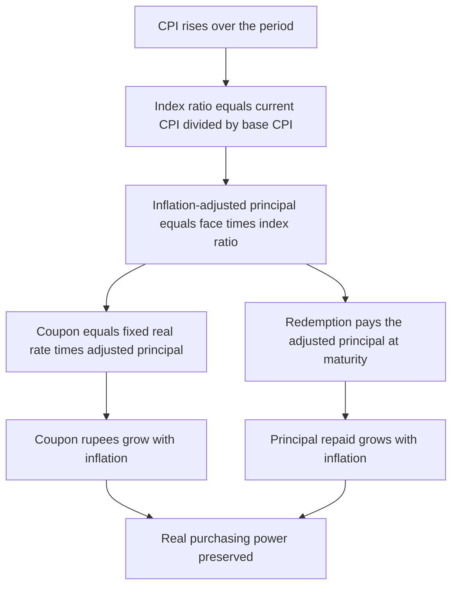
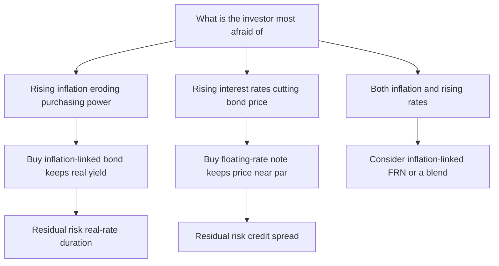

# Chapter 16 — Inflation-Linked and Floating-Rate Bonds

## 1. The Problem / Need

A plain "vanilla" bond promises a fixed stream of cash. A 10-year bond with a 5% coupon on ₹1,000 face pays ₹50 every year and returns ₹1,000 at maturity — no matter what happens in the world. That fixed-ness is exactly the problem. It exposes the investor to two very different risks that a fixed cash flow cannot defend against.

**Risk one: inflation erodes real purchasing power.** The ₹1,000 you get back in ten years buys far less than ₹1,000 does today. If inflation averages 6% a year, ₹1,000 in ten years is worth about ₹558 in today's money (1,000 / 1.06¹⁰). Your 5% coupon looked generous, but if inflation runs at 6% your *real* return is negative — you are getting poorer in purchasing-power terms while nominally "earning interest." A pensioner living off coupon income feels this directly: the grocery bill rises 6% a year, the coupon does not move at all.

**Risk two: rising interest rates crush the market price of a fixed coupon.** If you own a 5% bond and market yields jump to 8%, nobody will pay par for your stingy 5% stream. The price falls until the bond's yield matches the market. A fixed coupon is a *duration* liability — the longer the fixed stream, the more its price bleeds when rates rise.

Vanilla bonds bundle these two exposures and force the investor to eat both. The natural question is: *can we design a bond whose cash flows move with the thing that would otherwise hurt us?* If inflation is the enemy, build a bond whose payments grow with inflation. If rising rates are the enemy, build a bond whose coupon resets upward as rates rise. Those two design answers are the subject of this chapter:

- **Inflation-linked bonds (ILBs)** — TIPS in the US, Inflation Indexed Bonds (IIBs) in India — neutralise *inflation risk* by indexing principal (and therefore coupon) to a price index.
- **Floating-rate notes (FRNs)** — neutralise *interest-rate (price) risk* by resetting the coupon to a short-term reference rate every few months.

They protect against different dangers, and understanding *which* danger each one defuses is the whole point.

## 2. The Core Idea

Both instruments share one principle: **make a cash flow float instead of fixing it, so the investor is not left holding a stale promise.** But they float *different* legs of the bond against *different* benchmarks.

- An **inflation-linked bond** fixes the *real* coupon rate but floats the *principal*. The principal is scaled up by a published inflation index. Because the coupon is a fixed percentage of an ever-growing principal, the coupon rupees also grow with inflation. The investor locks in a **real yield** — a guaranteed return *above inflation* — and lets the nominal cash flows take care of themselves.

- A **floating-rate note** keeps the principal fixed at par but floats the *coupon rate*. Every reset period the coupon is set to a short-term reference rate (SOFR, T-bill rate, MIBOR) plus a fixed spread. Because the coupon re-prices to the market every few months, the bond's price barely moves when rates change — it behaves almost like cash.

The mnemonic:

> **Inflation-linked bonds protect the value of your money. Floating-rate notes protect the value of your bond.**

An ILB says "whatever inflation does, your purchasing power is preserved." An FRN says "whatever the market rate does, your bond stays near par and your coupon keeps up."

## 3. Why / How It Works

### 3.1 Why indexing the principal defends purchasing power

Purchasing power is *nominal rupees divided by the price level*. If the price level (CPI) rises 6%, you need 6% more nominal rupees to buy the same basket. An ILB delivers exactly that by multiplying the principal by an **index ratio**:

$$\text{Index Ratio} = \frac{\text{CPI on the settlement/payment date}}{\text{CPI on the issue (base) date}}$$

The nominal principal is `Face × Index Ratio`. When CPI is up 6%, the index ratio is 1.06, and the principal is up 6% — precisely cancelling the loss of purchasing power. Because the coupon is `real coupon rate × inflation-adjusted principal`, the coupon rupees inherit the same 6% uplift. The *real* value of every cash flow is held constant by construction. The investor's guaranteed return is stated in real terms: a "2% real" TIPS returns 2% *plus whatever inflation turns out to be*.

### 3.2 Why resetting the coupon defends price

A bond's price falls when rates rise because its coupon is now too low relative to the market. An FRN removes that gap. At each reset, the coupon is re-struck at the *current* market reference rate plus a spread. Right after a reset the bond's coupon equals the market's required return, so the bond is worth par. Its price can only drift away from par between resets, and only by the small amount that a single short period's mispricing is worth. This is why an FRN's **duration is tiny** — roughly the time to the next reset (e.g. ~0.25 years for a quarterly resetter), not the years-to-maturity. The investor holds something that looks like a money-market instrument wearing a long-maturity costume.

### 3.3 The Fisher relationship — the bridge between the two worlds

Everything about real-vs-nominal rests on the **Fisher equation**, which links nominal yield, real yield, and expected inflation:

$$(1 + y_{\text{nominal}}) = (1 + y_{\text{real}}) \times (1 + \pi_{\text{expected}})$$

Rearranged, the **exact real yield** is:

$$y_{\text{real}} = \frac{1 + y_{\text{nominal}}}{1 + \pi} - 1$$

And the common approximation (good for small numbers) is:

$$y_{\text{nominal}} \approx y_{\text{real}} + \pi$$

This equation is the reason a nominal bond and an inflation-linked bond of the same maturity can be *compared*: the difference in their yields reveals what the market expects inflation to be — the **breakeven inflation rate**.

*The diagram below shows how a rise in the price index propagates through an inflation-linked bond into every cash flow.*

*Figure 16.1 — How inflation flows through the principal into both coupon and redemption of an inflation-linked bond.*

## 4. Full Content — Mechanics, Formulas, and Math

### 4.1 Inflation-linked bond mechanics (TIPS model)

The dominant global design is the **Canadian/US "capital-indexed" model**, used by US TIPS and Indian CPI-linked IIBs. Its features:

**(a) Inflation-adjusted principal.** On any date,

$$\text{Adjusted Principal} = \text{Face} \times \frac{\text{CPI}_{\text{ref, date}}}{\text{CPI}_{\text{base}}}$$

US TIPS use a *reference CPI* built by interpolating the CPI-U with a three-month lag (the CPI for a settlement date in a month is interpolated between the CPI values published for the months roughly two and three months earlier). Indian IIBs use the WPI or CPI with a similar lag. The lag exists because official price indices are published with a delay, so the bond references a slightly stale but *known* index value.

**(b) Coupon on the adjusted principal.** The coupon rate is *fixed and real*. Each payment is:

$$\text{Coupon}_t = \frac{c_{\text{real}}}{f} \times \text{Adjusted Principal}_t$$

where `c_real` is the annual real coupon rate and `f` is the payment frequency (2 for semiannual TIPS). Because the adjusted principal grows with inflation, the coupon rupees grow too.

**(c) Deflation floor (principal protection).** At *maturity*, TIPS repay the **greater of** the inflation-adjusted principal and the original face:

$$\text{Redemption} = \max(\text{Adjusted Principal}_{\text{maturity}}, \ \text{Face})$$

So cumulative deflation over the bond's life cannot pull the redemption below par. **Important nuance:** the floor applies only to the *final redemption*, not to coupons. Coupons are still computed on the (possibly sub-par) adjusted principal during a deflationary stretch, so coupon rupees *can* fall below the nominal-coupon-on-face level in deflation. Indian retail IINSS-C bonds and the sovereign IIBs likewise carried capital protection — redemption at face value if the adjusted value fell below it.

**(d) Phantom income / tax.** In the US the annual *principal accretion* (the inflation uplift) is taxable in the year it accrues, even though the investor receives no cash for it until maturity — hence "phantom income." This is why TIPS are often held in tax-deferred accounts.

### 4.2 Indian Inflation Indexed Bonds — the specifics

India has run two distinct products, and interviews reward knowing the difference:

| Feature | Sovereign IIBs (Jun 2013) | IINSS-C, retail (Dec 2013) |
|---|---|---|
| Index used | Wholesale Price Index (WPI) initially | Consumer Price Index (CPI, combined) |
| Design | Capital-indexed (principal indexed; fixed real coupon on indexed principal) | Coupon = fixed 1.5% p.a. **+** CPI inflation rate |
| Inflation protection | Both principal and coupon protected | Coupon protects; principal fixed at face |
| Capital protection | Redemption at face if indexed value falls below face | Principal returned at face |
| Target buyer | Institutions / market | Retail savers |

The sovereign IIBs are the "textbook TIPS" of India — indexed principal, fixed real coupon. The retail IINSS-C used a *simpler additive* structure: it did **not** index the principal; instead it paid `1.5% + realised CPI inflation` as the coupon. That additive design protects income against inflation but does not grow the principal — a meaningfully different mechanism worth calling out. (The switch from WPI to CPI for the sovereign series reflected CPI becoming the RBI's official inflation target measure.)

### 4.3 Real yield, nominal yield, breakeven inflation

The **breakeven inflation rate (BEI)** is the inflation rate at which a nominal bond and an inflation-linked bond of the same maturity deliver the *same* nominal return. From Fisher:

$$\text{BEI (exact)} = \frac{1 + y_{\text{nominal}}}{1 + y_{\text{real}}} - 1 \qquad\qquad \text{BEI (approx)} = y_{\text{nominal}} - y_{\text{real}}$$

Interpretation:

- If **realised inflation > BEI**, the ILB wins (its cash flows grew faster than the nominal bond's fixed stream).
- If **realised inflation < BEI**, the nominal bond wins.
- The BEI is the market's *expected* inflation **plus an inflation risk premium minus a liquidity premium** — it is not a pure forecast, but it is the best market-implied read on inflation.

### 4.4 Floating-rate note mechanics

An FRN's coupon each period is:

$$\text{Coupon rate}_t = \text{Reference rate}_t + \text{Quoted Margin (spread)}$$

- **Reference rate**: SOFR (US), MIBOR / T-bill rate (India), historically LIBOR/EURIBOR. The rate is *observed at the start of the period* (or compounded over the period, for SOFR-in-arrears) and the coupon is *paid at the end* — this is "set in advance, pay in arrears."
- **Quoted margin**: a fixed spread reflecting the issuer's credit at issue. A weak issuer pays SOFR + 1.50%; a strong one pays SOFR + 0.10%.
- **Reset frequency**: monthly, quarterly, or semiannual. Between resets the coupon is fixed; at each reset it re-strikes.

**Discount margin (DM).** The FRN analogue of yield-to-maturity. It is the constant spread over the *projected* reference rate that discounts the FRN's cash flows back to its current price. If the issuer's credit is unchanged, `DM ≈ quoted margin` and the price is near par. If the issuer's credit *deteriorates*, the market demands `DM > quoted margin`, and the price falls below par (a fixed quoted margin is now too thin). So an FRN removes *interest-rate* risk but **retains credit-spread risk** — that is the residual exposure.

**Why price stays near par.** Right after a reset the coupon equals reference + margin, which is what the market requires, so the discounted value is par. The price only wanders from par by the value of the spread mismatch over the remaining life, and resets keep pulling it back. Effective duration ≈ time to next reset.

*The timeline below shows how an FRN coupon is fixed at the start of each period and paid at its end, re-striking every reset.*

*Figure 16.2 — A floating-rate note sets each coupon in advance at reset and pays it in arrears, re-striking to the market every period.*

## 5. Worked Examples

### Example 1 — TIPS cash flows and real-return reconciliation

**Setup.** A US TIPS: face \$1,000, real coupon 2.00% annual paid semiannually (so 1.00% per period). Base CPI at issue = 250.00. Suppose the reference CPI evolves as below over the first year.

| Period (6-mo) | Reference CPI | Index ratio (CPI / 250) | Adjusted principal | Coupon = 1.00% × adj. principal |
|---|---|---|---|---|
| Issue | 250.00 | 1.0000 | \$1,000.00 | — |
| 1 | 252.50 | 1.0100 | \$1,010.00 | \$10.10 |
| 2 | 256.00 | 1.0240 | \$1,024.00 | \$10.24 |

**Cash received in year 1:** \$10.10 + \$10.24 = **\$20.34** in coupons, and the principal has *accrued* from \$1,000 to \$1,024 (a \$24.00 uplift not yet paid in cash but taxable in the US as phantom income).

**Reconciliation — did the investor actually earn ~2% real?** Total one-year economic gain = coupons + principal accretion = 20.34 + 24.00 = **\$44.34** on the \$1,000 starting value, i.e. a nominal return of 4.434%. One-year inflation was CPI 250 → 256 = 2.40%. The real return is:

$$y_{\text{real}} = \frac{1.04434}{1.02400} - 1 = 1.01986 - 1 = 1.99\% \approx 2.00\%$$

The real return lands on the stated 2% real coupon, exactly as designed — inflation passed straight through to the nominal cash flows and left the real return untouched. ✓

**Deflation-floor check.** Suppose instead CPI had *fallen* to 245 by maturity (index ratio 0.98). The adjusted principal would be \$980, but the redemption floor pays `max(980, 1000) = $1,000`. The investor is protected against a below-par principal at maturity (though the coupons during the deflation would still have been computed on the \$980 base).

### Example 2 — Real vs nominal yield and the breakeven decision

**Setup.** The 10-year nominal Treasury yields **4.50%**. The 10-year TIPS (real) yields **2.00%**.

**Breakeven inflation:**

$$\text{BEI (exact)} = \frac{1.0450}{1.0200} - 1 = 1.02451 - 1 = 2.451\%$$
$$\text{BEI (approx)} = 4.50\% - 2.00\% = 2.50\%$$

**Verify with Fisher (the reverse check):** if real = 2.00% and inflation = 2.451%, the implied nominal is `(1.0200)(1.02451) − 1 = 1.0450 − 1 = 4.50%`. ✓ It ties back exactly to the nominal Treasury yield — the two bonds break even at 2.451% inflation.

**Investor decision.**
- If you expect inflation **above 2.451%** (say 3.5%), buy the **TIPS** — you'll earn 2% real + 3.5% ≈ 5.5% nominal, beating the 4.5% nominal bond.
- If you expect inflation **below 2.451%** (say 1.5%), buy the **nominal bond** — the TIPS would give only ≈ 2% + 1.5% = 3.5% nominal, worse than 4.5%.
- If you have *no view*, the TIPS still removes inflation *uncertainty* and may be worth a small give-up for that insurance.

**Quantifying the difference at 3.5% realised inflation** (approximate nominal returns): TIPS ≈ 2.00% + 3.50% = 5.50%; nominal bond = 4.50% fixed. The TIPS outperforms by ≈ 100 bps per year — the payoff for having correctly bet inflation would exceed breakeven.

### Example 3 — Floating-rate note cash flows in a rising-rate world

**Setup.** A 2-year FRN, face \$1,000, coupon = **3-month SOFR + 0.40%**, reset quarterly, paid quarterly. Suppose SOFR at the four resets of year 1 comes in as below. (Quarterly coupon = annual rate ÷ 4.)

| Quarter | SOFR at reset | Coupon rate = SOFR + 0.40% | Quarterly coupon = rate/4 × \$1,000 |
|---|---|---|---|
| Q1 | 3.00% | 3.40% | \$8.50 |
| Q2 | 3.75% | 4.15% | \$10.375 |
| Q3 | 4.50% | 4.90% | \$12.25 |
| Q4 | 5.00% | 5.40% | \$13.50 |

**Year-1 coupons total:** 8.50 + 10.375 + 12.25 + 13.50 = **\$44.625**.

**Contrast with a fixed 3.40% bond.** A comparable fixed-rate bond struck at issue (3.40%) would have paid `3.40% × 1,000 = $34.00` for the whole year — and its *price* would have **fallen** sharply as SOFR climbed from 3% to 5%. The FRN instead:

1. **Raised its coupon** from \$8.50 to \$13.50 per quarter as rates rose — the income kept pace.
2. **Held its price near \$1,000** throughout, because each reset re-struck the coupon to the market. Its duration was only ~0.25 years (to the next reset), so the 200 bps rate move barely dented the price.

The fixed-rate holder was hurt twice (low income *and* capital loss); the FRN holder was protected on both counts. This is precisely the interest-rate protection an FRN is built for.

**Discount-margin nuance.** If, mid-life, the issuer's credit worsened so the market demanded SOFR + 0.90% (DM = 0.90% vs quoted margin 0.40%), the FRN's price would drop below par by roughly `(0.90% − 0.40%) × remaining duration`. The FRN neutralised *rate* risk but not *credit* risk — the residual exposure.

## 6. Connections

- **Duration and interest-rate risk (Ch. on duration).** ILBs have *real-rate* duration — they are still long instruments and lose value if *real* yields rise, even though they are inflation-protected. FRNs have near-zero rate duration but full *spread* duration. The chapter's whole point is *which* duration you keep and which you shed.
- **Yield curve & the Fisher decomposition.** The nominal curve = real curve (from ILBs) + breakeven inflation curve. Central banks and traders read the TIPS market to extract *market-implied inflation expectations* — a direct application of Fisher across maturities.
- **Monetary policy.** FRNs are the natural instrument when rates are expected to *rise* (they track the policy rate). ILBs are the hedge against a central bank *losing control of inflation*. The RBI launched IIBs in 2013 precisely when Indian CPI inflation was in double digits.
- **Credit risk.** An FRN strips out rate risk but isolates and *concentrates* credit-spread risk into the discount margin — connecting to credit analysis and spread duration.
- **Liabilities / ALM.** Pension funds and insurers with inflation-linked liabilities (indexed pensions) buy ILBs to *match* liabilities. Banks with floating-rate assets fund with FRNs to match. The instruments exist to hedge specific liability shapes.
- **TIPS ↔ inflation swaps.** The breakeven rate is arbitrage-linked to the fixed leg of a zero-coupon inflation swap — the derivatives market and the cash ILB market police each other.

## 7. Key Terms

- **Inflation-linked bond (ILB):** a bond whose principal (and hence coupon) is scaled by a price index to preserve real purchasing power.
- **TIPS:** Treasury Inflation-Protected Securities — US capital-indexed government ILBs, semiannual, CPI-U with a ~3-month lag, deflation floor at maturity.
- **IIB / IINSS-C:** India's sovereign Inflation Indexed Bonds (capital-indexed, WPI then CPI) and the retail IINSS-C (coupon = 1.5% + CPI, principal fixed).
- **Index ratio:** current reference CPI ÷ base CPI; the multiplier applied to face to get adjusted principal.
- **Adjusted (indexed) principal:** face × index ratio; the inflation-uplifted principal on which coupons are computed.
- **Real yield:** the yield in purchasing-power terms; the ILB's stated/quoted yield.
- **Nominal yield:** the yield in money terms; the vanilla bond's quoted yield.
- **Breakeven inflation (BEI):** nominal yield − real yield (approx); the inflation rate that equalises returns on nominal and inflation-linked bonds.
- **Fisher equation:** (1 + nominal) = (1 + real)(1 + inflation).
- **Phantom income:** the annual, unpaid principal accretion of an ILB that is nonetheless taxable in the accrual year (US).
- **Deflation floor:** ILB feature guaranteeing redemption at no less than original face.
- **Floating-rate note (FRN):** a bond whose coupon resets each period to a reference rate plus a fixed spread.
- **Reference rate:** the benchmark the FRN tracks (SOFR, MIBOR, T-bill rate).
- **Quoted margin / spread:** the fixed add-on to the reference rate, set at issue for the issuer's credit.
- **Discount margin (DM):** the FRN's yield measure — the spread over projected reference rates that prices the note; DM > quoted margin ⇒ price below par.
- **Set-in-advance, pay-in-arrears:** the coupon rate is fixed at the start of the period and paid at its end.

## 8. Common Confusions

**"Inflation-linked bonds have no interest-rate risk."** False. ILBs are inflation-*protected*, not rate-immune. If *real* yields rise, a long ILB's price falls just like any long bond. They shed inflation risk, not duration. (The instrument that sheds duration is the FRN.)

**"Floating-rate notes protect against inflation."** Only indirectly and imperfectly. FRNs track *nominal* short rates. If inflation rises and the central bank hikes, the reference rate — and the FRN coupon — rises with it, giving *partial* inflation protection. But if inflation rises while the central bank keeps rates low (financial repression, negative real rates), the FRN does **not** protect real purchasing power. Only an ILB guarantees a real return.

**"Breakeven inflation is the market's inflation forecast."** Close but not exact. BEI = expected inflation **+ inflation risk premium − ILB liquidity premium**. It is a market-implied number, not a clean forecast, and the premia can move it a few tenths either way.

**"The deflation floor protects every cash flow."** No — the `max(adjusted, face)` floor applies only to the **maturity redemption**. Coupons during a deflationary period are still computed on the (reduced) adjusted principal and can fall below the nominal-coupon-on-face level.

**"A TIPS coupon rate rises with inflation."** The *rate* is fixed (that's the real coupon). What grows is the *principal it's applied to*, so the coupon *rupees/dollars* grow while the *rate* stays constant. Contrast the Indian retail IINSS-C, where the *rate itself* (1.5% + CPI) moves.

**"An FRN always trades at par."** Only *at reset* and only if credit is unchanged. Between resets, and whenever the issuer's discount margin diverges from the quoted margin (credit deterioration), the price drifts from par.

**"FRN duration equals its maturity."** No — a 5-year quarterly-resetting FRN has effective duration ≈ 0.25 years (to next reset), not 5. Its *spread* duration, however, is close to full maturity.

**"Real yield can't be negative."** It can, and frequently is. In 2020–21 many TIPS had negative real yields, meaning investors *paid* for guaranteed inflation protection, accepting a return below inflation to lock in certainty.

## 9. Recap

- Vanilla fixed bonds expose investors to two enemies: **inflation** (erodes real value) and **rising rates** (crush price). Two instruments float different legs to fight each.
- **Inflation-linked bonds** fix the *real* coupon and float the *principal* via an index ratio (current CPI ÷ base CPI). Coupon = fixed real rate × adjusted principal; redemption carries a **deflation floor** at maturity. The investor locks a guaranteed **real yield**. TIPS (US, CPI, semiannual) and India's sovereign IIBs (WPI→CPI) are capital-indexed; India's retail IINSS-C used coupon = 1.5% + CPI with a fixed principal.
- The **Fisher equation** — (1 + nominal) = (1 + real)(1 + inflation) — bridges the two worlds and yields **breakeven inflation** = nominal yield − real yield. Buy the ILB if you expect inflation above breakeven; buy the nominal bond if below.
- **Floating-rate notes** fix the principal at par and float the *coupon* = reference rate + quoted margin, resetting every period. This keeps the price near par and duration tiny (≈ time to next reset). The residual risk is **credit spread**, measured by the **discount margin**.
- **Protection map:** ILBs defend *purchasing power* against inflation but keep real-rate duration; FRNs defend *price* against rising rates but keep credit risk. Neither is a free lunch — each swaps one exposure for another.

*The decision tree below maps an investor's dominant fear to the instrument that neutralises it.*

*Figure 16.3 — Matching the investor's dominant fear to the protective instrument, and naming the exposure each one leaves behind.*

## 10. Quick-Reference / Interview Points

**One-liners to have ready:**

- "ILBs protect the value of your *money*; FRNs protect the value of your *bond*."
- "A TIPS fixes the real *rate* and floats the *principal*; an FRN fixes the *principal* at par and floats the *coupon rate*."
- "Breakeven inflation = nominal yield − real yield. Above it, the linker wins; below it, the nominal wins."

**Formulas to reproduce on demand:**

| Concept | Formula |
|---|---|
| Index ratio | CPI(date) ÷ CPI(base) |
| Adjusted principal | Face × index ratio |
| ILB coupon | (real rate ÷ f) × adjusted principal |
| Redemption (TIPS) | max(adjusted principal, face) |
| Fisher (exact) | (1 + nominal) = (1 + real)(1 + inflation) |
| Real yield | (1 + nominal)/(1 + inflation) − 1 |
| Breakeven inflation | (1 + nominal)/(1 + real) − 1 ≈ nominal − real |
| FRN coupon rate | reference rate + quoted margin |
| FRN price signal | DM > quoted margin ⇒ price below par |

**Likely interview questions and crisp answers:**

- *"Does a TIPS have interest-rate risk?"* — Yes, **real**-rate duration. It's inflation-protected, not rate-immune; a long TIPS falls if real yields rise.
- *"Why is an FRN's duration so low?"* — The coupon resets to market every period, so its price is pulled back to par at each reset; effective duration ≈ time to next reset (~0.25y for quarterly). But spread duration ≈ full maturity.
- *"If inflation rises, is an FRN a good hedge?"* — Only if the central bank hikes in response, since the FRN tracks nominal short rates. Under financial repression (rates held below inflation) the FRN fails to protect real value; only an ILB guarantees a real return.
- *"What does breakeven inflation actually contain?"* — Expected inflation + inflation risk premium − liquidity premium. It's market-implied, not a pure forecast.
- *"Can real yields be negative?"* — Yes; investors accept a sub-inflation return to lock in certainty (common 2020–21).
- *"Difference between India's sovereign IIB and the retail IINSS-C?"* — The IIB is capital-indexed (principal indexed to WPI/CPI, fixed real coupon on it); the IINSS-C paid coupon = 1.5% + CPI with the *principal fixed* at face — an additive, not a capital-indexed, design.
- *"What risk does an FRN NOT remove?"* — Credit-spread risk, captured by the discount margin; a widening DM above the quoted margin pushes the price below par.

**Portfolio takeaways:** Use ILBs to hedge inflation-linked liabilities (indexed pensions) and to lock real returns; use FRNs to reduce duration and ride rising-rate cycles while staying near par. Combine them — or use an inflation-linked FRN — when both inflation and rate risk are live concerns.
