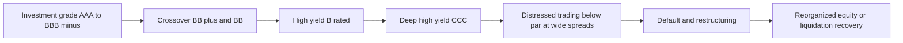
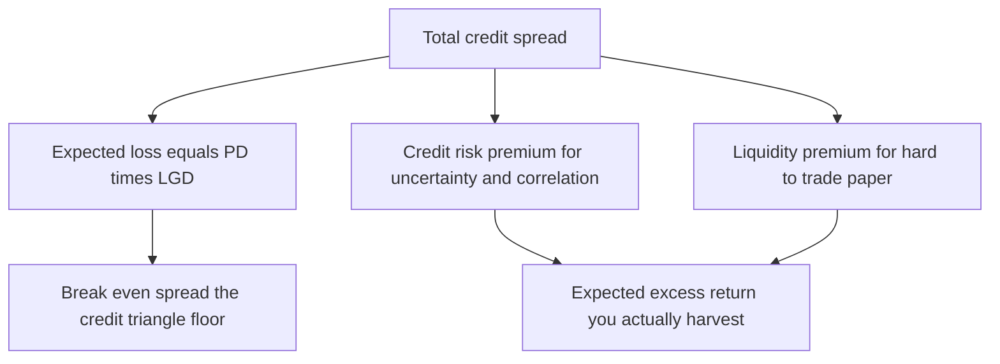
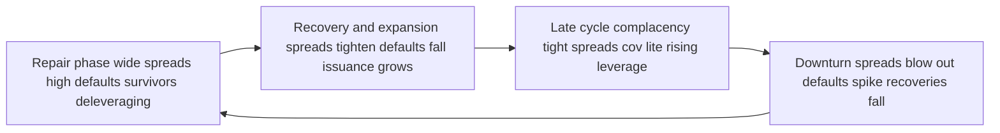
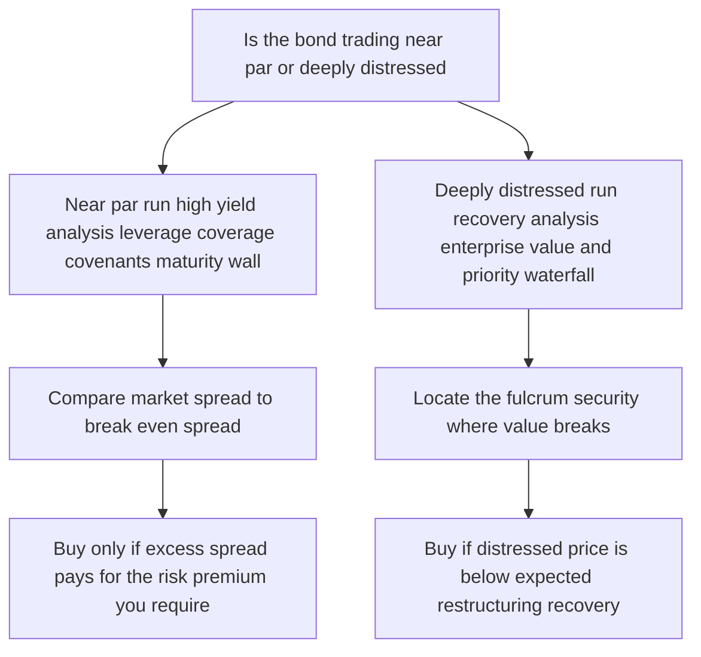

# Chapter 17 — High-Yield and Distressed Debt

## 1. The Problem / Need

Not every company that borrows is a fortress balance sheet. For every Apple or Johnson & Johnson that can issue ten-year debt at a whisker over Treasuries, there are hundreds of leveraged buyout targets, turnaround stories, cyclical manufacturers, and young growth firms whose credit is genuinely uncertain. These companies still need capital — to refinance, to fund acquisitions, to bridge a rough patch. The bond market has to decide two things about them: *will they lend at all*, and *at what price*.

The investment-grade framework of Chapters 15 and 16 breaks down here. In investment grade, default is a tail event; you are mostly pricing liquidity, mild spread drift, and rating migration. You can, to a first approximation, treat the promised yield as the expected yield. In high yield you cannot. Default is a *base-rate* event — something like 3-5% of issuers default in an average year, and 10%+ in a bad one. The promised yield is a fiction that only materializes if the company survives; the *expected* return is a probability-weighted blend of "you get paid" and "you fight over the wreckage in bankruptcy court."

This creates a distinct discipline. You need a way to think about companies where the central question is not "how much extra yield for liquidity and volatility?" but "what is the probability this borrower fails to pay, and if it does, how much do I recover?" And at the far end of the spectrum — distressed debt — the question inverts entirely: the bonds already trade at 40 or 50 cents on the dollar, the market has *already* priced in serious trouble, and the investor is no longer a passive lender but an active participant in a restructuring, sometimes buying debt precisely *because* they intend to convert it into ownership of the reorganized company.

This chapter builds the toolkit for that world: what junk bonds are, why their spreads are so wide, how to analyze them, how default and recovery interact to produce credit returns, how distressed investing works, and how the whole thing pulses with the credit cycle.

## 2. Core Idea

**High-yield bonds are the debt of below-investment-grade issuers, rated BB+/Ba1 or lower, where compensation for bearing default risk — not just liquidity or duration — is the dominant driver of return.** The higher promised yield is not a free lunch; it is a payment for accepting real losses that will occur in a predictable *fraction* of holdings, even if not in any single one.

Three ideas anchor everything:

1. **The spread is compensation for expected loss plus a risk premium.** Break the credit spread into (a) expected loss = probability of default × loss given default, and (b) everything left over — a premium for the *uncertainty* of that loss, illiquidity, and market risk aversion. In high yield, both pieces are large and both move a lot.

2. **Return is a portfolio phenomenon, driven by default and recovery.** You do not "earn the yield." You earn the yield on the survivors, minus the losses on the defaulters, net of recovery. Credit investing is fundamentally actuarial: you are underwriting a book of risks where the average outcome is what matters.

3. **It all breathes with the credit cycle.** Spreads, default rates, and recoveries are not constants — they swing together through repair, expansion, distribution/complacency, and downturn phases. Buying high yield when spreads are 300 bps is a completely different trade from buying it at 900 bps, even though the "asset class" is nominally the same.

Distressed debt sits at the tail of this distribution: securities of issuers at or near default, trading at deep discounts, where the analysis shifts from cash-flow-and-coupon to *balance-sheet-and-recovery* — what the enterprise is worth in a restructuring and where your claim sits in the priority waterfall.

## 3. Why / How It Works

**Why does a below-investment-grade issuer exist as a category at all?** Ratings agencies draw a bright line at BBB−/Baa3. Above it, an issuer is "investment grade"; at BB+/Ba1 and below, "speculative grade," "high yield," or, less politely, "junk." The line matters enormously because of *institutional plumbing*: many insurers, pension funds, and bond index mandates are contractually or by regulation restricted to investment-grade paper. When an issuer falls below the line, a whole class of natural buyers is forced to sell (see "fallen angels," Chapter 15). That forced-selling dynamic, plus the genuine credit deterioration behind it, is why the yield jump across the BBB/BB boundary is so much larger than the jump between any two adjacent investment-grade notches.

**Why are spreads so much wider?** Because the *distribution of outcomes* is fundamentally different. Take a single-B issuer. Historically, its annual default probability might be ~3-4%, and if it defaults, senior unsecured holders might recover ~40 cents. Over a five-year horizon the cumulative default probability can exceed 20%. A lender who ignores this and prices the bond like a Treasury would systematically lose money. The spread must at minimum cover the expected credit loss, and rational investors demand more than that — a *credit risk premium* — because the losses are lumpy, correlated (many issuers default together in recessions, exactly when the investor's other assets are also hurting), and hard to diversify away entirely.

**How does the math connect spread to default?** A useful approximation, the "credit triangle," links three quantities: spread ≈ hazard rate × loss given default, i.e., spread ≈ (annual default probability) × (1 − recovery rate). This is the break-even relationship: at this spread you are exactly compensated for expected loss and earn zero risk premium. Real spreads trade *wider* than this break-even because investors want compensation for uncertainty and illiquidity. Comparing the market spread to the break-even spread tells you how much risk premium you are being paid — the heart of relative-value credit analysis.

**How does distressed investing work mechanically?** When a company can no longer service its debt, it restructures — either out of court (an exchange offer, an amend-and-extend) or in court (Chapter 11 in the US). In a restructuring, the *absolute priority rule* governs who gets paid: secured creditors first, then senior unsecured, then subordinated, then equity last (often wiped out). Distressed investors buy claims at a discount, form or join creditor committees, and negotiate the reorganization plan. A common play is the *loan-to-own* or *fulcrum security* strategy: identify the layer of the capital structure that will convert into the new equity of the reorganized company (the "fulcrum"), buy it cheaply, and emerge owning the recapitalized business. The return comes not from coupons but from the gap between the distressed purchase price and the recovery value delivered by the restructuring.

*Figure 17.1 — Where high-yield and distressed sit on the credit-quality spectrum.*



## 4. Full Content — Formulas and Framework

### 4.1 The rating map

| Category | S&P / Fitch | Moody's | Character |
|---|---|---|---|
| Investment grade | BBB− and above | Baa3 and above | Default a tail event |
| Crossover / upper HY | BB+, BB, BB− | Ba1, Ba2, Ba3 | Speculative but resilient |
| Mid high yield | B+, B, B− | B1, B2, B3 | Meaningful default risk |
| Deep high yield | CCC+, CCC, CCC− | Caa1-Caa3 | High default probability |
| Near/at default | CC, C, D | Ca, C | Distressed / defaulted |

The single most important boundary is BBB−/BB+ (Baa3/Ba1) — the investment-grade / high-yield line.

### 4.2 The spread decomposition

The credit spread `s` over the risk-free rate can be decomposed:

```
s  ≈  Expected Loss  +  Credit Risk Premium  +  Liquidity Premium
```

where **Expected Loss (annualized) = PD × LGD**, with:
- **PD** = probability of default (annual hazard rate `λ`)
- **LGD** = loss given default = (1 − Recovery Rate) = (1 − RR)

So the pure **break-even (fair) spread** that just covers expected credit loss is:

```
s_breakeven  ≈  λ × (1 − RR)
```

This is the **credit triangle**. Any two of {spread, default rate, recovery} pin down the third under the zero-risk-premium assumption. The amount by which the *market* spread exceeds `s_breakeven` is the risk premium plus liquidity compensation you are being paid to bear.

### 4.3 Cumulative default and survival

If the annual (marginal, roughly constant) default hazard is `λ`, the probability of *surviving* `T` years is:

```
Survival(T)  =  (1 − λ)^T        (discrete)
             ≈  e^(−λT)          (continuous hazard)
```

and cumulative default probability:

```
CDP(T)  =  1 − (1 − λ)^T
```

Real hazard rates are not constant — they typically *rise* with time from issuance for high-quality names (nowhere to go but down) and can *fall* for distressed survivors (the ones who make it past the crunch stabilize).

### 4.4 Expected return of a credit position

Over a one-year horizon, ignoring rating migration and price drift, the expected return of a bond yielding spread `s` above the risk-free rate `r_f`:

```
E[return]  ≈  r_f + s  −  (PD × LGD)
           =  r_f + s  −  λ(1 − RR)
```

The `−λ(1−RR)` term is the *expected credit loss* haircut. If the spread only equals the break-even spread, expected return collapses to the risk-free rate — you took all that risk for nothing. The gap between spread and break-even is your *expected excess return* (the harvested risk premium).

### 4.5 Recovery and the priority waterfall

Recovery depends heavily on seniority and collateral. Rough long-run US averages (they vary by cycle and industry):

| Claim type | Typical recovery (cents on $) |
|---|---|
| Senior secured (1st lien) bank loans | 65-80 |
| Senior secured bonds | 50-65 |
| Senior unsecured bonds | 35-45 |
| Subordinated bonds | 20-30 |
| Preferred / equity | 0-10 |

Recoveries are **countercyclical to default rates**: when many firms default at once (recession), asset values are depressed and recoveries fall — a double hit. This positive correlation between PD and LGD makes bad years worse than a naive independent-risk model predicts.

### 4.6 High-yield covenants

Because default risk is real, high-yield indentures carry *incurrence covenants* that restrict the borrower from taking value-destroying actions. Unlike investment-grade "maintenance-lite" documents, HY covenants typically include:

- **Restricted payments** — limits on dividends, buybacks, and distributions to equity.
- **Debt incurrence test** — new debt only allowed if a leverage/coverage ratio is met (e.g., fixed-charge coverage ≥ 2.0×).
- **Liens covenant** — limits on granting security to other creditors (protects unsecured holders from being *primed*/subordinated).
- **Change-of-control put** — holders can force repayment at 101 if the company is acquired.
- **Asset-sale covenant** — proceeds must repay debt or be reinvested.

"Covenant-lite" (cov-lite) loans strip out *maintenance* tests (which are tested every quarter regardless of action) and rely only on incurrence tests. Cov-lite prevalence rises in frothy markets and is a classic late-cycle warning sign — it shifts negotiating leverage from lenders to sponsors/equity and tends to *lower* eventual recoveries.

### 4.7 Key credit ratios for HY analysis

| Ratio | Formula | What it tells you |
|---|---|---|
| Gross leverage | Total Debt / EBITDA | Debt burden vs cash generation |
| Net leverage | (Total Debt − Cash) / EBITDA | Leverage net of liquid buffer |
| Interest coverage | EBITDA / Interest expense | Cushion to service coupons |
| Fixed-charge coverage | (EBITDA − Capex) / (Int + scheduled amort) | Ability to meet all fixed claims |
| FCF conversion | FCF / EBITDA | How much cash actually reaches creditors |
| Liquidity runway | (Cash + Revolver availability) / burn | Months of survival without refinancing |

A high-yield analyst lives in these ratios plus the **maturity wall** (when does the debt come due, and can it be refinanced?) and the **liquidity picture** (can the company survive to that maturity?).

*Figure 17.2 — The credit-spread decomposition.*



## 5. Worked Examples

### Example 1 — The credit triangle and break-even spread

A single-B bond trades at a spread of 500 bps over Treasuries. Historical data for this rating: annual default probability `λ` = 4%, recovery rate `RR` = 40% (so LGD = 60%).

**Break-even spread:**
```
s_breakeven = λ × (1 − RR) = 0.04 × 0.60 = 0.024 = 240 bps
```

**Interpretation:** The bond needs ~240 bps just to cover expected credit loss. It trades at 500 bps. So the *risk premium + liquidity compensation* being paid is:
```
500 − 240 = 260 bps
```

**Expected one-year excess return over Treasuries:**
```
E[excess] ≈ s − λ(1−RR) = 500 − 240 = 260 bps
```

**Reconciliation / sanity check:** Suppose you hold 100 identical such bonds, each $100 face, coupon = risk-free + 5%. Say risk-free = 4%, coupon = 9%. In one year:
- 96 bonds survive: each pays 9% → income = 96 × $9 = $864.
- 4 bonds default (4%): recover 40% of $100 = $40 each, and assume they paid no coupon → $160. Loss vs face on defaulters = 4 × $60 = $240.
- Total value ≈ (96 × $109 principal+coupon) + (4 × $40) = $10,464 + $160 = $10,624 on $10,000 invested.

Return ≈ +6.24%. Risk-free was 4%. Excess ≈ **2.24%**, close to our 2.60% estimate (the small gap: defaulters also forfeit their coupon, a second-order effect the linear formula omits). The numbers reconcile — the approximation is slightly optimistic because it ignores lost coupon on defaulters.

### Example 2 — Cumulative default over a five-year holding

You buy a B-rated bond intending to hold five years. Annual hazard `λ` = 4% (assumed constant).

**Survival probability over 5 years:**
```
Survival(5) = (1 − 0.04)^5 = 0.96^5 = 0.8154
```

**Cumulative default probability:**
```
CDP(5) = 1 − 0.8154 = 0.1846  ≈  18.5%
```

So there is nearly a **one-in-five** chance this single bond defaults sometime in five years. That is why single-name concentration in high yield is dangerous and why the asset class is played as a diversified book.

**Reconciliation with continuous approximation:**
```
Survival(5) ≈ e^(−λT) = e^(−0.04×5) = e^(−0.20) = 0.8187
CDP(5) ≈ 1 − 0.8187 = 0.1813 ≈ 18.1%
```
Discrete (18.5%) and continuous (18.1%) agree to within a few tenths of a percent — consistent, as expected for small `λ`.

### Example 3 — Distressed debt: buying the fulcrum security

Company XYZ is over-levered and heading into Chapter 11. Its capital structure (face values):

| Layer | Face ($mm) | Cumulative claim ($mm) |
|---|---|---|
| Senior secured (1st lien) | 300 | 300 |
| Senior unsecured bonds | 400 | 700 |
| Subordinated notes | 200 | 900 |
| Equity | — | — |

Independent valuation pegs the **reorganized enterprise value at $550mm**.

**Apply the absolute priority waterfall:**
- Senior secured ($300mm) is fully covered → recovers 100% ($300mm). Remaining value: $550 − $300 = $250mm.
- Senior unsecured ($400mm claim) receives the remaining $250mm → recovery = 250/400 = **62.5 cents on the dollar**. Remaining value: $0.
- Subordinated ($200mm) receives **nothing** → 0 cents. Equity → wiped out.

**The fulcrum security is the senior unsecured bond** — it is the layer where value "runs out," so it converts partly to cash/new debt and partly to the *new equity* of the reorganized company.

**The trade:** Suppose senior unsecured bonds trade at **45 cents** (market fears EV is lower). If your $550mm valuation is right, expected recovery is 62.5 cents.
```
Return if correct = (62.5 − 45) / 45 = 38.9% on the position
```
If you buy $400mm face at 45 = $180mm invested, and recover $250mm of value → gain $70mm, i.e., +38.9%. **Reconciliation:** 70/180 = 0.389 ✓.

**Downside check:** If reorganized EV is only $400mm (a bear case), senior secured takes $300mm, leaving $100mm for the unsecured → recovery = 100/400 = 25 cents. Buying at 45 → loss of (25−45)/45 = **−44%**. This asymmetry — big upside if your EV estimate is right, big loss if it is low — is exactly why distressed investing is *valuation-driven credit work*, not coupon clipping. The entire edge is in estimating enterprise value and reading the priority waterfall correctly.

## 6. Connections

- **To credit spreads (Chapter 15/16):** High yield is the continuation of the same spread-analysis machinery, but where the *expected-loss* component dominates the spread rather than being a rounding error. Fallen angels (IG downgraded to HY) and rising stars (HY upgraded to IG) are the traffic across the boundary.
- **To duration and rates (Chapters 3-6):** High yield is *less* rate-sensitive than investment grade of the same maturity, because the spread is so large that credit dynamics swamp small rate moves, and because HY prices are partly driven by equity-like enterprise value. In risk-off episodes, HY spreads *widen* even as Treasuries rally — the two effects partly offset, giving HY lower effective duration.
- **To equity:** A high-yield bond behaves like a *short put on the firm's assets* (Merton model). Deep in distress, the bond trades on enterprise value and behaves almost like equity. Distressed debt and event-driven equity desks often analyze the same situations.
- **To CDS (Chapter 18):** Single-name and index CDS (CDX HY, iTraxx Crossover) let you take or hedge high-yield credit risk synthetically; the CDS-bond basis is a core relative-value trade.
- **To structured credit (Chapter 19):** CLOs are the largest buyers of leveraged loans; their bid drives loan-market technicals and the pace of new-issue.
- **To the business cycle (macro):** Default rates are the ultimate lagging-into-coincident indicator of corporate stress; HY spreads are a leading indicator watched by central banks as a financial-conditions gauge.

## 7. Key Terms

- **High-yield / junk / speculative-grade bond** — debt rated below BBB−/Baa3.
- **Fallen angel** — issuer downgraded from investment grade into high yield.
- **Rising star** — high-yield issuer upgraded into investment grade.
- **Default probability (PD) / hazard rate (λ)** — likelihood of default per period.
- **Loss given default (LGD)** — fraction of exposure lost in default = 1 − recovery rate.
- **Recovery rate (RR)** — cents on the dollar recovered on a defaulted claim.
- **Credit triangle** — the break-even relation spread ≈ λ × (1 − RR).
- **Credit risk premium** — spread compensation above expected loss for bearing uncertain, correlated risk.
- **Absolute priority rule (APR)** — order in which claims are paid in bankruptcy: secured → senior unsecured → subordinated → equity.
- **Fulcrum security** — the layer of the capital structure that converts to new equity in a restructuring; the "value breaks" here.
- **Loan-to-own** — distressed strategy of buying debt intending to convert it into ownership.
- **Incurrence vs maintenance covenant** — incurrence tested only on action; maintenance tested every period.
- **Covenant-lite (cov-lite)** — loan lacking maintenance covenants.
- **Priming** — new debt granted seniority above existing creditors.
- **Distressed exchange** — out-of-court restructuring swapping old debt for new (usually reduced) claims; counts as a default by rating agencies.
- **Maturity wall** — concentration of debt coming due in a given period.
- **Credit cycle** — the recurring expansion/contraction of credit availability, spreads, and defaults.

## 8. Common Confusions

**"High yield means high return."** No — high *promised* yield. Expected return is the yield *minus* expected credit loss. A bond yielding 9% with 4% default risk and 40% recovery has an expected credit loss of ~2.4%, so its expected return is closer to 6.6%. Promised yield is the ceiling you only reach if nothing defaults.

**"If I diversify, I eliminate default risk."** Diversification removes *idiosyncratic* (single-name) risk, so a portfolio's loss converges to the average default rate. But it does *not* remove *systematic* risk: defaults cluster in recessions, and recoveries fall at the same time, so a diversified HY book still suffers large correlated losses in a downturn. That residual systematic risk is precisely what the credit risk premium pays you for.

**"A wider spread is always a better deal."** A wider spread reflects higher perceived risk. It is only a better deal if it *exceeds* the compensation warranted by the true default/recovery outlook. At the depth of a recession, spreads can be enormous *and* still not wide enough if defaults are about to spike — or so wide that they overpay for risk. The relative-value question is always spread *versus* break-even.

**"Distressed = defaulted."** Distressed usually means *trading* at distressed levels (often defined as spread > 1000 bps or price < ~70), which can happen *before* any actual default. Defaulted debt is a subset; much distressed investing is in bonds of companies that have not yet — and may never — formally default.

**"Recovery is a fixed 40%."** The 40% figure is a long-run *average for senior unsecured*. Recovery varies enormously by seniority (secured 60-80%, subordinated 20-30%), by industry (asset-heavy vs asset-light), and by cycle (falls sharply when defaults spike). Using a single number blind is a classic modeling error.

**"HY has huge duration risk like long IG bonds."** HY typically has *lower* effective duration than same-maturity IG because credit dominates and because spreads move opposite to rates in stress. Its dominant risk is *spread/credit*, not rates.

**"Covenants protect me completely."** Incurrence covenants only bite when the company *takes an action*. A slowly deteriorating business can burn through cash for quarters without tripping any incurrence test — and cov-lite structures remove the maintenance tests that would have caught it. Covenant quality is a spectrum, and late-cycle documents are weakest exactly when you most need protection.

## 9. Recap

High-yield bonds are the debt of below-investment-grade issuers, where default risk is a base-rate reality rather than a tail event. The wide spreads compensate for two things: the *expected* credit loss (default probability × loss given default) and a *risk premium* for the uncertainty and correlation of those losses. The credit triangle, spread ≈ λ × (1 − RR), gives the break-even floor; the market spread's excess over that floor is the risk premium you harvest. Because default is a portfolio phenomenon — you earn the yield on survivors minus losses on defaulters — high yield is fundamentally actuarial and demands diversification, though diversification cannot erase the systematic, recession-clustered component of default and the countercyclical collapse of recoveries.

High-yield analysis centers on leverage, coverage, free-cash-flow conversion, the maturity wall, liquidity runway, and covenant quality (incurrence vs maintenance, and the late-cycle drift toward cov-lite). Distressed debt is the tail: securities trading at deep discounts where analysis shifts from coupons to enterprise value and the absolute-priority waterfall. The signature move is identifying and buying the *fulcrum security* — the layer where value breaks and which converts to the reorganized equity — a loan-to-own strategy whose return is the gap between the distressed price and the restructuring recovery. All of this pulses with the credit cycle: spreads, defaults, and recoveries swing together through repair, expansion, complacency, and downturn, so the *timing* within the cycle matters as much as the *asset class*.

*Figure 17.3 — The credit cycle and its four phases.*



*Figure 17.4 — Decision flow for evaluating a high-yield or distressed opportunity.*



## 10. Quick-Reference / Interview Points

**One-liners to have ready:**
- *"High yield pays you the promised yield minus expected credit loss — the spread is compensation for PD times LGD plus a risk premium, not free money."*
- *"The credit triangle: spread ≈ default probability × (1 − recovery). Market spread above that is the premium you harvest."*
- *"Credit is actuarial — you earn the coupon on survivors and eat the losses on defaulters; diversification kills idiosyncratic risk but not the recession-clustered systematic risk, which is what the premium pays for."*

**Key formulas:**
- Break-even spread: `s ≈ λ(1 − RR)`
- Cumulative default: `CDP(T) = 1 − (1 − λ)^T`, survival `≈ e^(−λT)`
- Expected excess return: `E[excess] ≈ s − λ(1 − RR)`

**Numbers to know (rough US long-run averages):**
- IG/HY boundary: BBB−/Baa3 vs BB+/Ba1.
- Long-run HY default rate: ~3-4%/yr average; ~1-2% in benign years; 10%+ at recession peaks.
- Senior unsecured recovery: ~40 cents; secured ~60-80; subordinated ~20-30.
- "Distressed" convention: spread > 1000 bps or price < ~70.

**Analysis checklist for a HY name:**
1. Leverage (Debt/EBITDA) and trend.
2. Interest / fixed-charge coverage.
3. Free-cash-flow conversion and liquidity runway.
4. Maturity wall and refinancing risk.
5. Covenant package (incurrence vs maintenance, cov-lite?).
6. Position in capital structure / seniority.
7. Spread vs break-even — am I paid for the risk?

**Distressed checklist:**
1. Estimate reorganized enterprise value.
2. Map the priority waterfall (secured → senior → sub → equity).
3. Identify the fulcrum security.
4. Compare distressed price to expected recovery; stress the EV.
5. Assess process risk (in-court vs out-of-court, creditor dynamics, timeline).

**Common interview traps:**
- Confusing promised yield with expected return.
- Forgetting that PD and LGD are positively correlated (recoveries fall when defaults spike).
- Treating recovery as a constant 40% regardless of seniority.
- Claiming HY has high rate duration — it is credit-dominated with *lower* effective duration than same-maturity IG.
- Thinking distressed means already defaulted — it means trading at distressed levels, often pre-default.
- Missing that cov-lite proliferation is a late-cycle red flag that lowers future recoveries.

**The mental model to leave with:** A high-yield bond is a *short put on the firm's assets*. You collect a premium (the spread) in exchange for absorbing losses if the firm's value falls below its debt. In good times you clip the premium; in bad times the put is exercised against you across many names at once. Distressed investing is what happens once that put is deep in the money — the game becomes valuing the wreckage and standing in the right place in the priority line to claim it.
