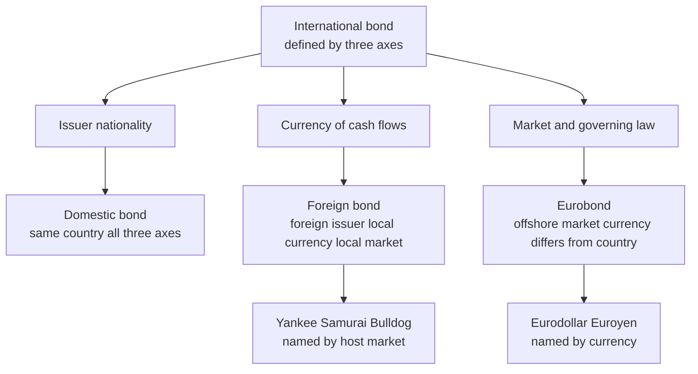
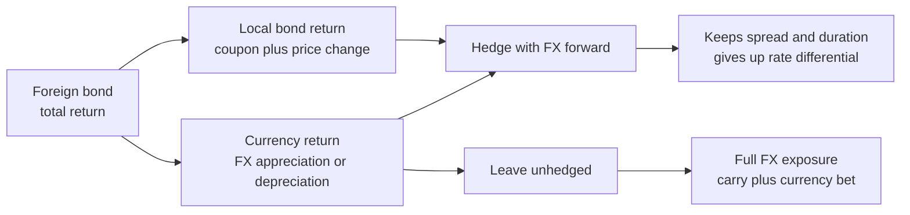
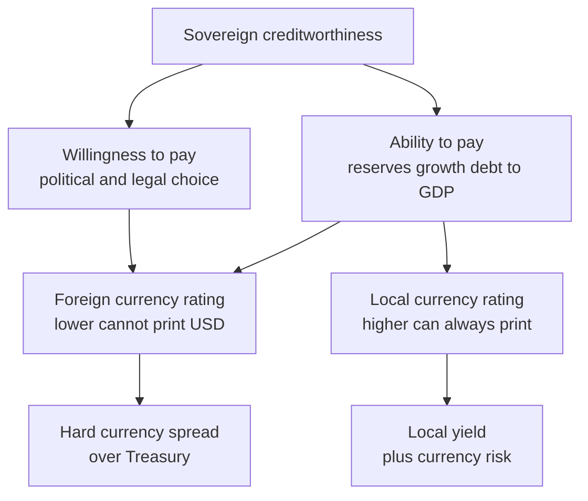

# Chapter 18 — International and Emerging-Market Bonds

## 1. The Problem / The Need

Every bond you have studied so far lived inside a single, tidy world: one issuer, one currency, one legal system, one yield curve. A US Treasury pays dollars under US law; an Indian government bond (G-Sec) pays rupees under Indian law. As long as you invest in your own country, in your own currency, the only questions are duration, credit and liquidity.

But the moment you step across a border, three new problems appear at once, and they are the reason this chapter exists.

**Problem 1 — The home market is too small or too concentrated.** An Indian pension fund that only buys G-Secs is betting its entire fixed-income book on one government, one central bank, one currency and one business cycle. A German insurer holding only Bunds earns near-zero yield. To earn more, or simply to spread risk, capital *must* travel. Roughly 60% of the world's investment-grade bonds are issued outside the United States; ignoring them means ignoring most of the asset class.

**Problem 2 — Issuers need capital that their home market cannot supply.** A Brazilian utility may need billions of dollars that the domestic real market simply does not have the depth to lend at a sensible tenor. A sovereign like Nigeria or Sri Lanka may find that global investors will lend in dollars but not in the local currency. So issuers reach *outside* their borders — and in doing so, they choose which currency and which legal jurisdiction to borrow under. Those choices create the whole taxonomy of eurobonds, foreign bonds and hard-currency sovereigns.

**Problem 3 — Returns now depend on the exchange rate, not just the coupon.** A 12% Turkish lira government bond sounds spectacular next to a 4% Treasury. But if the lira falls 25% against the dollar over the year, a dollar-based investor *loses* money despite the fat coupon. Cross-border fixed income welds together two risks that were previously separate: **interest-rate/credit risk** on the bond, and **currency risk** on the cash flows. Understanding — and pricing, and hedging — that second risk is the central skill of international bond investing.

The pay-off for solving these problems is large. Global bonds give diversification (different central banks ease and tighten at different times), higher yields (emerging markets pay a growth-and-risk premium), and access to the fastest-growing economies on earth. But the graveyard of fixed income is full of investors who bought a juicy foreign coupon and forgot they were also short a currency and long a sovereign that could default under a law they never read.

## 2. The Core Idea

An international bond is defined by answering **three orthogonal questions**, and almost every confusing piece of jargon in this field is just a label for one combination of the answers:

1. **Who is the issuer, and where do they live?** (a US company, a Brazilian sovereign, a Japanese bank)
2. **What currency are the cash flows in?** (USD, EUR, the issuer's local currency)
3. **Under whose law and in whose market is it issued and regulated?** (domestic, foreign-domestic, or the offshore "euromarket")

From these three axes fall the core categories:

- A **domestic bond** — issuer, currency and market all the same country.
- A **foreign bond** — a foreign issuer sells into a *domestic* market, in *that market's* currency, under *that market's* rules (a Japanese firm selling USD bonds registered in the US = a **Yankee bond**).
- A **eurobond** — a bond issued in a currency *different* from the country where it is sold, in the loosely-regulated offshore market, typically under English law (a Brazilian firm selling USD bonds in London to global investors = a **eurodollar bond**). "Euro" here means *offshore*, not the euro currency — a eurobond can be in yen, dollars or anything.
- **Sovereign bonds** — issued by national governments; these split into **local-currency** debt (the sovereign borrows in its own money) and **hard-currency** debt (the sovereign borrows in USD or EUR).

The second core idea is the **currency decomposition of return**. For an unhedged foreign bond, your total return in your home currency is *approximately* the local return plus the currency move:

$$R_{\text{home}} \approx R_{\text{local}} + R_{\text{FX}}$$

Exactly, the two compound:

$$1 + R_{\text{home}} = (1 + R_{\text{local}}) \times (1 + R_{\text{FX}})$$

The third core idea is that **hard-currency and local-currency emerging-market debt are two completely different asset classes** that happen to share an issuer. Hard-currency EM debt is a *credit* bet (will the sovereign default on its dollars?). Local-currency EM debt is a *rates-plus-currency* bet (where will local yields and the exchange rate go?). They behave differently, are held by different investors, and default in different ways.

## 3. Why / How It Works

**Why does the euromarket exist at all?** History and regulation. In the 1960s, US regulations (Regulation Q interest-rate caps, the Interest Equalization Tax) made it unattractive to raise or hold dollars *inside* the US. Dollars held in European banks — "eurodollars" — could be lent out free of those rules. London became the hub of an offshore, lightly-regulated, bearer-bond market where issuers could raise money faster and cheaper, with less disclosure, and investors (often anonymous) avoided withholding tax. The regulatory arbitrage faded, but the market's efficiency, English-law standardisation and global investor base made it permanent. Today the eurobond market (formally the *international bond* market) is where most large cross-border issuance happens.

**Why do sovereigns borrow in a foreign currency at all**, given that a government controls its own printing press and could always print local money to repay local debt? Because for many emerging sovereigns, *global investors will not lend meaningful size in the local currency*. Currency risk, thin markets and a history of inflation scare foreign lenders away from, say, 10-year naira bonds. Issuing in dollars removes the currency risk *for the lender* — and transfers it onto the *borrower*. This is the famous **"original sin"** of emerging-market finance: the inability to borrow abroad in one's own currency forces sovereigns into hard-currency debt, which is exactly the debt they *cannot* print their way out of. That is why hard-currency sovereigns can — and do — default, while local-currency sovereigns rarely default outright (they inflate or devalue instead).

**How does currency risk actually bite?** Consider the mechanics. You are a dollar investor. You convert USD to local currency at today's spot rate, buy the bond, collect local coupons, and at the end convert local currency back to USD at the future spot rate. If the local currency has *depreciated* (you now get fewer dollars per unit), your realised dollar return is dragged down — regardless of how the bond performed locally. The bond can rally, the coupon can be huge, and you can still lose in dollars. This is why the naive "carry" of a high local yield is only half the story: high-yielding currencies tend to be high-yielding *precisely because* the market expects them to depreciate.

**How is currency risk removed?** With an FX forward or an FX swap. **Covered interest rate parity (CIP)** says the forward exchange rate is pinned by the interest-rate differential — the forward already "prices in" the yield gap. So when you hedge, you lock in the forward rate and, in the process, you **give up the interest-rate differential**. The high foreign yield is (in theory) exactly offset by an unfavourable forward rate. Hedging converts a foreign bond back into something close to a home-currency instrument, isolating the *spread* and *duration* while neutralising the currency. This is the single most important practical insight of the chapter: **you cannot both hedge the currency and keep the yield pick-up — CIP takes the pick-up away.** What survives hedging is the *credit spread* and any *CIP basis*, not the raw yield difference.

The diagram below fixes the taxonomy before we go into the math.

*Figure 18.1 — The three defining axes of any cross-border bond and the names each combination earns.*

## 4. Full Content — Instruments, Formulas and Frameworks

### 4.1 The naming zoo (foreign bonds)

Foreign bonds carry nicknames based on the *host* market they are sold into:

| Nickname | Host market / currency | Example issuer |
|---|---|---|
| Yankee bond | USA / USD | European firm selling USD bonds registered with the SEC |
| Samurai bond | Japan / JPY | Foreign issuer selling JPY bonds in Tokyo |
| Bulldog bond | UK / GBP | Foreign issuer selling GBP bonds in London |
| Kangaroo / Matilda | Australia / AUD | Foreign issuer selling AUD bonds |
| Maple bond | Canada / CAD | Foreign issuer selling CAD bonds |
| Panda / Dim sum | China (onshore CNY) / offshore CNH | Foreign issuer selling renminbi bonds |

Contrast with **eurobonds**, named by *currency* not host market: **eurodollar**, **euroyen**, **eurosterling**. A eurobond is issued simultaneously across many countries, escapes any single national regulator, is usually in bearer form, and pays coupons gross (no withholding).

### 4.2 The two flavours of emerging-market debt

| Feature | Hard-currency EM debt | Local-currency EM debt |
|---|---|---|
| Currency | USD or EUR | Issuer's own currency |
| Primary risk for foreign investor | Sovereign **credit** / default | **Currency** + local **rates** |
| Governing law | Usually New York or English | Local law |
| Can the sovereign "print" its way out? | **No** — the killer feature | Yes (inflate/devalue instead) |
| Typical benchmark index | JPMorgan **EMBI** Global | JPMorgan **GBI-EM** |
| Default mode | Outright default / restructuring | Rare default; inflation & FX loss instead |
| Recovery in distress | Legal restructuring, haircuts | Erosion via devaluation |

### 4.3 Currency return decomposition

Let the spot exchange rate be quoted as **home currency per one unit of foreign currency** ($S$ = HC/FC). If it rises, the foreign currency has *appreciated* (good for a home investor holding foreign assets).

$$R_{\text{FX}} = \frac{S_1 - S_0}{S_0} = \frac{S_1}{S_0} - 1$$

$$\boxed{\,1 + R_{\text{home}} = (1 + R_{\text{local}})(1 + R_{\text{FX}})\,}$$

$$R_{\text{home}} = R_{\text{local}} + R_{\text{FX}} + R_{\text{local}}\times R_{\text{FX}}$$

The cross-term $R_{\text{local}} \times R_{\text{FX}}$ is small for modest moves but matters when either number is large (as in EM).

### 4.4 Covered Interest Rate Parity and the forward rate

The no-arbitrage forward exchange rate (again HC/FC) for tenor $T$:

$$\boxed{\,F_0 = S_0 \times \frac{1 + i_{HC}}{1 + i_{FC}}\,}$$

where $i_{HC}$ and $i_{FC}$ are the home and foreign interest rates for the period. If the foreign rate is *higher* ($i_{FC} > i_{HC}$), then $F_0 < S_0$: the high-yield currency trades at a **forward discount**. Hedging a foreign bond means selling foreign currency forward at $F_0$ — locking in that discount — which is exactly why the yield pick-up is cancelled.

**Hedged return (approx.):**

$$R_{\text{hedged}} \approx R_{\text{local}} - (i_{FC} - i_{HC}) = R_{\text{local}} - \text{(forward points as a rate)}$$

So a hedged foreign bond earns roughly the *local return minus the interest-rate differential*, i.e. you keep the bond's spread over the local risk-free rate, not its absolute yield.

### 4.5 Uncovered Interest Rate Parity (the theory that often fails)

UIP claims the market *expects* the high-yield currency to depreciate by exactly the rate differential, so expected hedged and unhedged returns are equal:

$$E[R_{\text{FX}}] \approx -(i_{FC} - i_{HC})$$

Empirically UIP fails at short horizons — high-yield currencies tend to *not* depreciate as much as UIP predicts, which is the source of the **FX carry trade** profit (and its periodic crashes). This gap between CIP (an arbitrage identity that holds) and UIP (an expectations theory that often does not) is a favourite interview probe.

### 4.6 Sovereign credit spread and default-recovery math

The **sovereign spread** is the extra yield of a hard-currency sovereign bond over the equivalent-maturity US Treasury (for USD debt) or Bund (for EUR debt):

$$\text{Spread} = y_{\text{sovereign}} - y_{\text{risk-free}}$$

A rough single-period breakeven linking spread, default probability $p$ and recovery rate $R$:

$$\text{Spread} \approx p \times (1 - R) = p \times \text{LGD}$$

where LGD = loss given default. This lets you back out the market-implied default probability from a spread, given an assumed recovery.

*Figure 18.2 — How total return splits into local and currency components and what hedging keeps versus surrenders.*

## 5. Worked Examples

### Example 1 — Unhedged vs hedged foreign bond return (the CIP reconciliation)

A US dollar investor buys a 1-year Brazilian local-currency (BRL) government note.

- Coupon / local yield held to the year: $R_{\text{local}} = 11.00\%$ (assume bought and held, price flat, so local return = 11%).
- US 1-year rate: $i_{HC} = 4.00\%$.
- Brazil 1-year rate: $i_{FC} = 11.00\%$.
- Spot today: $S_0 = 0.2000$ USD per BRL (i.e. 5.00 BRL per USD).

**(a) The forward rate implied by CIP:**

$$F_0 = 0.2000 \times \frac{1.04}{1.11} = 0.2000 \times 0.936937 = 0.187387 \text{ USD/BRL}$$

The BRL trades at a forward *discount* (0.18739 < 0.2000), a drop of $\frac{0.187387}{0.20}-1 = -6.31\%$ — very close to the $-(11\%-4\%)=-7\%$ rate differential (the difference is the compounding/exact-vs-approx gap).

**(b) Hedged return.** Invest $1,000. Convert to BRL: $1{,}000 / 0.2000 = 5{,}000$ BRL. It grows at 11% to $5{,}000 \times 1.11 = 5{,}550$ BRL at year-end. We sold BRL forward at $F_0 = 0.187387$. Convert back:

$$5{,}550 \times 0.187387 = 1{,}040.00 \text{ USD}$$

Return $= 4.00\%$. **This exactly equals the US rate of 4%** — confirming the core lesson: hedging away the currency leaves you with (essentially) the home risk-free rate, because CIP cancelled the 7% yield pick-up. (The BRL note here has no credit spread over the Brazil risk-free rate; if it had, say, +2% spread, the hedged return would be roughly 6%.)

**(c) Unhedged return, scenario where BRL falls 10%.** Suppose the spot at year-end is $S_1 = 0.1800$ (BRL depreciated 10%). We still have 5,550 BRL, now converted at spot:

$$5{,}550 \times 0.1800 = 999.00 \text{ USD} \;\Rightarrow\; R_{\text{home}} = -0.10\%$$

Check with the decomposition: $R_{\text{FX}} = \frac{0.18}{0.20}-1 = -10\%$.
$$1 + R_{\text{home}} = (1.11)(0.90) = 0.999 \;\Rightarrow\; R_{\text{home}} = -0.10\% \checkmark$$

The 11% coupon was more than wiped out by a 10% currency loss (plus the negative cross-term $0.11 \times -0.10 = -1.1\%$). **Reconciliation:** local 11% + FX −10% + cross-term −1.1% = −0.1%. All three methods agree.

**(d) Unhedged, scenario where BRL rises 5%.** $S_1 = 0.2100$:
$$1 + R_{\text{home}} = (1.11)(1.05) = 1.1655 \Rightarrow R_{\text{home}} = 16.55\%$$
Now the investor earns coupon *plus* currency gain — the upside of staying unhedged. The unhedged investor is long the bond *and* long the BRL.

### Example 2 — Backing out an implied default probability from a sovereign spread

A 5-year USD-denominated (hard-currency) sovereign eurobond issued by "Country X" yields 9.5%. The 5-year US Treasury yields 4.0%. Assume a recovery rate of 40% (LGD = 60%).

**Spread:** $9.5\% - 4.0\% = 5.5\%$ = 550 bps.

**Annual implied default probability (single-period approximation):**
$$\text{Spread} \approx p \times \text{LGD} \Rightarrow p \approx \frac{0.055}{0.60} = 9.17\% \text{ per year}$$

**Cumulative 5-year survival** (assuming constant hazard, independence):
$$\text{Survival} = (1 - 0.0917)^5 = (0.9083)^5 = 0.6182 \Rightarrow \text{5-yr cumulative default} \approx 38.2\%$$

Interpretation: the market is pricing roughly a 9% annual, ~38% cumulative chance that Country X defaults on its dollars over five years — consistent with a low-BB / high-B rating. Note this is a *risk-neutral* probability (embeds a risk premium), so it overstates the true real-world default odds; that gap is the sovereign risk premium the investor is paid to bear.

**Sensitivity check:** if we'd assumed a harsher 25% recovery (LGD = 75%), $p \approx 0.055/0.75 = 7.33\%$ — lower default probability for the same spread, because each default now costs more. Recovery assumptions and default probabilities trade off against each other for a given observed spread; you cannot pin one without assuming the other.

### Example 3 — Hard-currency vs local-currency default behaviour

Country Y has both a 10% local-currency 1-year bond and an 8% USD 1-year bond outstanding. A crisis hits.

- **Local-currency bond:** The government does *not* default. Instead the central bank prints money; inflation runs to 30% and the currency devalues 25% against the dollar. A *domestic* holder is repaid in full in nominal local terms (10% coupon returned) but loses ~20% of *real* purchasing power. A *dollar* holder converts back at the devalued rate: $1 + R = (1.10)(0.75) = 0.825 \Rightarrow -17.5\%$ — a large loss, but *not* a legal default; no restructuring, no missed payment.
- **USD bond:** The government *cannot print dollars*. To pay 8% in USD it needs reserves it may not have. If reserves run dry, it misses the coupon → **legal default** → restructuring, litigation under New York law, and a haircut. Suppose bondholders recover 55 cents on the dollar: the dollar holder's loss is ~45% of principal.

**Reconciliation / lesson:** Same sovereign, same crisis, two utterly different loss mechanisms. Local-currency loss came through *inflation and FX* (no default event); hard-currency loss came through *outright default and restructuring*. This is precisely why credit-rating agencies assign a *higher* rating (lower default risk) to a sovereign's **local-currency** debt than to its **foreign-currency** debt — the government can always print its own money but never someone else's.

## 6. Connections

- **To duration and yield (Chapters on bond math):** everything about price sensitivity to rates still holds *within* the local market. A foreign bond just adds an FX layer on top of the duration/convexity you already know. Hedged foreign bonds are, in effect, a duration/spread instrument in your home currency.
- **To credit analysis (corporate credit chapters):** sovereign credit uses the same spread → default-probability → recovery logic, but the *causes* differ — willingness to pay (a political choice) matters as much as ability to pay, and there is no bankruptcy court for a country.
- **To derivatives (FX forwards, CDS, currency swaps):** hedging and CIP are pure applications of forward pricing; sovereign CDS lets you isolate default risk from currency risk directly.
- **To macro / monetary policy:** local-currency EM returns are ultimately a bet on a foreign central bank's inflation-fighting credibility and on the country's balance of payments.
- **To portfolio construction (Chapter on diversification):** global bonds lower portfolio volatility because rate cycles are imperfectly correlated across countries — a US recession-driven rally in Treasuries can coincide with an EM sell-off, or the reverse.

*Figure 18.3 — Why one sovereign carries two different ratings and two different risk channels.*

## 7. Key Terms

- **Eurobond:** a bond issued in a currency different from the country where it is sold, in the offshore international market, outside any single national regulator. "Euro" = offshore, not the euro currency.
- **Foreign bond:** a bond sold by a foreign issuer into a *domestic* market, in that market's currency and under its rules (Yankee, Samurai, Bulldog, Panda).
- **Sovereign bond:** debt issued by a national government.
- **Hard-currency debt:** EM/sovereign debt denominated in USD or EUR; a pure credit bet; the sovereign cannot print the currency.
- **Local-currency debt:** debt in the issuer's own currency; a rates-plus-FX bet; rarely defaulted, often inflated/devalued away.
- **Original sin:** an emerging economy's inability to borrow abroad in its own currency, forcing it into hard-currency debt.
- **Covered interest rate parity (CIP):** arbitrage identity fixing the forward FX rate to the interest-rate differential; makes hedged carry disappear.
- **Uncovered interest rate parity (UIP):** the (often-violated) expectation that high-yield currencies depreciate by the rate differential.
- **FX carry trade:** borrowing a low-yield currency to invest in a high-yield one, profiting when UIP fails.
- **Sovereign spread:** yield of a hard-currency sovereign bond over the matched-maturity risk-free (Treasury/Bund).
- **EMBI / GBI-EM:** JPMorgan's benchmark indices for hard-currency and local-currency EM debt respectively.
- **Brady bonds:** 1990s restructured, collateralised EM sovereign bonds; historical ancestor of today's EM hard-currency market.
- **Pari passu / collective action clause (CAC):** legal clauses in sovereign bonds governing equal treatment and how a supermajority of holders can bind all to a restructuring.
- **Forward discount/premium:** a currency trading below/above spot in the forward market; high-yield currencies trade at a forward discount.

## 8. Common Confusions

1. **"Eurobond means a bond in euros."** No. A eurobond is any bond issued *offshore* in a currency foreign to the host market. A USD bond sold in London is a eurodollar bond; a yen bond sold offshore is a euroyen bond. The euro currency is irrelevant to the term.

2. **"High foreign yield = high return."** Only if the currency cooperates. CIP means that if you *hedge*, the yield pick-up vanishes and you keep only the spread. If you *don't* hedge, the high yield is compensation for expected depreciation. The 12% coupon and the currency loss are two sides of the same coin.

3. **"You can hedge the currency and still pocket the yield differential."** You cannot — that would be an arbitrage, and CIP forbids it (up to a small "cross-currency basis"). Hedging locks in the forward rate, which already bakes in the differential.

4. **"Sovereigns can't default because they print money."** True *only* for local-currency debt. Hard-currency (USD/EUR) sovereign debt cannot be printed and *is* regularly defaulted on — Argentina, Russia (1998), Sri Lanka (2022), Ghana, Zambia. This is why foreign-currency ratings sit below local-currency ratings.

5. **"Local-currency EM debt is safer because there's no default."** It rarely *defaults*, but it can inflict just-as-large losses through devaluation and inflation. A 25% currency crash hurts a dollar investor as much as a moderate default haircut — it just isn't called "default."

6. **"EM hard-currency and EM local-currency debt are basically the same trade."** They are different asset classes with different risk drivers (credit vs FX+rates), different benchmarks (EMBI vs GBI-EM), different investors, and low correlation between them. A portfolio can be long one and short the other.

7. **"Currency risk is diversified away in a global bond portfolio."** Currency exposure is *not* zero-mean over relevant horizons and adds volatility. Many global bond mandates deliberately hedge currency back to the base currency to isolate the diversification benefit of *rates* without importing FX noise.

## 9. Recap

- Any cross-border bond is defined by three axes: **issuer nationality, currency, and market/law.** Foreign bonds (Yankee/Samurai) use the host market's currency and rules; eurobonds are offshore and named by currency.
- A foreign bond's home-currency return **compounds** the local return with the currency return: $1+R_{home}=(1+R_{local})(1+R_{FX})$. The currency term can dominate.
- **CIP** pins the forward rate to the rate differential, so **hedging removes the currency risk but also removes the yield pick-up** — you keep spread and duration, not the raw yield. UIP (that FX moves offset the differential in expectation) often fails, which is why the carry trade exists.
- Emerging-market debt comes in two very different forms: **hard-currency** (a credit/default bet the sovereign can't print away — "original sin") and **local-currency** (a rates-plus-FX bet that rarely defaults but can devalue).
- Sovereign risk blends **ability** and **willingness** to pay; agencies rate **foreign-currency debt below local-currency debt** because a government can always print its own money.
- Global bonds earn their place through **diversification and yield**, but only if the investor consciously manages the currency and sovereign layers they inherit.

## 10. Quick-Reference / Interview Points

**Core formulas**

| Concept | Formula |
|---|---|
| Home-currency total return | $1+R_{home}=(1+R_{local})(1+R_{FX})$ |
| FX return (S = HC per FC) | $R_{FX}=S_1/S_0-1$ |
| CIP forward rate | $F_0=S_0\,(1+i_{HC})/(1+i_{FC})$ |
| Hedged return (approx) | $R_{hedged}\approx R_{local}-(i_{FC}-i_{HC})$ |
| Spread ↔ default | $\text{Spread}\approx p\times(1-R)=p\times\text{LGD}$ |
| Implied default prob | $p\approx \text{Spread}/\text{LGD}$ |

**One-liners for the interview**

- *"Why doesn't hedging a 12% Brazilian bond leave me with 12%?"* Because CIP makes the BRL trade at a forward discount equal to the rate gap; selling BRL forward gives back the pick-up, leaving me roughly my home rate plus any spread.
- *"What's the difference between hard- and local-currency EM debt?"* Hard-currency is a *credit* bet — the sovereign can't print USD, so it can default (original sin). Local-currency is a *rates + FX* bet — it rarely defaults but devalues/inflates. Different indices: EMBI vs GBI-EM.
- *"Why is a country's local-currency rating higher than its foreign-currency rating?"* It can always print its own money to service local debt; it cannot print dollars.
- *"What is 'original sin'?"* An EM economy's inability to borrow abroad in its own currency, forcing it into hard-currency debt it can't inflate away — the root cause of EM default crises.
- *"CIP vs UIP?"* CIP is an arbitrage identity that holds (forward = spot × rate ratio). UIP is an expectations theory (FX moves offset the differential) that empirically fails at short horizons — hence the carry trade.
- *"Is a eurobond in euros?"* No — it's an offshore bond in any currency foreign to the host market; "euro" means offshore.
- *"How do you get a market-implied default probability?"* Take the sovereign spread, divide by LGD: $p \approx$ spread / (1 − recovery). Remember it's risk-neutral, so it overstates true odds.
- *"When would you leave EM currency unhedged?"* When you have a positive view on the currency, want the full carry, and can tolerate the volatility — or when hedging costs (the rate differential) exceed the expected depreciation, i.e. you believe UIP fails in your favour.

**Numbers worth remembering:** ~60% of global IG bonds are issued outside the US; EM hard-currency sovereigns default outright while local-currency ones devalue; hedged carry ≈ 0 excess by CIP; recovery on sovereign defaults historically clusters around 30–55 cents.
