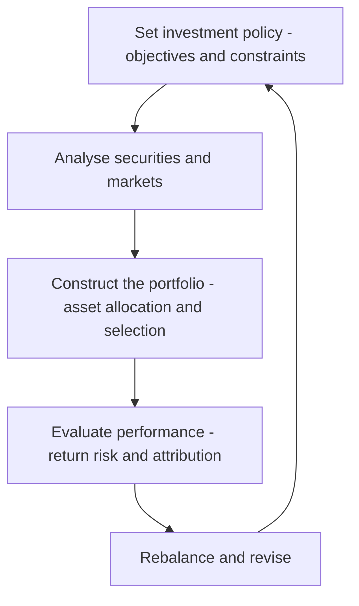
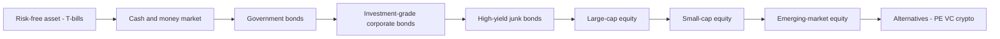

# Chapter 01 — Introduction to Investments and the Risk-Return Trade-off

## 1. The Problem / Need

Every rupee you hold today faces a quiet erosion. If inflation runs at 6% a year, ₹100 kept idle in a drawer buys only ₹94 worth of goods next year, ₹88 the year after, and so on. Money that does not work loses purchasing power. So the first problem investment solves is **preservation** — staying ahead of inflation so that future consumption is not silently taxed away.

But preservation alone is not the real prize. Most people have a mismatch between **when they earn** and **when they need to spend**. A 25-year-old software engineer earns more than she needs today, but at 60 she will earn nothing and still need income for perhaps 25 more years. A business earns cash in bursts but must fund a factory that takes a decade to pay back. The deeper problem is **inter-temporal transfer of consumption** — moving surplus purchasing power from periods of plenty to periods of need, and being *rewarded* for the wait.

That reward is not free. To get it, the saver must part with money now and accept **uncertainty** about what comes back. The whole discipline of investments exists to answer one question rigorously:

> *Given that higher expected reward can only be bought by accepting more uncertainty, how much uncertainty should I take, in what form, and what is a fair reward for it?*

This is not a philosophical question — it is a numerical, model-driven one. Interviewers at asset management companies (AMCs), equity research desks, and portfolio roles probe exactly this: *Do you understand that return is compensation for risk, and can you quantify both?* This chapter builds that foundation.

---

## 2. The Core Idea

**An investment is the current commitment of money (or other resources) for a period of time, in the expectation of receiving future payments that compensate the investor for (a) the time the funds are committed, (b) the expected rate of inflation over that time, and (c) the uncertainty of the future payments.**

That single definition (the classic Reilly–Brown formulation) already contains the risk-return trade-off. The required return has three layers:

$$
\text{Required Return} = \underbrace{\text{Real risk-free rate}}_{\text{(a) time value}} + \underbrace{\text{Inflation premium}}_{\text{(b) purchasing-power protection}} + \underbrace{\text{Risk premium}}_{\text{(c) uncertainty compensation}}
$$

The first two layers together form the **nominal risk-free rate** (roughly what a government treasury bill pays). The third layer — the **risk premium** — is where the entire craft of investing lives. Everything in portfolio theory is ultimately a debate about how big that premium *should* be and how it should be measured.

The core idea of the trade-off is stark and non-negotiable in efficient markets:

> **You cannot earn a higher expected return without accepting more risk. Anyone promising high return with low risk is either mistaken, lucky, or lying.**

---

## 3. Why / How It Works

Why must reward scale with risk? Because of **investor preferences and market clearing**.

Most investors are **risk-averse**: given two assets with the *same* expected return, they prefer the one with less uncertainty. Equivalently, to persuade a risk-averse investor to hold a *riskier* asset, you must offer a *higher* expected return. This is not an assumption pulled from thin air — it follows from **diminishing marginal utility of wealth**. The pain of losing ₹1 lakh is felt more sharply than the pleasure of gaining ₹1 lakh, because each additional rupee of wealth adds a little less happiness than the one before.

Now let markets clear. Suppose a risky stock and a safe bond offered the same expected return. Risk-averse investors would all sell the stock and buy the bond. The stock's price would fall until its *expected* future return (future payoff ÷ today's lower price) rose enough to compensate holders for its risk. Prices adjust until every asset offers a risk premium proportional to the risk that *cannot be diversified away*. That equilibrium is exactly what the Capital Asset Pricing Model formalises (Chapter on CAPM), but the intuition is here: **the risk premium is the price the market sets to persuade someone to bear risk nobody wants for free.**

A crucial refinement — and a favourite interview trap — is *which* risk gets rewarded. Only risk you **cannot escape** earns a premium. Risk that can be **diversified away** by combining many assets earns nothing, because you could have eliminated it for free. Hence:

- **Systematic (market) risk** — recessions, interest-rate shocks, wars — hits everything at once and cannot be diversified. **It is rewarded.**
- **Unsystematic (specific) risk** — a factory fire, a CEO scandal, a failed product — is idiosyncratic and cancels out across a large portfolio. **It is not rewarded.**

This distinction is the reason diversification is called "the only free lunch in finance": it removes risk *without* removing expected return.

---

## 4. Full Content — Definitions, Frameworks, Formulas

### 4.1 Investment vs Speculation vs Gambling

These three are often conflated in casual speech; being precise about them signals maturity in an interview.

| Dimension | Investment | Speculation | Gambling |
|---|---|---|---|
| **Basis of decision** | Fundamental analysis, expected cash flows, intrinsic value | Market timing, price momentum, information edge | Chance; no underlying economic value |
| **Time horizon** | Medium to long (years) | Short (days to months) | Instant / event-based |
| **Risk taken** | Calculated, commensurate with return | High, but analysed and deliberate | Artificially *created* risk, not economically necessary |
| **Expected value** | Positive (risk premium earned) | Positive if edge is real; zero otherwise | Negative (house edge / zero-sum) |
| **Return source** | Income + capital appreciation from real economic value | Price changes | Redistribution among players |
| **Example** | Buying an index fund for retirement | Buying a stock ahead of an expected earnings surprise | Betting on a coin toss / roulette |

Key nuances interviewers look for:

- **Speculation is not a dirty word.** A speculator who provides liquidity and takes on risk others avoid performs a genuine economic function. The line between "investor" and "speculator" is really a spectrum of *holding period and analytical basis*, not good vs evil.
- **Gambling creates risk where none needed to exist.** Investment and speculation deal with *pre-existing* economic risk (a business's fortunes); gambling *manufactures* risk purely for the wager. Its expected value is typically negative — the house always keeps a cut.
- **Benjamin Graham's test:** "An investment operation is one which, upon thorough analysis, promises safety of principal and an adequate return. Operations not meeting these requirements are speculative."

### 4.2 The Investment Management Process

Portfolio management is a **continuous, cyclical process**, not a one-shot decision. The standard five-step framework:

*Figure 4.2 — The investment management cycle is a feedback loop; performance evaluation feeds back into policy revision.*

1. **Setting the Investment Policy (the IPS).** Define objectives (return and risk) and constraints (liquidity, time horizon, taxes, legal/regulatory, unique circumstances). This is captured in an **Investment Policy Statement (IPS)** — the governing document.
2. **Security and market analysis.** Identify mispriced securities (fundamental / technical analysis) and form capital-market expectations (expected returns, volatilities, correlations across asset classes).
3. **Portfolio construction.** Decide the **strategic asset allocation** (the long-run mix across equities, bonds, cash, alternatives) and then **security selection** within each class. Empirically, asset allocation explains the large majority of the *variability* of portfolio returns over time.
4. **Performance evaluation.** Measure realised return and risk; compare against a benchmark; decompose results via **attribution** (how much came from allocation vs selection vs timing).
5. **Rebalancing / revision.** As prices move and circumstances change, drift the portfolio back to target weights and update the IPS.

### 4.3 Measuring Return

**Holding Period Return (HPR)** — total return over one period:

$$
HPR = \frac{(P_1 - P_0) + D_1}{P_0} = \underbrace{\frac{P_1 - P_0}{P_0}}_{\text{capital gain yield}} + \underbrace{\frac{D_1}{P_0}}_{\text{income yield}}
$$

where $P_0$ = price at start, $P_1$ = price at end, $D_1$ = income (dividend/coupon) received.

**Expected return** of a single asset over discrete scenarios:

$$
E(R) = \sum_{i=1}^{n} p_i R_i
$$

where $p_i$ is the probability of state $i$ and $R_i$ the return in that state.

**Arithmetic vs Geometric mean** (multi-period). For realised returns $R_1, \dots, R_T$:

$$
\bar{R}_{arith} = \frac{1}{T}\sum_{t=1}^{T} R_t, \qquad
\bar{R}_{geom} = \left[\prod_{t=1}^{T}(1+R_t)\right]^{1/T} - 1
$$

The **geometric mean** is the true *compound* growth rate (what your money actually did). The **arithmetic mean** is the best *estimate of next period's* return. Geometric ≤ arithmetic always, with the gap widening as volatility rises (approximately $\bar{R}_{geom} \approx \bar{R}_{arith} - \tfrac{1}{2}\sigma^2$).

### 4.4 Measuring Risk

Risk is the **dispersion of possible outcomes around the expected value**. The standard statistical measures:

**Variance** and **standard deviation** (using probabilities):

$$
\sigma^2 = \sum_{i=1}^{n} p_i \left[R_i - E(R)\right]^2, \qquad \sigma = \sqrt{\sigma^2}
$$

Standard deviation $\sigma$ (volatility) is in the same units as return (%), which is why it is the workhorse risk measure.

**Coefficient of Variation (CV)** — risk *per unit* of return, for comparing assets of different scale:

$$
CV = \frac{\sigma}{E(R)}
$$

Lower CV = better risk-adjusted profile.

Other risk lenses used in practice (deeper chapters expand these):

- **Beta ($\beta$)** — sensitivity to market movements; measures *systematic* risk only.
- **Downside / semi-deviation** — dispersion of only the *bad* outcomes (many argue volatility unfairly penalises upside surprises).
- **Value at Risk (VaR)** — the loss threshold not exceeded with a given confidence over a horizon (e.g. "5% chance of losing more than ₹10 lakh in a day").
- **Maximum drawdown** — the largest peak-to-trough fall; captures the pain of the worst stretch.

### 4.5 The Risk-Return Trade-off, Formalised

Plotting expected return against risk gives the foundational picture of finance:

*Figure 4.5 — The risk-return spectrum: moving right, both expected return and volatility rise together. The ordering is the whole point.*

The trade-off is captured cleanly by the **Sharpe ratio**, the single most-asked risk-adjusted performance number:

$$
\text{Sharpe Ratio} = \frac{E(R_p) - R_f}{\sigma_p}
$$

It measures **excess return earned per unit of total risk taken**. A portfolio earning 12% with 15% volatility when T-bills pay 5% has a Sharpe of $(12-5)/15 = 0.47$. Higher is better; it is how you compare a "high return, high risk" fund against a "modest return, low risk" one on a level field.

### 4.6 Types of Investors — Objectives and Constraints

Every IPS is built on two objectives and (classically) five or six constraints. The standard mnemonic frames objectives as **R-R** (Return, Risk) and constraints as **L-L-T-T-U**: **L**iquidity, **L**egal/regulatory, **T**ime horizon, **T**axes, **U**nique circumstances.

**Objectives**

| Objective | Question it answers |
|---|---|
| **Return requirement** | What return does the investor *need* to meet goals? (income vs growth vs total return) |
| **Risk tolerance** | *Ability* (financial capacity to absorb losses) + *Willingness* (psychological comfort). Use the **lower** of the two. |

**Constraints**

| Constraint | Meaning | Example |
|---|---|---|
| **Liquidity** | Need for ready cash without loss of value | Pension paying monthly benefits needs liquidity |
| **Time horizon** | How long until funds are needed | A 30-year-old's retirement corpus has a 30-yr horizon |
| **Taxes** | Tax treatment of income and gains | Taxable individual vs tax-exempt endowment |
| **Legal / regulatory** | Rules governing the investor | Insurers face solvency limits on equity holdings |
| **Unique circumstances** | Anything else (ethics, concentration, ESG) | Investor barring tobacco/alcohol stocks |

**How investor types differ**

| Investor type | Return objective | Risk tolerance | Time horizon | Liquidity | Tax status |
|---|---|---|---|---|---|
| **Young individual** | Growth (capital appreciation) | High (long horizon, human capital) | Long | Low | Taxable |
| **Retiree** | Income + capital preservation | Low | Short–medium | High | Taxable |
| **Pension fund (defined benefit)** | Match liabilities; total return | Moderate | Very long | Depends on maturity of workforce | Tax-exempt |
| **Endowment / foundation** | Preserve real value + spending rate | Moderate–high | Perpetual | Low–moderate | Tax-exempt |
| **Life insurer** | Spread over guaranteed rate; ALM | Low | Long | Moderate (claims) | Taxed |
| **Bank** | Positive net interest margin | Low | Short | High (deposits callable) | Taxed |
| **Mutual fund** | Beat/track stated benchmark | Per mandate | Per mandate | High (daily redemptions) | Pass-through |

Two ideas worth stating explicitly because interviewers test them:

- **Human capital shapes financial risk-taking.** A young person's future salary is a large, bond-like asset. With so much "safe" human capital, she can afford more equity risk in her financial portfolio. As human capital depletes with age, the financial portfolio should tilt toward bonds — the intuition behind lifecycle/target-date funds.
- **Ability vs willingness conflict.** If a wealthy investor (high ability) is terrified of losses (low willingness), the adviser generally respects the *lower* one but educates the client. Never assume high wealth equals high risk tolerance.

### 4.7 The Risk-Return Spectrum of Asset Classes

Long-run history (developed-market data, illustrative nominal figures) roughly orders the major classes:

| Asset class | Typical role | Long-run real return | Volatility (σ) | Primary risks |
|---|---|---|---|---|
| **Cash / T-bills** | Liquidity, safety | ~0–1% | ~1% | Inflation (purchasing-power) risk |
| **Government bonds** | Capital preservation, income | ~1–2% | ~4–7% | Interest-rate, inflation |
| **Investment-grade corporate bonds** | Income | ~2–3% | ~6–9% | Credit + interest-rate |
| **High-yield bonds** | Income + some growth | ~3–5% | ~10–12% | Default/credit, illiquidity |
| **Large-cap equity** | Growth | ~5–7% | ~15–20% | Market, business cycle |
| **Small-cap equity** | Growth | ~6–8% | ~20–25% | Market + liquidity + size |
| **Emerging-market equity** | Growth | ~6–9% | ~22–30% | Political, currency, market |
| **Real estate** | Income + inflation hedge | ~3–5% | ~10–15% | Illiquidity, leverage, local |
| **Alternatives (PE/VC/hedge/crypto)** | Diversification, high return | wide range | very high | Illiquidity, model, extreme |

The ordering matters more than the exact numbers (which vary by period and source). The takeaways:

- **Cash is not "riskless" in real terms** — it reliably loses to inflation. Its risk is subtle but real.
- Bonds trade one risk for another: safer on *default* than equity, but exposed to *interest-rate* moves.
- The **equity risk premium** — the long-run excess of stocks over bills, historically ~4–6% — is the single most important number in investing, and the compensation for enduring equity's gut-wrenching volatility.

---

## 5. Worked Examples

### Example 1 — Decomposing return, and expected return under uncertainty

*Part A — Holding Period Return.* You buy a share of Infosys-like Co. at ₹1,400. A year later it trades at ₹1,540 and paid a ₹35 dividend.

$$
HPR = \frac{(1540 - 1400) + 35}{1400} = \frac{140 + 35}{1400} = \frac{175}{1400} = 0.125 = 12.5\%
$$

Split: capital gain yield $= 140/1400 = 10.0\%$; income yield $= 35/1400 = 2.5\%$. Check: $10.0\% + 2.5\% = 12.5\%$. ✓

*Part B — Expected return and risk under scenarios.* Next year's return depends on the economy:

| State | Probability $p_i$ | Return $R_i$ |
|---|---|---|
| Boom | 0.25 | +30% |
| Normal | 0.50 | +12% |
| Recession | 0.25 | −10% |

Expected return:

$$
E(R) = 0.25(30) + 0.50(12) + 0.25(-10) = 7.5 + 6.0 - 2.5 = 11.0\%
$$

Variance:

$$
\sigma^2 = 0.25(30-11)^2 + 0.50(12-11)^2 + 0.25(-10-11)^2
$$
$$
= 0.25(361) + 0.50(1) + 0.25(441) = 90.25 + 0.50 + 110.25 = 201.0
$$

Standard deviation: $\sigma = \sqrt{201.0} = 14.18\%$.

Coefficient of variation: $CV = 14.18 / 11.0 = 1.29$. So this asset carries 1.29 units of risk (%) per unit of expected return (%).

### Example 2 — Comparing two assets with the Sharpe ratio

The risk-free rate is 5%. You must choose between:

| Fund | $E(R)$ | $\sigma$ |
|---|---|---|
| **A — balanced fund** | 10% | 8% |
| **B — aggressive equity fund** | 16% | 20% |

At first glance B "returns more." But adjust for risk:

$$
\text{Sharpe}_A = \frac{10 - 5}{8} = \frac{5}{8} = 0.625
$$
$$
\text{Sharpe}_B = \frac{16 - 5}{20} = \frac{11}{20} = 0.55
$$

**Fund A is superior on a risk-adjusted basis** (0.625 > 0.55): it delivers more excess return per unit of risk. This is the exact reasoning an AMC analyst uses — raw returns flatter risky funds; the Sharpe ratio levels the field. (Which fund a *client* should hold still depends on their risk tolerance, but A is the more *efficient* engine.)

*Reconciliation check:* if you could borrow/lend at 5% and lever Fund A up to B's 20% volatility (a factor of $20/8 = 2.5$), A's excess return scales to $2.5 \times 5\% = 12.5\%$, giving a total return of $5\% + 12.5\% = 17.5\%$ — *more* than B's 16% at the same risk. That confirms A dominates. ✓

### Example 3 — Arithmetic vs geometric mean (why the distinction bites)

A fund returns **+50% in year 1** and **−40% in year 2**.

Arithmetic mean: $(50 + (-40))/2 = +5\%$ — sounds like a gain.

Geometric (actual) mean:

$$
\bar{R}_{geom} = \sqrt{(1+0.50)(1-0.40)} - 1 = \sqrt{1.50 \times 0.60} - 1 = \sqrt{0.90} - 1 = 0.9487 - 1 = -5.13\%
$$

*Reconciliation:* ₹100 grows to ₹150, then falls 40% to ₹90 — a **loss** of ₹10 over two years, i.e. $\sqrt{0.90}-1 = -5.13\%$ per year compounded. ✓ The arithmetic mean (+5%) overstated reality; the geometric mean (−5.13%) tells the truth about wealth. The gap ($\approx 10$ points) is large precisely because volatility (a 90-point swing) is large — consistent with $\bar{R}_{geom} \approx \bar{R}_{arith} - \tfrac{1}{2}\sigma^2$.

---

## 6. Connections

- **Portfolio theory (Markowitz):** This chapter's single-asset risk (σ) becomes *portfolio* risk once we add **covariance** — the insight that combining imperfectly-correlated assets lowers risk without lowering expected return. The risk-return trade-off graduates into the **efficient frontier**.
- **CAPM and the SML:** The idea that only *systematic* risk is rewarded becomes the formal equation $E(R_i) = R_f + \beta_i[E(R_m) - R_f]$. Beta replaces σ as the priced risk measure.
- **Fixed income:** Bond pricing is the pure study of the "time value + inflation" layers of required return, plus credit risk in the premium.
- **Behavioural finance:** Risk aversion and the ability/willingness split connect to loss aversion and prospect theory — why real investors deviate from the rational model.
- **Corporate finance:** A firm's cost of equity *is* an investor's required return. The risk premium you demand as an investor is the hurdle rate the CFO must beat.

---

## 7. Key Terms

- **Investment** — current commitment of resources for expected future compensation for time, inflation, and uncertainty.
- **Risk premium** — expected return in excess of the risk-free rate, compensating for uncertainty.
- **Risk aversion** — preference for certainty; demanding higher expected return for higher risk.
- **Systematic (market) risk** — undiversifiable, economy-wide risk; the only risk rewarded with a premium.
- **Unsystematic (specific) risk** — asset-specific, diversifiable risk; earns no premium.
- **Holding Period Return (HPR)** — total return (income + capital gain) over one period.
- **Standard deviation (σ)** — volatility; dispersion of returns around the mean.
- **Sharpe ratio** — excess return per unit of total risk.
- **Coefficient of variation (CV)** — risk per unit of return.
- **Investment Policy Statement (IPS)** — governing document listing objectives and constraints.
- **Risk tolerance** — ability (capacity) plus willingness (psychology) to bear risk.
- **Equity risk premium** — long-run excess return of stocks over risk-free assets.
- **Human capital** — present value of future earnings; a bond-like asset shaping financial risk capacity.

---

## 8. Common Confusions

1. **"Risk means losing money."** No — in finance risk is *dispersion / uncertainty of outcomes*, measured by σ. An asset can be volatile yet have positive expected return. Upside surprises count as "risk" too under the σ definition (a valid critique that motivates downside measures).
2. **"Higher risk guarantees higher return."** Risk buys higher *expected* return, not *realised* return. If risk always paid off, it wouldn't be risk. Realised outcomes can and do disappoint.
3. **"Cash is risk-free."** Only in *nominal* terms. In *real* terms, cash reliably loses to inflation. Every asset trades one risk for another.
4. **"Diversification always reduces return."** It reduces *unsystematic* risk without touching expected return — the free lunch. It does not eliminate systematic risk.
5. **"Arithmetic average = what I earned."** Your compounded wealth follows the *geometric* mean, always ≤ arithmetic. Confusing them overstates performance (Example 3).
6. **"High net worth = high risk tolerance."** Ability ≠ willingness. Use the *lower* of the two.
7. **"Speculation is just gambling."** Speculation analyses *pre-existing* economic risk and can have positive expected value; gambling *manufactures* risk with negative expected value.
8. **"Beta and standard deviation are the same risk."** σ is *total* risk; β is only the *systematic* portion. A stock can have high σ but low β (lots of diversifiable noise).

---

## 9. First-Principles Recap

Strip everything back and the logic chain is:

1. Money now is worth more than money later (time value) and inflation erodes idle cash — so we invest.
2. Future payoffs are uncertain, and people dislike uncertainty (risk aversion from diminishing marginal utility).
3. Therefore, to hold risky assets, investors *demand* extra expected return — a **risk premium**.
4. Markets clear by adjusting prices until each asset's premium matches the *undiversifiable* risk it carries. Diversifiable risk earns nothing because it can be removed for free.
5. Hence **expected return rises with (systematic) risk** — the trade-off — and this ordering is visible across the asset-class spectrum from T-bills to venture capital.
6. We quantify return with HPR/expected value, risk with σ, and the trade-off with the Sharpe ratio.
7. *How much* risk any given investor should take is not universal — it flows from their **objectives** (return need, risk tolerance) and **constraints** (liquidity, horizon, taxes, legal, unique), written into an **IPS**.

Everything later in the guide — portfolios, CAPM, factor models, valuation, fixed income, derivatives — is an elaboration of steps 3 to 6.

---

## 10. Quick-Reference / Interview Points

**Formulas to have cold:**

| Concept | Formula |
|---|---|
| Required return | $R_f + \text{inflation premium} + \text{risk premium}$ (with $R_f$ real; or nominal $R_f$ + risk premium) |
| Holding period return | $HPR = \dfrac{(P_1 - P_0) + D_1}{P_0}$ |
| Expected return (scenarios) | $E(R) = \sum p_i R_i$ |
| Variance | $\sigma^2 = \sum p_i [R_i - E(R)]^2$ |
| Geometric mean | $\left[\prod (1+R_t)\right]^{1/T} - 1$ |
| Coefficient of variation | $CV = \sigma / E(R)$ |
| Sharpe ratio | $[E(R_p) - R_f]/\sigma_p$ |
| Geo vs arith approx | $\bar{R}_{geom} \approx \bar{R}_{arith} - \tfrac{1}{2}\sigma^2$ |

**What interviewers actually ask:**

- *"What's the difference between investing and speculating?"* → Analytical basis, horizon, and expected value; cite Graham's definition.
- *"Why is there a risk-return trade-off at all?"* → Risk aversion + market clearing; only undiversifiable risk is priced.
- *"A fund returned 20% last year. Is it good?"* → "Compared to what risk and what benchmark? Give me its volatility and I'll give you the Sharpe ratio." (Never judge return without risk.)
- *"Two funds: 10% at 8% vol, or 16% at 20% vol — which is better?"* → Compute Sharpe (0.625 vs 0.55); the lower-return fund is more efficient. (Example 2.)
- *"Is cash risk-free?"* → Nominally yes, really no — inflation risk.
- *"Walk me through building a portfolio for a 60-year-old retiree vs a 28-year-old."* → Objectives + constraints (LLTTU); horizon and human capital drive the equity/bond split.
- *"Why doesn't diversification eliminate all risk?"* → It kills unsystematic risk; systematic (market) risk remains and is what earns the premium.
- *"Arithmetic or geometric mean for reporting past performance?"* → Geometric (compounded wealth); arithmetic for forecasting next period.

**One-liners to sound sharp:**
- "Return is the compensation; risk is the price you pay for it."
- "Diversification is the only free lunch in finance."
- "The market only pays you for risk you *can't* avoid."
- "Judge no return without its risk, and no risk without its horizon."
