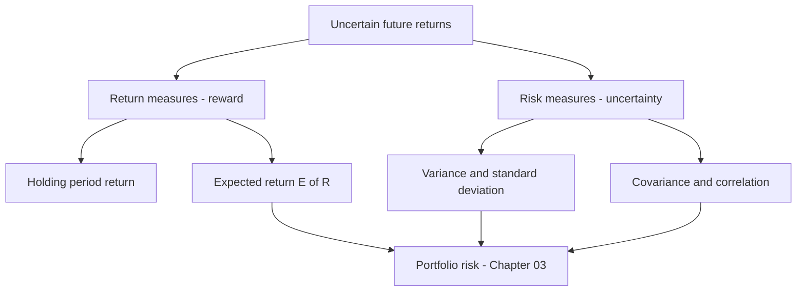
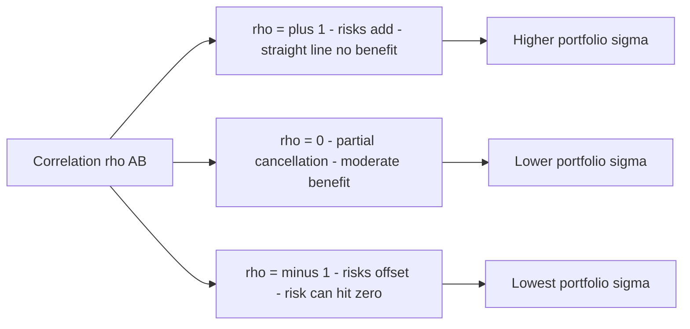

# Chapter 02 — Measuring Risk and Return

## 1. The Problem / Need

Every investment decision is a trade between two things: what you expect to *earn* and what you might *lose along the way*. But "expect to earn" and "might lose" are vague, emotional words. A portfolio manager cannot allocate capital, an analyst cannot compare two stocks, and a risk officer cannot set limits on the basis of vague feelings. They need **numbers** — a single, defensible figure for return and a single, defensible figure for risk, computed the same way every time so that a bank deposit, an Infosys share, a government bond and a gold ETF can all be laid side by side on the same ruler.

This is harder than it sounds, and the difficulties are exactly where interviewers probe:

- **Return is not one number.** If a stock goes from ₹100 to ₹150 over two years, is the "return" 50%, or 25% a year, or 22.5% a year? All three are defensible; each answers a different question. Get the wrong one into a compounding calculation and you overstate performance — a classic way funds flatter themselves.
- **Return is random, not fixed.** Next year's Nifty return is unknown today. So "expected return" is a probability-weighted guess, not a promise. We must model the *distribution* of possible returns, not a point.
- **Risk needs a definition.** Intuitively, risk is "bad things happening." Mathematically, we usually proxy it by **dispersion** — how widely returns scatter around their average. That choice (variance/standard deviation) is powerful and tractable, but it treats upside surprises as "risky" too, and it quietly assumes the world is roughly bell-shaped. Both assumptions bite in real markets.
- **Assets move together.** The risk of a *portfolio* is not the average of the risks of its parts, because holdings partly cancel and partly reinforce each other. To capture that we need **covariance** and **correlation** — the single most important idea that makes diversification work (Chapter 03 builds the whole theory on it).

This chapter builds the measurement toolkit — return measures, expected return, variance, standard deviation, covariance, correlation, and the normal-distribution scaffolding — with the actual arithmetic worked end to end. Everything later (CAPM, the efficient frontier, Sharpe ratios, VaR) is assembled from these bricks.

## 2. The Core Idea

> **Return** is *reward*, summarised by an average. **Risk** is *uncertainty about that reward*, summarised by the spread of outcomes around the average. And because assets are held in combinations, we also measure **how assets' returns move together**, because co-movement — not individual jumpiness — determines portfolio risk.

Three quantities do most of the work:

| Quantity | Symbol | Plain meaning | Units |
|---|---|---|---|
| Expected return | E(R) or μ | The centre of the distribution — reward you anticipate | % (return) |
| Variance / standard deviation | σ² / σ | The width of the distribution — how far outcomes stray | %² / % |
| Covariance / correlation | σᵢⱼ / ρᵢⱼ | The tendency of two assets to move together | %² / unitless (−1 to +1) |

The mental model: picture a histogram of an asset's possible annual returns. Its **peak/centre** is E(R). Its **width** is σ. Line up two such histograms and ask whether their good and bad years coincide — that co-movement is ρ. Master these three and you can quantify almost any single-asset or portfolio risk-return question an interviewer throws at you.

## 3. Why / How It Works

**Why an average for return?** Because a probability distribution is fully "located" by its mean. If you had to bet on one number, the expected value is the one that is unbiased in the long run — over many repetitions the realised average converges to E(R) (law of large numbers). It is the natural reward figure.

**Why dispersion for risk?** Two investments can share the same expected return yet feel utterly different: a T-bill returning "5% for sure" versus a stock that averages 5% but swings between −30% and +40%. What separates them is *how tightly outcomes cluster around 5%*. Standard deviation measures exactly that clustering. Squaring the deviations (to get variance) does two jobs: it stops positive and negative deviations from cancelling, and it makes the maths additive and differentiable — essential when we later minimise portfolio variance with calculus.

**Why co-movement, not just individual risk?** Here is the crux of all of modern portfolio theory. Suppose two assets each have σ = 20%. Hold them 50/50. If they move in lockstep (ρ = +1), portfolio σ stays 20% — no benefit. If they are unrelated (ρ = 0), portfolio σ drops to about 14%. If they move perfectly opposite (ρ = −1), portfolio σ can fall to **zero**. Same two assets, same individual risks — but the *interaction* changes portfolio risk dramatically. That is why a good analyst obsesses over correlations, not just volatilities: risk that cancels in a portfolio is not risk you should demand to be paid for.

**Why the normal distribution?** Because it is fully described by just two numbers — μ and σ — which is precisely the pair we already compute. If returns were exactly normal, mean and standard deviation would tell you *everything*: the probability of any outcome, the size of a "1-in-20" loss, all of it. That is the elegant bargain of mean-variance analysis. Real returns are only *approximately* normal, and the places they deviate (fat tails, skew) are where models fail and money is lost — a theme we return to in Section 8.

*Figure 1 — The measurement toolkit: reward on the left, uncertainty on the right, both feeding portfolio construction.*

## 4. Full Content — Formulas and Models

### 4.1 Return measures

**Holding-Period Return (HPR).** The total return over one holding period, capturing both income and price change:

$$ HPR = \frac{(P_1 - P_0) + D_1}{P_0} = \underbrace{\frac{D_1}{P_0}}_{\text{income yield}} + \underbrace{\frac{P_1 - P_0}{P_0}}_{\text{capital gain}} $$

where P₀ = purchase price, P₁ = ending price, D₁ = cash income (dividend/coupon) received. HPR is period-agnostic — the "period" can be a day, month or five years — which is exactly why you must annualise before comparing across horizons.

**Arithmetic mean return (AM).** The simple average of period returns:

$$ \bar{R}_{AM} = \frac{1}{n}\sum_{t=1}^{n} R_t $$

It answers: "In a *typical single* period, what return should I expect?" It is the right input for forecasting the *next* period's expected return.

**Geometric mean return (GM).** The compounded average that actually grew the money:

$$ \bar{R}_{GM} = \left[\prod_{t=1}^{n}(1+R_t)\right]^{1/n} - 1 $$

It answers: "What constant per-period return would have turned my starting capital into my ending capital?" It is the right measure for *realised, historical* performance over multiple periods.

**Key relationship:** GM ≤ AM always, with equality only if every period's return is identical. The gap widens with volatility, approximated by:

$$ \bar{R}_{GM} \approx \bar{R}_{AM} - \frac{\sigma^2}{2} $$

This "volatility drag" (variance drain) is why a fund can have a cheerful arithmetic average yet a mediocre compounded track record. **Interview trap:** quoting AM as if it were the compounded return overstates growth.

**Annualising.** Convert a per-period return to an annual-equivalent by compounding over the number of periods per year (m):

$$ R_{annual} = (1 + R_{period})^{m} - 1 $$

For example a monthly return annualises with m = 12; a quarterly return with m = 4. (Volatility annualises differently — see 4.3.)

**Real vs nominal return (Fisher relation).** Nominal returns ignore inflation; real returns strip it out to show change in *purchasing power*:

$$ 1 + R_{real} = \frac{1 + R_{nominal}}{1 + i} \quad\Rightarrow\quad R_{real} = \frac{1 + R_{nominal}}{1 + i} - 1 $$

where i = inflation rate. The common shortcut R_real ≈ R_nominal − i is only a first-order approximation; use the exact ratio when rates are high (India's inflation has often run 5–7%, so the approximation error is material).

### 4.2 Expected return (forward-looking)

When the future is described by scenarios with probabilities pₛ and returns Rₛ:

$$ E(R) = \sum_{s=1}^{S} p_s \, R_s $$

This is the probability-weighted mean — the distribution's centre of mass. It is a *forecast*, distinct from a historical average (which is one realised sample from the true distribution).

### 4.3 Risk — variance and standard deviation

**From scenarios (expected/ex-ante):**

$$ \sigma^2 = \sum_{s=1}^{S} p_s \,[\,R_s - E(R)\,]^2, \qquad \sigma = \sqrt{\sigma^2} $$

**From historical data (sample, ex-post):**

$$ s^2 = \frac{1}{n-1}\sum_{t=1}^{n}(R_t - \bar{R})^2, \qquad s = \sqrt{s^2} $$

Note the **(n − 1)** divisor — *Bessel's correction*. We divide by n − 1, not n, because using the sample mean (itself estimated from the data) "uses up" one degree of freedom; dividing by n would systematically underestimate the true variance. (For a full population, or scenario probabilities, use n.)

Standard deviation σ is preferred for reporting because it is in the same units as return (%), whereas variance is in %² and hard to interpret directly.

**Annualising volatility (the square-root-of-time rule):**

$$ \sigma_{annual} = \sigma_{period} \times \sqrt{m} $$

So a monthly σ scales by √12 ≈ 3.46, not by 12. This holds when returns are serially uncorrelated (independent across periods): variances add over time, so standard deviation grows with the *square root* of time. **Interview favourite:** "Daily vol is 1%, roughly annual vol?" → 1% × √252 ≈ 15.9% (252 trading days).

### 4.4 Co-movement — covariance and correlation

**Covariance** measures whether two assets' deviations from their means share the same sign:

Ex-ante (scenarios): 
$$ \sigma_{AB} = \text{Cov}(R_A, R_B) = \sum_{s} p_s\,[R_{A,s} - E(R_A)]\,[R_{B,s} - E(R_B)] $$

Ex-post (historical sample):
$$ s_{AB} = \frac{1}{n-1}\sum_{t=1}^{n}(R_{A,t} - \bar{R}_A)(R_{B,t} - \bar{R}_B) $$

Positive covariance → they tend to be above/below their means together; negative → they offset. The problem: covariance units are %² and its magnitude depends on the assets' own volatilities, so you cannot judge "how strong" the relationship is from covariance alone.

**Correlation** standardises covariance onto a clean −1 to +1 scale:

$$ \rho_{AB} = \frac{\sigma_{AB}}{\sigma_A \, \sigma_B} \quad\in[-1, +1] $$

- ρ = +1: perfect positive linear co-movement (no diversification benefit).
- ρ = 0: no *linear* relationship.
- ρ = −1: perfect negative co-movement (risk can be fully hedged away).

Rearranged, **σ_AB = ρ_AB · σ_A · σ_B**, the form you plug into the portfolio-variance formula.

### 4.5 Two-asset portfolio return and risk (the payoff)

Portfolio expected return is just the weighted average (weights wᵢ sum to 1):

$$ E(R_p) = w_A E(R_A) + w_B E(R_B) $$

But portfolio **variance is not** a weighted average — the covariance term is what matters:

$$ \sigma_p^2 = w_A^2\sigma_A^2 + w_B^2\sigma_B^2 + 2\,w_A w_B\,\sigma_{AB} $$
$$ = w_A^2\sigma_A^2 + w_B^2\sigma_B^2 + 2\,w_A w_B\,\rho_{AB}\,\sigma_A\sigma_B $$

The cross term carries ρ. When ρ < 1, portfolio σ is *less* than the weighted average of the individual σ's — that shortfall **is** the diversification benefit. This single equation is the seed of the entire efficient-frontier theory in Chapter 03.

*Figure 2 — Why correlation drives diversification: the lower the correlation, the more portfolio risk falls below the weighted-average risk.*

## 5. Worked Examples

### Example 1 — HPR, arithmetic vs geometric, volatility drag, real return

You buy a stock at **₹100**. Annual data over three years:

| Year | Start price | End price | Dividend | HPR |
|---|---|---|---|---|
| 1 | 100 | 120 | 2 | (120−100+2)/100 = **+22%** |
| 2 | 120 | 108 | 3 | (108−120+3)/120 = **−7.5%** |
| 3 | 108 | 135 | 3 | (135−108+3)/108 = **+27.78%** |

**Arithmetic mean:** (22 − 7.5 + 27.78)/3 = 42.28/3 = **14.09%**.

**Geometric mean:** 
[(1.22)(0.925)(1.2778)]^(1/3) − 1
= [1.22 × 0.925 × 1.2778]^(1/3) − 1
= [1.44215]^(1/3) − 1.
Cube root of 1.44215: 1.44215^(1/3) = 1.1299, so GM = **12.99%** ≈ 13.0%.

**Reconciliation check.** Verify GM actually reproduces the compounded growth. Ignoring the timing of dividends for a clean check, the product of growth factors is 1.44215, i.e. total three-year growth of +44.2%. A constant 12.99% for three years gives 1.1299³ = 1.4422 ✓ — matches. GM (13.0%) < AM (14.1%), exactly as theory requires.

**Volatility-drag approximation.** Sample σ of the three HPRs: deviations from AM (14.09%) are +7.91, −21.59, +13.69. Squared: 62.6, 466.1, 187.4; sum = 716.1; ÷ (n−1 = 2) = 358.0; σ = √358.0 = **18.9%**. Then AM − σ²/2 = 14.09% − 0.0358/2... careful with units: σ² = 0.0358 (in decimal²), σ²/2 = 0.0179 = 1.79%. So AM − σ²/2 ≈ 14.09 − 1.79 = **12.3%**, in the neighbourhood of the exact GM 13.0% (the approximation is rough for large swings, but confirms the direction and rough size of the drag). ✓

**Real return.** If cumulative inflation ran 6% per year, the real geometric return = (1.1299/1.06) − 1 = 1.0659 − 1 = **6.6%**. The nominal 13.0% shrinks to 6.6% of genuine purchasing-power growth — inflation ate roughly half. The crude shortcut (13.0 − 6.0 = 7.0%) overstates it by 0.4 ppt.

**Annualising a sub-period return.** Suppose instead you only had a 6-month HPR of 8%. Annualised = (1.08)² − 1 = **16.64%** (not 16%), because the second half-year compounds on the first.

### Example 2 — Expected return, variance, standard deviation from scenarios

Analyst's one-year scenarios for **Stock X**:

| State | Probability pₛ | Return Rₛ |
|---|---|---|
| Boom | 0.30 | +30% |
| Normal | 0.50 | +10% |
| Recession | 0.20 | −20% |

**Expected return:** E(R) = 0.30(30) + 0.50(10) + 0.20(−20) = 9 + 5 − 4 = **10%**.

**Variance** (probability-weighted squared deviations from 10%):

| State | Rₛ − E(R) | (Rₛ − E(R))² | pₛ × (…)² |
|---|---|---|---|
| Boom | +20 | 400 | 0.30 × 400 = 120 |
| Normal | 0 | 0 | 0.50 × 0 = 0 |
| Recession | −30 | 900 | 0.20 × 900 = 180 |
| | | **Σ = σ²** | **300 (%²)** |

σ² = **300 %²**, so **σ = √300 = 17.32%**.

**Interpretation.** Stock X offers a 10% expected return with a 17.3% standard deviation. If returns were normal, roughly two-thirds of outcomes would fall within 10% ± 17.3%, i.e. between −7.3% and +27.3% — a wide band that quantifies the risk in one number.

### Example 3 — Covariance, correlation, and the diversification payoff

Same scenarios, now with **Stock Y** alongside X:

| State | pₛ | R_X | R_Y |
|---|---|---|---|
| Boom | 0.30 | +30% | −5% |
| Normal | 0.50 | +10% | +12% |
| Recession | 0.20 | −20% | +25% |

**E(R_Y):** 0.30(−5) + 0.50(12) + 0.20(25) = −1.5 + 6 + 5 = **9.5%**.

**σ_Y:** deviations from 9.5 → Boom −14.5, Normal +2.5, Recession +15.5.
Weighted squares: 0.30(210.25) + 0.50(6.25) + 0.20(240.25) = 63.075 + 3.125 + 48.05 = 114.25 %².
σ_Y = √114.25 = **10.69%**. (From Example 2, E(R_X)=10%, σ_X = 17.32%.)

**Covariance** = Σ pₛ · (R_X − 10)(R_Y − 9.5):

| State | (R_X−10) | (R_Y−9.5) | product | × pₛ |
|---|---|---|---|---|
| Boom | +20 | −14.5 | −290 | 0.30 × −290 = −87.0 |
| Normal | 0 | +2.5 | 0 | 0 |
| Recession | −30 | +15.5 | −465 | 0.20 × −465 = −93.0 |
| | | | **Cov** | **−180 (%²)** |

σ_XY = **−180 %²** — negative, so X and Y offset each other (X loves booms, Y loves recessions).

**Correlation:** ρ_XY = −180 / (17.32 × 10.69) = −180 / 185.15 = **−0.972**. Strongly negative — Y is close to a natural hedge for X.

**Portfolio payoff (50/50 weights):**

Expected return: E(R_p) = 0.5(10) + 0.5(9.5) = **9.75%**.

Variance: σ_p² = (0.5)²(300) + (0.5)²(114.25) + 2(0.5)(0.5)(−180)
= 0.25(300) + 0.25(114.25) + 0.5(−180)
= 75 + 28.5625 − 90 = **13.56 %²**.
σ_p = √13.56 = **3.68%**.

**Reconciliation — the diversification magic.** The weighted-average of the two standard deviations would be 0.5(17.32) + 0.5(10.69) = **14.01%**. Yet the actual portfolio σ is just **3.68%** — a collapse of over 10 percentage points, entirely due to the negative covariance term (−90) in the variance equation. We gave up almost nothing in return (9.75% vs X's 10%) while cutting risk by roughly 79% versus holding X alone (3.68% vs 17.32%). **This is the whole point of portfolio theory in one number:** risk that cancels is not risk you carry.

Sanity cross-check via scenario returns of the 50/50 portfolio directly:
- Boom: 0.5(30) + 0.5(−5) = 12.5%
- Normal: 0.5(10) + 0.5(12) = 11.0%
- Recession: 0.5(−20) + 0.5(25) = 2.5%

E(R_p) = 0.30(12.5)+0.50(11.0)+0.20(2.5) = 3.75+5.5+0.5 = **9.75%** ✓.
σ_p²: deviations from 9.75 → +2.75, +1.25, −7.25; weighted squares 0.30(7.5625)+0.50(1.5625)+0.20(52.5625) = 2.269+0.781+10.5125 = **13.56 %²** ✓. Both methods agree — the covariance formula reconciles exactly with direct computation.

## 6. Connections

- **Chapter 03 (Portfolio Theory / Efficient Frontier).** The two-asset variance formula generalises to N assets via the covariance matrix; minimising σ_p for each target E(R_p) traces the efficient frontier. Everything there is built on Section 4.5.
- **CAPM and the SML (later chapter).** Once diversifiable risk is netted out, only *systematic* risk is priced. Beta — β = Cov(Rᵢ, R_market)/σ²_market — is literally a covariance from this chapter, rescaled. E(Rᵢ) = R_f + β[E(R_m) − R_f].
- **Performance measurement.** The Sharpe ratio (E(R) − R_f)/σ puts *this chapter's* return and σ into one score; Treynor uses β instead of σ.
- **Risk management / VaR.** Value-at-Risk reads a loss quantile straight off the (assumed normal) return distribution: 95% VaR ≈ μ − 1.645σ. Its failures trace directly to the fat-tail limits in Section 8.
- **Fixed income & real assets.** Real-vs-nominal (Fisher) reappears in bond yields (real yield, breakeven inflation) and in TIPS/inflation-linked bonds.
- **Behavioural finance.** The mismatch between σ (which penalises upside) and how investors actually feel loss motivates downside measures (semi-variance, Sortino ratio).

## 7. Key Terms

| Term | Definition |
|---|---|
| Holding-period return (HPR) | Total return (income + capital gain) over one holding period, as a fraction of starting value. |
| Arithmetic mean return | Simple average of period returns; best estimate of a *single future* period's return. |
| Geometric mean return | Compounded per-period return that reproduces actual multi-period growth; ≤ arithmetic mean. |
| Volatility drag (variance drain) | The gap AM − GM ≈ σ²/2 by which compounding erodes the arithmetic average. |
| Annualising | Restating a sub-period return/vol to a yearly basis: returns compound (^m), vol scales by √m. |
| Nominal vs real return | Before vs after stripping inflation; 1+R_real = (1+R_nom)/(1+i). |
| Expected return E(R) | Probability-weighted mean of possible returns; the distribution's centre. |
| Variance σ² | Probability- (or sample-) weighted average squared deviation from the mean. |
| Standard deviation σ | Square root of variance; risk in the same % units as return. |
| Bessel's correction | Dividing sample variance by (n−1) to remove downward bias from an estimated mean. |
| Covariance σ_AB | Co-movement of two assets' deviations; sign shows direction, magnitude is scale-dependent. |
| Correlation ρ_AB | Covariance standardised to [−1, +1]; scale-free strength of linear co-movement. |
| Diversification benefit | Reduction in portfolio σ below the weighted-average σ, arising when ρ < 1. |
| Normal distribution | Bell curve fully described by μ and σ; the mean-variance framework's convenience assumption. |
| Fat tails (leptokurtosis) | Extreme outcomes more likely than normal predicts; why crashes are underestimated. |

## 8. Common Confusions

- **Arithmetic vs geometric mean.** Use AM to *forecast next period*; use GM to *describe realised multi-period growth*. Never compound an arithmetic average — it overstates the money you actually made.
- **Annualising returns vs volatility.** Returns compound: (1+r)^m − 1. Volatility scales by √m. Using √m on returns, or m on vol, is a frequent and costly slip.
- **Variance is NOT a weighted average of variances.** Portfolio variance has the covariance cross-term. Averaging the parts' variances ignores the entire reason diversification works.
- **Covariance magnitude ≠ strength.** A covariance of 500 %² could be a weak or strong relationship depending on the assets' vols; only correlation (−1 to +1) tells you strength. Always standardise before judging.
- **Correlation captures only *linear* co-movement.** ρ = 0 means no *linear* relation, not "independent." Two assets can be nonlinearly linked (e.g. an option and its underlying) yet show low ρ.
- **n vs n−1.** Sample data → divide by n−1. Full population or given probabilities → divide by n (or weight by pₛ). Getting this wrong biases every downstream risk estimate.
- **σ treats upside as risk.** Standard deviation penalises a +40% surprise exactly like a −40% one. Investors don't fear gains — hence downside measures (semi-variance, Sortino). Know this critique; it's a favourite interview follow-up.
- **"Returns are normal."** They are *approximately* normal at best. Real equity returns are negatively skewed with **fat tails** — big crashes occur far more often than a bell curve predicts (1987, 2008, March 2020). Mean-variance and VaR systematically *underprice* tail risk. Kurtosis of real return series routinely exceeds the normal's value of 3.
- **Real vs nominal shortcut.** R_real ≈ R_nom − i is only first-order. At Indian inflation levels (5–7%), use the exact Fisher ratio for accuracy.
- **Expected (ex-ante) vs historical (ex-post).** A historical average is *one sample* drawn from the true distribution — an *estimate* of E(R), not E(R) itself. Small samples give noisy, unstable estimates; this "estimation error" plagues real portfolio optimisation.

## 9. First-Principles Recap

Strip everything back and rebuild:

1. The future return of any asset is **uncertain** → describe it with a **probability distribution**.
2. Summarise that distribution's **centre** with the mean → **expected return E(R)**, our measure of *reward*.
3. Summarise its **width** with average squared deviations → **variance σ²**, and its square root **σ**, our measure of *risk*. We square so deviations don't cancel and the maths stays additive; we take the root to return to return-units.
4. Because assets are held together, we need how pairs **co-move** → **covariance**, standardised to **correlation ρ ∈ [−1,1]**.
5. Combine: portfolio reward is a simple weighted average, but portfolio risk **σ_p² = w_A²σ_A² + w_B²σ_B² + 2w_Aw_Bρσ_Aσ_B** shrinks below the weighted average whenever **ρ < 1**. That shrinkage *is* diversification — the free lunch of finance.
6. If the distribution were **normal**, μ and σ would tell us everything — the seductive bargain behind mean-variance. Reality's **fat tails and skew** are where the model, and unprepared investors, break.

From "the future is uncertain" to "diversification lowers risk" in six logical steps — no memorisation, just consequences.

## 10. Quick-Reference / Interview Points

**Core formulas**

| Concept | Formula |
|---|---|
| Holding-period return | HPR = [(P₁ − P₀) + D₁] / P₀ |
| Arithmetic mean | R̄ = (1/n) Σ Rₜ |
| Geometric mean | R̄_GM = [Π(1+Rₜ)]^(1/n) − 1 |
| Volatility drag | R̄_GM ≈ R̄_AM − σ²/2 |
| Annualise return | (1 + R_period)^m − 1 |
| Annualise volatility | σ_period × √m |
| Real return (Fisher) | R_real = (1+R_nom)/(1+i) − 1 |
| Expected return | E(R) = Σ pₛ Rₛ |
| Variance (scenarios) | σ² = Σ pₛ [Rₛ − E(R)]² |
| Variance (sample) | s² = Σ(Rₜ − R̄)² / (n−1) |
| Covariance | σ_AB = Σ pₛ [R_A,s − E(R_A)][R_B,s − E(R_B)] |
| Correlation | ρ_AB = σ_AB / (σ_A σ_B) |
| Portfolio return | E(R_p) = w_A E(R_A) + w_B E(R_B) |
| Portfolio variance | σ_p² = w_A²σ_A² + w_B²σ_B² + 2w_Aw_B ρ_AB σ_A σ_B |

**Rules of thumb**
- GM ≤ AM, gap ≈ σ²/2; higher vol → bigger drag.
- Daily σ → annual: × √252 ≈ ×15.9. Monthly → annual: × √12 ≈ ×3.46.
- Normal: ~68% within ±1σ, ~95% within ±2σ (precisely 1.96σ), ~99.7% within ±3σ.
- 95% VaR ≈ μ − 1.645σ; 99% VaR ≈ μ − 2.33σ.

**What interviewers ask**
- *"Why geometric not arithmetic mean for past performance?"* → Compounding; AM overstates realised growth; gap = volatility drag ≈ σ²/2.
- *"Two assets, σ = 20% each, ρ = 0, equal weights — portfolio σ?"* → √(0.25·400 + 0.25·400 + 0) = √200 ≈ **14.1%**. Then vary ρ: at +1 → 20%, at −1 → 0%.
- *"Why do we care about covariance more than individual volatility?"* → Portfolio variance is driven by the cross-term; risk that cancels shouldn't be compensated → basis of CAPM's systematic-only pricing.
- *"What's wrong with standard deviation as a risk measure?"* → Penalises upside; assumes symmetry/normality; ignores fat tails and skew → motivates semi-variance, Sortino, VaR/ES.
- *"Returns aren't normal — so what?"* → Fat tails/negative skew mean extreme losses are underpriced; mean-variance and Gaussian VaR understate tail risk (2008, 2020).
- *"Annualise a 1% daily vol."* → 1% × √252 ≈ **15.9%**.
- *"Difference between expected and historical return?"* → Ex-ante forecast vs one ex-post sample estimate; historical averages carry estimation error and are unstable inputs to optimisers.
- *"How does correlation drive diversification?"* → Lower ρ → larger negative/zero cross-term → σ_p falls further below weighted-average σ; ρ = −1 can eliminate risk entirely.

**One-line summary to close an answer:** *Return is the mean of the distribution, risk is its spread, and portfolio risk is governed less by how volatile assets are than by how they move together.*
