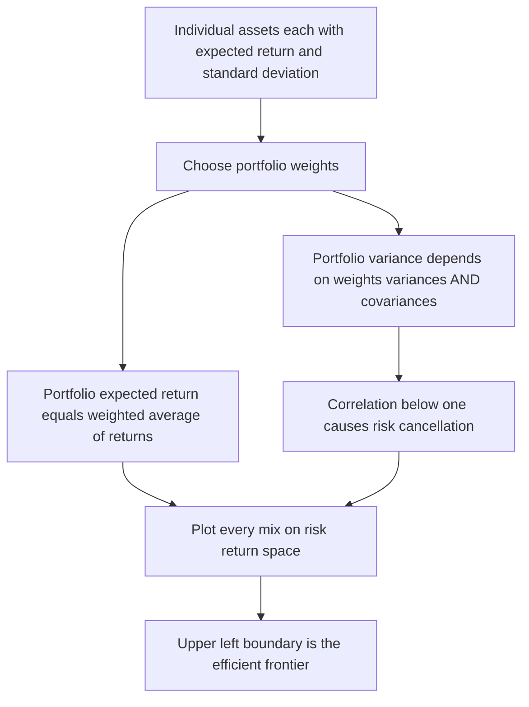
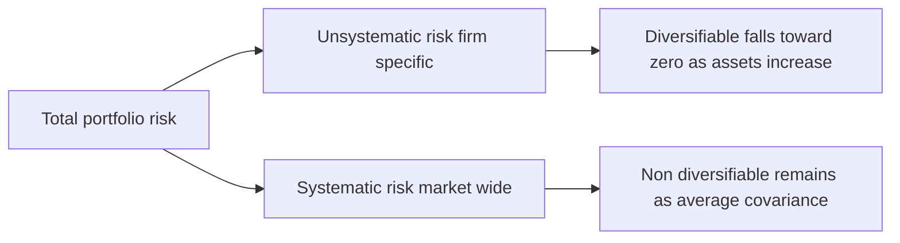
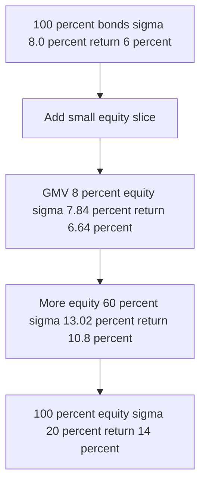

# Chapter 03 — Modern Portfolio Theory (Markowitz)

## 1. The Problem / Need

Every investor faces the same uncomfortable truth: **higher returns come bundled with higher uncertainty**. A government T-bill pays you 6% and you will get exactly that. An equity might average 14%, but any given year could deliver +45% or −30%. So how much of your money should sit in each? And once you own several risky assets, how do you even measure the risk of the *whole* pile?

Before 1952, the practical answer was folklore. Analysts picked stocks they liked one at a time, on their individual merits — "this is a good company at a fair price." Risk was treated as a property of each security in isolation. The portfolio was just an unexamined bag of individually-chosen bets. Nobody had a rigorous way to answer two questions that turn out to be the whole game:

1. **How risky is a portfolio**, given the riskiness of its components? Is it just the average of their risks? (Spoiler: no.)
2. Given a target return, **what is the least-risky way to achieve it** — the optimal *mix*, not the optimal single stock?

Harry Markowitz, then a 25-year-old PhD student at Chicago, noticed the missing piece. Investors don't care about return alone (else everyone borrows to the hilt and buys the single highest-return asset) and they don't care about risk alone (else everyone holds cash). They care about **both, jointly**. And crucially, the risk of a portfolio is *not* the weighted average of the individual risks — because assets don't move in lockstep. When one zigs, another zags, and the zigs and zags partly cancel. That cancellation is **diversification**, and it is, in Markowitz's own later phrase, "the only free lunch in finance."

His 1952 paper *Portfolio Selection* turned this intuition into mathematics and won him the 1990 Nobel Prize. It is the foundation on which CAPM, index funds, risk budgeting, and the entire asset-management industry rest.

> **The need in one line:** we need a framework that treats a portfolio as a *system* of interacting assets, quantifies its risk correctly (accounting for co-movement), and identifies the mixes that give the most return per unit of risk.

## 2. The Core Idea

Modern Portfolio Theory (MPT) rests on a **mean–variance framework**. Reduce every asset — and every portfolio — to just two numbers:

- **Mean** (expected return, `E(R)`): the reward you expect.
- **Variance** (or its square root, **standard deviation**, `σ`): the risk, i.e., the dispersion of outcomes around that mean.

A rational investor, MPT assumes, wants **more mean and less variance**. Plot every possible portfolio on a graph with risk (σ) on the x-axis and return on the y-axis, and you get a cloud of points. The investor wants to be as far **up-and-to-the-left** as possible.

The core insight has three moves:

1. **A portfolio's expected return is a simple weighted average** of its components' returns. Nothing surprising here.
2. **A portfolio's risk is NOT a simple weighted average.** It depends on how the assets *co-move* — their **covariance / correlation**. Because correlations are usually below 1, portfolio risk comes out *lower* than the weighted-average risk. This is the diversification benefit, and it is the heart of the theory.
3. Therefore, for any target return there exists a **minimum-variance mix**, and the set of all such best mixes forms the **efficient frontier** — the menu of intelligently-constructed portfolios no rational investor should ever fall below.

*Figure 1 — The logic of MPT: return averages, but risk under-averages because of correlation, producing an efficient frontier.*

## 3. Why / How It Works

### Why risk under-averages

Imagine two assets, each with standard deviation 20%. Naively you might think a 50/50 blend also has 20% risk. It doesn't — unless the two assets move *perfectly together*.

Think of two shopkeepers: one sells umbrellas, one sells sunscreen. Each business is volatile month to month — a rainy month is terrible for sunscreen and great for umbrellas. But own **both** and your combined revenue is remarkably stable: whatever the weather, one leg pays off. The individual volatilities didn't vanish; they *offset* because the two revenues are **negatively correlated**.

Mathematically, this offsetting lives in the **covariance** term of the variance formula. When you square a sum, `(a + b)² = a² + b² + 2ab`, you get cross-terms. The `2ab` cross-term is the covariance. If assets move oppositely, that term is negative and *subtracts* from total risk. Even if they're merely *imperfectly* positively correlated (the usual case for stocks), the cross-term is smaller than it would be under perfect correlation, so risk still falls below the weighted average.

### The role of correlation (ρ)

Correlation ρ ranges from −1 to +1 and is the dial that controls how much diversification you get:

| Correlation ρ | What it means | Diversification benefit |
|---|---|---|
| **+1** | Assets move perfectly together | **None** — portfolio σ is the weighted average of σ's |
| **0** | Movements unrelated | **Substantial** — risk falls meaningfully |
| **−1** | Perfect opposites | **Maximum** — risk can be driven to *zero* with the right weights |

The key takeaway interviewers love: **diversification benefit exists for any ρ < +1.** You do not need negative correlation. You just need assets that are less than perfectly correlated — which is virtually all real asset pairs.

### Why this is the "only free lunch"

Normally in finance you pay for what you get: want more return, take more risk. Diversification is different — it lets you *reduce* risk **without sacrificing expected return**, purely by combining assets intelligently. You're not forecasting better or taking a view; you're exploiting the mathematical fact that imperfectly-correlated risks partly cancel. That's why it's "free."

### Real market context

This is not a textbook curiosity — it is *the* organising principle of professional money management:

- **The 60/40 portfolio.** The classic balanced fund (60% equities, 40% bonds) is a direct application of two-asset MPT. Bonds historically carried low-to-negative correlation with equities, so the blend smoothed the ride. Notably, in 2022 that assumption broke — stocks and bonds fell *together* as inflation spiked, ρ went positive, and 60/40 had one of its worst years ever. A vivid live demonstration that **the diversification benefit is only as good as the correlation input**, and that correlations are not constant.
- **Asset allocation vs stock picking.** A famous (if debated) finding from Brinson, Hood & Beebower is that the *allocation* decision — how you split across asset classes — explains the vast majority of a portfolio's return variability, far more than individual security selection. MPT is what makes allocation a rigorous, quantitative discipline rather than guesswork.
- **Why AMCs hold hundreds of names.** An equity mutual fund holding 50–100 stocks isn't hedging its bets out of timidity; it's deliberately pushing unsystematic risk toward zero so that the fund's risk is dominated by systematic (market) risk it is being paid to bear. This is MPT's `n`-asset logic in action.
- **Crisis correlation spikes.** The cruel irony practitioners quote: "diversification works until you need it most." In 2008 and March 2020, correlations across risky assets jumped toward +1 as everything sold off together, temporarily gutting the diversification benefit. MPT's static-correlation assumption is precisely what this violates — a key limitation to flag in interviews.

## 4. Full Content — Formulas & Models

### 4.1 Expected return of a single asset

Given probability-weighted scenarios:

$$E(R) = \sum_{i=1}^{n} p_i \, R_i$$

where `p_i` is the probability of state *i* and `R_i` the return in that state. (For historical data, this is just the arithmetic mean of past returns.)

### 4.2 Variance and standard deviation of a single asset

$$\sigma^2 = \sum_{i=1}^{n} p_i \,\big(R_i - E(R)\big)^2 \qquad \sigma = \sqrt{\sigma^2}$$

Variance is in "squared return" units (awkward), so we take the square root to get **standard deviation**, expressed in the same % units as return — the standard risk measure.

### 4.3 Covariance and correlation between two assets

**Covariance** measures how two assets move together:

$$\text{Cov}(A,B) = \sigma_{AB} = \sum_{i} p_i \,\big(R_{A,i} - E(R_A)\big)\big(R_{B,i} - E(R_B)\big)$$

Covariance's magnitude is hard to interpret (it depends on the assets' scales), so we standardise it into **correlation**:

$$\rho_{AB} = \frac{\sigma_{AB}}{\sigma_A \, \sigma_B} \quad\Longleftrightarrow\quad \sigma_{AB} = \rho_{AB}\,\sigma_A\,\sigma_B$$

Correlation is unit-free and bounded in [−1, +1]. The right-hand rearrangement is the form you'll plug into the variance formula.

### 4.4 Two-asset portfolio — expected return

$$\boxed{\,E(R_p) = w_A\,E(R_A) + w_B\,E(R_B)\,}$$

with weights summing to one, `w_A + w_B = 1`. A simple weighted average — this is the part that *does* average.

### 4.5 Two-asset portfolio — variance (the central formula)

$$\boxed{\,\sigma_p^2 = w_A^2\,\sigma_A^2 + w_B^2\,\sigma_B^2 + 2\,w_A w_B\,\rho_{AB}\,\sigma_A\,\sigma_B\,}$$

and portfolio standard deviation `σ_p = √(σ_p²)`.

Read it as three pieces: the two **own-variance** terms (`w²σ²`) plus the **cross-term** `2 w_A w_B ρ σ_A σ_B`. That cross-term is where correlation does its work. Because ρ can be less than 1, the whole expression comes in below the weighted-average-of-σ's benchmark.

**Special cases** (set A and B weights and vary ρ):

- **ρ = +1:** `σ_p = w_A σ_A + w_B σ_B` (perfect positive → σ is a straight weighted average, *no* benefit).
- **ρ = −1:** `σ_p = |w_A σ_A − w_B σ_B|` (perfect negative → a specific weight makes σ_p = **0**, a riskless combination).

The zero-risk weight when ρ = −1: set `w_A σ_A = w_B σ_B`, giving `w_A = σ_B / (σ_A + σ_B)`.

### 4.6 The minimum-variance portfolio (two assets)

The weight in A that minimises portfolio variance (found by differentiating σ_p² w.r.t. w_A and setting to zero):

$$w_A^{\min} = \frac{\sigma_B^2 - \rho_{AB}\,\sigma_A\,\sigma_B}{\sigma_A^2 + \sigma_B^2 - 2\,\rho_{AB}\,\sigma_A\,\sigma_B}$$

This gives the leftmost point of the two-asset curve — the **Global Minimum Variance (GMV) portfolio** for that pair.

### 4.7 The n-asset generalisation

For a portfolio of *n* assets with weights `w_i`:

**Expected return:**
$$E(R_p) = \sum_{i=1}^{n} w_i\, E(R_i)$$

**Variance (double-sum form):**
$$\sigma_p^2 = \sum_{i=1}^{n}\sum_{j=1}^{n} w_i\,w_j\,\sigma_{ij} = \sum_i w_i^2 \sigma_i^2 + \sum_i \sum_{j \ne i} w_i w_j \,\sigma_{ij}$$

where `σ_ii = σ_i²`. In compact **matrix form**, with weight vector **w** and covariance matrix **Σ**:

$$\sigma_p^2 = \mathbf{w}^{\top}\,\boldsymbol{\Sigma}\,\mathbf{w}$$

**The counting insight (why covariance dominates):** an *n*-asset portfolio's variance is a sum of `n` variance terms and `n² − n` covariance terms. As *n* grows, covariances vastly outnumber variances. For a 50-stock portfolio: 50 variance terms vs 2,450 covariance terms. This is the mathematical proof that **in a large portfolio, what matters is not each stock's own risk but how stocks co-move.**

Push this to the limit with an equally-weighted portfolio (`w_i = 1/n`):

$$\sigma_p^2 = \frac{1}{n}\,\overline{\sigma_i^2} + \Big(1 - \frac{1}{n}\Big)\,\overline{\sigma_{ij}}$$

As `n → ∞`, the first term (average own-variance, the **diversifiable / unsystematic** risk) vanishes, and `σ_p²` converges to the **average covariance** — the **systematic risk** that no amount of diversification can remove. This decomposition is the bridge to CAPM (next chapter).

*Figure 2 — Diversification eliminates unsystematic risk but leaves systematic risk as a floor.*

### 4.8 The efficient frontier & assumptions

Plot every feasible portfolio in (σ, E(R)) space. The **feasible set** is a solid region; its upper-left boundary is the **efficient frontier** — portfolios offering **maximum return for a given risk** (equivalently, minimum risk for a given return). Any portfolio *below* the frontier is **dominated** (you could get more return for the same risk). The frontier's leftmost tip is the **GMV portfolio**; the segment below the GMV point is the *inefficient* lower boundary.

*Figure 4 — The efficient frontier is the upper-left edge of the feasible set, anchored at the GMV point; everything below it is dominated.*

**Markowitz's assumptions:**
- Investors are **rational** and **risk-averse** (prefer less variance for equal return).
- Decisions are made purely on **mean and variance** over a single period (either returns are normally distributed, or investors have quadratic utility).
- Markets are frictionless (no taxes/costs) in the basic model.
- Investors agree on inputs (in the equilibrium extension).

### 4.9 The shape of the frontier and how a third asset helps

Why does the two-asset combination trace a *curve* (a hyperbola) rather than a straight line? Because return moves linearly with weight while risk moves *sub*-linearly (the square-root of a quadratic). The gap between the straight line you'd get under ρ=+1 and the bowed-in curve you get under ρ<+1 is a geometric picture of the diversification benefit — **the more the curve bows to the left, the lower the correlation and the bigger the free lunch.**

Adding a **third asset** expands the feasible set from a curve into a two-dimensional region, and the efficient frontier becomes the upper-left envelope of *all* pairwise and multi-way combinations. The practical lesson: a new asset improves your frontier not because it has high return or low risk on its own, but because it has **low correlation with what you already hold**. This is why gold, commodities, and real estate earn a place in institutional portfolios despite mediocre standalone returns — their diversifying (low-ρ) property shifts the whole frontier up-and-left.

### 4.10 A note on the risk measure itself

MPT uses **variance** (symmetric dispersion) as its risk proxy. Critics point out that investors don't fear *upside* volatility — only downside. This motivates alternatives like **semi-variance** (dispersion below the mean only) and, later, **Value at Risk (VaR)** and downside-deviation-based ratios (Sortino). Markowitz himself acknowledged semi-variance was arguably more logical but chose variance for tractability — the covariance algebra above simply doesn't work as cleanly for downside measures. Know this trade-off: variance is chosen for **mathematical convenience and the clean covariance decomposition**, at the cost of treating good and bad surprises identically.

## 5. Worked Examples

### Example 1 — Full two-asset risk/return (the core numerical)

**Setup.** You are blending an equity fund **E** and a bond fund **B**.

| Asset | Expected return | Std. dev. (σ) | Weight |
|---|---|---|---|
| Equity (E) | 14% | 20% | 60% |
| Bond (B) | 6% | 8% | 40% |
| Correlation ρ(E,B) | | | **+0.20** |

**Step 1 — Portfolio expected return.**
$$E(R_p) = 0.60(14\%) + 0.40(6\%) = 8.4\% + 2.4\% = \mathbf{10.8\%}$$

**Step 2 — Portfolio variance.** Use `σ_p² = w_E²σ_E² + w_B²σ_B² + 2 w_E w_B ρ σ_E σ_B`. Work in decimals (20% = 0.20).

- Term 1: `w_E²σ_E² = 0.60² × 0.20² = 0.36 × 0.04 = 0.014400`
- Term 2: `w_B²σ_B² = 0.40² × 0.08² = 0.16 × 0.0064 = 0.001024`
- Term 3: `2 w_E w_B ρ σ_E σ_B = 2 × 0.60 × 0.40 × 0.20 × 0.20 × 0.08`
  - = `2 × 0.60 × 0.40 = 0.48`; then `× 0.20 (ρ) = 0.096`; then `× 0.20 × 0.08 = 0.096 × 0.016 = 0.001536`

$$\sigma_p^2 = 0.014400 + 0.001024 + 0.001536 = 0.016960$$

**Step 3 — Portfolio standard deviation.**
$$\sigma_p = \sqrt{0.016960} = 0.13023 = \mathbf{13.02\%}$$

**Step 4 — Reconcile against the no-diversification benchmark.** If ρ were +1, risk would be the weighted average of σ's:
$$\sigma_{\text{no-benefit}} = 0.60(20\%) + 0.40(8\%) = 12\% + 3.2\% = 15.2\%$$

But our actual portfolio σ is only **13.02%** — a **2.18 percentage-point reduction** in risk, achieved *purely* by combining, while still earning 10.8%. **That gap is the diversification benefit.** Self-check: 13.02% < 15.2% ✓, and it sits below equity's 20% and above bond's 8%, as a blend should. ✓

### Example 2 — Same assets, vary the correlation

Hold weights (60/40) and all else fixed; change only ρ. Recompute σ_p to see correlation's power. Only Term 3 changes: `2 w_E w_B σ_E σ_B = 0.48 × 0.016 = 0.00768`, then multiplied by ρ.

| ρ | Term 3 = 0.00768 × ρ | σ_p² = 0.015424 + Term 3 | σ_p |
|---|---|---|---|
| **+1.0** | +0.007680 | 0.023104 | **15.20%** |
| **+0.5** | +0.003840 | 0.019264 | 13.88% |
| **+0.2** | +0.001536 | 0.016960 | 13.02% |
| **0.0** | 0.000000 | 0.015424 | 12.42% |
| **−0.5** | −0.003840 | 0.011584 | 10.76% |
| **−1.0** | −0.007680 | 0.007744 | **8.80%** |

*(Here 0.015424 = Term 1 + Term 2 = 0.014400 + 0.001024.)*

**Reading it:** as correlation falls, portfolio risk falls monotonically — from 15.20% at ρ=+1 down to 8.80% at ρ=−1 — while expected return stays pinned at 10.8% throughout. **Same reward, less and less risk, just from lower correlation.** At ρ = +1 you get 15.20%, exactly the weighted average from Example 1 — confirming the "no benefit under perfect positive correlation" special case. ✓

*Note:* at ρ = −1, the 60/40 mix doesn't reach zero risk because the zero-risk weight is `w_E = σ_B/(σ_E+σ_B) = 8/(20+8) = 28.6%`, not 60%.

### Example 3 — The minimum-variance portfolio

Using the same E and B with ρ = +0.20, find the mix that *minimises* risk. Apply the GMV weight formula with `σ_E = 0.20, σ_B = 0.08, σ_{EB} = ρσ_Eσ_B = 0.20 × 0.20 × 0.08 = 0.0032`.

$$w_E^{\min} = \frac{\sigma_B^2 - \sigma_{EB}}{\sigma_E^2 + \sigma_B^2 - 2\sigma_{EB}} = \frac{0.0064 - 0.0032}{0.04 + 0.0064 - 2(0.0032)} = \frac{0.0032}{0.0400} = \mathbf{0.08}$$

So the GMV portfolio holds **8% equity, 92% bonds**. Its return: `0.08(14%) + 0.92(6%) = 1.12% + 5.52% = 6.64%`. Its variance:

- T1: `0.08² × 0.04 = 0.0064 × 0.04 = 0.000256`
- T2: `0.92² × 0.0064 = 0.8464 × 0.0064 = 0.005417`
- T3: `2 × 0.08 × 0.92 × 0.0032 = 0.1472 × 0.0032 = 0.000471`
- σ_p² = 0.006144 → **σ_p = 7.84%**

**Reconcile:** 7.84% is *below* bond's own 8% standalone risk — a striking result. Even adding a *riskier* asset (equity) can lower total risk, because equity's imperfect correlation with bonds provides offset. This is diversification at its most counterintuitive, and a favourite interview "gotcha." ✓

*Figure 3 — Moving along the two-asset frontier: adding equity first lowers risk to the GMV point, then raises both risk and return.*

## 6. Connections

- **→ CAPM & the SML (Ch. 4):** MPT's decomposition of risk into diversifiable vs systematic leads directly to CAPM, which says only *systematic* risk (beta) is rewarded because the rest is diversifiable and thus "free" to remove. The efficient frontier plus a risk-free asset produces the **Capital Market Line** and the tangency (market) portfolio.
- **→ Index investing:** If diversification removes unsystematic risk for free and no one can beat the market portfolio on a risk-adjusted basis, hold the broadest, cheapest index. MPT is the intellectual backbone of Vanguard-style passive investing.
- **→ Sharpe ratio (Ch. 5):** MPT ranks portfolios by return *per unit of risk*; the Sharpe ratio `(R_p − R_f)/σ_p` formalises "up and to the left" into a single number. The tangency portfolio is the max-Sharpe portfolio.
- **→ Risk parity & asset allocation:** Modern multi-asset funds allocate by *risk contribution* using the same covariance-matrix machinery (`w'Σw`).
- **→ Behavioural critique (Ch. later):** MPT assumes rational mean-variance investors; behavioural finance documents where this breaks (loss aversion, correlation spikes in crises).

## 7. Key Terms

| Term | Meaning |
|---|---|
| **Mean–variance framework** | Describing assets/portfolios by expected return (mean) and risk (variance/σ) only |
| **Expected return E(R)** | Probability-weighted average of possible returns |
| **Variance / Std. dev. (σ)** | Dispersion of returns around the mean; σ is the standard risk measure |
| **Covariance (σ_ij)** | Unstandardised measure of how two assets co-move |
| **Correlation (ρ)** | Standardised covariance, bounded [−1, +1] |
| **Diversification** | Risk reduction from combining imperfectly-correlated assets |
| **Systematic risk** | Market-wide, non-diversifiable risk (the covariance floor) |
| **Unsystematic risk** | Firm-specific, diversifiable risk |
| **Efficient frontier** | Set of portfolios with max return per unit of risk |
| **GMV portfolio** | Global Minimum Variance — the least-risky feasible portfolio |
| **Feasible / dominated set** | All achievable portfolios; dominated ones lie below the frontier |

## 8. Common Confusions

- **"Portfolio risk is the average of the assets' risks."** *No.* Return averages; risk does not, because of the covariance term. σ_p ≤ weighted-average σ, with equality only when ρ = +1.
- **"You need negatively-correlated assets to diversify."** *No.* Any ρ < +1 gives a benefit. Negative correlation is *ideal* (can reach zero risk), but positive-but-imperfect still helps.
- **"Adding a risky asset always raises portfolio risk."** *No.* Example 3 showed adding equity to a bond portfolio *lowered* σ below the bond's own. Correlation, not standalone risk, governs the effect.
- **"Diversification eliminates all risk."** *No.* It removes only unsystematic (diversifiable) risk. Systematic risk — the average covariance — remains as a floor no matter how many assets you add.
- **"Covariance and correlation are the same."** *Related, not identical.* Correlation = covariance scaled by the two σ's; it's covariance made comparable and bounded.
- **"More assets is always better."** Benefits taper sharply — most diversification is captured by ~20–30 stocks; beyond that the marginal reduction is tiny (you're near the systematic floor).
- **Units error.** Always convert percentages to decimals *before* squaring in the variance formula, or square the % consistently. Mixing the two is the #1 exam mistake.

## 9. First-Principles Recap

Strip it to bedrock:

1. Investors want **more return and less uncertainty** — two dimensions, judged jointly.
2. A portfolio's **return is a weighted average** of its parts. Boring but true.
3. A portfolio's **risk is less than the weighted average** of its parts' risks, because assets don't move perfectly together — the **covariance cross-term** captures this and, being sub-maximal whenever ρ < 1, drags total risk down.
4. This risk reduction is **free** — you sacrifice no expected return to get it. Hence "the only free lunch in finance."
5. The reduction has a **limit**: firm-specific (unsystematic) risk washes out, but market-wide (systematic) risk — the average covariance — cannot be diversified away.
6. For each target return there's a **minimum-risk mix**; the collection of these is the **efficient frontier**, the rational investor's entire menu.

Everything downstream — CAPM, beta, index funds, Sharpe ratios, risk budgeting — is a corollary of these six lines.

## 10. Quick-Reference / Interview Points

**Formula sheet**

| Quantity | Formula |
|---|---|
| Expected return (asset) | `E(R) = Σ pᵢRᵢ` |
| Variance (asset) | `σ² = Σ pᵢ(Rᵢ − E(R))²` |
| Covariance | `σ_AB = Σ pᵢ(R_A,ᵢ − E(R_A))(R_B,ᵢ − E(R_B))` |
| Correlation | `ρ_AB = σ_AB / (σ_A σ_B)` |
| Portfolio return (2-asset) | `E(R_p) = w_A E(R_A) + w_B E(R_B)` |
| **Portfolio variance (2-asset)** | `σ_p² = w_A²σ_A² + w_B²σ_B² + 2w_A w_B ρ σ_A σ_B` |
| Portfolio variance (n-asset) | `σ_p² = ΣΣ w_i w_j σ_ij = w'Σw` |
| GMV weight (2-asset) | `w_A = (σ_B² − ρσ_Aσ_B)/(σ_A² + σ_B² − 2ρσ_Aσ_B)` |
| Zero-risk weight (ρ=−1) | `w_A = σ_B/(σ_A + σ_B)` |

**What interviewers ask (and the crisp answer)**

- *"Why isn't portfolio risk the average of the individual risks?"* → Because of the covariance term; with ρ < 1 the cross-term is sub-maximal, so σ_p < weighted-avg σ.
- *"Do you need negative correlation to diversify?"* → No — any ρ < +1 helps; negative is just the strongest case.
- *"Can adding a riskier asset reduce portfolio risk?"* → Yes, if its correlation with the portfolio is low enough (show the bond+equity GMV example).
- *"What risk can't diversification remove?"* → Systematic (market) risk — the average-covariance floor; this motivates CAPM's beta.
- *"How many stocks to diversify?"* → Most benefit by ~20–30; diminishing returns thereafter.
- *"What's the efficient frontier?"* → The upper-left boundary of feasible portfolios — max return per unit risk; below it, portfolios are dominated.
- *"State the assumptions."* → Rational risk-averse investors, single-period, decisions on mean & variance only (normal returns or quadratic utility), agreed inputs, frictionless markets.
- *"Limitations?"* → Relies on estimated inputs (garbage-in), assumes stable correlations (they spike in crises), single-period, ignores higher moments (skew/kurtosis / fat tails).

**One-liner to remember:** *Return averages; risk under-averages — and that gap is the free lunch.*
