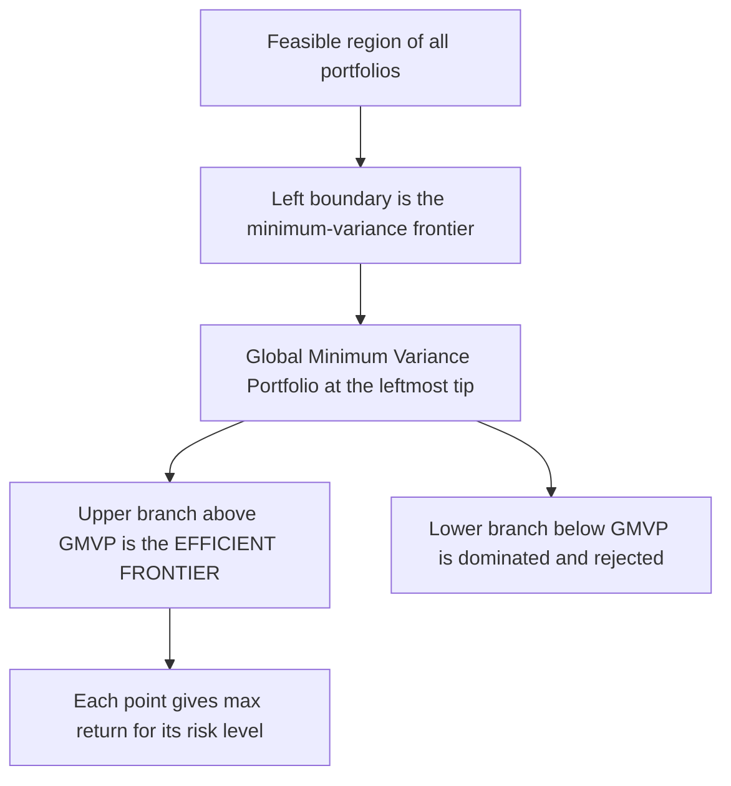
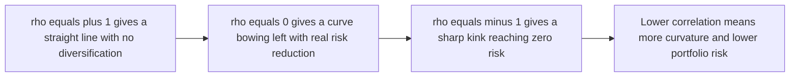
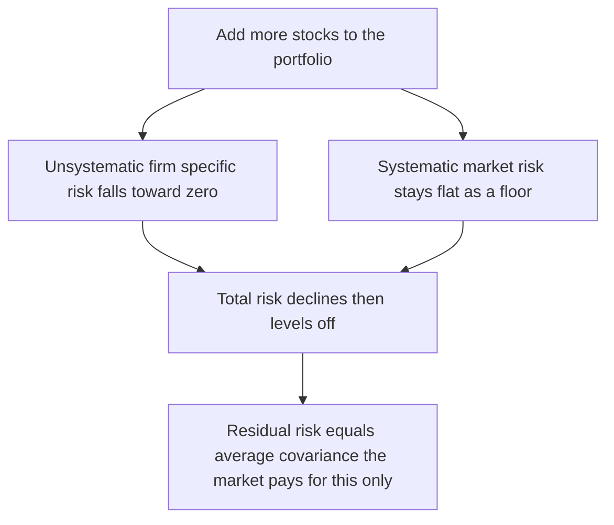
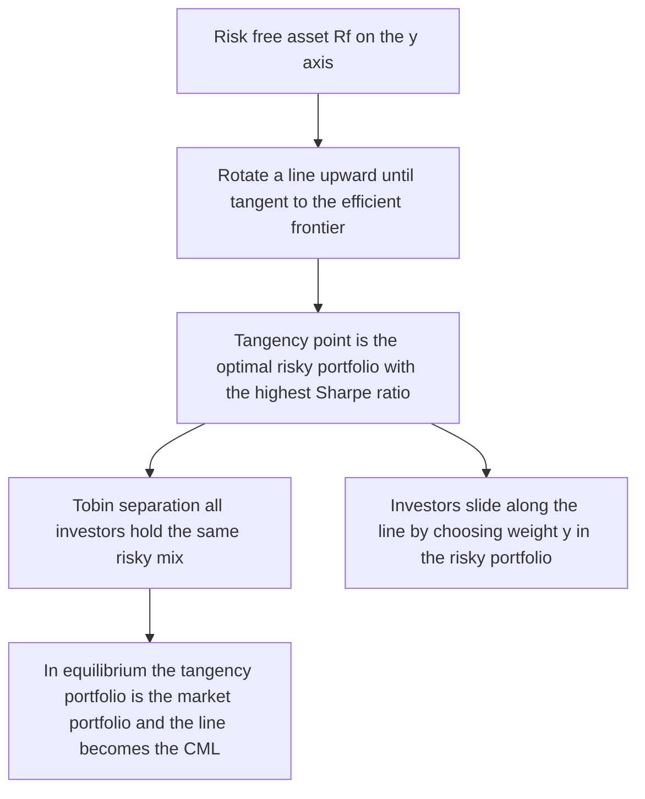

# Chapter 04 — The Efficient Frontier and Diversification

## 1. The Problem / Need

An investor never holds a single asset in a vacuum. Even the most concentrated equity-research analyst who "loves" one stock must answer a portfolio-level question: *given all the securities in the world, and given that I dislike risk, which combinations should I even consider owning, and which should I reject outright?* Buying the highest-return stock is naive because return comes bundled with risk, and risk does not simply add up when you hold many assets — it partially cancels.

The core problem is therefore twofold:

1. **Which portfolios are "good"?** Out of the infinite combinations of weights across thousands of securities, most are dominated — you can find another portfolio with the same risk but higher return, or the same return with lower risk. We need a rule to throw away the junk and keep only the survivors.
2. **How much risk can I destroy for free?** If I spread money across many stocks, some of the wobble in individual names cancels out. But not all of it. There is a floor. We need to understand *what kind* of risk vanishes through diversification and what kind is irreducible — because the market only pays you for the irreducible part.

Harry Markowitz's 1952 paper *Portfolio Selection* turned this from folk wisdom ("don't put all your eggs in one basket") into a precise optimisation problem. The output is the **efficient frontier**: the set of portfolios that are not dominated. Layer on a risk-free asset and you get the **Capital Allocation Line** and the **Capital Market Line**, which tell you that the entire investment problem collapses into two decisions: *what mix of risky assets to hold* (the same for everyone) and *how much of your wealth to put in it* (personal to your risk appetite). This is the intellectual backbone of modern asset management, index funds, and CAPM.

## 2. The Core Idea

Risk and return are the two axes of every investment decision. Plot every possible portfolio on a graph with **standard deviation (risk) on the x-axis** and **expected return on the y-axis**. The cloud of achievable portfolios forms a region. Its left-hand boundary is a bullet-shaped curve — the **minimum-variance frontier**. The upper half of that boundary, from the **global minimum-variance portfolio (GMVP)** upward, is the **efficient frontier**: for each level of risk it gives the maximum return, and no rational investor would hold anything below it.

Two ideas power everything:

- **Diversification is a free lunch on risk.** Because assets are less than perfectly correlated, the risk of a portfolio is *less* than the weighted average of individual risks. The lower the correlation, the more the frontier bows to the left (toward lower risk).
- **Total risk splits into two parts.** *Unsystematic* (firm-specific) risk can be diversified away to nearly zero. *Systematic* (market) risk cannot. The market rewards you only for bearing systematic risk — a principle that flows directly into CAPM in the next chapter.

Add a risk-free asset (a T-bill), draw a straight line from it that just touches the efficient frontier, and the tangency point is the single best risky portfolio for *everybody*. This is the **Tobin separation theorem**, and the line is the Capital Allocation / Capital Market Line.

## 3. Why / How It Works

### Why diversification reduces risk

Portfolio variance depends not just on individual variances but on **covariances** — how assets move together. When two assets are imperfectly correlated, on days when one disappoints, the other may not, so their combined swings are damped. Mathematically, the cross terms in the variance formula carry the correlation coefficient ρ, and any ρ < 1 pulls portfolio variance below the weighted-average variance.

The intuition sharpens in a large portfolio. As you add more and more stocks with equal weights, the contribution of each stock's *own* variance shrinks like 1/n, while the *average covariance* between pairs of stocks does not shrink. So as n grows, portfolio variance converges to the **average covariance** — the residual, irreducible, systematic risk. Firm-specific noise (a factory fire, a CEO scandal, a surprise earnings beat) is idiosyncratic and averages out; economy-wide shocks (interest rates, recessions, oil prices) hit every stock and remain.

### Why only the upper boundary matters

Given two portfolios with identical risk, a rational (non-satiated, risk-averse) investor always prefers the one with higher return. So every portfolio strictly below the top edge of the feasible region is *dominated* and discarded. What survives is the efficient frontier. It is concave (bows up-and-left) precisely because of the diversification effect.

### Why a risk-free asset creates a straight line

If you split money between a risk-free asset (zero variance) and a risky portfolio P, the expected return is linear in the weight, and — because the risk-free asset has zero variance and zero covariance with P — the standard deviation is *also* linear in the weight. A linear return and a linear risk trace a **straight line** in risk-return space, running from the risk-free rate through P. To get the best such line, you rotate it upward until it is tangent to the efficient frontier. Steeper is better (more return per unit of risk), so the tangency portfolio is optimal.

## 4. Full Content — Formulas, Models, Derivations

### 4.1 Two-asset portfolio

Expected return (weights w₁, w₂ with w₁ + w₂ = 1):

$$E(R_p) = w_1 E(R_1) + w_2 E(R_2)$$

Variance:

$$\sigma_p^2 = w_1^2\sigma_1^2 + w_2^2\sigma_2^2 + 2\,w_1 w_2\,\rho_{12}\,\sigma_1\sigma_2$$

where the covariance is $\text{Cov}(R_1,R_2)=\sigma_{12}=\rho_{12}\sigma_1\sigma_2$ and $-1 \le \rho_{12} \le 1$.

Standard deviation $\sigma_p = \sqrt{\sigma_p^2}$.

**Special correlation cases** (illuminating):

| Correlation ρ | Portfolio SD formula | Meaning |
|---|---|---|
| ρ = +1 | $\sigma_p = w_1\sigma_1 + w_2\sigma_2$ | No diversification — risk is a weighted average; frontier is a straight line |
| ρ = 0 | $\sigma_p = \sqrt{w_1^2\sigma_1^2 + w_2^2\sigma_2^2}$ | Meaningful diversification |
| ρ = −1 | $\sigma_p = \lvert w_1\sigma_1 - w_2\sigma_2\rvert$ | Perfect hedge — risk can be driven to zero |

With ρ = −1, setting $\sigma_p = 0$ gives the risk-eliminating weight $w_1 = \dfrac{\sigma_2}{\sigma_1+\sigma_2}$.

### 4.2 Minimum-variance weights (two assets)

Differentiate $\sigma_p^2$ with respect to w₁ and set to zero:

$$w_1^{\min} = \frac{\sigma_2^2 - \sigma_{12}}{\sigma_1^2 + \sigma_2^2 - 2\sigma_{12}}$$

This is the **minimum-variance portfolio** for two assets — the leftmost tip of the two-asset curve.

### 4.3 n-asset portfolio (matrix form)

$$E(R_p) = \sum_{i=1}^{n} w_i E(R_i) = \mathbf{w}^\top \boldsymbol{\mu}$$

$$\sigma_p^2 = \sum_{i=1}^{n}\sum_{j=1}^{n} w_i w_j \sigma_{ij} = \mathbf{w}^\top \boldsymbol{\Sigma}\, \mathbf{w}$$

where Σ is the n×n covariance matrix. Note the double sum contains n variance terms and n(n−1) covariance terms — as n grows, covariances dominate, which is the mathematical root of undiversifiable risk.

### 4.4 The large-portfolio limit (equal weights)

For an equally weighted portfolio, $w_i = 1/n$:

$$\sigma_p^2 = \frac{1}{n}\,\overline{\sigma_i^2} + \left(1 - \frac{1}{n}\right)\overline{\sigma_{ij}}$$

As $n \to \infty$: $\sigma_p^2 \to \overline{\sigma_{ij}}$ (the **average covariance**). The own-variance term vanishes (that is the unsystematic risk you diversify away); the average-covariance term is the **systematic floor**.

### 4.5 Total risk decomposition

$$\underbrace{\sigma_i^2}_{\text{total risk}} = \underbrace{\beta_i^2\,\sigma_M^2}_{\text{systematic}} + \underbrace{\sigma_{\varepsilon_i}^2}_{\text{unsystematic}}$$

from the single-index (market) model $R_i = \alpha_i + \beta_i R_M + \varepsilon_i$, where $\beta_i = \sigma_{iM}/\sigma_M^2$ measures sensitivity to the market and $\varepsilon_i$ is diversifiable firm-specific noise.

### 4.6 The efficient frontier

The **minimum-variance frontier** is the solution, for every target return, to:

$$\min_{\mathbf{w}} \; \mathbf{w}^\top \boldsymbol{\Sigma}\, \mathbf{w} \quad \text{s.t.} \quad \mathbf{w}^\top\boldsymbol{\mu} = R^*, \;\; \mathbf{w}^\top\mathbf{1} = 1$$

The upper branch (returns ≥ the GMVP return) is the **efficient frontier**. The GMVP itself minimises variance ignoring the return target.

### 4.7 The Capital Allocation Line (CAL)

Combining a risk-free asset $R_f$ (with y = weight in risky portfolio P):

$$E(R_c) = R_f + y\,[E(R_P) - R_f], \qquad \sigma_c = y\,\sigma_P$$

Eliminating y gives the straight-line CAL:

$$\boxed{\,E(R_c) = R_f + \frac{E(R_P) - R_f}{\sigma_P}\,\sigma_c\,}$$

The slope is the **Sharpe ratio** of P:

$$S_P = \frac{E(R_P) - R_f}{\sigma_P}$$

The **optimal risky portfolio** is the P that maximises this slope — the tangency of the CAL with the efficient frontier.

### 4.8 Optimal risky-portfolio weights (two risky assets + risk-free)

$$w_1^{*} = \frac{[E(R_1)-R_f]\sigma_2^2 - [E(R_2)-R_f]\sigma_{12}}{[E(R_1)-R_f]\sigma_2^2 + [E(R_2)-R_f]\sigma_1^2 - [E(R_1)-R_f+E(R_2)-R_f]\sigma_{12}}$$

with $w_2^{*} = 1 - w_1^{*}$. This gives the tangency (maximum-Sharpe) portfolio.

### 4.9 The Capital Market Line (CML)

When *all* investors face the same inputs and the same $R_f$, the tangency portfolio must be the **market portfolio M** (everything, value-weighted). The CAL that runs through M is elevated to the **Capital Market Line**:

$$\boxed{\,E(R_p) = R_f + \frac{E(R_M) - R_f}{\sigma_M}\,\sigma_p\,}$$

The CML prices *efficient* portfolios using **total risk** σ. (CAPM's Security Market Line, next chapter, prices *individual* assets using **beta**.)

### 4.10 Optimal complete portfolio (utility)

An investor with risk-aversion coefficient A maximising $U = E(R_c) - \tfrac{1}{2}A\sigma_c^2$ chooses:

$$y^{*} = \frac{E(R_P) - R_f}{A\,\sigma_P^2}$$

Higher expected excess return → invest more in risky P; higher risk or higher aversion → invest less. $y^*>1$ means borrowing at $R_f$ to leverage P.

---

### Diagram — the efficient frontier and the GMVP

*Figure 1 — The bullet-shaped feasible set. Only the upper edge above the GMVP survives as efficient.*

### Diagram — how correlation bows the two-asset curve

*Figure 2 — As correlation falls, the risk-return curve bends further left, delivering more free risk reduction.*

### Diagram — diversification and the two risks

*Figure 3 — Total risk falls with the number of holdings but flattens at the systematic floor.*

### Diagram — from CAL to CML via the tangency portfolio

*Figure 4 — The best CAL is tangent to the frontier; in market equilibrium it is the Capital Market Line.*

## 5. Worked Examples

### Example 1 — Two-asset risk and the diversification effect

Asset A: $E(R_A)=10\%$, $\sigma_A=20\%$. Asset B: $E(R_B)=16\%$, $\sigma_B=30\%$. Invest 60% in A, 40% in B. Compute portfolio return and risk for ρ = +1, ρ = 0, ρ = −1.

**Expected return** (independent of ρ):
$$E(R_p) = 0.6(10\%) + 0.4(16\%) = 6\% + 6.4\% = 12.4\%$$

Weighted-average SD (the ρ = +1 benchmark): $0.6(20) + 0.4(30) = 12 + 12 = 24\%$.

**ρ = +1:**
$$\sigma_p^2 = 0.6^2(20^2) + 0.4^2(30^2) + 2(0.6)(0.4)(1)(20)(30)$$
$$= 0.36(400) + 0.16(900) + 2(0.24)(600) = 144 + 144 + 288 = 576 \Rightarrow \sigma_p = 24\%$$
Exactly the weighted average — **no diversification benefit**.

**ρ = 0:**
$$\sigma_p^2 = 144 + 144 + 0 = 288 \Rightarrow \sigma_p = \sqrt{288} = 16.97\%$$
Risk fell from 24% to **16.97%** for the *same* 12.4% return — that gap is the free lunch.

**ρ = −1:**
$$\sigma_p = |0.6(20) - 0.4(30)| = |12 - 12| = 0\%$$
Perfect hedge: this exact weighting **eliminates all risk**. (Check the risk-free weight formula: $w_A = \sigma_B/(\sigma_A+\sigma_B) = 30/50 = 0.6$ ✓, matching our 60/40.)

**Reconciliation:** return is fixed at 12.4% across all three, while risk collapses 24% → 16.97% → 0% as correlation drops from +1 to 0 to −1 — exactly what Figure 2 predicts.

### Example 2 — Minimum-variance portfolio

Using Example 1's data with **ρ = 0.30**, so $\sigma_{AB}=0.30(20)(30)=180$. Find the GMVP.

$$w_A^{\min} = \frac{\sigma_B^2 - \sigma_{AB}}{\sigma_A^2 + \sigma_B^2 - 2\sigma_{AB}} = \frac{900 - 180}{400 + 900 - 360} = \frac{720}{940} = 0.766$$

So $w_A = 76.6\%$, $w_B = 23.4\%$.

Check the variance:
$$\sigma_p^2 = 0.766^2(400) + 0.234^2(900) + 2(0.766)(0.234)(180)$$
$$= 0.587(400) + 0.0548(900) + 2(0.1792)(180)$$
$$= 234.7 + 49.3 + 64.5 = 348.5 \Rightarrow \sigma_p = 18.67\%$$

Return: $E(R_p) = 0.766(10) + 0.234(16) = 7.66 + 3.74 = 11.40\%$.

**Verification that this is the minimum:** try the 60/40 mix instead. $\sigma_p^2 = 144 + 144 + 2(0.24)(180) = 144+144+86.4 = 374.4 \Rightarrow \sigma_p = 19.35\%$. Higher than 18.67% ✓. The GMVP formula genuinely found a lower-risk mix.

### Example 3 — Optimal risky portfolio, Sharpe ratio, and the complete portfolio

Same assets, ρ = 0.30 ($\sigma_{AB}=180$), risk-free rate $R_f = 5\%$. Excess returns: A → 10−5 = 5%; B → 16−5 = 11%.

**Tangency weights** (Section 4.8):
$$w_A^* = \frac{(5)(900) - (11)(180)}{(5)(900) + (11)(400) - (5+11)(180)}$$
$$= \frac{4500 - 1980}{4500 + 4400 - 2880} = \frac{2520}{6020} = 0.4186$$

So the optimal risky portfolio P is $w_A = 41.9\%$, $w_B = 58.1\%$.

**Its return:** $E(R_P) = 0.4186(10) + 0.5814(16) = 4.186 + 9.302 = 13.49\%$.

**Its variance:**
$$\sigma_P^2 = 0.4186^2(400) + 0.5814^2(900) + 2(0.4186)(0.5814)(180)$$
$$= 0.1752(400) + 0.3380(900) + 2(0.2434)(180)$$
$$= 70.1 + 304.2 + 87.6 = 461.9 \Rightarrow \sigma_P = 21.49\%$$

**Sharpe ratio of P:**
$$S_P = \frac{13.49 - 5}{21.49} = \frac{8.49}{21.49} = 0.395$$

**Check it beats the GMVP's Sharpe:** GMVP had 11.40% return, 18.67% SD → $S = (11.40-5)/18.67 = 0.343 < 0.395$ ✓. The tangency portfolio genuinely has the steepest CAL.

**Complete portfolio** for an investor with A = 4:
$$y^* = \frac{E(R_P)-R_f}{A\,\sigma_P^2} = \frac{0.0849}{4(0.04619)} = \frac{0.0849}{0.1848} = 0.459$$

Put **45.9%** in P and **54.1%** in T-bills. The complete portfolio's stats:
- Return: $5\% + 0.459(8.49\%) = 5\% + 3.90\% = 8.90\%$
- Risk: $0.459(21.49\%) = 9.86\%$
- Sharpe (unchanged, on the CAL): $(8.90-5)/9.86 = 0.395$ ✓

**Reconciliation:** the complete portfolio sits *on the CAL* (same Sharpe as P, lower risk/return because it is between $R_f$ and P), confirming that mixing the risk-free asset with the single optimal risky portfolio just slides you along one straight line — the essence of two-fund separation.

## 6. Connections

- **CAPM / Security Market Line (Chapter 05):** The efficient frontier + risk-free asset produces the market portfolio and the CML. CAPM extends this to price *individual* assets: since only systematic risk survives diversification, expected return depends on β, not total σ. $E(R_i)=R_f+\beta_i[E(R_M)-R_f]$ is the direct heir of this chapter.
- **Single-index / multi-factor models:** The variance decomposition (4.5) underlies the market model, and later APT and Fama-French factors, which generalise "systematic risk" to multiple sources.
- **Sharpe ratio & performance evaluation:** The slope of the CAL *is* the Sharpe ratio — the workhorse metric for ranking funds. Maximising Sharpe = finding the tangency portfolio.
- **Index investing:** Two-fund separation is the theoretical charter for passive investing — if everyone should hold the market portfolio, buy a low-cost index and adjust risk with cash/leverage.
- **Bond & multi-asset allocation:** The same frontier math drives strategic asset allocation across equities, bonds, and alternatives — low cross-asset correlations are exactly why diversified 60/40 portfolios exist.
- **Value at Risk & risk budgeting:** Covariance-driven portfolio variance is the input to VaR and to risk-parity construction.

## 7. Key Terms

| Term | Meaning |
|---|---|
| **Efficient frontier** | Set of portfolios giving maximum return for each risk level; upper edge of the feasible set above the GMVP |
| **Minimum-variance frontier** | The full left boundary (both branches) of the feasible set |
| **Global Minimum Variance Portfolio (GMVP)** | The single lowest-risk portfolio; leftmost tip of the frontier |
| **Systematic risk** | Market-wide, undiversifiable risk; measured by β; the only risk that earns a premium |
| **Unsystematic risk** | Firm-specific / idiosyncratic risk; diversifiable to ~0 (also called residual or specific risk) |
| **Diversification** | Combining imperfectly correlated assets to lower portfolio risk below the weighted average |
| **Covariance / correlation** | Co-movement of two assets; ρ ∈ [−1, +1] drives the diversification benefit |
| **Capital Allocation Line (CAL)** | Straight line of risk-free + a risky portfolio combinations; slope = Sharpe ratio |
| **Optimal risky portfolio** | Tangency portfolio maximising the Sharpe ratio |
| **Capital Market Line (CML)** | The CAL through the market portfolio; prices efficient portfolios via total risk σ |
| **Sharpe ratio** | Excess return per unit of total risk, $(E(R_p)-R_f)/\sigma_p$ |
| **Two-fund / Tobin separation** | Everyone holds the same risky portfolio; risk preference only sets the risk-free/risky split |
| **Market portfolio** | Value-weighted portfolio of all risky assets; the equilibrium tangency portfolio |

## 8. Common Confusions

- **"More stocks always means less risk."** Only *unsystematic* risk falls; risk asymptotes to the systematic floor (average covariance). Beyond ~20–30 well-chosen stocks the marginal benefit is tiny.
- **Standard deviation vs. beta.** Total risk (σ) matters for a *standalone* portfolio and defines the CML. But for an *individual asset held inside a diversified portfolio*, only its systematic contribution (β) matters and defines the SML. Confusing the two is the classic exam trap.
- **CAL vs. CML.** The CAL is any risk-free-plus-risky line for a given investor/portfolio. The CML is the *specific* CAL through the market portfolio in equilibrium. Every CML is a CAL; not every CAL is the CML.
- **Efficient frontier vs. minimum-variance frontier.** The lower branch (below the GMVP) is part of the minimum-variance frontier but is *not* efficient — it is dominated.
- **Correlation vs. covariance sign.** They share a sign, but only correlation is scale-free and bounded in [−1,1]; diversification power is judged by ρ, not raw covariance.
- **"The GMVP is the best portfolio."** No — the GMVP minimises risk but usually has a lower Sharpe ratio than the tangency portfolio. Once a risk-free asset exists, you want the tangency portfolio, not the GMVP.
- **Diversification eliminates all risk.** Only in the ρ = −1 knife-edge case for two assets. In real markets ρ > 0 across equities, so a floor always remains.
- **Adding a high-risk asset always raises portfolio risk.** Not necessarily — a high-σ asset with low/negative correlation can *lower* total portfolio risk (why gold or long bonds earn a place despite volatility).

## 9. First-Principles Recap

Start from three primitives: investors like return, dislike variance, and assets do not move in lockstep.

1. Because assets are imperfectly correlated, the risk of a combination is *less* than the weighted average of individual risks — the cross terms carry ρ < 1. This is diversification, and it is free.
2. In a large portfolio, each asset's own variance contribution shrinks like 1/n but average covariance does not. So firm-specific (unsystematic) risk washes out and only market-wide (systematic) risk survives. The market can only pay you for what you *cannot* diversify away.
3. Plot all portfolios in σ–E(R) space; discard every dominated one. What remains is the concave efficient frontier, tipped at the global minimum-variance portfolio.
4. Introduce a risk-free asset. Mixing it with any risky portfolio traces a straight line whose slope is the Sharpe ratio. Rotate to the steepest line tangent to the frontier — that tangency point is the one optimal risky portfolio for everyone.
5. Your personal risk appetite only decides *how far along that line* you sit (how much cash vs. risky mix) — not *which* risky mix. That is two-fund separation.
6. In equilibrium the tangency portfolio must be the market portfolio, and the line becomes the Capital Market Line — the launchpad for CAPM.

Everything above is just variance arithmetic plus the refusal to hold a dominated portfolio.

## 10. Quick-Reference / Interview Points

### Formula sheet

| Quantity | Formula |
|---|---|
| Portfolio return | $E(R_p)=\sum w_i E(R_i)$ |
| 2-asset variance | $\sigma_p^2=w_1^2\sigma_1^2+w_2^2\sigma_2^2+2w_1w_2\rho\sigma_1\sigma_2$ |
| n-asset variance | $\sigma_p^2=\mathbf{w}^\top\Sigma\mathbf{w}$ |
| GMVP weight (2-asset) | $w_1=\dfrac{\sigma_2^2-\sigma_{12}}{\sigma_1^2+\sigma_2^2-2\sigma_{12}}$ |
| Large-n limit | $\sigma_p^2\to\overline{\sigma_{ij}}$ (average covariance) |
| Risk decomposition | $\sigma_i^2=\beta_i^2\sigma_M^2+\sigma_{\varepsilon}^2$ |
| Beta | $\beta_i=\sigma_{iM}/\sigma_M^2$ |
| Sharpe ratio | $S=(E(R_p)-R_f)/\sigma_p$ |
| CAL / CML | $E(R_p)=R_f+\dfrac{E(R_M)-R_f}{\sigma_M}\sigma_p$ |
| Optimal risky-asset split | $y^*=\dfrac{E(R_P)-R_f}{A\sigma_P^2}$ |

### What interviewers actually ask

- **"Why don't you just buy the highest-return stock?"** Because risk isn't rewarded linearly and idiosyncratic risk is uncompensated — diversify to kill it, then hold the highest-Sharpe mix.
- **"Difference between systematic and unsystematic risk?"** Market-wide vs. firm-specific; only systematic (β) earns a premium; unsystematic diversifies away.
- **"How many stocks to be diversified?"** Most unsystematic risk gone by ~20–30 low-correlation names; you can never remove systematic risk.
- **"Explain the efficient frontier / why is it concave?"** Set of non-dominated portfolios; concavity comes from ρ < 1 diversification bowing the curve left.
- **"CAL vs. CML vs. SML?"** CAL = any Rf+risky line (slope = Sharpe); CML = CAL through the market, prices efficient portfolios by σ; SML = CAPM line pricing *all* assets by β.
- **"Why is the tangency portfolio special?"** It maximises Sharpe; two-fund separation means everyone holds it and only varies the cash weighting.
- **"If two stocks have ρ = −1, what's the min-variance portfolio's risk?"** Zero — with weights $\sigma_2/(\sigma_1+\sigma_2)$.
- **"Would you add a volatile asset to a portfolio?"** Yes if its correlation is low/negative — marginal contribution to portfolio risk, not standalone σ, is what matters.

### Numbers to remember
- Equity pairwise correlations run roughly 0.3–0.7 → real but incomplete diversification.
- Sharpe ratio of the broad equity market is historically ~0.4–0.5.
- Adding assets past ~30 gives diminishing risk reduction — the systematic floor.
