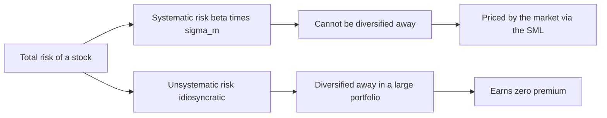
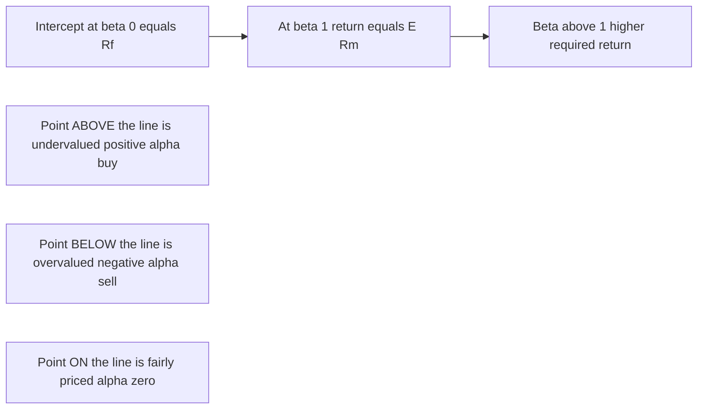
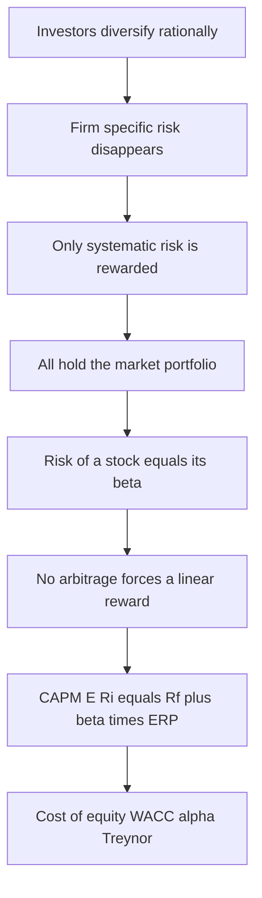

# Chapter 05 — The Capital Asset Pricing Model (CAPM)

## 1. The Problem / Need

By the end of the Markowitz–Sharpe story (Chapter 04) we knew *how* a rational investor should build a portfolio: diversify until only **systematic risk** remains, then hold the tangency portfolio combined with the risk-free asset along the Capital Market Line. That is a beautiful prescription, but it leaves a huge practical question unanswered:

> **What is the *right* expected return for an individual security?**

Consider you are an equity analyst at an AMC. You have forecast that Infosys will return 14% next year. Is that good or bad? You cannot answer without a benchmark — a "fair" required return that compensates you for the risk you are bearing. If the fair return is 11%, Infosys is a screaming buy (you earn 3% of *alpha*). If the fair return is 16%, it is overpriced and you should sell.

The problem is deeper than picking a number. Total risk (standard deviation) is the *wrong* yardstick for a single stock, because a well-diversified investor has already thrown away the diversifiable part. A stock that is wildly volatile on its own but whose swings cancel against the rest of the portfolio adds almost no risk to that portfolio. So the market should **not** pay you for volatility it can diversify away. We need a pricing rule that rewards **only the risk that survives diversification**.

CAPM is the answer. It converts the geometric insight of the CML into a formula for *every* asset — traded or not, efficient or not — using a single risk measure: **beta**. It is the workhorse of the finance profession: cost of equity in every DCF, the discount rate in valuation, the benchmark in performance attribution, the hurdle rate in capital budgeting. Interviewers assume you can derive it, use it, and criticise it in your sleep.

## 2. The Core Idea

CAPM makes one sharp claim:

> **The expected return of an asset is a linear function of a single risk factor — its sensitivity to the overall market, called beta. Investors are compensated only for systematic (non-diversifiable) risk, and the price of one unit of that risk is the market risk premium.**

Formally:

$$E(R_i) = R_f + \beta_i \,\big[E(R_m) - R_f\big]$$

Read it as a sentence: *the return you should expect equals the risk-free rate (reward for waiting) plus your share of market risk (beta) times the reward the market pays per unit of that risk (the equity risk premium).*

Three moves make this work:

1. **Everyone holds the market.** If all investors follow Markowitz and share the same inputs, the single tangency portfolio they all want *is* the market portfolio (every asset held in proportion to its market value). In equilibrium supply must equal demand, so the optimal risky portfolio is the market itself.
2. **Only covariance with the market matters.** When you already hold the market, the risk a new stock adds is not its own variance but how much it *co-moves* with your existing holdings. That co-movement, scaled, is beta.
3. **Reward is linear in beta.** In equilibrium, no asset can offer more or less reward per unit of market covariance than any other — otherwise investors would pile in or flee until prices adjust. The result is a straight line: the **Security Market Line (SML)**.

## 3. Why / How It Works

### From diversification to beta

Recall total risk splits in two:

$$\underbrace{\sigma_i^2}_{\text{total}} = \underbrace{\beta_i^2 \sigma_m^2}_{\text{systematic}} + \underbrace{\sigma_{\varepsilon}^2}_{\text{unsystematic}}$$

As you add stocks, the unsystematic (idiosyncratic) terms average out toward zero because they are largely uncorrelated. What refuses to diversify away is the part every stock shares — its response to market-wide forces (interest rates, GDP, oil, sentiment). A diversified investor is therefore exposed **only** to systematic risk, so that is the *only* risk the market rewards. Idiosyncratic risk earns nothing, because bearing it is a choice (you could have diversified), not a service to the market.

### Why covariance, then beta, is the risk measure

Take a large, well-diversified portfolio and ask: what does adding a tiny slice of stock *i* do to portfolio risk? The marginal contribution of stock *i* to portfolio variance is proportional to its **covariance with the portfolio**, not its own variance. Since in equilibrium the relevant portfolio is the market, the risk that "counts" is $\text{Cov}(R_i, R_m)$. Normalising by market variance gives a clean, unit-free sensitivity:

$$\beta_i = \frac{\text{Cov}(R_i, R_m)}{\sigma_m^2} = \rho_{i,m}\,\frac{\sigma_i}{\sigma_m}$$

Beta answers: *if the market moves 1%, how much does stock i move, on average?* A beta of 1.3 means the stock amplifies market moves by 30%; a beta of 0.7 means it dampens them.

### Why the relationship must be linear (the arbitrage-style argument)

Suppose two assets had the same beta but different expected returns. A diversified investor could buy the higher-return one and short the lower-return one, earning a return with *no additional market risk*. Everyone would do this; prices would adjust until the two returns matched. The only configuration where no such "free lunch per unit of beta" exists is a straight line through $(0, R_f)$ and $(1, E(R_m))$. The slope of that line — the extra return per unit of beta — is the market risk premium $E(R_m) - R_f$. That line is the SML, and CAPM is simply its equation.

### CML vs SML — a crucial distinction

Students constantly blur these. Both are straight lines, but their axes and scope differ:

| Feature | Capital Market Line (CML) | Security Market Line (SML) |
|---|---|---|
| X-axis (risk) | Total risk, $\sigma$ | Systematic risk, $\beta$ |
| Y-axis | Expected return | Expected return |
| Applies to | **Efficient** portfolios only | **All** assets and portfolios |
| Slope | Sharpe ratio of market $=\frac{E(R_m)-R_f}{\sigma_m}$ | Market risk premium $=E(R_m)-R_f$ |
| A fairly-priced asset sits… | On the line only if efficient | Always on the line |

The CML prices *portfolios* by total risk; the SML prices *anything* by systematic risk. Every asset lies on the SML in equilibrium; only efficient portfolios lie on the CML.

*Figure 1 — Only the systematic slice of total risk survives diversification and earns a premium.*

## 4. Full Content — Formulas, Models, Derivations

### 4.1 The CAPM equation

$$\boxed{E(R_i) = R_f + \beta_i\,[E(R_m) - R_f]}$$

- $R_f$ = risk-free rate (typically the yield on a government bond matching the horizon; in India, the 10-year G-Sec).
- $E(R_m)$ = expected return on the market portfolio (a broad index proxy — Nifty 50, S&P 500).
- $E(R_m) - R_f$ = **Equity Risk Premium (ERP)** / market risk premium — the reward for holding market risk.
- $\beta_i$ = sensitivity of asset *i* to the market.

### 4.2 Beta — definitions and estimation

$$\beta_i = \frac{\text{Cov}(R_i, R_m)}{\text{Var}(R_m)} = \rho_{i,m}\,\frac{\sigma_i}{\sigma_m}$$

In practice beta is estimated by regressing the stock's excess returns on the market's excess returns (the **market model / characteristic line**):

$$R_i - R_f = \alpha_i + \beta_i\,(R_m - R_f) + \varepsilon_i$$

The slope of that regression is beta; the intercept $\alpha_i$ (Jensen's alpha) measures return unexplained by market risk.

**Beta benchmarks**

| Beta | Meaning | Example type |
|---|---|---|
| $\beta > 1$ | Aggressive; amplifies market | Autos, banks, tech, cyclicals |
| $\beta = 1$ | Moves with market | The index itself |
| $0 < \beta < 1$ | Defensive; dampens market | FMCG, utilities, pharma |
| $\beta = 0$ | Uncorrelated with market | Risk-free asset (in theory) |
| $\beta < 0$ | Moves opposite | Gold at times, some hedges |

**Portfolio beta** is the value-weighted average of component betas — a linear, additive property that makes beta enormously convenient:

$$\beta_p = \sum_{i=1}^{n} w_i\,\beta_i$$

### 4.3 Levered vs unlevered (asset) beta — the Hamada relation

Observed **equity beta** reflects both business risk and financial leverage. To compare firms with different capital structures, strip out leverage to get the **asset (unlevered) beta**:

$$\beta_{L} = \beta_{U}\,\Big[1 + (1 - t)\,\tfrac{D}{E}\Big]$$

Rearranged to unlever:

$$\beta_{U} = \frac{\beta_{L}}{1 + (1 - t)\,\frac{D}{E}}$$

This is essential in practice: to value a private firm or a division, you take a listed peer's equity beta, **unlever** it (remove the peer's leverage), then **relever** it at the target's own D/E. More debt → higher equity beta → higher cost of equity.

### 4.4 The Security Market Line

The SML is the graph of CAPM: expected return on the Y-axis, beta on the X-axis.

- **Intercept** = $R_f$ (at $\beta = 0$).
- **Slope** = ERP = $E(R_m) - R_f$.
- At $\beta = 1$, expected return = $E(R_m)$.

*Figure 2 — The Security Market Line: fairly-priced assets sit on it; alpha is vertical distance from it.*

### 4.5 Alpha — the mispricing signal

**Alpha** is the difference between the return you actually *expect* (your analyst forecast) and the return CAPM says is *fair*:

$$\alpha_i = E(R_i)^{\text{forecast}} - \big[R_f + \beta_i(E(R_m) - R_f)\big]$$

- $\alpha > 0$: the stock plots **above** the SML — undervalued, buy.
- $\alpha < 0$: plots **below** the SML — overvalued, sell/short.
- $\alpha = 0$: fairly priced, on the line.

Active managers exist to find positive alpha. In an efficient market, alpha should be zero on average — which is exactly why CAPM is the null hypothesis against which active skill is judged.

### 4.6 CAPM as cost of equity

CAPM's single most common professional use is supplying the **cost of equity** ($k_e$) in valuation:

$$k_e = R_f + \beta\,(E(R_m) - R_f)$$

This $k_e$ then feeds the **Weighted Average Cost of Capital (WACC)**:

$$\text{WACC} = \frac{E}{V}\,k_e + \frac{D}{V}\,k_d\,(1 - t)$$

which is the discount rate in a DCF. So a chain of logic runs: beta → CAPM → cost of equity → WACC → firm value. Get beta wrong and the whole valuation moves.

### 4.7 The assumptions

CAPM is an equilibrium model resting on idealised assumptions:

1. **Rational, mean-variance investors** who care only about expected return and variance over one period.
2. **Homogeneous expectations** — everyone shares the same estimates of returns, variances, covariances (so everyone derives the *same* efficient frontier and tangency portfolio).
3. **A single-period horizon.**
4. **Risk-free borrowing and lending** at the same rate, unlimited.
5. **Frictionless markets** — no taxes, no transaction costs, infinitely divisible assets.
6. **All assets tradable and markets in equilibrium**; investors are price-takers.
7. **Information is free and simultaneously available.**

These are obviously false in detail. The defence is Milton Friedman's: a model is judged by the usefulness of its predictions, not the literal truth of its premises. CAPM's predictions are approximately useful, tractable, and — crucially — give a common language for risk. That is why it endures despite failing formal statistical tests.

## 5. Worked Examples

### Example 1 — Basic required return and mispricing (alpha)

**Given:** $R_f = 6\%$, expected market return $E(R_m) = 13\%$, stock beta $\beta = 1.4$. Your research forecasts the stock will return **17%**.

**Step 1 — Equity risk premium:**
$$\text{ERP} = 13\% - 6\% = 7\%$$

**Step 2 — CAPM required (fair) return:**
$$E(R) = 6\% + 1.4 \times 7\% = 6\% + 9.8\% = 15.8\%$$

**Step 3 — Alpha:**
$$\alpha = 17\% - 15.8\% = +1.2\%$$

**Interpretation:** The stock is expected to beat its fair return by 1.2%. It plots **above** the SML → **undervalued → buy.**

**Self-check:** If instead your forecast were 15.8%, alpha = 0 and the stock would sit exactly on the SML (fairly priced). A forecast of 14% would give alpha = −1.8% → overvalued → sell. The logic is internally consistent.

### Example 2 — Portfolio beta and required return

**Given:** $R_f = 5\%$, $E(R_m) = 12\%$. A portfolio:

| Stock | Weight | Beta |
|---|---|---|
| A | 40% | 0.80 |
| B | 35% | 1.20 |
| C | 25% | 1.60 |

**Step 1 — Portfolio beta (weighted average):**
$$\beta_p = 0.40(0.80) + 0.35(1.20) + 0.25(1.60)$$
$$= 0.320 + 0.420 + 0.400 = 1.14$$

**Step 2 — Portfolio required return via CAPM:**
$$E(R_p) = 5\% + 1.14 \times (12\% - 5\%) = 5\% + 1.14 \times 7\% = 5\% + 7.98\% = 12.98\%$$

**Cross-check via component returns.** Compute each stock's CAPM return, then weight them:
- A: $5 + 0.80(7) = 10.60\%$
- B: $5 + 1.20(7) = 13.40\%$
- C: $5 + 1.60(7) = 16.20\%$

Weighted: $0.40(10.60) + 0.35(13.40) + 0.25(16.20) = 4.24 + 4.69 + 4.05 = 12.98\%$. ✓

Both routes give **12.98%** — because CAPM is linear, averaging betas then applying CAPM equals applying CAPM then averaging returns.

### Example 3 — Unlevering and relevering beta for a valuation

**Task:** Value a private cement firm. A listed comparable, *PeerCo*, has equity beta 1.30, D/E = 0.60, tax rate 30%. Your target firm has D/E = 0.25, tax rate 30%. Use $R_f = 7\%$, ERP = 6%.

**Step 1 — Unlever PeerCo's beta (remove its leverage):**
$$\beta_U = \frac{1.30}{1 + (1 - 0.30)(0.60)} = \frac{1.30}{1 + 0.42} = \frac{1.30}{1.42} = 0.9155$$

**Step 2 — Relever at the target's capital structure:**
$$\beta_L = 0.9155\,[1 + (1 - 0.30)(0.25)] = 0.9155\,[1 + 0.175] = 0.9155 \times 1.175 = 1.0757$$

**Step 3 — Cost of equity for the target:**
$$k_e = 7\% + 1.0757 \times 6\% = 7\% + 6.45\% = 13.45\%$$

**Interpretation:** The target carries less debt than PeerCo, so its equity beta (1.08) is lower than PeerCo's (1.30), and its cost of equity is a moderate 13.45%. Had we lazily used PeerCo's raw beta of 1.30, we would have got $k_e = 7 + 1.30(6) = 14.8\%$ — over-discounting the target and **undervaluing** it by ignoring its lighter leverage. This is exactly the mistake unlevering prevents.

### Example 4 — Solving for an implied variable

**Given:** A stock's fair (CAPM) return is known to be 14%, $R_f = 6\%$, beta = 1.6. What ERP does this imply?

$$14\% = 6\% + 1.6 \times \text{ERP} \;\Rightarrow\; \text{ERP} = \frac{8\%}{1.6} = 5\%$$

And the implied market return: $E(R_m) = R_f + \text{ERP} = 6\% + 5\% = 11\%$. Interviewers love making you rearrange CAPM for any of its four inputs — practise solving for each.

### Example 5 — Ranking managers with Treynor (CAPM-family)

**Given:** $R_f = 5\%$. Two funds:

| Fund | Realised return | Beta | Std dev |
|---|---|---|---|
| X | 14% | 1.30 | 22% |
| Y | 12% | 0.80 | 15% |

Fund X earned more in absolute terms, but is that skill or just more market risk? Use **Treynor** (reward per unit of *systematic* risk):

- X: $(14 - 5)/1.30 = 9/1.30 = 6.92$
- Y: $(12 - 5)/0.80 = 7/0.80 = 8.75$

**Fund Y wins** — it delivered more return per unit of beta despite the lower headline number. This is the CAPM lens in action: raw returns mislead; risk-adjusted returns reveal skill. Note Treynor uses beta (systematic risk) because it assumes the investor is diversified; the Sharpe ratio would use σ instead and is the right choice for an *undiversified* investor. Confirm the intuition: Y's excess return of 7% on beta 0.80 is a steeper reward slope than X's 9% on beta 1.30. ✓

### 5.6 A note on estimating the ERP

Two schools exist. The **historical** approach averages realised (market − risk-free) returns over decades — simple but backward-looking and sensitive to the window. The **forward-looking / implied** approach backs the ERP out of current prices via a dividend-discount or earnings model — it asks what premium today's index level implies. Professionals often blend both and sanity-check against survey data. For India, higher country and growth risk pushes the commonly-cited ERP above developed-market levels; always state your source and reasoning rather than quoting a single "textbook" number.

## 6. Connections

- **Chapter 04 (Portfolio Theory):** CAPM is the equilibrium endpoint of Markowitz–Sharpe. The CML (Ch. 04) prices efficient portfolios by total risk; the SML (this chapter) generalises to all assets by systematic risk.
- **Chapter 03 (Risk & diversification):** the split of total risk into systematic + unsystematic is the *foundation* — CAPM prices only the systematic part.
- **Valuation / DCF (later chapters):** CAPM → cost of equity → WACC → discount rate. Terminal value, intrinsic value, and every buy/sell target price trace back to a beta.
- **Efficient Market Hypothesis:** CAPM is the natural null. If markets are efficient, alpha ≈ 0 and CAPM prices are "fair"; active management's job is to find deviations.
- **Multifactor models (APT, Fama-French):** these extend CAPM by adding factors (size, value, momentum, quality) after research showed a single market beta explains too little. CAPM is the one-factor special case.
- **Performance measurement:** Sharpe (total risk), Treynor (beta), and Jensen's alpha (CAPM residual) are all CAPM-family metrics. Treynor ratio $=(R_p - R_f)/\beta_p$ is literally "reward per unit of SML risk".
- **Capital budgeting:** a project's hurdle rate should reflect the project's *own* beta, not the firm's — a low-beta utility should not use a high-beta parent's WACC.

## 7. Key Terms

| Term | Definition |
|---|---|
| **CAPM** | Model giving required return as $R_f + \beta(E(R_m)-R_f)$. |
| **Beta ($\beta$)** | Sensitivity of an asset's return to market return; systematic-risk measure. |
| **Systematic risk** | Market-wide, non-diversifiable risk; the only risk CAPM rewards. |
| **Unsystematic risk** | Firm-specific, diversifiable risk; earns no premium. |
| **Equity Risk Premium (ERP)** | $E(R_m) - R_f$; reward per unit of beta; slope of the SML. |
| **Security Market Line (SML)** | Graph of CAPM; expected return vs beta; all assets lie on it in equilibrium. |
| **Capital Market Line (CML)** | Return vs total risk for efficient portfolios only. |
| **Alpha ($\alpha$)** | Return above (or below) the CAPM-fair return; mispricing / skill measure. |
| **Characteristic line** | Regression of stock excess return on market excess return; slope = beta. |
| **Asset (unlevered) beta** | Beta stripped of financial leverage; reflects pure business risk. |
| **Homogeneous expectations** | Assumption that all investors share the same inputs. |
| **Market portfolio** | Value-weighted portfolio of all assets; the tangency portfolio in equilibrium. |

## 8. Common Confusions

1. **"Beta measures total risk."** No — beta measures *systematic* risk only. Standard deviation measures total risk. A stock can have high total volatility but low beta if its swings are idiosyncratic.
2. **CML vs SML.** CML uses σ (total risk) and applies only to efficient portfolios; SML uses β and applies to everything. Do not plot individual stocks on the CML.
3. **"Higher beta always means higher realised return."** CAPM is about *expected* return in equilibrium, not guaranteed outcomes. High-beta stocks are *expected* to earn more as compensation, but can and do underperform — indeed the empirical "low-beta anomaly" shows low-beta stocks have historically delivered better risk-adjusted returns than CAPM predicts.
4. **Confusing alpha's sign for direction of price.** Positive alpha = undervalued = *buy* (price should *rise*). Some students invert this. Above the SML = good = buy.
5. **Using raw peer beta without unlevering.** Leverage inflates equity beta. Always unlever a comparable and relever at your target's capital structure.
6. **Treating $R_f$ and $E(R_m)$ as the same across horizons.** Match the risk-free rate to the investment horizon; use a consistent, forward-looking ERP.
7. **"Negative beta is impossible."** Rare but real — assets that hedge the market (some gold positions, certain derivatives) can carry negative beta and, by CAPM, a *required return below the risk-free rate* because they reduce portfolio risk.
8. **Expecting alpha to persist.** In competitive markets alpha is arbitraged away; CAPM's baseline is that alpha averages zero.

## 9. First-Principles Recap

Strip everything back and rebuild:

1. Rational investors diversify. Diversification erases firm-specific risk for free.
2. Therefore the market should reward *only* the risk that cannot be diversified — systematic risk.
3. When everyone holds the optimal diversified portfolio, that portfolio is the market itself.
4. The risk a single stock contributes to the market portfolio is its *covariance* with the market, scaled to a unit-free number: **beta**.
5. In equilibrium, no asset can pay a different reward per unit of beta than another (else arbitrage). So expected return is a **straight line** in beta.
6. That line starts at $R_f$ (zero-beta reward) and rises at slope = ERP. Its equation is $E(R_i) = R_f + \beta_i(E(R_m) - R_f)$.
7. Assets on the line are fairly priced; above it undervalued (positive alpha); below overvalued.

Everything else — cost of equity, WACC, Treynor, Jensen's alpha, unlevering — is application of these seven steps.

*Figure 3 — The logical chain from diversification to the CAPM formula and its applications.*

## 10. Criticisms & Quick-Reference / Interview Points

### 10.1 Criticisms (know these cold)

- **Roll's Critique (1977):** the true market portfolio (all assets globally — stocks, bonds, property, human capital) is unobservable. Any test of CAPM is really a joint test of CAPM *and* whether your chosen proxy (e.g., Nifty) is efficient. So CAPM is arguably untestable.
- **Empirical failure of the security market line:** the real relationship between beta and return is **flatter** than CAPM predicts. Low-beta stocks earn more, and high-beta stocks less, than the model says — the **low-beta anomaly**, exploited by "betting-against-beta" strategies.
- **Missing factors:** Fama–French showed **size** (small caps) and **value** (high book-to-market) explain returns that beta cannot. Later factors — momentum, profitability, investment — followed. A single market beta is too coarse. This spawned APT and multifactor models.
- **Unstable, noisy beta:** beta estimates depend on the estimation window, return frequency, and index chosen; they drift over time (hence Blume's adjustment toward 1.0).
- **Unrealistic assumptions:** no single borrowing/lending rate, taxes and frictions exist, expectations are heterogeneous, horizons are multi-period.
- **Single period:** ignores that risk premia and betas change through the cycle (addressed by the Intertemporal CAPM and Consumption CAPM).

Despite all this, CAPM survives because it is simple, gives a defensible discount rate, and no successor is decisively better in practice. The pragmatic view: *use CAPM for the cost of equity, sanity-check with a multifactor model.*

### 10.2 Formula cheat-sheet

| Quantity | Formula |
|---|---|
| CAPM required return | $E(R_i) = R_f + \beta_i(E(R_m) - R_f)$ |
| Beta | $\beta_i = \dfrac{\text{Cov}(R_i,R_m)}{\sigma_m^2} = \rho_{i,m}\dfrac{\sigma_i}{\sigma_m}$ |
| Portfolio beta | $\beta_p = \sum w_i \beta_i$ |
| Alpha (Jensen's) | $\alpha_i = R_i^{\text{actual/forecast}} - [R_f + \beta_i(E(R_m)-R_f)]$ |
| Levered beta (Hamada) | $\beta_L = \beta_U[1 + (1-t)\frac{D}{E}]$ |
| Cost of equity | $k_e = R_f + \beta(E(R_m)-R_f)$ |
| Treynor ratio | $(R_p - R_f)/\beta_p$ |
| SML slope / ERP | $E(R_m) - R_f$ |

### 10.3 What interviewers actually ask

- **"Walk me through CAPM."** State the formula, define each term, explain that beta is systematic risk, and that only systematic risk is priced because the rest is diversifiable.
- **"Difference between CML and SML?"** Axes (σ vs β), scope (efficient portfolios vs all assets), slope (Sharpe vs ERP).
- **"A stock plots above the SML — what do you do?"** Positive alpha → undervalued → buy; expect price to rise until it returns to the line.
- **"How do you get cost of equity for a private company?"** Take a listed peer's beta, unlever it, relever at the target's D/E, plug into CAPM.
- **"What's wrong with CAPM?"** Roll's critique, empirical SML too flat / low-beta anomaly, size and value factors (Fama-French), unstable beta, unrealistic assumptions.
- **"Why doesn't the market reward unsystematic risk?"** Because it can be diversified away for free; bearing it is a choice, not a service.
- **"What is a reasonable ERP for India?"** Typically discussed around 6–8% (higher than developed markets' ~4–5% due to higher country/growth risk) — be ready to justify a number, not memorise one.
- **Numerical drills:** solve CAPM for any of $R_f$, $E(R_m)$, $\beta$, or $E(R_i)$; compute portfolio beta; compute alpha; unlever/relever beta. Practise until reflexive.

**One-line summary to leave them with:** *CAPM prices risk by saying you are paid the risk-free rate plus beta times the market risk premium — rewarded only for the market risk you cannot diversify away.*
