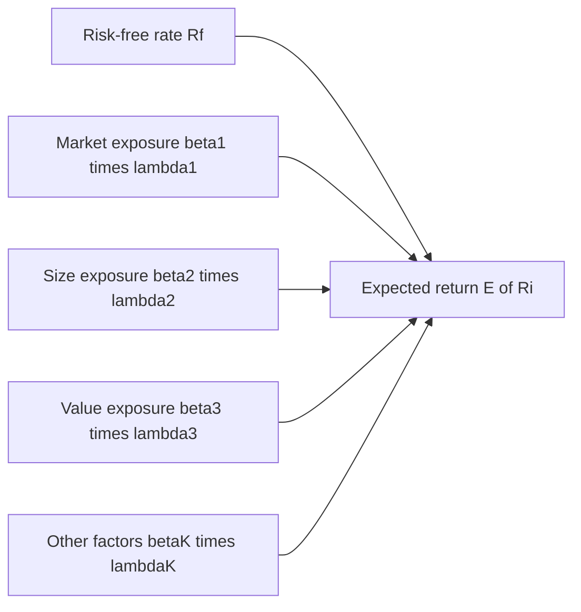
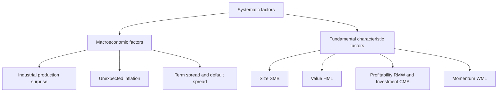
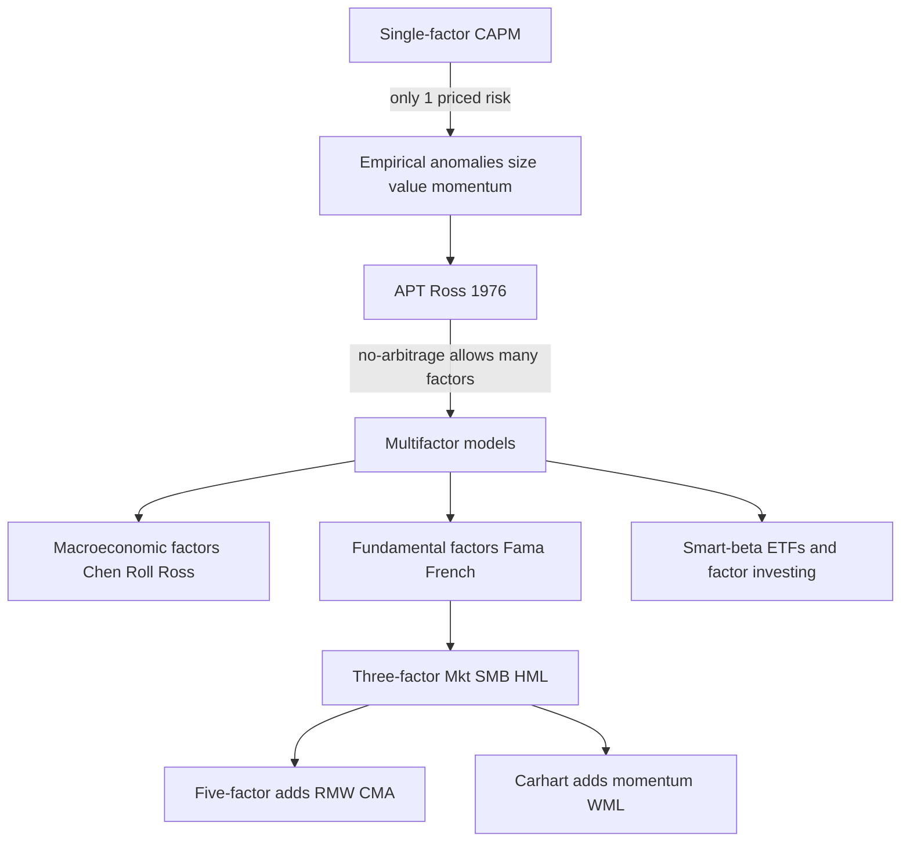

# Chapter 06 — APT and Multifactor Models

## 1. The Problem / The Need

The Capital Asset Pricing Model (CAPM) from the previous chapter gave us something beautiful: a single equation that says an asset's expected return depends on exactly one thing — its sensitivity to the market portfolio (beta). Clean, testable, Nobel-winning. But when researchers took CAPM to real data, it started leaking.

Three problems piled up:

1. **Empirically, beta alone doesn't explain returns.** When Eugene Fama and Kenneth French ran the numbers in 1992, they found that the relationship between beta and average return was almost *flat* over 1963–1990. Two stocks with very different betas earned roughly similar returns, while stocks that CAPM said should be identical earned very different returns. The single-factor story was incomplete.

2. **Persistent "anomalies" appeared.** Small-cap stocks systematically beat large-caps. Cheap "value" stocks (high book-to-market) systematically beat expensive "growth" stocks. High-momentum stocks kept winning. Low-volatility stocks earned more than their beta predicted. None of this should happen in a world where beta is the *only* priced risk.

3. **CAPM rests on heroic assumptions.** It needs a mean-variance-efficient *market portfolio* that includes every risky asset (equities, bonds, real estate, human capital) — something we can never actually observe or measure (Roll's Critique). It also assumes everyone holds the same portfolio, cares only about one period, and agrees on all inputs.

The practical need is sharp. If you are an equity research analyst or a portfolio manager at an AMC, you need a return-generating model that (a) actually fits the data, (b) tells you *which* risks you are being paid to bear, and (c) lets you decompose a fund's performance into "did the manager pick good stocks, or did they just tilt toward small/value factors that anyone could have bought cheaply?" CAPM cannot do this. **Arbitrage Pricing Theory (APT)** and the **multifactor models** it inspired can.

> The core question this chapter answers: *if a single market factor isn't enough, what set of systematic risk factors actually drives expected returns — and how do we price them?*

---

## 2. The Core Idea

There are two intellectual roots here, and it helps to keep them separate.

**Arbitrage Pricing Theory (APT)**, developed by Stephen Ross in 1976, is a *theory of how assets must be priced* if no arbitrage is possible. It says: an asset's return is driven by a handful of common **systematic factors** plus firm-specific noise. If you build a portfolio that has *zero* exposure to every factor and costs nothing to assemble, it must earn zero return — otherwise you'd have a money machine. That single no-arbitrage condition forces expected returns into a linear relationship with factor exposures. APT does *not* tell you what the factors are; it tells you the *structure* the pricing must take.

**Multifactor models** are the empirical descendants. They say: "Fine, if returns load on several factors, let's go find them." Researchers identified specific, measurable factors — market, size, value, profitability, investment, momentum, and macroeconomic variables like inflation and interest-rate shocks — and built models such as the **Fama-French three-factor** and **five-factor** models.

The unifying idea:

$$E(R_i) = R_f + \beta_{i,1}\lambda_1 + \beta_{i,2}\lambda_2 + \cdots + \beta_{i,K}\lambda_K$$

An asset's expected excess return is the sum, across all K factors, of (**how exposed** the asset is to each factor, the beta) times (**how much reward** the market pays per unit of that exposure, the risk premium λ). CAPM is just this equation with K = 1. Multifactor models let K be 3, 5, or more — and crucially, they let the factors be things *other* than the market.

*Think of it as a nutrition label: CAPM listed one ingredient (market risk). APT/multifactor models reveal the full ingredient list — and tell you the price of each.*

*Expected return builds up as the risk-free rate plus each factor exposure multiplied by that factor's price of risk.*

---

## 3. Why / How It Works

### The no-arbitrage engine behind APT

Start with a **return-generating process**. Assume each stock's realized return is a linear function of common factors:

$$R_i = E(R_i) + \beta_{i,1}F_1 + \beta_{i,2}F_2 + \cdots + \beta_{i,K}F_K + \varepsilon_i$$

where the F's are unexpected *shocks* to the factors (surprise inflation, surprise GDP, etc., each with mean zero) and εᵢ is firm-specific noise (mean zero, uncorrelated across firms, uncorrelated with the factors).

Now the magic. Because εᵢ is *diversifiable*, a well-diversified portfolio of many stocks has essentially zero ε. Its return is driven *only* by factor exposures:

$$R_p \approx E(R_p) + \beta_{p,1}F_1 + \cdots + \beta_{p,K}F_K$$

Consider building an **arbitrage portfolio** that:
- costs nothing (long positions funded by short positions, net investment = 0),
- has *zero* exposure to every factor (all β_p = 0),
- and is well-diversified (ε ≈ 0).

Such a portfolio has *no risk of any kind* and *no capital at stake*. By the law of one price it must therefore earn *zero* return. If it earned a positive return, arbitrageurs would scale it up infinitely — free money. This one requirement, applied across all possible portfolios, mathematically forces expected returns to be a **linear combination of the factor betas**:

$$E(R_i) = R_f + \beta_{i,1}\lambda_1 + \cdots + \beta_{i,K}\lambda_K$$

That is the APT. Notice what it did *not* need: no market portfolio, no assumption that investors are mean-variance optimizers, no assumption of normally distributed returns, no requirement that everyone agrees. It only needs (i) a factor structure for returns and (ii) enough assets to diversify away idiosyncratic risk so that arbitrage is possible. This is why APT is considered more *robust* and *general* than CAPM — it is built on the weakest possible assumption (no free lunch) rather than the strongest (everyone holds the efficient market portfolio).

### Why multiple factors beat one

CAPM compresses all systematic risk into a single number. But real economic risk is multidimensional. An oil producer, a bank, and a software firm all have market exposure — yet the oil firm is uniquely exposed to energy-price shocks, the bank to interest-rate and credit-spread shocks, the software firm to nothing much beyond the market and growth sentiment. A one-factor model *cannot* distinguish these. It will misprice all three unless their betas happen to capture everything, which they don't.

Multifactor models add axes of risk. Each factor is a distinct source of *systematic, non-diversifiable* risk that commands its own premium because you cannot diversify it away — every asset that loads on it moves together. If value stocks all crash together in a recession, "value" is a systematic risk, and risk-averse investors demand extra return to hold it. That extra return is the value premium λ_HML.

*The improvement is both statistical (higher R², smaller pricing errors) and economic (you learn which risks you're actually being paid for).*

---

## 4. Full Content — Formulas, Models, Derivations

### 4.1 APT vs CAPM at a glance

| Dimension | CAPM | APT |
|---|---|---|
| Number of factors | Exactly 1 (the market) | K factors (unspecified by theory) |
| Key assumption | All investors hold the mean-variance-efficient market portfolio | No arbitrage; factor structure of returns |
| Requires market portfolio? | Yes (unobservable — Roll's Critique) | No |
| Investor behavior | Mean-variance optimizers, homogeneous expectations | Only needs a few arbitrageurs |
| Holds for | All assets exactly (in theory) | Well-diversified portfolios exactly; individual assets approximately |
| Tells you the factors? | Yes — the market | No — must be found empirically |
| Return equation | E(R) = R_f + β(E(R_m) − R_f) | E(R) = R_f + Σ βₖλₖ |

APT is more general: **CAPM is a special case of APT** where the single factor is the market and its risk premium is E(R_m) − R_f.

### 4.2 The general K-factor pricing equation

$$\boxed{E(R_i) = R_f + \sum_{k=1}^{K} \beta_{i,k}\,\lambda_k}$$

- **βᵢ,ₖ (factor loading / exposure):** sensitivity of asset i's return to a one-unit shock in factor k. Estimated by multivariate time-series regression of the asset's excess returns on the factor returns.
- **λₖ (factor risk premium):** the expected excess return earned per unit of exposure to factor k. It is the return on a portfolio with a beta of 1 to factor k and 0 to all others, in excess of R_f. Can be positive or negative.

Each λₖ is itself the expected return of a **factor-mimicking portfolio** (a portfolio constructed to track one factor with unit exposure and zero exposure to the rest), minus R_f.

### 4.3 Two families of factors

**(a) Macroeconomic factors** — factors are surprises in observable economic variables. The classic implementation is **Chen, Roll & Ross (1986)**, who found these priced factors:

| Macro factor | Economic meaning |
|---|---|
| Industrial production growth (surprise) | Real economic activity / business cycle |
| Unexpected inflation | Erosion of real cash flows and discount-rate shock |
| Change in expected inflation | Shifts in future inflation expectations |
| Term spread (long minus short govt yields) | Slope of yield curve; growth expectations |
| Default/credit spread (Baa minus Aaa) | Risk appetite and credit conditions |

Betas here are *macro sensitivities* — how much a stock moves when, say, inflation surprises to the upside.

**(b) Fundamental / characteristic factors** — factors are built from firm characteristics (size, value, profitability). The Fama-French models are the flagship. These factors are *long-short portfolios* sorted on characteristics, so the "factor return" is directly observable each month.

*In practice, fundamental factor models (Fama-French, BARRA, Axioma) dominate industry use because the factors are cleaner and more stable to estimate than noisy macro surprises.*

*The two families of priced factors: macroeconomic surprises versus firm-characteristic long-short portfolios.*

### 4.4 The Fama-French Three-Factor Model (1993)

$$R_i - R_f = \alpha_i + \beta_i(R_m - R_f) + s_i \cdot SMB + h_i \cdot HML + \varepsilon_i$$

Three factors:

1. **Market (R_m − R_f):** same excess market return as CAPM.
2. **SMB — Small Minus Big (the size factor):** the return on a portfolio *long* small-cap stocks and *short* large-cap stocks. Captures the historical tendency of small firms to outperform. A positive sᵢ means the stock behaves like a small-cap.
3. **HML — High Minus Low (the value factor):** the return on a portfolio *long* high book-to-market (value) stocks and *short* low book-to-market (growth) stocks. A positive hᵢ means the stock behaves like a value stock.

Expected-return form:

$$E(R_i) - R_f = \beta_i\,\lambda_{Mkt} + s_i\,\lambda_{SMB} + h_i\,\lambda_{HML}$$

**How SMB and HML are built (the 2×3 sort).** Fama and French sort all stocks into 2 size buckets (Small, Big) and 3 book-to-market buckets (Low, Medium, High), forming 6 portfolios:

- **SMB** = average return of the 3 Small portfolios − average return of the 3 Big portfolios.
- **HML** = average return of the 2 High-B/M portfolios − average return of the 2 Low-B/M portfolios.

**Why these factors?** Empirically they mop up the CAPM anomalies. But there is also an economic story: small and value firms tend to be *distressed* or *riskier* — value firms often have depressed prices because of poor prospects, and their earnings are more sensitive to bad economic times — so their extra return is *compensation for risk* (the risk-based interpretation). The competing behavioral interpretation says investors *overreact*, over-pricing glamorous growth stocks and under-pricing dull value stocks, creating a mispricing premium. The debate is unsettled, but the factors work either way.

### 4.5 The Fama-French Five-Factor Model (2015)

Fama and French added two factors motivated by the **dividend discount model** — firms with higher profitability and more conservative investment should, all else equal, deliver higher expected returns:

$$R_i - R_f = \alpha_i + \beta_i(R_m - R_f) + s_i SMB + h_i HML + r_i \cdot RMW + c_i \cdot CMA + \varepsilon_i$$

Two new factors:

4. **RMW — Robust Minus Weak (profitability):** long high-profitability firms (robust operating profitability), short low-profitability (weak) firms.
5. **CMA — Conservative Minus Aggressive (investment):** long firms that invest conservatively (low asset growth), short firms that invest aggressively (high asset growth). Aggressive over-investors historically underperform.

| Factor | Long leg | Short leg | Captures |
|---|---|---|---|
| Mkt-RF | Market | Risk-free | Equity market risk |
| SMB | Small caps | Large caps | Size premium |
| HML | High B/M (value) | Low B/M (growth) | Value premium |
| RMW | Robust profitability | Weak profitability | Quality/profitability premium |
| CMA | Conservative investment | Aggressive investment | Investment/discipline premium |

**Notable wrinkle:** in the five-factor model, HML becomes partly *redundant* — RMW and CMA absorb much of the value premium, because profitability and investment discipline are correlated with value. Fama and French found that for US data, HML added little once RMW and CMA were included. This is an active, ongoing debate.

**A common sixth factor: Momentum (WML / UMD)** — "Winners Minus Losers" (or Up Minus Down), from Carhart (1997). Long the past 12-month winners, short the past losers. Momentum is *not* in the Fama-French models (they dislike it because it has no risk-based story and high turnover), but the **Carhart four-factor model** (Mkt, SMB, HML, WML) is the industry standard for evaluating mutual fund performance.

### 4.6 Alpha in a multifactor world

The intercept αᵢ from the regression is the model's verdict on skill/mispricing:

$$\alpha_i = (R_i - R_f) - \big[\beta_i(R_m - R_f) + s_i SMB + h_i HML + \dots\big]$$

If a fund earns high raw returns *purely* by tilting toward small and value stocks, a CAPM regression would show a big positive alpha (looks like skill), but a Fama-French regression would reveal α ≈ 0 — the returns were just **factor exposure ("smart beta"), not stock-picking skill**. This is the single most important practical use of multifactor models in asset management: **separating true alpha from cheap, replicable beta.**

---

## 5. Worked Examples

### Example 1 — Two-factor APT pricing

Suppose a two-factor APT holds. The factors are (F1) industrial-production surprise and (F2) inflation surprise. Given:

- Risk-free rate R_f = 5%
- Factor risk premiums: λ₁ = 6%, λ₂ = −2% (inflation surprise carries a *negative* premium — assets that pay off when inflation surprises up are valuable as hedges, so they earn *less*)
- Stock A's factor betas: β_{A,1} = 1.2, β_{A,2} = 0.5

**Expected return:**

$$E(R_A) = 5\% + (1.2)(6\%) + (0.5)(-2\%) = 5\% + 7.2\% - 1.0\% = 11.2\%$$

Now suppose Stock A is *actually* trading to give an expected return of 13%. APT says it is **underpriced** — it offers 13% but only 11.2% is warranted by its risk. The 1.8% gap is a positive alpha.

**Arbitrage:** build a portfolio with the *same* factor betas (β1 = 1.2, β2 = 0.5) out of the factor-mimicking portfolios and R_f — that "fair" portfolio yields 11.2%. Go **long Stock A** (13%) and **short the replicating portfolio** (11.2%). Net factor exposure = 0, net cost = 0, yet you earn 13% − 11.2% = **1.8% riskless**. Arbitrageurs pile in, bidding A's price up until its expected return falls to 11.2% and the alpha vanishes. *This is the enforcement mechanism that makes the APT equation hold.*

### Example 2 — Fama-French three-factor expected return, reconciled against CAPM

A small-cap value stock, "Stock V." Regression estimates:

- β (market) = 1.10, s (SMB) = 0.80, h (HML) = 0.60
- R_f = 4%; market risk premium λ_Mkt = 5.5%; λ_SMB = 2.5%; λ_HML = 3.5%

**Fama-French expected return:**

$$E(R_V) = 4\% + (1.10)(5.5\%) + (0.80)(2.5\%) + (0.60)(3.5\%)$$
$$= 4\% + 6.05\% + 2.0\% + 2.1\% = \mathbf{14.15\%}$$

**CAPM expected return (same market beta):**

$$E(R_V)_{CAPM} = 4\% + (1.10)(5.5\%) = 4\% + 6.05\% = 10.05\%$$

**Reconciliation / interpretation.** CAPM says this stock "should" earn 10.05%. Fama-French says 14.15%. The **4.10% difference** is precisely the reward for the stock's small-cap tilt (2.0%) and value tilt (2.1%) — risks CAPM is blind to. Now suppose the stock *actually* delivered 14.15% on average. Under CAPM you'd record a **+4.10% alpha** and congratulate the manager for genius stock-picking. Under Fama-French, alpha = 14.15% − 14.15% = **0%** — the manager simply harvested well-known size and value premia. The two models reconcile: the "alpha" under CAPM is exactly the "factor return" under Fama-French. *That is the whole point of the exercise.*

### Example 3 — Attributing fund performance (four-factor Carhart)

A hedge fund returns 18% over a year; R_f = 4%, so excess return = 14%. A Carhart regression gives:

| Factor | Loading | Factor premium (realized) | Contribution |
|---|---|---|---|
| Market | 1.00 | 8% | 8.0% |
| SMB | 0.50 | 3% | 1.5% |
| HML | 0.40 | 2% | 0.8% |
| WML (momentum) | 0.60 | 4% | 2.4% |
| **Sum of factor contributions** | | | **12.7%** |

**Alpha** = 14% (excess return) − 12.7% (explained by factors) = **1.3%**.

**Reading it:** of the 14% excess return, 12.7% came from bearing systematic factor risks the investor could have bought cheaply through index products (a levered market position plus small, value, and momentum tilts). Only **1.3% is genuine alpha** — the manager's skill beyond factor exposure. If the fund charges "2 and 20" fees justified by "alpha," an allocator now knows most of the return was replicable beta. *This decomposition is exactly what an AMC's product/manager-selection team runs before allocating capital.*

---

## 6. Connections

- **To CAPM (Ch. 05):** APT *nests* CAPM. Set K = 1 with the market as the only factor and you recover the SML. Multifactor models generalize the Security Market Line from a line into a **hyperplane** in factor-exposure space.
- **To portfolio theory (Ch. 04):** Factors are the axes of *systematic* risk that survive diversification. Idiosyncratic ε washes out in a diversified portfolio — the same diversification logic that underpins Markowitz — which is precisely why only factor risk gets *priced*.
- **To performance evaluation:** Multifactor alpha is the modern successor to Jensen's alpha. Fund ratings, manager due diligence, and "closet indexing" detection all run on factor regressions.
- **To smart beta / factor investing:** The entire ETF factor-investing industry (value, momentum, quality, low-vol, size ETFs) is applied multifactor theory — packaging factor premia as cheap, rules-based products. What was once "alpha" became "smart beta."
- **To cost of capital (corporate finance):** Firms can use a Fama-French model instead of CAPM to estimate the discount rate for valuation, especially for small or value-oriented firms where CAPM systematically understates the required return.
- **To fixed income:** Bond returns decompose into *level, slope, and curvature* factors — a multifactor model for the yield curve, same spirit as APT.

*From the cracks in CAPM to the modern factor-investing industry.*

---

## 7. Key Terms

- **Arbitrage Pricing Theory (APT):** Ross's no-arbitrage model deriving a linear multifactor relationship between expected return and factor exposures.
- **Factor:** a common source of systematic (non-diversifiable) risk that moves many assets together and commands a risk premium.
- **Factor loading / beta (βᵢ,ₖ):** sensitivity of an asset's return to a one-unit move in factor k.
- **Factor risk premium (λₖ):** expected excess return per unit of exposure to factor k; the return of that factor's mimicking portfolio over R_f.
- **Factor-mimicking portfolio:** a portfolio built to have unit exposure to one factor and zero to all others; its excess return *is* the factor premium.
- **Return-generating process:** the assumed linear equation R_i = E(R_i) + ΣβₖFₖ + εᵢ describing how returns are produced.
- **Idiosyncratic (residual) risk (εᵢ):** firm-specific, diversifiable, unpriced risk.
- **SMB (Small Minus Big):** size factor; long small-cap, short large-cap.
- **HML (High Minus Low):** value factor; long high book-to-market, short low.
- **RMW (Robust Minus Weak):** profitability factor.
- **CMA (Conservative Minus Aggressive):** investment factor.
- **WML / UMD (momentum):** Winners Minus Losers; Carhart's fourth factor.
- **Alpha (α):** return unexplained by the factor model; the measure of skill or mispricing.
- **Smart beta:** rules-based products that deliver factor premia cheaply — factor exposure repackaged from "alpha."

---

## 8. Common Confusions

- **"APT tells you the factors."** No. APT is silent on *what* the factors are — it only says pricing *must* be linear in *some* set of factors. Identifying them is an empirical exercise, which is where Fama-French, Chen-Roll-Ross, and BARRA come in. This is APT's great strength (generality) and great weakness (untestable without specifying factors).
- **Confusing factor *loading* (β) with factor *premium* (λ).** β is a property of the *asset* (how much it moves with the factor). λ is a property of the *market* (how much reward the factor earns). Expected return needs *both*, multiplied.
- **Thinking more factors always means a better model.** Adding factors mechanically raises R², but risks *data mining* — the "factor zoo" of 300+ published factors, most of which fail out-of-sample. A factor should have (i) an economic rationale, (ii) robustness across time/markets, and (iii) low correlation with existing factors.
- **Assuming a positive Fama-French alpha = skill, always.** Only if the model is *correctly specified*. If a genuine priced factor is missing, its premium leaks into alpha and masquerades as skill. Alpha is always *relative to the chosen model*.
- **Believing APT requires a market portfolio.** It doesn't — that's CAPM's problem (Roll's Critique). APT sidesteps the unobservable market portfolio entirely, needing only enough assets to diversify.
- **Thinking SMB/HML premia are guaranteed.** They are *risk premia* — long-run averages that can vanish or go negative for a decade (value famously underperformed 2007–2020). Factor investing carries factor risk; that's *why* it pays.
- **Sign of λ must be positive.** Not necessarily. A factor that pays off in bad states (a hedge, like the inflation-surprise factor in Example 1) can carry a *negative* premium — investors accept lower returns for insurance.

---

## 9. First-Principles Recap

1. **Diversifiable risk isn't rewarded.** Only risk you *cannot* escape by diversifying — systematic, common-factor risk — earns a premium. This is the bedrock, shared with CAPM.
2. **There is more than one systematic risk.** The economy has many independent shocks (growth, inflation, credit, size, value, profitability). Compressing them into one "market" number loses information and misprices assets.
3. **No arbitrage forces linear pricing.** If returns are generated by K factors, then the impossibility of a free lunch *mathematically requires* expected returns to be a linear function of factor exposures: E(R) = R_f + Σβₖλₖ. No behavioral assumptions needed.
4. **Expected return = exposure × price of risk, summed.** For each factor, multiply how exposed you are (β) by how much that risk pays (λ), and add them up, on top of the risk-free rate.
5. **Whatever the model can't explain is alpha.** Alpha is the residual — skill or mispricing — *relative to the factors you chose to include*. Choose better factors, and yesterday's alpha becomes today's beta.

From these five ideas, everything in the chapter follows — APT, Chen-Roll-Ross, Fama-French three and five factors, Carhart, and the entire smart-beta industry are just different answers to the question *"which factors, and what do they pay?"*

---

## 10. Quick Reference / Interview Points

### Formula sheet

| Concept | Formula |
|---|---|
| General APT / multifactor | E(Rᵢ) = R_f + Σₖ βᵢ,ₖ λₖ |
| Return-generating process | Rᵢ = E(Rᵢ) + Σₖ βᵢ,ₖ Fₖ + εᵢ |
| CAPM (special case, K=1) | E(Rᵢ) = R_f + βᵢ(E(R_m) − R_f) |
| Fama-French 3-factor | Rᵢ − R_f = α + β(R_m−R_f) + s·SMB + h·HML + ε |
| Fama-French 5-factor | + r·RMW + c·CMA |
| Carhart 4-factor | 3-factor + w·WML (momentum) |
| Alpha | α = (Rᵢ − R_f) − Σₖ βᵢ,ₖ λₖ |

### The five (six) canonical factors

SMB (size), HML (value), RMW (profitability), CMA (investment), WML (momentum), plus the Market. Know how each long-short portfolio is constructed.

### What interviewers actually ask

- **"How does APT differ from CAPM?"** — APT allows multiple factors and rests on no-arbitrage, not on everyone holding the market portfolio; it doesn't require the unobservable market portfolio (dodges Roll's Critique); CAPM is a one-factor special case of APT. Trade-off: APT doesn't tell you the factors.
- **"What are the Fama-French factors and why do they exist?"** — Market, SMB, HML (+RMW, CMA in the 5-factor). They exist because size and value (and profitability/investment) tilts explained returns that CAPM couldn't; interpretations split between risk-based (compensation) and behavioral (mispricing).
- **"A fund returned 20% — is the manager skilled?"** — Run a multifactor regression. Decompose into factor contributions vs. alpha. If the 20% is just leveraged market + small + value + momentum exposure, there's no skill — it's replicable smart beta. Only the alpha reflects skill.
- **"Why is HML sometimes redundant in the 5-factor model?"** — Because RMW and CMA (profitability and investment) are correlated with the value characteristic and absorb much of the value premium in US data.
- **"Can a factor premium be negative?"** — Yes, for hedging factors (e.g., inflation-surprise): assets that pay off in bad states are valuable and thus earn *lower* expected returns.
- **"What's the danger of multifactor models?"** — Data mining / the factor zoo; overfitting; factors that vanish out-of-sample; alpha is only meaningful relative to the model, so an omitted true factor masquerades as skill.
- **"Macro vs. fundamental factors?"** — Macro (Chen-Roll-Ross): surprises in inflation, IP growth, term/default spreads; economically interpretable but noisy to estimate. Fundamental (Fama-French, BARRA): characteristic-sorted long-short portfolios; observable, stable, and dominant in industry practice.

### The one-liner to remember

> *CAPM says "how much market risk?"; APT and multifactor models say "how much of each kind of risk — and what does each one pay?" Expected return is just your exposures dotted with the prices of risk.*
