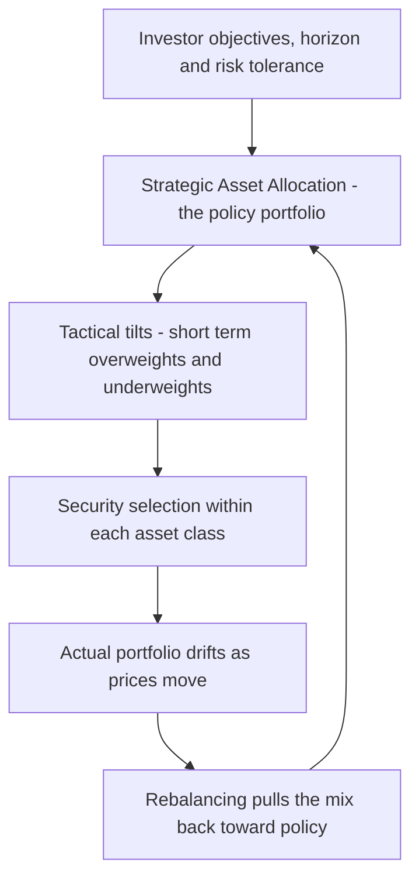
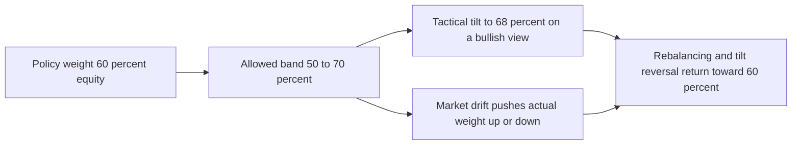
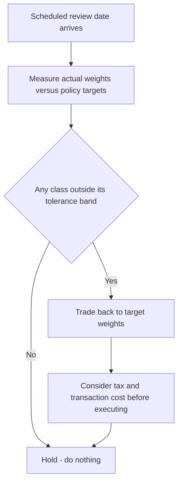

# Chapter 07 — Asset Allocation

## 1. The Problem / The Need

Imagine two investors, each with ₹1 crore to invest for the next twenty years. The first spends her weekends poring over quarterly results, switching between HDFC Bank and ICICI Bank, timing her entry into IT stocks before earnings. The second makes exactly one decision — "60% of my money in equities, 30% in bonds, 10% in gold" — writes it on a card, and rebalances once a year without ever picking a single stock.

The uncomfortable truth of professional portfolio management is that the second investor has made the *more consequential* decision. The single choice of **how much to put in equities versus bonds versus cash versus alternatives** — the **asset allocation** — swamps almost everything else the first investor obsesses over.

This is not intuition; it is one of the most replicated findings in finance. When your job is to build portfolios for a mutual fund, a pension, an endowment, or a wealthy family, the first question is never "which stock?" It is "what is the right *mix*?" A portfolio that is 100% equity and one that is 100% government bonds can hold identically excellent securities and still deliver wildly different outcomes — one might fall 40% in a crash, the other 4%. The mix, not the contents, determines the ride.

Asset allocation exists because:

1. **Risk and return are inseparable, and the asset-class choice sets both.** You cannot earn equity-like returns from a cash portfolio, and you cannot survive a bear market with an all-equity portfolio if you need the money next year.
2. **Diversification across asset classes is the only genuinely "free lunch."** Combining assets that don't move in lockstep reduces risk without proportionally reducing return.
3. **Investors differ.** A 28-year-old accumulating for retirement and a 68-year-old drawing income from the same corpus need fundamentally different mixes. Allocation is the lever that maps a portfolio to a *person*.
4. **Behaviour needs a rulebook.** A pre-committed policy mix is the discipline that stops investors from selling equities at the bottom and buying at the top.

This chapter builds the full machinery: why allocation dominates returns, the distinction between strategic and tactical allocation, the "policy portfolio," how to allocate across the four building blocks (equities, bonds, cash, alternatives), how and when to rebalance, and how horizon and risk tolerance drive the whole exercise.

---

## 2. The Core Idea

**Asset allocation is the deliberate division of a portfolio among broad asset classes — equities, fixed income, cash, and alternatives — chosen to match an investor's return objective, risk tolerance, and time horizon.**

Three layered ideas sit underneath:

- **The policy portfolio (strategic asset allocation, SAA)** is the long-run "home base" mix. It is set from the investor's objectives and capital-market expectations, and it is where the portfolio lives most of the time. Think of it as the *default* the portfolio always drifts back toward.
- **Tactical asset allocation (TAA)** is the set of short-to-medium-term *tilts* away from the policy mix to exploit temporary opportunities — going overweight equities when they look cheap, underweight when they look stretched. It is active bets around the anchor.
- **Rebalancing** is the maintenance mechanic: because asset prices drift, the actual mix wanders away from the target. Rebalancing periodically sells what has grown and buys what has shrunk, restoring the intended risk profile — and, as a side effect, mechanically enforcing "buy low, sell high."

The mental model to hold:

> **Policy portfolio = the anchor. Tactical tilts = deliberate, temporary drift you *choose*. Rebalancing = correcting the *unintended* drift the market imposes on you.**

Everything else — security selection, market timing — operates *inside* the box that allocation draws.

*Figure 1 — The three-layer structure of the allocation decision, from long-run anchor to day-to-day maintenance.*

---

## 3. Why / How It Works

### 3.1 Why allocation dominates returns

The famous claim — often mangled in interviews — traces to **Brinson, Hood and Beebower (1986)** and its 1991 follow-up, studying large US pension plans. Their headline finding: **investment-policy allocation explained about 93.6% of the *variability* (variance) of a typical plan's quarterly returns over time.** Security selection and market timing accounted for the rest.

The single most important interview nuance is **what "93%" actually measures**:

- Brinson measured the **variability of returns *through time* for a single fund** — i.e., how much of a fund's ups and downs are explained by its policy mix. Answer: almost all of it. This makes sense: if you are 60% equity, your quarter-to-quarter swings are overwhelmingly driven by what equities did.
- **Ibbotson and Kaplan (2000)** decomposed the question into three distinct sub-questions and got three different answers:
  1. *How much of the variability of a single fund's returns over time is explained by policy?* ≈ **90%** (confirms Brinson).
  2. *How much of the variation in returns **across different funds** is explained by their differing policies?* ≈ **40%**. The rest is explained by *how* each manager implemented — selection, timing, fees, costs.
  3. *What fraction of the return **level** does policy explain?* ≈ **100%** on average — because active management is roughly a zero-sum game before costs and negative after, so the average fund's return level is essentially its policy return minus costs.

The disciplined statement for an interview:

> "Asset allocation explains the vast majority — around 90% — of the *variability of a portfolio's returns over time*, and roughly all of the *average level* of returns. It explains a smaller share — about 40% — of the *differences between funds*, where selection, timing, and cost do the work. So allocation is the dominant driver of the risk you take and the return you can expect, but it is *not* the whole story of why one manager beats another."

**Why is this mechanically true?** Because asset classes have very different long-run risk-return signatures, and the *weights* you assign linearly determine the portfolio's expected return and, together with correlations, its variance:

$$E(R_p) = \sum_{i=1}^{n} w_i \, E(R_i)$$

$$\sigma_p^2 = \sum_{i=1}^{n}\sum_{j=1}^{n} w_i \, w_j \, \sigma_i \, \sigma_j \, \rho_{ij}$$

The expected-return equation shows the level is *purely* a weighting of asset-class returns. The variance equation shows risk depends on weights **and** correlations $\rho_{ij}$ — which is where diversification enters.

### 3.2 Why diversification across classes is the "free lunch"

When two assets are imperfectly correlated ($\rho < 1$), the portfolio's risk is *less* than the weighted average of the individual risks. For two assets:

$$\sigma_p = \sqrt{w_1^2 \sigma_1^2 + w_2^2 \sigma_2^2 + 2 w_1 w_2 \sigma_1 \sigma_2 \rho_{12}}$$

If $\rho_{12} = 1$, risk is just the weighted average — no benefit. As $\rho$ falls, the cross term shrinks, and total risk drops below the weighted average *while expected return stays the weighted average*. You keep the average return but shed some risk. That asymmetry is the entire economic case for holding multiple asset classes rather than concentrating in the highest-return one.

This is why equities + bonds + gold beats equities alone on a *risk-adjusted* basis even though equities have the highest standalone return: bonds and gold often zig when equities zag.

### 3.3 Why a written policy beats improvisation

Markets punish emotion. The average investor's *realised* return lags the funds they invest in — the "behaviour gap" — because they buy after rallies and sell after crashes. A pre-committed policy portfolio plus a mechanical rebalancing rule removes discretion at exactly the moments discretion destroys value. The policy is a **commitment device**.

---

## 4. Full Content — Formulas, Models and Frameworks

### 4.1 The two (really three) types of allocation

| Dimension | Strategic (SAA) | Tactical (TAA) | Dynamic / Insured (e.g. CPPI) |
|---|---|---|---|
| Horizon | Long run (5-10+ yrs) | Short-medium (weeks-months) | Ongoing, rules-based |
| Basis | Long-run capital-market assumptions + investor objectives | Short-term views on relative value / momentum | Formula tied to a floor / cushion |
| Question answered | "What mix should I hold *on average*?" | "Where should I *tilt* right now?" | "How do I protect a floor while participating?" |
| Turnover | Very low | Moderate-high | Can be high (buys strength, sells weakness) |
| Risk profile | Fixed target risk | Varies around target | Risk rises with wealth above floor |
| Nickname | The policy portfolio | Active over/underweights | Constant Proportion Portfolio Insurance |

**Strategic Asset Allocation (SAA)** sets the long-term target weights and permissible ranges. Example policy statement: *"Equity 60% (range 50-70%), Fixed income 30% (20-40%), Alternatives 7%, Cash 3%."* The ranges are the *tactical latitude* — TAA operates only within them.

**Tactical Asset Allocation (TAA)** deviates from policy to add value, then reverts. If the policy equity weight is 60% and a manager believes equities are cheap, she might go to 68% (still inside the 50-70% band). TAA is a *mean-reverting* bet: it assumes the tilt will pay off and then the position closes back to policy.

**Dynamic strategies** change weights according to a formula tied to market moves rather than to forecasts. The classic is **CPPI (Constant Proportion Portfolio Insurance)**:

$$\text{Equity exposure} = m \times (\text{Portfolio value} - \text{Floor})$$

where $m$ is the multiplier and (Portfolio − Floor) is the "cushion." As the portfolio rises, exposure rises; as it falls toward the floor, exposure is cut toward zero. It is the mirror image of rebalancing (it *buys winners, sells losers*) and is used when protecting a minimum value matters more than mean reversion.

*Figure 2 — How SAA, TAA and rebalancing relate: TAA and drift both move the actual mix, but only within the strategic bands.*

### 4.2 Setting the strategic mix — the objective function

The formal engine behind SAA is **mean-variance optimisation (Markowitz)**: choose weights $w_i$ to maximise a risk-adjusted objective (utility):

$$U = E(R_p) - \tfrac{1}{2}\,\lambda\,\sigma_p^2$$

where $\lambda$ is the investor's risk-aversion coefficient. A high-$\lambda$ (risk-averse) investor's optimum sits at lower $\sigma_p$ — hence more bonds and cash; a low-$\lambda$ investor accepts more equity. The optimiser traces the **efficient frontier**; the chosen SAA is the frontier point matching the investor's $\lambda$, subject to constraints (no shorting, liquidity needs, etc.).

In practice, pure optimisers are notoriously sensitive to input errors (tiny changes in expected returns produce wildly different weights), so professionals temper them with: constraints and ranges, **Black-Litterman** blending of market-equilibrium weights with the manager's views, resampling, or simple **heuristic rules** (see 4.6).

### 4.3 The four building blocks

| Asset class | Role in portfolio | Typical long-run real return | Risk (volatility) | Behaves well when... |
|---|---|---|---|---|
| **Equities** | Growth engine; long-run compounding | High (~6-8% real) | High (15-20% p.a.) | Economy expands, earnings grow |
| **Fixed income (bonds)** | Income + ballast; diversifier | Low-moderate (~1-3% real) | Low-moderate (4-8%) | Growth slows, rates fall, deflation fear |
| **Cash / money market** | Liquidity, capital preservation, dry powder | ≈0 real | Very low | Everything else falls; crises |
| **Alternatives** (real estate, gold, commodities, PE, hedge funds, infra) | Diversification, inflation hedge, illiquidity premium | Varies | Varies | Inflation, regime shifts, low equity-bond correlation |

The art of allocation is combining these so their *correlations* work for you. Historically equities and high-quality government bonds have often been **negatively or weakly correlated** — bonds rally in the "flight to safety" when equities crash — which is why the 60/40 portfolio became the industry default. Gold is a classic crisis and inflation hedge with near-zero long-run correlation to equities. (Caveat: correlations are *not* stable — in 2022, rising inflation drove *both* equities and bonds down together, breaking the 60/40 diversification for a year. Alternatives earned their keep that year.)

### 4.4 The policy portfolio in practice

A **policy portfolio** is documented in the **Investment Policy Statement (IPS)** and specifies:

- Target weights for each asset class and permissible ranges.
- The **benchmark** for each class (e.g., Nifty 50 TRI for Indian large-cap equity, CRISIL Composite Bond Index for fixed income).
- Rebalancing rules and tolerances.
- Constraints: liquidity, time horizon, tax, legal/regulatory, unique circumstances (the "RRTTLLU" framework — Return, Risk, Time, Taxes, Liquidity, Legal, Unique).

The **policy-portfolio return is the benchmark against which the *whole* active process is judged**. Total portfolio return decomposes as:

$$R_{portfolio} = R_{policy} + R_{TAA} + R_{selection} + R_{interaction}$$

The first term is the passive result of just holding the policy mix. The remaining terms are what active management (allocation tilts + stock picking) *added or subtracted* — the subject of **performance attribution** (Chapter on attribution). This is exactly why the policy portfolio matters so much: it is both the strategy *and* the yardstick.

### 4.5 Rebalancing — the maintenance engine

Left alone, a 60/40 portfolio in which equities outperform becomes 70/30, then 75/25 — silently taking *more* risk than intended precisely when equities are most expensive. Rebalancing restores the target. Two dominant disciplines:

**(a) Calendar rebalancing** — rebalance on a fixed schedule (monthly, quarterly, annually) regardless of drift.
- *Pros:* simple, predictable, low monitoring cost.
- *Cons:* may trade when unnecessary (small drift) or fail to react between dates to a large move.

**(b) Threshold (percentage-of-portfolio) rebalancing** — rebalance whenever any asset class drifts beyond a tolerance band (e.g., ±5 percentage points, or ±25% of the target weight).
- *Pros:* responds to actual risk; only trades when it matters; captures more of the "buy low/sell high" premium.
- *Cons:* requires continuous monitoring; can trigger many trades in volatile markets.

**(c) Hybrid (calendar-and-threshold)** — check on a schedule (say quarterly) but only trade if drift exceeds the band. This is the professional default: it caps monitoring cost while avoiding needless small trades.

Key design trade-offs:

| Factor | Push toward *tighter* bands / *more frequent* | Push toward *wider* bands / *less frequent* |
|---|---|---|
| Transaction costs | Low costs → rebalance more | High costs → tolerate drift |
| Taxes | Tax-sheltered account → rebalance freely | Taxable account → wider bands, defer gains |
| Volatility of asset | High vol → tighter to control risk | — |
| Correlation with rest | Low correlation → wider bands acceptable | — |
| Risk tolerance | Low tolerance → tighter bands | High tolerance → wider |

**The rebalancing bonus (why it can add return, not just control risk):** because asset returns are somewhat mean-reverting and volatile, systematically selling the asset that rose and buying the one that fell harvests a small "**volatility / diversification return**." It is not guaranteed — in a strong sustained trend, rebalancing *drags* (you keep selling the winner too early). Its dependable benefit is **risk control**; the return bonus is a bonus.

*Figure 3 — Decision flow for a hybrid rebalancing policy.*

### 4.6 Horizon and risk tolerance — the two master inputs

Everything in SAA ultimately flows from two investor characteristics:

**(1) Investment horizon.** Longer horizons justify more equity because:
- **Time diversification of shortfall risk (in a horizon sense):** while annual equity volatility does *not* shrink, a long horizon lets an investor *ride out* drawdowns without being forced to sell at the bottom, and lets compounding dominate. (Careful nuance for interviews: the *dispersion of terminal wealth* actually *widens* with horizon in absolute terms — equities are not "safe if held long enough" in a strict variance sense. What a long horizon buys you is the *ability to wait*, i.e., low liquidity risk, not the elimination of risk.)
- Human capital: a young worker's future earnings are a large, bond-like asset, so she can hold more equities in her financial portfolio to balance the total.

**(2) Risk tolerance**, which has two components:
- **Ability to take risk** (objective): horizon, wealth relative to needs, income stability, liquidity needs. A person with 30 years and stable income has high *ability*.
- **Willingness to take risk** (psychological): how much volatility the investor can stomach without panic-selling.
- **Rule:** when ability and willingness conflict, the prudent adviser anchors to the *lower* of the two (or educates the client), because a mathematically optimal portfolio the client abandons at the bottom is worthless.

A common heuristic (crude but interview-worthy) is the **"110 minus age"** rule: equity weight ≈ 110 − age. A 30-year-old → 80% equity; a 65-year-old → 45%. It encodes both horizon shortening and rising risk-aversion with age, and underpins **target-date / lifecycle funds**, whose equity "glide path" declines automatically as the target retirement year approaches.

*Figure 4 — The glide path: equity share falls as horizon shortens toward retirement.*

---

## 5. Worked Examples

### Example 1 — Expected return and risk of a strategic mix (and the diversification effect)

An AMC proposes a policy portfolio of **60% equity, 30% bonds, 10% gold**. Capital-market assumptions:

| Class | Expected return | Volatility (σ) |
|---|---|---|
| Equity | 12% | 18% |
| Bonds | 7% | 6% |
| Gold | 8% | 15% |

Correlations: Equity-Bonds = **−0.20**, Equity-Gold = **0.10**, Bonds-Gold = **0.30**.

**Step 1 — Portfolio expected return.**

$$E(R_p) = 0.60(12\%) + 0.30(7\%) + 0.10(8\%)$$
$$= 7.20\% + 2.10\% + 0.80\% = \mathbf{10.10\%}$$

**Step 2 — Portfolio variance.** Weights $w_E=0.6, w_B=0.3, w_G=0.1$. Use $\sigma_p^2=\sum\sum w_iw_j\sigma_i\sigma_j\rho_{ij}$ (in decimals: σ_E=0.18, σ_B=0.06, σ_G=0.15).

Own-variance terms:
- Equity: $0.6^2\times0.18^2 = 0.36\times0.0324 = 0.011664$
- Bonds: $0.3^2\times0.06^2 = 0.09\times0.0036 = 0.000324$
- Gold: $0.1^2\times0.15^2 = 0.01\times0.0225 = 0.000225$

Cross terms (each counted twice → use $2w_iw_j\sigma_i\sigma_j\rho$):
- Equity-Bonds: $2(0.6)(0.3)(0.18)(0.06)(-0.20) = 2(0.18)(0.0108)(-0.20)$. Compute $0.18\times0.0108=0.001944$; ×(−0.20)=−0.0003888; ×2 = **−0.0007776**
- Equity-Gold: $2(0.6)(0.1)(0.18)(0.15)(0.10) = 2(0.06)(0.027)(0.10)$. $0.06\times0.027=0.00162$; ×0.10=0.000162; ×2 = **0.000324**
- Bonds-Gold: $2(0.3)(0.1)(0.06)(0.15)(0.30) = 2(0.03)(0.009)(0.30)$. $0.03\times0.009=0.00027$; ×0.30=0.000081; ×2 = **0.000162**

Sum:
$$\sigma_p^2 = 0.011664 + 0.000324 + 0.000225 - 0.0007776 + 0.000324 + 0.000162$$
$$= 0.0129214$$

$$\sigma_p = \sqrt{0.0129214} = 0.11367 \approx \mathbf{11.37\%}$$

**Step 3 — Verify the diversification benefit.** The *weighted-average* volatility (what you'd get with all ρ=1) is:
$$0.6(18\%)+0.3(6\%)+0.1(15\%) = 10.8\%+1.8\%+1.5\% = 14.1\%$$
Actual portfolio risk is **11.37% < 14.1%** — diversification shaved off ~2.7 percentage points of volatility *while keeping the 10.10% return*. **This is the free lunch, quantified.** (Sanity check: because the equity-bond correlation is negative, the biggest cross term is negative, pulling risk well below the weighted average — consistent with the result.)

### Example 2 — Rebalancing: calendar vs "do nothing," and the buy-low/sell-high mechanic

Start: ₹10,00,000 at target **60% equity / 40% bonds** → ₹6,00,000 equity, ₹4,00,000 bonds.

**Year 1:** equities **+25%**, bonds **+4%**.
- Equity → 6,00,000 × 1.25 = **₹7,50,000**
- Bonds → 4,00,000 × 1.04 = **₹4,16,000**
- Total = **₹11,66,000**. Actual weights: equity 7,50,000/11,66,000 = **64.3%**, bonds 35.7%.

Equity has drifted from 60% to 64.3% — the portfolio is now *riskier* than policy.

**Rebalance back to 60/40** (target equity = 0.60 × 11,66,000 = ₹6,99,600):
- Sell equity ₹7,50,000 − ₹6,99,600 = **₹50,400** (sell the winner).
- Buy bonds to reach 0.40 × 11,66,000 = ₹4,66,400, i.e. +₹50,400 (buy the laggard).

**Year 2 (a reversal):** equities **−15%**, bonds **+5%**. Compare two paths on the ₹11,66,000.

*Path A — Rebalanced (starts Yr2 at 6,99,600 / 4,66,400):*
- Equity → 6,99,600 × 0.85 = ₹5,94,660
- Bonds → 4,66,400 × 1.05 = ₹4,89,720
- **Total A = ₹10,84,380**

*Path B — Never rebalanced (starts Yr2 at 7,50,000 / 4,16,000):*
- Equity → 7,50,000 × 0.85 = ₹6,37,500
- Bonds → 4,16,000 × 1.05 = ₹4,36,800
- **Total B = ₹10,74,300**

**Result:** the rebalanced portfolio ends at **₹10,84,380** vs **₹10,74,300** unrebalanced — **₹10,080 richer**, because rebalancing trimmed the over-weighted equity *before* it fell. **Verification of the mechanic:** by selling ₹50,400 of equity at the top, Path A had less capital exposed to the −15% equity move; the difference in outcomes ≈ 50,400 × (return gap between bonds +5% and equity −15% = 20%) = 50,400 × 0.20 = **₹10,080** — matches exactly. This is the rebalancing bonus when markets mean-revert. (Had equities continued *up* in Year 2, Path B would have won — confirming rebalancing's benefit is risk-control and reversal-capture, not a free return.)

### Example 3 — Mapping risk tolerance to a mix via the utility function

Two clients, same expected-return/volatility menu as Example 1's *portfolios* along an efficient frontier. Suppose two candidate policy mixes:

| Mix | E(R) | σ |
|---|---|---|
| Aggressive (80/20) | 11.5% | 15.0% |
| Balanced (60/40) | 10.1% | 11.4% |

Use utility $U = E(R) - \tfrac{1}{2}\lambda\sigma^2$ (returns and σ in decimals).

**Client X — high risk aversion, λ = 4:**
- Aggressive: $0.115 - 0.5(4)(0.15^2) = 0.115 - 2(0.0225) = 0.115 - 0.045 = \mathbf{0.070}$
- Balanced: $0.101 - 0.5(4)(0.114^2) = 0.101 - 2(0.012996) = 0.101 - 0.025992 = \mathbf{0.0750}$
- **Balanced wins (0.0750 > 0.070).** The risk-averse client should hold 60/40.

**Client Y — low risk aversion, λ = 1.5:**
- Aggressive: $0.115 - 0.5(1.5)(0.0225) = 0.115 - 0.016875 = \mathbf{0.0981}$
- Balanced: $0.101 - 0.5(1.5)(0.012996) = 0.101 - 0.009747 = \mathbf{0.0913}$
- **Aggressive wins (0.0981 > 0.0913).** The risk-tolerant client should hold 80/20.

**Interpretation and verification:** the *same* two portfolios flip ranking purely because of λ. The break-even λ (where the two mixes tie) solves $0.115 - 0.5\lambda(0.0225) = 0.101 - 0.5\lambda(0.012996)$ → $0.014 = 0.5\lambda(0.0225 - 0.012996) = 0.5\lambda(0.009504)=0.004752\lambda$ → $\lambda = 2.95$. So investors with λ below ~2.95 prefer aggressive, above ~2.95 prefer balanced — and indeed λ=1.5 chose aggressive, λ=4 chose balanced, consistent. This is *exactly* how risk tolerance selects the strategic mix.

---

## 6. Connections

- **Modern Portfolio Theory & the efficient frontier (earlier chapters):** SAA *is* the act of choosing a point on the efficient frontier that matches the investor's risk aversion. Asset allocation is MPT applied at the asset-class level.
- **CAPM and the Capital Market Line:** the "two-fund separation" theorem (hold the market portfolio + risk-free asset, mixed by risk tolerance) is the theoretical purest form of asset allocation — the risk-free/risky split is literally a cash-vs-equity allocation.
- **Performance attribution:** the policy portfolio is the baseline; attribution decomposes active return into *allocation effect* (TAA) and *selection effect*. You cannot attribute performance without first defining the policy mix.
- **Risk-adjusted performance (Sharpe, Treynor, Jensen's alpha):** these evaluate whether tactical tilts and selection *added value per unit of risk* over just holding the policy mix. A manager who beats the policy return but with far more volatility may have a *worse* Sharpe.
- **Behavioural finance:** the policy portfolio + mechanical rebalancing is the institutional answer to loss aversion, recency bias, and the behaviour gap.
- **Fixed income & equity valuation chapters:** capital-market assumptions (expected returns per class) that feed the optimiser come from bond-yield math (yield ≈ expected return for bonds) and equity risk-premium models.
- **Liability-driven investing (pensions/insurers):** for these investors, allocation is set against *liabilities*, not an absolute benchmark — a specialised form of SAA.

---

## 7. Key Terms

| Term | Definition |
|---|---|
| **Asset allocation** | Division of a portfolio among broad asset classes to match objectives, horizon and risk tolerance. |
| **Strategic asset allocation (SAA)** | The long-run target mix; the policy portfolio. |
| **Tactical asset allocation (TAA)** | Short-term deliberate tilts away from the policy mix to exploit opportunities. |
| **Policy portfolio** | The documented long-run target weights, benchmarks and ranges; the yardstick for active performance. |
| **Investment Policy Statement (IPS)** | The governing document capturing objectives, constraints, the policy mix and rebalancing rules. |
| **Rebalancing** | Trading back to target weights after price drift. |
| **Calendar rebalancing** | Rebalancing on a fixed schedule. |
| **Threshold / tolerance-band rebalancing** | Rebalancing only when a class drifts beyond a set band. |
| **Rebalancing bonus** | The small return earned from systematically selling winners/buying losers when markets mean-revert. |
| **Glide path** | The pre-set schedule by which equity weight declines as a target date approaches. |
| **Target-date / lifecycle fund** | A fund that automatically follows a glide path. |
| **Efficient frontier** | Set of portfolios offering the highest return for each level of risk. |
| **Risk tolerance (ability vs willingness)** | Objective capacity vs psychological comfort for bearing risk. |
| **CPPI** | Constant Proportion Portfolio Insurance — dynamic strategy keeping exposure = m × cushion above a floor. |
| **Human capital** | Present value of future labour income; a bond-like asset justifying more financial-portfolio equity when young. |
| **RRTTLLU** | Return, Risk, Time horizon, Taxes, Liquidity, Legal, Unique — the IPS constraint checklist. |

---

## 8. Common Confusions

1. **"Asset allocation explains 90% of returns."** *Wrong wording.* It explains ~90% of the **variability of a single portfolio's returns over time**, and ~100% of the average **level**, but only ~40% of the **variation across funds**. Never conflate "variability over time" with "how one fund beats another."

2. **SAA vs TAA vs rebalancing.** SAA = the *target*. TAA = *deliberate* short-term deviation from it. Rebalancing = *correcting unintended* deviation caused by price drift. Rebalancing pushes *back toward* policy; TAA pushes *away* from it (on purpose).

3. **"Time diversification makes equities safe in the long run."** Loosely true in the sense that you can *wait out* drawdowns, but strictly false: the absolute dispersion of terminal wealth *grows* with horizon. Long horizon buys you the *ability to hold*, not the elimination of risk.

4. **Rebalancing always adds return.** No. Its reliable benefit is **risk control**. The return "bonus" appears only when markets mean-revert; in a sustained trend, rebalancing *drags* by selling winners too soon.

5. **More frequent rebalancing is better.** Not once you count **transaction costs and taxes**. In taxable accounts, tight bands can trigger avoidable capital-gains tax that dwarfs the risk-control benefit. Hybrid (check often, trade rarely) usually dominates.

6. **The 60/40 is dead / always diversified.** Correlations are regime-dependent. Equity-bond correlation is usually negative (great diversification) but turned *positive* in 2022's inflation shock, so both fell together. Allocation must be stress-tested, not assumed.

7. **Diversification reduces return.** It reduces *risk* for a given return; the portfolio's expected return is still the weighted average. You give up the *chance* of the single best asset's upside, not expected return per unit of risk.

8. **Ability and willingness to take risk are the same.** They diverge constantly. A wealthy retiree may have high ability but low willingness. Anchor to the more conservative and educate.

---

## 9. Recap

- **Asset allocation is the dominant decision** in portfolio management: it explains ~90% of the variability of a portfolio's returns over time and essentially all of the average return level. Security selection and timing matter for *beating peers*, but the mix sets the fundamental risk-return signature.
- **Diversification across imperfectly correlated classes is the only free lunch** — it cuts risk below the weighted average while preserving weighted-average return (Example 1: 11.4% risk vs 14.1% weighted average).
- **Strategic asset allocation (the policy portfolio)** is the long-run anchor, derived from objectives, horizon, risk tolerance and capital-market assumptions, documented in the IPS, and used as the benchmark for all active management.
- **Tactical asset allocation** is deliberate, temporary tilting around the policy mix within permitted bands; **rebalancing** corrects the unintended drift the market imposes, enforcing buy-low/sell-high and controlling risk (Example 2: +₹10,080 in a reversal).
- **Rebalancing choices** — calendar vs threshold vs hybrid — trade off risk control against transaction costs and taxes; the hybrid rule is the professional default.
- **Horizon and risk tolerance are the master inputs.** Longer horizon and higher risk tolerance → more equity; the utility function $U = E(R) - \tfrac12\lambda\sigma^2$ formally maps risk aversion to the chosen mix (Example 3), and the glide path automates this over a lifetime.

---

## 10. Quick-Reference / Interview Points

**One-liners to have loaded:**

- *"Asset allocation drives roughly 90% of the variability of a portfolio's returns over time and ~100% of the average return level; it's ~40% of the cross-fund variation — selection and cost do the rest (Brinson 1986; Ibbotson-Kaplan 2000)."*
- *"Policy portfolio = anchor and benchmark; TAA = deliberate tilt; rebalancing = correcting unintended drift."*
- *"Rebalancing's dependable payoff is risk control; the return bonus only shows up when markets mean-revert."*

**Core formulas:**

| Concept | Formula |
|---|---|
| Portfolio expected return | $E(R_p)=\sum w_i E(R_i)$ |
| Portfolio variance | $\sigma_p^2=\sum_i\sum_j w_iw_j\sigma_i\sigma_j\rho_{ij}$ |
| Two-asset risk | $\sigma_p=\sqrt{w_1^2\sigma_1^2+w_2^2\sigma_2^2+2w_1w_2\sigma_1\sigma_2\rho_{12}}$ |
| Utility (mix selection) | $U=E(R_p)-\tfrac12\lambda\sigma_p^2$ |
| Return decomposition | $R_{port}=R_{policy}+R_{TAA}+R_{selection}+R_{interaction}$ |
| CPPI exposure | $\text{Exposure}=m\times(\text{Value}-\text{Floor})$ |
| Equity heuristic | Equity % ≈ 110 − age |

**Rapid-fire Q&A:**

- *Q: SAA vs TAA?* A: SAA is the long-run policy mix from objectives; TAA is short-term tactical tilts within the policy's ranges to exploit relative value.
- *Q: Calendar vs threshold rebalancing — which is better?* A: Threshold responds to actual risk and captures more rebalancing premium but needs monitoring and can trade often; calendar is simple but blind to drift between dates. Hybrid (scheduled check, trade only if outside band) is best in practice, especially after tax.
- *Q: Why does a longer horizon justify more equity?* A: It lets you ride out drawdowns without forced selling and lets compounding dominate; young investors also have bond-like human capital to offset. Nuance: absolute terminal-wealth dispersion still grows — horizon buys the *ability to wait*, not risk elimination.
- *Q: Ability vs willingness to take risk?* A: Ability is objective (horizon, wealth, income stability); willingness is psychological. Anchor the mix to the lower of the two.
- *Q: Does diversification lower returns?* A: No — expected return is the weighted average; it lowers *risk* for that return, improving Sharpe.
- *Q: What is the policy portfolio's second job?* A: It's the benchmark for performance attribution — active return is measured against just holding the policy mix.
- *Q: When does rebalancing hurt?* A: In sustained trends — you sell the winner too early. And in taxable accounts, over-frequent rebalancing triggers tax drag.
