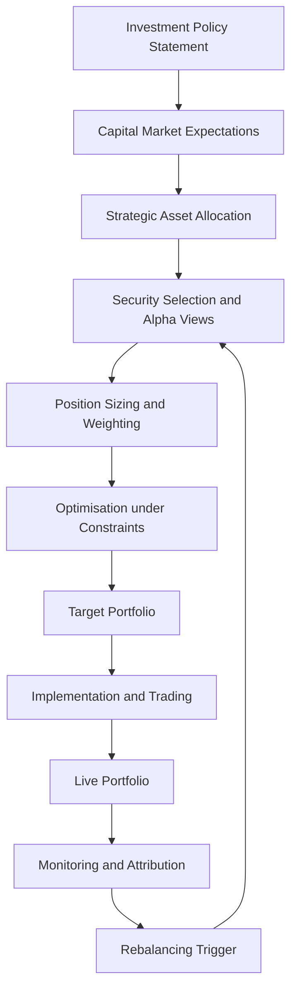
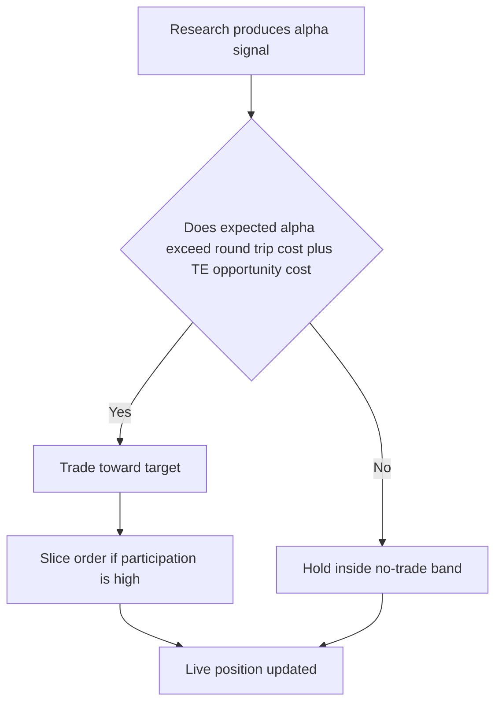

# Chapter 08 — The Portfolio Construction Process

## 1. The Problem / The Need

Modern portfolio theory (Chapters 5–7) gives you the *destination*: an efficient frontier, an optimal risky portfolio, a capital allocation line. But a frontier is a mathematical object. A client's money is real, arrives in a specific currency, must obey a tax regime, cannot short certain names, must stay above a liquidity floor, and has to be turned into actual buy and sell tickets sent to a broker before 3:30 p.m.

The **portfolio construction process** is the discipline that bridges that gap. It answers a deceptively simple chain of questions:

- *What* is this money for, and what constraints bind it? (the mandate)
- *Which* securities express our views? (selection)
- *How much* of each do we hold? (sizing and weighting)
- *How* do we get from today's holdings to the target without bleeding away returns in costs? (implementation)
- *When* and *how* do we course-correct as prices, views and cash flows change? (monitoring and rebalancing)

Get any link wrong and the theoretical alpha evaporates. A brilliant stock pick sized at 0.3% of the book barely moves the needle. A correct tilt implemented with 80 bps of market impact underperforms the index it was supposed to beat. A portfolio that drifts un-rebalanced for three years is no longer the portfolio the client signed up for. Construction is where "being right" is converted into "getting paid for being right" — or not.

The two dominant failure modes this process is designed to prevent:

1. **The un-investable ideal.** An optimiser output that violates the mandate — 40% in one illiquid small-cap, a short position the fund is not allowed to hold, a currency exposure the client explicitly excluded.
2. **The silent decay.** A perfectly good portfolio at inception that, through neglect of costs and drift, delivers a return far below its paper backtest. Studies of the "backtest-to-live" gap routinely find 1–3% per year lost to implementation and slippage.

> *Portfolio construction is the industrial process that turns a research view and a client mandate into a live, monitored, cost-aware book of positions.*

---

## 2. The Core Idea

Think of portfolio construction as a **pipeline with a feedback loop**. Money and constraints flow in at the top; a live portfolio flows out at the bottom; and information from the live portfolio flows *back up* to trigger the next cycle. It is never "done" — it is a cycle that repeats for the life of the mandate.

The spine of the pipeline is the **Investment Policy Statement (IPS)**. The IPS is the contract that encodes *return objective, risk tolerance, and the five constraints* (Liquidity, Time horizon, Taxes, Legal/regulatory, Unique circumstances — the mnemonic **RR-LTTLU**, or more commonly "return, risk, and LTTLU"). Every downstream decision must be traceable to the IPS. If a position cannot be justified against the IPS, it does not belong in the book.

*Figure 8.1 — The portfolio management cycle. The IPS sets the frame; the loop from monitoring back to selection is what makes it a process rather than a one-off construction.*

The core insight for an interview: **allocation decides most of your risk; selection and construction decide most of your alpha; implementation decides how much of that alpha survives.** These three layers are separable, and a good process treats them as distinct decisions with distinct owners.

---

## 3. Why / How It Works

Why does structuring the problem this way actually improve outcomes? Four reasons.

**(a) Separation of concerns controls error.** Asset allocation (how much equity vs. bonds) and security selection (which equities) have very different error characteristics. Allocation errors are systematic and large in magnitude but few in number; selection errors are numerous but individually small and partially diversifiable. Handling them in separate stages lets you apply the right risk budget to each. The classic (and often misquoted) Brinson-Hood-Beebower finding is that *policy* allocation explains the vast majority of the **variability of returns over time** across balanced funds — not that it explains the level of return or cross-sectional differences. The correct reading motivates spending real governance effort on the strategic allocation, then treating selection as an active-risk overlay on top.

**(b) Constraints are not annoyances — they are the definition of the feasible set.** An optimiser without constraints will happily concentrate, lever, and short its way to a paper Sharpe ratio that cannot be traded. Constraints (position caps, sector bounds, turnover limits, no-short rules) are what make the output *investable*. The art is imposing enough constraints to keep the portfolio sane without so many that you strangle the alpha.

**(c) Costs are deterministic drag; alpha is uncertain.** A basis point of transaction cost is *certain*; the alpha you trade to capture is *probabilistic*. Rational construction therefore treats trading as an economic decision — you only trade when expected alpha exceeds the round-trip cost plus the opportunity cost of the tracking error you were carrying. This is why "no-trade bands" and cost-aware rebalancing exist.

**(d) The feedback loop compounds learning.** Attribution (Chapter on performance measurement) feeds back into selection: if your alpha is coming from a factor tilt you did not intend, you correct it next cycle. Without the loop, you cannot distinguish skill from luck, and you repeat mistakes.

The engine that formalises (a)–(c) is **mean-variance optimisation with a transaction-cost and constraint overlay**, which we build up next.

---

## 4. Full Content — Formulas and Models

### 4.1 From IPS to strategic asset allocation

The IPS produces a **required return** and a **risk budget**. A simple required-return build-up for an individual:

$$
R_{required} = \frac{\text{Annual spending need} - \text{Other income}}{\text{Investable assets}} + \text{Inflation}
$$

The strategic asset allocation (SAA) is the long-run policy mix — e.g., 60% equity / 40% bonds — chosen so the portfolio's expected return meets $R_{required}$ at acceptable risk. SAA is set using **capital market expectations (CME)**: forward-looking estimates of asset-class returns, volatilities and correlations.

### 4.2 The mean-variance optimisation core

For $N$ assets with weight vector $w$, expected-return vector $\mu$, and covariance matrix $\Sigma$, portfolio expected return and variance are:

$$
E(R_p) = w^\top \mu \qquad \sigma_p^2 = w^\top \Sigma\, w
$$

The **maximum-Sharpe (tangency) portfolio** solves, subject to $w^\top \mathbf{1} = 1$:

$$
\max_{w}\ \frac{w^\top \mu - r_f}{\sqrt{w^\top \Sigma\, w}}
$$

The unconstrained tangency weights (when shorting is allowed) have the closed form:

$$
w^{*} \propto \Sigma^{-1}(\mu - r_f \mathbf{1})
$$

then rescaled to sum to 1. The **utility-based** formulation used in practice maximises mean-variance utility for a risk-aversion coefficient $\lambda$:

$$
\max_{w}\ \ w^\top \mu - \frac{\lambda}{2}\, w^\top \Sigma\, w
$$

Higher $\lambda$ ⇒ more risk-averse ⇒ portfolio slides down the frontier toward the minimum-variance point.

### 4.3 Constraints — the investability layer

Real optimisations bolt constraints onto the objective above:

| Constraint type | Form | Purpose |
|---|---|---|
| Budget (fully invested) | $\sum w_i = 1$ | No idle cash / no leverage |
| Long-only | $w_i \ge 0$ | No shorting (typical for long-only funds) |
| Position cap | $w_i \le c$ | Single-name concentration limit |
| Sector bounds | $L_s \le \sum_{i \in s} w_i \le U_s$ | Diversification across sectors |
| Tracking-error cap | $\sqrt{(w-w_b)^\top \Sigma (w-w_b)} \le TE_{max}$ | Stay close to benchmark |
| Turnover cap | $\sum_i \lvert w_i - w_i^{old}\rvert \le T$ | Limit trading cost |
| Factor neutrality | $\beta_{f}^\top (w - w_b) = 0$ | Isolate stock-specific alpha |

Constrained MVO has no closed form; it is solved numerically (quadratic programming).

### 4.4 Position sizing methods

Beyond full optimisation, practitioners use structured sizing rules:

- **Equal weight:** $w_i = 1/N$. Naïve but robust — no estimation error, strong diversification, implicit small-cap/value tilt and mean-reversion. The "1/N" benchmark that many optimisers fail to beat out-of-sample.
- **Market-cap weight:** $w_i = \text{cap}_i / \sum \text{cap}_j$. The index-neutral default; zero active bet.
- **Risk parity:** size so each asset contributes equal risk. Asset $i$'s marginal risk contribution is $w_i (\Sigma w)_i / \sigma_p$; set all equal.
- **Volatility targeting:** $w_i \propto 1/\sigma_i$ (inverse-vol), scaling exposure so riskier names get less capital.
- **Conviction / signal weighting:** tilt weights toward the strength of the alpha signal, often as active weights around benchmark: $w_i = w_{b,i} + k \cdot \text{score}_i$.
- **Kelly / fractional Kelly:** optimal growth-maximising bet size $f^{*} = \mu_{excess}/\sigma^2$ for a single bet; practitioners use a *fraction* (½ or ¼ Kelly) to cut volatility.

The **active weight** framing is central to how PMs actually think:

$$
w_i^{active} = w_i^{portfolio} - w_i^{benchmark}
$$

Your bets *are* your active weights. Overweights and underweights, not absolute holdings, generate active return and active (tracking) risk.

### 4.5 The Grinold–Kahn "Fundamental Law of Active Management"

The link between skill, breadth and construction:

$$
IR \approx IC \times \sqrt{BR} \times TC
$$

where $IR$ = information ratio, $IC$ = information coefficient (correlation of forecasts to outcomes, i.e. skill), $BR$ = breadth (number of *independent* bets per year), and $TC$ = transfer coefficient (how much of the ideal portfolio survives constraints, 0–1). The transfer coefficient is precisely the *construction/implementation* term: constraints and costs shrink $TC$, and a low $TC$ throws away the alpha your research produced.

### 4.6 Transaction costs and implementation shortfall

Total trading cost decomposes into:

| Component | Nature | Rough size (liquid equity) |
|---|---|---|
| Commissions & fees | Explicit, fixed-ish | 1–5 bps |
| Bid-ask spread | Explicit/implicit | half-spread per side |
| Market impact | Implicit, size-driven | grows with order/ADV |
| Delay / timing cost | Opportunity | varies |
| Opportunity cost (unfilled) | Implicit | price move on missed shares |

**Implementation shortfall (IS)** is the master metric — the gap between a paper portfolio (traded instantly at the decision price) and the real one:

$$
IS = (\text{Paper return}) - (\text{Actual return}) = \text{Execution cost} + \text{Opportunity cost} + \text{Fees}
$$

A common **market-impact** model is the square-root law:

$$
\text{Impact} \approx \eta\, \sigma \sqrt{\frac{Q}{V}}
$$

where $\sigma$ is daily volatility, $Q$ the order size, $V$ the daily volume (ADV), and $\eta$ a stock-specific constant of order 1. Impact rises with the *square root* of participation — trading twice the size costs roughly √2 ≈ 1.41× the impact, which is why large orders are sliced over time.

### 4.7 Rebalancing rules

Three canonical disciplines:

| Method | Rule | Trade-off |
|---|---|---|
| Calendar | Rebalance every period (monthly/quarterly) | Simple, predictable; ignores actual drift |
| Threshold (tolerance band) | Rebalance when a weight breaches ±$b$% | Cost-efficient; needs monitoring |
| Calendar-and-threshold | Check on calendar, act only if band breached | Best of both; industry standard |

The optimal no-trade band widens with transaction costs and narrows with the risk (tracking error) of drift — you tolerate more drift when trading is expensive and the drift is cheap in risk terms.

---

## 5. Worked Examples

### Example 1 — Two-asset optimal weights, then reconcile the Sharpe ratio

**Setup.** Equities: $\mu_E = 12\%$, $\sigma_E = 20\%$. Bonds: $\mu_B = 5\%$, $\sigma_B = 8\%$. Correlation $\rho = 0.20$. Risk-free $r_f = 3\%$.

**Step 1 — covariance.** $\sigma_{EB} = \rho\,\sigma_E \sigma_B = 0.20 \times 0.20 \times 0.08 = 0.0032$.

**Step 2 — tangency weight in equities** (two-asset closed form using excess returns $e_E = 0.09$, $e_B = 0.02$):

$$
w_E = \frac{e_E\,\sigma_B^2 - e_B\,\sigma_{EB}}{e_E\,\sigma_B^2 + e_B\,\sigma_E^2 - (e_E+e_B)\,\sigma_{EB}}
$$

Numerator $= 0.09(0.0064) - 0.02(0.0032) = 0.000576 - 0.000064 = 0.000512$.
Denominator $= 0.09(0.0064) + 0.02(0.04) - (0.11)(0.0032) = 0.000576 + 0.000800 - 0.000352 = 0.001024$.

$$
w_E = \frac{0.000512}{0.001024} = 0.50, \qquad w_B = 0.50
$$

**Step 3 — portfolio stats at (0.5, 0.5).**
$E(R_p) = 0.5(12\%) + 0.5(5\%) = 8.5\%$.
$\sigma_p^2 = 0.5^2(0.04) + 0.5^2(0.0064) + 2(0.5)(0.5)(0.0032)$
$= 0.010 + 0.0016 + 0.0016 = 0.0132 \Rightarrow \sigma_p = 11.49\%$.

**Step 4 — Sharpe.** $S = (8.5\% - 3\%)/11.49\% = 5.5/11.49 = \mathbf{0.479}$.

**Reconciliation — verify it is truly the max.** Try 60/40: $E(R)=9.2\%$, $\sigma^2 = 0.36(0.04)+0.16(0.0064)+2(0.24)(0.0032)=0.0144+0.001024+0.001536=0.01696$, $\sigma=13.02\%$, $S=(9.2-3)/13.02=0.476$. Try 40/60: $E(R)=7.8\%$, $\sigma^2=0.16(0.04)+0.36(0.0064)+2(0.24)(0.0032)=0.0064+0.002304+0.001536=0.01024$, $\sigma=10.12\%$, $S=(7.8-3)/10.12=0.474$. Both neighbours give a *lower* Sharpe (0.476 and 0.474 < 0.479), confirming 50/50 is the tangency portfolio. ✓

### Example 2 — Sizing to a tracking-error budget with active weights

**Setup.** A long-only equity PM runs a $500m book against an index. She has three high-conviction overweights, funded by an equal underweight spread across the rest of the book. She wants active risk (tracking error) ≈ 3%.

Assume the three active bets are mutually independent, each with active volatility (of the active-weight × stock idiosyncratic vol) contributing as below. Active weights (portfolio − benchmark) and each name's residual volatility:

| Name | Active weight | Residual vol | Variance contribution $(w^{a})^2 \sigma^2$ |
|---|---|---|---|
| A | +2.0% | 25% | $0.02^2 \times 0.25^2 = 0.000025$ |
| B | +1.5% | 30% | $0.015^2 \times 0.30^2 = 0.00002025$ |
| C | +1.0% | 35% | $0.01^2 \times 0.35^2 = 0.00001225$ |

Sum of variance contributions (independence ⇒ add) $= 0.000025 + 0.00002025 + 0.00001225 = 0.0000575$.

Tracking error from these three bets $= \sqrt{0.0000575} = 0.758\% $.

**Interpretation.** Three names give only ~0.76% TE — far below the 3% budget. To reach 3% she must either *scale up* the active weights or *add breadth*. Scaling all three active weights by factor $k$ scales TE linearly: to hit 3% she needs $k = 3/0.758 = 3.96$, i.e. active weights of roughly +7.9%, +5.9%, +4.0% — likely breaching a single-name position cap. **The lesson (Fundamental Law):** with only 3 bets you cannot reach the risk budget without dangerous concentration. Breadth, not bigger bets, is the safe route to a target IR. ✓

**Reconcile with the Fundamental Law.** If her $IC = 0.05$ and she wants $IR = 0.5$ with $TC = 0.8$: required breadth $BR = (IR/(IC\cdot TC))^2 = (0.5/(0.05\times0.8))^2 = (12.5)^2 \approx 156$ independent bets/year. Three concentrated positions cannot deliver that IR — the math agrees with the sizing intuition. ✓

### Example 3 — Implementation shortfall and the trade/no-trade decision

**Setup.** A model says stock X is 1.2% cheap (expected alpha to be captured = 120 bps). Current active weight is 0; target is +1.5% of a $500m book ⇒ **$7.5m** to buy. Stock X: price ₹800, ADV = 400,000 shares, daily vol $\sigma = 2\%$, impact constant $\eta = 1$. Half-spread = 4 bps; commission = 2 bps.

**Step 1 — order size in shares.** $7,500,000 / 800 = 9,375$ shares. Participation $Q/V = 9{,}375/400{,}000 = 2.34\%$ of ADV.

**Step 2 — market impact (square-root law).**
$\text{Impact} = \eta\,\sigma\sqrt{Q/V} = 1 \times 2\% \times \sqrt{0.0234} = 2\% \times 0.1531 = 0.306\%$ ≈ **31 bps**.

**Step 3 — total round-trip-ish entry cost.** Impact 31 + half-spread 4 + commission 2 = **37 bps** to establish the position.

**Step 4 — net expected value.** Expected alpha 120 bps − entry cost 37 bps = **+83 bps** net. Trade is clearly worth doing. ✓

**Now the reconciling twist — a smaller edge.** Suppose the model edge were only 40 bps and the order were 4× larger (participation 9.36% of ADV). New impact $= 2\% \times \sqrt{0.0936} = 2\% \times 0.306 = 0.612\%$ ≈ **61 bps**. Plus 6 bps explicit ⇒ 67 bps cost against 40 bps alpha ⇒ **−27 bps net**: *do not trade today*, or slice the order over several days to cut participation. Slicing to 2.34%/day again drops impact back to ~31 bps/tranche, turning the trade positive — which is exactly *why* execution algorithms exist. ✓

Notice the square-root law in action: quadrupling participation (2.34% → 9.36%) exactly *doubles* impact (31 → 61 bps), since $\sqrt{4} = 2$. Internal consistency confirmed. ✓

---

## 6. Connections

- **To Markowitz / MPT (Ch. 5–6):** MVO is the optimisation engine of construction. Construction adds the constraint and cost layers MPT ignores.
- **To CAPM and factor models (Ch. 7):** Factor exposures are what sector/beta neutrality constraints control; residual (idiosyncratic) risk is what stock selection bets on. Attribution decomposes returns along these same factors.
- **To performance measurement (later chapters):** Sharpe, Treynor, Jensen's alpha and the information ratio are the *scorecards* that feed the monitoring stage; Brinson attribution splits realised return into allocation vs. selection effects that loop back into the process.
- **To behavioural finance:** Rebalancing is mechanically *contrarian* — it sells winners and buys losers, counteracting the disposition effect and momentum-chasing that hurt undisciplined investors.
- **To fixed income & multi-asset:** The same pipeline governs bond ladders (duration/convexity constraints replace beta/sector) and multi-asset funds (SAA + tactical asset allocation overlay).
- **To risk management:** Position caps, TE budgets, VaR limits and liquidity floors are the guardrails inside the optimiser.

*Figure 8.2 — Where value is added and measured. Attribution closes the loop by telling you which layer earned or lost the active return.*

---

## 7. Key Terms

| Term | Definition |
|---|---|
| **Investment Policy Statement (IPS)** | Governing document specifying return objective, risk tolerance, and constraints (Liquidity, Time horizon, Taxes, Legal/regulatory, Unique). |
| **Strategic Asset Allocation (SAA)** | Long-run policy mix of asset classes; the single biggest driver of return *variability*. |
| **Tactical Asset Allocation (TAA)** | Short-term deviations from SAA to exploit near-term views. |
| **Capital Market Expectations (CME)** | Forward-looking estimates of asset-class returns, vols and correlations feeding the SAA. |
| **Active weight** | Portfolio weight minus benchmark weight; the actual bet. |
| **Tracking error (active risk)** | Standard deviation of active return; the risk budget for active management. |
| **Information ratio (IR)** | Active return ÷ tracking error; risk-adjusted skill metric. |
| **Information coefficient (IC)** | Correlation between forecasts and realised returns; a measure of skill. |
| **Transfer coefficient (TC)** | Fraction of the ideal (unconstrained) portfolio that survives constraints and costs. |
| **Implementation shortfall** | Gap between paper (decision-price) return and actual realised return; the master cost metric. |
| **Market impact** | Adverse price move caused by your own trading; scales ~√(order/ADV). |
| **ADV** | Average daily volume — the liquidity denominator for sizing trades. |
| **No-trade band** | Tolerance range around target weights within which drift is left alone. |
| **Risk parity** | Sizing so each asset contributes equal risk to the portfolio. |
| **Rebalancing** | Trading back toward target weights after drift; mechanically contrarian. |

---

## 8. Common Confusions

**"Asset allocation determines 90% of returns."** *Misquote.* Brinson-style studies show policy allocation explains ~90% of the *variability of returns over time* for a diversified fund — not 90% of the *level* of return, and not 90% of the *cross-sectional difference* between funds (selection and timing dominate there). Say it precisely in an interview.

**Optimal weights ≠ good weights.** An unconstrained optimiser is an "error maximiser" — it loads onto assets with the highest *estimated* return, which are often the ones with the largest *estimation error*. This is why constrained, shrinkage-based, or resampled optimisation (and even plain equal-weight) frequently beats naïve MVO out of sample.

**Rebalancing back to target is not "doing nothing."** It is an active, contrarian trade that harvests a small "rebalancing premium" from mean reversion but incurs real cost. The decision to rebalance is itself a cost-benefit calculation, not an automatic reflex.

**Turnover is not the enemy — *uncompensated* turnover is.** Trading that captures alpha exceeding its cost is value-adding. The goal is not zero turnover; it is high *return-per-unit-turnover*.

**Tracking error is symmetric risk, not downside.** A fund can have high TE from *outperforming*. TE measures deviation from benchmark in both directions; it is not the same as drawdown or downside risk.

**Position size ≠ conviction alone.** Size should reflect conviction *scaled by* the position's marginal risk contribution and liquidity. A high-conviction, high-vol, illiquid name may deserve a *smaller* weight than a medium-conviction liquid one.

**Gross vs. net exposure.** In long-short books, adding a long and a short can raise gross exposure (and financing cost, borrow cost) while leaving net market exposure unchanged — construction must budget both.

*Figure 8.3 — The trade / no-trade gate. Every rebalancing decision passes through this cost-benefit test.*

---

## 9. Recap

- Portfolio construction is a **cycle**, anchored on the **IPS**, that converts objectives and constraints into a live, monitored book.
- The pipeline runs **IPS → CME → strategic allocation → security selection → sizing/weighting → constrained optimisation → implementation → monitoring → rebalancing**, then loops.
- **Allocation drives risk; selection and sizing drive alpha; implementation decides how much alpha survives.** These are separable decisions.
- **Optimisation** (MVO / utility max) is the engine; **constraints** make the output investable; the **transfer coefficient** measures how much alpha the constraints leave intact.
- **Sizing** ranges from equal-weight and cap-weight to risk parity, inverse-vol, conviction and (fractional) Kelly — expressed through **active weights** against the benchmark.
- The **Fundamental Law** ($IR \approx IC \sqrt{BR}\, TC$) ties skill, breadth and implementation together — reaching a risk budget safely requires breadth, not oversized bets.
- **Transaction costs** (spread, impact ~√participation, delay, opportunity) are captured by **implementation shortfall**; you trade only when expected alpha beats cost.
- **Rebalancing** is a cost-aware, contrarian discipline governed by calendar-and-threshold rules and no-trade bands.
- Worked examples confirmed: the 50/50 tangency portfolio maximised Sharpe (0.479 vs. 0.476/0.474 neighbours); three bets give only 0.76% TE so breadth is needed; and the square-root impact law makes slicing large orders the rational response.

---

## 10. Quick-Reference / Interview Points

**Formulas to have cold:**

| Concept | Formula |
|---|---|
| Portfolio return / variance | $E(R_p)=w^\top\mu$; $\sigma_p^2=w^\top\Sigma w$ |
| Tangency (unconstrained) | $w^{*}\propto \Sigma^{-1}(\mu-r_f\mathbf 1)$ |
| Utility objective | $\max\ w^\top\mu-\tfrac{\lambda}{2}w^\top\Sigma w$ |
| Active weight | $w^a_i=w_i-w_{b,i}$ |
| Sharpe / Information ratio | $S=\frac{R_p-r_f}{\sigma_p}$; $IR=\frac{R_p-R_b}{TE}$ |
| Fundamental Law | $IR\approx IC\sqrt{BR}\,TC$ |
| Market impact | $\approx \eta\,\sigma\sqrt{Q/V}$ |
| Implementation shortfall | Paper return − actual return = exec + opportunity + fees |
| Required breadth | $BR=(IR/(IC\cdot TC))^2$ |

**One-liners that land:**

- "I think in *active weights and tracking error*, not absolute holdings — the benchmark is the origin of my coordinate system."
- "Constraints aren't the enemy of alpha; the *transfer coefficient* tells me how much alpha they cost, and I manage that number explicitly."
- "Allocation explains return *variability*, not return *level* — the 90% stat is about time-series variance of a diversified fund."
- "Market impact scales with the *square root* of participation, so I slice orders — quadrupling size only doubles impact, but doing it all at once still costs 2×."
- "I only trade when expected alpha exceeds round-trip cost plus the opportunity cost of the tracking error I'm currently carrying."
- "Rebalancing is mechanically contrarian — it's the discipline that sells winners and buys losers when my behavioural instincts say the opposite."
- "The Fundamental Law tells me to get IR from *breadth*, not from oversizing a handful of bets into concentration risk."

**The 30-second narrative of the whole chapter:** *Start with the IPS — objective, risk budget, constraints. Set capital market expectations, then a strategic allocation that meets the required return. Layer security-selection views as active weights, size them to a tracking-error budget, and run a constrained optimisation so the output is actually investable. Implement carefully — every trade must clear its cost hurdle, and big orders get sliced because impact scales with the square root of participation. Then monitor: run attribution, watch for drift past the no-trade bands, and rebalance in a cost-aware, contrarian way. Feed the attribution back into selection. Repeat for the life of the mandate.*
