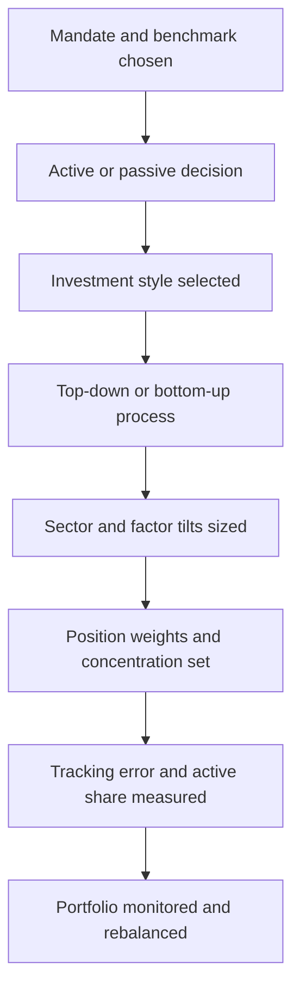
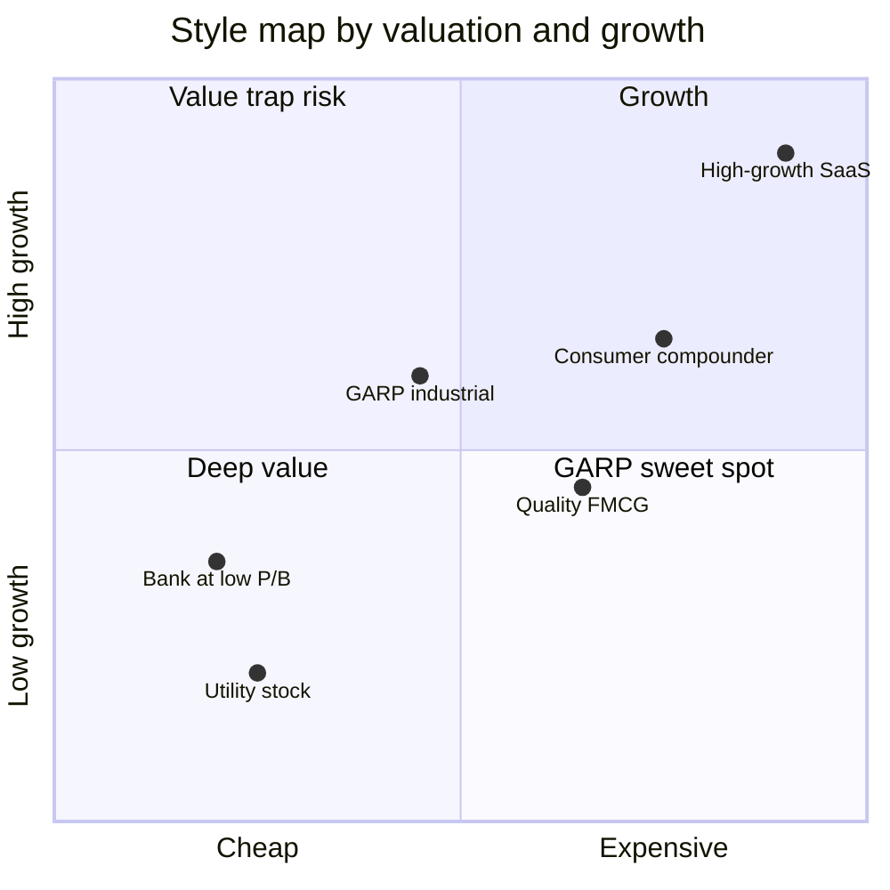
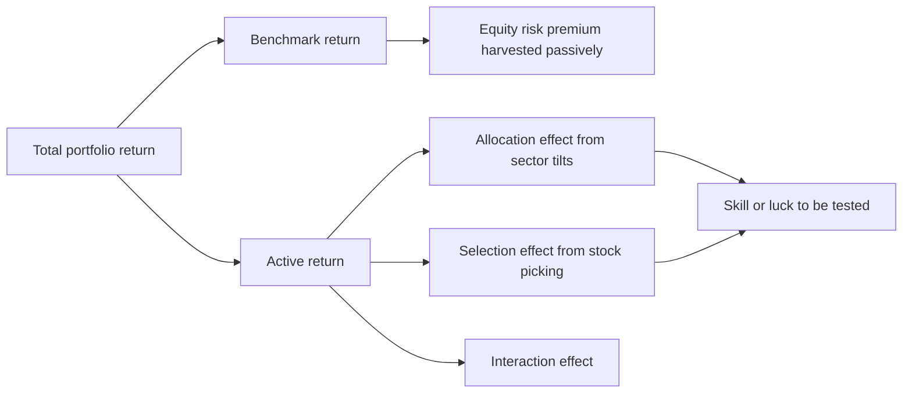
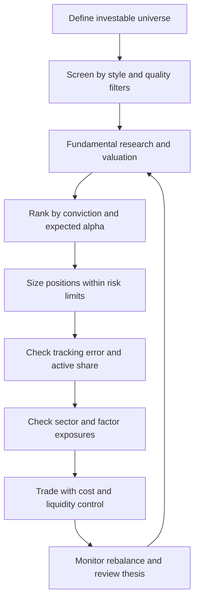

# Chapter 09 — Equity Portfolio Management

## 1. The Problem / The Need

You have a mandate: a client hands you ₹1,000 crore and says "grow my equity money." That single sentence hides a dozen decisions. Do you try to *beat* the market or simply *own* it cheaply? If you try to beat it, beat it by owning what — cheap stocks, fast-growing stocks, high-quality compounders? Do you start from the economy and drill down to stocks, or start from individual companies and build up? How many stocks do you hold — 25 or 250? How far do you dare drift from the benchmark, and how do you measure that drift so the client (and your risk manager) can see it?

Equity portfolio management is the discipline of turning a vague growth mandate into a *specific, monitorable, repeatable* set of holdings. The problem is not "which stock will go up." The problem is designing a **process** that:

1. Has a defensible reason to exist (why should anyone pay you a fee?).
2. Takes *deliberate*, sized bets rather than accidental ones.
3. Can be measured against a fair yardstick.
4. Survives the manager having a bad year without being abandoned.

A portfolio that outperforms by luck is indistinguishable, ex-ante, from one that will blow up. The whole apparatus of this chapter — benchmarks, tracking error, active share, factor tilts, style discipline — exists to separate *skill* from *noise* and to make risk **intentional**. An equity book is a collection of active bets. If you cannot name your bets and size them, you are not managing a portfolio; you are collecting stocks.

## 2. The Core Idea

Every equity portfolio is the benchmark *plus a set of deliberate deviations*. Write it as an identity:

$$\text{Portfolio} = \text{Benchmark} + \text{Active Positions}$$

The active positions are the *only* thing that can make you beat — or lag — the benchmark. Everything you get paid for lives in those deviations. So the craft breaks into four linked choices:

- **Active vs passive** — do you take active positions at all, and if so how aggressively?
- **Style** — what *kind* of stocks do your bets systematically favour (value, growth, quality, GARP)?
- **Process** — how do you generate the bets (top-down macro, bottom-up stock picking, or both)?
- **Structure** — how concentrated are the bets, and how far do they push you from the benchmark (tracking error, active share)?

The unifying mental model: **a portfolio's excess return comes entirely from where its weights differ from the index.** If your weight on every stock equals the index weight, your active return is mathematically zero before fees, and negative after. Value is created only by the *active weight vector*, and risk is created by the same vector. Return and risk share one source — the bets you chose to take.

*Figure 1 — The active-management decision stack, from mandate down to individual position.*

## 3. Why / How It Works

### Why active management is hard (the arithmetic of the loser's game)

William Sharpe's "Arithmetic of Active Management" is the starting point every analyst must internalise. Before costs, the average actively managed rupee earns exactly the market return, because in aggregate active managers *are* the market — one manager's overweight is another's underweight, and they net to the index. After fees and trading costs, the average active rupee must therefore **underperform** the passive rupee. This is not a claim about efficiency; it is accounting.

The implication is brutal and clarifying: active management is a *zero-sum game before costs and negative-sum after*. To win it, you must be better than the average participant, and the average participant is a professional. So your edge must come from a genuine, structural source: an informational edge, an analytical edge, or a *behavioural/structural* edge (patience, willingness to hold through drawdowns, capacity to be contrarian when others are forced sellers).

### Why passive works

If the average active rupee can't beat the index net of costs, then the index — captured at near-zero fee — beats most active managers over long horizons. Passive investing harvests the equity risk premium cheaply and reliably. It doesn't try to win the loser's game; it refuses to play. The market-cap-weighted index is also *self-rebalancing* (winners' weights rise automatically) and has minimal turnover, so its costs are tiny.

### How active managers try to win anyway

Active return is decomposed by the **Fundamental Law of Active Management** (Grinold):

$$IR \approx IC \times \sqrt{BR}$$

where $IR$ is the information ratio (skill-adjusted excess return), $IC$ is the information coefficient (correlation between your forecasts and outcomes — your raw skill), and $BR$ is breadth (the number of *independent* bets per year). The insight: you can build a strong track record either by being very skilled on a few bets or by being modestly skilled across many *independent* bets. A macro manager with 4 big calls a year needs enormous IC; a quant harvesting factor premia across 500 stocks needs only tiny IC per name because breadth is huge. This single equation explains why concentrated stock-pickers and diversified quants are *both* viable — they sit at different points on the same skill-breadth curve.

## 4. Full Content — Formulas, Models, and Frameworks

### 4.1 Active vs Passive — the spectrum

It is not binary. There is a continuum:

| Approach | Active share | Tracking error | Fee (typical) | What you're paying for |
|---|---|---|---|---|
| Pure index fund | ~0% | <0.2% | 0.05–0.20% | Cheap market beta |
| Enhanced index | 5–20% | 0.5–2% | 0.2–0.5% | Small, controlled tilts |
| Factor / smart beta | 30–60% | 2–5% | 0.3–0.7% | Rules-based factor premia |
| Active core | 40–70% | 3–6% | 0.7–1.2% | Genuine stock selection |
| High-conviction / focused | 70–95% | 6–12% | 1.0–2.0% | Concentrated manager skill |

The "closet indexer" is the value-destroyer here: a fund charging 1% for 20% active share is selling you 80% index at 20x the index price. Active share (Section 4.6) is precisely the tool that exposes this.

### 4.2 Investment styles

**Value** — buy stocks trading cheap relative to fundamentals (low P/E, low P/B, high dividend yield, low EV/EBITDA). Thesis: the market over-extrapolates bad news; cheapness mean-reverts. Risk: the "value trap" — cheap because the business is dying, not mispriced. Classic metrics: P/B < peers, P/E in bottom quintile, FCF yield high.

**Growth** — buy companies with rapid, sustainable earnings/revenue growth, accepting high multiples because the *future* earnings justify today's price. Thesis: the market under-appreciates the duration and magnitude of growth. Risk: multiple compression when growth disappoints — high-multiple stocks fall hardest.

**GARP (Growth at a Reasonable Price)** — a hybrid. Buy growth but refuse to overpay. The signature tool is the **PEG ratio**:

$$PEG = \frac{P/E}{\text{expected earnings growth rate (\%)}}$$

A PEG near 1.0 is "fair," below 1.0 is attractive. Peter Lynch popularised this. GARP screens for, say, 15–25% earnings growth at a PEG under 1.2.

**Quality** — buy durable, profitable, low-leverage businesses regardless of the value/growth axis. Metrics: high and stable ROE/ROCE, high gross margins, low debt/equity, high interest coverage, consistent FCF conversion, low earnings volatility. Thesis: quality compounds and protects capital in downturns; the market chronically under-prices durability. Quality is the style that "wins in the down years."

*Figure 2 — Styles placed on the two axes that matter: how cheap and how fast-growing.*

### 4.3 Top-down vs bottom-up

**Top-down** starts with the macro picture — GDP, rates, inflation, currency — then picks countries, then sectors, then stocks within favoured sectors. The dominant bets are *sector and factor allocations*. Suits macro-driven markets and asset allocators.

**Bottom-up** starts with individual companies — you find great businesses at good prices one at a time, and the sector weights are a *residual* of where you found value. Warren Buffett is the archetype: "we have no idea what the economy will do." Suits stock-selection-driven alpha.

Most real processes are hybrids: bottom-up stock picking within top-down risk guardrails (e.g., "no sector more than 10% over benchmark").

| Dimension | Top-down | Bottom-up |
|---|---|---|
| Starting point | Macro / economy | Individual company |
| Primary bet | Sector & country allocation | Stock selection |
| Sector weights | Chosen deliberately | Residual outcome |
| Key skill | Macro forecasting | Business & valuation analysis |
| Vulnerability | Macro calls are low-breadth | Can accidentally over-concentrate in a sector |

### 4.4 Sector and factor tilts

A **sector tilt** is an active weight on a GICS sector: if IT is 15% of the index and you hold 20%, you have a +5% active overweight to IT. Sector active return contribution:

$$\text{Sector contribution} = (w_{p,i} - w_{b,i}) \times (r_i - r_b)$$

A **factor tilt** is a systematic bias toward a *characteristic* that has historically earned a premium. The canonical equity factors:

| Factor | Definition / proxy | Premium rationale |
|---|---|---|
| Value | Low P/B, low P/E | Risk premium + behavioural over-reaction |
| Size | Small-cap over large-cap | Illiquidity & distress premium |
| Momentum | Past 12-1 month winners | Under-reaction, herding |
| Quality / profitability | High ROE, low accruals | Mispriced durability |
| Low volatility | Low-beta stocks | Leverage constraints, lottery-seeking |

These map to multi-factor models. The Fama-French-Carhart four-factor model:

$$R_p - R_f = \alpha + \beta_{mkt}(R_m - R_f) + \beta_{SMB}\,SMB + \beta_{HML}\,HML + \beta_{WML}\,WML + \varepsilon$$

Here $SMB$ (small minus big) is the size factor, $HML$ (high minus low book-to-market) is value, $WML$ (winners minus losers) is momentum. Regressing your fund returns on these tells you *how much of your return is factor tilt versus true stock-selection alpha* ($\alpha$). This is the tool that catches a "star manager" who is really just a leveraged small-cap value bet.

### 4.5 The benchmark

The benchmark is the yardstick that defines "the market" for your mandate — Nifty 50, Nifty 500, S&P 500, MSCI India. A valid benchmark (per the CFA "SAMURAI" criteria) must be **S**pecified in advance, **A**ppropriate, **M**easurable, **U**nambiguous, **R**eflective of the manager's opinions, **A**ccountable (owned by the manager), and **I**nvestable. Choosing the benchmark is itself a decision — benchmark a small-cap fund against Nifty 50 and every metric below is meaningless.

### 4.6 Tracking error and active share — the two rulers

These measure *different* things and both matter.

**Tracking error (TE)** — the volatility of active return. Let $R_{A,t} = R_{p,t} - R_{b,t}$ be period-$t$ active return. Then:

$$TE = \sigma(R_A) = \sqrt{\frac{1}{n-1}\sum_{t=1}^{n}(R_{A,t} - \bar{R_A})^2}$$

TE is *return-based* and *backward-looking*. It tells you how bumpy the ride relative to the index has been. Annualise monthly TE by $\times\sqrt{12}$.

**Information Ratio (IR)** — active return per unit of tracking error, the headline skill metric:

$$IR = \frac{\bar{R_A}}{TE} = \frac{R_p - R_b}{TE}$$

An IR above 0.5 is good, above 1.0 is excellent and rare.

**Active share (AS)** — the fraction of the portfolio that *differs* from the benchmark by holdings. It is *holdings-based* and *forward-looking*:

$$AS = \frac{1}{2}\sum_{i=1}^{N}\lvert w_{p,i} - w_{b,i}\rvert$$

AS ranges 0% (pure index) to 100% (no overlap). The one-half is because every overweight is matched by an underweight, so the absolute deviations double-count.

The crucial insight (Cremers & Petajisto): **TE and AS capture different bets.** High AS with *low* TE = a diversified stock-picker taking many small idiosyncratic bets that wash out at the portfolio level. High TE = concentrated factor/sector bets. You need *both* to characterise a manager:

| | Low active share | High active share |
|---|---|---|
| **Low TE** | Closet indexer | Diversified stock picker |
| **High TE** | Factor / sector bettor | Concentrated stock picker |

*Figure 3 — Portfolio return decomposed into what you cannot control and what you chose.*

### 4.7 Performance and attribution metrics

Once the portfolio runs, you decompose *where* return came from.

**Sharpe ratio** — total-risk-adjusted return, for the whole portfolio:

$$Sharpe = \frac{R_p - R_f}{\sigma_p}$$

**Treynor ratio** — systematic-risk-adjusted return (uses beta, for diversified sub-portfolios):

$$Treynor = \frac{R_p - R_f}{\beta_p}$$

**Jensen's alpha** — return above what CAPM predicted for the beta taken:

$$\alpha = R_p - \big[R_f + \beta_p (R_m - R_f)\big]$$

**Brinson-Hood-Beebower attribution** splits active return into allocation (sector-weight bets) and selection (stock-picking within sectors):

- Allocation effect (per sector): $(w_{p,i} - w_{b,i})(r_{b,i} - r_b)$
- Selection effect (per sector): $w_{b,i}(r_{p,i} - r_{b,i})$
- Interaction effect (per sector): $(w_{p,i} - w_{b,i})(r_{p,i} - r_{b,i})$

Summed across sectors, these three exactly reconcile to total active return $R_p - R_b$. This is the machinery that answers "was I right about *sectors* or about *stocks*?"

### 4.8 Concentration vs diversification

Diversification reduces *idiosyncratic* (stock-specific) risk. Portfolio variance:

$$\sigma_p^2 = \sum_i w_i^2 \sigma_i^2 + \sum_i \sum_{j\neq i} w_i w_j \sigma_i \sigma_j \rho_{ij}$$

As $N$ rises with roughly equal weights, the first (own-variance) term shrinks like $1/N$, leaving only average covariance — the systematic floor you cannot diversify away. Empirically ~20–30 stocks remove most diversifiable risk; beyond ~50 the marginal benefit is tiny.

The tension: **diversification lowers risk but also dilutes your best ideas.** If your edge is real, your 5 best ideas have higher expected alpha than your 50th. Concentration concentrates alpha *and* idiosyncratic risk. The Fundamental Law resolves it: concentrate only to the degree your $IC$ (per-bet skill) justifies losing breadth. A high-conviction fund of 20 names is a bet that skill > breadth; a quant fund of 400 names is the opposite bet.

A common concentration gauge is the effective number of stocks via the Herfindahl index:

$$N_{eff} = \frac{1}{\sum_i w_i^2}$$

A 50-stock portfolio that is 40% in its top 5 names might have $N_{eff}$ of only ~15 — far less diversified than the raw count suggests.

### 4.9 Building the portfolio — the process

*Figure 4 — The end-to-end construction loop, from universe to monitored book.*

Position sizing typically blends conviction with liquidity and risk limits. A simplified risk-budgeted sizing rule caps each name's contribution to tracking error; a heuristic version is:

$$w_i = w_{b,i} + k \cdot \frac{\text{score}_i}{\sigma_i}$$

subject to constraints (max active weight per stock, max sector deviation, minimum liquidity, target total TE). The active weight is scaled by conviction score and *divided* by the stock's volatility so that riskier names get smaller active bets for the same conviction.

## 5. Worked Examples

### Example 1 — Active share and tracking error for a focused fund

A fund holds 4 stocks against a 4-stock benchmark. Weights:

| Stock | Benchmark $w_b$ | Portfolio $w_p$ | $\lvert w_p - w_b\rvert$ |
|---|---|---|---|
| A | 40% | 30% | 10% |
| B | 30% | 45% | 15% |
| C | 20% | 25% | 5% |
| D | 10% | 0% | 10% |
| **Sum** | 100% | 100% | 40% |

**Active share** $= \tfrac{1}{2}\times 40\% = \mathbf{20\%}$.

Interpretation: despite dropping stock D entirely and over/under-weighting the rest, this is a *low* active-share portfolio — a near-closet-indexer. If it charges 1.2%, it charges 6% *on the active portion*. Verification: the overweights (B +15%, C +5% = +20%) exactly offset the underweights (A −10%, D −10% = −20%), confirming the deviations sum to zero and the sum of absolute deviations (40%) is exactly twice the active share — internally consistent.

Now suppose over 4 quarters the active returns (portfolio minus benchmark) are +1.5%, −0.5%, +2.0%, −1.0%. 
Mean active return $\bar{R_A} = (1.5 - 0.5 + 2.0 - 1.0)/4 = 0.5\%$ per quarter.
Deviations from mean: +1.0, −1.0, +1.5, −1.5. Squared: 1.0, 1.0, 2.25, 2.25; sum = 6.5.
$TE = \sqrt{6.5/(4-1)} = \sqrt{2.1667} = \mathbf{1.47\%}$ per quarter.
Annualised: $0.5\% \times 4 = 2.0\%$ active return; $TE = 1.47\% \times \sqrt{4} = 2.94\%$.
**Information ratio** $= 2.0\% / 2.94\% = \mathbf{0.68}$ — respectable skill, but note this fund achieved it with only 20% active share, meaning small bets, moderate TE. A closet-indexer profile.

### Example 2 — Brinson attribution: sectors vs stocks

Two sectors, IT and Financials. Benchmark and portfolio data:

| Sector | $w_b$ | $w_p$ | $r_b$ (sector bench return) | $r_p$ (my stocks' return) |
|---|---|---|---|---|
| IT | 50% | 70% | 10% | 12% |
| Financials | 50% | 30% | 4% | 3% |

Benchmark total return $r_b = 0.5(10\%) + 0.5(4\%) = 7.0\%$.
Portfolio total return $r_p = 0.7(12\%) + 0.3(3\%) = 8.4\% + 0.9\% = 9.3\%$.
**Active return $= 9.3\% - 7.0\% = +2.3\%$.**

Now decompose (Brinson-Hood-Beebower):

*Allocation* $(w_p - w_b)(r_{b,i} - r_b)$:
- IT: $(0.70-0.50)(10\%-7\%) = 0.20 \times 3\% = +0.60\%$
- Fin: $(0.30-0.50)(4\%-7\%) = (-0.20)(-3\%) = +0.60\%$
- Allocation total $= +1.20\%$

*Selection* $w_b(r_{p,i} - r_{b,i})$:
- IT: $0.50(12\%-10\%) = +1.00\%$
- Fin: $0.50(3\%-4\%) = -0.50\%$
- Selection total $= +0.50\%$

*Interaction* $(w_p - w_b)(r_{p,i} - r_{b,i})$:
- IT: $0.20(2\%) = +0.40\%$
- Fin: $(-0.20)(-1\%) = +0.20\%$
- Interaction total $= +0.60\%$

**Reconciliation:** $1.20\% + 0.50\% + 0.60\% = \mathbf{2.30\%}$ — exactly the active return computed directly above. ✓

Interpretation: over half the outperformance (+1.20% of 2.30%) came from the *allocation* call — overweighting IT (which beat the index) and underweighting Financials (which lagged). Stock selection added a modest +0.50%, dragged by poor financial-stock picks. This manager is a better *sector allocator* than *stock picker* — a top-down profile. If they market themselves as a bottom-up stock picker, the attribution says otherwise.

### Example 3 — GARP screen and the diversification floor

You compare two stocks for a GARP sleeve:

| | Stock X | Stock Y |
|---|---|---|
| P/E | 30 | 18 |
| Expected earnings growth | 25% | 12% |
| PEG | 30/25 = **1.20** | 18/12 = **1.50** |

Despite the higher headline P/E, **Stock X is the better GARP buy** — its PEG of 1.20 means you pay less per unit of growth than Stock Y's 1.50. This is the classic GARP counter-intuition: the "expensive" stock is cheaper once growth is priced in.

Now the diversification math. Assume every stock has $\sigma_i = 30\%$, average pairwise correlation $\rho = 0.4$, equal weights $w = 1/N$. Portfolio variance simplifies to:

$$\sigma_p^2 = \frac{\sigma^2}{N} + \frac{N-1}{N}\rho\sigma^2$$

- $N = 5$: $\sigma_p^2 = \frac{0.09}{5} + \frac{4}{5}(0.4)(0.09) = 0.018 + 0.0288 = 0.0468 \Rightarrow \sigma_p = \mathbf{21.6\%}$
- $N = 20$: $\sigma_p^2 = \frac{0.09}{20} + \frac{19}{20}(0.4)(0.09) = 0.0045 + 0.03420 = 0.0387 \Rightarrow \sigma_p = \mathbf{19.7\%}$
- $N = 100$: $\sigma_p^2 = 0.0009 + 0.03564 = 0.03654 \Rightarrow \sigma_p = \mathbf{19.1\%}$
- $N \to \infty$: $\sigma_p^2 \to \rho\sigma^2 = 0.4 \times 0.09 = 0.036 \Rightarrow \sigma_p = \mathbf{18.97\%}$

Going from 5 to 20 stocks cuts risk from 21.6% to 19.7% (−1.9 points). Going from 20 to *infinite* stocks cuts it only to 19.0% (−0.7 points more). **Most diversification benefit is captured by ~20 names; the systematic floor of ~19% cannot be diversified away** because it is driven by the 0.4 average correlation. This is the quantitative justification for concentrated portfolios: past ~20–25 names you add negligible risk reduction while diluting your best ideas. The floor also shows why "add more stocks" stops helping — you hit the covariance term.

## 6. Connections

- **CAPM and beta (earlier chapters):** Jensen's alpha and Treynor rest on CAPM; a portfolio's beta *is* its systematic sector/market tilt. Factor models generalise CAPM's single beta into value/size/momentum betas.
- **Modern Portfolio Theory:** the diversification variance formula and the efficient frontier underlie the concentration-vs-diversification trade-off and risk-budgeted position sizing.
- **Market efficiency:** the whole active/passive debate is a referendum on the Efficient Market Hypothesis. Semi-strong efficiency implies factor premia (compensation for risk) can persist while pure stock-picking alpha is competed away.
- **Behavioural finance:** value and momentum premia are usually justified by behavioural biases (over-reaction, under-reaction, herding) — the "structural edge" that active managers claim.
- **Fixed income & asset allocation:** the top-down macro layer connects to the rates/credit chapters; equity is one sleeve of a total portfolio whose overall risk budget determines how much active equity risk you can afford.
- **Performance measurement:** Sharpe/Treynor/IR/attribution feed directly into GIPS-compliant reporting and fee justification.

## 7. Key Terms

- **Active return / excess return:** portfolio return minus benchmark return.
- **Active share:** half the sum of absolute active weights; holdings-based measure of how different you are from the index.
- **Tracking error:** standard deviation of active return; return-based measure of active risk.
- **Information ratio:** active return ÷ tracking error; risk-adjusted skill.
- **Information coefficient (IC):** correlation between forecasts and realised returns; raw per-bet skill.
- **Breadth:** number of independent bets per year.
- **Closet indexer:** a fund with high fees but low active share — mostly the index in disguise.
- **PEG ratio:** P/E divided by growth rate; the GARP valuation tool.
- **Factor tilt:** systematic exposure to a return-earning characteristic (value, size, momentum, quality, low-vol).
- **Allocation vs selection effect:** attribution split between sector-weight bets and stock-picking within sectors.
- **Jensen's alpha:** return above CAPM's prediction for the beta taken.
- **Effective number of stocks ($N_{eff}$):** inverse Herfindahl of weights; true concentration.
- **Value trap:** a statistically cheap stock that is cheap because the business is deteriorating.

## 8. Common Confusions

1. **"Tracking error and active share are the same thing."** No. TE is return-based and measures *volatility* of active return; AS is holdings-based and measures *how much* of the portfolio differs from the index. A diversified stock-picker can have high AS but low TE (bets wash out); a sector-bettor can have modest AS but high TE (few concentrated bets). You need both.

2. **"Higher active share always means better."** Active share measures *how different*, not *how good*. High AS just means more opportunity for the manager's skill (or lack of it) to show. It is necessary for outperformance but not sufficient.

3. **"Growth means high-quality; value means low-quality."** Style axes are independent. Quality is orthogonal to value/growth — you can have cheap junk (deep value trap), expensive junk (hyped growth), cheap quality (the holy grail), or expensive quality (quality compounder). GARP and quality both cut across the value/growth line.

4. **"A low P/E stock is cheap."** Only relative to *sustainable* earnings. A cyclical at trough earnings shows a *high* P/E when it's actually cheap, and a low P/E at peak earnings when it's expensive. Value requires normalising earnings.

5. **"More diversification is always safer, so hold hundreds of stocks."** Past ~20–30 names, marginal risk reduction is trivial (Example 3) while you dilute conviction and drift toward closet indexing. Over-diversification is a real cost, not a free lunch.

6. **"Alpha and factor tilt are the same excess return."** No — the whole point of Fama-French regression is to *strip out* factor tilt (which is buyable cheaply via smart beta) and isolate true selection alpha. A "star" who is really a small-cap-value bet has factor beta, not alpha.

7. **"Sharpe and Treynor should agree on ranking."** They agree only for fully diversified portfolios. Sharpe uses total risk ($\sigma$); Treynor uses systematic risk ($\beta$). For an *undiversified* portfolio, Sharpe penalises the idiosyncratic risk that Treynor ignores, so rankings can diverge — a red flag that the portfolio isn't diversified.

## 9. Recap

Equity portfolio management is the discipline of taking *deliberate, sized, measurable* deviations from a benchmark. The core identity is Portfolio = Benchmark + Active bets, and everything you get paid for — and every risk you take — lives in those active bets. Active management is a negative-sum game after costs (Sharpe's arithmetic), so you win only with a structural edge; the Fundamental Law ($IR \approx IC\sqrt{BR}$) shows that edge can come from deep skill on few bets or modest skill across many independent ones, which is why both focused stock-pickers and diversified quants exist.

Styles — value, growth, GARP, quality — describe *what kind* of stocks your bets favour; process — top-down vs bottom-up — describes *how* you generate them; sector and factor tilts are the *sized* expressions of those views. Two rulers measure your active-ness: tracking error (return-based volatility of active return) and active share (holdings-based difference from the index), and they capture different things. The concentration-vs-diversification trade-off is quantitative — ~20–30 stocks capture most diversification, past which you dilute your best ideas for negligible risk reduction. Finally, attribution (Brinson) tells you *whether your allocation calls or your stock picks* drove returns, exactly reconciling to total active return — the ultimate test of whether the process did what it claimed.

## 10. Quick-Reference / Interview Points

**Formulas to have cold:**
- Active share $= \tfrac{1}{2}\sum\lvert w_p - w_b\rvert$
- Tracking error $= \sigma(R_p - R_b)$; Information ratio $= (R_p - R_b)/TE$
- Fundamental Law: $IR \approx IC\sqrt{BR}$
- Sharpe $= (R_p - R_f)/\sigma_p$; Treynor $= (R_p - R_f)/\beta_p$
- Jensen's alpha $= R_p - [R_f + \beta_p(R_m - R_f)]$
- PEG $= (P/E)/g$
- Brinson: Allocation $=(w_p-w_b)(r_b-r_{bench})$; Selection $=w_b(r_p-r_b)$; Interaction $=(w_p-w_b)(r_p-r_b)$ — these sum to active return.
- $N_{eff} = 1/\sum w_i^2$

**Interview soundbites:**
- "Active management is zero-sum before costs, negative-sum after — so I need a *named*, structural edge, not just optimism."
- "TE and active share are complements, not substitutes: one measures active *risk*, the other active *positioning*. High fee + low active share = closet indexer, the worst product in the market."
- "Quality is orthogonal to value and growth — that's why GARP and quality-value can coexist."
- "The PEG ratio can make a P/E of 30 cheaper than a P/E of 18 — always price growth, don't just look at the multiple."
- "Diversification is nearly free up to ~25 names and nearly useless past that; concentration is a bet that your IC justifies giving up breadth."
- "Attribution is the lie detector: it tells the client whether I was actually right about sectors or about stocks, and it must reconcile to the total to the basis point."
- "Before crediting a manager with alpha, regress on Fama-French — most 'alpha' is just a factor tilt you can buy for 30 bps."

**Red flags to spot in a fund:**
- High fee + active share below 40% (closet indexer).
- Sharpe and Treynor rankings diverge sharply (undiversified).
- IR consistently negative (no skill, paying for nothing).
- "Alpha" that vanishes after factor regression (it was beta).
- $N_{eff}$ far below stated stock count (hidden concentration).
