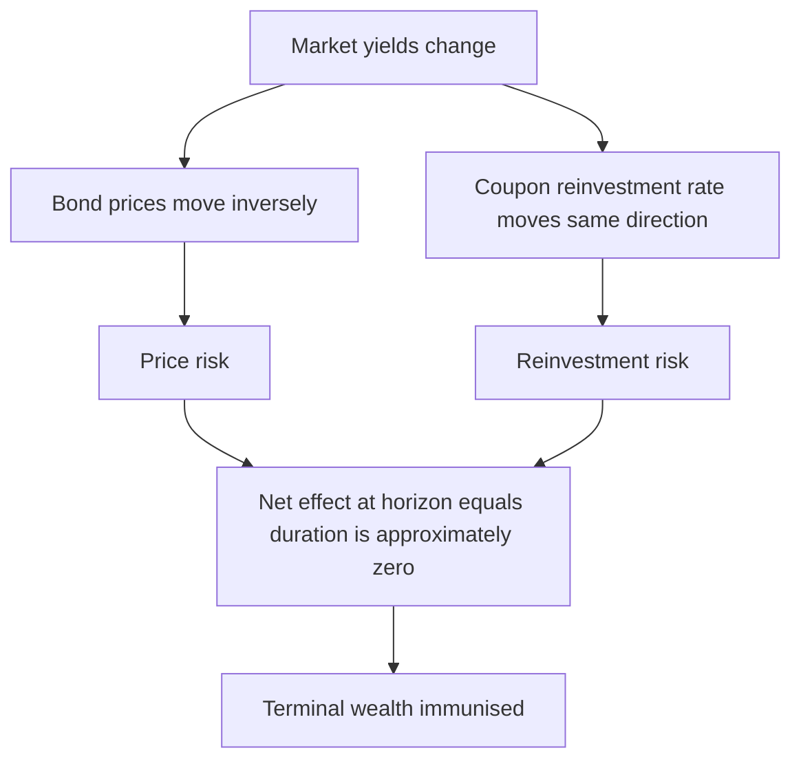
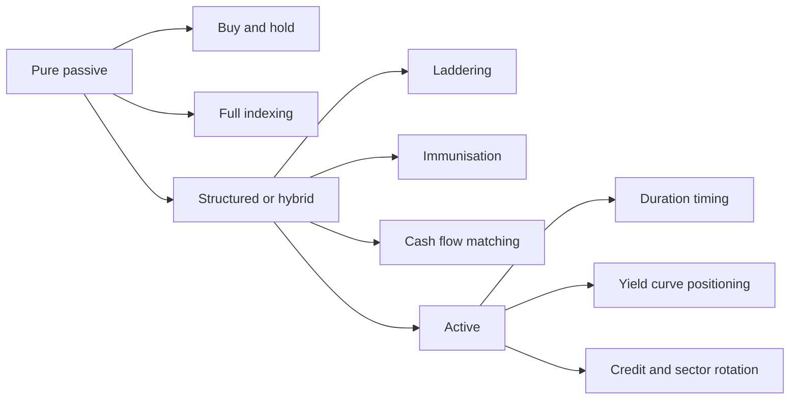
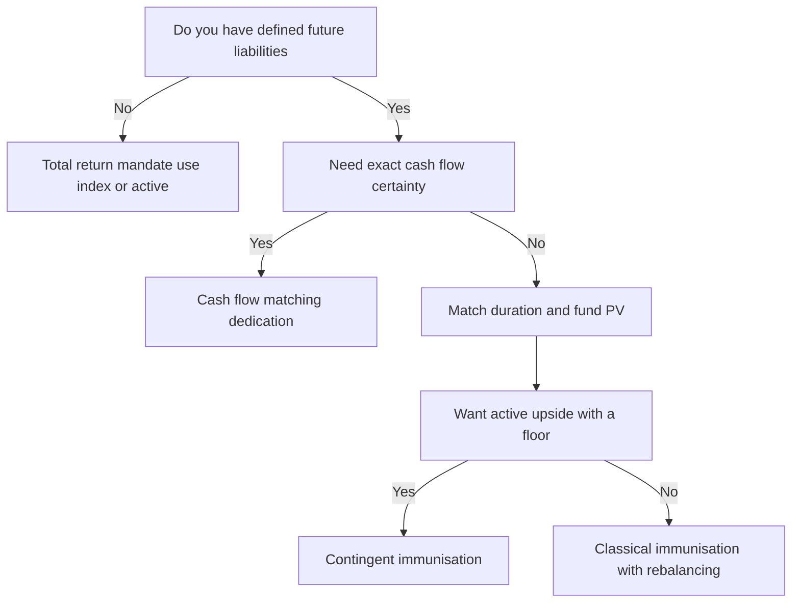

# Chapter 10 — Fixed Income Portfolio Management

## 1. The Problem / Need

Everything up to this point — Markowitz, CAPM, multifactor models — was told through the language of *equities*, where "risk" mostly means the standard deviation of an uncertain price. Bonds break that framing. A plain-vanilla bond's cash flows are **contractually fixed**: you know the coupon, you know the redemption, you know the dates. If nothing defaults and you hold to maturity, there is, in one sense, *no uncertainty at all* about the rupee amount you receive.

And yet fixed income is where some of the largest portfolios in the world live — insurance companies, pension funds, central banks, banks' treasury books, debt mutual funds — and where enormous sums are won and lost. So what is the risk that a bond manager is actually paid to manage?

Three things, mainly:

1. **Interest-rate risk.** The *fixed* cash flow is exactly the problem. When market yields rise, the present value of those locked-in cash flows falls. A 10-year bond can lose 15% of its price on a 2% rate move — without any default. This is the dominant risk in a high-grade portfolio.
2. **Reinvestment risk.** Coupons arrive along the way and must be reinvested at *whatever* rate then prevails. If rates fall, your realised compound return disappoints even though the bond "did what it promised."
3. **Credit risk.** The issuer may not pay. Spreads over the risk-free curve compensate for default probability and loss given default — and those spreads move, inflicting mark-to-market pain long before any actual default.

Layer on **liquidity risk**, **call/prepayment risk**, and **inflation risk**, and the fixed-income manager's job becomes clear: not to pick "cheap stocks," but to **shape the portfolio's sensitivity to the yield curve and to credit spreads** so that it meets a specific objective — often a *liability* the fund must fund years from now.

This chapter is the toolkit for that job. It is the most quantitative, most "engineering" corner of asset management, and interviewers for AMC debt desks, insurance ALM teams, and bank treasuries probe it hard: *duration, convexity, immunisation, curve trades, spread positioning.* We build each idea from the cash-flow mechanics up.

## 2. The Core Idea

> **A bond portfolio is a package of interest-rate exposure and credit exposure. Managing it means deliberately choosing (a) how sensitive the portfolio's value is to changes in the level, slope, and curvature of the yield curve — summarised by duration and convexity — and (b) how much compensated credit and liquidity risk to hold, then aligning that exposure with the fund's objective, whether that objective is to track a benchmark, beat a benchmark, or fund a known stream of liabilities.**

Two organising axes run through the whole discipline:

- **Passive vs active.** Passive strategies take the market's view as given — index the bond market, or ladder maturities, or immunise against a liability — and minimise the need for forecasts. Active strategies bet that *your* forecast of rates, curve shape, or spreads beats the market's, and position duration/credit accordingly.
- **Total-return vs liability-driven.** A total-return manager (typical debt mutual fund) wants the highest risk-adjusted return versus a benchmark. A liability-driven manager (insurer, pension) does not care about beating an index — they care about having enough money on the exact dates the liabilities fall due. **Immunisation** is the bridge that makes a bond portfolio behave like a liability.

Once you internalise that a bond is just a fixed stream of cash flows discounted at a curve, every technique in this chapter becomes a variation on one question: *how does my portfolio's value change when that curve moves, and is that the change I want?*

## 3. Why / How It Works

### Price is a discounted cash-flow, and that is the whole game

A bond's price is nothing but the present value of its cash flows at the market yield $y$:

$$P = \sum_{t=1}^{N} \frac{C_t}{(1+y)^{t}}$$

Because $y$ sits in the denominator, price and yield move **inversely** — the first law of fixed income. Everything else (duration, convexity, immunisation) is calculus performed on this one equation. If you can differentiate $P$ with respect to $y$, you can measure and control interest-rate risk.

### Why duration is *the* risk number

Take the first derivative of price with respect to yield and scale by price. That gives the percentage price change per unit yield change — the portfolio's interest-rate "beta." Formalised, **Macaulay duration** is the cash-flow-weighted average time to receipt:

$$D_{Mac} = \frac{\sum_{t=1}^{N} t \cdot \dfrac{C_t}{(1+y)^t}}{P}$$

and **modified duration** converts it into a price sensitivity:

$$D_{mod} = \frac{D_{Mac}}{1+y} \qquad\Rightarrow\qquad \frac{\Delta P}{P} \approx -D_{mod}\,\Delta y$$

Duration is powerful because it is **additive across a portfolio** (value-weighted), so a manager can steer a 300-bond portfolio's entire rate exposure with a single number. Want less rate risk before an expected hike? Cut portfolio duration. That is the master lever.

### Why convexity exists and why it is a gift

Duration is a *linear* approximation to a *curved* price–yield relationship. The true relationship bows toward the origin (convex). The second-order term corrects it:

$$\frac{\Delta P}{P} \approx -D_{mod}\,\Delta y + \tfrac{1}{2}\,C\,(\Delta y)^2$$

where $C$ is convexity. Positive convexity means the bond **gains more when yields fall than it loses when yields rise by the same amount** — a favourable asymmetry. All else equal, investors pay for convexity (accept lower yield), and it matters most for large rate moves and for barbell structures.

### Why reinvestment risk offsets price risk — the immunisation insight

Here is the elegant core of the chapter. When yields *rise*: bond prices *fall* (bad) but coupons reinvest at *higher* rates (good). When yields *fall*: prices *rise* (good) but reinvestment suffers (bad). These two effects push in opposite directions. There exists a holding horizon where they **exactly cancel** — and that horizon is the **duration**. Set your portfolio's duration equal to your investment horizon (or your liability's duration) and, to a first approximation, you are **immunised**: your terminal wealth is locked in regardless of which way rates move. This is why duration is not just a risk metric but the foundation of liability matching.

*Figure 10.1 — the two components of interest-rate risk offset each other, and duration is the horizon where they balance.*

## 4. Full Content — Formulas, Strategies and Models

### 4.1 Setting the objective

Before any strategy, the manager fixes the **investment policy**: return requirement, risk tolerance, and constraints (liquidity, time horizon, tax, legal, regulatory). For debt funds the objective is usually *total return vs a benchmark index* (e.g., CRISIL Composite Bond Index). For insurers and pensions it is *asset–liability matching* — the surplus (assets minus liabilities) must be protected. This objective determines everything downstream.

### 4.2 The strategy spectrum

*Figure 10.2 — fixed-income strategies from purely passive to fully active.*

### 4.3 Passive strategies

**(a) Indexing.** Replicate a bond index's risk/return. Unlike equity indexing, full replication is impractical — a bond index can hold thousands of illiquid issues that trade rarely. Managers use **stratified sampling (cellular) matching**: partition the index into cells by duration, sector, credit quality, and coupon, then hold a small basket that matches each cell's weight and, crucially, **matches the index's duration**. Tracking error is the risk metric.

**(b) Laddering.** Spread holdings evenly across maturities (e.g., equal amounts maturing every year from 1 to 10 years). Each year a bond matures and is reinvested at the long end. Benefits: automatic diversification across the curve, steady reinvestment that averages over rate cycles, predictable liquidity, and no forecasting required. Contrast with a **bullet** (all maturities clustered at one point) and a **barbell** (concentrated at short and long ends).

| Structure | Maturity profile | Convexity | Curve view it expresses |
|---|---|---|---|
| Bullet | Clustered at one horizon | Lower | Curvature stable; belly cheap |
| Barbell | Short + long ends | Higher | Curvature to increase; wings cheap |
| Ladder | Evenly spread | Medium | Agnostic; reinvestment averaging |

**(c) Buy-and-hold.** Purchase and hold to maturity, ignoring interim price moves. Eliminates transaction costs and reinvestment-timing decisions but forgoes active opportunity.

### 4.4 Active strategies

**(a) Duration / rate anticipation.** If you expect yields to fall, *extend* duration to maximise price gains; if you expect a hike, *shorten* duration (even go to cash). This is the highest-impact active bet and the riskiest — it depends entirely on forecasting rate direction.

**(b) Yield-curve positioning.** Even with the average level unchanged, the curve's *shape* moves. Three canonical moves and the trades that exploit them:

| Curve move | Description | Trade to profit |
|---|---|---|
| Parallel shift | Whole curve up/down equally | Adjust total duration |
| Steepener / flattener | Slope changes | Long-short across two maturities (duration-neutral) |
| Butterfly (curvature) | Belly moves vs wings | Barbell vs bullet |

A **flattener** (expecting the gap between long and short yields to shrink) is typically expressed by going long the long end and short the short end, dollar-duration-weighted so the position is neutral to parallel shifts and profits only from the slope change.

**(c) Credit and sector rotation.** Move down (or up) the credit-quality ladder and across sectors (sovereign, PSU, corporate, structured) to capture spread. When the economy is strengthening and spreads are wide, rotate *into* credit (lower quality, higher spread) to earn carry and ride spread compression. When a downturn looms, rotate *up* in quality ("flight to quality"). **Credit spread** compensation:

$$\text{Yield}_{corp} = \text{Yield}_{govt} + \text{Credit spread} + \text{Liquidity premium}$$

**(d) Riding the yield curve (rolldown).** In an upward-sloping, stable curve, buy a bond longer than your horizon; as time passes the bond "rolls down" to lower yields (higher price), earning capital gain on top of coupon. Works only if the curve does not shift up.

**(e) Sector/security selection & relative value.** Identify individual bonds trading cheap to their peers (rich/cheap analysis on the spread curve).

### 4.5 The risk-measurement toolkit

**Dollar duration (DV01 / PVBP)** — the money change in value for a 1 bp yield move:

$$\text{DV01} = D_{mod} \times P \times 0.0001$$

This is what traders actually hedge with, because it is additive in currency terms and lets you neutralise a book.

**Portfolio duration** — market-value-weighted average of component durations:

$$D_P = \sum_{i} w_i\,D_i, \qquad w_i = \frac{\text{MV}_i}{\sum_j \text{MV}_j}$$

**Key-rate (partial) durations.** A single duration assumes a parallel shift. Key-rate durations measure sensitivity to a move at *specific* points (2y, 5y, 10y, 30y) so a manager can see and control non-parallel (curve-reshaping) risk that a single duration hides.

**Spread duration.** Sensitivity of price to a change in the *credit spread* (holding the govt curve fixed) — the credit analogue of duration, and the key risk number for a corporate book.

**Convexity** for a portfolio is likewise value-weighted and adds a second-order correction that becomes material for big moves.

### 4.6 Immunisation — the mathematics

To immunise a **single liability** of known amount at a known horizon $H$:

1. Set **portfolio Macaulay duration = liability horizon $H$**.
2. Set **PV(assets) = PV(liability)** (fund it fully).
3. **Rebalance** periodically, because duration drifts as time passes and as yields move (duration falls slower than time, so the match degrades).

For **multiple liabilities**, conditions generalise: (i) PV(assets) = PV(liabilities); (ii) asset duration = liability duration; (iii) assets have **greater convexity/dispersion** than liabilities so the asset value dominates the liability value for *any* rate move (this is the *Fong–Vasicek* / dispersion condition). Immunisation protects against *parallel* shifts; residual risk from twists is managed by keeping convexity close and using key-rate matching.

**Cash-flow matching (dedication)** is the stricter alternative: buy bonds whose coupons and maturities *exactly* replicate the liability stream, so no rebalancing or rate forecast is ever needed. It is more expensive (fewer degrees of freedom, gives up yield) but eliminates reinvestment and rebalancing risk entirely. **Contingent immunisation** is a hybrid: manage actively as long as the surplus cushion exceeds the cost of locking in an immunised return; if the cushion erodes to that trigger, switch to pure immunisation.

*Figure 10.3 — choosing a liability-driven approach as a decision tree.*

## 5. Worked Examples

### Example 1 — Duration, DV01, and a convexity-corrected price move

A 3-year annual-coupon bond, face ₹1,000, coupon 8%, yielding 8% (so it trades at par). Compute price, Macaulay duration, modified duration, DV01, and estimate the price change for a **+100 bp** yield move, first with duration alone, then with a convexity correction. Verify against full repricing.

**Step 1 — Cash flows and PV at y = 8%.**

| $t$ | $C_t$ | $DF=(1.08)^{-t}$ | $PV=C_t\cdot DF$ | $t \cdot PV$ | $t(t+1)\cdot PV$ |
|---|---|---|---|---|---|
| 1 | 80 | 0.92593 | 74.074 | 74.074 | 148.148 |
| 2 | 80 | 0.85734 | 68.587 | 137.174 | 411.523 |
| 3 | 1080 | 0.79383 | 857.339 | 2572.017 | 10288.07 |
| **Sum** | | | **1000.00** | **2783.265** | **10847.74** |

Price $P = ₹1{,}000.00$ (par, as expected). ✓

**Step 2 — Macaulay duration.**
$$D_{Mac} = \frac{2783.265}{1000} = 2.7833 \text{ years}$$

**Step 3 — Modified duration.**
$$D_{mod} = \frac{2.7833}{1.08} = 2.5771$$

**Step 4 — DV01 (1 bp).**
$$\text{DV01} = 2.5771 \times 1000 \times 0.0001 = ₹0.2577 \text{ per bond}$$

**Step 5 — Convexity.** With annual compounding,
$$C = \frac{\sum t(t+1)\,C_t(1+y)^{-t}}{P\,(1+y)^2} = \frac{10847.74}{1000 \times 1.08^2} = \frac{10847.74}{1166.4} = 9.300$$

**Step 6 — Estimate ΔP for Δy = +0.01 (rates rise 100 bp).**

Duration only:
$$\frac{\Delta P}{P} \approx -2.5771 \times 0.01 = -2.5771\% \Rightarrow \Delta P \approx -₹25.77$$

With convexity:
$$\frac{\Delta P}{P} \approx -2.5771(0.01) + \tfrac{1}{2}(9.300)(0.01)^2 = -0.025771 + 0.000465 = -0.025306 \Rightarrow \Delta P \approx -₹25.31$$

**Step 7 — Full repricing at y = 9% (the truth).**
$$P_{9\%} = \frac{80}{1.09} + \frac{80}{1.09^2} + \frac{1080}{1.09^3} = 73.394 + 67.331 + 833.958 = ₹974.69$$
Actual change = ₹974.69 − ₹1000 = **−₹25.31**.

**Reconciliation.** Duration alone predicted −₹25.77 (overstates the loss). Adding convexity gives −₹25.31, matching the exact repricing to the paisa. This is the payoff of the second-order term: for a 100 bp move it closed essentially the entire error, and the *positive* convexity made the real loss smaller than the linear estimate. ✓

### Example 2 — Immunising a single liability with a two-bond barbell

An insurer owes **₹10,00,000 in exactly 3 years**. The flat yield curve is at 8%. The manager will fund this using two zero-ish instruments approximated by two bonds: **Bond A** with duration 1.5 years and **Bond B** with duration 5.0 years. Find the weights that immunise the liability, and show it works for a rate shock.

**Step 1 — PV of the liability.**
$$PV_L = \frac{1{,}000{,}000}{1.08^3} = \frac{1{,}000{,}000}{1.259712} = ₹793{,}832$$
So the manager invests ₹7,93,832 today. (Liability Macaulay duration = 3.0 years, since it is a single payment.)

**Step 2 — Match duration.** Need portfolio duration = 3.0:
$$1.5\,w_A + 5.0\,(1-w_A) = 3.0$$
$$1.5 w_A + 5.0 - 5.0 w_A = 3.0 \Rightarrow -3.5 w_A = -2.0 \Rightarrow w_A = 0.5714,\; w_B = 0.4286$$

**Step 3 — Rupee allocation.**
- Bond A: $0.5714 \times 793{,}832 = ₹453{,}618$
- Bond B: $0.4286 \times 793{,}832 = ₹340{,}214$

Check duration: $0.5714(1.5) + 0.4286(5.0) = 0.8571 + 2.1429 = 3.000$ ✓

**Step 4 — Stress test: yields jump to 9% immediately.** Approximate each asset's and the liability's price change by modified duration ($D_{mod} = D_{Mac}/1.08$).

- Liability: $D_{mod} = 3.0/1.08 = 2.778$; $\Delta = -2.778 \times 0.01 = -2.778\%$. New PV ≈ $793{,}832 \times (1 - 0.02778) = ₹771{,}780$.
- Bond A: $D_{mod} = 1.5/1.08 = 1.389$; $\Delta = -1.389\% \Rightarrow 453{,}618 \times 0.98611 = ₹447{,}316$.
- Bond B: $D_{mod} = 5.0/1.08 = 4.630$; $\Delta = -4.630\% \Rightarrow 340{,}214 \times 0.95370 = ₹324{,}462$.
- New asset value $= 447{,}316 + 324{,}462 = ₹771{,}778$.

**Reconciliation.** After the shock, assets = ₹7,71,778 and liability PV = ₹7,71,780 — matched to within ₹2 (rounding). Because asset and liability durations were equal, the parallel shift moved both sides by the same percentage, preserving the surplus. That is immunisation working. The tiny residual is convexity: a real barbell (Bond B far out at 5y) has **more convexity than the single 3-year liability**, so for larger shocks the assets would actually pull slightly *ahead* — the favourable dispersion condition. The manager must still **rebalance** as time passes, because after one year the liability duration falls to 2.0 while the bonds' durations fall more slowly, breaking the match. ✓

### Example 3 — A duration-neutral flattener (curve positioning)

A trader believes the **2s10s** spread will flatten (10-year yield to fall relative to 2-year). She wants a position that profits from flattening but is neutral to a parallel shift. Setup: go long the 10-year, short the 2-year, sized by DV01.

- 10-year bond: price ₹100, $D_{mod} = 8.0 \Rightarrow$ DV01 per ₹100 face $= 8.0 \times 100 \times 0.0001 = ₹0.080$.
- 2-year bond: price ₹100, $D_{mod} = 1.9 \Rightarrow$ DV01 $= 1.9 \times 100 \times 0.0001 = ₹0.019$.

**Step 1 — DV01-neutral hedge ratio.** To make the book insensitive to a parallel shift, equalise dollar duration:
$$\text{Face}_{2y} = \text{Face}_{10y} \times \frac{\text{DV01}_{10y}}{\text{DV01}_{2y}} = 100 \times \frac{0.080}{0.019} = ₹421.05 \text{ face of 2-year short per ₹100 face of 10-year long.}$$

So: long ₹100 face of the 10y, short ₹421 face of the 2y. Net DV01 ≈ 0.

**Step 2 — Parallel shift of +10 bp on both.**
- 10y long P/L: $-0.080 \times 10 = -₹0.80$.
- 2y short P/L: $+0.019 \times 10 \times 4.2105 = +₹0.80$.
- Net ≈ **₹0**. The book ignores level moves. ✓

**Step 3 — Flattening: 10y falls 10 bp, 2y unchanged.**
- 10y long P/L: $-0.080 \times (-10) = +₹0.80$.
- 2y short P/L: 2y yield unchanged ⇒ ₹0.
- Net = **+₹0.80** profit from the curve reshaping alone.

**Reconciliation.** The DV01 weighting stripped out the parallel-shift risk (Step 2 nets to zero) while leaving pure exposure to the *slope* (Step 3 pays off). This is exactly how a curve view is isolated from a level view — the essence of yield-curve positioning. ✓

## 6. Connections

- **To CAPM / portfolio theory (Ch 03–05):** duration is the bond world's *beta* — a single sensitivity to the dominant systematic factor (the yield curve). Where equities have one market beta, bonds have a term-structure exposure captured by duration and refined by key-rate durations.
- **To multifactor models (Ch 06):** modern fixed-income risk decomposes returns into **level, slope, and curvature** factors (the first three principal components of yield-curve moves explain ~95%+ of variation). Bullet/barbell/butterfly trades are literally bets on these factors — an APT-style factor structure applied to rates.
- **To bond valuation fundamentals:** this chapter *is* applied DCF. Every duration and convexity number is a derivative of the price = Σ PV(cash flows) equation.
- **To derivatives / hedging:** DV01 is how desks size interest-rate futures and swaps to hedge a cash book. A manager who wants to cut duration fast sells bond futures rather than dumping illiquid bonds.
- **To ALM and insurance:** immunisation and cash-flow matching are the theoretical spine of asset–liability management and regulatory solvency frameworks. Surplus-at-risk is duration-gap analysis.
- **To macro:** duration positioning is a direct expression of a monetary-policy view. A rate-cut thesis = extend duration; a rate-hike / inflation thesis = shorten and up-quality.

## 7. Key Terms

| Term | Meaning |
|---|---|
| **Macaulay duration** | Cash-flow-weighted average time to receipt of a bond's payments, in years. |
| **Modified duration** | $D_{Mac}/(1+y)$; approximate % price change per 1% (100 bp) yield change. |
| **Effective duration** | Duration computed by repricing under shifted curves; used for bonds with embedded options where cash flows change. |
| **DV01 / PVBP** | Rupee change in price for a 1 bp yield move; the trader's hedging unit. |
| **Convexity** | Second-order (curvature) term correcting the duration estimate; positive convexity is favourable. |
| **Key-rate duration** | Sensitivity of price to a yield change at one specific maturity point; captures non-parallel risk. |
| **Spread duration** | Sensitivity of price to a change in credit spread. |
| **Immunisation** | Setting portfolio duration = liability horizon so price and reinvestment risk offset, locking terminal wealth. |
| **Cash-flow matching / dedication** | Building a portfolio whose cash flows exactly meet liabilities; no rebalancing needed. |
| **Contingent immunisation** | Active management while a surplus cushion exists, switching to immunisation if the cushion hits a trigger. |
| **Bullet / Barbell / Ladder** | Maturity structures: clustered / short-plus-long / evenly spread. |
| **Riding the yield curve (rolldown)** | Earning gains as a bond ages down a stable upward-sloping curve. |
| **Credit spread** | Extra yield over the risk-free curve compensating for default and liquidity risk. |
| **Tracking error** | Standard deviation of a portfolio's return difference vs its benchmark index. |

## 8. Common Confusions

- **"Higher yield means higher return."** No — yield to maturity is only *realised* if every coupon is reinvested at that yield and the bond is held to maturity. Reinvestment risk breaks the equality; horizon (holding-period) return can differ sharply.
- **Duration is *not* just "years to maturity."** For a coupon bond, duration is always *less* than maturity (early coupons pull the weighted average in). Only a zero-coupon bond has duration equal to maturity.
- **Duration vs modified duration.** Macaulay is a time (years); modified is a sensitivity (%/%). Confusing the two mis-sizes every hedge. DV01 is modified duration expressed in rupees per bp.
- **Immunisation is not "set and forget."** It protects only against parallel shifts *at an instant* and drifts immediately — it demands periodic **rebalancing**. Cash-flow matching is the true set-and-forget approach.
- **Convexity is not always good for you.** Positive convexity helps; but **callable bonds and MBS exhibit negative convexity** near the strike — price gains are capped as rates fall (issuer calls / borrowers prepay), so you get the downside without the upside.
- **Barbell always beats bullet?** A barbell has more convexity (good for big moves) but usually *less yield* than a duration-matched bullet — you *pay* for convexity. Which wins depends on how much the curve actually moves.
- **Credit spread widening ≠ default.** You can lose money on a corporate bond that never defaults, purely because its spread widened and marked the price down. Spread duration, not just default probability, is the live risk.
- **Falling rates are unambiguously good for a bond fund?** Only for *price*. They hurt *reinvestment* and, for callable/MBS books, trigger negative convexity. Net effect depends on horizon vs duration.

## 9. Recap

A bond is a fixed stream of cash flows discounted at a market curve, so **price moves inversely with yield**, and the whole discipline is calculus on that identity. **Duration** measures first-order interest-rate sensitivity and is additive across a portfolio, making it the master risk lever; **convexity** corrects the estimate for large moves and is a favourable asymmetry (except in callable/MBS books, where it turns negative). **DV01** turns duration into rupees-per-basis-point for hedging.

Strategies run from **passive** (indexing via stratified sampling, laddering, buy-and-hold) to **active** (duration timing, yield-curve positioning via bullets/barbells/flatteners, and credit/sector rotation to harvest spread). For funds with defined liabilities, **immunisation** — setting portfolio duration equal to the liability horizon so price and reinvestment risk cancel — locks in terminal wealth, with **cash-flow matching** as the stricter no-rebalance alternative and **contingent immunisation** as the active-with-a-floor hybrid.

The worked examples showed the machinery reconciling: convexity closed the duration approximation error to the paisa on a 100 bp move; a duration-matched barbell held surplus flat through a rate shock; and a DV01-weighted flattener neutralised parallel risk while isolating the slope bet. Managing a bond portfolio, in one line, is **choosing your exposure to the level, slope, and curvature of the yield curve, and to credit spreads, and aligning it with your objective.**

## 10. Quick-Reference / Interview Points

**Core formulas**

| Quantity | Formula |
|---|---|
| Price | $P=\sum_t C_t(1+y)^{-t}$ |
| Macaulay duration | $D_{Mac}=\dfrac{\sum_t t\,C_t(1+y)^{-t}}{P}$ |
| Modified duration | $D_{mod}=\dfrac{D_{Mac}}{1+y}$ |
| Price approximation | $\dfrac{\Delta P}{P}\approx -D_{mod}\Delta y+\tfrac12 C(\Delta y)^2$ |
| DV01 | $D_{mod}\times P\times 0.0001$ |
| Portfolio duration | $\sum_i w_i D_i$ (value-weighted) |
| Convexity (annual) | $\dfrac{\sum_t t(t+1)C_t(1+y)^{-t}}{P(1+y)^2}$ |
| Immunisation condition | $D_{assets}=D_{liab}$ and $PV_{assets}=PV_{liab}$ |

**Rapid-fire answers**

- *Why does price fall when yields rise?* Yield is the discount rate in the denominator of the PV; higher discount rate ⇒ lower PV. Inverse by construction.
- *What's the single best measure of a bond portfolio's rate risk?* Modified duration (or DV01 in rupee terms); refine with key-rate durations for curve risk.
- *Bullet vs barbell?* Same duration, but barbell has higher convexity (wins on big moves) and lower yield (you pay for it). Bullet wins if the curve stays put.
- *How do you immunise?* Set portfolio duration = liability horizon, fund the PV, ensure asset convexity ≥ liability convexity, and rebalance as duration drifts.
- *Immunisation vs cash-flow matching?* Immunisation matches duration and needs rebalancing and protects mainly against parallel shifts; dedication matches exact cash flows, needs no rebalancing, but costs more yield.
- *Expecting a rate cut — what do you do?* Extend duration (buy long-dated bonds / receive fixed) to maximise price gains.
- *Expecting a curve flattener?* Long the long end, short the short end, DV01-weighted to be neutral to parallel shifts.
- *What is negative convexity and where?* Callable bonds and MBS: as rates fall, calls/prepayments cap the upside, so price gains flatten — you hold the downside without the upside.
- *How do you express a credit view without a rate view?* Buy/sell corporate vs duration-matched govt (asset swap), isolating spread; size by spread duration.
- *Biggest risk in a high-grade bond fund?* Interest-rate (duration) risk. In a high-yield fund, credit/spread risk dominates.
- *Why can a bond fund lose money when rates fall?* Reinvestment drag, and in callable/MBS books, negative convexity — the price upside is capped while carry deteriorates.
