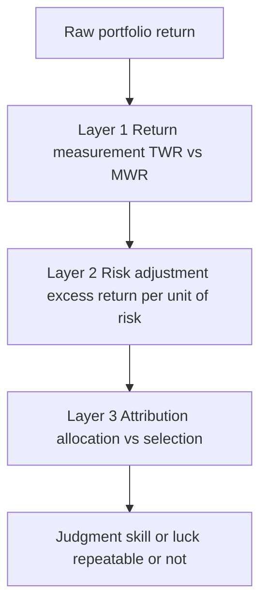
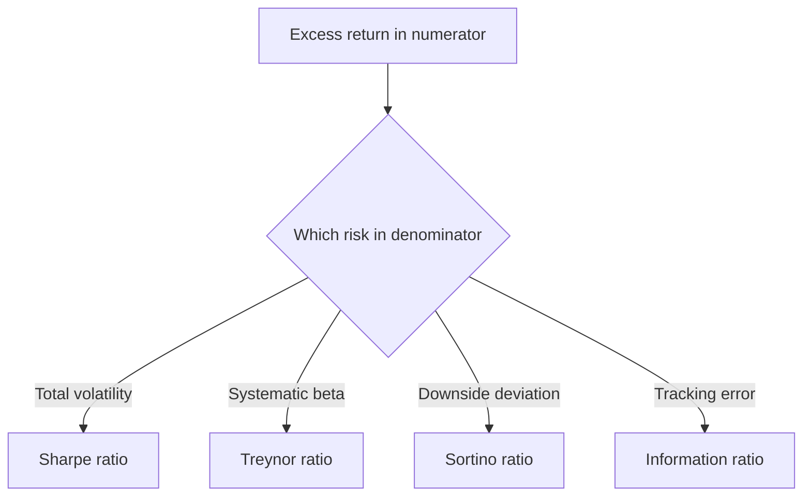
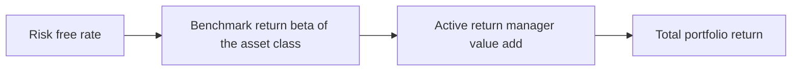
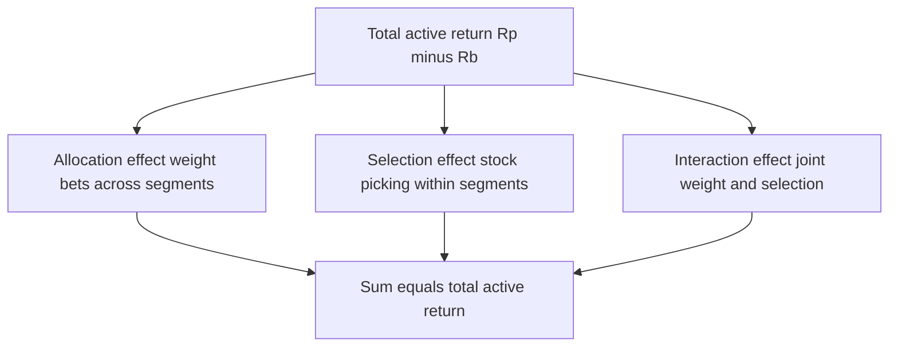

# Chapter 11 — Performance Measurement and Attribution

## 1. The Problem / Need

A portfolio manager tells you, "I made 22% last year." Your first job is to distrust that number — not because she is lying, but because a raw return, on its own, answers almost none of the questions that matter to an investor, an allocator, or an interviewer probing whether you understand what "good performance" actually means.

Consider three managers who all reported 22%:

- Manager A ran a concentrated portfolio of small-cap momentum stocks with 35% volatility and drew down 40% mid-year.
- Manager B tracked the Nifty 50, which itself returned 21%, so she added almost nothing.
- Manager C ran a market-neutral book with 6% volatility, no drawdown, and 22% return.

The same headline number represents wildly different skill. C is a phenomenon; B is a closet indexer charging active fees; A may simply have been lucky with leverage on a beta bet. **Performance measurement is the discipline of converting a raw return into a judgment about skill.** It has to answer four distinct questions:

1. **How much did the portfolio actually earn**, computed in a way that is not distorted by the timing of client cash flows the manager did not control?
2. **How much risk was taken to earn it?** Return without a risk denominator is meaningless.
3. **Did the manager beat a fair alternative** — the benchmark the client could have bought passively for a few basis points?
4. **Where did the value come from?** Was it asset allocation, security selection, or currency? Was it repeatable skill or a single lucky bet?

The stakes are practical. Allocators move billions based on these numbers. Fees — often "2 and 20" in hedge funds or 50–100 bps in mutual funds — are justified (or not) by them. Managers are hired and fired on three-year rolling numbers that are often statistically indistinguishable from noise. Getting the measurement wrong means rewarding luck and punishing skill. This chapter builds the full toolkit: return measurement, risk-adjusted ratios, benchmarking, and attribution — with the actual math and worked examples that reconcile.

## 2. The Core Idea

Performance evaluation rests on one organizing principle: **a return is only interpretable relative to (a) the risk taken and (b) a fair alternative.** Everything in this chapter is an elaboration of that sentence.

We break the analysis into three layers that stack on top of each other:

- **Layer 1 — Return measurement.** Get the return number right. The central subtlety is *whose* return we are measuring: the *portfolio's* (the manager's skill, time-weighted) or the *investor's* (their actual wealth outcome, money-weighted). These differ whenever cash flows move in and out.

- **Layer 2 — Risk adjustment.** Divide excess return by a measure of risk. Which risk measure you use in the denominator (total volatility, systematic beta, downside deviation, or tracking error) defines the ratio (Sharpe, Treynor, Sortino, Information Ratio). Each answers a subtly different question.

- **Layer 3 — Attribution.** Decompose the excess return into the *decisions* that produced it — allocation across asset classes/sectors versus selection of securities within them. This is where you separate "the manager was overweight the right sector" from "the manager picked the right stocks."

*Figure 11.1 — The three layers of performance evaluation stack from a raw number to a judgment about skill.*

The intellectual honesty of the whole exercise depends on comparing like with like: the same currency, the same period, the same risk-free rate, and a benchmark that genuinely represents the manager's opportunity set.

## 3. Why / How It Works

### Why time-weighted and money-weighted returns diverge

Imagine a manager who is genuinely skilled and compounds capital at a steady rate. If a client happens to pour in a large deposit right before a bad quarter and withdraw before a good one, the client's *realized* dollar outcome will be worse than the manager's *strategy* return — through no fault of the manager. Conversely, a lucky client whose deposits land before rallies will earn more than the strategy itself.

The **time-weighted return (TWR)** neutralizes cash-flow timing by breaking the period at each cash flow, computing a sub-period return on each, and geometrically chaining them. Because it removes the size and timing of external flows, TWR measures *the manager's decisions* and is the GIPS (Global Investment Performance Standards) mandated basis for comparing managers.

The **money-weighted return (MWR)**, which is just the internal rate of return (IRR) of the portfolio's cash flows, *does* embed timing. It answers "what did the *investor* actually earn on the money they had at work?" It is the right measure when the manager (e.g., a private-equity GP calling capital) controls the timing, or when you want the client's true experience.

### Why you must divide by risk

Financial theory says higher expected return is compensation for bearing risk. So the natural way to detect *skill* is to ask: per unit of risk taken, how much return did you deliver? A manager who doubles her return by doubling her leverage has added no skill — the risk-adjusted ratio stays flat. Only if she raises return *without* proportionally raising risk (or cuts risk without cutting return) does the ratio improve. That is the signature of genuine value-add.

### Why the choice of risk denominator matters

- If the portfolio is an investor's *entire* wealth, total risk (standard deviation) is what hurts them → **Sharpe**.
- If the portfolio is *one sleeve* of a diversified whole, only its *systematic* (non-diversifiable) risk matters → **Treynor** and **Jensen's alpha** use beta.
- If investors only fear *downside* (they do not mind upside volatility) → **Sortino** uses downside deviation.
- If the manager is judged against a benchmark and we care about *active* risk → **Information Ratio** uses tracking error.

*Figure 11.2 — The risk denominator you choose defines which ratio you compute and which question it answers.*

## 4. Full Content — Formulas and Models

### 4.1 Return measurement

**Holding-period return (single period, no flows):**

$$ R = \frac{V_1 - V_0 + D}{V_0} $$

where $V_0, V_1$ are beginning and ending values and $D$ is income (dividends/coupons).

**Time-weighted return (TWR).** Break the period into sub-periods at each external cash flow. For each sub-period compute:

$$ r_t = \frac{V_{\text{end}} - V_{\text{begin}} - CF_t}{V_{\text{begin}}} $$

(placing the flow appropriately; the clean version values the portfolio just before each flow). Then chain geometrically:

$$ 1 + R_{TWR} = (1+r_1)(1+r_2)\cdots(1+r_n) $$

Annualize by $ (1+R_{TWR})^{1/\text{years}} - 1 $ for multi-year.

**Money-weighted return (MWR / IRR).** Solve for the rate $r$ that sets the net present value of all flows to zero:

$$ V_0 = \sum_{t=1}^{n} \frac{-CF_t}{(1+r)^t} + \frac{V_n}{(1+r)^n} $$

or equivalently the $r$ satisfying $ \sum \frac{CF_t}{(1+r)^t} = 0 $ with the ending value as a final inflow and the beginning value plus contributions as outflows.

| Feature | Time-Weighted (TWR) | Money-Weighted (MWR / IRR) |
|---|---|---|
| Removes cash-flow timing | Yes | No |
| Measures | Manager's decisions | Investor's actual $ experience |
| Standard for | GIPS, comparing managers | PE/VC, client-level reporting |
| Sensitive to large flows | No | Very |
| Computation | Geometric chaining | Solve polynomial for IRR |

**Arithmetic vs geometric mean of returns.** Arithmetic mean $\bar R = \frac{1}{n}\sum R_i$ overstates realized growth; geometric mean $ \left(\prod(1+R_i)\right)^{1/n} - 1 $ is the actual compounded rate. Geometric ≤ arithmetic always, with the gap widening with volatility (roughly $ R_g \approx \bar R - \sigma^2/2 $).

### 4.2 Risk-adjusted performance measures

Let $R_p$ = portfolio return, $R_f$ = risk-free rate, $R_m$ = market/benchmark return, $\sigma_p$ = portfolio standard deviation, $\beta_p$ = portfolio beta, $\sigma_{p,d}$ = downside deviation, and $\sigma_{(R_p - R_b)}$ = tracking error.

| Measure | Formula | Risk in denominator | Best used when |
|---|---|---|---|
| **Sharpe ratio** | $ S = \dfrac{R_p - R_f}{\sigma_p} $ | Total risk (σ) | Portfolio is the investor's whole wealth |
| **Treynor ratio** | $ T = \dfrac{R_p - R_f}{\beta_p} $ | Systematic risk (β) | Portfolio is one part of a diversified whole |
| **Jensen's alpha** | $ \alpha = R_p - [R_f + \beta_p(R_m - R_f)] $ | (intercept vs CAPM) | Testing skill vs the CAPM benchmark line |
| **Information ratio** | $ IR = \dfrac{R_p - R_b}{\sigma_{(R_p - R_b)}} $ | Tracking error (active risk) | Judging active manager vs a benchmark |
| **Sortino ratio** | $ \text{Sortino} = \dfrac{R_p - R_{\text{MAR}}}{\sigma_{p,d}} $ | Downside deviation | Investor only cares about downside |
| **M² (Modigliani)** | $ M^2 = R_f + S_p \cdot \sigma_m $ | Total risk, rescaled | Expressing Sharpe as a return number |

**Downside deviation** (for Sortino), against a minimum acceptable return (MAR):

$$ \sigma_{p,d} = \sqrt{\frac{1}{n}\sum_{i=1}^{n} \big[\min(R_i - R_{\text{MAR}}, 0)\big]^2} $$

Note we sum squared *shortfalls* only, but still divide by total $n$.

**M² (M-squared)** restates the Sharpe ratio as the return a portfolio would have earned if levered/de-levered to the market's volatility, making it directly comparable to the market return in percentage points:

$$ M^2 = R_f + \frac{R_p - R_f}{\sigma_p}\cdot \sigma_m = R_f + S_p \cdot \sigma_m $$

**Appraisal ratio** (a close cousin of IR using CAPM residuals): $ \dfrac{\alpha}{\sigma(\varepsilon)} $, alpha over non-systematic (residual) risk.

### 4.3 Sharpe vs Treynor — when do they disagree?

Both share the numerator $R_p - R_f$. They differ only in the denominator: total risk vs systematic risk. For a **fully diversified** portfolio, unsystematic risk ≈ 0, so $\sigma_p \approx \beta_p \sigma_m$, and the two rankings agree. For a **poorly diversified** portfolio carrying idiosyncratic risk, Sharpe (which penalizes total risk) will rank it lower than Treynor (which ignores diversifiable risk). *A large gap between a portfolio's Sharpe and Treynor rankings is itself a diagnostic — it signals the portfolio is under-diversified.*

### 4.4 Benchmarking

A benchmark is the passive, investable alternative the client could have held instead of paying the manager. A valid benchmark must be **SAMURAI** (a standard CFA mnemonic): **S**pecified in advance, **A**ppropriate to the style, **M**easurable, **U**nambiguous, **R**eflective of current investment opinions, **A**ccountable (manager accepts it), and **I**nvestable. Common failures: style drift (a "large-cap" fund holding mid-caps), survivorship bias in the index, and using a total-return vs price index inconsistently.

*Figure 11.3 — Value-add is the gap between the portfolio and a fair benchmark, not the raw return itself.*

**Active return** = $R_p - R_b$. **Active risk** (tracking error) = standard deviation of $(R_p - R_b)$. The Information Ratio is the reward-to-active-risk ratio and is the single most-watched number for active managers; a sustained IR above ~0.5 is good, above ~1.0 is exceptional.

### 4.5 Performance attribution — Brinson-Hood-Beebower (BHB)

Attribution decomposes active return into the *decisions* that generated it. The classic Brinson model splits total active return into three effects across sectors/asset classes $i$:

Let $w_{p,i}, w_{b,i}$ = portfolio and benchmark weights in segment $i$; $R_{p,i}, R_{b,i}$ = portfolio and benchmark returns *within* segment $i$; $R_b$ = total benchmark return.

**Allocation effect** (did over/underweighting segments help?):

$$ A_i = (w_{p,i} - w_{b,i})\,(R_{b,i} - R_b) $$

**Selection effect** (did picking better securities within a segment help?):

$$ S_i = w_{b,i}\,(R_{p,i} - R_{b,i}) $$

**Interaction effect** (joint term — overweighting a segment where you also picked well):

$$ I_i = (w_{p,i} - w_{b,i})\,(R_{p,i} - R_{b,i}) $$

Total active return $ = \sum_i (A_i + S_i + I_i) = R_p - R_b $. Many practitioners fold interaction into selection, giving a two-factor allocation/selection split.

*Figure 11.4 — Brinson attribution splits the portfolio-minus-benchmark gap into decision-level effects that sum back to total active return.*

The intuition of the allocation term is subtle: you get credit for overweighting a segment only if that segment *beat the overall benchmark* ($R_{b,i} - R_b > 0$). Overweighting a segment that merely did fine but underperformed the total benchmark is a *negative* allocation decision.

### 4.6 Evaluating a manager — beyond a single number

- **Statistical significance.** Alpha and IR are noisy. The t-statistic of alpha ≈ $IR \times \sqrt{\text{years}}$. To be 95% confident (t ≈ 2) that an IR of 0.5 is real, you need roughly $ (2/0.5)^2 = 16 $ years of data. Three-year track records prove almost nothing.
- **Persistence.** Does outperformance repeat, or is it hot-hand luck? Most academic evidence finds weak persistence in equity funds after fees.
- **Style consistency.** Return-based style analysis (Sharpe's method) regresses fund returns on style indices to detect drift.
- **Risk discipline.** Max drawdown, downside capture, and whether volatility stayed within mandate.
- **Capture ratios.** Up-capture / down-capture: what fraction of benchmark up-moves and down-moves the fund captured. A ratio of 110/85 (captures 110% of upside, only 85% of downside) is the ideal asymmetry.
- **Fees.** Everything above should be judged *net of fees*, which is what the client keeps.

## 5. Worked Examples

### Example 1 — TWR vs MWR, and why they differ

A fund starts the year at ₹100. Mid-year (exactly 6 months in) the client *adds* ₹50 immediately after the fund's value had risen to ₹110. The fund ends the year at ₹176.

**Step 1 — Sub-period returns for TWR.**

- H1: value went ₹100 → ₹110 before the flow. $ r_1 = 110/100 - 1 = 10.0\% $.
- The ₹50 deposit brings the base to ₹110 + ₹50 = ₹160 at the start of H2.
- H2: value went ₹160 → ₹176. $ r_2 = 176/160 - 1 = 10.0\% $.

**Step 2 — Chain geometrically.**

$$ R_{TWR} = (1.10)(1.10) - 1 = 21.0\% $$

**Step 3 — MWR (IRR).** Cash flows from the *investor's* perspective (outflows negative): −100 at t=0, −50 at t=0.5, +176 at t=1. Solve

$$ 100 + \frac{50}{(1+r)^{0.5}} = \frac{176}{(1+r)^{1}} $$

Try $r = 21\%$: LHS $= 100 + 50/1.1 = 100 + 45.45 = 145.45$; RHS $= 176/1.21 = 145.45$. They match, so **MWR ≈ 21.0%** too.

**Reconciliation / interpretation.** Here TWR = MWR because the two sub-period returns were *identical* (10% each), so the timing of the deposit didn't matter. Now change H2: suppose instead the fund *fell* in H2 so it ended at ₹144 (a −10% H2). Then $R_{TWR} = (1.10)(0.90) - 1 = -1.0\%$. But the MWR would be dragged *down more heavily* because the large ₹50 deposit was exposed to the bad H2. Solving $100 + 50/(1+r)^{0.5} = 144/(1+r)$: try $r = -4\%$: LHS $=100+50/0.9798=100+51.03=151.03$; RHS$=144/0.96=150.0$ — close, MWR ≈ −3.6%, *worse* than the −1.0% TWR. The extra money at work during the loss hurt the investor's dollar return even though the manager's decision-return was only −1%. **That gap — MWR below TWR when big money arrives before bad periods — is exactly what TWR is designed to strip out.**

### Example 2 — The full risk-adjusted suite, computed and cross-checked

Given for one year: $R_p = 18\%$, $R_f = 6\%$, $R_m = 13\%$, $\sigma_p = 20\%$, $\sigma_m = 15\%$, $\beta_p = 1.2$.

**Sharpe:** $ S_p = \dfrac{0.18 - 0.06}{0.20} = \dfrac{0.12}{0.20} = 0.60 $. Market Sharpe $ = \dfrac{0.13-0.06}{0.15} = \dfrac{0.07}{0.15} = 0.467 $. The portfolio beats the market on a total-risk basis (0.60 > 0.467). ✔

**Treynor:** $ T_p = \dfrac{0.18 - 0.06}{1.2} = \dfrac{0.12}{1.2} = 0.10 $ (i.e., 10% excess per unit beta). Market Treynor $ = \dfrac{0.07}{1.0} = 0.07 $. Portfolio wins on systematic-risk basis too (0.10 > 0.07). ✔

**Jensen's alpha:** CAPM-required return $ = R_f + \beta_p(R_m - R_f) = 0.06 + 1.2(0.13 - 0.06) = 0.06 + 1.2(0.07) = 0.06 + 0.084 = 0.144 = 14.4\% $. Alpha $ = 18\% - 14.4\% = +3.6\% $. Positive alpha confirms genuine outperformance versus the CAPM line. ✔

**Cross-check (alpha ↔ Treynor).** Alpha and Treynor must tell the same story. Treynor gap over the market = $0.10 - 0.07 = 0.03$ per unit beta; multiplied by $\beta_p = 1.2$ gives $0.036 = 3.6\%$ — exactly the Jensen alpha. ✔ *This identity ($\alpha = \beta_p \times (T_p - T_m)$) is a favourite interview gotcha and confirms our arithmetic.*

**M²:** $ M^2 = R_f + S_p \cdot \sigma_m = 0.06 + 0.60 \times 0.15 = 0.06 + 0.09 = 0.15 = 15\% $. The portfolio, de-levered to the market's 15% volatility, would have returned 15% vs the market's actual 13% — an M² spread of **+2%**. Consistent with the positive Sharpe advantage. ✔

**Information ratio (add data):** suppose benchmark return $R_b = 13\%$ and tracking error $\sigma_{(R_p-R_b)} = 5\%$. Active return $= 18\% - 13\% = 5\%$. $ IR = 5\%/5\% = 1.0 $ — an excellent active manager. ✔

Every measure agrees the manager added value; they simply quantify it against different risk yardsticks. The consistency is the self-check.

### Example 3 — Sortino ratio from monthly data

A fund's excess-over-MAR monthly returns (MAR = 0%) over 8 months: **+4%, −3%, +2%, −5%, +6%, −1%, +3%, +2%**. Mean monthly return $= (4-3+2-5+6-1+3+2)/8 = 8/8 = +1.0\%$.

**Downside deviation** — square only the negative months, divide by total n = 8:

- Negatives: −3, −5, −1 → squares 9, 25, 1 → sum = 35.
- $ \sigma_d = \sqrt{35/8} = \sqrt{4.375} = 2.092\% $ per month.

**Sortino (monthly)** $ = \dfrac{1.0\% - 0\%}{2.092\%} = 0.478 $.

**Compare to Sharpe on the same data.** Full standard deviation: mean 1.0%; deviations squared for all 8 months: $(3)^2+(-4)^2+(1)^2+(-6)^2+(5)^2+(-2)^2+(2)^2+(1)^2 = 9+16+1+36+25+4+4+1 = 96$; sample variance $= 96/7 = 13.71$; $\sigma = 3.70\%$. Sharpe (excess mean/σ, $R_f$≈0) $= 1.0/3.70 = 0.270$.

**Interpretation.** Sortino (0.478) is nearly double the Sharpe (0.270) because roughly two-thirds of this fund's volatility came from *upside* months (+4, +6, +3, +2, +2), which Sharpe penalizes but Sortino ignores. For an investor who only fears losses, Sortino paints the more relevant — and more flattering — picture. The gap is the signature of a positively-skewed return stream. ✔

### Example 4 — Brinson attribution (allocation vs selection)

A two-sector portfolio (Tech and Financials) vs its benchmark. All returns are for the period.

| Sector | $w_p$ | $w_b$ | $R_{p,i}$ | $R_{b,i}$ |
|---|---|---|---|---|
| Tech | 70% | 50% | 15% | 12% |
| Financials | 30% | 50% | 5% | 8% |

**Total benchmark return** $ R_b = 0.50(12\%) + 0.50(8\%) = 6\% + 4\% = 10\% $.
**Total portfolio return** $ R_p = 0.70(15\%) + 0.30(5\%) = 10.5\% + 1.5\% = 12.0\% $.
**Total active return** $ = 12.0\% - 10.0\% = +2.0\% $. This is the number our effects must sum to.

**Allocation effect** $ A_i = (w_p - w_b)(R_{b,i} - R_b) $:

- Tech: $(0.70 - 0.50)(12\% - 10\%) = 0.20 \times 2\% = +0.40\%$.
- Financials: $(0.30 - 0.50)(8\% - 10\%) = (-0.20)(-2\%) = +0.40\%$.
- **Allocation total = +0.80%.** (Overweighting Tech, which beat the benchmark, and underweighting Financials, which lagged — both correct calls.)

**Selection effect** $ S_i = w_b(R_{p,i} - R_{b,i}) $:

- Tech: $0.50(15\% - 12\%) = 0.50 \times 3\% = +1.50\%$.
- Financials: $0.50(5\% - 8\%) = 0.50 \times (-3\%) = -1.50\%$.
- **Selection total = 0.00%.** (Great Tech picks exactly offset by poor Financials picks.)

**Interaction effect** $ I_i = (w_p - w_b)(R_{p,i} - R_{b,i}) $:

- Tech: $(0.20)(3\%) = +0.60\%$.
- Financials: $(-0.20)(-3\%) = +0.60\%$.
- **Interaction total = +1.20%.**

**Reconciliation:** $0.80\% + 0.00\% + 1.20\% = +2.00\%$ = total active return. ✔

**Interpretation.** The headline is that this manager's edge was almost entirely *allocation* (getting the sector weights right) plus a favourable interaction — she overweighted the sector where she *also* picked well (Tech) and underweighted the sector where she picked badly (Financials). Pure selection skill netted to zero. If you fold interaction into selection (the common two-factor convention), you'd report Allocation +0.80% and Selection +1.20%, still summing to +2.0%. The story an allocator hears — "this is an asset-allocation shop, not a pure stock-picker" — changes hiring decisions.

## 6. Connections

- **CAPM and the SML (Ch. on asset pricing).** Jensen's alpha is literally the vertical distance of the portfolio from the Security Market Line; Treynor is the slope of the line from $R_f$ to the portfolio in beta space. Sharpe is the slope in total-risk (CML) space. The whole risk-adjusted toolkit is CAPM read backwards.
- **Modern Portfolio Theory.** The Sharpe ratio is the gradient of the Capital Market Line; maximizing Sharpe is equivalent to finding the tangency portfolio.
- **Factor models (Fama-French, Carhart).** "Alpha" from single-factor CAPM often shrinks to zero once you control for size, value, and momentum factors — much of what looks like skill is factor exposure (smart beta). Multi-factor alpha is the modern skill test.
- **Fixed income (Ch. on bonds).** Attribution there decomposes return into duration, curve, and spread effects — the same allocation/selection philosophy applied to yield-curve positioning.
- **Behavioral finance.** MWR-vs-TWR gaps quantify the "behavior gap" — the return investors lose by mistiming their own contributions and redemptions (DALBAR studies).
- **Fund rating agencies.** Morningstar's star ratings and risk-adjusted return metrics are institutionalized versions of these ratios.

## 7. Key Terms

- **Time-weighted return (TWR):** Return that removes the effect of cash-flow timing; the standard for comparing managers.
- **Money-weighted return (MWR / IRR):** The internal rate of return of the portfolio's cash flows; reflects the investor's actual dollar experience.
- **Sharpe ratio:** Excess return per unit of *total* risk (standard deviation).
- **Treynor ratio:** Excess return per unit of *systematic* risk (beta).
- **Jensen's alpha:** Return in excess of the CAPM-required return; the SML intercept.
- **Information ratio (IR):** Active return divided by tracking error; the key active-management metric.
- **Sortino ratio:** Excess return over a minimum acceptable return, divided by *downside* deviation.
- **M² (Modigliani-squared):** Sharpe ratio re-expressed as a benchmark-comparable percentage return.
- **Tracking error (active risk):** Standard deviation of (portfolio − benchmark) return.
- **Benchmark:** The passive, investable alternative; must satisfy SAMURAI properties.
- **Allocation effect:** Active return from over/underweighting segments relative to benchmark.
- **Selection effect:** Active return from picking better-than-benchmark securities within segments.
- **Interaction effect:** Joint term combining weighting and selection decisions.
- **Downside deviation:** Standard deviation computed using only returns below the MAR.
- **Capture ratio:** Fraction of benchmark up-moves (up-capture) or down-moves (down-capture) the portfolio captured.

## 8. Common Confusions

- **"Higher return = better manager."** No — without the risk denominator and a benchmark, a raw return says nothing about skill. This is the single most common amateur error.
- **TWR vs MWR direction.** MWR is *not* "always higher" or "always lower." It exceeds TWR when the investor's large flows happen to precede good periods, and falls below when they precede bad periods. It equals TWR when there are no flows or when sub-period returns are equal.
- **Sharpe vs Treynor confusion.** Same numerator, different denominator (σ vs β). Use Sharpe for a standalone/total portfolio, Treynor for a sub-portfolio within a diversified whole. They agree only when the portfolio is well diversified.
- **Alpha ≠ excess return.** Alpha is excess return *over the CAPM-required (beta-adjusted) return*, not over $R_f$ or over the benchmark. A fund that returned 3% above its benchmark but had beta 1.5 in an up market may have *negative* alpha.
- **Sortino denominator divisor.** Downside deviation squares only the negative shortfalls but still divides by the *total* number of observations $n$, not the number of negatives. Dividing by the count of negatives is a frequent mistake.
- **Selection vs allocation credit.** You get *allocation* credit for overweighting a segment only if that segment beat the *total* benchmark, not merely if the segment had a positive return. And selection is measured at *benchmark* weights, so it isolates pure picking skill from sizing.
- **Interaction effect sign.** Interaction is often lumped into selection; make sure your effects sum to total active return before interpreting — a common source of "my attribution doesn't reconcile."
- **Geometric vs arithmetic mean.** Reporting the arithmetic average of periodic returns overstates the compounded growth an investor actually experienced, especially for volatile funds.
- **Ignoring statistical significance.** A three-year IR of 0.8 sounds great but is statistically indistinguishable from zero; skill needs a long track record to prove.

## 9. Recap

Performance evaluation converts a raw return into a judgment about skill through three stacked layers. **First**, measure the return correctly: use time-weighted return to judge the *manager* (it strips cash-flow timing) and money-weighted return to capture the *investor's* actual dollar outcome — the two diverge whenever large flows land before unusually good or bad periods. **Second**, adjust for risk by dividing excess return by the right risk denominator: total volatility gives Sharpe (whole-portfolio view), beta gives Treynor and — as an intercept — Jensen's alpha (systematic-risk view), downside deviation gives Sortino (loss-focused view), and tracking error gives the Information Ratio (active-management view). These measures are all CAPM read in reverse and, on clean data, corroborate one another — we verified in Example 2 that $\alpha = \beta(T_p - T_m)$ and that M² tells the same story as Sharpe. **Third**, attribute the active return to decisions via the Brinson model: allocation (weight bets across segments), selection (security picking within segments), and interaction, which must sum exactly to portfolio-minus-benchmark — as they did to +2.0% in Example 4. Finally, wrap all of it in judgment: benchmark validity (SAMURAI), statistical significance (skill needs many years), style consistency, capture ratios, and everything net of fees. The discipline is one sentence repeated at every layer: *a return means nothing except relative to the risk taken and a fair alternative.*

## 10. Quick-Reference / Interview Points

**Formula flash-card:**

| Metric | Formula | One-line meaning |
|---|---|---|
| Sharpe | $(R_p - R_f)/\sigma_p$ | Excess return per unit total risk |
| Treynor | $(R_p - R_f)/\beta_p$ | Excess return per unit market risk |
| Jensen α | $R_p - [R_f + \beta_p(R_m - R_f)]$ | Return above the SML |
| Info ratio | $(R_p - R_b)/TE$ | Active return per unit active risk |
| Sortino | $(R_p - R_{MAR})/\sigma_{down}$ | Excess return per unit downside risk |
| M² | $R_f + S_p\,\sigma_m$ | Sharpe expressed as a % return |
| Allocation | $(w_p - w_b)(R_{b,i} - R_b)$ | Weight-bet contribution |
| Selection | $w_b(R_{p,i} - R_{b,i})$ | Stock-picking contribution |

**Interview-ready talking points:**

- *"Why TWR not MWR to rank managers?"* Because TWR removes the timing of client flows the manager doesn't control; MWR is right only when the manager controls the cash flows (PE/VC) or you want the client's true experience.
- *"Sharpe vs Treynor — which and when?"* Same numerator; Sharpe uses σ (use for a standalone total portfolio), Treynor uses β (use for a sleeve inside a diversified book). A big ranking gap between them flags poor diversification.
- *"Is alpha the same as beating the benchmark?"* No — alpha is return above the *beta-adjusted* CAPM requirement. High beta in a bull market can produce benchmark outperformance with *negative* alpha.
- *"How much data to trust an IR?"* t-stat ≈ IR × √years; you need roughly $(2/IR)^2$ years for 95% confidence. An IR of 0.5 needs ~16 years — so short track records prove little.
- *"Allocation or selection — which is 'better'?"* Neither inherently; attribution just tells you *where* the edge is. But allocation skill is harder to sustain and often just factor timing, whereas repeatable selection alpha at benchmark weights is the cleaner signal of stock-picking skill.
- *"What kills a Sharpe ratio unfairly?"* Positive skew — Sharpe penalizes upside volatility. Report Sortino alongside for asymmetric or option-like strategies.
- *"First thing you check on a track record?"* The benchmark's validity (SAMURAI) and whether the numbers are net of fees, time-weighted, and long enough to be significant.
- *Key identity to quote:* $\alpha = \beta_p (T_p - T_m)$ and $M^2 = R_f + S_p \sigma_m$ — knowing these signals you understand the measures are one coherent system, not disconnected formulas.
