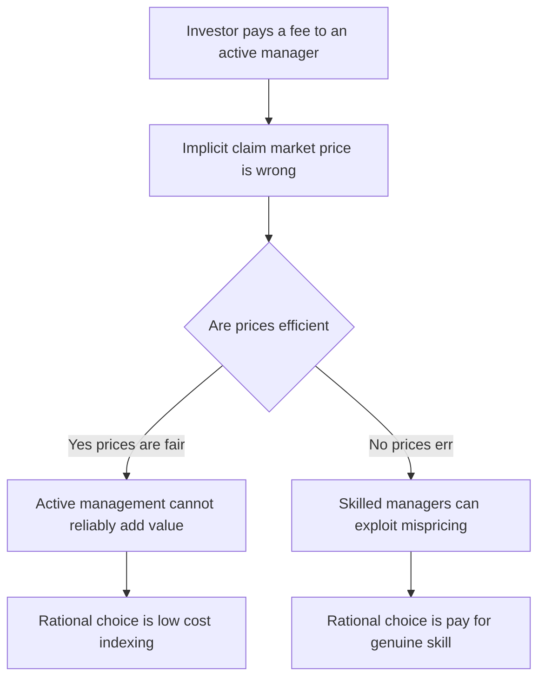
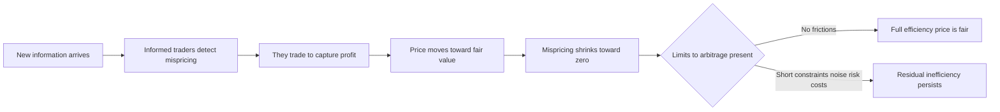
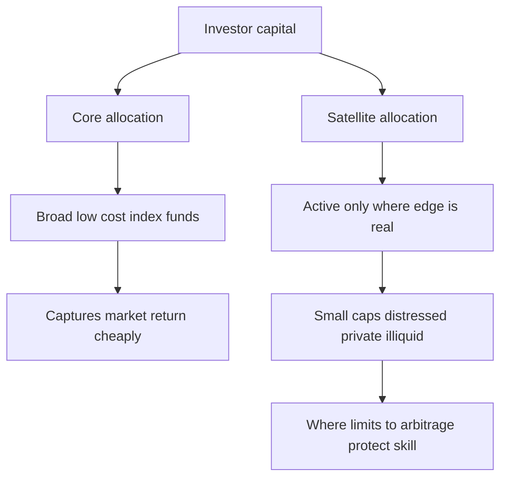

# Chapter 12 — Market Efficiency and the Active-Passive Debate

## 1. The Problem / Need

Every rupee an investor allocates rests on a single, unspoken bet: *"I can identify a security whose price is wrong and profit when the price corrects."* An equity research analyst building a discounted-cash-flow model, a fund manager overweighting IT stocks, a retail investor buying on a "hot tip" — all of them are implicitly claiming that the market price is *not* the fair value, and that they can see the gap.

But this raises an uncomfortable question. If markets are populated by thousands of intelligent, well-resourced, profit-hungry participants who all analyse the same public information, why would prices be systematically wrong? And if prices are *right*, what exactly is an active manager being paid to do?

This is not an abstract debate. It decides:

- **Career economics.** Whether the equity research / AMC / portfolio management industry creates value or merely redistributes it (minus fees).
- **Client outcomes.** Whether a saver should pay 1.5–2.5% a year for active management or 0.05–0.20% for an index fund.
- **Fee structures.** Whether "2 and 20" hedge fund economics are justified.
- **Regulation and disclosure.** How much investors need protecting from mispricing versus from their own overtrading.

The **Efficient Market Hypothesis (EMH)** is the theory that formalises "prices are right." The **active–passive debate** is the practical war fought over how right they are. An interview-ready analyst must be able to argue *both* sides with data, because the honest answer — markets are *mostly* efficient, *sometimes* not, and *reliably beating* them net of fees is very hard — is exactly what separates a thoughtful professional from a salesperson.

*Figure 12.1 — The central tension that market efficiency resolves.*

## 2. The Core Idea

The Efficient Market Hypothesis, articulated most influentially by **Eugene Fama (1970)**, states:

> **A market is efficient if security prices fully and instantaneously reflect all available and relevant information.**

The intuition is a competition argument, not a claim that investors are individually smart. Suppose a piece of good news arrives about a company. If even a *handful* of profit-seeking traders react, they buy until the price rises to the point where the news is no longer a bargain. Competition among informed traders drives the price to fair value almost immediately. The consequence is startling:

> **In an efficient market, price changes are unpredictable — they follow a "random walk" — because prices only move on *new* information, and new information is by definition unforecastable.**

If tomorrow's price move were predictable from today's information, someone would have already traded on it today, moving the price now. So the very act of smart investors *searching* for mispricing is what *eliminates* mispricing. This is the deep, almost paradoxical, core of EMH.

Two important refinements:

1. **Efficiency does not mean prices are always *correct* — it means they are *unbiased* and *not systematically exploitable*.** Prices can be wrong; they just can't be *predictably* wrong in a way you can trade profitably after costs.
2. **The Grossman–Stiglitz paradox (1980):** if prices reflected *all* information perfectly, no one would be paid to gather information, so no one would — and then prices *couldn't* reflect information. Efficiency must therefore be *incomplete*: there must be just enough mispricing to compensate the analysts whose work removes it. Markets are in an "efficiently inefficient" equilibrium.

## 3. Why / How It Works

The mechanism that enforces efficiency is **arbitrage and competition among informed traders**. Walk through the causal chain:

1. **Information is cheap to disseminate but valuable to act on first.** Public information (earnings, RBI policy, oil prices) reaches everyone; the profit lies in reacting fastest and most accurately.
2. **Marginal informed traders set the price.** The price is not the "average opinion" — it is set at the margin by the best-informed, highest-conviction traders willing to transact. A retail investor's ignorance doesn't push the price around if a hedge fund stands ready to take the other side.
3. **Arbitrage removes riskless mispricing.** If two identical claims trade at different prices (e.g., a stock and its ADR, or Nifty spot vs futures), traders buy cheap / sell dear until the gap closes to transaction-cost bounds.
4. **The feedback loop is self-defeating for the searcher.** The more capital chases an anomaly, the smaller it becomes. Published anomalies decay after publication (McLean and Pontiff, 2016, found roughly a 30–58% post-publication decay in documented anomalies).

For this to *fail* — for inefficiency to persist — you need frictions that block the loop: **limits to arbitrage**. Short-selling constraints, funding risk, noise-trader risk (prices can move *against* the arbitrageur before converging, forcing liquidation — the "markets can stay irrational longer than you can stay solvent" problem), and transaction costs. Where these frictions are large, mispricing can survive. This is the single most important idea for a working analyst: **inefficiency lives where arbitrage is hardest, not where analysis is easiest.**

*Figure 12.2 — The self-correcting loop that produces efficiency, and the frictions that let it fail.*

## 4. Full Content — Forms, Formulas, and Models

### 4.1 The Three Forms of Efficiency

Fama classified efficiency by the *information set* that prices reflect. The forms are nested: each stronger form contains the weaker ones.

| Form | Information reflected in price | If true, then useless… | Tested by |
|------|-------------------------------|------------------------|-----------|
| **Weak** | All *past prices and volume* (market data) | Technical analysis | Serial correlation, runs tests, filter rules, momentum |
| **Semi-strong** | All *publicly available* information (financials, news, macro) | Fundamental analysis on public data | Event studies (earnings, splits, M&A) |
| **Strong** | *All* information, including private / insider | Even insider trading | Insider-trade profitability, fund manager records |

- **Weak-form** says charting is futile: past prices contain no usable predictive signal. Nested consequence: prices are a random walk.
- **Semi-strong** says that by the time you read the annual report, the price already embeds it. Your careful DCF only pays if your *interpretation* is genuinely superior *and* correct — a much higher bar.
- **Strong-form** is almost certainly *false* in reality: insiders demonstrably earn abnormal returns, which is precisely why insider trading is illegal (SEBI PIT Regulations, 2015, in India; SEC Rule 10b-5 in the US). The empirical consensus: markets are *close* to semi-strong efficient, clearly *not* strong-form efficient, and *mostly* weak-form efficient with documented exceptions (momentum).

### 4.2 The Random Walk and Martingale Model

Formally, weak-form efficiency implies prices follow a **submartingale**:

$$E[P_{t+1} \mid \Omega_t] = P_t (1 + E[r])$$

where $\Omega_t$ is the information set of past prices and $E[r]$ is the required return. Expected excess returns, conditional on past prices, are zero — you cannot use price history to earn abnormal profit. The **random walk with drift** version:

$$P_{t+1} = P_t + \mu + \varepsilon_{t+1}, \qquad E[\varepsilon_{t+1} \mid \Omega_t] = 0$$

Returns are serially uncorrelated: $\text{Corr}(r_t, r_{t+k}) = 0$ for $k \neq 0$.

### 4.3 The Joint-Hypothesis Problem

You can never test efficiency alone. To say a return is "abnormal," you need a model of what "normal" (required) return should be — usually CAPM or a factor model. So every test is a **joint test** of (a) market efficiency *and* (b) the asset-pricing model. If you find "abnormal" returns, you cannot tell whether the market is inefficient *or* your risk model is wrong. This is Fama's own caveat, and it is why the value and size "anomalies" are so contested — are they inefficiencies, or just compensation for risk the CAPM misses?

### 4.4 Measuring Abnormal Return — Alpha

The workhorse for judging whether skill exists is **Jensen's alpha**, the intercept from regressing a portfolio's excess returns on the market's:

$$R_p - R_f = \alpha_p + \beta_p (R_m - R_f) + \varepsilon_p$$

- $\alpha_p > 0$: outperformance *after* adjusting for market risk — the statistical signature of skill (or luck, or a missing risk factor).
- Extended to the **Fama–French / Carhart** models, alpha is measured net of size (SMB), value (HML), and momentum (WML) factors:

$$R_p - R_f = \alpha_p + \beta_{mkt}(R_m - R_f) + \beta_s SMB + \beta_h HML + \beta_w WML + \varepsilon_p$$

If a manager's "outperformance" disappears once you control for these factors, they weren't skilled — they were just *tilted* toward known factors, which a cheap smart-beta fund could replicate.

### 4.5 Risk-Adjusted Performance Ratios

| Metric | Formula | Risk measure | Use |
|--------|---------|--------------|-----|
| **Sharpe ratio** | $S = \dfrac{R_p - R_f}{\sigma_p}$ | Total risk (SD) | Stand-alone portfolio; the whole wealth |
| **Treynor ratio** | $T = \dfrac{R_p - R_f}{\beta_p}$ | Systematic risk (beta) | A sub-portfolio within a diversified whole |
| **Jensen's alpha** | $\alpha = R_p - [R_f + \beta_p(R_m - R_f)]$ | Beta (via CAPM) | Absolute value added |
| **Information ratio** | $IR = \dfrac{\alpha_p}{\sigma(\varepsilon_p)}$ | Tracking error | Skill per unit of active risk |

The **Information Ratio** is the professional's yardstick: active return divided by tracking error (the "active risk" taken to get it). A sustained IR above ~0.5 is good; above ~1.0 is elite and rare.

### 4.6 The Arithmetic of Active Management (Sharpe's Law)

William Sharpe's (1991) **"The Arithmetic of Active Management"** is a near-tautology that every professional must be able to recite:

> Before costs, the return on the *average* actively managed dollar equals the return on the *average* passively managed dollar (both hold the market in aggregate). Therefore, *after* costs, the average actively managed dollar must **underperform** the average passively managed dollar. This holds by arithmetic, in any market, efficient or not.

Because active and passive investors together *own the whole market*, and passive investors by construction hold the market portfolio, the active investors as a group *also* hold the market portfolio (the residual). Their gross return is identical to the index. Active managers charge more and trade more, so their *net* return, in aggregate, is lower. Active management can only be a *zero-sum game before costs and a negative-sum game after costs* — one manager's outperformance is another's underperformance. Not everyone can be above average.

### 4.7 The Anomalies — Cracks in the Wall

Documented, replicated deviations from EMH:

| Anomaly | Description | Efficiency threatened |
|---------|-------------|----------------------|
| **Momentum** | Past 3–12 month winners keep winning (Jegadeesh & Titman 1993) | Weak-form |
| **Value (low P/B, P/E)** | Cheap stocks beat glamour stocks long-term | Semi-strong |
| **Size** | Small caps historically outperform (weakened post-1980s) | Semi-strong |
| **Post-earnings-announcement drift (PEAD)** | Prices keep drifting in the direction of an earnings surprise for weeks | Semi-strong |
| **Low-volatility** | Low-beta stocks earn higher risk-adjusted returns — contradicts CAPM | Semi-strong |
| **Calendar (January, turn-of-month)** | Seasonal return patterns | Weak-form |
| **Accruals** | Firms with high accruals underperform | Semi-strong |
| **IPO / SEO underperformance** | New issues underperform for years | Semi-strong |

**Behavioural finance** (Kahneman, Tversky, Thaler, Shiller) supplies the demand-side explanation: overreaction, underreaction, anchoring, herding, and overconfidence generate the mispricings; limits to arbitrage let them survive. Momentum and PEAD look like *underreaction*; long-run reversals and bubbles look like *overreaction*.

### 4.8 The Active–Passive Spectrum

*Figure 12.3 — Investment strategies arranged by the efficiency belief they require.*

## 5. Worked Examples

### Example 1 — Random walk and the futility of a filter rule

**Setup.** A stock's daily log returns are drawn independently with mean $\mu = 0.0004$ (about 10% annualised over 250 days) and daily SD $\sigma = 0.015$. A "chartist" proposes a filter rule: *buy after any up-day, expecting momentum.* Is there an edge?

**Analysis.** Under weak-form efficiency, returns are serially uncorrelated: $\text{Corr}(r_t, r_{t+1}) = 0$. The expected return tomorrow, *given* an up-day today, equals the unconditional mean:

$$E[r_{t+1} \mid r_t > 0] = \mu = 0.0004$$

The up-day carries **no information** about tomorrow. The rule generates the same expected 0.04% daily gross return as buy-and-hold — but each trade incurs, say, 0.10% round-trip cost. If the rule trades ~120 times a year:

- Buy-and-hold gross ≈ $250 \times 0.0004 = 10.0\%$; costs ≈ one trade ≈ 0.10%; **net ≈ 9.9%**.
- Filter rule gross ≈ 10.0% (same, no edge); costs ≈ $120 \times 0.10\% = 12.0\%$; **net ≈ 10.0% − 12.0% = −2.0%**.

**Reconciliation / self-check.** The gross returns match (as they must under a random walk — the rule can't manufacture edge from noise). The *only* difference is transaction costs, which the churning rule multiplies. The chartist doesn't just fail to win; the trading friction turns a +10% asset into a −2% strategy. This is weak-form efficiency biting in practice. ✓

### Example 2 — Alpha, and whether the "star" manager has skill

**Setup.** A fund returned $R_p = 16\%$ last year. The risk-free rate $R_f = 6\%$ (Indian 10-year G-Sec neighbourhood), the market (Nifty) returned $R_m = 13\%$, and the fund's beta is $\beta_p = 1.4$. Fund SD = 22%, market SD = 15%. Did the manager add value?

**Step 1 — CAPM required return.**
$$E[R_p] = R_f + \beta_p (R_m - R_f) = 6\% + 1.4 \times (13\% - 6\%) = 6\% + 1.4 \times 7\% = 6\% + 9.8\% = 15.8\%$$

**Step 2 — Jensen's alpha.**
$$\alpha = R_p - E[R_p] = 16\% - 15.8\% = +0.2\%$$

**Step 3 — Sharpe ratios (total-risk view).**
$$S_p = \frac{16 - 6}{22} = \frac{10}{22} = 0.455, \qquad S_m = \frac{13 - 6}{15} = \frac{7}{15} = 0.467$$

**Step 4 — Treynor ratios (systematic-risk view).**
$$T_p = \frac{16 - 6}{1.4} = 7.14\%, \qquad T_m = \frac{13 - 6}{1.0} = 7.00\%$$

**Reconciliation / self-check.** The three metrics tell a *nuanced, consistent* story:

- **Alpha = +0.2%** — a whisper of outperformance, easily within noise.
- **Treynor** (7.14% > 7.00%) agrees the fund beat the market *per unit of beta* — because alpha is positive, Treynor *must* exceed the market's, and it does. ✓ (Alpha > 0 ⟺ Treynor > market Treynor, always.)
- **Sharpe** (0.455 < 0.467) says the fund *lost* on a total-risk basis. Why the disagreement? The fund's SD (22%) is higher than beta alone predicts. If it were perfectly diversified, its SD would be $\beta_p \times \sigma_m = 1.4 \times 15\% = 21\%$; the actual 22% carries $\sqrt{22^2 - 21^2} = \sqrt{484-441} = \sqrt{43} \approx 6.6\%$ of *diversifiable* risk that Treynor and alpha ignore but Sharpe penalises. 

**Verdict:** The "16% vs 13% — beat the market!" headline collapses under risk adjustment. The 0.2% alpha is noise; the fund took extra, poorly diversified risk. This is exactly why an interviewer wants risk-adjusted numbers, not raw returns. ✓

### Example 3 — The arithmetic of active management, made concrete

**Setup.** An index returns 12% gross. The market splits: 70% of assets are passive (fee 0.10%), 30% active (average fee 1.20%, plus 0.40% trading drag). What does each cohort net, and what fraction of active managers *can* beat the index net of fees?

**Step 1 — Gross returns.** Passive holds the index: gross 12.0%. By Sharpe's arithmetic, active investors *in aggregate* also hold the market residual, so their aggregate gross is *also* 12.0%.

**Step 2 — Net returns.**
- Passive net = $12.0\% - 0.10\% = 11.90\%$.
- Active net (average) = $12.0\% - 1.20\% - 0.40\% = 10.40\%$.

**Step 3 — The gap.** The average active investor underperforms the average passive investor by $11.90\% - 10.40\% = 1.50\%$ per year — exactly the fee-plus-cost differential.

**Step 4 — Can *any* active manager win?** Yes, individually. Active is zero-sum *gross*: for one manager to earn +2% gross alpha, others must collectively earn −2%. But every active manager pays the 1.6% cost drag. So to beat the 11.90% passive net, a manager needs *gross* alpha above +1.6% (they need 12% + 1.5% ≈ 13.5% gross to net 11.9%). 

**Reconciliation / self-check.** Over 20 years this 1.5% annual gap compounds brutally. ₹100 at 11.90% → $100 \times 1.119^{20} = ₹945$. At 10.40% → $100 \times 1.104^{20} = ₹722$. The passive investor ends with **31% more wealth** — from a 1.5% annual edge, purely from lower costs, no forecasting skill required. This is the compounding case for indexing. ✓ (Cross-check: SPIVA data consistently shows ~80–90% of active large-cap funds trail their benchmark over 10–15 years — the arithmetic made empirical.)

## 6. Connections

- **CAPM and factor models (Ch. on asset pricing).** Efficiency is tested *through* these models — the joint-hypothesis problem. Alpha is the residual after the model explains "normal" return. Fama–French factors reframed many "anomalies" as risk premia, partially rescuing efficiency.
- **Portfolio theory (Markowitz).** If markets are efficient, the market portfolio is mean-variance efficient and the optimal strategy is to hold it — the intellectual foundation of indexing.
- **Behavioural finance.** The demand-side counterweight to EMH: cognitive biases *create* mispricing; limits to arbitrage *preserve* it. EMH and behavioural finance are the thesis and antithesis of modern asset pricing.
- **Fixed income & derivatives.** Arbitrage (put-call parity, spot-futures parity, no-arbitrage bond pricing) is the *enforcement mechanism* of efficiency — the cleanest, near-riskless version.
- **Performance attribution (next material).** Sharpe, Treynor, IR, and alpha are how you *audit* an active manager's claim to skill.
- **Corporate finance.** Semi-strong efficiency justifies event studies used to measure the value impact of M&A, dividends, and buybacks.

## 7. Key Terms

- **Efficient Market Hypothesis (EMH):** prices fully reflect available information.
- **Weak / Semi-strong / Strong form:** efficiency w.r.t. past prices / all public info / all info including private.
- **Random walk / martingale:** price changes are unpredictable; expected abnormal return conditional on the information set is zero.
- **Joint-hypothesis problem:** any efficiency test is simultaneously a test of the asset-pricing model used.
- **Alpha (Jensen's):** return in excess of the CAPM-required return; the signature of skill (or luck / model error).
- **Information ratio:** alpha ÷ tracking error — active return per unit of active risk.
- **Anomaly:** a persistent, replicable pattern of abnormal returns (momentum, value, size, PEAD).
- **Limits to arbitrage:** frictions (short constraints, noise-trader risk, costs) that stop traders from correcting mispricing.
- **Grossman–Stiglitz paradox:** perfectly efficient prices would leave no incentive to gather information, so some inefficiency must persist.
- **Sharpe's arithmetic:** active management is zero-sum before costs, negative-sum after.
- **Tracking error:** SD of the difference between portfolio and benchmark returns.
- **Smart beta / factor investing:** rules-based tilts toward documented factors — a middle ground between active and passive.

## 8. Common Confusions

1. **"Efficient means the price is always right / fair value."** No. Efficient means *not predictably exploitable* and *unbiased*. Prices can be wrong; they just aren't wrong in a way you can systematically monetise after costs. Bubbles don't automatically disprove EMH — profiting from spotting one *before* it bursts does.

2. **"EMH says all investors are rational."** No. EMH needs only *enough* rational, well-funded traders at the margin. Plenty of irrational investors can exist; if arbitrageurs can trade against them cheaply, prices stay efficient.

3. **"Some funds beat the market, so EMH is false."** With thousands of funds, pure luck guarantees many winners — the "lucky coin-flippers." The test is *persistence* and *statistical significance* of alpha after fees and factor adjustment, not the existence of past winners.

4. **"Random walk means the market goes nowhere."** No — it's a random walk *with drift*. Prices trend up over time (the equity risk premium); it's the *deviations* around the drift that are unpredictable.

5. **"Passive investing free-rides and would break if everyone indexed."** Correct in the limit — if *everyone* indexed, no one would do price discovery and inefficiency would explode, restoring active's edge. This is self-limiting: it guarantees active management never fully dies. Today passive is ~50% of US equity fund assets, still far from that limit.

6. **"Technical analysis is proven useless by weak-form EMH."** Mostly, but *momentum* is a robust, published exception — a price-based signal with predictive power. The nuance matters: charting patterns fail; systematic momentum survives (though it decays as capital crowds in).

7. **"Alpha proves skill."** Only if it survives (a) factor adjustment — is it *really* alpha or a value/size/momentum tilt? — and (b) a statistical-significance test over a long enough record. Most "alpha" is disguised factor beta.

## 9. Recap

- The **EMH** says prices reflect available information; competition among informed traders is the enforcing mechanism, and it makes price changes a **random walk**.
- Efficiency comes in **three nested forms** — weak (past prices), semi-strong (public info), strong (all info). Evidence: markets are broadly weak and semi-strong efficient; strong-form is false (insiders profit).
- Every efficiency test is a **joint hypothesis** with an asset-pricing model, so "anomalies" are ambiguous — inefficiency *or* missing risk factors.
- **Anomalies** (momentum, value, size, PEAD, low-vol) and **behavioural finance** are the cracks; **limits to arbitrage** explain why cracks don't close.
- **Sharpe's arithmetic** is decisive: active management is zero-sum before costs, negative-sum after. On average, active must lose to passive by the fee differential — confirmed by SPIVA (80–90% of active funds trail over 10+ years).
- Skill is measured by **risk-adjusted metrics** — Sharpe, Treynor, alpha, and above all the **information ratio** — not raw returns.
- The practical synthesis: markets are **efficient enough** that *most* investors should index for the *core*, while genuine, scarce skill and inefficiency persist at the **margins** — small caps, distressed debt, private markets, and short horizons around information events.

*Figure 12.4 — The pragmatic verdict: a barbell of cheap core indexing plus selective active where inefficiency is real.*

## 10. Quick-Reference / Interview Points

**One-liner definition:** *A market is efficient if prices fully reflect available information, making abnormal returns unattainable on that information set after costs.*

**The three forms — instant recall:**
- Weak ⇒ technical analysis useless (past prices priced in).
- Semi-strong ⇒ fundamental analysis on public data useless (public info priced in).
- Strong ⇒ even insider info useless (empirically false).

**Killer formulas:**
- Sharpe $= (R_p - R_f)/\sigma_p$ — total risk.
- Treynor $= (R_p - R_f)/\beta_p$ — systematic risk.
- Alpha $= R_p - [R_f + \beta_p(R_m - R_f)]$ — value added.
- Information ratio $= \alpha / \text{tracking error}$ — the pro's skill metric.

**If asked "Are markets efficient?"** — Answer with a spectrum, not a yes/no: *"Broadly weak- and semi-strong efficient, definitely not strong-form. Efficient enough that the average active manager can't beat the index net of fees — that's Sharpe's arithmetic and SPIVA confirms it. But limits to arbitrage leave persistent pockets — momentum, small caps, distressed debt, illiquid and private markets, and short windows around information events — where skill can be paid. So: index the core, be active only where you can articulate a specific, structural reason the inefficiency survives."*

**If asked "Why can't everyone just index?"** — Grossman–Stiglitz: someone must do price discovery to be paid; if all indexed, inefficiency would explode and revive active. Passive is self-limiting, so active never fully dies.

**If asked "How do you tell skill from luck?"** — Persistence over long horizons, statistical significance of alpha, and survival *after* factor adjustment (Fama–French–Carhart). Most "alpha" is disguised factor beta replicable by cheap smart-beta.

**The three anomalies to name-drop:** momentum (weak-form crack), value and size (Fama–French factors — risk or mispricing?), and post-earnings-announcement drift (underreaction to public news).

**The single most important practical takeaway:** *Inefficiency lives where arbitrage is hardest, not where analysis is easiest.* Point your active effort at frictions — short-sale constraints, illiquidity, noise-trader risk — not at large, liquid, heavily-covered stocks where a hundred analysts already priced the news.

**The compounding punchline:** a 1.5% annual fee/cost drag compounds to ~30% less terminal wealth over 20 years. Costs are the one variable an investor controls with certainty; alpha is not. That asymmetry is the entire case for low-cost investing.
