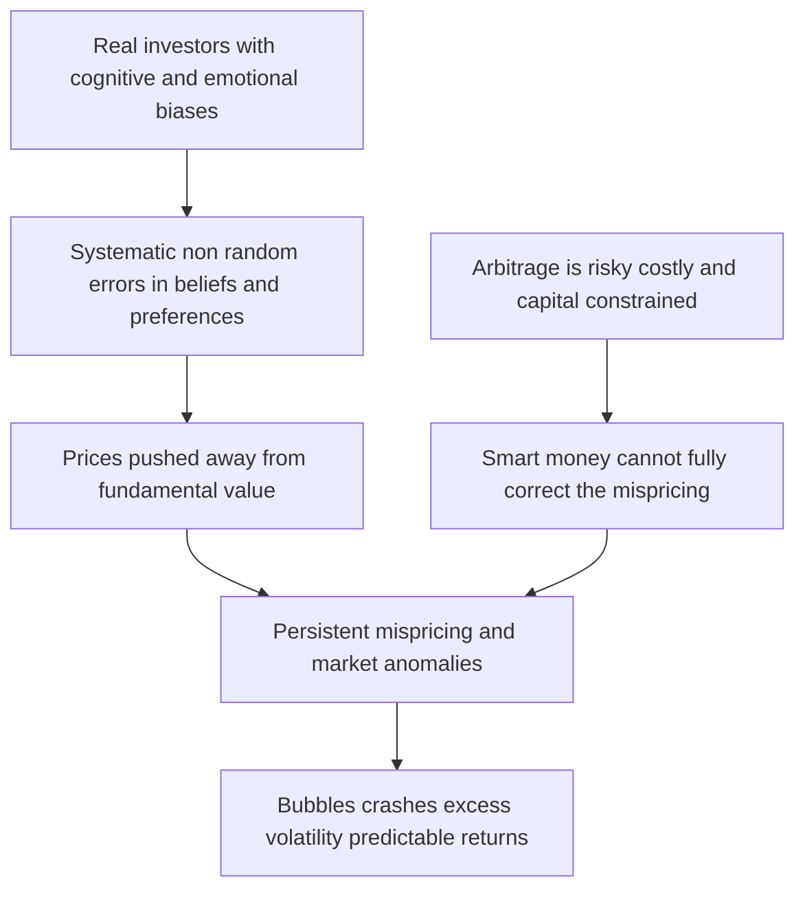
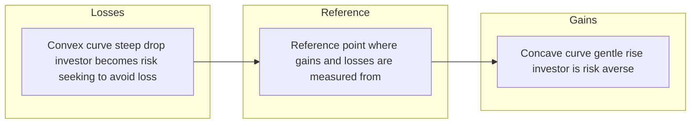
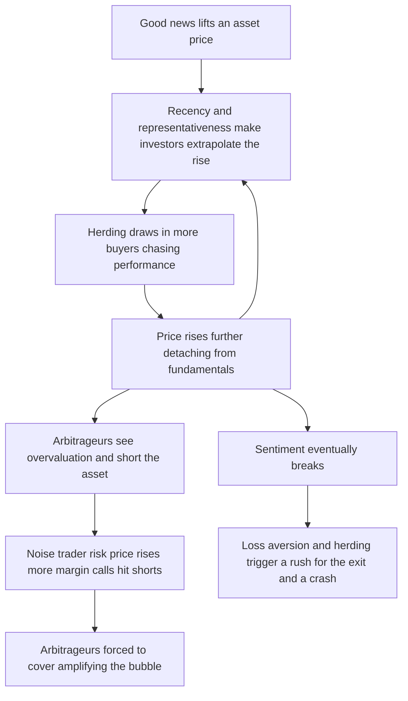

# Chapter 13 — Behavioral Finance

## 1. The Problem / The Need

Classical finance is built on an elegant fiction: the *homo economicus*, a perfectly rational agent who has stable, well-defined preferences, processes all available information without error, updates beliefs according to Bayes' rule, and acts purely to maximize expected utility. On the backs of such agents, Eugene Fama's Efficient Market Hypothesis (EMH) declares that prices always reflect all available information, so nobody can consistently beat the market except by luck or by taking on more risk.

There is only one problem. Actual human beings do not behave like this — and neither, in aggregate, do markets.

If markets were perfectly efficient and investors perfectly rational, several things simply should not happen. Yet they do, repeatedly and at enormous scale:

- **Bubbles and crashes.** The dot-com mania of 1999–2000 valued companies with no revenue at billions. Pets.com IPO'd and collapsed inside a year. In 2008, subprime assets rated AAA imploded. In 2021, GameStop went from $4 to $483 on a wave of Reddit-driven retail buying with no change in fundamentals.
- **Excess volatility.** Robert Shiller showed in 1981 that stock prices swing far more than the present value of subsequent dividends can justify. Fundamentals are smooth; prices are hysterical.
- **Predictable patterns.** Momentum, the January effect, post-earnings-announcement drift, and the value premium are all documented regularities that a truly efficient market should have arbitraged away.
- **The "closed-end fund puzzle."** Identical baskets of assets trade at persistent discounts or premiums to their net asset value depending on investor sentiment.

Something is missing from the rational model. That something is *psychology*. Behavioral finance is the discipline that reinserts the real, cognitively-limited, emotion-driven human being back into the theory of asset prices — and in doing so, explains phenomena that the standard model waves away as "noise."

For an aspiring investment professional, this is not academic garnish. It is a working toolkit. Understanding *why* investors err lets you (a) avoid destroying your own returns, (b) recognize when the crowd has mispriced an asset, and (c) answer the interview question every buy-side firm eventually asks: *"If markets are efficient, why does your fund exist?"*

## 2. The Core Idea

Behavioral finance rests on a single, testable claim:

> **Asset prices are set by real humans who are subject to systematic, predictable cognitive and emotional biases, and whose ability to arbitrage those errors away is limited. Therefore prices can deviate from fundamental value — sometimes for a long time.**

There are two pillars here, and *both* are needed:

1. **Limited rationality (psychology).** Investors do not process information correctly. Their errors are not random — random errors would cancel out in aggregate. The errors are *systematic*, meaning most people lean the same wrong way at the same time, so they push prices in a common direction.

2. **Limits to arbitrage.** In classical theory, even if some investors ("noise traders") are irrational, smart "arbitrageurs" will trade against them, correct the price, and pocket a riskless profit. Behavioral finance argues that arbitrage is *risky, costly, and capital-constrained*. Mispricings can persist and even *worsen* before they correct — as Keynes put it, "the market can remain irrational longer than you can remain solvent."

The interplay is the whole game. Biases create the mispricing; limits to arbitrage let it survive. Remove either pillar and the standard model reasserts itself.

*Figure 1 — The two-pillar architecture of behavioral finance.*

## 3. Why / How It Works

### 3.1 Two systems of thinking

Daniel Kahneman (Nobel 2002) popularized the **dual-process** model of cognition:

- **System 1** is fast, automatic, intuitive, emotional, and effortless. It answers "what is 2 + 2?" and it recoils from a snake. It is also where most biases live.
- **System 2** is slow, deliberate, logical, and effortful. It answers "what is 17 × 24?" and it does careful expected-value math.

The trouble is that System 2 is *lazy*. It consumes glucose and attention, so the brain defaults to System 1 wherever it can. Under time pressure, information overload, or emotional arousal — precisely the conditions of financial markets — System 1 takes the wheel. Fast, intuitive judgments are excellent for dodging predators on the savannah and disastrous for pricing a 30-year cash-flow stream.

### 3.2 Heuristics: useful shortcuts that misfire

Because the world is complex and cognition is scarce, the mind uses **heuristics** — rules of thumb. Amos Tversky and Kahneman identified three that dominate financial judgment:

- **Representativeness** — judging probability by similarity to a stereotype, ignoring base rates. "This company looks like the next Amazon, so it will be the next Amazon." (It probably won't; most won't.)
- **Availability** — judging probability by how easily examples come to mind. After a plane crash dominates the news, people overestimate crash risk. After a market crash, investors overestimate the odds of another one and flee equities at the bottom.
- **Anchoring and adjustment** — starting from an arbitrary reference number and adjusting insufficiently. (Detailed below.)

Heuristics are not stupidity. They are *adaptive* — they work most of the time, cheaply. Behavioral finance simply maps out the specific, repeatable situations where they fail in markets.

### 3.3 Why the errors don't cancel out

The crucial insight is **correlation of errors**. If 10,000 investors each made an independent random mistake, the mistakes would average to roughly zero and prices would still be efficient. But biases are *shared*. Human brains are wired similarly, exposed to the same news, and susceptible to the same emotional contagion. When fear grips a market, it grips almost everyone at once. Correlated errors do not cancel — they *accumulate*, moving the whole market in one direction. That is the mechanism by which individual psychology becomes an aggregate price effect.

## 4. Full Content

### 4.1 Prospect Theory — the new theory of choice

The intellectual heart of behavioral finance is **Prospect Theory** (Kahneman & Tversky, 1979), which replaced expected utility theory as a *descriptive* model of how people actually choose under risk. Four ideas define it.

**(a) Reference dependence.** People do not evaluate outcomes in terms of final wealth (as utility theory assumes). They evaluate *changes* relative to a **reference point** — usually the status quo or the purchase price. A portfolio worth ₹1 crore feels like triumph to someone who started at ₹50 lakh and like catastrophe to someone who started at ₹2 crore. Same wealth, opposite emotion.

**(b) Loss aversion.** Losses hurt roughly **2 to 2.5 times** more than equivalent gains feel good. Losing ₹10,000 inflicts more pain than winning ₹10,000 delivers pleasure. This asymmetry is the single most important fact in behavioral finance.

**(c) Diminishing sensitivity / an S-shaped value function.** The value function is **concave for gains** (risk-averse — you'll take a sure ₹900 over a gamble at ₹1,000) but **convex for losses** (risk-seeking — you'll gamble to avoid a sure loss). The difference between +₹100 and +₹200 feels bigger than between +₹1,100 and +₹1,200.

**(d) Probability weighting.** People do not use true probabilities. They **overweight small probabilities** (which is why they buy both lottery tickets and insurance) and **underweight moderate-to-high probabilities**.

*Figure 2 — The S-shaped prospect theory value function versus classical utility.*

The value function can be written compactly as:

$$
v(x) = \begin{cases} x^{\alpha} & \text{if } x \ge 0 \\ -\lambda(-x)^{\beta} & \text{if } x < 0 \end{cases}
$$

where $x$ is the gain or loss relative to the reference point, $\alpha, \beta \approx 0.88$ (diminishing sensitivity), and $\lambda \approx 2.25$ is the **loss-aversion coefficient**. That single parameter $\lambda > 1$ is what bends the curve and drives the **disposition effect**, the **equity premium puzzle**, and much of investor misbehavior.

### 4.2 The catalogue of biases

Biases fall into two families: **cognitive** (faulty reasoning, often correctable with information) and **emotional** (feelings that override reason, harder to fix). Here are the ones every investor must know.

| Bias | What it is | Market consequence |
|---|---|---|
| **Overconfidence** | Overestimating one's knowledge, precision, and control | Excessive trading, under-diversification, ignoring risk |
| **Anchoring** | Over-relying on an initial reference number | Sticky valuations, slow reaction to news, "it must come back to my buy price" |
| **Loss aversion** | Losses hurt ~2x more than gains please | Holding losers, selling winners, panic selling |
| **Herding** | Following the crowd rather than one's own analysis | Bubbles, crashes, momentum, fads |
| **Framing** | Decisions change with how a choice is worded | Inconsistent risk-taking, product mis-selling |
| **Recency** | Overweighting the most recent events | Chasing performance, extrapolating trends |
| **Confirmation** | Seeking evidence that supports prior beliefs | Ignoring red flags, echo chambers, thesis lock-in |
| **Mental accounting** | Treating money differently by arbitrary category | Irrational spending, "house money" gambling |
| **Availability** | Judging odds by ease of recall | Overreacting to vivid news |
| **Hindsight** | "I knew it all along" after the fact | False confidence, poor learning |
| **Status quo / endowment** | Overvaluing what one already owns | Inertia, failure to rebalance |
| **Regret aversion** | Avoiding action to avoid future regret | Paralysis, staying in cash, refusing to sell |

Let us go deeper on the seven the syllabus flags.

**Overconfidence.** Ask a room of drivers whether they are above-average; roughly 80% say yes. Investors are worse. Overconfidence has three flavors: *overprecision* (confidence intervals too narrow), *overestimation* (thinking you're better than you are), and *overplacement* (thinking you're better than others). Barber and Odean's famous study of 66,000 brokerage accounts (2000) found the most active traders earned **6.5 percentage points per year less** than the market after costs — and that men traded 45% more than women and earned correspondingly less. The mechanism: overconfidence → overtrading → transaction costs and bad timing eat returns. Overconfidence typically *rises* after a run of gains (people credit skill, not luck), which is exactly when caution is most needed.

**Anchoring.** In a classic experiment, subjects spun a rigged wheel landing on 10 or 65, then estimated the percentage of African nations in the UN. Those who saw 65 guessed far higher — despite the number being visibly random. In markets, the anchor is often the **purchase price** ("I'll sell when it gets back to what I paid") or a **52-week high** or an analyst's **round-number target**. Anchoring makes valuations sticky and causes **underreaction** to genuine news, because the mind refuses to move far from its anchor.

**Loss aversion & the disposition effect.** Because losses hurt disproportionately, investors **hold losing stocks too long** (selling would "realize" the painful loss and admit a mistake) and **sell winners too soon** (to lock in the pleasant gain before it evaporates). This is the **disposition effect** (Shefrin & Statman, 1985). It is exactly backwards from optimal tax behavior — you should harvest losses and let winners run — and it degrades returns, because winners tend to keep winning (momentum) and losers to keep losing.

**Herding.** Humans are social animals; there is safety and status in the crowd. Herding has both an *informational* basis ("everyone else is buying — maybe they know something") and a *reputational* basis (a fund manager who is wrong alongside everyone else keeps her job; one who is wrong alone gets fired — "it is better to fail conventionally"). Herding is the engine of **bubbles**: rising prices attract buyers, whose buying raises prices further, in a self-reinforcing loop detached from fundamentals.

**Framing.** Tversky and Kahneman's "Asian disease problem": people told a program "saves 200 of 600 lives" overwhelmingly choose it; people told the same program means "400 of 600 die" reject it. Identical facts, opposite choices — driven purely by the gain frame versus the loss frame. In finance, framing explains why "80% of funds beat this benchmark" sells better than "20% underperform," and why a stock quoted as "down 30% from its high" feels different from the same stock quoted as "up 15% this year."

**Recency.** The mind gives outsized weight to what just happened. After three good years, investors extrapolate them forever and pile in at the top; after a crash, they assume the pain is permanent and sell at the bottom. Recency bias is why retail fund flows are notoriously **procyclical** — money floods into asset classes *after* they have already risen. Morningstar's "behavior gap" studies repeatedly show the *dollar-weighted* return investors actually earn trailing the *time-weighted* return of the very funds they own, precisely because they buy high and sell low.

**Confirmation.** Once we hold a thesis ("this stock is a winner"), we hunt for supporting evidence and dismiss contradicting evidence. We read the bullish analysts, follow the bullish forums, and rationalize the bad quarter. Confirmation bias creates **thesis lock-in** and is why disciplined investors deliberately seek out the *bear case* and pre-mortem their own ideas.

### 4.3 From biases to anomalies and mispricing

The payoff of all this psychology is that it *predicts* the market anomalies that embarrass the EMH.

- **Underreaction → Momentum & Post-Earnings-Announcement Drift (PEAD).** Anchoring and conservatism make investors slow to fully incorporate news. So prices drift in the direction of the surprise for weeks or months. Stocks that beat earnings keep rising (Jegadeesh & Titman, 1993 documented that past 3–12 month winners outperform for the next 3–12 months).
- **Overreaction → Long-term Reversal & the Value Premium.** Representativeness makes investors extrapolate too far — they overprice "glamour" growth stocks and underprice beaten-down "value" stocks. Over 3–5 years this reverses: De Bondt & Thaler (1985) showed prior losers outperform prior winners. Fama and French had to add a *value* (HML) factor to their model to capture returns their efficient-market framework couldn't otherwise explain.
- **Sentiment → Excess volatility, bubbles, closed-end fund discounts.** When collective mood swings, prices swing more than fundamentals — Shiller's excess volatility. Closed-end funds trade below NAV when retail sentiment is bearish (Lee, Shleifer, Vishny, 1991), a direct fingerprint of noise traders.
- **The Equity Premium Puzzle.** Stocks have historically returned ~5–6% more than bonds — far more than plausible risk aversion justifies. Benartzi and Thaler's **myopic loss aversion** explains it: loss-averse investors who check their portfolios frequently see many small losses, feel the ~2.25× pain, and demand a fat premium to hold stocks at all.

### 4.4 Limits to arbitrage — why smart money can't fix it

If mispricings are real, why don't hedge funds instantly erase them? Because arbitrage is not the free lunch textbooks imply:

- **Fundamental risk** — the mispriced asset may have no perfect substitute to hedge with; the "cheap" stock might get cheaper because the whole sector falls.
- **Noise-trader risk** (Shleifer & Vishny, 1997) — the mispricing can *widen* before it corrects. An arbitrageur short an overpriced bubble stock can be wiped out by margin calls before being proven right. Julian Robertson's Tiger fund shorted dot-coms too early and was forced to close in early 2000, just before the crash he correctly predicted.
- **Implementation costs** — short-selling is expensive, sometimes impossible (hard-to-borrow), and subject to recall.
- **Capital / horizon constraints** — arbitrageurs manage *other people's money*. When positions move against them, clients redeem exactly when the opportunity is best, forcing liquidation at the worst time.

These frictions are why the EMH is not a law of nature but an *approximation* that breaks down precisely when biases are strongest and arbitrage weakest.

*Figure 3 — How a bubble is built and why arbitrage fails to stop it.*

## 5. Worked / Applied Examples

### Example 1 — Loss aversion quantified (Prospect Theory math)

You are offered a coin-flip: heads you win ₹1,000, tails you lose ₹800. Expected value = 0.5(1000) + 0.5(−800) = **+₹100**, a positive-EV bet a rational agent takes.

Now evaluate it through the prospect-theory value function with $\lambda = 2.25$ (ignore curvature for simplicity):

$$
V = 0.5 \times v(1000) + 0.5 \times v(-800) = 0.5(1000) + 0.5(-2.25 \times 800)
$$
$$
V = 500 + 0.5(-1800) = 500 - 900 = \mathbf{-400}
$$

The *subjective* value is **negative**, so a loss-averse person **rejects** a bet with positive expected value. This single calculation explains why so many investors refuse sensible risks, hoard cash, and demand an outsized equity premium. It also shows *how large* a gain must be to tempt them: to make $V = 0$, the winning payoff $W$ must satisfy $0.5W = 0.5(2.25 \times 800)$, i.e. **W = ₹1,800** — you must offer more than *double* the potential loss before the average person will flip the coin.

### Example 2 — The disposition effect destroys after-tax returns

Priya holds two stocks, each bought for ₹100:

- **Stock A** is now ₹130 (up ₹30, a winner).
- **Stock B** is now ₹70 (down ₹30, a loser).

She needs ₹70,000 in cash. The disposition effect predicts she sells the **winner (A)** — realizing a gain feels good and "locks in" the profit — while she clings to the **loser (B)**, unwilling to admit the mistake, telling herself "it'll come back to ₹100."

Why this is doubly wrong:

1. **Tax.** In most regimes (including India's capital-gains framework), selling the winner *triggers a taxable gain* while selling the loser would *harvest a deductible loss* to offset other gains. She has chosen the tax-*inefficient* option.
2. **Momentum.** Empirically winners tend to keep outperforming and losers to keep underperforming over 3–12 months. She has sold the stock more likely to rise and kept the one more likely to fall.

The rational move — sell the loser B, harvest the tax loss, retain the momentum winner A — is the exact opposite of what loss aversion whispers. Studies estimate the disposition effect costs individual investors on the order of **1.5–4% per year**.

### Example 3 — Framing changes a real investment decision

A financial advisor pitches the same product two ways:

- **Frame X (gain):** "This structured note has a **90% chance** of returning your capital plus 8%."
- **Frame Y (loss):** "This structured note has a **10% chance** of losing money."

The mathematics is identical. Yet clients accept Frame X far more often. Overweighting the salient outcome and the gain framing makes X feel safe and Y feel dangerous. Regulators know this — which is why disclosure rules increasingly *mandate* both frames (and standardized risk labels) to neutralize the manipulation.

Apply the same lesson to your own portfolio: a stock "down 40% from its 52-week high" (loss frame, anchored to the high) and a stock "up 12% over 12 months, trading at 14× earnings" (neutral frame) can be the *same stock*. Always re-frame a decision at least two ways before acting; if your choice flips, System 1 is driving.

### Example 4 — Overconfidence and the cost of overtrading

Rahul is confident he can pick stocks. He turns over his ₹10 lakh portfolio 200% per year (buys and sells the whole thing twice), paying 0.5% in brokerage, spread, and impact per round-trip. His timing skill is, honestly, zero — his gross return equals the market's 12%.

- **Gross return:** 12% → ₹1,20,000.
- **Trading costs:** 200% turnover × 0.5% × ₹10,00,000 = **₹10,000/year drag** = 1.0%.
- **Net return:** 11.0% → ₹1,10,000.

A disciplined index investor with 10% turnover pays 0.05% and nets 11.95%. Over 20 years, that ~0.95% annual gap compounds: ₹10 lakh at 11.95% grows to ~₹94.6 lakh; at 11.0% to ~₹80.6 lakh — a **₹14 lakh penalty** purely from overconfidence-driven activity, with no skill assumed at all. This is Barber and Odean's finding in miniature: *"Trading is hazardous to your wealth."*

## 6. Connections

Behavioral finance does not stand alone; it plugs into nearly every other topic in this guide.

- **Efficient Market Hypothesis (Ch. on market efficiency).** Behavioral finance is the loyal opposition to EMH. It doesn't claim markets are *always* wrong — arbitrage does work much of the time — but that efficiency is bounded and breaks under sentiment and arbitrage limits. The debate crystallized when Fama (EMH) and Shiller (behavioral) *shared* the 2013 Nobel Prize.
- **Modern Portfolio Theory & CAPM.** MPT assumes rational, mean-variance-optimizing investors. Behavioral portfolio theory (Shefrin & Statman) instead describes investors building portfolios in *mental-accounting layers* — a "safety" bucket and a "aspiration/lottery" bucket — which looks nothing like a single efficient frontier and explains why real portfolios are under-diversified.
- **Factor investing & anomalies.** The value and momentum factors that power quant strategies are, in the behavioral reading, *compensation for exploiting other investors' overreaction and underreaction*. Behavioral finance provides the economic story behind the statistics.
- **Risk management.** Value-at-Risk and stress testing exist partly because loss aversion and herding make crises fat-tailed and correlated — normal-distribution models systematically underestimate crash risk.
- **Corporate finance.** Managers are biased too: overconfident CEOs over-invest and over-acquire (Malmendier & Tate); anchoring shows up in M&A reference prices; behavioral signaling underlies dividend "stickiness."
- **Personal financial planning & product design.** "Nudge" architecture (Thaler & Sunstein) — auto-enrolment in pensions, default contribution escalation — uses status-quo bias *for* the investor rather than against them. Richard Thaler won the 2017 Nobel for exactly this bridge from bias to policy.

## 7. Key Terms

- **Behavioral finance** — the study of how psychological biases and limits to arbitrage cause prices to deviate from fundamental value.
- **Prospect theory** — descriptive theory of choice under risk featuring reference dependence, loss aversion, an S-shaped value function, and probability weighting.
- **Reference point** — the baseline (often purchase price or status quo) against which outcomes are judged as gains or losses.
- **Loss aversion** — losses loom larger than equivalent gains, with coefficient $\lambda \approx 2.25$.
- **Disposition effect** — the tendency to sell winners too early and hold losers too long.
- **Heuristic** — a mental shortcut (representativeness, availability, anchoring) that is efficient but error-prone.
- **System 1 / System 2** — fast intuitive vs. slow deliberate modes of thought.
- **Overconfidence** — overestimating one's knowledge, precision, or control; drives overtrading.
- **Anchoring** — over-reliance on an initial reference number when estimating.
- **Herding** — imitating the crowd rather than acting on independent analysis.
- **Framing effect** — decisions changing based on how equivalent information is presented.
- **Recency bias** — overweighting recent events and extrapolating them.
- **Confirmation bias** — seeking evidence that supports, and ignoring evidence that contradicts, one's prior belief.
- **Mental accounting** — treating money differently depending on its arbitrary source or label.
- **Myopic loss aversion** — frequent evaluation combined with loss aversion, explaining the equity premium puzzle.
- **Limits to arbitrage** — fundamental risk, noise-trader risk, and cost/capital constraints that prevent smart money from correcting mispricing.
- **Noise trader** — an investor trading on sentiment or non-information rather than fundamentals.
- **Anomaly** — an empirical return pattern (momentum, value, PEAD) not explained by the efficient-market/CAPM model.
- **Equity premium puzzle** — the historically large excess return of stocks over bonds, too big for standard risk aversion.
- **Nudge** — a choice-architecture design that steers behavior while preserving freedom of choice.

## 8. Common Confusions

**"Behavioral finance says markets are always wrong / EMH is useless."** No. It says markets are *usually roughly* efficient but deviate systematically under specific conditions. Arbitrage genuinely works most of the time. The claim is about *bounds* on efficiency, not its abolition.

**"Biases mean investors are stupid."** No. Biases are the by-products of *adaptive* mental shortcuts that serve us well in most of life. Highly intelligent professionals exhibit the same biases — sometimes more, because overconfidence scales with perceived expertise.

**"Loss aversion is the same as risk aversion."** Different. *Risk aversion* (classical) is about the curvature of utility over total wealth and applies everywhere. *Loss aversion* is about the asymmetric pain of losses versus gains around a reference point — and it makes people *risk-seeking* in the loss domain (gambling to break even), which pure risk aversion can never do.

**"If a bias is known, it disappears / can be arbitraged away."** Awareness helps but does not cure emotional biases — you can *know* about loss aversion and still feel the panic. And even fully-recognized mispricings persist because of limits to arbitrage. Knowing the dot-com bubble was a bubble in 1999 did not make it safe to short.

**"Momentum and value contradict each other."** They operate on different horizons and different biases: *underreaction* drives short-term momentum (3–12 months); *overreaction* drives long-term reversal / value (3–5 years). Both can be true simultaneously.

**"Herding is irrational for the individual."** Not necessarily — herding can be *individually* rational (protecting your job, inferring others' information) while being *collectively* destabilizing. That gap between private rationality and public outcome is precisely what makes bubbles hard to stop.

**"Behavioral finance is just a list of biases."** The list is the surface. The theory is the two-pillar structure (biases + limits to arbitrage) and the *predictions* it makes about anomalies. An interviewer wants the mechanism, not the vocabulary.

## 9. Recap

- Classical finance assumes rational agents and efficient markets; real investors are neither, and their errors are **systematic and correlated**, so they move prices rather than cancel out.
- Cognition runs on a lazy **System 2** and an intuitive, bias-prone **System 1**; under stress and overload, System 1 dominates financial decisions.
- **Prospect theory** — reference dependence, **loss aversion** ($\lambda \approx 2.25$), an S-shaped value function (risk-averse in gains, risk-seeking in losses), and probability weighting — is the descriptive replacement for expected utility.
- Core biases: **overconfidence** (overtrading), **anchoring** (sticky prices, underreaction), **loss aversion** (disposition effect), **herding** (bubbles), **framing** (inconsistent choices), **recency** (performance chasing), **confirmation** (thesis lock-in).
- These biases *predict* market **anomalies**: underreaction → **momentum & PEAD**; overreaction → **long-term reversal & the value premium**; sentiment → **excess volatility, bubbles, closed-end-fund discounts**; myopic loss aversion → the **equity premium puzzle**.
- Mispricings survive because of **limits to arbitrage**: fundamental risk, **noise-trader risk**, short-sale costs, and capital/horizon constraints — "the market can stay irrational longer than you can stay solvent."
- The practical edge: control your *own* biases (rules, checklists, index discipline) and, cautiously, exploit *others'* (value, momentum, contrarian sentiment) — while respecting that arbitrage is risky.

## 10. Quick-Reference / Interview Points

**The one-sentence definition.** "Behavioral finance explains asset prices using two facts the standard model ignores: investors have systematic psychological biases, and arbitrage is too limited to fully correct the resulting mispricings."

**If asked 'Does behavioral finance disprove EMH?'** "It refines it. Markets are approximately efficient because arbitrage works most of the time, but efficiency is *bounded*. When sentiment is extreme and arbitrage is constrained, prices detach from value — that's why Fama and Shiller shared the 2013 Nobel."

**The three-part bias framework to recite.**
1. *Belief biases* (how we form views): overconfidence, anchoring, representativeness, availability, confirmation, recency.
2. *Preference biases* (how we value outcomes): loss aversion, prospect theory, mental accounting, regret aversion.
3. *Social biases* (how we act with others): herding, information cascades.

**Numbers to have ready.**
- Loss-aversion coefficient $\lambda \approx 2.0$–$2.5$ (use 2.25).
- Barber & Odean: most active traders underperformed by ~6.5%/yr; men traded ~45% more than women.
- De Bondt & Thaler (1985): 3–5 year losers beat winners (overreaction).
- Jegadeesh & Titman (1993): 3–12 month winners beat losers (momentum/underreaction).
- Equity premium historically ~5–6%, "puzzlingly" large.

**Anomaly → bias mapping (memorize this table).**

| Anomaly | Driving bias | Horizon |
|---|---|---|
| Momentum / PEAD | Anchoring, conservatism (underreaction) | Short (3–12 mo) |
| Value premium / reversal | Representativeness (overreaction) | Long (3–5 yr) |
| Excess volatility & bubbles | Herding, recency, sentiment | Variable |
| Closed-end fund discounts | Noise-trader sentiment | Persistent |
| Equity premium puzzle | Myopic loss aversion | Structural |

**The disposition effect in one line.** "Investors sell winners too soon and hold losers too long — the opposite of both tax efficiency and momentum."

**Why mispricings persist (limits to arbitrage), four bullets.** Fundamental risk · noise-trader risk (it can get worse before it gets better) · short-sale/implementation costs · capital and client-redemption constraints.

**How a good investor uses this.**
- *Defense:* rules-based process, pre-commitment, checklists, systematic rebalancing, low turnover, seeking the bear case to fight confirmation bias, ignoring the purchase-price anchor.
- *Offense:* disciplined value and momentum tilts, contrarian positioning against sentiment extremes, patient capital that can outlast noise-trader risk.

**Killer closing line for an interview.** "The market is a voting machine in the short run and a weighing machine in the long run — behavioral finance is the theory of the voting, and limits to arbitrage is the theory of why the weighing takes so long."
