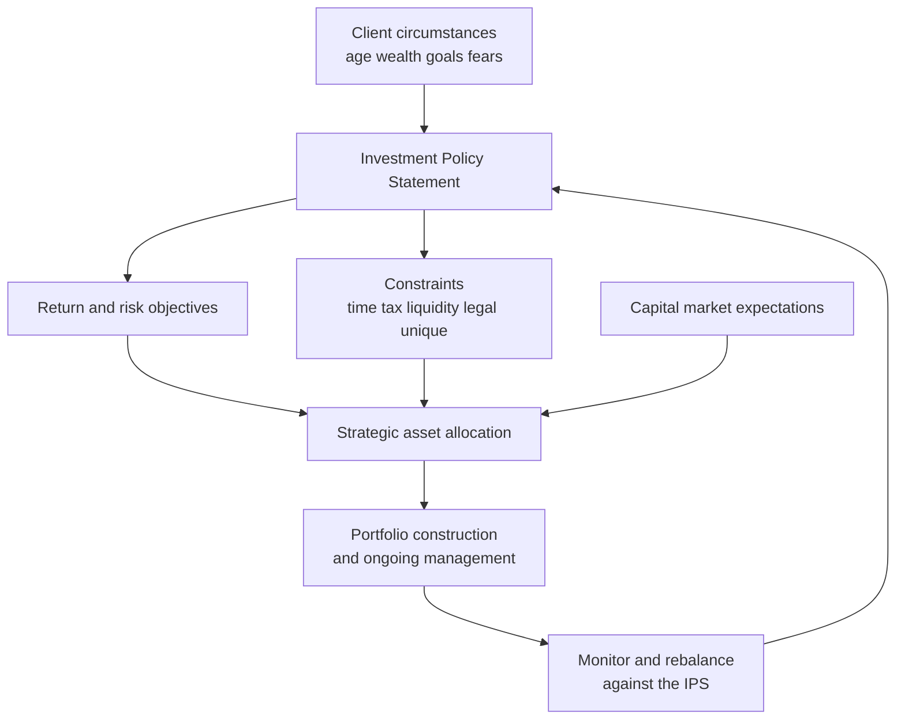
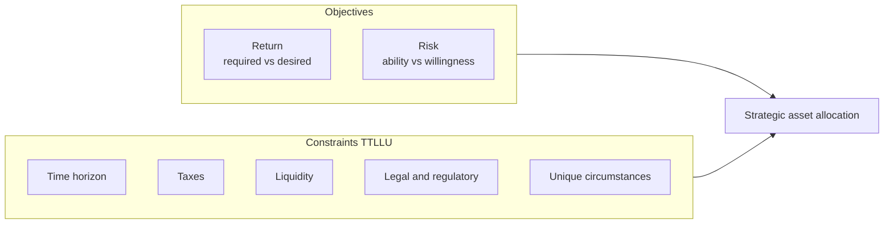
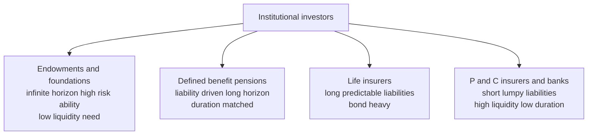

# Chapter 14 — The Investment Policy Statement

## 1. The Problem / The Need

Picture a wealthy family that has just sold a business for ₹50 crore. They hire a portfolio manager. On day one, three questions crowd the room. The husband, 58, wants to "not lose money — we already made it." The wife, 55, wants "at least 12% because inflation is killing us." Their financial advisor mutters that they'll need ₹3 crore in eighteen months for their daughter's overseas education, that the money sits in a trust with a specific deed, and that half the corpus is still in unlisted shares that can't be sold for two years.

Every one of these statements is a *constraint* or an *objective*, and they contradict each other. You cannot simultaneously "not lose money" and earn 12%. You cannot lock up capital for growth and also produce ₹3 crore of liquidity next year without planning for it. If the manager simply starts buying stocks, the first bad quarter will end the relationship — the family will accuse him of recklessness, and he will have no document to point to that says "this is the risk *you* agreed to run."

This is the problem the **Investment Policy Statement (IPS)** solves. Before a single rupee is invested, the manager and client must convert vague hopes ("grow the money, but safely") into a precise, written specification: *how much* return is needed, *how much* risk can be tolerated, *when* the money is needed, *what* rules of tax and law apply, and *what* the client's idiosyncrasies are. The IPS is the contract between the investor's real life and the portfolio's structure.

Without it, three failures are almost guaranteed:

1. **Objective drift.** The portfolio ends up reflecting the *manager's* views or the *market's* fashions rather than the client's needs.
2. **Panic at the bottom.** With no pre-agreed risk budget, the client discovers their true risk tolerance only during a crash — the worst possible moment to learn it — and sells.
3. **No accountability standard.** When performance is reviewed, there is no benchmark of what "success" even means, so the conversation degenerates into "you should have bought Bitcoin."

The IPS is not paperwork. It is the *engineering specification* that every downstream decision — asset allocation, security selection, rebalancing, manager evaluation — must satisfy.

---

## 2. The Core Idea

**An Investment Policy Statement is a written document that specifies a client's investment objectives (return and risk) and constraints (liquidity, time horizon, taxes, legal and regulatory, and unique circumstances), and thereby governs how the portfolio is built and managed.**

The mental model is a funnel. At the top are messy human facts — a person's age, wealth, fears, goals, tax bracket, and legal situation. The IPS is the machine that distils those facts into a small set of formal parameters. Out of the bottom comes the single most important output: the **strategic asset allocation** — the long-run policy mix of equities, bonds, cash, and alternatives that is the portfolio's home base.

Two clusters define the IPS, and it is worth burning them into memory:

- **Objectives = Return + Risk.** What the portfolio must *achieve* and what volatility or loss it can *endure* on the way.
- **Constraints = the "TTLLU" list: Time horizon, Taxes, Liquidity, Legal/regulatory, Unique circumstances.** The *boundaries* inside which the objectives must be pursued.

> The IPS says: *Here is the return we must earn, here is the risk we may take to earn it, and here are the five walls of the box we must stay inside while doing so.*

Crucially, the IPS describes the *investor*, not the *market*. Capital-market expectations (what returns asset classes are likely to deliver) are a separate input. The IPS + capital-market expectations together produce the asset allocation. The IPS is durable and changes rarely (a divorce, a windfall, retirement); market expectations change constantly. Keeping them separate is what stops a good policy from being torn up in every panic.

*Figure 1 — How the IPS converts client circumstances into a portfolio, combining with market expectations to set the strategic asset allocation.*

---

## 3. Why / How It Works

Why does a written statement of preferences translate so reliably into a well-run portfolio? Three mechanisms.

**First, it forces quantification.** "Safe" and "good returns" are useless to a portfolio engineer. The IPS process pins them down: the return objective becomes a *number* (say, "beat inflation by 4% net of fees"), and the risk objective becomes a *number* (say, "no worse than a 15% drawdown in a bad year, standard deviation under 12%"). Once both are numbers, the feasible asset allocation follows almost mechanically from capital-market assumptions — you simply find the mix on the efficient frontier that meets the return need at or below the risk limit. This connects directly to Markowitz portfolio theory (Chapter 03) and the asset-allocation machinery (Chapter 07): the IPS supplies the *inputs* — the target return and the risk constraint — that the optimiser needs.

**Second, it separates two kinds of risk that are constantly confused.** *Ability* to take risk is objective — it depends on horizon, wealth relative to needs, and the stability of income. *Willingness* to take risk is psychological — it depends on temperament. A young software engineer with a huge horizon and a stable salary has high *ability* but may have low *willingness* because a 2020-style crash terrifies him. The IPS makes the manager confront both. The governing rule: **when ability and willingness conflict, the portfolio is generally set to the lower of the two, and the manager documents the mismatch and educates the client.** You never force more risk on a nervous client than they can stomach, because they will bail at the bottom and destroy the plan — even if they "could afford" it on paper.

**Third, it creates a pre-commitment device against behavioural error.** The single largest source of underperformance for real investors is not fees or bad stocks — it is buying high and selling low, driven by greed and fear. The IPS, written in calm times, is a Ulysses-and-the-mast contract: it says *in advance* what the policy mix is and when we rebalance, so that in the panic the answer is already decided. The document out-argues the amygdala.

Finally, the IPS **works because it is dynamic without being fragile.** It is reviewed periodically and after major life events, but it is *not* rewritten every time the market moves. This asymmetry — stable enough to anchor behaviour, flexible enough to reflect genuine changes in the client's life — is exactly what a portfolio needs.

---

## 4. Full Content

### 4.1 Return Objectives

The return objective answers: *what does this portfolio need to earn?* It comes in two flavours that must be reconciled:

- **Required return** — the return the investor *needs* to meet their goals (fund retirement, preserve real capital, meet a spending rule). This is derived from the facts, not preference.
- **Desired return** — the return the investor *wants*. Often higher than required, and often infeasible given the risk constraint.

Returns must be specified with precision on several dimensions:

| Dimension | Question it answers | Example |
|---|---|---|
| Nominal vs real | Before or after inflation? | "Inflation + 4%" (real) vs "10%" (nominal) |
| Pre- vs post-tax | Before or after tax? | Pre-tax 12% may be 8.5% post-tax at a 30% rate |
| Total vs income | Do we count capital gains or only yield? | An endowment spending 4% needs total return; a retiree living on coupons needs income |
| Gross vs net of fees | Before or after costs? | Always specify net — fees are certain, alpha is not |

A well-formed return objective might read: *"The portfolio must achieve a long-term total return, net of fees and after tax, sufficient to grow the corpus at the rate of inflation plus 3.5%, to preserve real purchasing power while funding a 4% annual withdrawal."*

There is an iron discipline here: the return objective must be **consistent with the risk objective**. If a client needs 15% real returns but can only tolerate a 6% standard deviation, the plan is infeasible — the manager must go back and either lower the goal, extend the horizon, increase savings, or accept more risk. The IPS is where this reconciliation happens on paper *before* it happens painfully in reality.

### 4.2 Risk Objectives

Risk has the two components introduced above — **ability** and **willingness** — and both must be assessed.

**Ability to take risk rises with:**

- A **longer time horizon** (more time to recover from drawdowns).
- **Greater wealth relative to needs** (a large surplus over required spending absorbs losses).
- **Lower, more flexible spending needs** (discretionary spending can be cut in bad years).
- **Stable, secure income** from outside the portfolio (a tenured salary vs commission income).
- **Low liquidity needs** (no imminent large withdrawals).

**Willingness** is drawn out through conversation, questionnaires, and history — how did the client behave in 2008 or March 2020? The output is a risk objective expressed as some combination of: a maximum acceptable standard deviation, a maximum tolerable drawdown or loss in a bad year, a shortfall-risk statement ("no more than a 5% chance of the corpus falling below ₹X"), or a value-at-risk limit.

The **reconciliation rule** bears repeating: build to the *lower* of ability and willingness, document the gap, and educate. A client with high ability but low willingness should not be pushed; a client with low ability but high willingness (the dangerous case — a retiree who "loves stocks") must be *restrained*, because their ability is the binding, real-world limit.

### 4.3 The Five Constraints (TTLLU)

Objectives say what to achieve; constraints define the box.

**1. Time Horizon.** How long until the money is needed? Horizons can be **single-stage** (one goal at a known date) or **multi-stage** (an accumulation phase then a decumulation phase — the classic pre- and post-retirement split). Horizon is the master variable of risk: a long horizon expands the ability to hold volatile, high-return assets like equities, because there is time to ride out cycles. A short horizon compresses the portfolio toward cash and short bonds. A common error is treating a retiree as "short horizon" — a 65-year-old may have a 25-year horizon, and part of the corpus is genuinely long-term.

**2. Taxes.** Taxation shapes both the return target (specify pre- or post-tax) and the *instruments* and *strategies* used. Relevant levers include income tax on interest and dividends, capital-gains tax (and the split between short- and long-term rates), and wealth or estate taxes. Tax-aware management uses tactics such as holding assets long enough to qualify for lower long-term gains rates, harvesting losses to offset gains, and locating tax-inefficient assets (bonds, high-turnover strategies) inside tax-sheltered accounts. In India, for instance, the distinction between long-term and short-term capital gains, and vehicles like ELSS or the tax status of debt vs equity funds, directly change the optimal holding.

**3. Liquidity.** What cash outflows will the portfolio face, and when? Liquidity needs include planned withdrawals (a child's education, a house purchase, an endowment's annual spending) and an emergency reserve. High liquidity needs force an allocation to cash and highly marketable securities and *penalise* illiquid assets like private equity, real estate, or lock-in instruments. The manager must also distinguish *liquidity requirements* (predictable, plannable) from *liquidity risk* (the danger of being forced to sell illiquid assets at a discount in a crisis). Ignoring liquidity is how leveraged or illiquid portfolios blow up when a withdrawal lands at the wrong time.

**4. Legal and Regulatory.** What rules bind this specific investor? For individuals, this includes trust documents, prudent-investor standards, and restrictions on the sale of concentrated founder stock. For institutions, it is far heavier: pension funds face funding and fiduciary rules (ERISA in the US; PFRDA/EPFO norms in India); insurers face solvency-capital and reserve regulations (Solvency II, IRDAI rules) that dictate how much can go into equities; banks face capital rules. The IPS must encode every binding legal wall.

**5. Unique Circumstances.** The catch-all for idiosyncratic constraints that don't fit elsewhere: ESG or religious screens (no alcohol, tobacco, or interest-bearing instruments under Shariah), a large concentrated position in the family business that cannot be diversified, restrictions imposed by a donor on an endowment, ethical exclusions, or a governance requirement to avoid certain countries or sectors. These are as binding as any regulation and must be written down.

*Figure 2 — The anatomy of an IPS: two objectives and five constraints feeding the allocation.*

### 4.4 Individual vs Institutional Investors

The IPS framework is universal, but the *content* differs sharply between an individual and each type of institution. The differences flow from horizon, liquidity, taxes, and legal status.

**Individuals** are defined by a **finite, life-cycle horizon** (accumulation then decumulation), **taxable** status (tax is a first-order concern), often **modest ability but variable willingness**, and highly personal unique circumstances. Their goals are typically retirement funding, education, and bequests. Behavioural factors dominate — the manager is as much a coach as an engineer.

**Institutions** are perpetual or long-horizon pools, usually **tax-exempt** (or tax-advantaged), governed by heavy regulation and formal fiduciary duty. Their willingness is set by governance boards, not emotion. But the three great institutional types differ profoundly from *each other*:

- **Defined-benefit pension funds** promise fixed future payments to retirees. Their true objective is to fund a stream of **liabilities**, so their horizon and risk depend on the age profile of the workforce (a young workforce = long horizon, higher equity; a mature, retiree-heavy plan = shorter, more bonds). This drives **liability-driven investing (LDI)** — matching asset duration to liability duration. Liquidity needs are the net benefit payments. They are the archetype of the institution that must think in *surplus* (assets minus liabilities) terms.

- **Endowments and foundations** (a university endowment, a charitable foundation) are **perpetual** and exist to fund spending *forever* — typically a fixed percentage of assets each year (say 4-5%). Their return objective is famously demanding: **spending rate + inflation + fees**, all in real terms — often 7-8% nominal — because they must both fund current spending *and* preserve real purchasing power for future generations. With an infinite horizon and modest annual liquidity needs, they have very high risk ability, which is why the "Yale model" endowments hold large slugs of illiquid equities, private equity, and real assets.

- **Insurance companies** invest the premiums (the "float") they collect before paying claims. **Life insurers** have long-duration, fairly predictable liabilities and behave somewhat like pensions, emphasising duration-matched fixed income with a bond-heavy core. **Property-casualty (P&C / general) insurers** face short, lumpy, unpredictable liabilities (a catastrophe can trigger huge claims at once), so they demand **high liquidity and short duration**, with only surplus capital going into equities. Insurers are the most *heavily regulated and most liquidity- and solvency-sensitive* of all, with return objectives tightly tied to the yield needed to fund policy reserves.

- **Banks** invest their securities portfolio to manage liquidity and interest-rate risk around a deposit base; they prioritise liquidity, credit quality, and duration management, subject to capital regulation.

*Figure 3 — The four institutional archetypes ranked by two defining axes.*

The single comparison every interview loves:

| Feature | Individual | DB Pension | Endowment | Life Insurer | P&C Insurer |
|---|---|---|---|---|---|
| Time horizon | Finite, life-cycle | Long, tied to workforce | Infinite / very long | Long | Short |
| Risk tolerance | Low–moderate, behavioural | Moderate, surplus-driven | High | Low–moderate | Low |
| Liquidity need | Moderate | Low–moderate (benefits) | Low (spending %) | Low | High |
| Taxes | Taxable | Tax-exempt | Tax-exempt | Taxed on operations | Taxed |
| Return objective | Fund life goals | Fund liabilities | Spending + inflation + fees | Fund reserves / spread | Fund reserves + surplus |
| Dominant driver | Behaviour & life cycle | Liabilities (LDI) | Perpetuity & spending | Duration matching | Liquidity & solvency |

### 4.5 How the IPS Drives Asset Allocation

This is where the IPS earns its keep. The chain runs:

1. **Return objective** sets the *required* expected return the portfolio must produce.
2. **Risk objective** sets the *ceiling* on volatility or drawdown the portfolio may run.
3. **Constraints** rule out or force in particular asset classes — a large near-term liquidity need forces cash and short bonds; a legal cap forces an equity ceiling; an ESG screen removes whole sectors; a long horizon *permits* illiquid, high-return assets.
4. **Capital-market expectations** (from outside the IPS) provide the expected returns, volatilities, and correlations of each asset class.
5. **Optimisation** finds the mix on the efficient frontier that hits the required return at or below the risk ceiling *while respecting every constraint* — producing the **strategic asset allocation (SAA)**, the policy portfolio.

So a young accumulator with a 30-year horizon, stable income, high risk ability, and low liquidity needs lands at something like 80% equities / 15% bonds / 5% cash. A near-retiree with a short horizon, high liquidity needs, and low willingness lands at 30% equities / 55% bonds / 15% cash. Same machinery, different IPS inputs, radically different portfolios. The IPS is literally the *input file* for the allocation optimiser — and because allocation drives the vast majority of a portfolio's return variance (Chapter 07), the IPS is, indirectly, the single most consequential document in the whole process.

---

## 5. Worked / Applied Examples

### Example 1 — Reconciling ability and willingness for an individual

Ravi, 35, is a salaried IT professional with a secure ₹40 lakh annual income and ₹1 crore invested for retirement at 60. He needs the corpus to grow at inflation + 5% to retire comfortably. But in the 2020 crash he panic-sold and re-entered late, and he tells you a 20% loss would "keep me awake for months."

*Assess ability:* 25-year horizon, stable income, no near-term liquidity need, wealth modest relative to goal → **high ability**.
*Assess willingness:* history of panic-selling, low stated loss tolerance → **low willingness**.

*Reconciliation:* Ability says 80% equity; willingness says maybe 45%. The rule is to build to the **lower** — but the *required* return of inflation + 5% (≈ 11% nominal) cannot be met at 45% equity. This is the crux the IPS exists to surface.

The manager's response is documented in the IPS: set the allocation at a moderate 55–60% equity (a compromise that gives the plan a *chance* of meeting the goal), and explicitly write in the mismatch: *"Client's willingness is below the level required to meet the stated goal. Manager will (a) educate the client on long-horizon volatility, (b) use rupee-cost averaging and pre-committed rebalancing to reduce behavioural error, and (c) revisit the goal or savings rate if willingness cannot rise."* Ravi may need to save more or retire slightly later rather than take risk he'll abandon. The IPS turns an invisible conflict into an explicit, agreed plan.

### Example 2 — An endowment's return objective and allocation

The Meridian University Endowment holds ₹500 crore. Its spending policy funds 4.5% of assets annually toward scholarships; long-run inflation is 5%; investment fees run about 0.5%. It is tax-exempt, perpetual, and needs only the 4.5% for liquidity each year.

*Required nominal return* (additive approximation):

Spending 4.5% + Inflation 5.0% + Fees 0.5% = **10.0%**

To fund spending *and* preserve real purchasing power forever, the endowment must earn roughly 10% nominal. That is a demanding target — unreachable with bonds alone.

*Constraints:* infinite horizon (very high risk ability), only 4.5% annual liquidity need (low), tax-exempt, no unusual legal limits.

*Allocation implication:* high risk ability + low liquidity need + demanding return → the classic endowment tilt toward growth and illiquidity. A plausible SAA: 30% global equities, 20% private equity, 15% real assets (real estate, infrastructure), 20% hedge funds/absolute return, 15% fixed income and cash. The endowment *deliberately* accepts illiquidity because its horizon lets it harvest the illiquidity premium — an allocation that would be reckless for a P&C insurer is optimal here. Notice how directly the IPS constraints (perpetual horizon, low liquidity) *permit* this; change the horizon and the whole allocation collapses toward bonds.

### Example 3 — A defined-benefit pension and liability-driven investing

The Kaveri Industries Pension Plan has ₹800 crore of assets and ₹750 crore of liabilities (present value of promised pensions), giving a **surplus of ₹50 crore** and a funded ratio of ~107%. The workforce is mature — average member age 52 — so benefit payments are large and near-term, and the liabilities have a duration of about 12 years.

*Objective:* the real goal is not "maximise return" but **fund the liabilities without letting the surplus erode**. Return required ≈ the plan's actuarial discount rate (say 7%).

*Risk:* risk is measured against the *liabilities*, not against cash. If the manager holds all equities and rates fall, liabilities balloon (their present value rises) while equities may not — the surplus can vanish even if the portfolio "made money." So the risk objective is framed in **surplus** terms: keep the funded ratio from falling below, say, 100%.

*Allocation implication (LDI):* match a large fixed-income core to the liabilities' 12-year duration to immunise the funded status against rate moves, and hold a smaller "return-seeking" equity sleeve funded largely by the surplus to earn the extra return. A plausible mix: 65% duration-matched bonds, 30% equities, 5% cash. Contrast this with the endowment above — same "institution" label, completely different portfolio, because the IPS drivers (liabilities, mature workforce, moderate horizon) are entirely different. This is the whole point of the IPS: the *document*, not the label, determines the portfolio.

---

## 6. Connections

- **Chapter 03–04 (Portfolio Theory, Efficient Frontier):** The IPS supplies the two inputs the Markowitz optimiser needs — a target return and a risk limit. The SAA is literally the point on the efficient frontier that satisfies the IPS.
- **Chapter 07 (Asset Allocation):** The IPS *is* the front end of asset allocation. The strategic asset allocation / policy portfolio is the IPS's primary output; rebalancing rules are usually written *into* the IPS.
- **Chapter 08 (Portfolio Construction Process):** The IPS is Step 1 (the planning step) of the three-stage planning–execution–feedback loop. Execution (security selection) and feedback (monitoring, rebalancing) both measure themselves against the IPS.
- **Chapter 11 (Performance Measurement):** The IPS defines the *benchmark* and the notion of success. Attribution asks whether the manager added value *relative to the policy portfolio the IPS specified*.
- **Behavioural finance:** The IPS is the primary institutional defence against loss aversion, recency bias, and panic-selling — a pre-commitment device.
- **Capital-market expectations:** The IPS's essential partner. IPS (the investor) + CME (the market) = asset allocation. Keeping them separate is what makes the policy durable.

---

## 7. Key Terms

- **Investment Policy Statement (IPS):** The written document specifying a client's objectives and constraints, governing all portfolio decisions.
- **Return objective:** The specified return the portfolio must achieve; split into *required* (needed) and *desired* (wanted), and specified as nominal/real, pre/post-tax, gross/net.
- **Risk objective:** The specified tolerance for volatility/loss, combining *ability* (objective) and *willingness* (psychological) to take risk.
- **Ability to take risk:** Capacity to absorb losses, driven by horizon, wealth-vs-needs, spending flexibility, and income stability.
- **Willingness to take risk:** Psychological comfort with volatility and loss.
- **Constraints (TTLLU):** Time horizon, Taxes, Liquidity, Legal/regulatory, Unique circumstances.
- **Liquidity requirement:** Predictable, plannable cash outflows the portfolio must fund.
- **Liquidity risk:** The danger of being forced to sell illiquid assets at a discount.
- **Strategic asset allocation (SAA) / policy portfolio:** The long-run target mix of asset classes; the IPS's primary output.
- **Liability-driven investing (LDI):** Managing assets to fund a specific liability stream, matching duration — central to DB pensions.
- **Surplus:** Assets minus the present value of liabilities; the risk lens for pensions.
- **Spending rate:** The percentage of assets an endowment/foundation withdraws annually.
- **Capital-market expectations (CME):** Forecast returns, volatilities, and correlations of asset classes — the market-side input paired with the IPS.

---

## 8. Common Confusions

**"The IPS is just a compliance form."** No. It is the engineering spec that drives the allocation and defines success. Treating it as boilerplate is exactly how portfolios end up mismatched to their owners.

**Confusing ability and willingness.** They are different and often conflict. A young investor can have high ability but low willingness; a retiree can have low ability but dangerously high willingness. Assess both, build to the lower, document the gap.

**Required vs desired return.** Clients state what they *want* (desired); the manager must derive what they *need* (required) and check feasibility against the risk limit. Chasing desired return beyond what the risk budget allows is how plans blow up.

**Treating all institutions alike.** A pension, an endowment, and a P&C insurer have almost nothing in common in horizon, liquidity, or risk. The "institution" label tells you little; the *IPS drivers* (liabilities, horizon, liquidity) tell you everything. Examples 2 and 3 land on opposite portfolios despite both being "institutions."

**Liquidity requirement vs liquidity risk.** The first is a planned outflow you allocate cash for; the second is the crisis danger of forced illiquid sales. Both must be managed; they are not the same thing.

**Horizon of a retiree.** A retiree is *not* automatically "short horizon." A 65-year-old may have 25+ years; only the near-term spending is short-horizon. Multi-stage horizons are the norm.

**Putting the IPS and market views in the same box.** The IPS describes the *investor* and changes rarely; capital-market expectations describe the *market* and change constantly. Blurring them means rewriting policy in every panic — the exact behaviour the IPS exists to prevent.

**Nominal vs real return targets.** "Grow at 8%" is meaningless without saying whether inflation is included. Endowments and long-horizon investors almost always target *real* returns (inflation-plus), because preserving purchasing power is the goal.

---

## 9. Recap

The Investment Policy Statement is the foundation of professional portfolio management: a written contract that converts a client's messy human circumstances into a precise specification the portfolio must satisfy. It has two halves. **Objectives** = return (required vs desired; specified nominal/real, pre/post-tax, net of fees) and risk (ability vs willingness, reconciled to the lower, gap documented). **Constraints** = the TTLLU list: time horizon, taxes, liquidity, legal/regulatory, and unique circumstances.

The IPS describes the *investor*; combined with capital-market expectations about the *market*, it produces the **strategic asset allocation** — the policy portfolio that is the single most consequential output, because allocation dominates return variance. The framework is universal but its content diverges sharply across investor types: individuals are finite-horizon, taxable, and behaviour-driven; DB pensions are liability-driven; endowments are perpetual, high-risk-ability real-return machines; insurers are liquidity- and solvency-constrained. The same machinery, fed different IPS inputs, produces radically different portfolios — which is precisely the point. Finally, the IPS is durable but not static: reviewed periodically and after major life events, it anchors behaviour through market storms while still adapting to genuine change in the client's life.

---

## 10. Quick-Reference / Interview Points

- **One-line definition:** An IPS is a written document specifying a client's return and risk objectives and their constraints (time horizon, taxes, liquidity, legal/regulatory, unique), which governs the portfolio and drives the strategic asset allocation.
- **The structure:** Objectives (Return + Risk) and Constraints (TTLLU — *T*ime, *T*axes, *L*iquidity, *L*egal, *U*nique). Memorise the mnemonic.
- **Return objective:** distinguish *required* vs *desired*; always specify nominal vs real, pre- vs post-tax, gross vs net.
- **Risk objective:** *ability* (objective — horizon, wealth vs needs, income stability, spending flexibility) vs *willingness* (psychological). **Build to the lower; document the mismatch; educate.**
- **Endowment required return shortcut:** Spending rate + Inflation + Fees. (e.g., 4.5% + 5% + 0.5% = 10%.)
- **Pension key idea:** liability-driven; risk measured in *surplus* terms; duration-match assets to liabilities (LDI). Workforce age sets horizon.
- **Endowment key idea:** infinite horizon, low liquidity need, high risk ability, demanding real return → illiquid growth tilt ("Yale model").
- **Insurer key idea:** life = long/predictable/bond-heavy; P&C = short/lumpy/high-liquidity. Most regulated, most solvency-sensitive.
- **The chain:** IPS (return + risk + constraints) + capital-market expectations → efficient-frontier optimisation → strategic asset allocation → construction → monitor/rebalance vs IPS.
- **Why it matters:** allocation drives most of return variance, so the IPS is indirectly the most consequential document in the process; it is also the primary behavioural pre-commitment device against panic-selling.
- **Classic exam trap:** don't confuse liquidity *requirement* (planned outflow) with liquidity *risk* (forced-sale danger); don't call a retiree "short horizon"; don't blur the IPS (investor, stable) with market expectations (market, changing).
