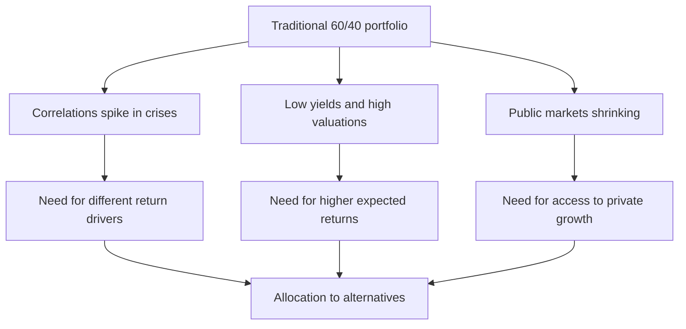
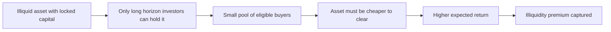
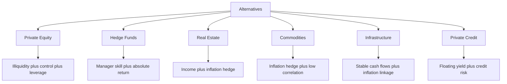
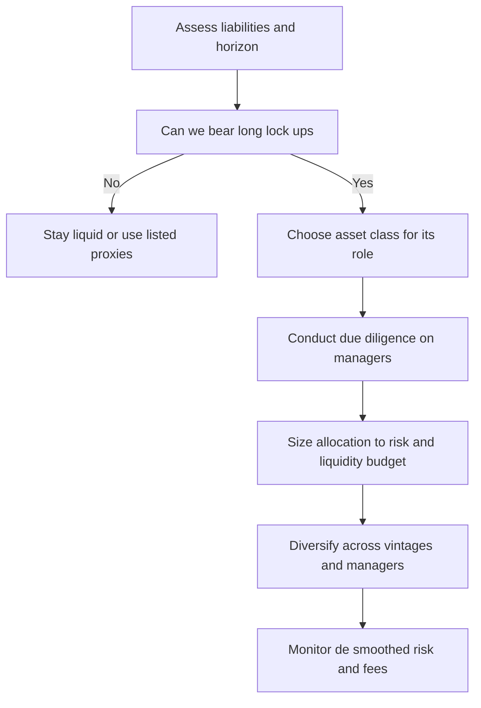

# Chapter 15 — Alternatives in Portfolios

## 1. The Problem / Need

A traditional portfolio is built from two ingredients: publicly listed **equities** and **bonds**. For most of the twentieth century that was enough. Stocks delivered growth, bonds delivered income and ballast, and the two tended to move differently enough that a 60/40 mix produced a smooth-ish ride. But three structural problems have pushed serious investors — pension funds, endowments, sovereign wealth funds, family offices, and increasingly wealthy individuals — to look beyond stocks and bonds.

**Problem one: the correlation trap.** Diversification only works when assets do not fall together. In the crises that matter most — 2008, March 2020, the 2022 rate shock — correlations between stocks and bonds, and between equities across countries, tend to spike toward one. Exactly when you need diversification, it evaporates. Investors began hunting for return streams whose drivers are genuinely *different* from listed equity beta.

**Problem two: the low-yield / high-valuation squeeze.** After the 2008 crisis, developed-market bond yields collapsed to near zero (and briefly negative in Europe and Japan). A bond portfolio yielding 1% cannot fund a pension promising 7% actuarial returns. Simultaneously, equity valuations climbed. The expected return of the classic 60/40 fell. To hit their return targets, allocators needed sources of return that did not depend on ever-rising public markets.

**Problem three: the shrinking public market.** The number of US listed companies roughly halved from its 1996 peak. Companies now stay private far longer — a firm that would have IPO'd at a $500m valuation in 1999 now IPOs at $30bn, if at all. Much of the *value creation* in the modern economy happens **before** a company ever lists. A public-only investor is structurally locked out of that growth.

Alternatives — private equity, hedge funds, real estate, commodities, infrastructure, private credit, and more — are the answer to these three problems. They promise different return drivers, higher expected returns (partly as compensation for illiquidity), and access to parts of the economy that public markets cannot reach. The catch is that they are complex, expensive, illiquid, opaque, and unforgiving of poor manager selection. This chapter is about using them well.

*Figure 15.1 — The three structural forces pushing capital toward alternatives.*

---

## 2. Core Idea

**Alternatives are any investment that is not plain-vanilla listed equity, listed bonds, or cash.** That negative definition is deliberately broad, but the category shares a family resemblance built on four features:

1. **Different return drivers.** Their returns come from illiquidity, complexity, active skill, operational control, or exposure to real assets — not simply from public-market beta.
2. **Reduced liquidity.** Many lock your capital up for years. You trade the *option to sell tomorrow* for a higher expected return — the **illiquidity premium**.
3. **Higher and more complex fees.** The industry standard "2 and 20" (2% management fee plus 20% of profits) is far above the few basis points of an index fund.
4. **Manager dispersion matters enormously.** In public equities, the gap between a top-quartile and bottom-quartile index fund is trivial. In private equity or hedge funds, the gap between the best and worst manager can be 15–20 percentage points *per year*. **Access and selection are the whole game.**

The central portfolio idea is this: alternatives earn their place not because they always beat stocks (they often don't), but because they add a return stream that is **imperfectly correlated** with the rest of the portfolio. A modest expected-return boost combined with low correlation improves the portfolio's *risk-adjusted* return — it pushes the whole efficient frontier up and to the left. That is the prize.

---

## 3. Why / How It Works

### The illiquidity premium

The theoretical heart of alternatives is the **illiquidity premium**: investors demand extra expected return to compensate for the inability to sell quickly. If two assets have identical cash flows and risk, but one can be sold instantly and the other locks you up for ten years, rational investors will pay *less* for the illiquid one — meaning its expected return is *higher*.

Why should a premium exist and persist?

- **Not everyone can bear illiquidity.** A retiree needing income, or a bank needing to meet daily redemptions, cannot lock money away for a decade. Only investors with long, stable liabilities — endowments, sovereign funds, young pension plans — can. Because the buyer pool is small, the illiquid asset must offer more to clear.
- **Illiquidity enforces discipline.** A locked-up investor cannot panic-sell at the bottom. This "forced patience" itself captures returns that skittish public-market investors give up.
- **Complexity and effort.** Sourcing, structuring, and operating private assets requires specialised skill and infrastructure — a barrier that keeps competition (and therefore prices) down.

Estimates of the illiquidity premium vary widely, typically cited at **1–5% per year**, but it is genuinely hard to measure and much of the "premium" observed in private equity can be decomposed into leverage, small-cap tilt, and sector bets rather than pure illiquidity.

### The diversification mathematics

Recall the two-asset portfolio variance:

$$\sigma_p^2 = w_A^2\sigma_A^2 + w_B^2\sigma_B^2 + 2\,w_A w_B\,\rho_{AB}\,\sigma_A\sigma_B$$

The cross term contains the correlation $\rho_{AB}$. When you add an asset with **low or negative correlation** to your equity-heavy portfolio, that cross term stays small, so total portfolio volatility rises less than the new asset's standalone volatility would suggest. If the new asset also has a decent expected return, you get a better return-per-unit-of-risk. That is the mathematical engine behind adding commodities, macro hedge funds, or infrastructure to a stock/bond core.

### An important caveat — smoothed returns

Private assets are not priced daily by a market; they are **appraised** periodically. Appraisals lag and smooth true economic values. This makes reported volatility *artificially low* and reported correlations *artificially low* — a statistical illusion sometimes called **"volatility laundering."** A private real-estate fund that reports 6% annual volatility may have true economic volatility closer to public REITs at 18%. So part of the beautiful diversification you see in the data is an artifact of measurement, not real economics. A sophisticated allocator **de-smooths** the return series before trusting the correlation numbers.

*Figure 15.2 — How the illiquidity premium arises from a restricted buyer pool.*

---

## 4. Full Content — The Major Alternative Asset Classes

### 4.1 Private Equity (PE)

**What it is.** Ownership of companies that are not publicly listed. The umbrella covers several strategies:

- **Buyouts (LBOs):** Acquiring mature, cash-generative companies using significant debt (leverage), improving operations, and selling in 3–7 years. The largest slice of PE by capital.
- **Growth equity:** Minority stakes in fast-growing, profitable companies needing capital to scale.
- **Venture capital (VC):** Early-stage equity in startups. High failure rate, driven by a few enormous winners (the "power law" — one Uber pays for a hundred flops).

**The fund structure.** PE is organised as a **closed-end limited partnership** with a ~10-year life. The manager is the **General Partner (GP)**; investors are **Limited Partners (LPs)**. LPs *commit* capital up front but it is **called** ("drawn down") gradually as deals are found, and **distributed** back as companies are sold. Uncalled money is a **commitment**, not cash sitting idle — a key operational complexity.

**The J-curve.** Early in a fund's life, fees and losers depress returns before winners mature, so cumulative returns trace a "J": down first, then up. Cash flow to LPs is negative for the first several years, positive later.

**How PE creates value:** (1) **operational improvement** — better management, margins, growth; (2) **financial leverage** — debt magnifies equity returns; (3) **multiple expansion** — buying at a low earnings multiple and selling at a higher one; (4) **buy-and-build** — rolling up small firms into a larger, more valuable platform.

**Return metrics.** Because cash flows are irregular, PE uses **IRR** (internal rate of return) and **MOIC / TVPI** (multiple of invested capital / total value to paid-in). A common benchmark comparison is the **PME (Public Market Equivalent)** — what you would have earned putting the same cash flows into an index. If PE's PME > 1, it beat the public market.

### 4.2 Hedge Funds

**What they are.** Actively managed, lightly regulated pools using tools mutual funds usually can't: **short selling, leverage, and derivatives.** The name is historical — the first fund (A.W. Jones, 1949) "hedged" long positions with shorts. Today "hedge fund" describes a *structure and fee model*, not a single strategy.

Major strategy buckets:

| Strategy | What it does | Primary return driver |
|---|---|---|
| **Long/Short Equity** | Long undervalued, short overvalued stocks | Stock-picking skill, reduced net market exposure |
| **Global Macro** | Bets on rates, currencies, commodities from macro views | Directional macro calls; often crisis-friendly |
| **Event-Driven / Merger Arb** | Profit from M&A, spin-offs, restructurings | Deal completion; corporate events |
| **Relative Value / Fixed-Income Arb** | Exploit small pricing gaps between related securities | Convergence; heavy leverage |
| **Managed Futures / CTA** | Trend-following across futures markets | Momentum; famous "crisis alpha" |
| **Distressed** | Debt of troubled companies | Restructuring / recovery |

**The portfolio role.** The best hedge funds aim for **absolute return** — positive returns regardless of market direction — and **low beta** to equities. Managed-futures/CTA and global-macro funds in particular have historically produced positive returns during equity crashes ("crisis alpha"), making them valuable diversifiers even if their long-run standalone return is modest.

**Liquidity.** More liquid than PE but still restricted: **lock-ups** (often one year initially), **redemption gates** (a cap on how much can be withdrawn at once), **notice periods** (30–90 days), and occasionally **side pockets** for illiquid positions.

### 4.3 Real Estate

**What it is.** Income-producing property — office, retail, industrial/logistics, residential/multifamily, hotels, data centers. Accessed via:

- **Direct ownership** — buying buildings; maximum control, minimum liquidity.
- **Private real-estate funds** — pooled, closed- or open-end, spanning the risk spectrum: **Core** (stabilised, low-leverage, income-driven), **Core-plus, Value-add** (renovate and re-lease), and **Opportunistic** (development, distressed — highest risk/return).
- **REITs (Real Estate Investment Trusts)** — *listed* property companies. Technically a public security, but they give real-estate *exposure*, must distribute ~90% of income as dividends, and trade daily.

**Portfolio role:** steady income yield, a partial **inflation hedge** (rents and property values often rise with inflation, especially with short leases or CPI-linked rents), and diversification. Beware: *listed* REITs behave much more like equities in the short run than private real estate does — a classic liquidity-vs-diversification trade-off.

### 4.4 Commodities

**What they are.** Physical raw materials — energy (oil, gas), metals (gold, copper), agriculture (wheat, coffee). Investors rarely hold barrels of oil; they gain exposure through **futures contracts** or commodity indices (e.g., Bloomberg Commodity Index, S&P GSCI).

**The crucial subtlety — you don't earn the spot price.** A commodity futures investor's total return has three parts:

$$\text{Total return} = \text{Spot return} + \text{Roll yield} + \text{Collateral return}$$

- **Spot return:** change in the physical price.
- **Roll yield:** because a futures position must be "rolled" to a later contract before expiry, you gain if the curve is **backwardated** (near contract priced *above* far, so you roll into cheaper contracts) and lose if it is in **contango** (far above near). Persistent contango has quietly destroyed returns for many long-only commodity investors.
- **Collateral return:** commodity futures need only margin, so the cash backing them earns the risk-free rate.

**Portfolio role:** commodities are the classic **inflation hedge** and often have **low or negative correlation** with stocks and bonds, since they respond to supply shocks (wars, droughts, OPEC) rather than corporate earnings. **Gold** is a special case — a monetary/safe-haven asset that tends to rise in crises and when real rates fall.

### 4.5 Infrastructure

**What it is.** The physical backbone of the economy — toll roads, airports, ports, utilities, power grids, water systems, pipelines, telecom towers, and increasingly renewable energy and data centers.

**Why it's attractive:** infrastructure assets typically have **monopolistic or quasi-monopolistic positions** (one airport per city), **long-lived contracts**, **regulated or inflation-linked revenues**, and **stable, predictable cash flows**. This gives them a **bond-like income profile with equity-like inflation protection** — a rare and prized combination for pension funds matching long-dated liabilities.

Split into: **Brownfield** (existing, operating assets — lower risk, income-focused) versus **Greenfield** (build-from-scratch — construction and demand risk, higher return).

### 4.6 Private Credit / Private Debt

The fastest-growing alternative of the 2020s. **Direct lending** to mid-sized companies, bypassing banks. Since post-2008 regulation pushed banks out of mid-market lending, funds stepped in, earning **floating-rate yields plus illiquidity premium** (often SOFR + 5–7%). Attractive in a rising-rate world because coupons float up, but carries **credit risk** concentrated in leveraged, unrated borrowers — largely untested through a severe default cycle.

*Figure 15.3 — Map of the alternatives universe by liquidity and return driver.*

---

## 5. Worked / Applied Examples

### Example 1 — The illiquidity premium in a buyout deal

A PE fund buys a company for an **enterprise value of $500m**, financed with **$300m of debt** and **$200m of equity**. The company generates **$50m of EBITDA**, so the entry multiple is 10× EBITDA.

Over five years, the GP:
- Grows EBITDA from $50m to $75m (operational improvement, +50%).
- Pays down $150m of debt using the company's cash flow (debt falls from $300m to $150m).
- Sells at 11× EBITDA (multiple expansion from 10× to 11×).

**Exit calculation:**
- Exit enterprise value = 11 × $75m = **$825m**
- Less remaining debt of $150m → **equity value = $675m**

**Return to LPs (gross):**
- MOIC = $675m ÷ $200m = **3.375×**
- IRR ≈ $(3.375)^{1/5} - 1$ = **27.5% per year** (gross, before fees)

Notice how the three levers stacked: EBITDA growth, deleveraging, and multiple expansion together tripled the equity. Now strip out leverage — imagine an all-equity purchase with the same operational improvement and multiple. Equity in = $500m; exit EV = $825m; MOIC = 1.65×, IRR ≈ 10.5%. **Leverage roughly doubled the equity IRR** — which is exactly why critics argue much of PE's "outperformance" is repackaged leverage and equity beta, not pure alpha. The gap between the 27.5% levered and 10.5% unlevered figures is the leverage contribution, not skill.

### Example 2 — Diversification benefit of adding an alternative

You hold a portfolio that is **100% equities**: expected return 8%, volatility 16%. You consider shifting to **80% equities / 20% managed futures (CTA)**. Assume the CTA has expected return 6%, volatility 12%, and **correlation of −0.1** with equities.

**New expected return:**
$$E(R_p) = 0.8(8\%) + 0.2(6\%) = 6.4\% + 1.2\% = 7.6\%$$

**New volatility:**
$$\sigma_p = \sqrt{(0.8)^2(16)^2 + (0.2)^2(12)^2 + 2(0.8)(0.2)(-0.1)(16)(12)}$$
$$= \sqrt{163.84 + 5.76 - 6.144} = \sqrt{163.456} \approx 12.79\%$$

**Compare Sharpe-like ratios** (assume risk-free 2%):
- All equity: $(8 - 2)/16 = 0.375$
- Blended: $(7.6 - 2)/12.79 = 0.438$

We gave up 0.4% of expected return but cut volatility from 16% to 12.8% — the risk fell far more than the return, so **risk-adjusted return improved by ~17%**. The negative correlation did most of the work: the cross-term actually *subtracted* from variance. **This is the entire case for alternatives in one calculation** — you don't need them to out-earn equities, only to diversify them.

### Example 3 — Contango destroying a commodity return

An investor buys a front-month oil futures contract at **$70**. Over the year, the **spot price rises to $75** (a +7.1% spot gain — seemingly a win). But the curve is in **contango**: each month, to avoid taking delivery, the investor sells the expiring contract and buys the next month at a **$1.50 premium**. Over 12 rolls that costs roughly **$18 of roll drag** relative to spot.

Result: despite the spot price rising 7%, the *investor's* futures position may deliver a **negative total return** once roll losses are netted. Add ~2% collateral (risk-free) return and the investor still barely breaks even. **Lesson:** in commodities, being right about the physical price is not enough — the **shape of the futures curve** can dominate the outcome. This is precisely why long-only commodity index products disappointed investors through the 2010s.

---

## 6. Connections

- **Modern Portfolio Theory (Ch. on MPT):** Alternatives are the practical application of correlation-based diversification — they aim to shift the entire **efficient frontier** outward. The mean-variance math from MPT is exactly what justifies (and constrains) their allocation.
- **Factor investing:** Much of what alternatives deliver can be decomposed into **factors** — value, size, momentum, illiquidity, credit, term. The "alternative risk premia" industry replicates hedge-fund returns cheaply using liquid factors, challenging the fee model.
- **The Endowment Model (Yale / David Swensen):** The intellectual blueprint for heavy alternatives use. Swensen argued long-horizon investors are *paid* to bear illiquidity and should tilt hard toward private assets — Yale ran 30%+ in PE and real assets for decades.
- **Asset-liability management:** Infrastructure and private credit connect directly to **liability matching** for pensions and insurers — long, inflation-linked cash flows against long-dated promises.
- **Behavioural finance:** The lock-up is a **commitment device** that protects investors from their own panic-selling — a behavioural benefit disguised as a liquidity cost.
- **Valuation:** PE and real-estate returns depend on **entry and exit multiples**, tying straight back to DCF and relative-valuation techniques.

---

## 7. Key Terms

- **Illiquidity premium** — extra expected return demanded for holding assets that cannot be sold quickly.
- **GP / LP** — General Partner (the manager) and Limited Partners (the investors) in a fund.
- **Commitment / capital call / drawdown** — money an LP pledges, then hands over in tranches as the GP invests.
- **Distribution** — cash returned to LPs as investments are sold.
- **J-curve** — the early-negative, later-positive shape of a private fund's cumulative return.
- **Vintage year** — the year a fund starts investing; a key comparison unit (you benchmark 2019 funds against other 2019 funds).
- **IRR / MOIC (TVPI) / DPI / PME** — IRR = annualised return; MOIC/TVPI = total value ÷ paid-in; DPI = *cash actually distributed* ÷ paid-in (realised); PME = comparison to a public index.
- **Carried interest ("carry")** — the GP's share of profits, typically 20%.
- **Hurdle rate / preferred return** — minimum return LPs get before the GP earns carry (often ~8%).
- **High-water mark** — a hedge-fund provision ensuring performance fees are paid only on *new* profits above the prior peak.
- **Lock-up / gate / side pocket** — restrictions on withdrawing from a hedge fund.
- **Contango / backwardation** — upward- / downward-sloping futures curve determining roll yield.
- **Roll yield** — return from rolling futures contracts forward.
- **Core / value-add / opportunistic** — the real-estate risk-return spectrum.
- **De-smoothing** — statistically correcting appraisal-based returns to reveal true volatility and correlation.
- **Vintage diversification** — spreading commitments across years to avoid timing risk.

---

## 8. Common Confusions

**"Alternatives are less risky because they show low volatility."** *False and dangerous.* Their reported low volatility is largely a **measurement artifact** — appraisal-based valuations smooth out the swings ("volatility laundering"). The economic risk is real; it's just hidden between valuation dates. Adjust (de-smooth) before trusting the numbers.

**"Private equity beats public equity."** *Partly true, heavily caveated.* Average PE has beaten public equity *before fees* historically, but (1) much of the excess is **leverage and small-cap beta**, not alpha; (2) **after fees**, median PE has often only *matched* public equity; (3) **dispersion is huge** — only top-quartile GPs reliably add value. Buying "PE" as an asset class without access to good managers can *underperform* an index fund.

**"IRR is the return I earned."** *Not quite.* IRR assumes interim cash is reinvested at the IRR and can be **flattered by early distributions** or manipulated via **subscription-line financing** (delaying capital calls to boost the reported IRR). Always pair IRR with **MOIC** and **DPI** (actual cash back) for a truthful picture.

**"Commodities give me exposure to rising oil prices."** *Only partially.* You earn the **futures** return, not the spot return. In persistent **contango**, roll losses can turn a rising spot price into a losing investment (see Example 3).

**"Hedge funds are high-risk, high-return."** *Misconception.* As a group, hedge funds aim for **lower volatility and low market correlation**, not maximum return. Many deliberately target modest absolute returns with small drawdowns. "Hedge fund" is a fee-and-structure label, not a risk level.

**"REITs are just liquid real estate, so they diversify like private real estate."** *No.* Listed REITs trade like small-cap equities day to day and carry high short-run equity correlation. They give property *fundamentals* over the long run but *equity* volatility in the short run.

**"2 and 20 means I pay 22%."** *No.* It's 2% of *assets* annually **plus** 20% of *profits* (usually above a hurdle, subject to a high-water mark). But compounded over a fund's life, total fees can consume **a third or more** of gross gains — fee drag is the single biggest predictor of net-of-fee underperformance.

---

## 9. Recap

Alternatives exist to solve three problems that plague a stock-and-bond world: **correlations that spike in crises, low expected returns from expensive public markets, and lack of access to a shrinking public universe.** They earn their keep primarily through **diversification** (low correlation to equities) and the **illiquidity premium** (extra return for locking capital up), and secondarily through **manager skill** and **inflation protection**.

The major classes each play a distinct role: **private equity** for return enhancement via operational control and leverage; **hedge funds** for absolute return and crisis alpha; **real estate** for income and inflation hedging; **commodities** for supply-shock diversification and inflation protection; **infrastructure** for stable, inflation-linked, long-dated cash flows; and **private credit** for floating yield.

But the benefits are neither free nor guaranteed. The costs are **illiquidity, high and complex fees, opacity, and enormous manager dispersion**. The reported diversification is partly a **statistical illusion** from smoothed valuations. The whole game is **access and selection** — top-quartile managers add real value; bottom-quartile ones destroy it after fees. Alternatives should be a **deliberate, sized, patient allocation** — not a chase for the last cycle's hot fund.

*Figure 15.4 — The decision workflow for adding an alternative allocation.*

---

## 10. Quick-Reference / Interview Points

**How much to allocate?** There is no universal number; it flows from **liquidity tolerance and governance capacity**. Rough industry practice:

| Investor type | Typical alternatives allocation | Rationale |
|---|---|---|
| Large endowment / SWF (Yale model) | 40–60%+ | Perpetual horizon, no near-term liabilities, strong manager access |
| Corporate / public pension | 15–30% | Long liabilities but some liquidity needs and governance limits |
| High-net-worth / family office | 10–25% | Long horizon but access and diligence constraints |
| Retail / mass affluent | 0–10% | Liquidity needs, limited access, high minimums (loosening via interval funds/ELTIFs) |

The binding constraint is the **liquidity budget**: never commit so much to illiquid assets that you'd be a *forced seller* of public assets at the bottom, or unable to fund capital calls or spending during a downturn (the "denominator problem" — when public markets crash, illiquid holdings become an oversized *share* of the shrunken portfolio).

**Due-diligence checklist (say this in an interview):**
1. **Track record** — through multiple cycles, same team, realised (DPI) not just paper (TVPI) gains.
2. **Team stability and alignment** — is the GP investing its own money ("skin in the game")? Key-person risk?
3. **Repeatable edge** — is the strategy's return driver understood and durable, or luck/leverage?
4. **Fees and terms** — management fee, carry, hurdle, high-water mark, clawback.
5. **Operational due diligence** — independent administrator, auditor, custody, valuation policy (the Madoff lesson: fraud hides in operations, not the investment thesis).

**Fee facts:** "2 and 20" standard; **hurdle** ~8%; **high-water mark** protects against paying twice; total fee drag can exceed a third of gross returns.

**Liquidity terms to name:** capital calls, lock-ups, gates, notice periods, side pockets, vintage-year commitments.

**The one-line summary for an interview:** *"Alternatives don't earn their place by beating equities — they earn it by delivering an imperfectly correlated return stream and an illiquidity premium, which improves the portfolio's risk-adjusted return. But the reported diversification is partly a smoothing illusion, fees are high, and manager dispersion is enormous — so access and due diligence, not the asset-class label, determine whether they actually help."*

**Three risks to always cite:** (1) **illiquidity risk** — can't exit when you need to, and capital-call/denominator problems in a crisis; (2) **manager/selection risk** — huge dispersion, fraud and opacity; (3) **valuation risk** — smoothed appraisals understate true volatility and correlation, giving false comfort.
