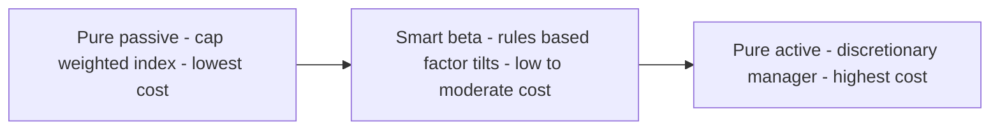
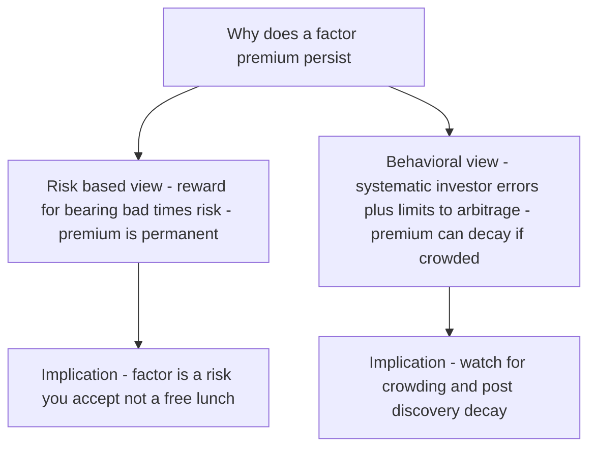

# Chapter 16 — Factor Investing and Smart Beta

## 1. The Problem / The Need

By now you have met two competing worlds. On one side sits **passive indexing**: buy the whole market, cap-weighted, for a few basis points a year, and accept the market return. On the other sits **active management**: pay a manager 60–100 bps (often much more) to pick stocks and time factors, in the hope of beating the index — a hope that, after fees, most managers fail to deliver on (Chapter 12 on market efficiency showed you the grim SPIVA scorecards).

For decades those looked like the only two choices. But Chapter 06 planted a seed that blows this dichotomy apart. If average returns are driven not by one market factor but by a *handful* of systematic factors — size, value, momentum, profitability — then a natural question follows:

> When a star active manager "beats the market," how much of that outperformance is genuine skill (alpha), and how much is just a *cheap, mechanical tilt* toward known factors that any rules-based strategy could have replicated for 20 bps?

This is not academic hair-splitting; it is worth billions. In the 1990s, if a value manager returned 3% a year over the S&P 500, investors paid active fees believing they were buying skill. Then research showed that value is a *systematic, harvestable premium* — you can capture it with a transparent rule ("buy stocks with high book-to-market"), no genius required. Suddenly a chunk of what was sold as expensive alpha was revealed to be cheap **factor beta**.

The practical need is threefold:

1. **Decompose returns honestly.** Separate true alpha from factor exposure so investors know what they are actually paying for.
2. **Harvest premia cheaply.** If factor premia are real and persistent, package them in low-cost, rules-based, transparent vehicles — no need to pay 1% for a discretionary manager.
3. **Build better-diversified portfolios.** Diversify not just across *asset classes* (which all crashed together in 2008) but across the underlying *factors* — the true drivers of risk and return.

The answer to all three is **factor investing** — and its retail packaging, **smart beta**. This chapter takes the multifactor theory of Chapter 06 and turns it into an investable discipline.

---

## 2. The Core Idea

A **factor** is a broad, persistent, quantifiable characteristic that helps explain the risk and return of a group of securities. Think of factors as the *nutrients* in the market's diet, and individual stocks as *foods*: two very different-looking foods (a bank and a utility) may deliver the same underlying nutrient (value exposure).

Factor investing rests on three claims:

- **Returns are driven by factors, not just by individual securities.** A stock's return is mostly its exposures to common factors plus a small idiosyncratic piece.
- **Certain factors have earned a long-run premium** — a persistent excess return above the market — that survives out-of-sample, across countries, and across asset classes.
- **These premia can be captured systematically** through transparent, rules-based portfolio construction, at a fraction of active-management cost.

**Smart beta** (also "strategic beta" or "factor ETFs") is the *product wrapper*. A smart-beta strategy is any rules-based index that departs from plain market-cap weighting in order to tilt toward one or more factors. It sits on a spectrum between pure passive and pure active:

*Smart beta occupies the middle ground - the transparency and low cost of indexing combined with the factor tilts once sold as active skill.*

The key mental shift: **cap-weighting is itself a bet.** A market-cap index automatically overweights whatever has already gone up (the biggest, most expensive stocks) and underweights what has fallen. It embeds a momentum-and-size profile whether you intended it or not. Smart beta simply says: *if I am going to make a bet anyway, let me make a deliberate, evidence-based one.*

---

## 3. Why / How It Works

### Why should a factor premium exist at all?

If a strategy reliably earns excess return, efficient-market logic says arbitrageurs should pile in and compete the premium away. That a premium *persists* demands an explanation. There are two rival camps, and mature practitioners hold both simultaneously.

**Camp 1 — Risk-based (rational).** The premium is *compensation for bearing a risk* that cannot be diversified away. Value stocks are cheap because they are genuinely distressed, cyclically fragile firms that do badly precisely when investors can least afford losses (recessions). You earn the value premium as *payment for holding assets that hurt in bad times*. Under this view the premium is real, permanent, and should *not* disappear — because the risk never disappears. This is the Fama-French position: factors are proxies for systematic risk.

**Camp 2 — Behavioral (mispricing).** The premium arises from *persistent human errors* that arbitrage cannot fully correct. Investors over-extrapolate growth, so glamorous growth stocks get overpriced and cheap stocks underpriced (value premium). Investors under-react to news, so trends persist (momentum). Limits to arbitrage — short-selling costs, career risk, capital constraints — stop smart money from fully eliminating the mispricing. Under this view premia *can* shrink once discovered and crowded, but frictions keep them alive.

*The two economic rationales for factor premia - both can be partly true for the same factor.*

Why care which is right? Because it changes expectations. If value is *pure risk compensation*, you should hold it through pain and expect the premium to endure. If it is *pure mispricing*, you should worry that crowding after publication erodes it. Most evidence suggests factors are a *blend*: real risk stories plus behavioral amplification, which is why premia have shrunk but not vanished after discovery.

### The three hurdles a "real" factor must clear

Academia has identified *hundreds* of published factors — the so-called **"factor zoo."** Most are data-mining artifacts. A credible factor should be:

1. **Persistent** — works across long periods, not just one lucky decade.
2. **Pervasive** — shows up across countries, sectors, and often other asset classes (bonds, currencies, commodities).
3. **Robust** — survives reasonable changes in definition (value works whether you use book-to-market, earnings yield, or cash-flow yield).
4. **Investable** — survives real trading costs and capacity constraints.
5. **Intuitive** — has a credible risk-based or behavioral *why*, so you are not just fitting noise.

The five factors below (value, size, momentum, quality, low volatility) are the survivors that clear these hurdles.

---

## 4. Full Content — The Main Equity Factors

### 4.1 Value

**Definition.** Buy stocks that are cheap relative to fundamentals; avoid expensive ones. Common metrics: high book-to-market (B/M), low price-to-earnings (P/E), low price-to-book (P/B), low EV/EBITDA, high dividend or free-cash-flow yield.

**Construction.** The classic academic proxy is Fama-French **HML** ("High Minus Low"): go long the cheapest 30% of stocks by B/M, short the most expensive 30%, and the return spread *is* the value factor.

**Economic rationale.**
- *Risk story:* cheap firms are distressed, carry high financial/operating leverage, and have inflexible assets — they suffer most in downturns, so investors demand a premium.
- *Behavioral story:* investors extrapolate past growth too far, overpaying for glamour stocks; when the hype fades, mean reversion rewards the patient value buyer.

**Historical premium.** Roughly 3–5% a year in US large-caps over the very long run (1926–), but with brutal multi-year droughts — notably 2007–2020, when value dramatically lagged growth and many declared it dead, before a sharp 2021–2022 revival.

### 4.2 Size

**Definition.** Small-capitalization stocks tend to outperform large-caps over the long run.

**Construction.** Fama-French **SMB** ("Small Minus Big"): long small-cap, short large-cap.

**Economic rationale.**
- *Risk story:* small firms are less liquid, more fragile, more exposed to funding shocks and business-cycle risk.
- *Behavioral/structural:* under-researched, under-owned by institutions, harder to arbitrage.

**Caveats.** Of all the classic factors, size is the *weakest and most contested*. The raw premium is small, concentrated in the tiniest illiquid micro-caps, largely disappears after transaction costs, and has been near-zero since the early 1980s. Modern research (e.g., AQR's "Size Matters, If You Control Your Junk") argues size only *works* once you strip out low-quality small "junk" firms — meaning size is really a vehicle that needs a quality filter to shine.

### 4.3 Momentum

**Definition.** Stocks that have outperformed over the past 3–12 months tend to keep outperforming over the next few months; recent losers keep losing. "The trend is your friend."

**Construction.** The standard signal is the **past 12-month return skipping the most recent month** (12-1, skipping month –1 to avoid short-term reversal). Long recent winners, short recent losers. Jegadeesh and Titman documented it in 1993; Carhart added it as the fourth factor (**WML / UMD**, "Winners Minus Losers" / "Up Minus Down") to the Fama-French three-factor model in 1997.

**Economic rationale.**
- *Behavioral:* investors *under-react* to news (information diffuses slowly, prices drift toward fair value), then eventually *over-react* (herding pushes trends too far). Both create autocorrelation.
- *Risk story:* weaker and less agreed-upon — momentum's returns are hard to pin to a stable macro risk.

**The catch — momentum crashes.** Momentum has the highest average premium of any factor (~8%+ historically) *but* suffers rare, violent crashes. Because after a market crash the "loser" leg is full of beaten-down cyclical stocks, a sharp market rebound sends those losers rocketing — and the short leg blows up. March–May 2009 was a textbook momentum crash: as the market V-shaped off the bottom, momentum strategies lost 30%+ in weeks. Its return distribution has fat left-tail skew.

### 4.4 Quality

**Definition.** High-quality companies — profitable, stable, low-debt, well-governed — outperform low-quality "junk" on a risk-adjusted basis.

**Construction.** Composite scores blending: high gross/operating profitability (Novy-Marx's key insight), stable earnings growth, low accruals, low leverage, high margins, conservative asset growth. Fama and French's **five-factor model (2015)** formalized two quality-adjacent factors: **RMW** ("Robust Minus Weak" profitability) and **CMA** ("Conservative Minus Aggressive" investment).

**Economic rationale.**
- *Behavioral:* investors chase exciting, fast-growing but unprofitable stories and underprice boring, cash-generative compounders.
- *Risk-related:* somewhat paradoxical — safer firms earning higher returns looks like a *free lunch*, one reason quality is partly explained as a mispricing.

**Why it is loved by practitioners.** Quality is beautifully *complementary to value*: cheap-and-junky is a value trap; cheap-and-high-quality is the sweet spot. Combining them (buy cheap *good* companies) historically improves both. Quality also tends to be *defensive*, cushioning drawdowns.

### 4.5 Low Volatility (Low Beta)

**Definition.** Low-risk stocks — low volatility or low beta — deliver returns as high as, or higher than, high-risk stocks on a risk-adjusted basis. This directly *contradicts CAPM*, which says higher beta must earn higher return. Hence the name **"low-volatility anomaly."**

**Construction.** Either minimum-variance portfolios (optimize for lowest total risk) or simple low-beta / low-realized-volatility rankings. Frazzini and Pedersen's **"Betting Against Beta" (BAB)** factor formalizes it: long low-beta (levered up), short high-beta.

**Economic rationale.**
- *Leverage constraints (Frazzini-Pedersen):* many investors cannot use leverage, so to chase higher returns they *overpay for high-beta stocks*, bidding down their expected return and leaving low-beta stocks cheap.
- *Behavioral "lottery" preference:* investors overpay for volatile, high-upside "lottery ticket" stocks (hoping for the next Tesla), depressing their returns; boring low-vol names are neglected.
- *Agency:* benchmarked managers avoid low-beta stocks because they risk large tracking error versus the index.

**Character.** Low-vol is the classic *defensive* factor — it shines in bear markets and lags in roaring bull markets. It structurally overweights stable sectors (utilities, consumer staples), which introduces sector and interest-rate sensitivity.

### Factor summary table

| Factor | One-line definition | Classic metric / factor | Primary rationale | Typical character |
|---|---|---|---|---|
| **Value** | Cheap beats expensive | Book-to-market (HML) | Distress risk + overextrapolation | Cyclical, deep-drought risk |
| **Size** | Small beats large | Market cap (SMB) | Liquidity/fragility risk | Weak, needs quality filter |
| **Momentum** | Winners keep winning | 12-1 month return (WML) | Under- then over-reaction | High premium, crash risk |
| **Quality** | Profitable, stable, low-debt wins | Profitability (RMW), investment (CMA) | Mispricing of boring compounders | Defensive, pairs with value |
| **Low Volatility** | Low risk earns high risk-adjusted return | Low beta (BAB) | Leverage constraints + lottery demand | Defensive, bond-like tilt |

---

## 5. Worked / Applied Examples

### Example 1 — Decomposing a "star" manager's alpha (Carhart four-factor attribution)

A value-fund manager, **Meera**, delivers a 14.0% return in a year when the risk-free rate is 5.0%, so her excess return is **9.0%**. Her marketing deck screams "alpha." Let us run a factor attribution using the **Carhart four-factor model**:

$$R_p - R_f = \alpha + \beta_{MKT}\,MKT + \beta_{SMB}\,SMB + \beta_{HML}\,HML + \beta_{WML}\,WML + \varepsilon$$

Suppose a regression of her monthly returns gives these loadings, and the realized factor premia for the year were:

| Factor | Her loading (β) | Factor premium this year | Contribution = β × premium |
|---|---|---|---|
| Market (MKT) | 1.00 | 6.0% | 6.00% |
| Size (SMB) | 0.30 | 2.0% | 0.60% |
| Value (HML) | 0.60 | 3.0% | 1.80% |
| Momentum (WML) | –0.10 | 4.0% | –0.40% |
| **Total factor-explained** | | | **8.00%** |

Her total excess return was 9.0%. The factors explain **8.0%** of it. The residual — genuine, unexplained skill — is:

$$\alpha = 9.0\% - 8.0\% = \mathbf{1.0\%}$$

**Interpretation.** Of Meera's 9% "outperformance," fully 8 points came from *market, size, and value tilts* an investor could have replicated with a cheap smart-beta ETF. Only **1% is true alpha**. If she charges 1.2% in fees, the client is paying more than the entire alpha to access factor beta that costs ~0.20% elsewhere. *This calculation is the beating heart of the factor-investing revolution* — it reframes fee negotiations across the whole industry.

### Example 2 — Building a two-factor "quality-value" tilt versus a cap-weighted benchmark

You run a small portfolio and want to tilt toward **value + quality** while staying close to a benchmark of five stocks. The cap-weighted benchmark weights and each stock's factor scores (z-scores, standardized so mean 0) are:

| Stock | Cap weight | Value z-score | Quality z-score | Combined score (avg) |
|---|---|---|---|---|
| A | 30% | –1.0 | +0.5 | –0.25 |
| B | 25% | +1.2 | +1.0 | +1.10 |
| C | 20% | +0.5 | –0.5 | 0.00 |
| D | 15% | –0.8 | +0.8 | 0.00 |
| E | 10% | +0.6 | –1.2 | –0.30 |

**Tilt rule:** new weight = cap weight × (1 + 0.5 × combined score), then renormalize so weights sum to 100%.

Step 1 — apply the tilt multiplier:
- A: 30% × (1 + 0.5×–0.25) = 30% × 0.875 = 26.25%
- B: 25% × (1 + 0.5×1.10) = 25% × 1.55 = 38.75%
- C: 20% × (1 + 0) = 20.00%
- D: 15% × (1 + 0) = 15.00%
- E: 10% × (1 + 0.5×–0.30) = 10% × 0.85 = 8.50%

Step 2 — sum = 26.25 + 38.75 + 20 + 15 + 8.5 = **108.5%**. Renormalize (divide by 1.085):

| Stock | Cap weight | Tilted weight | Active bet |
|---|---|---|---|
| A | 30.0% | 24.19% | –5.81% |
| B | 25.0% | 35.71% | +10.71% |
| C | 20.0% | 18.43% | –1.57% |
| D | 15.0% | 13.82% | –1.18% |
| E | 10.0% | 7.83% | –2.17% |

**Interpretation.** The rule mechanically overweights the cheap-and-profitable stock B (+10.7%) and underweights the expensive stock A. Notice this is *fully transparent and rules-based* — no manager judgment. This is exactly how a smart-beta index is constructed. Also note the largest bet landed on B because it scored high on *both* factors — combining factors concentrates conviction where signals agree.

### Example 3 — Why factor diversification beats single-factor timing

Two factors, **Value** and **Momentum**, each have an expected premium of 4% with volatility of 12%. Crucially, their returns are **negatively correlated (ρ = –0.4)** — a famous empirical regularity, because momentum loads on recent winners (often growth) while value buys losers, so they lean opposite ways.

A 50/50 combination has expected return still 4% (average of two 4%s), but its volatility is:

$$\sigma_p = \sqrt{w_V^2\sigma_V^2 + w_M^2\sigma_M^2 + 2w_Vw_M\rho\sigma_V\sigma_M}$$

$$\sigma_p = \sqrt{0.5^2(0.12^2) + 0.5^2(0.12^2) + 2(0.5)(0.5)(-0.4)(0.12)(0.12)}$$

$$\sigma_p = \sqrt{0.0036 + 0.0036 - 0.001728} = \sqrt{0.005472} = \mathbf{7.4\%}$$

The combined portfolio's Sharpe-style ratio (premium ÷ vol) rises from **4/12 = 0.33** for either factor alone to **4/7.4 = 0.54** — a *62% improvement* — with no drop in expected return. The negative correlation smooths value's long droughts (when value suffers, momentum often thrives, and vice versa). **This is the single strongest argument for multi-factor investing over betting on one factor:** you get diversification *within* the return-driver dimension, not just across stocks.

---

## 6. Connections

- **Chapter 05 (CAPM):** CAPM is the one-factor ancestor — market beta only. Every equity factor here is, in effect, a documented *failure* of CAPM: a source of return CAPM says should not exist. Low-volatility is the most direct rebuke (high beta ≠ high return).
- **Chapter 06 (APT and Multifactor Models):** This chapter is the *applied, investable* face of Chapter 06's theory. Fama-French (HML, SMB, RMW, CMA) and Carhart (WML) supply the regression machinery; factor investing turns those factors into portfolios you can actually own.
- **Chapter 12 (Market Efficiency):** The behavioral rationale for factors is a direct challenge to strong-form EMH. Yet factors are *also* consistent with a "rational risk" reading of efficiency — the debate in Section 3 is the efficiency debate in miniature.
- **Chapter 03 / 04 (Markowitz, Diversification):** Example 3 is pure Markowitz — but diversifying across *factors* rather than *assets*. The insight that asset-class diversification failed in 2008 (everything correlated to 1) while factor diversification held up is a major post-crisis theme.
- **Chapter 11 (Performance Attribution):** Factor models are *the* modern attribution engine — Example 1 shows how they separate skill from style, reshaping how fund performance is judged and fees are set.
- **Chapter 09 (Equity Portfolio Management):** Smart beta sits precisely on the active-passive spectrum central to equity management strategy.

---

## 7. Key Terms

- **Factor** — a persistent, quantifiable characteristic that explains the risk/return of a group of securities.
- **Factor premium** — the long-run excess return earned by tilting toward a factor.
- **Smart beta / strategic beta** — rules-based indices that deviate from cap-weighting to capture factor tilts, cheaply and transparently.
- **HML, SMB, WML, RMW, CMA** — the Fama-French/Carhart factor portfolios: High-minus-Low (value), Small-minus-Big (size), Winners-minus-Losers (momentum), Robust-minus-Weak (profitability), Conservative-minus-Aggressive (investment).
- **Long-short factor portfolio** — long the high-scoring quintile, short the low-scoring quintile; isolates the *pure* factor return, market-neutral.
- **Long-only tilt** — overweight/underweight within a fully-invested long portfolio; how most retail factor ETFs actually work (no shorting).
- **Factor zoo** — the 400+ published "factors," most of which are data-mining artifacts.
- **Betting Against Beta (BAB)** — the low-volatility factor built on leverage constraints.
- **Factor timing** — attempting to rotate into factors before they outperform; notoriously difficult.
- **Crowding** — too much capital chasing a factor, compressing its premium and raising crash risk.
- **Factor cyclicality** — the tendency of factors to have long stretches of under- and out-performance driven by the macro cycle.

---

## 8. Common Confusions

**"Smart beta is passive, so it is safe / low-risk."** No. Smart beta is *rules-based* but it is an *active bet* relative to the market. A value ETF that lags growth for a decade (2010–2020) delivers real, painful underperformance. It is passive in *implementation*, active in *exposure*.

**"Factor investing = stock picking."** No — it is the opposite. Stock picking bets on idiosyncratic, firm-specific stories. Factor investing deliberately *diversifies away* firm-specific risk and bets only on the *systematic* characteristic shared across hundreds of names.

**"A factor premium is a free lunch / guaranteed."** No. Under the risk view it is *compensation for real pain* in bad times (value crashes in recessions; momentum crashes on rebounds). Under the behavioral view it can *decay* after discovery. Neither is a guarantee; both involve holding uncomfortable positions.

**"Value and growth are opposite factors."** Subtle. *Value* is a documented factor; "growth" is simply the *absence* of value (the expensive leg), not a separately rewarded premium. There is no robust "growth premium." What people call growth's dominance is usually momentum plus quality plus a low-rate regime, not a factor of its own.

**"More factors always means better."** No — beyond a handful of robust factors you are mostly buying overlapping exposure and data-mined noise from the factor zoo. Adding a fifth correlated value-variant adds cost, not diversification.

**"Cap-weighted indexing is neutral / bet-free."** No — Section 2's key point. Cap-weighting is itself a momentum-and-large-size tilt, mechanically buying more of whatever rose. There is no such thing as a bet-free equity portfolio.

**"Beta in factor investing means the same as CAPM beta."** Watch the word. *Market beta* is CAPM's single sensitivity. *Factor beta* is sensitivity to any factor (a stock has a value beta, a momentum beta, etc.). *Smart beta* uses "beta" loosely to mean "systematic exposure you can buy cheaply."

---

## 9. Recap

- Factor investing sits between passive indexing and active management: it harvests **systematic, rules-based tilts** toward characteristics that have earned long-run premia.
- The five workhorse equity factors are **value, size, momentum, quality, and low volatility.** Each clears the persistence-pervasiveness-robustness-investability-intuition hurdles (size most weakly).
- Premia persist for two reasons — **risk compensation** (rational) and **behavioral errors plus limits to arbitrage** — and most factors blend both.
- **Smart beta / factor ETFs** are the cheap, transparent product wrapper. They let investors capture what was once sold as expensive alpha for ~10–40 bps.
- **Factor attribution** (Carhart four-factor and beyond) reframes performance: much "alpha" is really cheap factor beta (Example 1).
- Factors are **cyclical and can suffer long, painful droughts** (value 2010–2020) and sharp **crashes** (momentum 2009). The strongest defense is **multi-factor diversification**, exploiting low or negative cross-factor correlations (Example 3).

---

## 10. Quick-Reference / Interview Points

**The one-liner.** "Factor investing systematically harvests the handful of persistent return drivers — value, momentum, quality, size, low-vol — through cheap, rules-based portfolios; smart beta is its ETF wrapper, sitting between passive and active."

**Name the five factors and their signals.** Value (book-to-market), Size (market cap), Momentum (12-1 month return), Quality (profitability/low-debt), Low-vol (low beta). Bonus: Fama-French five-factor adds RMW (profitability) and CMA (investment); Carhart adds WML (momentum).

**Give the two rationales for a premium.** Risk-based (compensation for bad-times risk — permanent) vs behavioral (mispricing from investor errors plus limits to arbitrage — can decay). Say "most factors are a blend" to sound mature.

**The killer insight for a fee discussion.** "Much of what active managers charge for is replicable factor beta, not alpha. Run a Carhart four-factor regression; if the loadings explain the excess return, you are paying alpha fees for beta exposure." (Cite Example 1's 8%-of-9% split.)

**Why multi-factor over single-factor?** Factors are cyclical and their premia are low or negatively correlated (value vs momentum ≈ –0.4). Combining them raises the Sharpe ratio materially with no loss of expected return (Example 3: 0.33 → 0.54). It also spares you the near-impossible task of factor timing.

**Know the failure modes.** Value's lost decade (2010–2020); momentum crashes on sharp market rebounds (March–May 2009, ~30% drawdown); the low-vol anomaly contradicts CAPM; size largely evaporated post-1980 and needs a quality filter to work.

**The "cap-weighting is a bet" line.** Market-cap indices overweight the expensive and largest names by construction — a built-in size/momentum tilt. So "the choice isn't bet vs no-bet, it's *which* bet."

**Watch out for the factor zoo and crowding.** 400+ published factors, most are noise; insist on an economic story and out-of-sample evidence. Post-publication and post-ETF-launch, premia often shrink as capital crowds in — a live risk to monitor.

**Real-world anchors.** MSCI and FTSE Russell build the factor indices; iShares, Vanguard, Invesco, and DFA/Avantis run the big factor/smart-beta funds; AQR and Research Affiliates ("Fundamental Indexing") popularized the practice. DFA and AQR are essentially "factor premia in a fund" firms.
