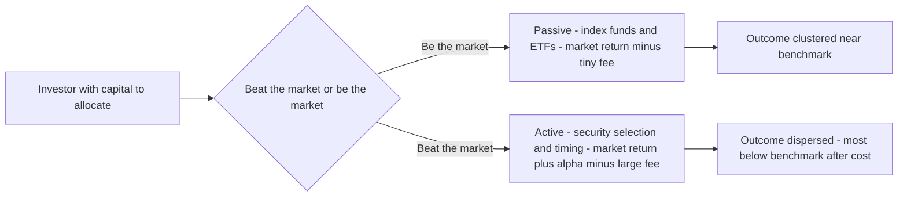
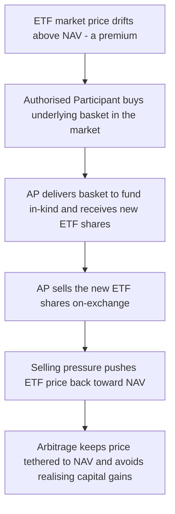
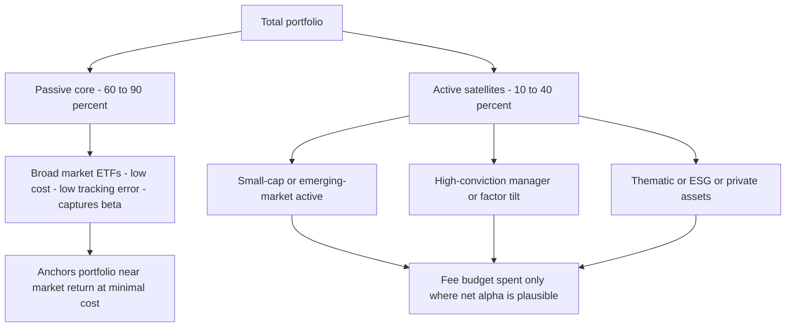
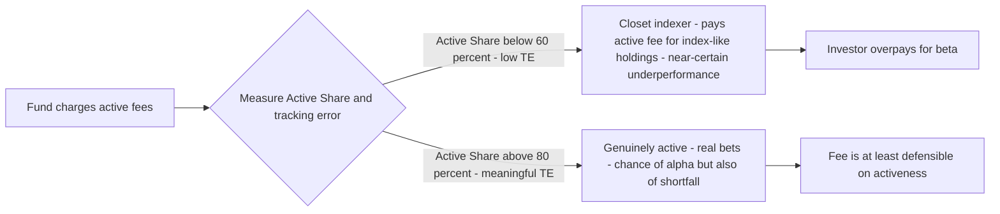

# Chapter 17 — Passive vs Active Management

## 1. The Problem / Need

Every rupee or dollar an investor commits to markets faces one unavoidable strategic fork before a single security is bought: **do you try to beat the market, or do you try to be the market?**

This is not an academic curiosity. It is the single decision that most powerfully determines the *distribution* of an investor's long-run outcomes — more than security selection, more than the specific fund manager's brilliance, and often more than asset allocation at the margins. The reason is arithmetic, not opinion. Active management, in aggregate, is a **negative-sum game after costs**: the average actively managed dollar must, by construction, earn the market return *minus* the fees it pays to try to beat that market. Passive management accepts the market return *minus* a tiny fee. Over a 30-year horizon, the gap between a 0.03% index fund and a 0.85% active fund compounds into a difference that can consume a quarter or more of an investor's terminal wealth — before you even ask whether the active manager had any skill.

So the "need" this chapter addresses is threefold:

1. **A decision framework.** An investor — or an analyst advising one — must be able to justify, on evidence, whether to pay for active management at all, and where.
2. **An understanding of the machinery.** Index funds and ETFs are not magic; they are engineered products with tracking mechanisms, replication choices, and hidden frictions. Interview candidates are routinely asked "how does an ETF actually track its index?" and "why is an ETF more tax-efficient than a mutual fund?"
3. **A resolution of a genuinely contested debate.** The passive-vs-active question is often presented as a religious war. It is not. The evidence is nuanced, the arithmetic is airtight, and the sophisticated answer is a *synthesis* — most famously the **core-satellite** approach.

Consider two savers, each investing $10,000 per year for 30 years into a market returning 8% gross annually. One holds a passive fund costing 0.05%; the other holds an active fund costing 0.85% that, being average, delivers the market return before fees. This is the picture the rest of the chapter unpacks:

*Figure 17.1 — The single strategic fork that shapes the distribution of every investor's outcome.*

---

## 2. Core Idea

**Passive management** aims to *replicate* the return of a defined market index (the S&P 500, the Nifty 50, the MSCI World) by holding the index's constituents in the index's weights, and doing as little else as possible. Its philosophy: markets are hard to beat, information is largely priced in, so minimise cost and tracking error and capture the market's return in full. Its instruments are **index mutual funds** and **exchange-traded funds (ETFs)**.

**Active management** aims to *beat* a benchmark through skill — selecting securities expected to outperform, avoiding those expected to underperform, timing entry and exit, or tilting toward factors and themes. Its philosophy: markets are imperfectly efficient, mispricings exist, and a skilled analyst can identify them net of the costs of trying. Its instrument is the actively managed fund (or a segregated mandate, hedge fund, etc.).

The core idea that reconciles them is **William Sharpe's "Arithmetic of Active Management" (1991)**, one of the most important and under-appreciated results in finance. It states, as an accounting identity that requires *no assumptions about market efficiency*:

> Before costs, the return on the average actively managed dollar equals the return on the average passively managed dollar. After costs, the return on the average actively managed dollar is *less* than the return on the average passively managed dollar.

This is true by definition. The market is the sum of all its participants. Passive investors hold the market portfolio; therefore the *remaining* (active) holdings must also, in aggregate, be the market portfolio. So active and passive earn the same gross return in aggregate — but active pays more to do it. **Active management is a zero-sum game before costs and a negative-sum game after costs.** For every active winner there is an active loser, and the whole active cohort loses the fee bill to the fund industry.

This single result is why the *burden of proof* sits on active management. Passive is the default that must be argued away from, not toward.

---

## 3. Why / How It Works

### 3.1 Why passive works: the cost case and the arithmetic

The passive case rests on three legs.

**Leg 1 — Sharpe's arithmetic (above).** Costs are the only certainty. A 0.85% annual fee is a *guaranteed* 0.85% headwind; the alpha that is supposed to offset it is uncertain and, on average, absent. The distribution of active returns is roughly symmetric around the benchmark *before* fees, but fees shift the entire distribution left, so the *median* active fund lands below the benchmark.

**Leg 2 — the Efficient Market Hypothesis (EMH), in its useful weak form.** You do *not* need to believe markets are perfectly efficient to prefer passive. You only need to believe they are efficient *enough* that the marginal mispricing is too small, too rare, or too costly to exploit reliably after fees and trading costs. In large, liquid, heavily-researched markets (US large-cap being the archetype), thousands of well-resourced analysts compete away obvious mispricings, so the *net* opportunity is thin.

**Leg 3 — compounding of the cost drag.** Fees do not subtract linearly; they compound. A cost drag reduces the base on which all future returns compound. This is the "tyranny of compounding costs" (Bogle). Over decades it is enormous.

The compounding arithmetic, precisely: if the market compounds at gross rate $g$ and the fund charges expense ratio $c$, terminal wealth multiple after $n$ years is $(1+g-c)^n$ (approximately, ignoring the second-order interaction). The *fraction of the gross-return wealth lost to fees* is:

$$\text{Fee drag fraction} = 1 - \left(\frac{1+g-c}{1+g}\right)^n$$

For $g = 0.08$, $c = 0.0085$, $n = 30$: $\left(\frac{1.0715}{1.08}\right)^{30} = (0.99213)^{30} = 0.789$. So **21% of the wealth you would have had is gone to fees** — and that is *before* the active fund underperforms on skill.

### 3.2 How index funds and ETFs actually track the index

An index fund's job is to make its return hug the index's return. There are three replication methods:

| Method | What it does | Used when | Trade-off |
|---|---|---|---|
| **Full replication** | Hold every constituent in exact index weight | Concentrated, liquid indices (S&P 500, Nifty 50) | Lowest tracking error; costly for broad indices |
| **Sampling / optimisation** | Hold a representative subset chosen to match the index's risk factors | Very broad indices (total-market with 3,000+ names, illiquid small-caps) | Cheaper to run; introduces sampling tracking error |
| **Synthetic (swap-based)** | Hold a collateral basket and enter a total-return swap with a bank to receive the index return | Hard-to-access markets, some European ETFs | Low tracking error but adds counterparty risk |

**The ETF creation/redemption mechanism** is what makes ETFs distinctive and is a favourite interview topic. An ETF trades on an exchange like a stock, but its supply is elastic through **authorised participants (APs)** — large institutions (market makers) who can create and redeem shares in large blocks ("creation units", typically 50,000 shares):

- If the ETF's market price rises *above* its net asset value (NAV) — a premium — an AP buys the underlying basket of securities in the open market, delivers it **in-kind** to the fund, and receives newly created ETF shares, which it sells on-exchange. This selling pushes the price back down toward NAV.
- If the ETF trades *below* NAV — a discount — the AP buys cheap ETF shares on-exchange, redeems them with the fund for the underlying basket **in-kind**, and sells the basket. This buying pushes the price back up.

This continuous arbitrage keeps the ETF price tethered to NAV. It also delivers the ETF's celebrated **tax efficiency**: because redemptions are settled *in-kind* (securities out, not cash), the fund can hand its lowest-cost-basis shares to redeeming APs and never realises a capital gain. A traditional mutual fund, by contrast, must sell securities for cash to meet redemptions, realising gains that are distributed to *remaining* shareholders as a taxable event they did not choose.

*Figure 17.2 — The creation-and-redemption arbitrage loop that keeps an ETF priced at NAV and makes it tax-efficient.*

### 3.3 How active management is *supposed* to work

Active managers seek **alpha** — return in excess of what the benchmark (or the CAPM/factor model) predicts for the risk taken. Sources of purported alpha:

- **Security selection** — fundamental analysis to find under/overvalued securities.
- **Market timing** — shifting between asset classes or cash based on macro views.
- **Factor tilts** — systematically overweighting value, momentum, quality, small-cap (though these are increasingly available *passively* as "smart beta", blurring the line).

The **Grossman-Stiglitz paradox** explains why *some* active management must survive: if markets were perfectly efficient, no one would be paid to gather information, so no one would — and then prices would *not* reflect information and markets would become inefficient. Active managers are, collectively, the mechanism that *makes* markets efficient. They must earn *some* gross return for gathering information, or they would stop. So an equilibrium amount of active management persists. But this equilibrium says nothing about whether the *marginal* fund you can buy is skilled enough to beat its fee — and the evidence (Section 4) says most are not.

---

## 4. Full Content

### 4.1 The evidence: what SPIVA and persistence studies actually show

The empirical case for passive is remarkably robust and consistent across decades and geographies. The gold-standard dataset is **S&P Dow Jones Indices' SPIVA (S&P Indices Versus Active) scorecards**, published semi-annually since 2002, which compare active funds against the appropriate benchmark and — crucially — correct for **survivorship bias** (dead/merged funds are counted, not quietly dropped).

Stylised but representative findings (directionally stable across many reports):

- Over a **1-year** horizon, roughly 50–65% of active US large-cap funds underperform the S&P 500 in a typical year (it varies with the market regime).
- Over **10 years**, roughly **85–90%** underperform.
- Over **15–20 years**, the underperformance rate climbs to **~90–95%**.

Two mechanisms drive the deterioration with horizon: (1) the fee drag compounds, and (2) survivorship — poor funds close, so the longer the window, the more the initial cohort has been culled, and the survivors *still* mostly lag.

The second devastating finding concerns **persistence** — do past winners keep winning? S&P's **Persistence Scorecard** repeatedly shows that a top-quartile fund in one period is roughly *no more likely than chance* (often *less* likely) to remain top-quartile in the next. Of the funds in the top quartile in a given year, only a tiny fraction remain top-quartile four or five years later — fewer than random reshuffling would predict. This is the empirical dagger: even if skilled managers exist, **past performance does not reliably identify them ex ante**, which is exactly the information an investor needs.

### 4.2 The cost anatomy — why active costs so much more

The headline expense ratio understates the true cost gap:

| Cost component | Passive index fund / ETF | Active fund | Note |
|---|---|---|---|
| Management/expense ratio | 0.03%–0.20% | 0.50%–1.50%+ | The visible, quoted number |
| Trading / transaction costs | Very low (low turnover ~3–15%) | Higher (turnover 50%–150%+) | Not in the expense ratio; drags NAV |
| Bid-ask spread & market impact | Minimal | Meaningful for large, active traders | Hidden cost of turnover |
| Cash drag | Minimal | Active funds hold cash for redemptions/timing | Idle cash lags a rising market |
| Tax (taxable accounts) | Low (ETF in-kind efficiency) | Higher (realised gains from turnover) | Huge in taxable accounts |

The often-quoted figure is that all-in active costs run **1–2% per year higher** than passive once turnover and taxes are included. Against an equity risk premium of perhaps 4–5%, that is a colossal, certain handicap.

### 4.3 When active *can* add value

The passive case is strong but not absolute. Active management can add value under identifiable conditions — this is where a nuanced analyst separates from a dogmatist.

**(a) Genuinely inefficient market segments.** Sharpe's arithmetic holds in *every* market, but the *dispersion* of active outcomes and the *size* of exploitable mispricings vary enormously. Efficiency is a spectrum:

| More efficient (passive strongly favoured) | Less efficient (active more defensible) |
|---|---|
| US / developed large-cap equity | Small-cap and micro-cap equity |
| Sovereign/investment-grade bonds | Emerging & frontier market equity |
| Highly liquid, heavily-researched names | Distressed debt, high-yield credit |
| — | Private markets, real assets, catastrophe bonds |

In thinly-covered small-caps or frontier markets, fewer analysts compete, information is unevenly distributed, and skilled work can find durable mispricings. Notably, SPIVA data is *less* uniformly damning for some active bond and small-cap categories than for US large-cap — though even there passive usually wins after fees.

**(b) Documented, repeatable skill.** A minority of managers do appear to possess genuine skill. Academic work (e.g., Fama-French 2010 on the cross-section of fund alphas; Berk-van Binsbergen 2015 on value added) finds the alpha distribution is consistent with *a few* truly skilled managers whose gross alpha is real — but two problems remain: skill is scarce, and it is **hard to distinguish from luck ex ante** with a short track record. Berk and van Binsbergen add a subtle point: skilled managers *capture* their alpha in fees (and by growing AUM until returns to scale are exhausted), so the skill accrues to the *manager*, not necessarily the investor.

**(c) Non-return objectives.** Active management is legitimately used for goals a market-cap index cannot serve: liability-driven investing, ESG/values screening, tax-loss harvesting, downside/tail-risk management, or bespoke exposure. Here "beating the benchmark" is not even the objective.

**(d) Structural / capacity constraints and inefficiency by mandate.** Some inefficiencies arise from forced behaviour: index reconstitution effects (front-running additions/deletions), forced selling by mandate-constrained holders, or fire sales — exploitable by flexible active capital.

**(e) The reflexive limit — how much passive is too much?** If passive grows without bound, price discovery weakens and mispricings widen, *increasing* the payoff to active. This self-correcting dynamic means passive can never fully "win"; the two coexist in equilibrium (the Grossman-Stiglitz insight applied at market scale). This is a live debate as passive approaches ~50% of US fund assets.

### 4.4 The core-satellite approach — the practical synthesis

Rather than choosing *either* passive *or* active, sophisticated investors combine them in a **core-satellite** architecture:

- The **core** (typically 60–90% of the portfolio) is passive: low-cost, broadly diversified index funds/ETFs that capture market beta cheaply and reliably. This anchors the portfolio near the market return and controls overall cost.
- The **satellites** (the remaining 10–40%) are concentrated active positions deployed *only* where the investor has genuine conviction that active can add value — inefficient segments, a manager with demonstrated skill, a thematic/factor tilt, or a specific objective.

The logic is a cost/conviction budget. You get the market's return cheaply in the core, and you *spend your fee budget and your career risk deliberately* on the few bets where the expected net alpha justifies the cost. It caps the damage active can do (limited to the satellite sleeve) while preserving the upside where active is defensible.

*Figure 17.3 — Core-satellite architecture: a cheap passive core plus deliberate active satellites where value-add is defensible.*

### 4.5 Tracking error and closet indexing

**Tracking error** is the standard deviation of the difference between a fund's return and its benchmark's return, usually annualised:

$$\text{TE} = \sqrt{\frac{1}{n-1}\sum_{t=1}^{n}\left(R_{f,t} - R_{b,t}\right)^2} \quad \text{(as std dev of the active return series)}$$

where $R_{f,t}$ is the fund return and $R_{b,t}$ the benchmark return in period $t$. (Some define TE on the *demeaned* differences — the standard deviation of active returns; others loosely use the mean absolute difference. The standard-deviation-of-active-return definition is the professional one.)

TE means opposite things for the two strategies:

- For a **passive** fund, TE is a *quality defect*. An index fund's whole job is to match the index, so a good index fund has TE of only a few basis points to ~0.20%. High TE means poor replication — from fees, cash drag, sampling error, or securities-lending timing. **Lower is better.**
- For an **active** fund, TE is a *measure of how active the manager is*. To beat the benchmark you must *differ* from it; you cannot outperform an index you are hugging. High TE (say 4–10%) signals genuine active bets. **You cannot get alpha with zero TE.**

This sets up **closet indexing** — the industry's dirty secret. A closet indexer is an "active" fund that charges active fees (0.8%–1.2%) but holds a portfolio that barely deviates from its benchmark (low TE, high overlap). The investor pays for skill and gets, in substance, an expensive index fund — guaranteeing underperformance by roughly the fee.

The tool that exposes this is **Active Share** (Cremers & Petajisto, 2009): the fraction of a fund's holdings that differ from the benchmark, computed as:

$$\text{Active Share} = \frac{1}{2}\sum_{i=1}^{N}\left|w_{fund,i} - w_{benchmark,i}\right|$$

where $w_{fund,i}$ and $w_{benchmark,i}$ are the weights of security $i$ in the fund and benchmark. It ranges from 0% (pure index) to 100% (no overlap). Cremers-Petajisto found:

- Funds with Active Share **below ~60%** are effectively closet indexers.
- Genuinely active funds (Active Share **above ~80–90%**) that also concentrate their bets showed *some* evidence of outperformance in their sample — though this finding is debated and weaker out-of-sample.

The practical rule: if you pay active fees, demand *evidence* of activeness — meaningful Active Share and TE. Otherwise you are paying a Ferrari price for a bus that follows the index bus.

*Figure 17.4 — Active Share and tracking error distinguish genuine active management from closet indexing.*

---

## 5. Worked / Applied Examples

### Example 1 — The compounding cost of active fees (the core arithmetic)

Two investors each invest a **lump sum of $100,000** for **30 years**. The market returns **8% gross** annually. Investor P holds a passive fund with expense ratio **0.05%**; Investor A holds an *average* active fund charging **0.85%** that, being average, earns the market's gross return before fees. Assume net return = gross − expense ratio.

- Investor P net return: $8\% - 0.05\% = 7.95\%$.
  Terminal wealth $= 100{,}000 \times (1.0795)^{30}$.
  $(1.0795)^{30}$: $\ln(1.0795) = 0.076486$; $\times 30 = 2.29458$; $e^{2.29458} = 9.920$.
  **Terminal wealth ≈ $992,000.**

- Investor A net return: $8\% - 0.85\% = 7.15\%$.
  Terminal wealth $= 100{,}000 \times (1.0715)^{30}$.
  $(1.0715)^{30}$: $\ln(1.0715) = 0.069056$; $\times 30 = 2.07168$; $e^{2.07168} = 7.938$.
  **Terminal wealth ≈ $793,800.**

**The 0.80% annual fee difference destroyed about $198,000 — roughly 20% of the passive investor's terminal wealth — purely to cost, before any skill deficit.** And recall: the *average* active fund does *not* even match the gross market return, because Sharpe's arithmetic guarantees the aggregate active pool earns the market gross return, while trading costs push the median further down. So $793,800 is optimistic; the realistic median active outcome is lower still.

*Reconciliation check:* fee-drag fraction formula $1 - (1.0715/1.08)^{30}$. Here I used net = gross − fee, so compare $9.920$ vs $7.938$; ratio $= 0.800$, i.e. 20% lost — consistent with the earlier 21% estimate (small difference because the earlier example used 0.85% against a fee-free 8% base rather than a 0.05% base). Both land at ~20%. ✓

### Example 2 — Reading a fund's Active Share and tracking error

An advisor screens three "active" US large-cap funds, all benchmarked to the S&P 500 and all charging **0.90%**:

| Fund | Active Share | Tracking error | 10-yr net return vs S&P 500 |
|---|---|---|---|
| Fund X | 35% | 1.1% | −0.95% p.a. |
| Fund Y | 72% | 4.8% | +0.40% p.a. |
| Fund Z | 88% | 8.5% | +1.30% p.a. (but very volatile relative return) |

**Interpretation.**
- **Fund X** is a textbook **closet indexer**: 35% Active Share means 65% of it *is* the index. With TE of only 1.1%, it cannot deviate enough to overcome its 0.90% fee. Its −0.95% shortfall is almost exactly its fee (0.90%) plus a little trading cost — *precisely what the arithmetic predicts*. The client is paying active price for beta. **Recommendation: replace with a 0.05% index fund and pocket ~0.90%/yr.**
- **Fund Y** is genuinely active (72% Active Share, 4.8% TE) and has edged out the benchmark by 0.40% net. This is defensible — the manager took real bets that (net of the 0.90% fee) added value. Worth retaining, with monitoring.
- **Fund Z** is very active (88% AS, 8.5% TE) with the highest excess return — but the high TE means high relative volatility; the +1.30% could partly be luck, and a bad year could see it lag by many percent. Suitable only as a **satellite** with a small weight and long horizon.

**Lesson:** Active Share and TE let you *see* what you are paying for. Never pay active fees for Fund-X-type exposure.

### Example 3 — Designing a core-satellite portfolio

A client has **$1,000,000**, a 20-year horizon, and moderate risk tolerance. The advisor builds core-satellite:

- **Core (75% = $750,000):** total-world equity ETF at 0.08% + aggregate bond ETF at 0.05%. Blended core cost ≈ 0.07%.
- **Satellites (25% = $250,000):** deployed only where active is defensible —
  - $100,000 emerging-market small-cap active fund (inefficient segment), fee 1.10%.
  - $80,000 high-Active-Share concentrated global manager (documented skill), fee 0.95%.
  - $70,000 thematic clean-energy / private-markets sleeve, fee 1.20%.

**Blended cost:**
$$\text{Cost} = 0.75(0.07\%) + \frac{100{,}000}{1{,}000{,}000}(1.10\%) + \frac{80{,}000}{1{,}000{,}000}(0.95\%) + \frac{70{,}000}{1{,}000{,}000}(1.20\%)$$
$$= 0.0525\% + 0.110\% + 0.076\% + 0.084\% = 0.3225\%.$$

The whole portfolio costs **~0.32%** — a fraction of the 0.90%+ an all-active book would cost — yet retains targeted active exposure precisely where the evidence supports it. The passive core guarantees the bulk of the portfolio tracks the market cheaply; the active downside is *capped at the 25% satellite sleeve*. If every satellite underperformed by 1% net, the drag on the *total* portfolio is only $0.25 \times 1\% = 0.25\%$ — a bounded, deliberate risk.

---

## 6. Connections

- **Efficient Market Hypothesis (Ch. on market efficiency):** The passive case is EMH in practical dress. Weak/semi-strong efficiency in large-cap markets is *why* net alpha is scarce. The Grossman-Stiglitz paradox connects active management to the *production* of efficiency.
- **CAPM and factor models (Ch. on asset pricing):** "Beating the market" must be defined relative to a risk model. Alpha is the intercept in a regression of fund excess returns on factor returns. Much apparent alpha turns out to be *factor beta* (value, size, momentum) now available cheaply as **smart beta** — collapsing the space where traditional active can claim a premium.
- **Portfolio construction & diversification (Ch. on MPT):** The passive core *is* the market portfolio of MPT — the theoretically optimal risky portfolio under CAPM. Core-satellite is a practical bridge from the theoretical tangency portfolio to a real-world implementable book.
- **Behavioural finance:** The persistence of active management despite the evidence is itself a behavioural puzzle — overconfidence (both managers and investors believing *they* are the exception), performance-chasing, and the narrative appeal of a "story" over an index.
- **Fees and compounding (time value of money):** The cost case is an application of compounding; the fee drag is negative compounding.
- **Taxation:** ETF in-kind efficiency connects to after-tax return analysis; in taxable accounts the passive advantage widens materially.
- **Market microstructure:** The ETF creation/redemption arbitrage is an application of the law of one price and liquidity provision by market makers.

---

## 7. Key Terms

- **Passive management** — investing to replicate an index's return at minimal cost.
- **Active management** — investing to beat a benchmark through skill (selection/timing).
- **Index fund** — a mutual fund holding an index's constituents in index weights.
- **ETF (exchange-traded fund)** — an index (usually) fund whose shares trade intraday on an exchange, with supply managed by AP creation/redemption.
- **Authorised Participant (AP)** — an institution licensed to create/redeem ETF shares in large blocks, enforcing the price-NAV link via arbitrage.
- **Creation/redemption (in-kind)** — the mechanism where APs exchange baskets of underlying securities for ETF shares (and vice versa), delivering price efficiency and tax efficiency.
- **NAV (net asset value)** — the per-share market value of a fund's underlying holdings.
- **Premium/discount** — ETF market price above/below NAV.
- **Alpha** — return in excess of the risk-adjusted benchmark expectation.
- **Beta** — exposure to systematic market movement; the "market return" a passive fund captures.
- **Sharpe's arithmetic of active management** — the identity that active = passive gross, and active < passive net, in aggregate.
- **SPIVA** — S&P's survivorship-bias-corrected scorecards of active-vs-benchmark performance.
- **Survivorship bias** — the distortion from excluding funds that closed/merged.
- **Persistence** — whether past outperformers keep outperforming (evidence: barely, if at all).
- **Tracking error (TE)** — standard deviation of a fund's return minus its benchmark's return.
- **Active Share** — the % of holdings that differ from the benchmark; measures genuine activeness.
- **Closet indexing** — charging active fees for near-index holdings (low Active Share/TE).
- **Core-satellite** — a passive core plus targeted active satellites.
- **Smart beta / factor investing** — rules-based strategies capturing factor premia, sitting between passive and active.
- **Expense ratio** — the annual % fee charged by a fund.
- **Grossman-Stiglitz paradox** — perfectly efficient markets cannot exist because no one would then pay to gather information.

---

## 8. Common Confusions

**"Passive means you never lose money / it's low-risk."** No. Passive removes *manager* risk and cost, not *market* risk. An index fund falls exactly as much as the market in a crash. Passive vs active is about *how* you get market exposure, not *how much* market risk you take (that's asset allocation).

**"ETFs are always cheaper and better than index mutual funds."** Not universally. Broad index mutual funds can have expense ratios as low as top ETFs, and for regular automatic investing (dollar-cost averaging) a no-transaction-cost mutual fund can beat an ETF where you pay spreads/commissions. ETFs win on intraday tradability and (in taxable accounts) tax efficiency; index mutual funds win on simplicity for periodic contributions. Also note: an ETF can itself be *active*.

**"Some active funds beat the market, so active works."** Survivorship and selection bias. *Some* will beat by chance every period; the question is whether you can identify them *in advance* and whether the *cohort* wins. The evidence says no on both counts.

**"High tracking error is bad."** Only for a *passive* fund. For an active fund, near-zero TE is the red flag (closet indexing) — you cannot outperform without deviating.

**"Active Share above 80% guarantees outperformance."** No. High Active Share is *necessary* for outperformance but not *sufficient* — it means the manager is taking real bets, which can be right or wrong. It filters out closet indexers; it does not confer skill.

**"Alpha and outperformance are the same."** Alpha is *risk-adjusted* excess return. A fund can outperform the index simply by taking more factor risk (more small-cap, more value) — that's beta to a factor, not alpha. Proper attribution separates the two.

**"If everyone indexed, markets would break, so passive is self-defeating and you should be active."** The first clause is directionally true (price discovery would weaken), but it *strengthens* the case that active and passive coexist in equilibrium — it does not tell *you* that *your* chosen active fund will beat its fee today. The individual decision and the systemic argument are different questions.

**"Passive investors are free-riders who contribute nothing to price discovery."** Partly true and largely irrelevant to the individual: markets remain efficient as long as *enough* active capital does the price-discovery work. The free-rider can rationally take the efficient prices others produce.

---

## 9. Recap

- The choice between beating the market and being the market is the highest-leverage strategic decision in investing.
- **Sharpe's arithmetic** proves, with no efficiency assumption, that active management is **zero-sum before costs and negative-sum after costs**. The average active dollar *must* underperform the average passive dollar by the fee gap.
- **Evidence (SPIVA, persistence studies)** corroborates the arithmetic: ~85–95% of active funds underperform over 10–20 years, and past winners do not reliably repeat. The burden of proof lies on active.
- The **cost case** compounds: an ~0.8% fee gap can consume ~20% of terminal wealth over 30 years — before any skill deficit.
- **Index funds and ETFs** implement passive via full replication, sampling, or synthetic swaps. **ETFs** add intraday trading and superior tax efficiency through the **AP creation/redemption** arbitrage that keeps price ≈ NAV.
- **Active can add value** in *inefficient segments* (small-cap, EM, distressed, private), with *documented and repeatable skill* (rare and hard to identify ex ante), or for *non-return objectives* (ESG, tax, liabilities).
- **Tracking error** is a defect for passive but a *requirement* for active. **Closet indexing** — high fee, low Active Share/TE — is the trap to avoid; **Active Share** exposes it.
- The **practical resolution is not either/or but core-satellite**: a cheap passive core for market beta plus deliberate active satellites where net alpha is plausible — capping active downside while retaining defensible upside.

---

## 10. Quick-Reference / Interview Points

**One-liners to have ready:**
- *"Active management is zero-sum before fees and negative-sum after — that's Sharpe's arithmetic, and it needs no assumption about efficiency."*
- *"You don't have to believe markets are perfectly efficient to prefer passive; you only need to believe net alpha is too scarce to pay for reliably."*
- *"SPIVA: ~90% of active large-cap funds lag over 15 years, survivorship-corrected — and past winners don't persist."*
- *"An ETF stays at NAV because Authorised Participants arbitrage premiums/discounts via in-kind creation and redemption — which is also why ETFs are tax-efficient: in-kind redemptions never realise a capital gain."*
- *"You can't earn alpha with zero tracking error — closet indexers charge active fees for index exposure; check Active Share."*
- *"The sophisticated answer isn't passive-or-active, it's core-satellite: cheap beta in the core, deliberate active bets in the satellites."*

**Key formulas:**
- Fee-drag fraction over $n$ years: $1 - \left(\frac{1+g-c}{1+g}\right)^n$.
- Tracking error: std dev of $(R_{fund} - R_{benchmark})$.
- Active Share: $\frac{1}{2}\sum_i |w_{fund,i} - w_{bench,i}|$, from 0% (index) to 100% (no overlap).

**Numbers worth memorising:**
- Typical passive cost 0.03–0.20%; typical active cost 0.5–1.5%+.
- All-in active cost drag vs passive ≈ 1–2%/yr including turnover and tax.
- Active underperformance: ~50–65% over 1yr, ~85–95% over 10–20yrs.
- Active Share < 60% ≈ closet indexer; > 80% ≈ genuinely active.
- Passive core typically 60–90% of a core-satellite book.

**Likely interview questions and the crisp answer:**
1. *"Why does the average active fund underperform?"* → Sharpe's arithmetic + compounding costs; it's structural, not a skill statement.
2. *"How does an ETF track its index and stay at NAV?"* → Replication method + AP creation/redemption arbitrage.
3. *"Why are ETFs tax-efficient?"* → In-kind redemptions let the fund shed low-basis lots without realising gains.
4. *"When would you recommend active?"* → Inefficient segments, evidence of skill (high Active Share), or non-return objectives — sized as satellites.
5. *"What's closet indexing and how do you detect it?"* → Active fee, index-like holdings; detect via low Active Share and low tracking error.
6. *"If passive keeps growing, does active make a comeback?"* → In principle yes — weaker price discovery widens mispricings and raises the payoff to active; the two coexist in equilibrium (Grossman-Stiglitz).
7. *"Isn't tracking error bad?"* → For passive yes, for active it's necessary — the right frame is *whose* fund and *what* objective.

**The one-sentence resolution of the debate:** *For the bulk of a portfolio in efficient markets, pay as little as possible to be the market; spend a bounded, deliberate fee budget on active only where inefficiency or genuine skill gives net alpha a fighting chance — and that synthesis is core-satellite.*
