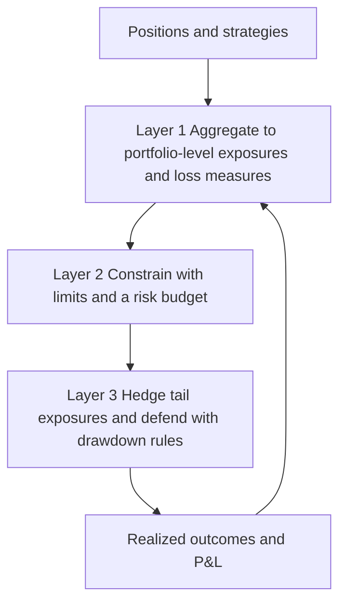
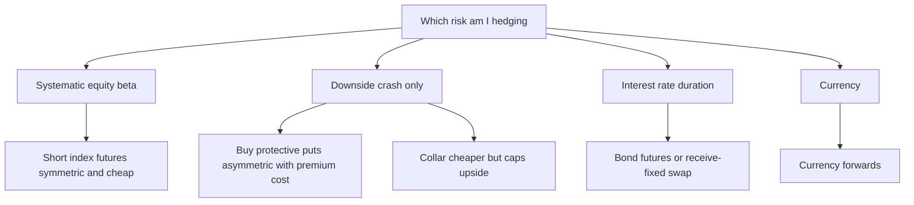
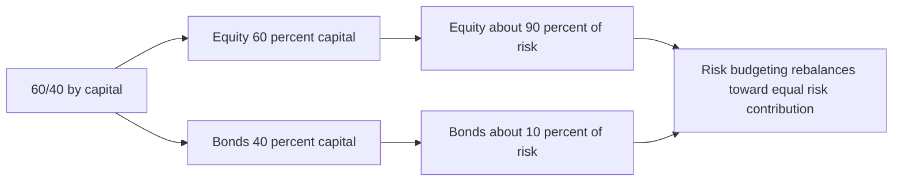
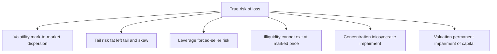

# Chapter 18 — Portfolio Risk Management

## 1. The Problem / Need

Every prior chapter taught you to *measure* risk — variance, beta, tracking error, duration, VaR. This chapter is about the harder discipline: what you actually *do* about it, before it does something to you. Measurement is diagnosis; risk management is treatment. And treatment is where most blow-ups actually happen, because the failure is almost never "we could not calculate the number" — it is "we calculated the number, believed it too much, sized the position too big, and had no plan for the day the number was wrong."

Consider three real archetypes an aspiring analyst should carry in their head:

- **Long-Term Capital Management (1998).** Nobel-laureate-run, models everywhere, VaR reported daily. It was leveraged roughly 25-to-1 on the balance sheet and far higher through derivatives. When Russia defaulted, correlations that the model treated as independent all snapped to 1 at once. A portfolio that "should" lose a few percent in a bad month lost ~90% of its capital in weeks. The risk was measured; it was not *managed*.
- **Amaranth Advisors (2006).** A single natural-gas trader accumulated a concentrated calendar-spread position so large it was a material fraction of the entire market's open interest. When the spread moved against him, there was no one to sell to at anything near the marked price. Roughly $6.6 billion — over half the fund — evaporated in a week. This is a *concentration* and *liquidity* failure, invisible to a naive volatility number.
- **The quant "August 2007" event.** Many market-neutral equity funds ran the same factor bets. When one large fund deleveraged, it pushed down exactly the stocks everyone else was long and up the stocks everyone was short — a crowded-trade unwind. Diversification *within* each fund was real; diversification *across* funds was an illusion.

The common thread: **the danger was not the volatility they saw on a calm Tuesday. It was the tail — the leverage, the concentration, the liquidity, and the correlations that only appear when everyone needs the exit at once.** Portfolio risk management is the set of processes that keeps a portfolio *alive* through those events so that its edge has time to compound. A great investment strategy that occasionally goes to zero has a long-run compound return of zero. Survival is not a constraint on returns; over a long horizon it is the *precondition* for them.

This chapter builds the practitioner's toolkit: managing risk at the *portfolio* level rather than position by position; portfolio VaR and stress testing; hedging with derivatives; position and concentration limits; risk budgeting; drawdown management; and — running through all of it — the crucial distinction between *volatility* and the *true risk of permanent loss*.

## 2. The Core Idea

Risk management rests on one organizing insight: **the risk of a portfolio is not the sum of the risks of its parts, and the risk that matters is not the wiggle you see on normal days but the loss you suffer on abnormal ones.** Everything below is an elaboration of that sentence.

That splits into three layers that build on each other:

- **Layer 1 — Aggregate and see the whole.** Positions interact. Two "hedged" trades can be the same bet in disguise; two "different" desks can be short the same tail. You must roll everything up into portfolio-level exposures — net beta, factor loadings, currency, duration, sector, single-name — and then into portfolio-level loss measures (VaR, expected shortfall, stress losses). You cannot manage what you cannot see aggregated.
- **Layer 2 — Constrain and budget.** Once you can see it, you impose *ex-ante* discipline: position limits, concentration limits, leverage limits, and a *risk budget* that allocates a scarce quantity — total risk — across strategies the way a capital budget allocates cash. This is the proactive layer that prevents the position from ever getting big enough to kill you.
- **Layer 3 — Hedge and defend.** For the risks you choose to keep exposure to but not fully bear, you buy or build protection — index futures, options, credit hedges — and you set *reactive* rules (drawdown stops, de-grossing triggers) for when the ex-ante controls prove insufficient.

*Figure 18.1 — Portfolio risk management is a loop from seeing aggregate risk, to constraining it ex-ante, to hedging and defending, feeding back into what you see.*

Underneath sits the theme that gives the chapter its spine: **volatility is a measure of dispersion; true risk is the probability and magnitude of permanent, unrecoverable loss.** They coincide for a diversified, liquid, unleveraged, normally-distributed book. They diverge — sometimes catastrophically — the moment leverage, illiquidity, concentration, or fat tails enter. A risk manager's real job is to manage the gap between the two.

## 3. Why / How It Works

### Why portfolio risk is sub-additive (usually) — and why that can lull you

Recall from portfolio theory that the variance of a two-asset portfolio is

$$\sigma_p^2 = w_1^2\sigma_1^2 + w_2^2\sigma_2^2 + 2w_1 w_2 \rho_{12}\sigma_1\sigma_2.$$

Whenever $\rho_{12} < 1$, portfolio volatility is *less* than the weighted average of the components' volatilities. Diversification is a genuine free lunch in *normal* times, and it is why the whole discipline works at the portfolio rather than the position level: risk is not additive.

The danger is that the entire benefit rides on $\rho$. In a crisis, cross-asset correlations tend toward 1 as everything is sold to raise cash — the "correlations go to one" phenomenon. The diversification you *budgeted* for evaporates precisely when you need it. This is why a competent risk process never trusts a single, calm-period correlation matrix; it stresses the matrix.

### Why VaR is useful and simultaneously dangerous

Value at Risk answers a specific, bounded question: *over a given horizon, what loss will not be exceeded with a given confidence?* A 1-day 99% VaR of ₹10 crore means: on 99 of 100 days you lose less than ₹10 crore. It is useful because it is a single, comparable, aggregatable number across a whole firm, and regulators (Basel) built capital rules around it.

But it has three structural blind spots you must be able to articulate in an interview:

1. **It says nothing about the tail *beyond* the threshold.** VaR is the *best* of the bad days at the cutoff, not the average of the worst. A portfolio short deep out-of-the-money options can have a tiny VaR and a catastrophic loss just past the 99th percentile.
2. **It is not sub-additive.** VaR can violate the intuition that merging two portfolios should never increase total risk. This makes it a mathematically "incoherent" risk measure. **Expected Shortfall (ES / CVaR)** — the *average* loss *given* that you breach VaR — fixes both problems and is why Basel is migrating to it.
3. **It is a function of its assumptions.** Feed it a normal distribution and a calm-period covariance matrix and it will systematically understate tail risk, because real returns are fat-tailed and correlations are unstable.

The right mental model: **VaR is a speedometer, not a crash-test.** It tells you your speed on a normal road. Stress testing is the crash-test.

### Why stress testing is the necessary complement

Stress testing abandons the probability distribution and asks a *scenario* question instead: "If 2008 happened again, or oil doubled, or the rupee fell 15%, what would this book lose?" It is deliberately non-statistical — it does not care whether the event is "1-in-100" — because the events that kill portfolios are exactly the ones the historical distribution rated as impossible. Stress testing captures the fat tail, the correlation break, and the liquidity freeze that VaR smooths over.

### Why limits and budgets beat judgment in the moment

Human risk-taking is pro-cyclical: we feel *safest* right after a long calm (when valuations are stretched and positions are crowded) and *most frightened* at the bottom (when risk is actually cheapest). Pre-committed **limits** and a **risk budget** are a Ulysses-and-the-mast device: they bind the future, panicking or greedy version of you to the discipline of the calm, rational version. That is the deep "why" behind ex-ante controls — they exist because in-the-moment judgment is systematically biased at exactly the wrong times.

## 4. Full Content

### 4.1 Managing risk at the portfolio level

The first discipline is *aggregation*. A book is not a list of trades; it is a set of *exposures*, and the same exposure can hide inside many different-looking trades. The risk manager's job is to collapse the position list into a small number of factor exposures and see the *net* bet.

A practical portfolio-level risk report rolls up:

| Exposure dimension | What it aggregates | Example limit / view |
|---|---|---|
| **Net market (beta) exposure** | Sum of beta-weighted longs minus shorts | Net beta within [0.8, 1.2] for a benchmark-relative fund |
| **Gross exposure / leverage** | Longs + shorts as % of capital | Gross ≤ 200% for a long-short book |
| **Factor exposures** | Loadings on value, momentum, size, quality, etc. | No single style factor > X% of active risk |
| **Sector / industry** | Net weight vs benchmark by sector | ±5% active weight per GICS sector |
| **Single-name concentration** | Largest positions | No name > 5% of NAV |
| **Currency** | Net FX exposure by currency | Hedge ≥ 80% of non-base-currency assets |
| **Duration / DV01** (fixed income) | Portfolio interest-rate sensitivity | Active duration within ±1 year of benchmark |
| **Liquidity** | Days-to-liquidate at X% of ADV | ≥ 90% of book liquidatable in 5 days |

The essential move is netting. Two portfolio managers each "market-neutral" within their sleeve can, in aggregate, leave the fund net long financials and short technology by a wide margin. Only the aggregated view reveals it. Likewise, a "hedged" convertible-bond position (long bond, short stock) is really a bet on volatility, credit, and interest rates — the risk report must show *those* factor exposures, not just "one long and one short."

### 4.2 Portfolio VaR

**Definition.** The Value at Risk at confidence level $c$ over horizon $h$ is the loss $L$ such that $P(\text{loss} > L) = 1 - c$ over horizon $h$. Common conventions: 1-day or 10-day horizon; 95% or 99% confidence.

There are three standard ways to compute it:

**(a) Parametric / variance-covariance (delta-normal).** Assume returns are normally distributed. Then

$$\text{VaR} = z_c \cdot \sigma_p \cdot V,$$

where $z_c$ is the standard-normal quantile (1.645 for 95%, 2.326 for 99%), $\sigma_p$ is the portfolio return standard deviation over the horizon, and $V$ is portfolio value. For a multi-asset book, $\sigma_p = \sqrt{\mathbf{w}^\top \Sigma \mathbf{w}}$ where $\Sigma$ is the covariance matrix and $\mathbf{w}$ the value weights. *Fast and analytic; wrong for options and fat tails.*

**Time scaling.** Under the i.i.d. assumption, volatility scales with the square root of time: $\sigma_{h\text{-day}} = \sigma_{1\text{-day}}\sqrt{h}$. So a 10-day VaR ≈ 1-day VaR × $\sqrt{10}$. (This breaks down when returns autocorrelate or mean-revert.)

**(b) Historical simulation.** Take the last $N$ days of actual returns, apply them to today's portfolio, sort the resulting P&L, and read off the percentile. *No distributional assumption; captures real fat tails and correlations — but only the tails that happened to occur in your window, and it weights a 1-in-N event as exactly 1/N.*

**(c) Monte Carlo simulation.** Specify a stochastic model for the risk factors, draw thousands of scenarios, revalue the portfolio (including non-linear options) in each, and read the percentile. *Most flexible, handles non-linearity; only as good as the assumed model and the most computationally expensive.*

**Component and marginal VaR.** The truly useful portfolio outputs are the *decompositions*:

- **Marginal VaR** — how much total VaR changes for a small increase in a position. It is the risk "price" of adding to that position.
- **Component VaR** — each position's *contribution* to total VaR, which sums exactly to total VaR. This tells you *where your risk actually lives*, which is often startlingly different from where your capital lives. A 4% position in a volatile, correlated name can contribute more risk than a 20% position in a stable, diversifying one.

Component VaR is the single most important portfolio-VaR concept for a practitioner, because risk budgeting (Section 4.5) is done in these units.

**Expected Shortfall (ES / CVaR).** Because VaR is silent about the tail and not sub-additive, mature shops report **Expected Shortfall** — the average loss *conditional on* exceeding VaR:

$$\text{ES}_c = E[\,L \mid L > \text{VaR}_c\,].$$

ES is coherent (sub-additive) and tail-sensitive, and it is the measure Basel III's Fundamental Review of the Trading Book moved to (97.5% ES replacing 99% VaR).

### 4.3 Stress testing

Stress testing revalues the portfolio under *scenarios* rather than distributions. Three families:

1. **Historical scenarios.** Replay actual crises: the 2008 GFC, the 2020 COVID crash, the 1998 LTCM/Russia event, the 2013 taper tantrum, the 2022 rate shock. You apply the actual factor moves from those episodes to today's book.
2. **Hypothetical / forward-looking scenarios.** Construct plausible futures that have *no* historical precedent: "oil to $150 and a 200bp rate hike simultaneously," "a 20% rupee devaluation," "sovereign downgrade." These probe risks the history has not yet delivered.
3. **Reverse stress testing.** Start from the answer — "what set of moves would wipe out X% of our capital?" — and work backward to find the portfolio's specific vulnerabilities. This is the most revealing exercise because it surfaces hidden concentrations and the exact correlation assumptions the book is silently betting on.

The core value of stress testing is that it **relaxes the two assumptions that make VaR dangerous**: the distribution and the correlation matrix. A good stress test explicitly assumes correlations go to 1 (or flip), liquidity dries up (haircuts on marks), and volatility spikes — the joint regime that VaR's calm-period inputs cannot represent.

### 4.4 Hedging with derivatives

Hedging is buying or building offsetting exposure so that a risk you do not want to bear is transferred to someone who does. The main instruments:

**Index futures — hedging systematic (beta) risk.** To neutralize the market exposure of an equity book, short index futures. The number of contracts:

$$N = \beta_p \cdot \frac{V_p}{F},\qquad F = \text{index level} \times \text{multiplier}.$$

To move the portfolio from its current beta $\beta_p$ to a target beta $\beta^*$:

$$N = (\beta^* - \beta_p)\cdot \frac{V_p}{F}.$$

Futures are cheap, liquid, and symmetric — they remove downside *and* upside. Use them when you want to strip out market direction and keep only your stock-selection alpha.

**Options — asymmetric protection.**

- A **protective put** (long the portfolio + long a put) sets a floor: maximum loss is capped at the strike, while upside is retained, minus the premium paid. It is portfolio insurance — and, like insurance, it has an ongoing cost (premium bleed) that drags returns in calm markets.
- A **collar** (long put financed by a short call) cheapens or eliminates the premium by giving up upside above the call strike. A "zero-cost collar" funds the put entirely with the call — you pay in foregone upside instead of cash.
- Puts are the *only* hedge that protects against a gap/crash without symmetric upside loss, which is why they are the tail-hedge of choice despite their cost.

**Other hedges.** Interest-rate swaps and bond futures hedge duration; credit default swaps hedge default risk; currency forwards hedge FX; variance/VIX products hedge volatility itself.

**Static vs dynamic hedging.** A static hedge is set and held. A dynamic hedge (delta-hedging an option book) is continuously rebalanced as exposures change — powerful but vulnerable to gaps and liquidity, because it assumes you can keep trading. Portfolio insurance implemented via dynamic hedging (selling futures as markets fall) was a major amplifier of the 1987 crash: everyone's hedging rule said "sell into the fall" at once.

**Basis risk — the catch in every hedge.** A hedge is rarely perfect. If you hedge a portfolio of Indian mid-caps with Nifty 50 futures, the hedge covers large-cap market moves but not the mid-cap-vs-large-cap spread. The residual — the imperfect correlation between the exposure and the hedging instrument — is **basis risk**. You have not eliminated risk; you have *exchanged* price risk for basis risk, which you must judge to be smaller and more acceptable.

*Figure 18.2 — Choosing a hedge is a decision tree over which risk you are transferring and whether you will pay for symmetric or asymmetric protection.*

### 4.5 Position and concentration limits

Limits are hard, pre-committed ceilings that prevent any single source of risk from becoming existential. They are deliberately *dumb* rules — dumb in the sense of not requiring in-the-moment judgment — because that robustness is the point.

- **Position limits** cap the size of any single position (e.g., no name > 5% of NAV; no more than X% of a security's average daily volume, so the position stays liquidatable).
- **Concentration limits** cap *grouped* exposures — sector, country, issuer, factor, counterparty. The lesson of Amaranth is that a book perfectly within single-name limits can still be lethally concentrated in a *theme* (one calendar spread across many contracts).
- **Leverage limits** cap gross and net exposure as a multiple of capital. Leverage is the single variable that most reliably converts a survivable drawdown into a terminal one, because it forces selling at the bottom (margin calls) and magnifies the loss.
- **Liquidity limits** ensure the portfolio can be unwound within a defined horizon without moving the market against itself — the risk Amaranth and LTCM both ignored.
- **Counterparty / credit limits** cap exposure to any single trading counterparty (the risk that turned Lehman's failure into everyone's problem).

The unifying principle: **limits are how you make a bad outcome survivable in advance, because you cannot rely on being rational during the event.**

### 4.6 Risk budgeting

Risk budgeting reframes portfolio construction: instead of allocating *capital* (money) across strategies, you allocate *risk* (typically component VaR or volatility contribution). The insight is that capital weights and risk weights are wildly different — a 60/40 stock/bond portfolio puts 60% of the *money* in equities but roughly **90% of the risk**, because equities are ~3–4× as volatile. A "balanced" fund is, in risk terms, an equity fund with a bond garnish.

Formally, decompose total portfolio volatility into contributions. The **marginal contribution to risk** of asset $i$ is $\partial \sigma_p / \partial w_i$, and its **total risk contribution** is $\text{RC}_i = w_i \cdot \partial \sigma_p / \partial w_i$, with $\sum_i \text{RC}_i = \sigma_p$ exactly. Risk budgeting sets targets for each $\text{RC}_i$.

- **Risk parity** is the special case where every asset (or asset class) contributes *equal* risk. To equalize contributions you must *lever up* the low-volatility assets (bonds) and hold *less* of the high-volatility ones (equities) than capital weighting would suggest. This is the logic behind Bridgewater's All Weather and the broader risk-parity industry.
- More generally, an active manager sets an overall **risk budget** (e.g., 4% tracking error) and *allocates* that budget across bets — so many basis points of risk to sector tilts, so many to stock selection, so many to factor timing — and monitors each strategy's realized risk contribution against its budget.

Why it is powerful: risk, not capital, is the truly scarce and dangerous resource. Budgeting in risk units forces you to notice that a small-looking allocation to a volatile, correlated strategy can consume your entire risk budget — and to size it accordingly.

*Figure 18.3 — The same capital allocation and its risk allocation are very different pictures; risk budgeting manages the right one.*

### 4.7 Drawdown management

A **drawdown** is the peak-to-trough decline in portfolio value; **maximum drawdown (MDD)** is the worst such decline over a period. It is the risk measure investors *actually feel*, because it maps directly to the pain of watching wealth fall and to the temptation (or forced requirement) to capitulate at the bottom.

The mathematics of recovery is the reason drawdowns dominate long-run outcomes: **losses and the gains needed to recover them are asymmetric.**

| Drawdown | Gain required to recover |
|---|---|
| −10% | +11.1% |
| −20% | +25% |
| −33% | +50% |
| −50% | +100% |
| −80% | +400% |

A 50% loss requires a 100% gain to break even. This convexity is why drawdown control is not a comfort feature but a *return* feature: avoiding the deep hole is worth more than it looks, because you never have to climb out of it. It is also why leverage is so dangerous — it deepens the hole and, via margin calls, can prevent you from ever participating in the recovery.

Practical drawdown management tools:

- **Stop-losses and de-grossing triggers** — pre-set rules to cut exposure once a drawdown threshold is breached (e.g., "reduce gross by 25% at −10%, by 50% at −15%"). This mechanizes the discipline of not letting a manageable loss become terminal.
- **Volatility targeting** — scale gross exposure inversely to realized/forecast volatility so that risk stays roughly constant; exposure automatically falls as markets get turbulent (turbulence being highly correlated with drawdowns).
- **Trailing stops and drawdown-based fee/redemption terms** — high-water marks in hedge funds tie the manager's fee to recovering past peaks, aligning incentives with drawdown control.
- **Tail hedges** — a standing allocation to long puts or long-volatility positions that pay off precisely in the deep drawdowns, dampening MDD at the cost of a small ongoing premium.

The tension to hold in mind: stop-losses protect against the deep drawdown but can also lock in losses right before a rebound (whipsaw). The art is calibrating triggers to the strategy's natural volatility so you cut *tail* risk without being chopped up by normal noise.

### 4.8 Volatility versus the true risk of loss

This is the intellectual heart of the chapter and the distinction that separates a sophisticated answer from a textbook one.

**Volatility** ($\sigma$) is the standard deviation of returns — a symmetric measure of *dispersion*. It treats a +8% month and a −8% month as equally "risky." It is convenient because it is well-defined, computable, additive-in-variance, and central to Markowitz, CAPM, Sharpe, and VaR. For a diversified, liquid, unleveraged portfolio with roughly normal returns, volatility is a fine proxy for risk.

**True risk** is the probability and magnitude of *permanent, unrecoverable loss of capital* — the outcome from which the portfolio does not come back. The two diverge whenever any of the following are present:

| Volatility misses this | Why it matters |
|---|---|
| **Skew / fat tails** | Selling deep OTM options gives low volatility and steady income — until a crash delivers a catastrophic left-tail loss. Low $\sigma$, huge true risk. |
| **Leverage** | A levered position can have modest volatility but face margin calls that force liquidation at the bottom — turning a temporary mark-down into a permanent loss. |
| **Illiquidity** | Private assets and small-caps show *low reported* volatility because they are marked infrequently (stale prices), masking real risk. Illiquidity itself is a risk volatility does not see. |
| **Concentration** | A single-name or single-theme bet may have acceptable volatility until an idiosyncratic event (fraud, regulation) impairs it permanently. |
| **Upside vs downside asymmetry** | Volatility penalizes upside surprises equally with downside ones — but no investor fears making money. Downside deviation / semi-variance captures the asymmetry volatility ignores. |
| **Valuation / permanent impairment** | Overpaying for a great business is a *risk of loss* that has nothing to do with price wiggle; a stock can be low-volatility on its way to being permanently worth less. |

Two framings crystallize it. First, the value-investor's line (Buffett, Marks): **"Risk is the probability of permanent loss, not volatility."** A stock that falls 40% on temporary fear, that you can hold, may be *low* true risk (a chance to buy) despite *high* volatility. A stable, levered, illiquid income strategy may be *high* true risk despite *low* volatility. Second, the practitioner's synthesis: volatility is *a* dimension of risk — the day-to-day, mark-to-market dimension that matters if you can be forced to sell — but it is not *the* risk. The complete risk picture layers volatility *plus* tail risk (ES, stress loss), *plus* liquidity, *plus* leverage, *plus* concentration, *plus* the possibility of permanent impairment.

The managerial takeaway that ties the whole chapter together: **the tools of Sections 4.1–4.7 exist to manage the gap between volatility and true risk.** Stress testing and ES address fat tails; limits address concentration and leverage; liquidity limits address illiquidity; drawdown rules address the forced-seller path from temporary to permanent loss. Volatility tells you how bumpy the ride is; risk management is about making sure you arrive.

*Figure 18.4 — Volatility is one slice of true risk; the other slices are exactly what naive volatility measures miss.*

## 5. Worked / Applied Examples

### Example 1 — Parametric portfolio VaR and Expected Shortfall

A fund holds ₹100 crore. Its estimated annual return volatility is 20%. Assume ~250 trading days and normally distributed returns.

**1-day volatility:**
$$\sigma_{1d} = \frac{20\%}{\sqrt{250}} = \frac{0.20}{15.81} = 1.265\%.$$

**1-day 99% VaR** ($z = 2.326$):
$$\text{VaR} = 2.326 \times 0.01265 \times ₹100\text{ cr} = ₹2.94\text{ cr}.$$

Interpretation: on ~99 of 100 days, the daily loss is less than ₹2.94 crore.

**10-day 99% VaR** (square-root-of-time):
$$\text{VaR}_{10d} = ₹2.94\text{ cr} \times \sqrt{10} = ₹9.30\text{ cr}.$$

**Expected Shortfall (99%).** For a normal distribution, $\text{ES}_c = \sigma \cdot \dfrac{\phi(z_c)}{1-c}$. With $\phi(2.326) = 0.0267$ and $1-c = 0.01$:
$$\text{ES factor} = \frac{0.0267}{0.01} = 2.67.$$
$$\text{ES}_{1d} = 2.67 \times 0.01265 \times ₹100\text{ cr} = ₹3.38\text{ cr}.$$

Note ES (₹3.38 cr) exceeds VaR (₹2.94 cr): the *average* loss on a breach day is larger than the *threshold*, which is exactly the tail information VaR omits. **And this whole calculation assumes normality — if the true distribution is fat-tailed, both numbers understate reality**, which is why stress testing (Example 3) is mandatory.

### Example 2 — Hedging beta with index futures

A ₹50 crore equity portfolio has a beta of 1.30 to the Nifty 50. Nifty is at 24,000; the futures multiplier (lot size) is 50, so one contract controls 24,000 × 50 = ₹12,00,000 = ₹0.12 crore of index exposure.

**(a) Fully hedge to beta 0** (short futures):
$$N = \beta_p \cdot \frac{V_p}{F} = 1.30 \times \frac{₹50\text{ cr}}{₹0.12\text{ cr}} = 1.30 \times 416.7 = 542\text{ contracts (short)}.$$

Now suppose the market falls 5%. The portfolio (β = 1.30) loses ≈ 1.30 × 5% × ₹50 cr = **₹3.25 cr**. The short futures gain ≈ 5% × (542 × ₹0.12 cr) = 5% × ₹65.0 cr = **₹3.25 cr**. They offset — the systematic loss is neutralized, leaving only stock-selection (idiosyncratic) P&L. *This is how a long-short manager isolates alpha from market direction.*

**(b) Reduce beta from 1.30 to a target 0.80** instead of fully hedging:
$$N = (\beta^* - \beta_p)\cdot\frac{V_p}{F} = (0.80 - 1.30)\times \frac{₹50\text{ cr}}{₹0.12\text{ cr}} = -0.50 \times 416.7 = -208\text{ contracts}.$$
Short 208 contracts to dial market exposure down while keeping a net long tilt.

**Basis-risk caveat:** if the portfolio is mid-cap heavy, hedging with Nifty 50 leaves the mid-vs-large spread unhedged. In a "flight to quality" where large-caps hold up but mid-caps fall harder, the hedge under-protects and the fund still loses on the basis.

### Example 3 — Stress test vs VaR, and the correlation trap

A ₹100 crore book is split ₹50 cr equities and ₹50 cr corporate bonds. In calm-period data, equity–bond correlation is −0.30 (bonds cushion equity falls). Daily vols: equities 1.5%, bonds 0.4%.

**Normal-regime 1-day portfolio volatility** (weights 0.5/0.5):
$$\sigma_p = \sqrt{0.5^2(1.5)^2 + 0.5^2(0.4)^2 + 2(0.5)(0.5)(-0.30)(1.5)(0.4)}.$$
$$= \sqrt{0.5625 + 0.04 - 0.09} = \sqrt{0.5125} = 0.716\%.$$
1-day 99% VaR ≈ 2.326 × 0.716% × ₹100 cr = **₹1.67 cr**. Comfortable.

**Stress scenario — "risk-off crash":** equities −12% in a day, and the correlation *flips to +0.70* as investors dump *both* stocks and credit for cash; assume bonds fall −3% (credit spreads blow out, overwhelming any rate rally).
$$\text{Loss} = 0.5\times(-12\%) + 0.5\times(-3\%) = -6\%-1.5\% = -7.5\% = -₹7.5\text{ cr}.$$

The stress loss (**₹7.5 cr**) is ~4.5× the VaR (₹1.67 cr) — not because the VaR math was wrong, but because its two inputs (the calm-period correlation of −0.30 and the assumption of no fat tail) *both broke at once*. This is the precise mechanism behind LTCM and 2008: **the diversification you budgeted for disappears exactly when you draw on it.** The lesson an interviewer wants: never size a book to survive only its VaR; size it to survive its stress loss.

### Example 4 — Risk budgeting: capital weights lie

A pension runs 60% equities (σ = 18%), 40% bonds (σ = 5%), correlation 0.20.

**Portfolio volatility:**
$$\sigma_p = \sqrt{0.6^2(18)^2 + 0.4^2(5)^2 + 2(0.6)(0.4)(0.20)(18)(5)}$$
$$= \sqrt{116.6 + 4.0 + 8.64} = \sqrt{129.3} = 11.37\%.$$

**Risk contribution of equities.** Marginal contribution $= \dfrac{\partial \sigma_p}{\partial w_E} = \dfrac{w_E \sigma_E^2 + w_B \rho \sigma_E \sigma_B}{\sigma_p}$:
$$= \frac{0.6(324) + 0.4(0.20)(18)(5)}{11.37} = \frac{194.4 + 7.2}{11.37} = \frac{201.6}{11.37} = 17.73.$$
Total equity risk contribution $= w_E \times 17.73 = 0.6 \times 17.73 = 10.64\%$.

**Equities' share of total risk** $= 10.64 / 11.37 = $ **93.6%**.

So a portfolio that *looks* 60/40 by capital is **~94% equity risk** — practically an all-equity fund. To move toward **risk parity** (equal risk contribution) you would sharply *reduce* the equity weight and *lever up* the bonds. This is the number that convinces allocators the "balanced fund" label is misleading, and it is why risk budgeting — not capital budgeting — is the correct lens.

## 6. Connections

- **Portfolio theory (Ch 3–4):** the covariance matrix that powers diversification is the *same* matrix inside parametric VaR and risk budgeting. Risk management is Markowitz applied *defensively* — and stress testing is the admission that the matrix is unstable.
- **CAPM / beta (Ch 5):** beta is the exposure you hedge away with index futures to isolate alpha. Risk-adjusted performance (Sharpe, IR) and risk budgets are two sides of the same coin: return *per unit of risk* vs risk *allocated per bet*.
- **Fixed income (Ch 10):** duration and DV01 are the fixed-income analogues of beta; hedging them with swaps/bond futures is the same logic as equity beta hedging.
- **Performance measurement (Ch 11):** the Information Ratio's denominator (tracking error) *is* the active risk budget; a manager who blows the risk budget cannot be evaluated fairly. Drawdown and downside deviation feed Sortino and Calmar ratios.
- **Derivatives (options/futures chapters):** protective puts, collars, and delta-hedging are the mechanical toolkit; here they are deployed at the *portfolio* level.
- **Behavioral finance:** limits and drawdown rules exist because human risk appetite is pro-cyclical — greatest at tops, smallest at bottoms. Pre-commitment fights that bias.

## 7. Key Terms

- **Value at Risk (VaR):** the loss over a horizon not exceeded with a stated confidence; a threshold, not a worst case.
- **Expected Shortfall (ES / CVaR):** the *average* loss given VaR is breached; coherent and tail-sensitive.
- **Component VaR:** each position's contribution to total VaR; sums to total VaR; the unit of risk budgeting.
- **Marginal VaR:** change in total VaR from a small change in a position — the risk "price" of adding to it.
- **Stress testing:** scenario-based revaluation that ignores the probability distribution to capture tails and correlation breaks.
- **Reverse stress test:** start from a fatal loss and find the scenario that causes it.
- **Basis risk:** residual risk from an imperfect hedge — the exposure and the hedging instrument are not perfectly correlated.
- **Protective put / collar:** option structures giving a downside floor (put) with premium cost, optionally financed by capping upside (collar).
- **Hedge ratio (beta hedge):** $N = \beta_p V_p / F$ contracts to neutralize market exposure.
- **Concentration limit:** cap on grouped exposure (sector, issuer, theme, counterparty), not just single names.
- **Leverage:** ratio of exposure to capital; the primary converter of survivable losses into terminal ones.
- **Risk budget:** allocation of total portfolio risk (not capital) across strategies/bets.
- **Risk parity:** portfolio where every component contributes equal risk, achieved by levering low-vol assets.
- **Risk contribution:** $\text{RC}_i = w_i \,\partial\sigma_p/\partial w_i$, summing to $\sigma_p$.
- **Drawdown / maximum drawdown:** peak-to-trough decline; the felt measure of risk.
- **Volatility targeting:** scaling exposure inversely to forecast volatility to keep risk roughly constant.
- **Permanent loss of capital:** impairment from which the portfolio does not recover — the "true risk" volatility can miss.

## 8. Common Confusions

- **"VaR is the worst case."** No — it is the *best* of the bad tail, the threshold at the chosen percentile. Losses beyond it can be far larger; that is what ES and stress tests are for.
- **"Low volatility means low risk."** Only for a liquid, unlevered, diversified, roughly-normal book. Selling deep OTM options, levered carry, and illiquid private assets all pair low reported volatility with high true risk.
- **"A hedge eliminates risk."** It *transforms* price risk into basis risk (and adds cost/complexity). A poorly matched hedge can even add risk.
- **"Diversification protects me in a crash."** Diversification is a normal-times benefit; correlations converge toward 1 in crises. Budget for the stressed correlation, not the calm one.
- **"60/40 is balanced."** By capital, yes; by risk, it is ~90% equities. Balance must be judged in risk units.
- **"VaR is sub-additive so merging books can only reduce risk."** VaR is *not* sub-additive (that is a known defect); ES is. Do not assume portfolio VaR ≤ sum of standalone VaRs.
- **"Stop-losses guarantee protection."** They cap losses in orderly markets but can gap through in a crash and can whipsaw you out before a rebound. They manage, not eliminate, drawdown.
- **"Beta hedging removes all risk."** It removes *systematic* risk; idiosyncratic, basis, and factor risks remain — which is the whole point (you keep your alpha, and its risk).
- **"More hedging is always safer."** Hedges cost premium/carry and drag returns; over-hedging can guarantee underperformance. Risk management optimizes the *trade-off*, it does not minimize risk to zero.

## 9. Recap

Portfolio risk management is the treatment that follows risk measurement's diagnosis, and its purpose is *survival*, because a strategy that occasionally goes to zero compounds to zero. It operates in a loop: **see** the aggregate exposures and loss measures, **constrain** them ex-ante with limits and a risk budget, then **hedge and defend** the tails you keep. VaR gives a single comparable loss threshold but is blind beyond the tail and dependent on its assumptions; Expected Shortfall fixes its coherence and tail blindness; stress testing supplies the crash-test that VaR's speedometer cannot. Hedging with futures strips systematic beta symmetrically while options buy asymmetric crash protection at a premium — always leaving basis risk behind. Position, concentration, leverage, and liquidity limits are pre-committed rules that keep any one exposure from becoming existential, precisely because in-the-moment judgment is biased at the worst times. Risk budgeting allocates the truly scarce resource — risk, not capital — revealing that a 60/40 book is ~90% equity risk. Drawdown management respects the brutal asymmetry that a 50% loss needs a 100% gain to recover. And threading all of it is the master distinction: **volatility measures the bumpiness of the ride; true risk is the probability of permanent, unrecoverable loss** — and every tool in the chapter exists to manage the gap between the two.

## 10. Quick-Reference / Interview Points

- **VaR one-liner:** "The loss not exceeded with X% confidence over horizon h — a threshold, not a worst case. Blind beyond the tail, not sub-additive, assumption-dependent." Follow with: "That's why we report Expected Shortfall and stress test."
- **VaR vs ES:** VaR = the cutoff; ES = average loss *beyond* the cutoff. ES is coherent (sub-additive) and Basel FRTB's choice (97.5% ES).
- **VaR methods:** parametric (fast, wrong for options/tails), historical (real tails but only those observed), Monte Carlo (flexible, model-dependent, expensive).
- **Time scaling:** VaR scales with $\sqrt{h}$ under i.i.d.; 10-day ≈ 1-day × √10.
- **Component VaR:** where risk *actually* lives; sums to total VaR; the unit of risk budgeting.
- **Beta hedge formula:** $N = (\beta^* - \beta_p)\,V_p / F$. Know the sign (short to reduce beta).
- **Protective put vs collar:** put = floor with premium cost; collar = cheaper floor financed by capping upside.
- **Basis risk:** every hedge exchanges price risk for basis risk; name the mid-cap-hedged-with-Nifty example.
- **60/40 is ~90% equity risk** — cite this to demonstrate risk-budgeting fluency; risk parity levers bonds to equalize contributions.
- **Drawdown asymmetry:** −50% needs +100% to recover; this is *why* drawdown control is a return driver, and why leverage kills.
- **"Correlations go to 1"** in crises — the mechanism behind LTCM/2008; always stress the correlation matrix, never trust the calm one.
- **The money quote:** "Volatility is not risk; risk is the probability of permanent loss of capital." Then show you can operationalize it: fat tails → ES/stress; leverage → limits; illiquidity → liquidity limits; concentration → concentration limits.
- **Classic case studies:** LTCM (leverage + correlation), Amaranth (concentration + liquidity), 1987 portfolio insurance (dynamic hedging feedback), quant quake 2007 (crowded trades). Having one crisp example per failure mode signals real understanding.
