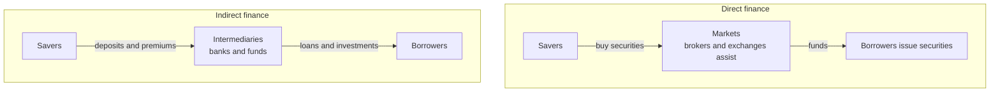
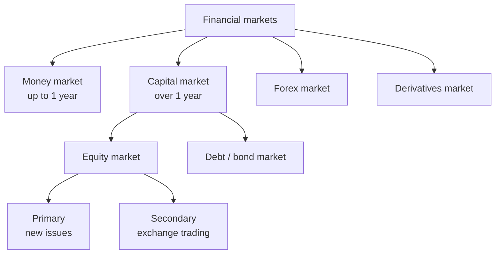
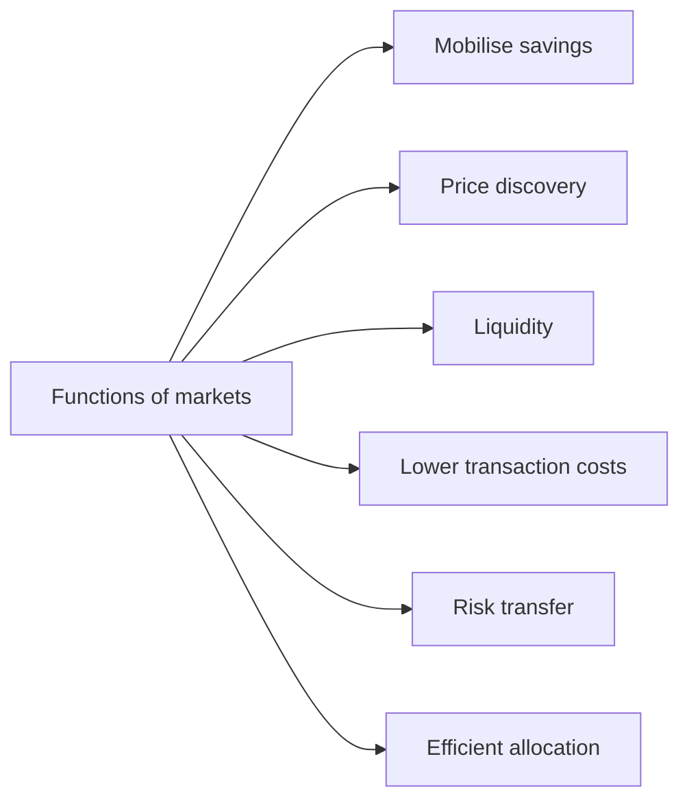

# Chapter 01 — The Financial System and Markets

## 1. The Problem / The Need

Imagine an economy stripped of any financial system. A farmer in Punjab has a good harvest and ends the year with surplus cash. A young engineer in Bengaluru has a brilliant idea for an electric-scooter company but no money. A retired teacher in Kochi has savings she wants to keep safe and grow slowly. A large steelmaker needs ₹5,000 crore to build a new plant that will only start earning eight years from now.

In a world without a financial system, none of these people can help each other. The farmer's cash sits idle in a tin box, losing value to inflation. The engineer's idea dies for want of capital. The teacher hides cash under a mattress, earning nothing and risking theft. The steelmaker cannot build. Society is poorer than it needs to be — not because it lacks resources, but because it lacks a *mechanism to move resources from those who have them to those who can use them productively*.

This is the fundamental problem the financial system solves. At its heart lie a handful of frictions that make "just lending your surplus to a stranger" nearly impossible on your own:

- **The unit / denomination problem.** The teacher has ₹8 lakh in savings. The steelmaker needs ₹5,000 crore. Their sizes don't match. Someone must pool many small savings into large investable sums.
- **The maturity / duration problem.** The farmer may want his money back next month. The steel plant won't generate cash for eight years. Savers want *liquidity and short horizons*; investment projects are *illiquid and long-lived*. Someone must reconcile these opposite time preferences — this is called **maturity transformation**.
- **The information problem.** The teacher cannot possibly evaluate the engineer's business plan, verify the steelmaker's accounts, or monitor whether the borrower is spending the money wisely. Economists call this **asymmetric information** — the borrower knows more than the lender, both *before* the deal (**adverse selection** — the riskiest borrowers are keenest to borrow) and *after* it (**moral hazard** — once they have your money, will they behave?).
- **The risk problem.** Any single loan can default. A saver who lends everything to one borrower is dangerously exposed. Risk must be *spread, priced, and transferred* to those willing and able to bear it.
- **The trust and enforcement problem.** Why should a stranger repay you? Without contracts, courts, records, and reputational systems, promises are worthless.

A financial system exists to overcome all of these frictions at once. It is the plumbing that lets a rupee saved by the teacher become a rupee invested by the engineer — safely, at scale, across time, with risk managed and information gaps bridged. When it works well, savings flow to their most productive uses, the economy grows faster, and both saver and borrower are better off. When it fails — as in 2008 globally, or in India's 2018 IL&FS/NBFC crisis — the plumbing bursts and the whole economy floods.

> **The one-line problem:** Savers and users of capital are different people, with different sizes, horizons, information and risk appetites. Left alone they cannot transact. The financial system is society's institutional solution to matching them.

---

## 2. The Core Idea

The core idea is deceptively simple: **channel surplus funds from savers (surplus units) to users of funds (deficit units), and in return hand savers a financial claim.**

A **financial claim** (or financial instrument, or security) is a piece of paper — today, an electronic record — that represents a *promise about future money*. When the teacher buys a government bond, she gives up cash today and receives a promise: "the Government of India will pay you interest every six months and return your principal in 2034." That promise is her asset; it is simultaneously the government's liability. **Every financial instrument is an asset to its holder and a liability to its issuer.** This double-entry nature is the DNA of all finance.

So the financial system is, at bottom, a giant machine for **manufacturing, distributing and trading claims on future income**. It has four interlocking components:

1. **Financial markets** — the venues and mechanisms where claims are created and traded (stock markets, bond markets, money markets, forex markets, derivatives markets).
2. **Financial institutions / intermediaries** — the organisations that stand between savers and borrowers (banks, mutual funds, insurers, pension funds, NBFCs).
3. **Financial instruments** — the claims themselves (equity shares, bonds, deposits, loans, insurance policies, derivatives).
4. **Financial infrastructure and regulators** — the rules, systems and referees that make the whole thing trustworthy (payment systems, depositories, clearing houses, SEBI, RBI).

The genius of the system is that it lets savers and borrowers *never have to meet or even know each other*. The teacher deposits money in HDFC Bank; HDFC lends to the scooter start-up. The teacher never learns the borrower's name and doesn't care — she trusts the bank. The system has transformed a direct, fragile, one-to-one relationship into a robust, many-to-many web mediated by trusted institutions and liquid markets.

---

## 3. How It Works — The Flow of Funds

### The circular flow

The best mental model is a **flow of funds** between two groups:

- **Surplus units (savers / lenders):** households mostly, but also profitable firms and governments with temporary surpluses. They spend less than they earn.
- **Deficit units (spenders / borrowers):** businesses that invest more than their retained earnings, governments that run fiscal deficits, and households borrowing for homes or consumption.

Funds flow *from* surplus units *to* deficit units. In the opposite direction flow **financial claims** (bonds, shares, deposit receipts) and, over time, **returns** (interest, dividends, repayment). It is a two-way street: money one way, promises and payments the other.

*Figure 1 — The circular flow of funds: money moves from savers to borrowers while claims and returns move back the other way.*

### Two routes: direct and indirect finance

Crucially, funds can travel two different roads from saver to borrower. This distinction is one of the most important in all of finance.

**Direct finance (financial markets route).** The borrower sells a claim *directly* to the saver through a market. When Reliance issues bonds and the teacher's mutual fund buys them, funds move straight from investor to issuer. Intermediaries like investment banks, brokers and exchanges *assist* the transaction (underwriting, matching, settling) but they do **not** create their own claims in between — the teacher ends up holding Reliance's actual bond.

**Indirect finance (financial intermediary route).** A bank or similar institution stands *in the middle* and issues its own claim to the saver while holding a different claim on the borrower. The teacher deposits ₹8 lakh in the bank (she holds a *deposit* — a claim on the bank). The bank lends that money to the scooter start-up (the bank holds a *loan* — a claim on the start-up). Two separate contracts; the intermediary's balance sheet sits between them. The saver has no direct relationship with the ultimate borrower at all.

*Figure 2 — Two roads from saver to borrower: through markets directly, or through an intermediary's balance sheet indirectly.*

### What intermediaries actually do (the transformation functions)

An intermediary earns its keep by *transforming* claims — turning the kind of claim savers want into the kind borrowers need:

- **Size / denomination transformation:** pool millions of small deposits into large loans. A ₹5,000 crore loan is funded by lakhs of ordinary depositors.
- **Maturity transformation:** fund long-term illiquid loans with short-term liquid deposits. This is banking's core magic — and its core danger (a "bank run" happens when everyone wants their short-term money back but it's locked in long-term loans).
- **Risk transformation:** by lending to hundreds of borrowers, diversify away individual default risk, so the depositor's claim is far safer than any single loan.
- **Information production:** specialise in screening borrowers (credit assessment) and monitoring them, solving adverse selection and moral hazard cheaply through scale and expertise.
- **Liquidity provision:** promise savers they can withdraw on demand even though the underlying assets are locked up.

This is why intermediaries exist at all: they reduce **transaction costs** and **information costs** so dramatically that the whole economy can afford to save and invest far more than individuals transacting one-to-one ever could.

---

## 4. Full Content — The Landscape in Detail

Now we lay out the full map: the instruments, the markets, the institutions, the functions, and how they classify.

### 4.1 Financial instruments (the claims)

Instruments sit on a spectrum from pure ownership to pure lending, with hybrids in between.

| Instrument | Nature | Holder's claim | Return | Risk to holder | Example |
|---|---|---|---|---|---|
| **Equity share** | Ownership | Residual — last in line, unlimited upside | Dividends + capital gains | Highest | Infosys share |
| **Preference share** | Hybrid | Fixed dividend, ahead of equity | Fixed dividend | Medium-high | Preference capital |
| **Debenture / Bond** | Debt | Fixed contractual repayment | Coupon interest | Lower | Reliance NCD, G-Sec |
| **Bank deposit** | Debt (on bank) | Principal + interest, on demand | Interest | Very low (insured to ₹5 lakh) | HDFC savings account |
| **Money-market instrument** | Short debt | Repayment within 1 year | Discount / interest | Low | T-bill, commercial paper |
| **Derivative** | Contingent | Payoff tied to an underlying | Varies (leveraged) | Very high | Nifty futures, options |
| **Insurance / pension** | Contingent | Payout on event / retirement | Protection + returns | Low | LIC policy, NPS |

Instruments are also classified by **maturity**:
- **Money-market instruments** — maturity of one year or less (Treasury bills, commercial paper, certificates of deposit, call money, repo).
- **Capital-market instruments** — maturity beyond one year, or perpetual (shares, bonds, debentures).

And by the **claim they represent**:
- **Debt** — a fixed promise to repay with interest; creditor has no ownership but ranks ahead of owners.
- **Equity** — an ownership stake with residual, variable returns and control rights (voting).
- **Hybrids** — preference shares, convertible debentures, that blend features of both.

### 4.2 Financial markets (the venues)

Markets are classified along several axes. A finance professional must fluently switch between them.

**By maturity of instrument traded:**
- **Money market** — short-term funds (≤1 year). Wholesale, largely institutional. In India: call/notice money, T-bills, CPs, CDs, repo. Managed heavily by the RBI; it's where liquidity and short-term interest rates are set.
- **Capital market** — long-term funds (>1 year). Where firms raise durable capital and investors take long positions. Splits into the equity market and the debt (bond) market.

**By whether the security is new or already existing:**
- **Primary market** — where securities are *issued for the first time*; funds actually reach the issuer. Mechanisms: IPO (initial public offer), FPO (follow-on), rights issue, private placement, QIP (qualified institutional placement). This is where *capital formation* happens.
- **Secondary market** — where *already-issued* securities are traded among investors. No money reaches the issuer; ownership simply changes hands. Stock exchanges (NSE, BSE) are secondary markets. Vital because it gives the primary market its *liquidity* — nobody would buy a new IPO share if they couldn't sell it later.

**By trading arrangement:**
- **Exchange-traded (organised) markets** — standardised, centralised, transparent, with a clearing house guaranteeing settlement (NSE, BSE, NYSE).
- **Over-the-counter (OTC) markets** — bilateral, customised, decentralised dealer networks (most bond trading, forex, many derivatives).

**By what is traded — the segments:**
- **Equity / stock market** — ownership shares.
- **Debt / bond market** — government securities (G-Secs) and corporate bonds. In India this is dominated by government borrowing and is far larger by value than equities, though less visible to the public.
- **Money market** — short-term debt (above).
- **Foreign-exchange (forex) market** — currencies; the largest market in the world by turnover (~$7.5 trillion a day globally).
- **Derivatives market** — futures, options, forwards, swaps, whose value *derives* from an underlying asset. Used for hedging and speculation.
- **Commodity market** — gold, crude, agri products (MCX, NCDEX in India).

*Figure 3 — The segments of the financial market landscape and how the capital market splits into equity and debt, primary and secondary.*

### 4.3 Financial institutions (the players)

**Banking institutions:**
- **Commercial banks** — the backbone of indirect finance; take deposits, make loans, run the payment system (SBI, HDFC, ICICI).
- **Central bank (RBI)** — the banker to banks and government, issuer of currency, setter of monetary policy, regulator of banks and the money market, and lender of last resort.
- **Cooperative and regional rural banks** — serve local and rural credit needs.

**Non-banking financial institutions:**
- **NBFCs** — lend and invest but cannot take demand deposits (Bajaj Finance, Shriram). Critical for consumer, vehicle and small-business credit in India.
- **Development finance institutions (DFIs)** — long-term project finance (historically ICICI/IDBI; now NaBFID).

**Investment / market institutions:**
- **Mutual funds / asset managers** — pool retail savings into diversified portfolios (SBI MF, HDFC AMC).
- **Insurance companies** — pool risk; huge long-term investors (LIC is India's largest institutional investor).
- **Pension funds** — invest retirement savings (EPFO, NPS).
- **Investment banks / merchant bankers** — underwrite and arrange primary issues, advise on M&A (Kotak, Axis Capital; globally Goldman Sachs, JPMorgan).
- **Foreign Portfolio Investors (FPIs)** — overseas institutions investing in Indian securities; major drivers of market direction.

**Market infrastructure institutions (MIIs):**
- **Stock exchanges** — NSE, BSE.
- **Depositories** — hold securities electronically (NSDL, CDSL) — the reason you no longer hold paper share certificates.
- **Clearing corporations** — guarantee and settle trades, removing counterparty risk (NSE Clearing, CCIL).

### 4.4 Regulators — the referees

A financial system runs on trust, and trust needs enforcement. India uses a **sectoral regulator** model:

| Regulator | Domain |
|---|---|
| **RBI** | Banks, NBFCs, money market, forex, payment systems, monetary policy |
| **SEBI** | Securities markets — stocks, bonds, mutual funds, brokers, exchanges |
| **IRDAI** | Insurance |
| **PFRDA** | Pensions (NPS) |
| **IBBI** | Insolvency and bankruptcy resolution |

Contrast with the **United States**, where the **SEC** (Securities and Exchange Commission) regulates securities markets, the **Federal Reserve** handles banking and monetary policy, the **CFTC** oversees commodity and futures derivatives, and the **FDIC** insures deposits. The UK famously consolidated most functions under the FCA and PRA. India's structure matters for interviews: *SEBI is India's SEC; RBI is India's Fed plus bank regulator.*

### 4.5 The Functions of Financial Markets

Why do we prize markets so highly? Because a well-functioning market performs six economic functions that no central planner could replicate:

1. **Mobilising savings / capital formation.** Markets aggregate scattered small savings and direct them toward productive investment — the engine of economic growth.

2. **Price discovery.** Through the continuous interaction of buyers and sellers, markets set a price that reflects the collective judgment of all participants about an asset's value. The Nifty level, a bond's yield, the rupee's exchange rate — each is a price *discovered*, not decreed. This price becomes a signal that guides real economic decisions: a high share price lowers a firm's cost of equity and encourages it to invest.

3. **Providing liquidity.** Markets let an investor convert a security back into cash quickly and at a fair price. Liquidity is what makes long-term investment palatable to short-term savers — you can buy a 10-year bond knowing you can sell it tomorrow if you must. Without secondary-market liquidity, the primary market would seize up.

4. **Reducing transaction and information costs.** Centralised, standardised, regulated markets slash the cost of finding a counterparty, negotiating terms, and settling. Disclosure rules and analysts reduce information asymmetry.

5. **Risk transfer / risk sharing.** Through diversification, insurance and especially derivatives, markets let risk move from those who don't want it to those willing to bear it for a price. A farmer hedges crop prices; an importer hedges currency; a pension fund diversifies across thousands of assets.

6. **Efficiency and allocation.** By pricing capital correctly, markets steer funds to their highest-value uses. Firms with good prospects raise capital cheaply; weak firms find it expensive — capital is *allocated efficiently*. This ties to the **Efficient Market Hypothesis (EMH)**, the idea that prices rapidly reflect all available information, so it's hard to consistently beat the market.

*Figure 4 — The six core functions a well-functioning financial market performs for the economy.*

---

## 5. Worked / Real Examples

### Example 1 — Indirect finance: how your savings account funds a business

Priya deposits ₹1,00,000 in her SBI savings account at 3% interest. She holds a *deposit claim* on SBI and can withdraw anytime. SBI pools Priya's deposit with millions of others and lends ₹50 lakh to a Coimbatore textile firm at 10% for five years. The firm holds a *loan liability*; SBI holds a *loan asset*.

Notice the transformations at work: SBI turned Priya's *small, on-demand, safe* claim into the firm's *large, five-year, riskier* borrowing. Priya never meets the textile firm, doesn't assess its creditworthiness, and bears almost no default risk (SBI does, cushioned by deposit insurance up to ₹5 lakh). SBI earns the spread — roughly 7% — for performing size, maturity, risk and information transformation. This is indirect finance in one paragraph.

### Example 2 — Direct finance via the primary market: an IPO

In 2021, **Zomato** raised about ₹9,375 crore through an IPO on the NSE and BSE. Investors — mutual funds, FPIs, retail applicants — paid cash directly for newly issued Zomato shares. That money went straight to Zomato (and selling shareholders); this is the **primary market** creating capital. Investment banks (Kotak, Morgan Stanley and others) acted as *merchant bankers/underwriters* — they priced, marketed and guaranteed the issue but did not become the ultimate lenders. The saver ended up holding Zomato's actual equity: direct finance.

The day trading began, those same shares started changing hands on the exchange between investors — the **secondary market**. Not one rupee of secondary trading reached Zomato, yet this trading is essential: it gives every IPO investor an exit and continuously *discovers* Zomato's price, which in turn tells the company and the world what its equity is worth.

### Example 3 — Global parallel and risk transfer: US Treasuries and a currency hedge

Globally, the deepest, most liquid market is **US Treasury securities** — debt issued by the US government, the benchmark "risk-free" asset that anchors world interest rates. When an Indian IT exporter like TCS expects to receive $10 million in three months, it faces *currency risk*: if the rupee strengthens, those dollars buy fewer rupees. TCS enters a **forward contract** with its bank to sell dollars at a fixed rate — transferring the currency risk to the bank (a derivatives-market function). Meanwhile a US pension fund parks cash in Treasuries for safety and liquidity. Same system, three functions on display: a benchmark price (Treasury yield), liquidity, and risk transfer via derivatives — spanning both the Indian and global markets.

### Example 4 — When the plumbing bursts: the 2018 IL&FS / NBFC crisis

IL&FS, a large Indian infrastructure-financing NBFC, had been doing textbook **maturity transformation** — funding long-term infrastructure loans with short-term borrowings (commercial paper). In 2018 it defaulted. Mutual funds that held its short-term paper took losses; suddenly no one would lend short-term to *any* NBFC, and a liquidity freeze spread across the sector. This is a real-world illustration of maturity-transformation risk and of how tightly the money market, mutual funds, NBFCs and confidence are interconnected — the theme of the next section.

---

## 6. Connections — How This Chapter Links to Everything Else

The financial system is a web; every part touches every other.

- **Money market ↔ Capital market.** Short-term interest rates set by the RBI in the money market ripple into bond yields and equity valuations. When the repo rate rises, bond prices fall and expensive money can drag on stocks.
- **Primary ↔ Secondary market.** The secondary market's liquidity and price discovery *enable* the primary market. Firms time IPOs for buoyant secondary markets; a secondary crash shuts the IPO window.
- **Equity ↔ Debt.** A firm's mix of shares and bonds is its **capital structure** — the core of corporate finance. The cost of each is set by these markets.
- **Spot ↔ Derivatives.** Derivative prices depend on underlying spot prices, and derivatives feed information and hedging back into spot markets.
- **Domestic ↔ Global.** FPI flows, US Fed policy, and the dollar link Indian markets to the world. A US rate hike can pull money out of Indian equities overnight.
- **Institutions ↔ Markets.** Banks, insurers and mutual funds are the largest participants *in* the markets — the two components are inseparable.

This chapter is the **map**; every later chapter zooms into one region of it — the money market, the bond market, equities, derivatives, forex, mutual funds, and the regulatory framework each get their own deep dive.

---

## 7. Key Terms & Concepts

- **Financial system** — the network of markets, institutions, instruments and regulators that channels funds from savers to users.
- **Surplus / deficit units** — savers (spend less than they earn) and borrowers (spend more).
- **Financial claim / instrument / security** — a promise of future money; an asset to the holder, a liability to the issuer.
- **Direct finance** — funds flow from saver to borrower through markets; saver holds the borrower's own security.
- **Indirect finance** — an intermediary interposes its balance sheet; saver holds a claim on the intermediary, not the borrower.
- **Financial intermediary** — bank, fund or insurer that transforms claims (size, maturity, risk, information, liquidity).
- **Maturity transformation** — funding long-term assets with short-term liabilities.
- **Asymmetric information** — one party knows more than the other; causes adverse selection (before) and moral hazard (after).
- **Primary vs secondary market** — new issuance (funds reach issuer) vs trading existing securities (ownership changes only).
- **Money vs capital market** — ≤1 year vs >1 year instruments.
- **Price discovery** — the market's setting of a security's price through supply and demand.
- **Liquidity** — the ease of converting an asset into cash at a fair price quickly.
- **Risk transfer** — moving risk to those willing to bear it (via insurance, diversification, derivatives).
- **Capital formation** — mobilising savings into productive investment.
- **Efficient Market Hypothesis** — prices reflect available information; hard to consistently beat the market.
- **MII** — Market Infrastructure Institutions: exchanges, depositories, clearing corporations.
- **Regulators** — RBI, SEBI, IRDAI, PFRDA (India); SEC, Fed, CFTC, FDIC (US).

---

## 8. Common Confusions / Traps

1. **"The stock market is where companies get money."** Mostly false. Companies raise money only in the **primary** market (IPO/FPO/rights). Day-to-day trading on NSE/BSE is the **secondary** market — money moves between investors, not to the company. Getting this right instantly signals you understand market structure.

2. **Direct finance is not "without any middleman."** Brokers, exchanges and underwriters are involved in direct finance too. The distinction is whether the intermediary *creates its own claim in between* (indirect) or merely *facilitates* the saver holding the borrower's security (direct).

3. **Money market ≠ the market for money in general.** It specifically means the market for *short-term* (≤1 year) debt instruments. And the "money market" is different again from the "capital market" and from "monetary policy."

4. **Liquidity vs solvency.** A bank can be *solvent* (assets exceed liabilities) yet fail from *illiquidity* (can't meet withdrawals right now because assets are locked in long-term loans). Maturity transformation makes this ever-present — that's why central banks act as lender of last resort.

5. **Debt vs equity ranking.** In a wind-up, debt holders are paid *before* equity holders. Equity is the *residual* claim — highest risk, highest potential reward. Preference shares sit in between.

6. **SEBI vs RBI confusion.** SEBI regulates *securities markets* (stocks, bonds, mutual funds). RBI regulates *banks, NBFCs, the money market and forex* and runs monetary policy. Government bonds sit at an interesting overlap (issued via RBI, traded in markets SEBI/RBI jointly touch).

7. **Saving vs investment.** In finance, "investment" means deploying funds into productive/financial assets, not just "putting money aside." A saver becomes an investor when their surplus is channelled into a claim.

8. **More intermediation is not always safer.** Intermediaries reduce individual risk but concentrate *systemic* risk — when a big one fails (IL&FS, Lehman), the whole system can wobble.

---

## 9. First-Principles Recap

Strip everything away and rebuild it from the ground up:

1. In any economy, some people have more money than they can use now (savers) and others have good uses but not enough money (borrowers). Matching them makes everyone richer.

2. But four frictions block a direct match: **mismatched size**, **mismatched time horizons**, **information gaps**, and **risk**. Add the need for **trust and enforcement**.

3. Society's answer is a **financial system** — a machine that manufactures and trades **claims on future income** (each an asset to one party, a liability to another).

4. Funds reach borrowers by two roads: **directly** through markets (saver holds the borrower's security) or **indirectly** through intermediaries (saver holds a claim on a bank/fund that in turn holds a claim on the borrower). Intermediaries earn their spread by **transforming** claims across size, maturity, risk and information.

5. **Markets** make direct finance work by performing six functions: mobilising savings, discovering prices, providing liquidity, cutting transaction costs, transferring risk, and allocating capital efficiently.

6. **Regulators and infrastructure** supply the trust — rules, disclosure, depositories, clearing houses, courts — without which no stranger would ever fund another.

7. When this plumbing works, savings become investment, investment becomes growth, and both saver and borrower win. When it breaks, the failure cascades through the whole economy.

That is the entire subject in seven steps. Everything else in financial markets is detail hung on this skeleton.

---

## 10. Quick-Reference / Interview-Ready Points

- **What does a financial system do?** Channels funds from surplus units (savers) to deficit units (borrowers), solving the frictions of size, maturity, information and risk.
- **Four components:** markets, institutions/intermediaries, instruments, and infrastructure/regulators.
- **Every instrument** is an asset to the holder and a liability to the issuer — memorise this.
- **Direct vs indirect finance:** direct = borrower's own security reaches the saver through a market; indirect = intermediary interposes its own balance sheet. The key test: *does the middleman create its own claim?*
- **Intermediary transformations:** size, maturity, risk, information, liquidity. Banking = maturity transformation (and its danger = bank runs).
- **Primary vs secondary:** funds reach the issuer only in the primary market; the secondary market provides liquidity and price discovery that *enable* the primary market.
- **Money vs capital market:** ≤1 year vs >1 year.
- **Six functions of markets:** mobilise savings, price discovery, liquidity, lower transaction/information costs, risk transfer, efficient allocation.
- **India's regulators:** RBI (banks, NBFCs, money market, forex, monetary policy), SEBI (securities), IRDAI (insurance), PFRDA (pensions). **US:** SEC (securities), Fed (banking/monetary), CFTC (derivatives), FDIC (deposit insurance).
- **India-specific:** NSE & BSE (exchanges), NSDL & CDSL (depositories), CCIL & NSE Clearing (clearing), G-Secs dominate the debt market, LIC is the biggest institutional investor, FPIs drive market direction.
- **Key risk concept:** liquidity ≠ solvency; a solvent institution can fail from illiquidity — the rationale for the central bank as lender of last resort.
- **One-liner to close an interview answer:** *"A financial system exists because savers and investors are different people with different needs; it uses markets, intermediaries and instruments to move money from the first to the second efficiently, safely and across time — and in doing so it turns idle savings into economic growth."*
