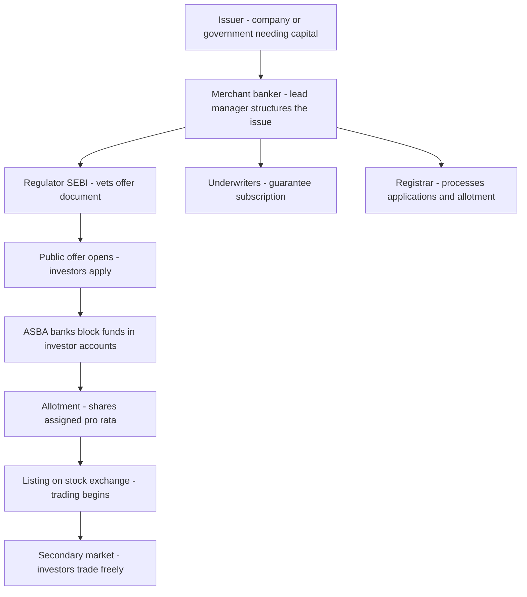
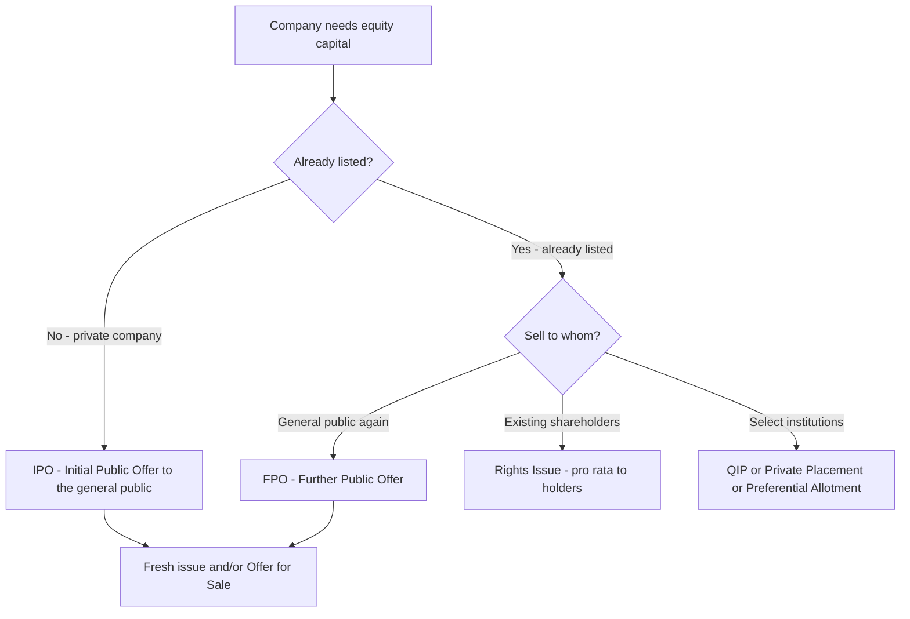
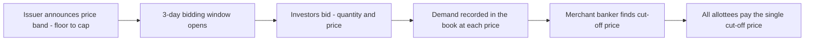

# Chapter 02 — The Primary Market and Securities Issuance

## 1. The Problem / The Need

Every enterprise that grows beyond the savings of its founders eventually hits the same wall: it needs *more capital than its owners personally possess*. A steel plant costs thousands of crores. A pharma company needs years of cash-burning research before a single rupee of revenue arrives. A government needs to build highways today against tax revenues that will only trickle in over decades. In each case there is a **capital gap** — the money required today is far larger than the money on hand.

There are only three fundamental ways to fill that gap:

1. **Retained earnings** — plough back your own profits. Cheap, but slow, and impossible for a young or loss-making firm.
2. **Debt** — borrow. But a bank will only lend so much against a given equity base, and beyond a point lenders demand crushing interest or refuse outright because the firm is too risky.
3. **Fresh external capital from the public** — invite strangers to become part-owners (equity) or lenders (bonds) by *issuing securities* to them.

The **primary market** is the mechanism society has built for that third option. It is the marketplace where **new securities are created and sold for the first time**, transferring savings from millions of households and institutions into the hands of the businesses and governments that will deploy them.

Without a functioning primary market, only the already-rich could build large enterprises. The primary market is what lets an idea with no money attached — a Zomato, an Infosys in 1993, a fledgling infrastructure company — reach into the collective savings of a nation and pull out the capital to become real. It is, quite literally, the engine of capital formation.

**The core tension the primary market must solve:** the company knows everything about itself; the investor knows almost nothing. Money must change hands *before* the investor can verify whether the business is sound. This **information asymmetry** — and the fraud, mispricing and mistrust it breeds — is the reason the primary market is wrapped in so much regulation, disclosure and intermediation. Almost every feature you will study in this chapter (the prospectus, the merchant banker, SEBI vetting, underwriting, book-building) exists to bridge that trust gap.

---

## 2. The Core Idea

The primary market is where **capital is raised**; the secondary market (the next chapter) is where **existing securities are traded** among investors. The distinction is the single most important concept in this chapter:

> In the **primary market**, money flows *from investors to the issuer* — the company gets fresh cash. In the **secondary market**, money flows *from one investor to another* — the company gets nothing.

When you buy 100 shares of Reliance in an IPO, your money goes to Reliance. When you buy the same 100 shares on NSE the next week, your money goes to whoever sold them to you; Reliance never sees it. Both markets are essential and symbiotic — but only the primary market performs *capital formation*.

The primary market's core function is a controlled act of **issuance**: an entity (the *issuer*) creates a brand-new financial claim on itself — a share (ownership) or a bond (a promise to repay) — and sells it to *subscribers* in exchange for cash, under a set of rules that force the issuer to disclose the truth about itself so the price is fair.

Everything else — IPOs, rights issues, QIPs, book-building, ASBA — is simply a *different route* for performing this one act, tailored to who the buyers are (the general public vs. a handful of institutions vs. existing shareholders) and what stage the company is at.

---

## 3. How It Works — Mechanics and Structure

A primary issue is a choreographed process involving the issuer, a set of intermediaries, the regulator, and the investors. Here is the high-level structure.

*Figure 1 — The end-to-end flow of a public issue, from capital need to listing.*

**The essential building blocks:**

- **The issuer** decides *how much* to raise, *what security* to sell (equity vs. debt), and *which route* to use.
- **The merchant banker / lead manager** (also called the Book Running Lead Manager, BRLM) is the architect: it performs due diligence, drafts the offer document, prices the issue, markets it to investors, and coordinates every other party. This is the central intermediary.
- **The regulator** (SEBI in India, the SEC in the US) does *not* approve the merits or guarantee the investment — it only ensures adequate, truthful disclosure. "Buyer beware" survives; the regulator just makes sure the buyer has the facts.
- **Underwriters** promise to buy any unsold portion of the issue, transferring the risk of under-subscription away from the issuer.
- **The registrar (RTA)** handles the plumbing: collecting applications, reconciling money, running the allotment, and issuing refunds/credits.
- **Investors** apply, funds are collected (in India via ASBA — funds are *blocked*, not debited, until allotment), shares are allotted, and the security **lists** on an exchange, at which moment the primary event ends and secondary trading begins.

---

## 4. Full Content — Types, Features, Participants and Process

### 4.1 The two families of primary issues

Securities issued in the primary market fall into two great families, mirroring the two ways of financing a firm:

| | **Equity issues** | **Debt issues** |
|---|---|---|
| What the buyer gets | Ownership stake, voting rights, residual claim on profits | A creditor claim — fixed interest + repayment of principal |
| Instruments | Shares (IPO, FPO, rights, QIP, private placement) | Debentures, bonds, commercial paper, G-Secs |
| Return | Dividends + capital appreciation (uncapped, uncertain) | Coupon (fixed/floating), capped, contractual |
| Risk to issuer | No repayment obligation; dilutes control | Must be repaid; default = insolvency |
| Priority in liquidation | Last | Ahead of equity |

This chapter focuses primarily on **equity issuance**, which is where the richest set of mechanisms and the classic "IPO" story live. Debt issuance is treated in depth in the bond chapters.

### 4.2 The methods of raising equity in the primary market

There is not one "IPO"; there is a whole toolkit, chosen by *who you are selling to* and *whether you are already listed*.

*Figure 2 — Decision tree for choosing an equity-raising route.*

**(a) Initial Public Offering (IPO).** The first-ever sale of shares to the general public by a hitherto private (unlisted) company, after which its shares list on a stock exchange. It is a *milestone*, not a routine — a company does exactly one IPO in its life. An IPO can consist of:
- a **Fresh Issue** — brand new shares are created; the *company* receives the money (capital formation happens here); and/or
- an **Offer for Sale (OFS)** — existing shareholders (founders, PE/VC funds) sell their *old* shares to the public; the *selling shareholders* receive the money, not the company (this is really a primary-market *wrapper* around a secondary sale — no new capital is formed).

Most modern Indian IPOs are a *mix* of both. Example: Zomato's 2021 IPO was almost entirely a fresh issue (raising growth capital), whereas many PE-backed IPOs are heavy on OFS (giving early investors an exit).

**(b) Further Public Offer / Follow-on Public Offer (FPO).** When an *already-listed* company issues additional shares to the public. Used to raise more capital or meet minimum public shareholding norms. Rarer and less glamorous than an IPO. Example: Yes Bank's ₹15,000 crore FPO in 2020; Adani Enterprises launched (and then withdrew, refunding investors) a ₹20,000 crore FPO in early 2023.

**(c) Rights Issue.** The company offers *new* shares to its **existing shareholders** in proportion to their current holding (e.g. "1 new share for every 4 held", a 1:4 rights issue), usually at a *discount* to the market price. The logic: existing owners get the first chance to maintain their percentage ownership and are rewarded for their loyalty. Rights are **renounceable** — a shareholder who doesn't want to subscribe can *sell* the right to someone else. Rights issues are fast and cheap (existing shareholders already know the company, so disclosure and marketing needs are lighter). Example: Reliance Industries' massive ₹53,124 crore rights issue in 2020 (1:15 ratio) — the largest ever in India — which helped make RIL net-debt-free.

**(d) Private Placement.** Selling securities to a *small, select group* of investors (institutions, HNIs) rather than the general public. Because the buyers are sophisticated and few (in India, an offer to **up to 200 persons** in a financial year, excluding QIBs and employees under ESOP, stays "private" — cross 200 and it legally becomes a *public* issue with all its obligations), disclosure and cost are far lower and the process is much faster. Two important sub-types:
- **Preferential Allotment** — a listed company issues shares/warrants to specific identified investors (e.g. a strategic partner, a promoter infusing funds) on a preferential basis, governed by SEBI's ICDR pricing formula to prevent favouritism.
- **Qualified Institutions Placement (QIP)** — see next.

**(e) Qualified Institutions Placement (QIP).** A route SEBI created in 2006 so that *listed* Indian companies could raise money quickly from domestic institutions **without** the long, expensive process of a public offer or the temptation to list abroad. Shares are sold only to **Qualified Institutional Buyers (QIBs)** — mutual funds, banks, insurers, FPIs, pension funds. It is fast (no lengthy SEBI vetting of a full prospectus), pricing is formula-bound (floor price based on a two-week average), and it is now the *dominant* route for follow-on equity fundraising by listed Indian firms. Example: banks like SBI, ICICI and Axis routinely raise tens of thousands of crores via QIP to shore up capital.

### 4.3 The participants (intermediaries) in detail

| Participant | Role | Why they exist |
|---|---|---|
| **Merchant Banker / BRLM** | Structures, prices, drafts documents, markets, coordinates | The issuer lacks capital-market expertise; the banker's reputation certifies the issue |
| **Underwriter** | Guarantees subscription — buys unsold shares | Removes the risk of a failed/under-subscribed issue |
| **Registrar & Transfer Agent (RTA)** | Application processing, allotment, refunds, records | Massive back-office plumbing; e.g. Link Intime, KFin Technologies |
| **Bankers to the Issue / ASBA banks** | Collect and block/release application money | Handle the flow of funds securely |
| **Syndicate Members / brokers** | Distribute the issue, accept bids | Reach retail and institutional investors |
| **Legal counsel** | Draft agreements, ensure compliance | Legal risk management |
| **Auditors** | Certify financial statements in the prospectus | Financial credibility |
| **Credit rating agency** | Rate debt issues (CRISIL, ICRA, CARE) | Signal default risk on bonds |
| **Depositories (NSDL/CDSL)** | Hold shares in dematerialised (electronic) form | No more paper certificates; instant transfer |
| **Regulator (SEBI)** | Vets disclosures, frames rules (ICDR Regulations) | Protects investors, ensures fair, transparent markets |

**The merchant banker deserves special emphasis.** In an IPO the lead manager's *reputation* is on the line — this is the classic "certification" role in finance. Investors cannot verify the issuer, but they *can* observe that a reputable banker (a Kotak, a Morgan Stanley, an Axis Capital) has done due diligence and put its name on the line. The banker effectively *lends its credibility* to the unknown issuer, which is why banks guard their reputation fiercely and why underpricing (see traps) partly persists.

### 4.4 Pricing the issue — Fixed Price vs. Book-Building

The single hardest question in an IPO is: **at what price?** Set it too high and the issue flops (under-subscription, embarrassment, angry investors); too low and the company leaves money on the table. Two mechanisms exist:

**Fixed Price Issue.** The issuer and merchant banker decide a *single price* in advance, print it in the prospectus, and investors either take it or leave it. Simple and transparent, but the price is a *guess* made before any demand is known. Used mainly for smaller issues today.

**Book-Building.** A *price-discovery* mechanism. Instead of one price, the issuer announces a **price band** (a floor and a cap, e.g. ₹900–₹950, where the cap can be at most 120% of the floor). Over the bidding period (typically 3 days), investors submit **bids** stating both *how many shares* and *at what price within the band* they are willing to buy. The demand at each price is recorded in a "book". After bidding closes, the merchant banker examines the book and sets the **cut-off price** — the highest price at which the entire issue can be sold. All successful bidders pay this single cut-off price. This lets the *market* discover the price rather than the issuer guessing it, which is why book-building dominates all large modern IPOs.

*Figure 3 — Book-building price discovery.*

| Feature | Fixed Price | Book-Building |
|---|---|---|
| Price known | Upfront, single price | Discovered — only band known upfront |
| Demand visibility | Only after issue closes | Visible during bidding (live subscription data) |
| Price discovery | None — issuer's guess | Market-driven |
| Investor pays | The fixed price | The cut-off price |
| Suits | Small issues | Large issues where demand is uncertain |

**Retail investors** in book-built IPOs can bid "at cut-off", meaning they agree to pay whatever final price emerges — sparing them from guessing.

### 4.5 Underwriting

**Underwriting** is a guarantee. An underwriter (usually the merchant banker or a syndicate) contractually agrees to *subscribe to any shares the public does not take up*. If an issue is under-subscribed, the underwriter must buy the shortfall itself. In exchange it earns an **underwriting commission**.

- **Firm commitment underwriting** (common in the US) — the underwriter *buys the entire issue* from the company at a set price and resells it to the public, bearing full inventory risk. The issuer is guaranteed its money.
- **Best-efforts** — the underwriter only *tries* to sell, with no guarantee.
- In India, book-built issues open to QIBs have a mandatory minimum QIB participation and specific underwriting rules; the risk of a "devolvement" (shares landing on the underwriter) is real for weak issues.

Underwriting is the mechanism that lets an issuer *know* it will get its capital regardless of market mood — the intermediary absorbs the timing/demand risk.

### 4.6 The offer document

The legal heart of a public issue is the disclosure document — the vehicle that bridges the information gap:

- **Draft Red Herring Prospectus (DRHP)** — the first draft filed with SEBI for review; "red herring" because it omits the final price and issue size. Publicly available for scrutiny.
- **Red Herring Prospectus (RHP)** — the near-final version filed with the Registrar of Companies before the issue opens, containing the price band.
- **Prospectus** — the final document with the fixed price/cut-off, filed after pricing.
- **Abridged Prospectus** — a short summary that must accompany the application form.
- **Shelf Prospectus** (debt) — allows multiple bond issues over a period off a single filing.

The prospectus must disclose: the business and its risks (a candid "Risk Factors" section), promoters and management, financials, the **objects of the issue** (exactly what the money will be used for), litigation, related-party dealings, and more. Filing a false prospectus attracts civil and criminal liability — this is what gives disclosure its teeth.

---

## 5. Worked / Real Examples

**Example 1 — A clean IPO walk-through (Indian book-built issue).**
Imagine "BharatTech Ltd", a profitable software firm, wants to raise ₹500 crore of fresh capital and let its PE backer sell ₹200 crore of old shares.
1. It appoints Axis Capital and Kotak as BRLMs.
2. Bankers conduct due diligence and file a **DRHP** with SEBI. SEBI reviews and issues observations (not "approval").
3. After incorporating SEBI's comments, they file the **RHP** with a **price band of ₹450–₹475**, split as ~₹500 cr fresh + ₹200 cr OFS.
4. The issue opens for 3 days. Investors apply through **ASBA** — the ₹ amount is *blocked* in their bank accounts, not debited. The IPO is divided into buckets: **QIB (up to 50%), Non-Institutional / HNI (at least 15%), Retail (at least 35%)**.
5. The book builds; live subscription shows QIB portion 40×, retail 8×. The **cut-off is set at ₹475**.
6. The **registrar** runs allotment. Because retail is over-subscribed, shares are allotted by **lottery** in minimum lot sizes; unsuccessful applicants have their blocked funds *unblocked*.
7. Shares are credited to demat accounts and **list on NSE/BSE**, typically within ~3 working days of the issue closing (India's T+3 listing timeline). If they list at ₹560, that ~18% "listing gain" is the *underpricing* — money the company arguably left on the table.

**Example 2 — Rights issue (Reliance 2020).** RIL offered 1 new share for every 15 held at ₹1,257 (a discount to the ~₹1,450 market price). Existing shareholders could subscribe, *renounce* (sell) their rights in the market, or let them lapse. Introduced with a novel partly-paid structure (25% on application), it raised ₹53,124 crore — the largest rights issue in Indian history — and was a cornerstone of RIL's drive to become net-debt-free. Note: *no new public investors were solicited* — capital came from those who already owned the company.

**Example 3 — QIP (a bank raising capital).** State Bank of India needing to boost its capital adequacy ratio launches a QIP. Its merchant banker approaches ~30 institutions (mutual funds, insurers, FPIs). A **floor price** is set by SEBI's formula (2-week average of weekly high/low). Within *days*, ₹20,000 crore is raised from QIBs — no retail prospectus, no long SEBI vetting, minimal cost. Contrast the *weeks* an IPO would take. This speed is exactly why QIP is the workhorse of listed-company fundraising.

**Example 4 — Global contrast (US IPO).** When a US firm like Airbnb IPO'd (2020), the process ran under **SEC** rules: an **S-1 registration statement** (the American cousin of the DRHP), a **roadshow** where management pitches institutions, **firm-commitment underwriting** by banks like Morgan Stanley, and pricing the night before listing. Airbnb priced at $68 and opened at $146 — a ~115% "pop", a spectacular illustration of IPO underpricing and the tension between issuers and underwriters over who captures that first-day gain.

---

## 6. Connections to Other Markets and Instruments

- **To the secondary market:** the primary market *creates* the securities that the secondary market then *trades*. Listing is the handoff point. A vibrant, liquid secondary market is a *precondition* for a healthy primary market — investors will only buy new issues if they believe they can sell later. The two are inseparable.
- **To the debt market:** the same primary-issuance machinery raises *bonds* — corporate debentures, and government securities (G-Secs) auctioned by the RBI. Book-building has a bond analogue in the *auction* process for G-Secs.
- **To private equity / venture capital:** VCs and PE funds finance companies *before* they reach the public market; the IPO is their **exit** — the moment they convert illiquid private stakes into cash via an OFS. The primary market is the drain at the end of the private-capital pipeline.
- **To derivatives:** once listed, a stock may get futures and options, giving investors ways to hedge and speculate on the very shares the primary market created.
- **To monetary policy & interest rates:** when rates are low, equity issuance booms (cheap money chases returns, valuations rise); IPO windows open and shut with market sentiment and the rate cycle.
- **To corporate governance:** going public subjects a firm to continuous disclosure, board independence norms and minimum public shareholding (25% in India) — the primary market is also a *governance-improving* event.

---

## 7. Key Terms and Concepts

- **Primary market** — where new securities are issued and capital is raised.
- **Issuer** — the entity selling new securities (company/government).
- **IPO / FPO** — first / subsequent public offer of shares.
- **Fresh Issue vs. Offer for Sale (OFS)** — new shares (company gets money) vs. existing shares sold (seller gets money).
- **Rights issue** — new shares offered pro-rata to existing shareholders, usually at a discount; renounceable.
- **Private placement / Preferential allotment / QIP** — sales to select/qualified investors, not the general public.
- **QIB** — Qualified Institutional Buyer (mutual funds, banks, insurers, FPIs, pension funds).
- **Merchant banker / BRLM** — lead intermediary that structures and manages the issue.
- **Underwriting** — guarantee to buy unsold portion; *devolvement* = shares landing on the underwriter.
- **Book-building** — price discovery via a price band and investor bids; **cut-off price** is the final single price.
- **Fixed price issue** — single pre-announced price.
- **DRHP / RHP / Prospectus** — the tiered disclosure documents.
- **ASBA** — Application Supported by Blocked Amount: funds blocked (not debited) until allotment.
- **UPI mechanism** — retail IPO applications up to ₹5 lakh can be made via UPI-linked ASBA.
- **Registrar (RTA)** — processes applications and allotment.
- **Anchor investors** — institutional investors allotted shares a day *before* the issue opens, to build confidence.
- **Green-shoe option** — an over-allotment mechanism that lets underwriters stabilise the post-listing price.
- **Underpricing / listing gain** — the first-day jump above issue price.
- **SEBI ICDR Regulations** — Issue of Capital and Disclosure Requirements, the master rulebook for Indian issues.
- **Minimum public shareholding** — Indian listed firms must have at least 25% public float.

---

## 8. Common Confusions and Traps

1. **"IPO = the company always gets the money."** *Wrong.* Only the **Fresh Issue** portion goes to the company. In a pure **Offer for Sale**, the money goes to *selling shareholders* — the company's bank balance is unchanged. Always check the fresh-vs-OFS split.

2. **"SEBI approves / recommends the IPO."** *No.* SEBI vets *disclosure adequacy*, not investment merit. It never says a stock is a good buy. Its observations are not an endorsement. The same is true of the SEC. Caveat emptor survives.

3. **Primary vs. secondary confusion.** Buying shares "in an IPO" is primary; buying the *same shares on the exchange the next day* is secondary. Only the former forms capital.

4. **FPO vs. Rights issue.** Both are by *already-listed* companies, but an FPO is offered to the *general public* while a rights issue goes *only to existing shareholders* pro-rata.

5. **QIP vs. IPO.** A QIP is by a *listed* company to *institutions only*; an IPO is the *first* offer, to the *general public*. They are opposite ends of the fundraising spectrum.

6. **ASBA money is "paid".** *No.* Under ASBA the application money is only **blocked** in your bank account — you keep earning interest, and it is debited *only if and to the extent* shares are allotted. This was a landmark investor-protection reform (money no longer sat idle with the company for weeks).

7. **"Cut-off price" means lowest price.** *No* — it is the *single price at which the whole issue clears*, and all allottees pay it, even those who bid higher.

8. **Underpricing is a "mistake".** Not entirely — persistent IPO underpricing is a well-documented phenomenon partly explained by information asymmetry (issuers underprice to compensate uninformed investors — the "winner's curse") and by bankers wanting a successful, over-subscribed launch. A huge listing pop is great for flippers but means the *company* raised less than it could have.

9. **Anchor investors are the same as regular QIBs.** Anchors are a *subset* — they commit *before* the issue opens (with a lock-in), signalling confidence and anchoring demand; their allocation comes out of the QIB portion.

10. **Green-shoe means the issue is oversubscribed.** It is actually a *price-stabilisation* tool: it lets the underwriter over-allot shares and then buy back in the market if the price falls, cushioning the listing.

---

## 9. First-Principles Recap

Strip everything away and the primary market answers one question: *how does an enterprise reach beyond its owners' pockets to fund itself?* The answer is to **manufacture a new financial claim on itself — a share or a bond — and sell it to strangers for cash.**

But strangers won't hand over money to an entity they cannot verify. So society builds a *trust-manufacturing apparatus* around the transaction: a **disclosure document** to force out the truth, a **merchant banker** to certify it with its reputation, an **underwriter** to guarantee the capital arrives, a **regulator** to police honesty, and market-based **price discovery** (book-building) so the price is fair to both sides. Each intermediary and rule exists to close some part of the trust gap between the informed issuer and the uninformed investor.

The different *routes* — IPO, FPO, rights, private placement, QIP — are just this same act tuned to *who is buying* (the public, existing owners, or a few institutions) and *how mature the issuer is* (first-time vs. already listed). And the moment the security **lists**, the primary event is over: the capital has been formed, and the security passes into the secondary market to be traded for the rest of its life.

Capital formation, achieved by manufacturing trust — that is the primary market in one line.

---

## 10. Quick-Reference / Interview-Ready Points

- **Primary market = capital formation; money flows investor → issuer. Secondary market = trading; money flows investor → investor.** The issuer gets *nothing* from secondary trades.
- **IPO** = first public offer by an unlisted firm. **FPO** = further offer by a *listed* firm to the public. **Rights** = pro-rata to existing shareholders (renounceable, at a discount). **QIP** = fast raise by a *listed* firm from **QIBs** only. **Private placement** = ≤200 persons/year, else it becomes a public issue.
- **Fresh Issue** raises new capital for the company; **Offer for Sale (OFS)** just transfers old shares — no new capital, seller pockets the cash.
- **Book-building** discovers price via a band + bids; the **cut-off price** is the single clearing price everyone pays. **Fixed price** is set upfront.
- **Merchant banker (BRLM)** is the quarterback — due diligence, drafting, pricing, marketing; lends its *reputation* to certify the issue.
- **Underwriting** guarantees the issuer its money by absorbing unsold shares; *devolvement* is when that shortfall lands on the underwriter.
- **ASBA** blocks (not debits) funds until allotment — retail can use **UPI** for applications up to ₹5 lakh. **T+3** listing timeline in India.
- IPO allotment buckets: **QIB up to 50%, NII/HNI ≥ 15%, Retail ≥ 35%.** Oversubscribed retail → **lottery** allotment in lots.
- **Anchor investors** commit before the issue opens (lock-in) to build confidence; **green-shoe** = over-allotment tool for post-listing price stabilisation.
- Documents: **DRHP → RHP → Prospectus** (India); **S-1** (US). SEBI/SEC vet **disclosure, not merit**.
- **India = SEBI + ICDR Regulations; US = SEC + S-1.** Minimum public shareholding in India = **25%**.
- **IPO underpricing** (the "listing pop") is systematic, driven by information asymmetry and bankers' incentive for a successful launch — great for day-one investors, a cost to the issuer.
