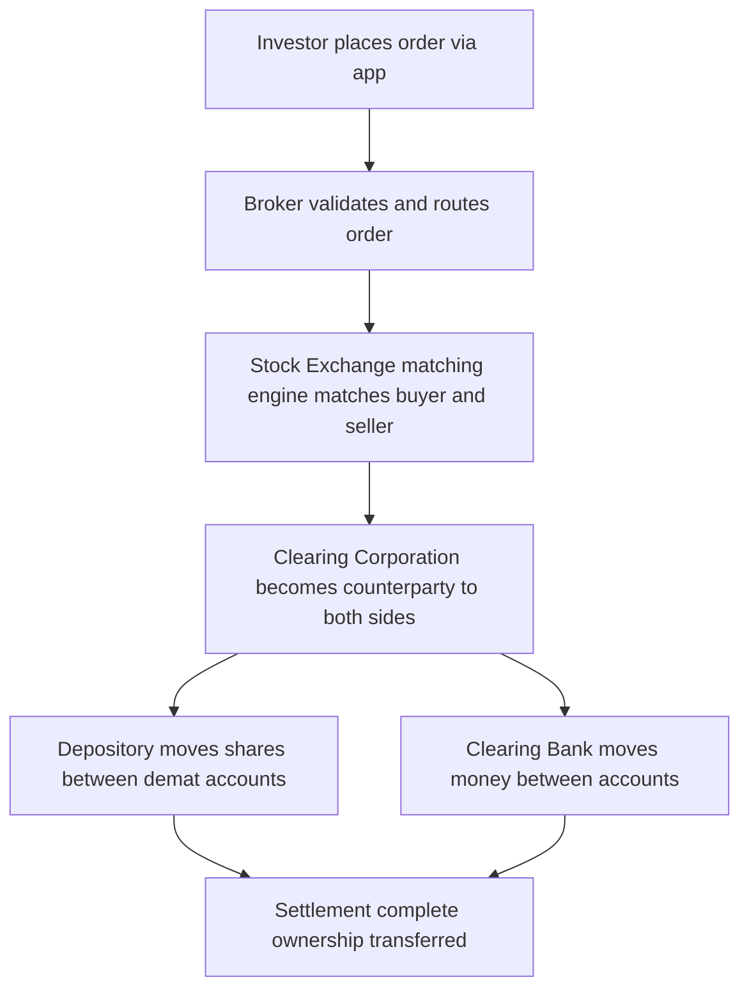
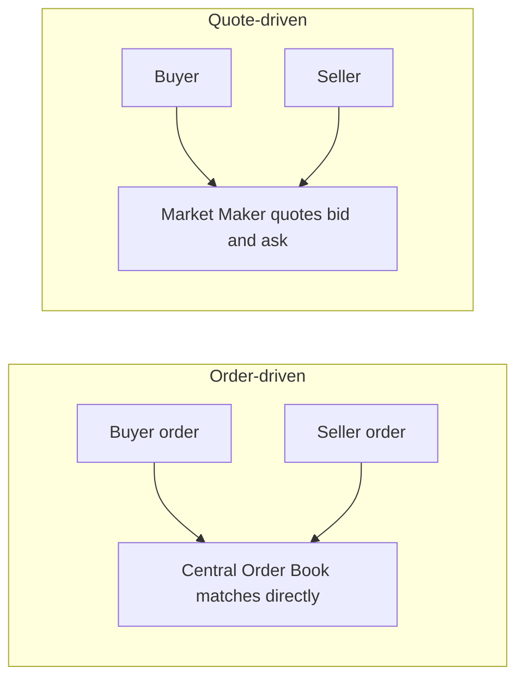
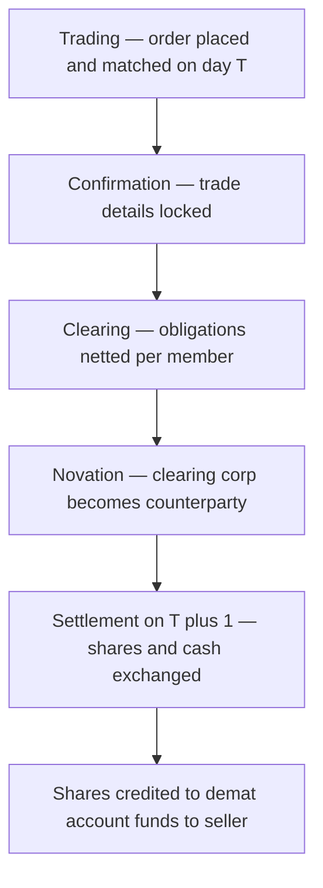

# Chapter 03 — Secondary Markets and Stock Exchanges

## 1. The Problem / Need

Imagine you buy shares in Reliance Industries during its IPO. You hand over your money, Reliance gets the capital, and you get a certificate saying you own a slice of the company. That is the **primary market** doing its job: channelling savings into productive capital (covered in Chapter 02).

Now fast-forward two years. Your circumstances change — you need cash for a house down payment, or you simply think the stock is overpriced and want out. Who do you sell to? Reliance itself has no obligation to buy your shares back; it already used your money to build refineries. If there were no mechanism to sell, your "investment" would be a trap. You would be locked in until the company liquidated, possibly decades away.

This is the fundamental problem the **secondary market** solves. The primary market raises capital *once*; the secondary market is where those already-issued securities change hands **again and again** among investors, for the entire life of the security. The company is not a party to these trades — money flows from one investor to another, not to the issuer.

Without a secondary market, three things break:

1. **No liquidity.** Investors would demand a huge "illiquidity premium" (a much lower price) to buy anything they could never sell. Capital would be scarce and expensive for companies.
2. **No continuous price discovery.** A share would only have a "price" at issuance. Between issues, nobody would know what the company is worth.
3. **No feedback loop for capital allocation.** Rising and falling prices signal which businesses deserve more capital and which don't. That signal is generated in the secondary market.

Here is the deep insight that trips up beginners: **the secondary market raises no new money for companies, yet it is the reason the primary market works at all.** Investors are only willing to fund IPOs because they know a liquid secondary market lets them exit later. The two markets are joined at the hip — liquidity downstream makes fundraising possible upstream.

> First-principles framing: A security is a promise of future cash flows. A secondary market is simply an organised, trusted, low-friction place to *transfer that promise* between strangers at a fair, transparent price.

## 2. The Core Idea

A **secondary market** is any venue where previously issued financial instruments are bought and sold between investors. A **stock exchange** is the most organised, regulated form of that venue — a marketplace with rules, membership, standardised contracts, and a mechanism to match buyers with sellers and guarantee that trades settle.

Three functions define what an exchange delivers:

- **Liquidity** — the ability to convert a security into cash quickly, in size, without moving the price much. Liquidity is measured by tight bid-ask spreads, high volumes, and market depth (many orders stacked at nearby prices).
- **Price discovery** — the continuous process by which the collective buying and selling of thousands of participants aggregates all available information into a single number: the last traded price. No committee sets Infosys's price; the order flow does, tick by tick.
- **Safety and integrity** — an exchange enforces rules, guarantees settlement through a clearing corporation, and operates under a regulator (SEBI in India, the SEC in the US) so that a stranger on the other side of your trade cannot cheat you.

An exchange is best understood as **an information-processing machine**. Millions of independent opinions — a Mumbai retail investor, a Singapore hedge fund, a domestic mutual fund, an algorithmic market-maker — pour in as orders. The matching engine crunches them into prices in microseconds. The output is a public good: a transparent, real-time price everyone can see and trust.

## 3. How It Works (Mechanics / Structure)

### The layered architecture of a modern market

A trade you place on your phone passes through several institutions before it is truly "done". Understanding this stack is essential.

*Figure 1 — The order-to-settlement pipeline in the Indian equity market.*

Each layer has a distinct job:

- **Broker / Trading Member** — your licensed agent. You cannot walk onto the exchange floor; only members can. The broker validates your order (do you have the cash or the shares? are limits respected?) and transmits it.
- **Stock Exchange** — runs the **order-matching engine** that pairs the best buy order with the best sell order following strict rules (price-time priority, explained below).
- **Clearing Corporation** — the unsung hero. After a match, it steps in as the **central counterparty (CCP)** through a process called **novation**: the single trade between you and an unknown stranger is legally split into two trades, each with the clearing corporation. Now you don't care whether the stranger defaults — the clearing corporation guarantees you. In India this is NSE Clearing (NCL) for the NSE and Indian Clearing Corporation (ICCL) for the BSE.
- **Depository** — holds shares in electronic (**demat**) form and moves them between accounts. India has two: **NSDL** and **CDSL**. This replaced the old world of paper certificates.
- **Clearing Bank** — moves the cash leg.

### Order-driven vs quote-driven markets

This is a classic interview topic. It concerns *who provides the liquidity* and *how a price is formed*.

**Order-driven market:** Prices emerge purely from the buy and sell orders (the "order book") submitted by all participants. There is no obligated middleman. The exchange's engine matches orders directly against each other. Anyone — retail or institutional — can post a buy or sell order and become a liquidity provider. NSE, BSE, and most modern electronic equity markets are order-driven.

**Quote-driven (dealer) market:** Designated **market makers / dealers** continuously post two-way quotes — a **bid** (the price at which they will buy) and an **ask/offer** (the price at which they will sell). You trade *against the dealer*, not against another investor. The dealer's profit is the **bid-ask spread**; in return, the dealer guarantees you can always trade. Classic corporate bond markets and the old Nasdaq dealer system worked this way.

**Hybrid markets:** Reality is usually a blend. The **NYSE** combines an electronic order book with **Designated Market Makers (DMMs)** who have obligations to maintain orderly quotes in their assigned stocks. Modern **Nasdaq** overlays multiple competing market makers on top of a central order book.

*Figure 2 — Two ways liquidity is supplied: peer orders vs a dealer's quotes.*

| Feature | Order-driven | Quote-driven (dealer) |
|---|---|---|
| Who supplies liquidity | All participants via orders | Designated market makers |
| Price formation | Order book interaction | Dealer's posted quotes |
| Transparency | High — full order book visible | Lower — quotes visible, inventory hidden |
| Guaranteed counterparty | No (relies on other orders) | Yes (dealer obligated) |
| Cost to trade | Bid-ask spread + fees | Bid-ask spread (dealer's margin) |
| Best for | Liquid, high-volume stocks | Illiquid or complex instruments (bonds) |
| Examples | NSE, BSE cash market | Corporate bonds, forex, old Nasdaq |

### The order book and price-time priority

In an order-driven market, unmatched orders sit in the **limit order book**, sorted into two sides:

- **Bids** (buyers), sorted highest price first.
- **Asks/Offers** (sellers), sorted lowest price first.

The highest bid and lowest ask together form the **best bid-offer (BBO)**; the gap between them is the **bid-ask spread**. A trade happens when a buyer is willing to pay the lowest ask (or a new market order crosses the spread).

Matching follows **price-time priority**: better-priced orders execute first; among orders at the same price, the one entered earliest executes first. This rule is what makes the market fair — you cannot jump the queue except by offering a better price.

## 4. Full Content — Types, Features, Participants, Process

### 4.1 Types of order-book orders

| Order type | What it does | Trade-off |
|---|---|---|
| **Market order** | Execute immediately at best available price | Guaranteed fill, uncertain price (slippage) |
| **Limit order** | Buy/sell only at a specified price or better | Price certainty, no guarantee of fill |
| **Stop-loss order** | Becomes a market/limit order once a trigger price is hit | Caps losses; can trigger on a brief spike |
| **Immediate-or-Cancel (IOC)** | Fill whatever is available now, cancel the rest | Used by algos to avoid resting exposure |
| **Good-Till-... (GTC/GTD)** | Stays live across days until filled or dated out | Convenience; India uses broker-simulated GTT |
| **Iceberg / disclosed quantity** | Shows only part of a large order to hide size | Reduces market impact for big trades |

### 4.2 The trading life-cycle (T and T+1)

A completed transaction moves through distinct stages. In India the phrase **"T+1"** means settlement completes one business day after the trade date (T). India moved from T+2 to **T+1** fully by January 2023 and is progressively rolling out **optional T+0 (same-day)** settlement from 2024 — making it one of the fastest-settling major markets in the world. The US moved to **T+1** in May 2024.

*Figure 3 — Life-cycle of an equity trade from execution to settlement.*

Key mechanics inside this cycle:

- **Netting / multilateral netting** — the clearing corporation nets each member's many trades in a security into a single net receive/deliver obligation, drastically cutting the volume of shares and cash that must actually move.
- **Margins** — to protect against default between trade and settlement, members post collateral: **VaR margin** (based on price volatility), **Extreme Loss Margin (ELM)**, and mark-to-market margin. SEBI's **peak margin** rules tightened intraday margin collection.
- **Pay-in and pay-out** — on settlement day, members with net obligations deliver shares/cash (pay-in); the clearing corp then distributes to those owed (pay-out).
- **Auction / close-out** — if a seller fails to deliver shares, the clearing corp buys them in an auction to make the buyer whole and penalises the defaulter.

### 4.3 Market participants (the ecosystem)

- **Retail investors** — individuals. The backbone of Indian daily volumes via demat accounts (over 15 crore demat accounts by 2024).
- **Domestic Institutional Investors (DIIs)** — mutual funds, insurance companies (LIC), pension funds, banks.
- **Foreign Portfolio Investors (FPIs)** — overseas funds registered with SEBI; historically the biggest swing factor in Indian markets.
- **Proprietary traders / prop desks** — firms trading their own capital.
- **Market makers** — provide two-way quotes, especially in derivatives, ETFs, and SME segments.
- **Algorithmic & High-Frequency Traders (HFT)** — automated strategies; a large share of volume. Co-location (renting rack space next to the exchange server) minimises latency.
- **Arbitrageurs** — exploit price gaps (e.g., cash vs futures, or NSE vs BSE) and in doing so keep prices consistent.
- **Speculators and hedgers** — the two economic roles in derivatives (below).
- **Intermediaries** — brokers, sub-brokers, custodians, depository participants, registrars.
- **Regulator & infrastructure** — **SEBI** (regulator), exchanges, clearing corporations, depositories: together the "market infrastructure institutions" (MIIs).

### 4.4 Listing — how a security gets onto an exchange

**Listing** is the admission of a company's securities to trading on a recognised exchange. It usually accompanies an IPO (the primary issue and the listing happen together) but they are conceptually separate — a company can be listed on multiple exchanges.

Why companies list:
- Access to a liquid market for their shares (helps future fundraising).
- A public, credible valuation (a currency for acquisitions and ESOPs).
- Prestige, visibility, and analyst coverage.
- An exit route for early investors and promoters.

The costs and obligations:
- **Listing Obligations and Disclosure Requirements (LODR)** — SEBI's continuous-disclosure regime: quarterly results, material-event disclosure, corporate governance norms (independent directors, audit committee), minimum public shareholding of **25%**.
- Listing fees, compliance overhead, and exposure to short-term market pressure.

Segments and boards:
- **Main board** — established companies meeting size/track-record norms.
- **SME platforms** — NSE Emerge and BSE SME, with lighter norms for small and growing firms.
- **Delisting** — the reverse: a company exits the exchange, typically via a reverse book-building process to buy out public shareholders (e.g., voluntary delisting by MNC parents).

### 4.5 The major exchanges

**India:**
- **NSE (National Stock Exchange)** — founded 1992, launched screen-based trading in 1994, ending the open-outcry era. Fully electronic, order-driven. Its benchmark index is the **NIFTY 50**. NSE is the world's largest derivatives exchange by number of contracts traded.
- **BSE (Bombay Stock Exchange)** — Asia's oldest exchange (1875). Benchmark index **SENSEX** (30 stocks). Also fully electronic today.

**United States:**
- **NYSE (New York Stock Exchange)** — the iconic Big Board. A **hybrid** market: electronic order book plus human Designated Market Makers on the floor for orderly opening/closing auctions. Home to many large industrials and blue chips.
- **Nasdaq** — the first electronic stock market (1971). A dealer/hybrid market with competing market makers; home to tech giants (Apple, Microsoft, Nvidia).

Other giants: **LSE** (London), **JPX/Tokyo**, **HKEX** (Hong Kong), **Shanghai** and **Shenzhen**, **Euronext**.

### 4.6 Cash segment vs derivatives segment

Every major equity exchange runs (at least) two segments.

**Cash / spot / equity segment:** You buy the *actual share*. Ownership transfers; you become a part-owner with voting rights and dividends. Settlement is on a delivery basis (T+1). This is where price discovery of the underlying happens.

**Derivatives / F&O segment:** You trade *contracts whose value is derived from* an underlying (a stock or an index). No immediate ownership of shares. Two core instruments:

- **Futures** — an agreement to buy/sell the underlying at a fixed price on a future date. Standardised, exchange-traded, marked-to-market daily. Used to hedge or to take leveraged directional bets.
- **Options** — a *right, not obligation*: a **call** gives the right to buy at a strike price; a **put** gives the right to sell. The buyer pays a **premium**; the seller (writer) receives it and takes on the obligation.

Key features of the derivatives segment:
- **Leverage** — you post only a margin (a fraction of contract value), amplifying both gains and losses.
- **Lot size** — contracts trade in fixed lots, not single shares.
- **Expiry** — contracts expire (weekly/monthly). In India, index options have driven explosive volume; SEBI in 2024 tightened rules (reducing weekly expiries, raising lot sizes) to curb retail speculation losses.
- **Cash-settled vs physically settled** — index derivatives are cash-settled; single-stock F&O in India is physically settled on expiry.

| Dimension | Cash segment | Derivatives segment |
|---|---|---|
| What you own | Actual shares | A contract (right/obligation) |
| Purpose | Investment, ownership | Hedging, speculation, arbitrage |
| Leverage | None (full payment) | High (margin only) |
| Time horizon | Open-ended | Fixed expiry |
| Rights (dividend/vote) | Yes | No |
| Risk profile | Loss capped at investment | Can exceed capital (esp. option writing/futures) |
| Example | Buy 100 TCS shares | Buy 1 NIFTY 24000 call option |

## 5. Worked / Real Examples

### Example 1 — Reading and executing against an order book (India)

Suppose Infosys shows this order book on the NSE:

| Bids (buyers) | | Asks (sellers) | |
|---|---|---|---|
| Qty | Price | Price | Qty |
| 300 | 1,499.50 | 1,500.00 | 200 |
| 500 | 1,499.00 | 1,500.50 | 400 |

The **best bid** is ₹1,499.50, the **best ask** is ₹1,500.00, so the **spread** is ₹0.50 — very tight, signalling a liquid stock.

- If you place a **market buy for 200 shares**, you fill instantly at ₹1,500.00 (the best ask).
- If you place a **market buy for 500 shares**, you take all 200 at ₹1,500.00, then the next 300 at ₹1,500.50 — your average is worse. That extra cost is **slippage**, and it grew because your order "walked up the book". This is why large investors slice orders (icebergs, algos).
- If you place a **limit buy at ₹1,499.00**, nothing executes; your order joins the bid queue below the existing ₹1,499.50 order and waits.

This tiny example contains the whole logic of liquidity: depth, spread, price-time priority, and market impact.

### Example 2 — Hedging with the derivatives segment (India)

An investor holds ₹50 lakh of a NIFTY-tracking portfolio and fears a short-term correction before the Budget, but doesn't want to sell (tax, re-entry risk). Instead she **shorts NIFTY futures** worth ₹50 lakh.

- If NIFTY falls 5%, her cash portfolio loses ~₹2.5 lakh, but her short futures position *gains* ~₹2.5 lakh. Net: roughly flat — she is **hedged**.
- She posts only ~₹6 lakh of margin, not ₹50 lakh — that is **leverage** working for a hedge.
- The trader on the *other side* of her futures trade might be a **speculator** betting NIFTY rises. The derivatives market efficiently transfers risk from the hedger to the speculator. This risk-transfer is the entire economic reason derivatives exist.

### Example 3 — Price discovery and arbitrage across venues (global)

Apple trades on Nasdaq. The same economic exposure also trades via futures and options and, for non-US investors, via ADRs and ETFs. Suppose for a fleeting moment Apple's price on one electronic venue is $190.00 while its fair value implied by the futures is $190.10.

**Arbitrageurs** (often HFT algos) instantly buy at $190.00 and sell the equivalent at $190.10, pocketing the gap. Their buying pushes the low price up and their selling pushes the high price down until the gap closes — usually within milliseconds. Nobody coordinates this; the profit motive alone keeps prices consistent across venues. This is **price discovery and the law of one price** in action, and it's why co-location and low latency matter so much in modern markets.

### Example 4 — Why liquidity is priced (SME vs blue chip)

Compare Reliance (spread often ₹0.05, crores of shares traded daily) with a thinly traded SME stock (spread of several percent, a few thousand shares a day). To exit ₹10 lakh of Reliance costs you almost nothing in market impact. To exit ₹10 lakh of the SME stock, you might crash the price 5–10% because there simply aren't buyers. Investors *know* this in advance, so they demand a lower price / higher expected return to hold illiquid stocks — the **illiquidity premium**. The secondary market's liquidity is not free; it is priced into every asset.

## 6. Connections

- **To the primary market (Ch 02):** The secondary market's liquidity is the precondition for the primary market to function. IPO pricing references secondary-market comparables; listing gains/losses feed back into IPO appetite.
- **To bond markets:** Government and corporate bonds also have secondary markets, but they are largely **quote-driven / OTC** (dealer markets) rather than exchange order books — a direct application of the order-driven vs quote-driven distinction. India is pushing bond trading onto exchange platforms and RFQ systems to improve transparency.
- **To derivatives (later chapters):** The F&O segment is a secondary market layered on top of the cash market; futures prices and the cash index are tied together by **cost-of-carry** and arbitrage.
- **To indices (Ch on indices):** SENSEX and NIFTY are computed *from* secondary-market prices in real time; index funds and ETFs then trade in the secondary market, creating a feedback loop.
- **To macro and monetary policy:** Secondary-market prices are a real-time barometer of economic expectations; FPI flows link Indian equities to global interest rates and the rupee.
- **To corporate finance:** A liquid, fairly priced share is the "currency" for M&A, ESOPs, QIPs, and rights issues — corporate actions all reference the secondary-market price.

## 7. Key Terms & Concepts

- **Liquidity** — ease of converting a security to cash without moving the price.
- **Price discovery** — the market process that aggregates information into a price.
- **Bid / Ask / Spread** — best buy price, best sell price, and the gap between them.
- **Order book / limit order book** — the live list of resting buy and sell orders.
- **Price-time priority** — matching rule: best price first, then earliest.
- **Market vs limit order** — immediate at best price vs specified-price-or-better.
- **Market maker / dealer** — a participant obligated to quote two-way prices.
- **Order-driven vs quote-driven** — liquidity from peer orders vs from dealers.
- **Central counterparty (CCP) / novation** — clearing corp inserts itself as counterparty to guarantee settlement.
- **Clearing and settlement** — netting obligations, then exchanging shares and cash.
- **T+1 / T+0** — settlement timelines relative to trade date.
- **Demat / depository (NSDL, CDSL)** — electronic holding of securities.
- **Margin (VaR, ELM, MTM, peak)** — collateral protecting against default.
- **Listing / LODR / delisting** — admission to trade, continuous obligations, exit.
- **Cash vs derivatives (F&O) segment** — owning shares vs trading derived contracts.
- **Leverage, lot size, expiry, strike, premium** — derivatives mechanics.
- **Slippage / market impact** — adverse price move caused by your own order size.
- **Arbitrage** — riskless profit from price differences that enforces consistency.
- **FPI / DII** — foreign portfolio and domestic institutional investors.
- **Circuit breakers** — price bands and market-wide halts that pause trading on extreme moves.

## 8. Common Confusions / Traps

1. **"Trading a share gives money to the company."** No. In the secondary market, cash flows between investors. The company only receives money in the *primary* market (IPO/FPO/rights). Buying Reliance today gives Reliance nothing.

2. **IPO vs listing.** The IPO is the *sale of new shares to raise capital* (primary). Listing is *admission to trade on an exchange* (enables secondary trading). They usually coincide but are different events.

3. **Order-driven ≠ "no market makers ever".** Order-driven markets *can* have market makers (especially in derivatives, ETFs, SME stocks). The distinction is whether liquidity *must* come from designated dealers (quote-driven) or arises from all orders (order-driven).

4. **Liquidity ≠ solvency, and volume ≠ liquidity.** A stock can have high *turnover* but poor *depth* (thin at each price). True liquidity is depth + tight spreads + resilience, not just a big volume number.

5. **Futures/options are not "shares".** In the derivatives segment you own a contract, get no dividends or votes, face expiry, and can lose more than you might expect (option writing, futures). Beginners conflate leverage with free money.

6. **Clearing vs settlement.** Clearing = computing *who owes what* (netting, novation, margining). Settlement = *actually exchanging* shares and cash. Two distinct steps.

7. **T+1 refers to settlement, not to when you 'own' the share.** You gain economic exposure at trade time (T); legal delivery completes at T+1.

8. **Bid is the price you SELL at, ask is the price you BUY at (from your perspective).** Retail traders often flip this. The dealer bids to *buy from you*; you hit the ask to *buy from the market*.

9. **A tight spread today is not guaranteed tomorrow.** Liquidity evaporates in crises exactly when you need it — the "liquidity is a coward" problem. Circuit breakers exist for these moments.

## 9. First-Principles Recap

Start from a single need: an investor who bought a security must be able to *exit*. That single requirement forces everything else into existence.

- To exit, you need a **counterparty** → so you need a **marketplace** that gathers many buyers and sellers.
- To find a fair price among them, you need a **matching rule** → price-time priority in an **order book** (or a **dealer** who quotes both sides).
- To trust a stranger on the other side, you need a **guarantor** → the **clearing corporation** via novation, backed by **margins**.
- To move ownership without paper, you need **depositories** and **demat**.
- To keep everyone honest, you need a **regulator** (SEBI/SEC) and **disclosure rules** (LODR).
- Because some investors want to *transfer risk* rather than own shares, a **derivatives segment** grows alongside the cash segment.

Out of these interlocking parts emerge the two great public goods the secondary market produces: **liquidity** (you can always get out) and **price discovery** (a trustworthy, continuous price). And crucially, those two goods loop back to power the primary market — the promise of a liquid exit is why anyone funds a company in the first place.

## 10. Quick-Reference / Interview-Ready Points

- **Purpose of the secondary market:** provide liquidity and continuous price discovery for already-issued securities; the company is *not* a party — no fresh capital is raised.
- **Why it matters for the primary market:** the promise of secondary-market liquidity is what makes investors willing to fund IPOs; the two are inseparable.
- **Order-driven (NSE/BSE):** liquidity from all participants' orders, matched by price-time priority. **Quote-driven (dealer):** liquidity from market makers posting bid-ask quotes; used in bonds, forex, old Nasdaq. **NYSE/modern Nasdaq are hybrids.**
- **Order book essentials:** best bid, best ask, spread (a liquidity gauge), depth; market orders take liquidity, limit orders provide it.
- **Trade life-cycle:** trade → confirmation → clearing (netting + novation by the CCP) → settlement. India settles at **T+1** (moving to optional **T+0**); US at **T+1** since May 2024.
- **Market infrastructure (India):** SEBI (regulator); NSE/BSE (exchanges); NSE Clearing / ICCL (clearing corps, central counterparties); NSDL/CDSL (depositories).
- **Listing:** admission to an exchange, brings liquidity, valuation, and prestige, but imposes LODR disclosure, governance, and 25% minimum public float.
- **Cash vs derivatives:** cash = own the share (dividends, votes, T+1 delivery); derivatives (futures/options) = leveraged contracts on an underlying for hedging, speculation, arbitrage — no ownership, fixed expiry, margin-based.
- **Key Indian facts:** NIFTY 50 (NSE) and SENSEX 30 (BSE) benchmarks; NSE is the world's largest derivatives exchange by contracts; SEBI's 2024 F&O curbs target retail speculation losses.
- **One-liner definitions to memorise:** *Liquidity* = exit fast without moving price; *Price discovery* = order flow aggregating information into a price; *Novation* = clearing corp becomes buyer to every seller and seller to every buyer; *Slippage* = adverse price move from your own order size; *Arbitrage* = riskless profit that enforces one price across venues.
