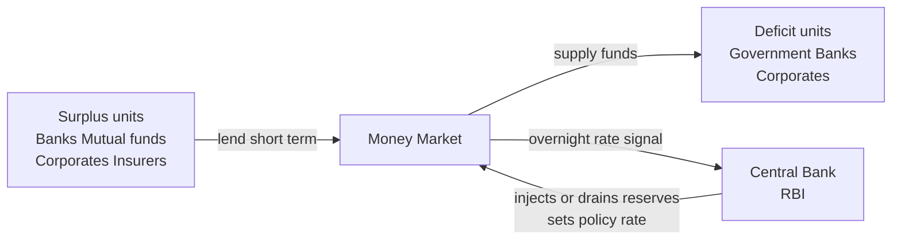
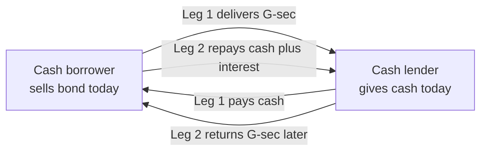
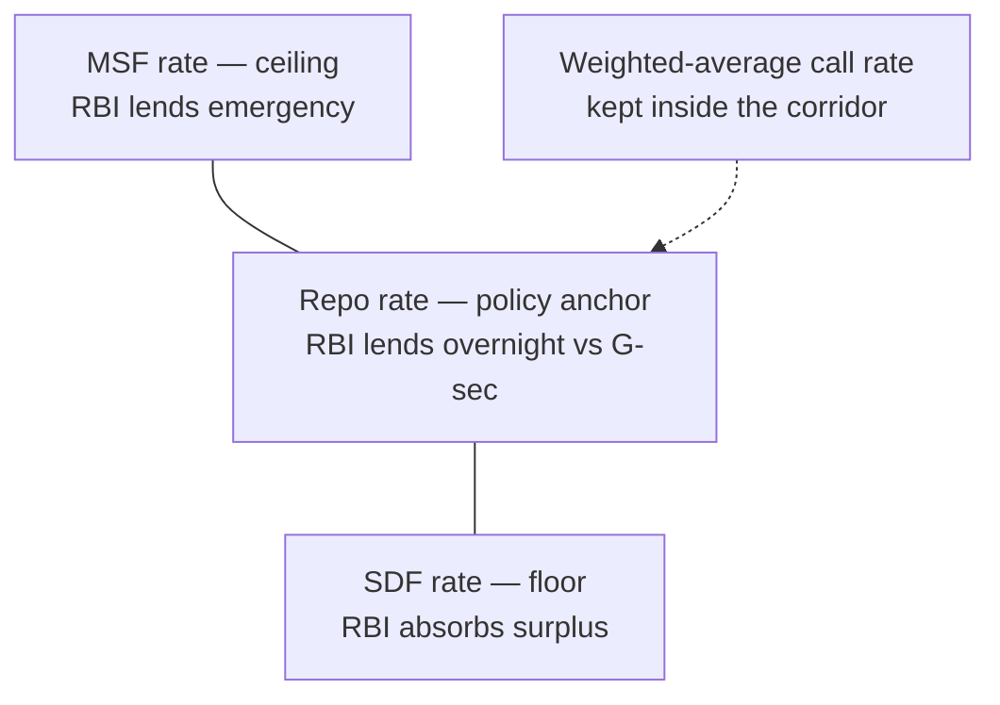

# Chapter 04 — Money Markets and Instruments

## 1. The Problem / The Need

Every business, bank, government and household lives with a fundamental mismatch: **cash inflows and outflows almost never line up in time.** A company sells goods on 60-day credit but must pay salaries on the 1st of every month. A bank takes deposits that customers can withdraw on demand, but lends that money out for years. The Government of India collects the bulk of its tax revenue in a few chunky instalments across the year, yet spends smoothly every single day. Mutual funds receive a flood of subscriptions on Monday and face redemptions on Thursday.

This creates two symmetric problems:

- **Temporary surpluses.** An entity is sitting on idle cash it does not need for a few days or weeks. Leaving it in a current account earns nothing. Inflation quietly erodes it. That is a real economic loss — a treasurer who "parks" ₹500 crore at zero for a week has burned money.
- **Temporary deficits.** Another entity needs cash *now* to meet an obligation, but its own money is tied up and will only arrive later. It does not want a five-year loan — it needs to bridge a gap of a few days.

The **capital market** (equities, long-term bonds) is the wrong tool for this. Issuing shares or a 10-year bond to cover a 10-day cash gap is absurdly expensive, slow, and permanent. What the world needs is a **separate marketplace for very short-term funds** — a place where surplus cash can be lent, and deficits funded, for periods ranging from *overnight* to *one year*, with almost no risk and instant liquidity.

That marketplace is the **money market**. Its single reason for existing is **short-term liquidity management** — smoothing the timing mismatch between when money arrives and when it is needed, while keeping capital safe and instantly retrievable.

## 2. The Core Idea

The money market is the **wholesale market for short-term debt with an original maturity of one year or less.** Three ideas define it, and every instrument in it inherits these traits:

1. **Short maturity (≤ 1 year, often overnight to 91 days).** Because the term is short, the lender's money comes back quickly and can be redeployed. Short maturity also means low *interest-rate risk* — a 91-day instrument barely moves in price when rates change, unlike a 10-year bond.

2. **High safety and high liquidity — "near-money."** Money-market instruments are issued by the most creditworthy names (governments, top-rated banks, blue-chip corporates) and can be sold or discounted quickly. They are the closest thing to cash that still earns a return. Treasurers treat them as a *cash-equivalent* bucket.

3. **Low, "wholesale" returns in large denominations.** Because they are safe and short, yields are modest. The market is dominated by institutions dealing in crores, not retail investors buying ₹5,000 of a T-bill. Minimum lots are large precisely because this is a professional, high-volume, thin-margin market.

The trade-off is the classic **risk-return-liquidity triangle**, tilted hard toward *safety and liquidity* and away from *return*. You accept a low yield in exchange for getting your principal back, on time, almost certainly.

A crucial mechanical idea sits at the heart of many of these instruments: they are **discount instruments.** Instead of paying periodic interest (a coupon), they are sold *below* their face value and redeemed *at* face value. The investor's return is the difference — the "discount." Buy a 91-day Treasury bill of face value ₹100 for ₹98.25 today; get ₹100 in 91 days; the ₹1.75 is your income. This is a completely different pricing world from coupon bonds, and it is the source of most exam and interview confusion (Section 8).

## 3. How It Works — Mechanics and Structure

### The two-tier structure

The money market operates in two tiers:

- **The organised / formal market**, intermediated by banks, primary dealers, and regulated by the central bank. This is what we mean by "the money market" in a professional sense.
- **The unorganised / informal market** (indigenous bankers, moneylenders, chit funds in India) — sizeable historically but outside the scope of monetary policy and largely irrelevant to a finance professional's daily work.

### The pivot: the central bank and the banking system

The single most important structural fact is that the money market is **plumbed into the banking system, and the banking system is plumbed into the central bank.** Banks must hold reserves at the central bank (in India, the Cash Reserve Ratio, CRR). Every payment in the economy ultimately settles across these reserve accounts. So the pool of "cash" the money market trades is, at root, **central-bank reserves (liquidity).**

This is why the **central bank is the money market's anchor**. By adding or draining reserves, the central bank moves the overnight interest rate, and the overnight rate cascades up the maturity curve into every other money-market instrument. The money market is therefore the **transmission belt of monetary policy** — the first place a policy rate change bites.

### The flow of funds

*Figure 4.1 — Surplus units lend into the money market; deficit units borrow; the central bank sits at the pivot, steering the overnight rate.*

### Primary vs secondary market

- **Primary market:** where the instrument is *created* — the government auctions T-bills, a bank issues a certificate of deposit, a company issues commercial paper.
- **Secondary market:** where existing instruments change hands before maturity, giving holders liquidity. In India, secondary money-market trades in government paper settle through the **Clearing Corporation of India Ltd (CCIL)** and are reported on the RBI's **NDS-OM** platform.

### Pricing mechanics — discount yield vs bond-equivalent yield

Because discount instruments quote a *price*, not a coupon, you must be able to convert between price and yield. Two conventions matter:

- **Bank discount yield** — the old, quirky convention that measures the discount as a percentage of *face value* and uses a 360-day year:

  Discount Yield = [(Face − Price) / Face] × (360 / days)

- **Bond-equivalent yield (BEY) / investment yield** — the more honest number that measures return against the *price actually paid* (what you invested) and, in India, uses a 365-day year:

  BEY = [(Face − Price) / Price] × (365 / days)

The BEY is always higher than the discount yield, because you divide by the smaller number (price < face) and multiply by more days (365 > 360). Interview tip: know *why* they differ, not just the formulas.

## 4. Full Content — Instruments, Participants, Terms

### 4.1 The instruments

#### (a) Treasury Bills (T-bills)

- **What:** Short-term debt of the sovereign — in India, issued by the RBI on behalf of the Government of India; in the US, by the Treasury. The safest rupee (or dollar) instrument that exists; effectively **zero credit risk.**
- **Tenors (India):** 91-day, 182-day, and 364-day. (There is no 364-*plus*; anything longer is a dated government security / bond.)
- **Structure:** Zero-coupon, issued at a **discount** to face value, redeemed at face (₹100). Sold via **weekly auctions** conducted by the RBI (91-, 182-, 364-day on a fixed weekly/fortnightly calendar).
- **Auction type:** Multiple-price (uniform for some) competitive bidding by banks and primary dealers, with a **non-competitive** window that lets small/ retail investors bid without quoting a yield (they take the cut-off).
- **Why they exist:** Let the government fund its **temporary** cash mismatch within the year (the Ways and Means gap), and give the market a **risk-free benchmark** short rate — the foundation of the yield curve.
- **Cash Management Bills (CMBs):** ultra-short sovereign paper (< 91 days) introduced in 2010 for very short government cash needs; same discount mechanics.

#### (b) Commercial Paper (CP)

- **What:** An **unsecured**, short-term **promissory note** issued by a highly-rated corporate (and by NBFCs, financial institutions) to raise working capital directly from the market, bypassing bank loans.
- **Tenor (India):** 7 days to 1 year.
- **Structure:** Issued at a **discount**, redeemed at face. Minimum investment ₹5 lakh (and multiples). Issued in **dematerialised** form.
- **Eligibility & safeguards:** Issuer must have a **minimum credit rating** (A3 or better from CRISIL/ICRA/etc.), a sanctioned working-capital limit, and the account classified as a **standard asset.** Governed by RBI directions and the FIMMDA operational framework.
- **Why it exists:** For a top-rated company, CP is **cheaper than a bank cash-credit loan** — it cuts out the bank's intermediation margin and taps investors directly. It is *unsecured*, so only strong credits can issue it. Classic example: large NBFCs and manufacturers rolling CP to fund inventories and receivables.
- **The risk:** *Rollover risk.* CP is short and must be constantly refinanced. If market confidence in the issuer evaporates, it cannot roll — a key mechanism in the **IL&FS (2018)** and **DHFL** crises in India, and in the freezing of the US CP market in **2008.**

#### (c) Certificates of Deposit (CD)

- **What:** A **negotiable, unsecured** money-market instrument issued by a **bank** (or select financial institutions) against a deposit of funds — essentially a *tradable term deposit.*
- **Tenor (India):** 7 days to 1 year (up to 3 years for FIs).
- **Structure:** Issued at a discount (or on interest-bearing terms), in demat form, minimum ₹5 lakh. Unlike an ordinary fixed deposit, a CD is **transferable** — the holder can sell it in the secondary market before maturity, which is why it is a *money-market* instrument.
- **Why it exists:** Lets banks raise bulk wholesale funds quickly when deposit growth lags credit growth, and gives investors a bank-risk instrument that is *liquid* (unlike a locked FD, which carries premature-withdrawal penalties).
- **CD vs FD:** an FD is a bilateral, non-transferable contract with penalty for early exit; a CD is a market instrument you can sell.

#### (d) Call, Notice and Term Money

- **What:** Interbank borrowing and lending of **unsecured** funds.
  - **Call money:** overnight (1 day).
  - **Notice money:** 2 to 14 days.
  - **Term money:** 15 days to 1 year.
- **Participants (India):** Restricted to **banks and primary dealers** — this is a pure *interbank* market. Corporates and mutual funds are **not** allowed in.
- **Why it exists:** To let banks meet their **daily reserve (CRR/SLR)** requirements and square their books at day-end. A bank short of reserves borrows call money; a bank with surplus lends it.
- **The price:** the weighted-average overnight rate here is the **call money rate**, and its refined version, **MIBOR** (Mumbai Interbank Offered Rate), is India's key overnight benchmark — the rupee analogue of the (now-retired) LIBOR / the US **SOFR**. The RBI's whole operating framework is designed to keep the weighted-average call rate close to the **repo rate.**

#### (e) Repo and Reverse Repo

- **What:** A **repurchase agreement** is the sale of a security (usually a government bond) with a simultaneous agreement to buy it back at a fixed higher price on a future date. Economically it is a **collateralised (secured) loan** — the security is collateral, the price difference is the interest.
- **Two sides of the same trade:**
  - **Repo** (from the *borrower's* view): I sell you a bond today for cash and promise to buy it back tomorrow at a slightly higher price → I have *borrowed cash* against collateral.
  - **Reverse repo** (from the *lender's* view): the exact same transaction seen from the counterparty who gives cash and holds the bond → I have *lent cash* against collateral.

  One transaction, two names — always ask "from whose side?"
- **Why it exists:** It is the **safest way to lend/borrow short-term** because the loan is *collateralised* by government securities. If the borrower defaults, the lender keeps the bond. This is why repo has largely displaced unsecured call money as the dominant overnight market globally and in India.
- **Central-bank use:** the repo is the RBI's **main policy tool** (see Section 3 and 4.3). The **haircut** (lending slightly less than the bond's market value) protects the lender against price moves in the collateral.
- **TREPS / Triparty Repo & Market Repo:** In India, most repo volume now runs through **TREPS** (Triparty Repo, operated by CCIL), where a third party (the clearing corp) manages collateral and settlement — open to a wide set of participants including mutual funds and insurers, which is why *they* access the money market largely through repo, not call money.

*Figure 4.2 — A repo is a collateralised loan: Leg 1 exchanges a G-sec for cash; Leg 2 reverses it at a higher price, the difference being the interest.*

#### (f) Other instruments (know they exist)

- **Bills of exchange / Commercial bills / Bankers' Acceptances:** trade-financing instruments where a bank "accepts" (guarantees) a bill, making it a tradable money-market asset. Large globally, thinner in India.
- **Money Market Mutual Funds (MMMFs) / Liquid & Overnight Funds:** pooled vehicles that let retail and corporate investors *indirectly* access the money market. In India, **liquid funds** and **overnight funds** are exactly this — they hold T-bills, CP, CDs and TREPS and offer near-instant redemption. This is how ordinary investors "touch" the money market.

### 4.2 Participants

| Participant | Typical role | Instruments used |
|---|---|---|
| **Central bank (RBI)** | Sets policy rate; injects/drains liquidity; anchors the market | Repo/reverse repo, OMO, T-bill auctions |
| **Government** | Largest short-term borrower | T-bills, CMBs |
| **Commercial banks** | Both borrow and lend; manage reserves | Call money, CDs, repo, T-bills |
| **Primary Dealers (PDs)** | Underwrite G-sec/T-bill auctions; make markets | T-bills, repo, call money |
| **Corporates / NBFCs** | Borrow working capital; park surplus | CP (issue), liquid funds, TREPS |
| **Mutual funds (liquid/overnight)** | Large lenders of surplus | TREPS, CP, CDs, T-bills |
| **Insurance companies / Pension funds** | Park short-term surplus | Repo, T-bills, CDs |
| **Financial institutions (NABARD, SIDBI)** | Issue and invest | CDs, CP |

### 4.3 The central bank's toolkit (India — the RBI's Liquidity Adjustment Framework, LAF)

- **Repo rate:** the rate at which the RBI *lends* overnight to banks against G-secs — the **policy rate** and the ceiling-ish reference for money-market rates.
- **Standing Deposit Facility (SDF):** introduced April 2022 as the *floor* of the corridor — the rate at which the RBI *absorbs* surplus liquidity from banks **without giving collateral** (it replaced the fixed reverse repo as the effective floor).
- **Marginal Standing Facility (MSF):** the *ceiling* — banks can borrow overnight above the repo rate against SLR securities in an emergency.
- **The LAF corridor:** SDF (floor) — Repo (middle/policy) — MSF (ceiling). The RBI's aim is to keep the weighted-average call/overnight rate hugging the repo rate inside this corridor.
- **Variable Rate Repo/Reverse Repo (VRR/VRRR) auctions:** fine-tuning operations to inject or absorb liquidity for a few days.
- **Open Market Operations (OMO):** outright buying/selling of government bonds to change *durable* liquidity.
- **CRR (Cash Reserve Ratio):** the fraction of deposits banks must park with the RBI (earning nothing) — a blunt structural liquidity lever.

*Figure 4.3 — The RBI's LAF corridor: SDF floor, repo anchor, MSF ceiling, with the overnight rate steered toward the repo rate.*

## 5. Worked and Real Examples

### Example 1 — Pricing and yield on a 91-day T-bill (India)

The RBI auctions a **91-day T-bill**, face value ₹100. The cut-off price is **₹98.30**. What is the yield?

- **Income (discount):** 100 − 98.30 = **₹1.70** on ₹98.30 invested, held for 91 days.
- **Bond-equivalent (investment) yield, 365-day basis:**

  BEY = (1.70 / 98.30) × (365 / 91) = 0.01729 × 4.0110 = **6.94% p.a.**

- **Discount yield, 360-day basis (US convention), for contrast:**

  = (1.70 / 100) × (360 / 91) = 0.017 × 3.956 = **6.73% p.a.**

Notice the same instrument shows a **higher** yield under BEY (6.94%) than under the discount convention (6.73%). The BEY is the economically correct return because it divides by what you *actually paid* (₹98.30) and uses the true 365-day year. **In an interview, being able to explain that gap instantly signals you understand discount instruments.**

### Example 2 — Commercial Paper vs a bank loan (corporate treasury decision)

A AAA-rated manufacturer needs **₹100 crore** for **90 days** to fund a seasonal inventory build.

- **Option A — Bank cash-credit loan** at **8.5% p.a.** Interest for 90 days ≈ 100 × 8.5% × 90/365 = **₹2.10 crore.**
- **Option B — Issue 90-day CP.** The market discounts AAA CP at, say, **7.4% p.a.** Plus issuance/rating/stamp costs of roughly 0.15% annualised. All-in ≈ 7.55%. Cost for 90 days ≈ 100 × 7.55% × 90/365 = **₹1.86 crore.**

**Saving ≈ ₹24 lakh** for one 90-day cycle by going to the market directly. This is *disintermediation* in action — the company captures the bank's margin. The catch is **rollover risk**: if it plans to keep rolling the CP and its rating slips or markets seize (as in the post-IL&FS 2018 freeze), it may be unable to refinance and must fall back on committed bank lines. Good treasuries therefore keep **backup bank facilities** behind their CP programme.

### Example 3 — A bank uses repo to meet its reserve need (RBI LAF)

On a given evening, **Bank X** is **₹500 crore short** of the reserves it must hold at the RBI. Rather than borrow unsecured call money at an uncertain rate, it goes to the RBI's **LAF repo window:**

- It **sells ₹500 crore (market value) of government bonds** to the RBI overnight, receiving cash (after a small haircut), agreeing to buy them back tomorrow at a price reflecting the **repo rate (say 6.50%).**
- Overnight interest ≈ 500 × 6.50% × 1/365 ≈ **₹8.9 lakh.**
- Next morning the leg reverses: Bank X repays cash + interest and gets its bonds back.

Meanwhile **Bank Y**, sitting on **surplus** reserves, parks them with the RBI under the **SDF** at the floor rate, earning a safe return without deploying collateral. The RBI has thus absorbed one bank's surplus and met another's deficit, keeping the overnight rate pinned near the policy repo rate. **Global parallel:** the US Federal Reserve does the same job through its **repo and reverse-repo (RRP) facilities** and pays **Interest on Reserve Balances (IORB)** as its floor.

### Example 4 (real-world) — The 2008 CP freeze and the IL&FS 2018 shock

- **US, September 2008:** After Lehman failed, a large money-market fund ("Reserve Primary Fund") holding Lehman CP **"broke the buck"** (its NAV fell below $1). Investors fled money funds, the **CP market froze**, and blue-chip firms suddenly could not roll routine short-term debt. The Fed had to launch the **Commercial Paper Funding Facility** to backstop it. Lesson: money markets are safe *until confidence breaks* — then short maturity becomes a *rollover trap.*
- **India, 2018:** **IL&FS**, a large infrastructure-finance group, defaulted on CP and other short-term debt. Liquid mutual funds holding that paper took losses; NBFCs that funded long assets with short CP faced a refinancing crunch. It reshaped how the RBI and SEBI treat **asset-liability mismatch** and liquid-fund holdings. Lesson again: the money market's safety rests on **credit quality and the ability to roll over.**

## 6. Connections to Other Markets and Instruments

- **To the bond / capital market:** The money market is the **short end of the yield curve.** The T-bill rate is the risk-free anchor from which all longer bond yields are built (Chapter on bonds). Money market = ≤ 1 year; bond market = > 1 year — same debt continuum, different maturity buckets.
- **To monetary policy:** The money market is the **first link in the transmission chain.** RBI changes the repo rate → overnight call/MIBOR moves → CP, CD, T-bill rates move → bank lending rates (via the external benchmark / MCLR) → the real economy.
- **To the FX market:** Cross-currency short rates are linked through **covered interest parity**; the FX **forward premium** on the rupee is essentially the *difference between rupee and dollar money-market rates.* A repo-rate change ripples into forward points.
- **To derivatives:** **Overnight Index Swaps (OIS)** are priced off the overnight money-market rate (MIBOR); interest-rate futures reference T-bill/G-sec rates. Money-market benchmarks are the *floating leg* of a vast swap market.
- **To mutual funds / retail:** **Liquid and overnight funds** are the retail on-ramp to the money market — a place households and companies park idle cash for days at money-market yields.
- **To banking / ALM:** The money market is where banks do daily **asset-liability management** and reserve maintenance. A bank's treasury desk lives here.

## 7. Key Terms and Concepts

| Term | Meaning |
|---|---|
| **Money market** | Wholesale market for debt with original maturity ≤ 1 year |
| **Discount instrument** | Issued below face value, redeemed at face; return = the discount (no coupon) |
| **Face / par value** | Amount repaid at maturity (₹100 convention) |
| **Bank discount yield** | Discount ÷ face × 360/days — understates true return |
| **Bond-equivalent yield (BEY)** | Discount ÷ price × 365/days — true return on money invested |
| **T-bill** | Zero-coupon sovereign paper; 91/182/364 days in India |
| **Cash Management Bill (CMB)** | Sub-91-day sovereign paper for very short govt needs |
| **Commercial Paper (CP)** | Unsecured corporate promissory note, 7 days–1 year |
| **Certificate of Deposit (CD)** | Negotiable, tradable bank term deposit, 7 days–1 year |
| **Call / Notice / Term money** | Unsecured interbank funds: 1 day / 2–14 days / 15 days–1 year |
| **Repo** | Sale + agreed repurchase of a security = collateralised borrowing |
| **Reverse repo** | The lender's side of a repo = collateralised lending |
| **Haircut** | Margin by which collateral value exceeds the cash lent |
| **TREPS** | Triparty repo via CCIL — dominant Indian collateralised overnight market |
| **LAF** | Liquidity Adjustment Facility — RBI's daily repo/SDF operations |
| **Repo rate** | RBI's policy rate; overnight lending against G-sec |
| **SDF / MSF** | Corridor floor (absorb, no collateral) / ceiling (emergency lend) |
| **MIBOR** | Mumbai Interbank Offered Rate — key overnight benchmark |
| **OMO** | Open Market Operations — outright bond buy/sell for durable liquidity |
| **CRR** | Cash Reserve Ratio — reserves banks must hold at RBI |
| **Rollover risk** | Risk of being unable to refinance maturing short-term debt |
| **Near-money** | Highly liquid, safe assets close to cash |
| **Breaking the buck** | A money fund's NAV falling below par — signal of stress |

## 8. Common Confusions and Traps

1. **Money market vs "money supply" vs the market for physical money.** The money market is a market for **short-term debt**, not the RBI's currency printing or M1/M3 aggregates. Different concept entirely.

2. **Money market vs capital market.** The *only* dividing line is **original maturity: ≤ 1 year = money market; > 1 year = capital market.** A 5-year bond with 6 months left to maturity is *not* a money-market instrument — the test is *original* maturity, not residual.

3. **Discount yield ≠ true yield.** The quoted discount rate (÷ face, 360 days) is **lower** than the real return (÷ price, 365 days). Never quote the discount yield as your return. Interviewers love this trap.

4. **Repo vs reverse repo — "whose side?"** They are the same transaction. When the RBI does a **repo**, it *lends* to banks (injects liquidity); a bank doing a repo with the RBI is *borrowing.* The confusion multiplies because the RBI's naming is from the *market's* perspective in some contexts and its own in others. Always anchor on: *who gets the cash, who holds the bond.* Also note the **SDF replaced fixed reverse repo** as India's effective floor in 2022 — using "reverse repo rate" as the corridor floor is now outdated.

5. **CD vs FD.** A certificate of deposit is **negotiable/transferable** (a money-market instrument); a fixed deposit is a **non-transferable** bilateral contract with a premature-withdrawal penalty. They *feel* similar but only the CD trades.

6. **CP is unsecured — only the strongest issuers qualify.** People assume "corporate paper" is broadly safe. It is *unsecured*, backed only by the issuer's credit; a rating downgrade or rollover freeze (IL&FS, DHFL) can inflict real losses. Safety comes from *credit quality*, not from any collateral.

7. **T-bills have credit risk of essentially zero but not zero *price* risk if sold early.** Held to maturity, a T-bill is risk-free. Sold before maturity into a market where rates have jumped, its price will have fallen slightly. "Risk-free" refers to *default* and *hold-to-maturity*, not intraday price.

8. **Call money is interbank only.** A common error is to think corporates or mutual funds lend in the call market. In India they *cannot*; they access the money market via **repo/TREPS and liquid funds.**

9. **"Reverse repo drains liquidity, repo injects it."** From the RBI's operations: RBI **repo = inject** cash into banks; RBI **reverse repo / SDF = absorb** cash from banks. Memorise the direction of cash, not the label.

## 9. First-Principles Recap

Strip everything away and money markets fall out of one unavoidable fact: **cash flows are lumpy but obligations are continuous.** Someone always has cash they don't need this week; someone else needs cash they don't yet have. A safe, fast, short-term marketplace lets the two meet — surplus earns a little, deficit gets funded, and neither party takes on long-term risk to solve a short-term problem.

From that single need, everything else is *derived*:

- Because the need is **short-term**, maturities are ≤ 1 year and interest-rate risk is tiny.
- Because participants are parking near-cash they **must get back**, the market demands **top credit quality and liquidity** — hence sovereigns, top banks, blue-chip corporates.
- Because there is **no time to pay coupons**, instruments are priced as **discounts** — buy cheap, redeem at par.
- Because all cash ultimately settles across **central-bank reserves**, the **central bank** can steer the whole market by adding or draining those reserves — making the money market the **transmission belt of monetary policy** and the **anchor of the entire yield curve.**
- Because unsecured lending is fragile when confidence breaks, the market keeps migrating toward **collateralised repo**, and safety ultimately rests on **credit quality and the ability to roll over.**

Every instrument — T-bill, CP, CD, call money, repo — is just a different answer to *"how do I safely move short-term cash from a surplus holder to a deficit holder?"*

## 10. Quick-Reference — Interview-Ready Points

- **Definition:** Money market = wholesale market for debt of **original maturity ≤ 1 year**; prized for **safety and liquidity**, low return.
- **Why it exists:** **Short-term liquidity management** — bridging timing mismatches between cash in and cash out.
- **Instruments to name instantly:** T-bills (91/182/364-day, sovereign, zero-coupon), Commercial Paper (unsecured corporate, 7d–1y), Certificates of Deposit (tradable bank deposit, 7d–1y), Call/Notice/Term money (unsecured interbank), Repo/Reverse Repo (collateralised).
- **Discount pricing:** Bought below par, redeemed at par; **BEY = (Face−Price)/Price × 365/days** is the true yield and exceeds the 360-day **discount yield.**
- **Repo in one line:** *A collateralised loan dressed as a sale-and-repurchase; repo = borrow cash, reverse repo = lend cash — same trade, opposite sides.*
- **Central bank's role:** Anchors the overnight rate via the **LAF corridor** — **SDF (floor) < Repo (policy) < MSF (ceiling)** — plus OMO and CRR; the money market is the **first link in monetary-policy transmission.**
- **Indian specifics:** RBI is regulator; **TREPS** dominates collateralised overnight volume; **MIBOR** is the benchmark; call money is **interbank-only**; **SDF replaced fixed reverse repo** as the floor (2022); mutual funds access via **liquid/overnight funds** and TREPS.
- **India vs US:** RBI (India, 365-day, repo-rate corridor) vs the Fed/US Treasury (360-day discount convention, SOFR benchmark, RRP + IORB floor). Regulators: **RBI** for India's money market, the **Fed/SEC** in the US.
- **Key risks:** **Rollover/refinancing risk** (CP freezes — IL&FS 2018, US 2008), **credit risk** on unsecured paper, negligible default risk on T-bills.
- **One-sentence framing:** *"The money market is where the economy's short-term cash is safely and instantly reallocated, priced off the central bank's overnight rate — the risk-free short end of the yield curve."*
